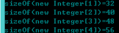
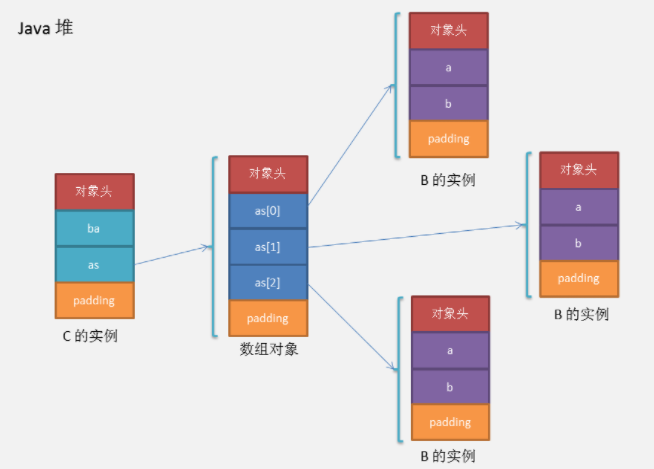

# Java对象内存大小计算

**JavaClass基本结构：**

| 名称     | 占用字节                    |
| -------- | --------------------------- |
| Class头  | 8字节                       |
| oop指针  | 4字节                       |
| 数据区域 | 不定                        |
| 对其补充 | 补充到整个大小为8字节的倍数 |

- Class头8个字节， 存储了比如这个实例目前的锁信息、目前属于的堆类型等

- oop指针，存储的是这个类的定义，比如Java反射可以拿到字段名称，方法名称这些值都是存储在这个指针所指向的定义中

- 数据区域，存放数据的区域，这里的结构区分主要是两种：数组和非数组。如果是数组，数据区域中还会包含这个数组的大小

**计算Java对象内存大小有三种方式：**

- AgentSizeOf : 使用jvm代理和Instrumentation

- UnsafeSizeOf : 使用unsafe

- ReflectionSizeOf : 通过反射出来Class的成员，通过成员类型进行计算

**实例数据：**

原生类型(primitive type)的内存占用如下：

| Primitive Type | Memory Required(bytes)                 |
| -------------- | -------------------------------------- |
| boolean        | 在数组中占1个字节，单独使用时占4个字节 |
| byte           | 1                                      |
| short          | 2                                      |
| char           | 2                                      |
| int            | 4                                      |
| float          | 4                                      |
| long           | 8                                      |
| double         | 8                                      |

reference类型在32位系统上每个占用4bytes, 在64位系统上每个占用8bytes。

关于boolean内存占用 https://www.cnblogs.com/wangtianze/p/6690665.html?utm_source=itdadao&utm_medium=referral

**对齐填充**

HotSpot的对齐方式为8字节对齐：

> （对象头 + 实例数据 + padding） % 8等于0且0 <= padding < 8

**指针压缩**

对象占用的内存大小收到VM参数UseCompressedOops的影响。32G内存以下的，默认开启对象指针压缩。

**1）对对象头的影响**

开启`（-XX:+UseCompressedOops）`对象头大小为12bytes（64位机器）。

```java
static class A {
	int a;
}
```

A对象占用内存情况：

关闭指针压缩： `16(对象头)+4(实例数据)=20不是8的倍数，因此需要对齐填充 16+4+4(padding)=24`

开启指针压缩： `12+4=16已经是8的倍数了，不需要再padding。`

**2） 对reference类型的影响**

64位机器上reference类型占用8个字节，开启指针压缩后占用4个字节。

```java
static class B2 {
    int b2a;
    Integer b2b;
}
```

B2对象占用内存情况：

关闭指针压缩： `16+4+8=28不是8的倍数，需要对齐填充 16+4+8+4(padding)=32`

开启指针压缩： `12+4+4=20不是8的倍数，需要对齐填充12+4+4+4(padding)=24`


**数组对象**

64位机器上，数组对象的对象头占用24个字节（8字节MarkWord+8字节类型指针+8字节数组长度），启用压缩之后占用16个字节（8字节MarkWord+4字节类型指针+4字节数组长度）。之所以比普通对象占用内存多是因为需要额外的对象头空间存储数组的长度。

先考虑下new Integer[0]占用的内存大小，数组长度为0，所以所占用的大小就是对象头的大小：

未开启压缩：24bytes

开启压缩后：16bytes

接着计算new Integer[1]，new Integer[2]，new Integer[3]和new Integer[4]就很容易了：

未开启压缩：



开启压缩：


拿new Integer[3]来具体解释下：

未开启压缩：`24（对象头）+ 8*3 = 48，不需要padding；`

开启压缩：`16（对象头）+ 4*3 = 28，需要对齐填充 28 + 4(padding) = 32，其他依次类推。`

自定义类的数组也是一样的，比如：

```java
static class B3 {
    int a;
    Integer b;
}
```

new B3[3]占用的内存大小：

未开启压缩：`24（对象头）+ 8*3 = 48`

开启压缩后：`16（对象头）+ 4*3 + 4(padding) = 32`


**复合对象**

计算复合对象占用内存的大小其实就是运用上面几条规则，只是麻烦点。

**1）对象本身的大小**

直接计算当前对象占用空间大小，包括当前类及超类的基本类型实例字段大小、引用类型实例字段引用大小、实例基本类型数组总占用空间、实例引用类型数组引用本身占用空间大小; 但是不包括超类继承下来的和当前类声明的实例引用字段的对象本身的大小、实例引用数组引用的对象本身的大小。

```java
static class B {
    int a;
    int b;
}
static class C {
    int ba;
    B[] as = new B[3];
    C() {
        for (int i = 0; i < as.length; i++) {
            as[i] = new B();
        }
    }
}
```

计算C对象的大小：

未开启压缩：`16（对象头）+ 4（ba）+ 8（as引用的大小）+ 4(padding) = 32`

开启压缩：`12（对象头）+ 4（ba）+4（as引用的大小）+ 4(padding) = 24`


**2)当前对象占用的空间总大小**

递归计算当前对象占用空间总大小，包括当前类和超类的实例字段大小以及实例字段引用对象大小。

递归计算复合对象占用的内存的时候需要注意的是：对齐填充是以每个对象为单位进行的，看下面这个图就很容易明白。



现在我们来手动计算下C对象占用的全部内存是多少，主要是三部分构成：C对象本身的大小+数组对象的大小+B对象的大小。

未开启压缩：

`(16 + 4 + 8+4(padding)) + (24+ 8*3) +(16+4+4)*3 = 152bytes`

开启压缩：

`(12 + 4 + 4 +4(padding)) + (16 + 4*3 +4(数组对象padding)) + (12+4+4+4（B对象padding)) *3= 128bytes`


**继承关系**

涉及继承关系的时候有一个最基本的规则：首先存放父类中的成员，接着才是子类中的成员, 父类也要按照 8 byte 规定。

```java
public static class D {
    byte d1;
}
public static class E extends D {
    byte e1;
}
```

计算E对象的大小：

未开启压缩：`16（对象头） + 父类(1(d1) + 7(padding)) + 1(e1) + 7(padding) = 32`

开启压缩：`12（对象头） + 父类(1(d1) + 7(padding)) + 1(e1) + 3(padding) = 24`


# 反射

```java
首先 Class c = ArrayList.class;
```


## 判断变量是否为基础数据类型

```java
c.isPrimitive()
```


## 判断c是否是List类的父类

```java
c.isAssignableFrom(List.class)
```


## 判断c是否是List类的子类

```java
c isinstanceof List
```


## 获取包含泛型类型的类型以及泛型真正的类型

```java
Map<String,Integer> map = new HashMap<String,Integer>();
Field f = c.getDeclaredField("map");
// 获取包含泛型的类型
Type t = f.getGenericType();
/**
  * Type这个类里面没有任何的方法，所以需要调用子类的方法，那么大的类型转到小的类型，需要强转！
*/
ParameterizedType pt = (ParameterizedType)t;//强转到其子类
/**
 *  Type[] getActualTypeArguments()
    返回表示此类型实际类型参数的 Type对象的数组。
    Type getOwnerType()
    返回 Type 对象，表示此类型是其成员之一的类型。
    Type getRawType()
    返回 Type 对象，表示声明此类型的类或接口。
*/
t = pt.getRawType();//类型的类或接口
// 获取泛型真正的类型
Type[] ts = pt.getActualTypeArguments();
```

# 多线程

## 原子变量

### AtomicReferenceFieldUpdater

**作用**

```
这是一个基于反射的工具类，它能对指定类的【指定的volatile引用字段】进行【原子更新】。(注意这个字段不能是private的) 
简单来讲：就是对某个类中，被volatile修饰的字段进行原子更新。 
```

**用法**

此类接收三个参数：

- 字段所在的类
- 字段的类型
- 更新字段的内容

示例：

```java
class Person {
	volatile String name="老刘";  
}
class Test{
    public static void main(String[] args){
        AtomicReferenceFieldUpdater updater = AtomicReferenceFieldUpdater.newUpdater(Person.class, String.class, "name");  
        Person person = new Person()；
        updater.compareAndSet(person, person.name,"老王") ;  
        System.out.println(Person.name); 
    }
}
```

## 公平锁和非公平锁

非公平锁在调用 lock 后，首先就会调用 CAS 进行一次抢锁，如果这个时候恰巧锁没有被占用，那么直接就获取到锁返回了。

非公平锁在 CAS 失败后，和公平锁一样都会进入到 tryAcquire 方法，在 tryAcquire 方法中，如果发现锁这个时候被释放了（state == 0），非公平锁会直接 CAS 抢锁，但是公平锁会判断等待队列是否有线程处于等待状态，如果有则不去抢锁，乖乖排到后面。

## 自旋锁

**自旋锁（spinlock）**：是指当一个线程在获取锁的时候，如果锁已经被其它线程获取，那么该线程将循环等待，然后不断的判断锁是否能够被成功获取，直到获取到锁才会退出循环。

获取锁的线程一直处于活跃状态，但是并没有执行任何有效的任务，使用这种锁会造成busy\-waiting。

示例：

```java
public class SpinLock {
    private AtomicReference cas = new AtomicReference();
    
    public void lock() {
        Thread current = Thread.currentThread();
        // 利用CAS
        while (!cas.compareAndSet(null, current)) {
        	// DO nothing
        }
    }

	public void unlock() {
        Thread current = Thread.currentThread();
        cas.compareAndSet(current, null);
    }
}
```


**自旋锁存在的问题：**

- 如果某个线程持有锁的时间过长，就会导致其它等待获取锁的线程进入循环等待，消耗CPU。使用不当会造成CPU使用率极高。

- 上面Java实现的自旋锁不是公平的，即无法满足等待时间最长的线程优先获取锁。不公平的锁就会存在“线程饥饿”问题。

**自旋锁的优点：**

​	自旋锁不会使线程状态发生切换，一直处于用户态，即线程一直都是active的；不会使线程进入阻塞状态，减少了不必要的上下文切换，执行速度快。

​	非自旋锁在获取不到锁的时候会进入阻塞状态，从而进入内核态，当获取到锁的时候需要从内核态恢复，需要线程上下文切换。 （线程被阻塞后便进入内核（Linux）调度状态，这个会导致系统在用户态与内核态之间来回切换，严重影响锁的性能）。

### 可重入的自旋锁和不可重入的自旋锁

上面那段Java代码，仔细分析一下就可以看出，它是不支持重入的，即当一个线程第一次已经获取到了该锁，在锁释放之前又一次重新获取该锁，第二次就不能成功获取到。由于不满足CAS，所以第二次获取会进入while循环等待，而如果是可重入锁，第二次也是应该能够成功获取到的。

而且，即使第二次能够成功获取，那么当第一次释放锁的时候，第二次获取到的锁也会被释放，而这是不合理的。

为了实现可重入锁，我们需要引入一个计数器，用来记录获取锁的线程数。

```java
public class ReentrantSpinLock {
    private AtomicReference cas = new AtomicReference();
    private int count;

    public void lock() {
        Thread current = Thread.currentThread();
        if (current == cas.get()) { // 如果当前线程已经获取到了锁，线程数增加一，然后返回
            count++;
            return;
        }
        // 如果没获取到锁，则通过CAS自旋
        while (!cas.compareAndSet(null, current)) {
        	// DO nothing
        }
    }

    public void unlock() {
    	Thread cur = Thread.currentThread();
    	if (cur == cas.get()) {
    		if (count > 0) {// 如果大于0，表示当前线程多次获取了该锁，释放锁通过count减一来模拟
    			count--;
    		} else {// 如果count==0，可以将锁释放，这样就能保证获取锁的次数与释放锁的次数是一致的了。
    			cas.compareAndSet(cur, null);
    		}
    	}
	}
}
```

### 自旋锁的其他变种

**1. TicketLock**

TicketLock主要解决的是公平性的问题。

思路：每当有线程获取锁的时候，就给该线程分配一个递增的id，我们称之为排队号，同时，锁对应一个服务号，每当有线程释放锁，服务号就会递增，此时如果服务号与某个线程排队号一致，那么该线程就获得锁，由于排队号是递增的，所以就保证了最先请求获取锁的线程可以最先获取到锁，就实现了公平性。

可以想象成银行办理业务排队，排队的每一个顾客都代表一个需要请求锁的线程，而银行服务窗口表示锁，每当有窗口服务完成就把自己的服务号加一，此时在排队的所有顾客中，只有自己的排队号与服务号一致的才可以得到服务。

实现代码：

```java
public class TicketLock {
    /**
    * 服务号
    */
    private AtomicInteger serviceNum = new AtomicInteger();

    /**
    * 排队号
    */
    private AtomicInteger ticketNum = new AtomicInteger();

    /**
    * lock:获取锁，如果获取成功，返回当前线程的排队号，获取排队号用于释放锁.
    *
    * @return
    */
    public int lock() {
        int currentTicketNum = ticketNum.incrementAndGet();
        while (currentTicketNum != serviceNum.get()) {
            // Do nothing
        }
        return currentTicketNum;
    }

    /**
    * unlock:释放锁，传入当前持有锁的线程的排队号
    *
    * @param ticketnum
    */
    public void unlock(int ticketnum) {
        serviceNum.compareAndSet(ticketnum, ticketnum + 1);
    }
}
```

上面的实现方式是，线程获取锁之后，将它的排队号返回，等该线程释放锁的时候，需要将该排队号传入。但这样是有风险的，因为这个排队号是可以被修改的，一旦排队号被不小心修改了，那么锁将不能被正确释放。一种更好的实现方式如下：

```java
public class TicketLockV2 {
    /**
    * 服务号
    */
    private AtomicInteger serviceNum = new AtomicInteger();
    /**
    * 排队号
    */
    private AtomicInteger ticketNum = new AtomicInteger();
    /**
    * 新增一个ThreadLocal，用于存储每个线程的排队号
    */
    private ThreadLocal ticketNumHolder = new ThreadLocal();

    public void lock() {
        int currentTicketNum = ticketNum.incrementAndGet();
        // 获取锁的时候，将当前线程的排队号保存起来
        ticketNumHolder.set(currentTicketNum);
        while (currentTicketNum != serviceNum.get()) {
            // Do nothing
        }
    }

    public void unlock() {
        // 释放锁，从ThreadLocal中获取当前线程的排队号
        Integer currentTickNum = ticketNumHolder.get();
        serviceNum.compareAndSet(currentTickNum, currentTickNum + 1);
    }
}
```

上面的实现方式是将每个线程的排队号放到了ThreadLocal中。

**TicketLock存在的问题**

多处理器系统上，每个进程/线程占用的处理器都在读写同一个变量serviceNum ，每次读写操作都必须在多个处理器缓存之间进行缓存同步，这会导致繁重的系统总线和内存的流量，大大降低系统整体的性能。

下面介绍的MCSLock和CLHLock就是解决这个问题的。

**2. CLHLock**

CLH锁是一种基于链表的可扩展、高性能、公平的自旋锁，申请线程只在本地变量上自旋，它不断轮询前驱的状态，如果发现前驱释放了锁就结束自旋，获得锁。

实现代码如下：

```java
import java.util.concurrent.atomic.AtomicReferenceFieldUpdater;

public class CLHLock {
    /**
    * 定义一个节点，默认的lock状态为true
    */
    public static class CLHNode {
        private volatile boolean isLocked = true;
    }
    /**
    * 尾部节点,只用一个节点即可
    */
    private volatile CLHNode tail;
    private static final ThreadLocal LOCAL = new ThreadLocal();
    private static final AtomicReferenceFieldUpdater UPDATER = AtomicReferenceFieldUpdater.newUpdater(CLHLock.class, CLHNode.class, "tail");

    public void lock() {
    	// 新建节点并将节点与当前线程保存起来
    	CLHNode node = new CLHNode();
    	LOCAL.set(node);
    	// 将新建的节点设置为尾部节点，并返回旧的节点（原子操作），这里旧的节点实际上就是当前节点的前驱节点
    	CLHNode preNode = UPDATER.getAndSet(this, node);
        if (preNode != null) {
            // 前驱节点不为null表示当锁被其他线程占用，通过不断轮询判断前驱节点的锁标志位等待前驱节点释放锁
            while (preNode.isLocked) {
            }
            preNode = null;
            LOCAL.set(node);
        }
    	// 如果不存在前驱节点，表示该锁没有被其他线程占用，则当前线程获得锁
    }

    public void unlock() {
        // 获取当前线程对应的节点
        CLHNode node = LOCAL.get();
        // 如果tail节点等于node，则将tail节点更新为null，同时将node的lock状态职位false，表示当前线程释放了锁
        if (!UPDATER.compareAndSet(this, node, null)) {
        	node.isLocked = false;
        }
        node = null;
    }
}
```

**3. MCSLock**

MCSLock则是对本地变量的节点进行循环。

```java
public class MCSLock {
    /**
    * 节点，记录当前节点的锁状态以及后驱节点
    */
    public static class MCSNode {
        volatile MCSNode next;
        volatile boolean isLocked = true;
    }
	private static final ThreadLocal NODE = new ThreadLocal();

    // 队列
    @SuppressWarnings("unused")
    private volatile MCSNode queue;
    // queue更新器
    private static final AtomicReferenceFieldUpdater UPDATER = AtomicReferenceFieldUpdater.newUpdater(MCSLock.class, MCSNode.class, "queue");
    
    public void lock() {
        // 创建节点并保存到ThreadLocal中
        MCSNode currentNode = new MCSNode();
        NODE.set(currentNode);
        // 将queue设置为当前节点，并且返回之前的节点
        MCSNode preNode = UPDATER.getAndSet(this, currentNode);
        if (preNode != null) {
            // 如果之前节点不为null，表示锁已经被其他线程持有
            preNode.next = currentNode;
            // 循环判断，直到当前节点的锁标志位为false
            while (currentNode.isLocked) {
            }
        }
    }

    public void unlock() {
    	MCSNode currentNode = NODE.get();
    	// next为null表示没有正在等待获取锁的线程
    	if (currentNode.next == null) {
    		// 更新状态并设置queue为null
    		if (UPDATER.compareAndSet(this, currentNode, null)) {
    			// 如果成功了，表示queue==currentNode,即当前节点后面没有节点了
    			return;
    		} else {
    			// 如果不成功，表示queue!=currentNode,即当前节点后面多了一个节点，表示有线程在等待
    			// 如果当前节点的后续节点为null，则需要等待其不为null（参考加锁方法）
    			while (currentNode.next == null) {
    			}
    		}
    	} else {
    		// 如果不为null，表示有线程在等待获取锁，此时将等待线程对应的节点锁状态更新为false，同时将当前线程的后继节点设为null
    		currentNode.next.isLocked = false;
    		currentNode.next = null;
    	}
    }
}
```

**CLHLock 和 MCSLock**都是基于链表，不同的是CLHLock是基于隐式链表，没有真正的后续节点属性，MCSLock是显示链表，有一个指向后续节点的属性。

将获取锁的线程状态借助节点(node)保存,每个线程都有一份独立的节点，这样就解决了TicketLock多处理器缓存同步的问题。

### 自旋锁与互斥锁

自旋锁与互斥锁都是为了实现保护资源共享的机制。

无论是自旋锁还是互斥锁，在任意时刻，都最多只能有一个保持者。

获取互斥锁的线程，如果锁已经被占用，则该线程将进入睡眠状态；获取自旋锁的线程则不会睡眠，而是一直循环等待锁释放。

### 总结

**自旋锁**：线程获取锁的时候，如果锁被其他线程持有，则当前线程将循环等待，直到获取到锁。

自旋锁等待期间，线程的状态不会改变，线程一直是用户态并且是活动的(active)。

自旋锁如果持有锁的时间太长，则会导致其它等待获取锁的线程耗尽CPU。

自旋锁本身无法保证公平性，同时也无法保证可重入性。

基于自旋锁，可以实现具备公平性和可重入性质的锁。

**TicketLock：**采用类似银行排号叫好的方式实现自旋锁的公平性，但是由于不停的读取serviceNum，每次读写操作都必须在多个处理器缓存之间进行缓存同步，这会导致繁重的系统总线和内存的流量，大大降低系统整体的性能。

**CLHLock和MCSLock**通过链表的方式避免了减少了处理器缓存同步，极大的提高了性能，区别在于CLHLock是通过轮询其前驱节点的状态，而MCS则是查看当前节点的锁状态。

CLHLock在NUMA架构下使用会存在问题。在没有cache的NUMA系统架构中，由于CLHLock是在当前节点的前一个节点上自旋，NUMA架构中处理器访问本地内存的速度高于通过网络访问其他节点的内存，所以CLHLock在NUMA架构上不是最优的自旋锁。

## CyclicBarrier

循环栅栏。它的作用就是会让所有线程都等待完成后才会继续下一步行动。举个例子：5个人（5个线程）去餐厅吃饭，规定只有五个人全部到齐了才能进去。

示例：

```java
public class CyclicBarrierDemo {

    static class TaskThread extends Thread {
        CyclicBarrier barrier;
        public TaskThread(CyclicBarrier barrier) {
            this.barrier = barrier;
        }
        @Override
        public void run() {
            try {
                Thread.sleep(1000);
                System.out.println(getName() + " 到达栅栏 A");
                barrier.await();
                System.out.println(getName() + " 冲破栅栏 A");
                
                Thread.sleep(2000);
                System.out.println(getName() + " 到达栅栏 B");
                barrier.await();
                System.out.println(getName() + " 冲破栅栏 B");
            } catch (Exception e) {
                e.printStackTrace();
            }
        }
    }
    public static void main(String[] args) {
        int threadNum = 5;
        CyclicBarrier barrier = new CyclicBarrier(threadNum, new Runnable() {
            @Override
            public void run() {
                System.out.println(Thread.currentThread().getName() + " 完成最后任务");
            }
        });
        for(int i = 0; i < threadNum; i++) {
            new TaskThread(barrier).start();
        }
    }
}
```

输出：

```
Thread-1 到达栅栏 A
Thread-3 到达栅栏 A
Thread-0 到达栅栏 A
Thread-4 到达栅栏 A
Thread-2 到达栅栏 A
Thread-2 完成最后任务
Thread-2 冲破栅栏 A
Thread-1 冲破栅栏 A
Thread-3 冲破栅栏 A
Thread-4 冲破栅栏 A
Thread-0 冲破栅栏 A
Thread-4 到达栅栏 B
Thread-0 到达栅栏 B
Thread-3 到达栅栏 B
Thread-2 到达栅栏 B
Thread-1 到达栅栏 B
Thread-1 完成最后任务
Thread-1 冲破栅栏 B
Thread-0 冲破栅栏 B
Thread-4 冲破栅栏 B
Thread-2 冲破栅栏 B
Thread-3 冲破栅栏 B
```

**CyclicBarrier 使用场景**

可以用于多线程计算数据，最后合并计算结果的场景。

**CyclicBarrier 与 CountDownLatch 区别**

- CountDownLatch 是一次性的，CyclicBarrier 是可循环利用的
- CountDownLatch 参与的线程的职责是不一样的，有的在倒计时，有的在等待倒计时结束。CyclicBarrier 参与的线程职责是一样的。

## Semaphore

Semaphore(信号量)：是一种计数器，用来保护一个或者多个共享资源的访问。如果线程要访问一个资源就必须先获得信号量。如果信号量内部计数器大于0，信号量减1，然后允许共享这个资源；否则，如果信号量的计数器等于0，信号量将会把线程置入休眠直至计数器大于0。当信号量使用完时，必须释放。

构造方法：

```java
/**
 * @permits 初始化计数器
 * @fair 是否公平
 */
Semaphore(int permits, boolean fair)

/**
 * @permits 初始化计数器
 */
Semaphore(int permits)
```

使用示例：

```java
Semaphore semaphore = new Semaphore(10, true);
semaphore.acquire();
// do something here
semaphore.release();
```


# 关键字

## strictfp

<span style="font-weight:bold">strictfp，即strict float point（精确浮点）</span>

strictfp 关键字可应用于类、接口或方法。使用 strictfp 关键字声明一个方法时，该方法中所有的float和double表达式都严格遵守FP-strict的限制,符合IEEE-754规范。当对一个类或接口 使用 strictfp 关键字时，该类中的所有代码，包括嵌套类型中的初始设定值和代码，都将严格地进行计算。严格约束意味着所有表达式的结果都必须是 IEEE 754 算法对操作数预期的结果，以单精度和双精度格式表示。
　　如果你想让你的浮点运算更加精确，而且不会因为不同的硬件平台所执行的结果不一致的话，可以用关键字strictfp.

例子如下：

不使用strictfp：

```java
public class Test {
    private static double aDouble = 0.0555500333333212d;
    private static float aFloat = 0.0333000000222f;
    public static void main(String[] args) {
        double cDouble = aDouble / aFloat;
        System.out.println("aDouble: " + aDouble);
        System.out.println("aFloat: " + aFloat);
        System.out.println("cDouble: " + cDouble);
    }
}
```

使用strictfp：

```java
public strictfp class Test {
    private static double aDouble = 0.0555500333333212d;
    private static float aFloat = 0.0333000000222f;
    public static void main(String[] args) {
        double cDouble = aDouble / aFloat;
        System.out.println("aDouble: " + aDouble);
        System.out.println("aFloat: " + aFloat);
        System.out.println("cDouble: " + cDouble);
    }
}
```

结果：

不使用strictfp：

```java
aDouble:0.0555500333333212
aFloat:3.33000016E11
cDouble:1.6681690896577544E-13
```


使用strictfp：

```java
aDouble:0.0555500333333212
aFloat:0.0333
cDouble:1.668169110346482
```

# 权限控制

| 修饰词     | 本类 | 同一个包的类 | 继承类 | 其他类 |
| ---------- | ---- | ------------ | ------ | ------ |
| private    | 1    | 0            | 0      | 0      |
| 无（默认） | 1    | 1            | 0      | 0      |
| protected  | 1    | 1            | 1      | 0      |
| public     | 1    | 1            | 1      | 1      |

# 注解

## @PostConstruct与@PreDestory

从Java EE 5规范开始，Servlet中增加了两个影响Servlet生命周期的注解（Annotation）：

@PostConstruct和@PreDestory

这两个注解被用来修饰一个非静态的void()方法，而且这个方法不能有抛出异常声明。写法有如下两种方式：

```java
@PostConstruct
public void someMethod(){}
```

或者

```java
public @PostConstruct void someMethod(){}
```

被@PostConstruct修饰的方法会在服务器加载Servlet的时候运行，并且只会被服务器执行一次。@PostConstruct修饰的方法在构造函数之后执行，在init()方法之前执行。@PreDestory修饰的方法在destroy()方法执行之后执行，在Servlet被彻底卸载之前执行。


使用场景：

在servlet初始化加载之前可能会需要处理一些东西，像加载缓存，加载线程池等，此时@PostConstruct就能派上用场了，当然，也可以不使用该注解，如果我们要加载或处理某些东西，我们完全可以在构造器初始化的时候就直接处理掉，只不过这种方法需要自己重写构造器。


另外，spring中Constructor、@Autowired、@PostConstruct的顺序

其实从依赖注入的字面意思就可以知道，要将对象p注入到对象a，那么首先就必须得生成对象a和对象p，才能执行注入。所以，如果一个类A中有个成员变量p被@Autowried注解，那么 **@Autowired注入是发生在A的构造方法执行完之后的**。

如果想在生成对象时完成某些初始化操作，而偏偏这些初始化操作又依赖于依赖注入，那么久无法在构造函数中实现。为此，可以使用@PostConstruct注解一个方法来完成初始化，**@PostConstruct注解的方法将会在依赖注入完成后被自动调用**。

Constructor >> @Autowired >> @PostConstruct

举例： 

```java
public class AAA{
    @Autowired
    private BBB b;
    
    public AAA(){
        System.out.println("此时b还未被注入：b = " + b);
    }
    
    @PostConstruct
    private void init(){
        System.out.println("@PostConstruct将在依赖注入完成之后被自动调用：b = " + b);
    }
}
```

## @Produces

作用类似springmvc中`@RequestMapping中的属性produces`

参考：https://blog.csdn.net/shadowcw/article/details/88093081

# 生成随机值

## UUID包的使用

```java
UUID.randomUUID();
```

# Websocket

具体看`alg-manager`

# 雪花算法

具体使用方法查看hutool源码或deya门户项目源码

# jarFile

jarFile可用于读取jar文件中的内容

应用场景：比方说有时候我们需要读取jar文件中某个class的注解，但是jar文件是被打包过的，没办法直接读取到它里面的内容，此时就可以用jarFile

参考文章：https://blog.csdn.net/qq_40951086/article/details/78580665

# RunTime

用于执行shell命令、获取计算机cpu核数等

# java中的各种命令参数

- 命令行参数

  ```
  命令行参数就是类似与c语言的命令行参数，这些参数会传给main函数，也就是java中 public static void main(String[] args) 的那个String数组。但是需要注意的是，c语言的main行数中传入的参数，arv[0]是程序本身的名字，比如program1 option1 option2,那么arv[0]就是program1本身。但是java的命令函参数确实从0开始的，也就是说，java中的第一个命令行参数是的args[0]，举个例子 java program1 option1 option2 运行一个java程序的话，args[0]获取到的是option1。
  ```

- 系统属性参数

  ```
  系统属性参数也是供应用程序使用的，并且是以key=value这样的形式提供的，在程序的任何一个地方，都可以通过System.getProperty("key")获取到对应的value值。
  
  在官方文档中对系统属性参数的描述是这样的：
  Set a system property value. If value is a string that contains spaces, you must enclose the string in double quotes:
  java -Dfoo="some string" SomeClass
  
  系统属性参数传入的时候需要带一个横杆和大写字母D，比如-Dfuck.abc="1234"这样的。在你业务代码中，你就可以使用它了：System.getProperty("fuck.abc")，获取"1234"。不过系统属性参数一般都是用来开启一些官方开关的，比如加入-Djdk.internal.lambda.dumpProxyClasses="/home/xxx"，你就可以把java8中lambda表达式的代理类字节码dump出来。
  ```

- jvm参数

  ```
  jvm参数就是和jvm相关的参数了，比如配置gc、配置堆大小、配置classpath等等
  jvm参数分为标准参数、扩展参数和不稳定参数
  标准参数是一定有效，向后兼容的，且所有的jvm都必须要实现的，比如-classpath，这类参数是横杆直接跟参数名
  扩展参数是不保证向后向后兼容，不强值要求所有jvm实现都要支持，不保证后续版本不会取消的，这类参数的形式是-Xname，横杠和一个大写的X开头
  不稳定参数就是非常不稳定，可能只是特定版本的，特点是-XXname，横杆后带两个大写X开头
  ```

如果想查看具体的参数的含义，最好的方法就是看官方文档，或者直接man java一下，也可以参考这篇文章[《Java 命令行运行参数》](https://www.cnblogs.com/jtlgb/p/8466138.html)

其实，只要java -h以下，就可以看到这些说明。java命令的语法为：

```
java [-options] class [args...]
           (to execute a class)
```

或者

```
java [-options] -jar jarfile [args...]
           (to execute a jar file)
```

所以，前面说的严格意义上全都是不对的，java中的命令行参数只有option 和 args两类。上面说的三类中第一类对应args，后面两类都是属于option的，那才是jvm的参数。

# spring boot 传递参数

spring boot 打成jar包后 通过命令行传入的参数有3种实现方式：

```
java -jar xxx.jar aaa bbb cccc
传了3个参数，分别是aaa,bbb,ccc
通过main方法的参数获取
```

```
java -jar xxx.jar -Da1=aaa -Db1=bbb -Dc1=ccc
通过  System.getProperty("aaa","1"); 方式获取，作为环境变量
注意：java -Xms10m -Xmx512m xx.jar -DconfigPath=/root 可能不生效-D配置，在程序中读取不到
最好改成：java -Xms10m -Xmx512m -DconfigPath=/root xx.jar 这样就可以读取到了
```

```
java -jar xxx.jar --a1=aaa --b1=bbb --server.port=8080
是springboot的写法，可以通过@Value("${a1}") 获取；
--server.port=8080可以直接指定spring boot的端口号
```

# JUnit单元测试

关于注解`@ExtendWith（SpringExtension.class）`与`@ExtendWith（MockitoExtension.class）`的讨论：

```
当涉及Spring时：
如果你想在测试中使用Spring测试框架功能（例如@MockBean），则必须使用@ExtendWith(SpringExtension.class)。它取代了不推荐使用的JUnit4@RunWith(SpringJUnit4ClassRunner.class)

当不涉及Spring时：
如果你只想涉及Mockito而不必涉及Spring，比如当你只想使用@Mock/@InjectMocks注解时，你可能就会只想使用@ExtendWith(MockitoExtension.class)，因为它不会加载很多不需要的Spring的东西。它替换了不推荐使用的JUnit4 @RunWith(MockitoJUnitRunner.class)。
```

# Stream流处理

对于流其实已经了解的差不多了，包括里面的重点：平行流（`parallel()和parallelStream()`）和串行流（`sequential`），再补充几个：

具体使用参考博客：https://blog.csdn.net/qq_31865983/article/details/106443244（`Java8 Stream API` 之 `IntStream` 用法全解）、https://blog.csdn.net/a13662080711/article/details/84928181（`Arrays.stream()`）、https://www.cnblogs.com/baby123/p/12619872.html（`Arrays.asList`与`Arrays.stream`）

# lambda表达式分组、过滤、求和、最值、排序、去重

参考：https://blog.csdn.net/gsls200808/article/details/86501905（java 8 lambda表达式list操作分组、过滤、求和、最值、排序、去重）

# SLF4J及其MDC详解

参考：https://blog.csdn.net/taiyangdao/article/details/82860105（SLF4J及其MDC详解）、https://www.cnblogs.com/sealedbook/p/6227452.html（SLF4J中的MDC）

# 在线诊断工具 Arthas

导读：虽然已经有很多分析工具 `jvisualvm,jstat,jmap,jstack,Memory Analyzer`等。但可能不是大杂烩或者线上无法分析等。所以看看`arthas`的功能，好用就用它了。

Arthas 是Alibaba开源的Java诊断工具，深受开发者喜爱。当你遇到以下类似问题而束手无策时，Arthas可以帮助你解决：

- 这个类从哪个 jar 包加载的？为什么会报各种类相关的 Exception？
- 我改的代码为什么没有执行到？难道是我没 commit？分支搞错了？
- 遇到问题无法在线上 debug，难道只能通过加日志再重新发布吗？
- 线上遇到某个用户的数据处理有问题，但线上同样无法 debug，线下无法重现！
- 是否有一个全局视角来查看系统的运行状况？
- 有什么办法可以监控到JVM的实时运行状态？
- 怎么快速定位应用的热点，生成火焰图？

参考：https://arthas.aliyun.com/doc/（Arthas官方文档）

# BIO与NIO、AIO的区别

参考：

- https://blog.csdn.net/ty497122758/article/details/78979302?utm_source=app&app_version=5.1.1（Java BIO与NIO、AIO的区别）
- https://blog.csdn.net/m0_38109046/article/details/89449305（Java面试常考的 BIO，NIO，AIO 总结）
- https://my.oschina.net/u/3471412/blog/2966696（Java 核心 深入理解BIO、NIO、AIO）
- https://blog.csdn.net/liuningwjt/article/details/82379364（IO/NIO/AIO 基本概念）
- https://blog.csdn.net/scugxl/article/details/86742171（Java中的BIO,NIO,AIO详解以及Echo实现示例）

# 高性能网络应用框架 Netty

参考：

- https://www.jianshu.com/p/b9f3f6a16911（Netty入门教程1——认识Netty）、https://www.jianshu.com/p/ed0177a9b2e3（Netty入门教程2——动手搭建HttpServer）、https://www.jianshu.com/p/fd815bd437cd（Netty入门教程3——Decoder和Encoder）、https://www.jianshu.com/p/9d89b2299ce4（Netty入门教程4——实现长连接）

- https://blog.csdn.net/haoyuyang/article/details/53243785（Netty基本使用介绍）
- https://blog.csdn.net/lmdsoft/article/details/105618052（Netty介绍）

# 高性能网络请求开源库okhttp3

参考：https://blog.csdn.net/victor_fang/article/details/88175549（基本使用）、https://blog.csdn.net/victor_fang/article/details/88196410（常用类介绍）、https://blog.csdn.net/victor_fang/article/details/88176344（Interceptor）

# 分布式锁

有三种实现方式：基于数据库实现、基于缓存（redis等）实现、基于Zookeeper实现

参考:https://blog.csdn.net/zhaisharap/article/details/122471322、https://www.zhihu.com/question/452803310/answer/1931377239（深入探讨基于redis和基于Zookeeper实现分布式锁的优点以及存在的问题；深度解析Redlock（红锁）；引入Java工具包Redisson来方便使用基于redis的分布式锁）


关于分布式网络一致性问题可以去研究一下拜占庭将军问题，参考：https://zhuanlan.zhihu.com/p/33666461、https://learnblockchain.cn/2017/11/04/bitcoin-pow/（工作量证明 - POW : Proof of Work）

# Java启动参数`(-, -D, -X, -XX参数)`详解

参考：https://blog.csdn.net/guyue35/article/details/107957859

# SPI机制

 SPI全称为 (Service Provider Interface)，是JDK内置的一种服务提供发现机制。SPI是一种动态替换发现的机制，一种解耦非常优秀的思想。

SPI机制案例：

- JDBC驱动加载案例：利用Java的SPI机制，我们可以根据不同的数据库厂商来引入不同的JDBC驱动包；
- SpringBoot的SPI机制：我们可以在spring.factories中加上我们自定义的自动配置类，事件监听器或初始化器等；
- Dubbo的SPI机制：Dubbo更是把SPI机制应用的淋漓尽致，Dubbo基本上自身的每个功能点都提供了扩展点，比如提供了集群扩展，路由扩展和负载均衡扩展等差不多接近30个扩展点。如果Dubbo的某个内置实现不符合我们的需求，那么我们只要利用其SPI机制将我们的实现替换掉Dubbo的实现即可；

参考：https://blog.csdn.net/ymb615ymb/article/details/123450610（SPI机制是什么？）

# java调用c/c++

有两种比较推荐的方式：JNI工具包和JNA框架

JNI的使用请参考：https://blog.csdn.net/weixin_51763233/article/details/122205288（Java调用C++的步骤详解）

JNA的使用请参考：https://blog.csdn.net/qingzhuyuxian/article/details/122997670（开源框架JNA的使用）

# OutputStream

## ObjectOutputStream

参考：https://blog.csdn.net/ifubing/article/details/115255490（对象输出流）

## ByteArrayOutputStream

ByteArrayOutputStream 对byte类型数据进行写入的类，相当于一个中间缓冲层，将类写入到文件等其他OutputStream。它是对字节进行操作，属于内存操作流。

参考：https://blog.csdn.net/qq_43597675/article/details/88829226（ByteArrayOutputStream详解）

# 枚举实现接口

枚举类型实现接口需要实现接口的抽象方法，此时有两个选择：

一、在枚举类型中重写方法一次。

二、对枚举类型中的每个对象重写一次方法，这样可以做到每个对象的方法都不相同。

参考：https://blog.csdn.net/Demon_LMMan/article/details/113655925（Java中的枚举类型与枚举实现接口的两种方式）

# 远程监控与调试

- 使用idea远程debug调试

  开启远程debug需要配置以下参数：

  `agentlib:jdwp=transport=dt_socket,server=y,suspend=n,address=5005`

  参考：https://blog.csdn.net/w8y56f/article/details/116493681（使用IDEA远程debug调试）

- 使用jmx进行远程监控

  在使用 JMX 对 Java 应用进行监控时，一般会在启动时添加如下参数：

  ```shell
  java \
  -Djava.rmi.server.hostname=192.168.16.237 \
  -Dcom.sun.management.jmxremote.rmi.port=2909 \
  -Dcom.sun.management.jmxremote.port=9009 \
  -Dcom.sun.management.jmxremote.authenticate=false \
  -Dcom.sun.management.jmxremote.ssl=false \
  -jar test.jar
  ```

  参考：https://www.jianshu.com/p/5884b5ecbe1a（为什么要设置`com.sun.management.jmxremote.*`？）

# 静态代理与动态代理

参考：https://cloud.tencent.com/developer/article/1429932（Java 静态代理、Java动态代理、CGLIB动态代理）

# HashMap底层实现原理

参考：https://blog.csdn.net/kun_998/article/details/89480637（HashMap底层实现原理）

