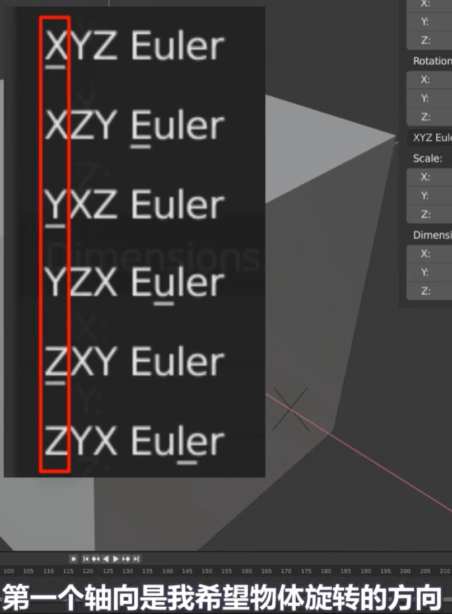
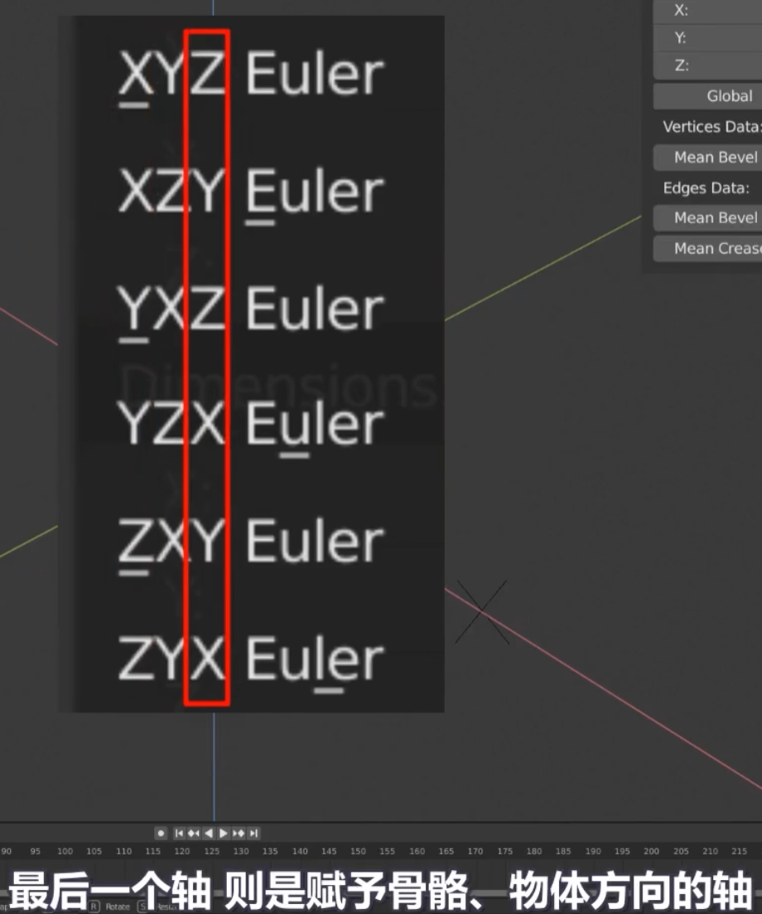
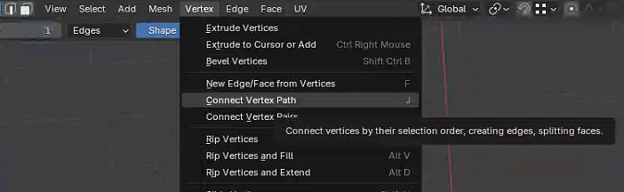

# 材质节点

参考：

https://www.bilibili.com/video/BV1aF411w7qs（材质节点入门教程）

## 平铺贴图

参考：

https://www.bilibili.com/video/BV1H8411y749（每日一练088-blender材质篇之通过使用分数分解贴图进行平铺）

## 矢量置换 Vector Displacement

参考：

https://www.bilibili.com/video/BV1C54y1C7Vs（Blender 节点详解系列 020 矢量置换 Vector Displacement）

## Layer weight

具有Fresnel（菲涅尔）和Facing的信息

Facing为面朝向数据，其中一个用法可以拿来做风格化轮廓勾勒

参考：

https://www.bilibili.com/video/BV1Rw411X736（【中字】Blender风格化卡渲教程：我希望早点知道的 10 个轮廓线技巧-勾勒轮廓）

https://www.bilibili.com/opus/494654003419196409（Blender着色器节点教程 —— Layer Weight）

# 几何节点

参考：

https://www.bilibili.com/video/BV1kv411T7dD（几何节点详解汇总）

https://www.bilibili.com/video/BV1f8BRYsEBJ（（国语）blender基础入门几何节点动态图形教程）

## Geometry proximity（几何接近）

参考：

https://www.bilibili.com/video/BV1c34y1o7Vc（Blender 几何节点详解 几何数据 几何接近 Geometry Proximity）

# 烘焙贴图

参考：

https://blog.csdn.net/weixin_44568736/article/details/128119426（blender 烘焙贴图）

https://www.bilibili.com/video/BV1hY41197vS（blender 11个 烘培贴图案例（大全））

# 重拓扑（Polybuild Tool）

参考：https://blog.csdn.net/ttm2d/article/details/100171329/（Polybuild Tool：Blender自带的重拓扑工具）

# 人物建模

参考：

https://www.bilibili.com/video/BV19w4m1e7Mn（《绝区零》3D角色建模全流程首创，助力0基础快速进阶建模大神/3Dmax|blender建模下载安装教程）

# 布线原理

參考：

https://www.bilibili.com/video/BV1dV411s7Rp（建模布线原理）

# 动画

## 动画曲线编辑器（Graph Editor）

参考：https://blog.csdn.net/ttm2d/article/details/108614472（Blender笔记：动画曲线编辑器（Graph Editor）技巧）

## 姿态库

参考：

https://www.bilibili.com/video/BV14m4y1D7t7（【Blender教程】姿态库）

# 旋转

## 四元数旋转与欧拉旋转

欧拉旋转可以轻松处理物体绕某个轴360°旋转，但四元数旋转处理起来就比较麻烦。

所以在做动画的时候，处理四元数旋转往往需要打更多的关键帧才不会出错。

在绑定骨骼的时候，默认用的是四元数旋转，那么一般会采用这种方法来处理骨骼360°公转：复制一根骨骼b，骨骼b使用欧拉旋转，然后让原骨骼复制骨骼b的旋转。从而保留原骨骼四元数旋转来做其他事情。

但是欧拉旋转有个致命的问题：“万向锁”（由于发生旋转，xyz三个轴中某两个轴重叠到一起时，原本物体能绕3个轴转，此时只能绕2个轴转）

黄金法则：当选择欧拉旋转时，其中一个轴必须锁住

## 万向锁与四元数

参考：https://blog.csdn.net/jkkk_/article/details/125398647（详解四元数）

四元数简单解释：四元数有4个维度xyzw，可以看成是一个旋转轴加一个旋转角就行，xyz归一化后是旋转轴，w是半旋转角的余弦

# 技巧

## 点对齐方法

参考：https://www.jianshu.com/p/7c1c1e738294（关于blender点对齐的方法）

## 点连接技巧

直接按f：仅连接；按j：连接并切割

## 自动合并顶点

一般与吸附工具配合操作

參考：

https://blog.csdn.net/qq_42720695/article/details/138226113（Blender点操作）

## 点、线滑移快捷键

连按两下g键

## 倒角外斜切处理方法

1、3点卡边

2、倒角-外斜切（miter outer）中选择圆弧（Arc）

參考：

https://www.bilibili.com/video/BV1dV411s7Rp（建模布线原理-外角和内角）

## 重构网格以及重构网格修改器

参考：

https://www.bilibili.com/video/BV1oB4y1u7sX（雕刻笔刷用法基础学习-视频最后讲了重构网格以及重构网格修改器）

## 文件格式

png格式的图片可能会存在不能正确显示颜色的问题以及他的size比jpeg要大很多。png可以转成：tif、tga，tif、tga是带alpha通道的，jpeg是不带的。

## 摄像机

### 显示摄像机视角

首先选中右键激活摄像机：

然后对齐视角：

### 锁定摄像机视角

锁定之后就可以随意调整视口显示而不会导致退出摄像机视角

## Driver和custom properties

参考：

https://www.bilibili.com/video/BV1KJ411s7Zk（【Blender高级骨骼绑定】大家期盼已久的教程，请一睹为快-206集Drivers and custom properties）

## 形态键

参考：

https://www.bilibili.com/video/BV1KJ411s7Zk（【Blender高级骨骼绑定】大家期盼已久的教程，请一睹为快-406集shapekeys）

使用形态键+Driver修复动画引发的链式形状改变，参考：

https://www.bilibili.com/video/BV1KJ411s7Zk（【Blender高级骨骼绑定】大家期盼已久的教程，请一睹为快-603集）

## 物体跟随顶点

将顶点设置为parent，场景：挂在衣服上的徽章

参考：

https://www.bilibili.com/video/BV1KJ411s7Zk（【Blender高级骨骼绑定】大家期盼已久的教程，请一睹为快-604集）

## Hook

快捷键：Ctrl+H

可以使得物体跟随移动

参考：

https://www.bilibili.com/video/BV1CVtzeyEcp（（国语）blender基础入门卡通动漫角色建模贴图绑定渲染教程-耳机绑定那一集第31分50秒处）

## 风格化轮廓勾勒

参考：

https://www.bilibili.com/video/BV1Rw411X736（【中字】Blender风格化卡渲教程：我希望早点知道的 10 个轮廓线技巧-勾勒轮廓）

## 材质节点和几何节点之间互相输入/输出变量属性

参考：

https://www.bilibili.com/video/BV1c34y1o7Vc（Blender 几何节点详解 几何数据 几何接近 Geometry Proximity）

# 雕刻

## 造型前期三大利器

- Elastic Grab弹性笔刷
- Grab笔刷
- Snake Hook蛇形钩笔刷

参考：

https://www.bilibili.com/video/BV1oB4y1u7sX（雕刻笔刷用法基础学习 弹性笔刷~G抓取笔刷~蛇形沟笔刷+解释使用延伸技巧）

# 修改器

## 法线权重修改器、法线编辑修改器

参考：

https://www.bilibili.com/video/BV1dV411s7Rp（建模布线原理-法线01、法线02）

## 数据传递修改器

参考：

https://www.bilibili.com/video/BV1sQ4y1E7qg（blender-树木-关于法向数据传递修改器的运用）

## 晶格修改器

骚操作：使用骨骼控制晶格修改器间接控制形体，参考：

https://www.bilibili.com/video/BV1KJ411s7Zk（【Blender高级骨骼绑定】大家期盼已久的教程，请一睹为快-604集）

## Hook修改器

参考：

https://www.bilibili.com/video/BV1KJ411s7Zk（【Blender高级骨骼绑定】大家期盼已久的教程，请一睹为快-604集）

## Mesh deform修改器

参考：

https://www.bilibili.com/video/BV1KJ411s7Zk（【Blender高级骨骼绑定】大家期盼已久的教程，请一睹为快-604集）

# 骨骼

## Bony bone（可弯曲的骨骼）

可以用于制作尾巴、眼部肌肉等

参考：

https://www.bilibili.com/video/BV1KJ411s7Zk（【Blender高级骨骼绑定】大家期盼已久的教程，请一睹为快-605集）

上述视频中还讲解了如何设置bony bone的Start/End handle使其变为曲线操作

## constraint

约束分为变换约束、追踪约束、关系约束

参考：

https://blog.csdn.net/weixin_44568736/article/details/128635617（Blender里的三种绑定 （二）约束）

https://www.bilibili.com/video/BV1EixJe3EsZ（【中配】用示例解释所有约束 | 跟踪约束 | Blender 2.8 | 免费项目文件）

### Damped track阻尼器

参考：

https://www.bilibili.com/video/BV1KJ411s7Zk（【Blender高级骨骼绑定】大家期盼已久的教程，请一睹为快-605集）

### Stretch to

参考：

https://www.bilibili.com/video/BV1KJ411s7Zk（【Blender高级骨骼绑定】大家期盼已久的教程，请一睹为快-605集）

### spline IK

参考：

https://www.bilibili.com/video/BV1CVtzeyEcp（（国语）blender基础入门卡通动漫角色建模贴图绑定渲染教程-耳机绑定那一集）

# 贴图纹理制作工具Substance Designer

参考：

https://www.bilibili.com/video/BV1ki4y1D7K6（Substance Designer入门教程）

https://blog.csdn.net/misaka12807/article/details/132135101（【substance designer】基础节点笔记）

# 贴图绘制工具Substance Painter

参考：

https://www.bilibili.com/video/BV1Hv4y1d7jF（【SP教程】Substance Painter新手入门）

# UV贴图绘制工具C4D（BodyPaint 3D）

参考：

https://www.bilibili.com/video/BV1nL2nYjE4Q（3天能学会的【绝区零】可琳3D角色模型制作教程/3Dmax建模教程-贴图篇）

# 树木建模工具SpeedTree

参考：

https://www.bilibili.com/video/BV1JQ44eTEHN（SpeedTree10.0扫盲教学）

https://blog.csdn.net/u012204304/article/details/112385559（SpeedTree基础：软件入门）

# 插件

## LoopTools

参考：

https://www.bilibili.com/video/BV1eU4y1t7n2（Blender建模必备插件LoopTools快速功能介绍）

## MMD插件使用

参考：

https://www.bilibili.com/video/BV1uc411f7wG（blender /mmd toon使用教程）

## 白嫖插件

### 超级体积雾

参考：

https://www.bilibili.com/video/BV1PQiiYrE1a（【白嫖党系列】超级体积雾UltraVolumetrics发布啦 虚幻引擎5.5版本 详细使用教程）

# MMD资源网站

参考：

https://www.aplaybox.com/（模之屋★）

https://www.mikuclub.org/（初音社）

https://www.aigei.com/3d/mmd（爱给网）

https://bowlroll.net/（B碗）

http://www.deviantart.com/（D站）

https://www.nicovideo.jp/（N站）
