## kubernetes组件介绍

```
MESOS  APACHE  分布式资源管理框架   2019-5  Twitter  》 Kubernetes
 
Docker Swarm  2019-07   阿里云宣布  Docker Swarm  剔除
 
Kubernetes  Google    10年容器化基础架构  borg   GO 语言   Borg 
    特点：
        轻量级：消耗资源小
        开源
        弹性伸缩
        负载均衡：IPVS
 
基础概念： 什么是 Pod   控制器类型  K8S 网络通讯模式 
 
资源清单：资源   掌握资源清单的语法   编写 Pod   掌握 Pod 的生命周期
 
Pod 控制器：掌握各种控制器的特点以及使用定义方式
 
服务发现：掌握 SVC 原理及其构建方式
 
存储：掌握多种存储类型的特点 并且能够在不同环境中选择合适的存储方案（有自己的简介）
 
调度器：掌握调度器原理   能够根据要求把Pod 定义到想要的节点运行
 
安全：集群的认证  鉴权   访问控制 原理及其流程 
 
HELM：Linux yum    掌握 HELM 原理   HELM 模板自定义  HELM 部署一些常用插件
 
运维：修改Kubeadm 达到证书可用期限为 10年     能够构建高可用的 Kubernetes 集群
 
 
服务分类
    有状态服务：DBMS  
    无状态服务：LVS APACHE
     
高可用集群副本数据最好是 >= 3 奇数个
     
APISERVER：所有服务访问统一入口
CrontrollerManager：维持副本期望数目
Scheduler：：负责介绍任务，选择合适的节点进行分配任务
ETCD：键值对数据库  储存K8S集群所有重要信息（持久化）
Kubelet：直接跟容器引擎交互实现容器的生命周期管理
Kube-proxy：负责写入规则至 IPTABLES、IPVS 实现服务映射访问的
COREDNS：可以为集群中的SVC创建一个域名IP的对应关系解析
DASHBOARD：给 K8S 集群提供一个 B/S 结构访问体系
INGRESS CONTROLLER：官方只能实现四层代理，INGRESS 可以实现七层代理
FEDERATION：提供一个可以跨集群中心多K8S统一管理功能
PROMETHEUS：提供K8S集群的监控能力
ELK：提供 K8S 集群日志统一分析介入平台
```


pod与pod之间的访问，包括svc的负载均衡都需要借助kube proxy，kube proxy默认操作防火墙，去进行pod映射

etcd 的官方将它定位成一个可信赖的分布式键值存储服务，它能够为整个分布式集群存储一些关键数据，协助分布式集群的正常运转


etcd，v2版本将数据存到内存，v3版本将数据存到数据卷


etcd通过http协议进行通讯（k8s也是采取http协议进行`C/S`结构的开发）

读写信息会存到Raft，WAL是一个预写日志，也就是说如果想对里面的数据进行更改的话，先生成一个日志存一下，并且会定时对日志进行一个完整的备份（完整 + 临时），具体怎么备份的呢？先备份一个大版本x，然后会有一些新的修改，比方说过了一段时间有一个新的子版本x1，又过了一段时间又有一个新的子版本x2，x3...，到达时间以后会将x、x1、x2、...合成一个新的大版本X，以此类推。为啥要这样呢？就是为了防止x1、x2这些小版本太多，可能导致最后还原的时候太费事费时。并且Raft还会实时将日志包括数据写入到本地磁盘中进行持久化。


### kube-proxy中的ipvs以及LVS

参考：https://www.cnblogs.com/hongdada/p/9758939.html（IPVS负载均衡）、https://www.jianshu.com/p/4a3496b8006a（ipvsadm命令详解）、http://zh.linuxvirtualserver.org/node/5（LVS中文站点、ipvsadm命令参考）

## kubernetes基本概念


在docker中，容器之间是隔离的，ip地址都不一样， 一个应用想通过localhost访问另一个应用是不可能的，除非两个应用合到一个容器中去，变成两个进程

而k8s的pod解决了这个问题：


k8s的pod中可以有一个或多个容器，pod中所有容器的ip地址是共享的，因为pod启起来的时候会先启一个叫“pause”的容器，那么其他容器，比如nginx、php使用的网络栈其实都是pause的网络栈，既然是共享了pause的网络栈，那么nginx直接用localhost就可以访问到php，当然同一个pod中容器的端口不能冲突。

并且，同一个pod不仅共享网络栈，还共享数据卷，也就是说上图nginx和php访问的是同一个数据卷。

### Pod

pod分为：

- 自主式 Pod

  Pod退出了，此类型的Pod不会被创建

- 控制器管理的 Pod

  在控制器的生命周期里，始终要维持Pod的副本数目

### 控制器

**什么是控制器**

Kubernetes中内建了很多controller（控制器），这些相当于一个状态机，用来控制Pod的具体状态和行为

**控制器类型**

- ReplicationController 和 ReplicaSet
- Deployment

- HPA（`ReplicationController & ReplicaSet & Deployment > HPA（Horizontal Pod AutoScaling）`）
- StatefullSet
- DaemonSet
- Job，Cronjob

#### ReplicationController、ReplicaSet

ReplicationController 用来确保容器应用的副本数始终保持在用户定义的副本数，即如果有容器异常退出，会自动创建新的 Pod 来替代；而如果异常多出来的容器也会自动回收。在新版本的 Kubernetes 中建议使用 ReplicaSet 来取代 ReplicationController。

ReplicaSet 跟 ReplicationController 没有本质的不同，只是名字不一样，并且ReplicaSet 支持集合式的 selector；这里的selector是通过标签，通过labels去进行选择集控制，对于RS来说他支持大量的算法来进行标签的匹配，RC是没有的

虽然 ReplicaSet 可以独立使用，但一般还是建议使用 Deployment 来自动管理ReplicaSet ，这样就无需担心跟其他机制的不兼容问题（比如 ReplicaSet 不支持rolling-update 但 Deployment 支持）。

案例：

```yaml
apiVersion: extensions/v1beta1
kind: ReplicaSet
metadata: 
  name: frontend
spec:
  replicas: 3
  selector: 
    matchLabels:
      # key为tier，value为frontend
      tier: frontend
    template: 
      # template下写了一个类似之前我们创建pod的yaml，很好理解，因为rs管理着pod，所以pod的yaml可以嵌套在rs中。之后这种嵌套的思想要有，因为后面经常会用到嵌套
      metadata:
        labels:
          tier: frontend
      spec:
        containers:
        - name: php-redis
          image: gcr.io/google_samples/gb-frontend:v3
          env:
          - name: GET_HOSTS_FROM
            value: dns
          ports: 
          - containerPort: 80
```

由于是RS，因此可以使用`kubectl create xxx -f xxx.yaml`来创建

创建之后可以使用`kubectl get pod --show-labels`来查看labels标签

如果我们想通过命令行给pod添加标签（按上面yaml来看这里原来的标签是tier=frontend，我们给他加一个tier1=frontend1），可以使用`kubectl label pod xxx tier1=frontend1`来做添加；

如果我们想修改pod的标签（比方说把原标签tier=frontend改成tier=frontend1），可以使用`kubectl label pod xxx tier=frontend1 --overwrite=True`来做修改，注意这里的`--overwrite=True`，因为原标签中tier这个key已经存在了，所以必须加`--overwrite=True`才能做出修改

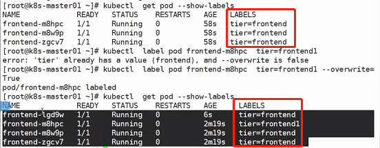

可以看到，修改了标签之后，副本数居然多了一个，以下做出解释：

看到上方yaml文件，我们的RS控制器，通过template模板，把pod创建出来，那么他怎么知道哪些pod属于自己呢？这里有一个匹配标签matchLabels，如果pod的labels中有和matchLabels中一样的标签，那就说明这个pod是属于这个RS的。所以上图为什么我们定义了副本数为3个，他会创建出4个pod呢？是因为原本确实是3个pod副本，直到我们修改了其中一个pod的labels标签，那么RS认为这个pod已经不属于我了，那么就会再创建一个新的pod出来，也就造成了上图出现4个pod的现象。所以也延伸出来一个知识点：RS的副本数监控是以标签为基础的

并且此时我们执行删除RS：

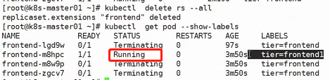

会发现有一个pod没有被删除，原因就是由于标签不同，RS认为这个pod不是我的，所以我不管

当然如果执行`kubectl delete pod --all`，所有pod都会被删除

**RS与Deployment的关联**

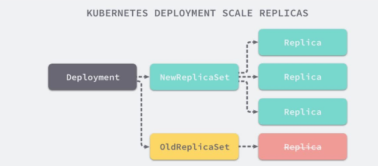

#### Deployment（ReplicaSet）

Deployment 为 Pod 和 ReplicaSet 提供了一个声明式定义 (declarative) 方法，用来替代以前的 ReplicationController 来方便的管理应用。

这里的声明式定义 (declarative)方法我们来解释一下：

- 命令式编程：它侧重于如何实现程序，就像我们刚接触编程的时候那样，我们需要把程序的实现过程按照逻辑结果一步步写下来

- 声明式编程：它侧重于定义想要什么，然后告诉计算机／引擎，让他帮你去实现

  sql语句就是一个典型的声明式编程的思想，我们不需要知道创建表的细节，只需要告诉数据库我们要创建表，他就能给我们进行创建

声明式编程有一个特点就是：可以重复执行（幂等，幂等就是函数的幂次方就是函数本体），举例来讲就是我可以重复的告诉引擎我要干什么，但引擎不会因此一遍又一遍的从头开始重复执行我的命令，他只会朝着目标一直前进，最终达到的目标都是那一个；但是命令式编程就不一样了，如果重复告诉引擎我要干什么，引擎就会因此从头开始重新执行一次命令

显然，声明式编程对用户友好，但对程序员不友好；命令式编程则反过来

那么对于deployment和rs来讲：

- deployment就是典型的声明式编程

  使用`kubectl apply xxx`会更好，虽然也能使用`kubectl create xxx`，但是不推荐，会有提示信息

- rs就是命令式编程

  使用`kubectl create xxx`会更好，虽然也能使用`kubectl apply xxx`，但是不推荐，会有提示信息


Deployment典型的应用场景包括：

- 定义 Deployment 来创建 Pod 和 ReplicaSet

- 滚动升级和回滚应用

- 扩容和缩容

- 暂停和继续 Deployment

  把Deployment下的RS挂起就暂停了（补充知识点：不光是RS可以挂起，pod自带挂起操作）；同理继续

Deployment 和 ReplicaSet 的关系：


首先RS是由Deployment创建出来的，那么怎么做滚动扩容呢？

首先比方说deployment有一个RS，RS下有一个或多个pod，那么比方说这些个pod中应用的版本是v1，现在我要滚动更新，deployment会新创建一个`RS-1`，`RS-1`下会有一个或多个新创建的pod，这些个pod中应用版本为v2，那么随着v2版本的pod一个一个被创建，那边v1版本的pod也会一个一个的删除，直到删干净，当然此时v2版本的pod数也会为用户指定的副本数。

注意，RS本身是不删的，原因是如果做滚动回滚，RS就又会被用到，所以不删。

滚动回滚同理滚动更新。

**部署一个简单的deployment案例**

```yaml
apiVersion: extensions/v1beta1
kind: Deployment
metadata:
  name: nginx-deployment
spec:
 replicas: 3
 template:
   metadata:
     labels:
       app: nginx
   spec:
     containers:
     - name: nginx
       image: nginx:1.7.9
       ports:
       - containerPort: 80
```

使用`kubectl create -f xxx.yaml --record`创建deployment，`--record`参数可以记录命令，我们可以很方便的查看每次revision的变化

**查看历史RS**

```
kubectl get rs
```

**扩容**

```
kubectl scale deployment nginx-deployment --replicas 10
```

**如果集群支持horizontal pod autoscaling的话，还可以为deployment设置自动扩展**

```
kubectl autoscale deployment nginx-deployment --min=10 --max=15 --cpu-percent=80
```

**更新镜像也比较简单**

假如我们现在想要让nginx pod使用`nginx:1.9.1`的镜像来代替原来的`nginx:1.7.9`的镜像

```
# 注意这里的deployment/nginx-deployment，意思是deployment下名为nginx-deployment的deployment
kubectl set image deployment/nginx-deployment nginx=nginx:1.9.1
```

**回滚**

```
# 注意这里的deployment/nginx-deployment，意思是deployment下名为nginx-deployment的deployment
kubectl rollout undo deployment/nginx-deployment
```

**查看rollout的状态**

```
# 注意这里的deployment/nginx-deployment，意思是deployment下名为nginx-deployment的deployment
kubectl rollout status deployment/nginx-deployment
```

**编辑**

可以使用edit命令来编辑Deployment

```
# 注意这里的deployment/nginx-deployment，意思是deployment下名为nginx-deployment的deployment
kubectl edit deployment/nginx-deployment
```

##### Deployment更新策略

Deployment可以保证在升级时只有一定数量的Pod是down的。默认的，它会确保至少有比期望的Pod数量少一个是up状态（最多1个不可用）

Deployment同时也可以确保只创建出超过期望数量的一定数量的Pod。默认的，它会确保最多比期望的Pod数量多一个的Pod是up的（最多1个surge）

未来的Kuberentes版本中，将从1\-1变成25%\-25%（当然这个阈值也可以通过资源清单里面的描述去修改）

```
kubectl describe deployments
```

##### Rollover（多个rollout并行）

假如创建了一个有5个`niginx:1.7.9` replica的Deployment，但是当还只有3个`nginx:1.7.9`的replica创建出来的时候就开始更新含有5个`nginx:1.9.1` replica的Deployment。在这种情况下，Deployment会立即杀掉已创建的3个`nginx:1.7.9`的Pod，并开始创建`nginx:1.9.1`的Pod。它不会等到所有的5个`nginx:1.7.9`的Pod都创建完成后才开始改变航道

##### 回退Deployment

```
kubectl set image deployment/nginx-deployment nginx=nginx:1.91

## 可以用kubectl rollout status命令查看Deployment是否完成。如果rollout成功完成，kubectl rollout status将返回一个0值的 Exit Code
kubectl rollout status deployments nginx-deployment 

kubectl get pods 

kubectl rollout history deployment/nginx-deployment

kubectl rollout undo deployment/nginx-deployment

## 可以使用 --revision 参数指定某个历史版本
kubectl rollout undo deployment/nginx-deployment --to-revision=2 

## 暂停deployment的更新
kubectl rollout pause deployment/nginx-deployment 
```

```
$ kubectl rollout status deploy/nginx
 Waiting for rollout to finish: 2 of 3 updated replicas are available...
 deployment "nginx" successfully rolled out 
$ echo $?
 0
```

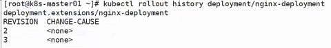

使用`kubectl rollout history xxx`可以看到滚动更新的历史记录，REVISION是指版本，这里的CHANGE\-CAUSE为none是因为最初`kubectl apply -f xxx.yaml`的时候没有在末尾加上`--record`，如果加上了，这里就能看到信息了：

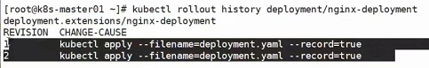

但是有一个问题，加入最开始的时候是v1版本的，更新了一次变成了v2版本，之后又更新了一次变成了v3版本，这个时候我们如果想回到v1版本怎么办？

执行两次`kubectl rollout undo xxx`吗？不行，因为一次回退确实能从v3版本回退到v2，但是如果再执行一次就又会变成v3，因为回退的是上一个版本。此时就需要借助`--to-revision`参数了，完整代码模板：`kubectl rollout undo xxx --to-revision=1`表示回退到REVISION为1的版本

##### 清理Policy

您可以通过设置`.spec.revisonHistoryLimit`项来指定deployment最多保留多少revision历史记录。默认的会保留所有的revision；如果将该项设置为0，Deployment就不允许回退了

这个也很好理解，因为pod由RS管理，如果历史版本的RS没有了，自然也回滚不了了

#### HPA（HorizontalPodAutoScale）

应用的资源使用率通常都有高峰和低谷的时候，如何削峰填谷，提高集群的整体资源利用率，让service中的Pod个数自动调整呢？这就有赖于Horizontal Pod Autoscaling了，顾名思义，使Pod水平自动缩放

Horizontal Pod Autoscaling 仅适用于 Deployment 和 ReplicaSet ，在 V1 版本中仅支持根据 Pod的 CPU 利用率扩缩容，举例来讲就是：


HPA会去监控资源的利用率，如果cpu利用率大于80%，那么v2的pod就会扩容，直到达到数量为MAX 10为止，反之如果cpu利用率小于80%，那么v2的pod就会被回收，直到MIN 2为止。这样就能达到水平自动扩展的功能。

在 v1alpha 版本中，还可以支持根据内存和用户自定义的 metric 进行扩缩容

#### StatefullSet

StatefulSet作为Controller为Pod提供唯一的标识。它可以保证部署和scale的顺序

StatefulSet 是为了解决有状态服务的问题（对应 Deployments 和 ReplicaSets 是为无状态服务而设计），其应用场景包括：

- 稳定的持久化存储，即 Pod 重新调度后还是能访问到相同的持久化数据，基于 PVC 来实现
- 稳定的网络标志，即 Pod 重新调度后其 PodName 和 HostName 不变，基于 Headless Service（即没有 Cluster IP 的 Service ）来实现
- 有序部署，有序扩展，即 Pod 是有顺序的，在部署或者扩展的时候要依据定义的顺序依次依次进行（即从 0 到 N-1，在下一个 Pod 运行之前所有之前的 Pod 必须都是 Running 和 Ready 状态），基于 init containers 来实现
- 有序收缩，有序删除（即从 N-1 到 0）

#### DaemonSet

DaemonSet 确保全部（或者一些）Node 上运行一个 Pod 的副本。当有 Node 加入集群时，也会为他们新增一个 Pod 。当有 Node 从集群移除时，这些 Pod 也会被回收。删除 DaemonSet 将会删除它创建的所有 Pod

注意是运行一个Pod副本，不是多个，如果你想在一个node上运行多个daemonset的pod副本，可以通过创建多个daemonset的方式来实现

使用 DaemonSet 的一些典型用法：

- 运行集群存储 daemon，例如在每个 Node 上运行 glusterd、ceph
- 在每个 Node 上运行日志收集 daemon，例如fluentd、logstash
- 在每个 Node 上运行监控 daemon，例如 Prometheus Node Exporter、collectd、Datadog代理、New Relic代理，或Ganglia gmond

案例：

```yaml
apiVersion: apps/v1
kind: DaemonSet
metadata:
  name: deamonset-example
  labels: 
    app: daemonset
spec:
  selector:
    matchLabels:
      name: deamonset-example
  template:
    metadata:
      labels:
        name: deamonset-example
    spec:
      containers:
      - name: daemonset-example
        image: wangyanglinux/myapp:v1
```

DaemonSet属于命令式，所以我们最好用`kubectl create xxx -f xxx.yaml`去创建

创建完之后我们发现虽然所有node节点上都有了相应的pod（且副本数定死了就是1个），但是master节点上没有，这是因为master节点上使用了污点策略

#### Job

Job 负责批处理任务，即仅执行一次的任务，它保证批处理任务的一个或多个 Pod 成功结束

什么叫做一个或多个呢？比方说有一个脚本，这个脚本正常执行完毕后以0退出，这个时候job就会记录正常退出次数为1，那我们是可以定义job成功退出的次数的，比如定义为4，脚本正常执行完毕退出一次就加1，又正常退出一次再加1，直到加到4为止，之后这个job成功结束退出，意思就是该job已经执行完成了，不需要再运行。以此延伸出job的生命周期也就等于里面的pod运行多少多少次成功之后结束

特殊说明

- `spec.template`格式同Pod
- RestartPolicy仅支持Never或OnFailure
- 单个Pod时，默认Pod成功运行后Job即结束
- `.spec.completions`标志Job结束需要成功运行的Pod个数，默认为1
- `.spec.parallelism`标志并行运行的Pod的个数，默认为1
- `spec.activeDeadlineSeconds`标志失败Pod的重试最大时间，超过这个时间不会继续重试

案例：

```yaml
apiVersion: batch/v1
kind: Job
metadata:
  name: pi
spec:
  template:
    metadata:
      name: pi
    spec:
      containers:
      - name: pi
        image: perl
        command: ["perl","-Mbignum=bpi","-wle","print bpi(2000)"]
      restartPolicy: Never
```

注意，由于重启策略是Never，因此如果任务执行失败了，需要将pod删除，此时他会自动再起一个pod，就会再次执行了

使用`kubectl get job`可以查看到任务是否执行完成

使用`kubectl log xxx`查看pod日志

#### Cronjob

Cron Job 管理基于时间的 Job，即：

- 给定时间点只运行一次
- 周期性地在给定时间点运行

deployment通过创建RS来对pod进行管理，cronjob通过创建pod进行管理

使用前提条件：当前使用的Kubernetes集群，版本 >= 1.8（对CronJob）。对于先前版本的集群，版本 < 1.8，启动API Server时，通过传递选项`--runtime-config=batch/v2alpha1=true`可以开启`batch/v2alpha1API`

典型的用法如下所示：

- 在给定的时间点调度Job运行
- 创建周期性运行的Job，例如：数据库备份、发送邮件


**CronJob Spec**

- `spec.template`格式同Pod

- RestartPolicy仅支持Never或OnFailure

- 单个Pod时，默认Pod成功运行后Job即结束

- `.spec.completions`标志Job结束需要成功运行的Pod个数，默认为1

- `.spec.parallelism`标志并行运行的Pod的个数，默认为1

- `spec.activeDeadlineSeconds`标志失败Pod的重试最大时间，超过这个时间不会继续重试

- `.spec.schedule`：调度，必需字段，指定任务运行周期，格式同Cron

- `.spec.jobTemplate`：Job模板，必需字段，指定需要运行的任务，格式同Job

- `.spec.startingDeadlineSeconds`：启动Job的期限（秒级别），该字段是可选的。如果因为任何原因而错过了被调度的时间，那么错过执行时间的Job将被认为是失败的。如果没有指定，则没有期限

- `.spec.concurrencyPolicy`：并发策略，该字段也是可选的。它指定了如何处理被Cron Job创建的Job的并发执行。只允许指定下面策略中的一种：

  - Allow（默认）：允许并发运行Job
  - Forbid：禁止并发运行，如果前一个还没有完成，则直接跳过下一个
  - Replace：取消当前正在运行的Job，用一个新的来替换

  注意，当前策略只能应用于同一个Cron Job创建的Job。如果存在多个Cron Job，它们创建的Job之间总是允许并发运行。

- `.spec.suspend`：挂起，该字段也是可选的。如果设置为true，后续所有执行都会被挂起。它对已经开始执行的Job不起作用。默认值为false。
- `.spec.successfulJobsHistoryLimit`和`.spec.failedJobsHistoryLimit`：历史限制，是可选的字段。它们指定了可以保留多少完成和失败的Job。默认情况下，它们分别设置为3和1。设置限制的值为0，相关类型的Job完成后将不会被保留。

部署案例：

```yaml
apiVersion: batch/v1beta1
kind: CronJob
metadata:
  name: hello
spec:
  schedule: "*/1 * * * *"
  jobTemplate:
    spec:
      template:
        spec:
          containers:
          - name: hello
            image: busybox
            args:
            - /bin/sh
            - -c
            - date; echo Hello from the Kubernetes cluster
          restartPolicy: OnFailure
```

使用`kubectl apply -f xxx.yaml`创建

使用`kubectl get cronjob`查看

注意，此时如果使用`kubectl get job`也可以看到通过cronjob创建出来的job，这是因为Cron Job 其实就是管理基于时间的 Job

注意，删除 cronjob 的时候不会自动删除job，这些job可以用`kubectl delete job`来删除

使用`kubectl log xxx`可以查看具体执行信息

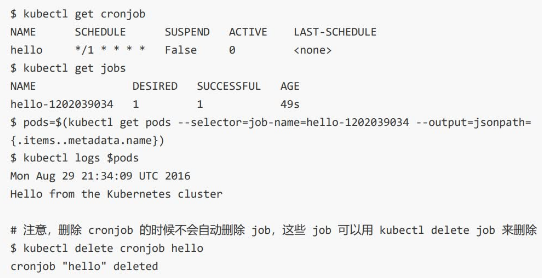

**cronjob本身的一些限制**

创建Job操作应该是幂等的

因为cronjob中可以重复的去循环一些任务，如果操作不是幂等的，此时比如并发策略选择了`Allow`或`Forbid`或`Replace`，就可能第二个会影响第一个运行的结果，那这样的话如果再去重复运行得到的结果可能就不是我们想要的结果。

还有一点，cronjob他运行成功并不太好去做判断，原因是cronjob他运行的是job，job的成功可以被判断，但是cronjob无法去链接到job的成功状态，cronjob只会定期的去创建job，仅此而已。

### Service

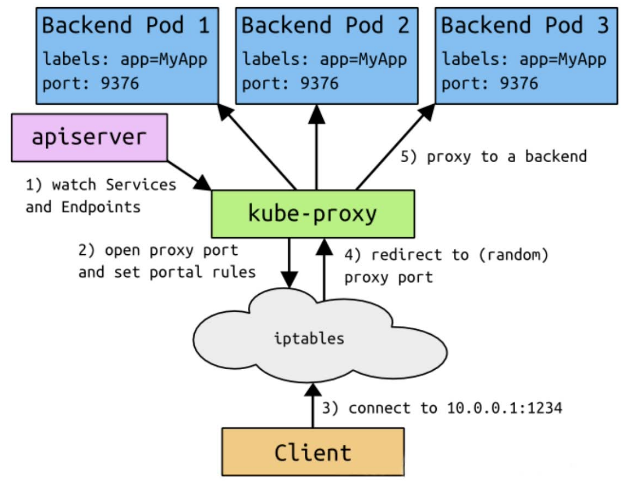

上图的解释比较复杂，其实图中的说明已经可以见名知意了，想要更详细的解释可以直接看`尚硅谷Kubenetes教程（k8s从入门到精通）6-1_尚硅谷_Service - 定义`第17分35秒到第19分钟

注意，一组pod是可以对应到多个svc的（多对多的关系），只要标签匹配就行。

#### 概念

Kubernetes Service定义了这样一种抽象：一个Pod的逻辑分组，一种可以访问它们的策略 —— 通常称为微服务。这一组Pod能够被Service访问到，通常是通过Label Selector

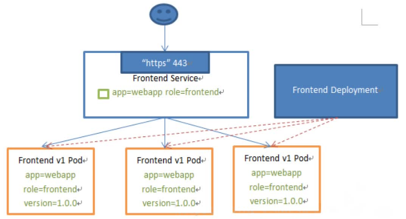

Service能够提供负载均衡的能力，但是在使用上有以下限制：

只提供4层负载均衡能力，而没有7层功能（可通过ingress实现），但有时我们可能需要更多的匹配规则来转发请求，这点上4层负载均衡是不支持的

#### 服务发现与负载均衡


比方说我们的客户端需要去访问一组pod，如果这些pod不相关的话是无法使用service进行统一代理的，pod必须要有相关性，比方说是同一个RS、RC或Deployment创建的，或者拥有同一组标签，被service所收集到（换句话说，service去收集pod是通过标签来收集的，pod标签相对于service的标签多了可以少了不行），收集到之后service会有自己的ip和port，那么客户端通过service的ip和port即可间接访问到相应的pod，并且service会有自己的负载均衡算法（roundrobin），来将请求均匀地分摊到各个pod。

#### 部署示例

试想一下我们要部署这样的一套东西：


一个LVS做负载均衡（换用haproxy或nginx也可），三个SQUID作为前端，三个APACHE+fpm作为后端，一个MYSQL作为数据存储


mysql作为有状态应用，可以在statefullset中进行部署，但是部署集群化的mysql对于k8s来说还是有一点困难的，因此这里我们部署一个单节点mysql。而由于mysql部署在statefullset中，ip地址是不变的，且k8s内部是一个扁平化网络，pod之间是可以直接访问到的，因此`php-fpm`的一组pod直接访问mysql是没有问题的。

现在重点来了，squid想要配置反向代理到`php-fpm`怎么办呢？`php-fpm`有三个，需要写三台机器，更麻烦的是，`php-fpm`这些pod会发生退出然后重新创建的情况，在新建pod的过程中，ip地址会发生变化，那么这个时候要么手动修改ip地址绑定，要么写脚本去修改ip地址绑定，这些都是很麻烦的，而且虽然我们可以通过将`php-fpm`部署到statefullset中来变相解决这个问题，但是对于一个无状态应用来讲，没什么意义。

那么怎么办呢？可以使用service，如上图，使用一个`php-fpm`的service，然后squid直接访问`php-fpm`的service即可。

同理squid的一组pod也可以有一个自己的service，并且由于squid是需要对外暴露访问的，因此可以将type设置为nodeport，或者使用ingress来做也可以。

#### Service的类型

Service在K8s中有以下四种类型：

- ClusterIp：默认类型，自动分配一个仅Cluster内部可以访问的虚拟IP

  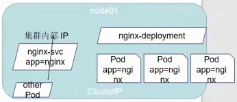

  只能被集群内部的应用或者node节点本身所访问

- NodePort：在ClusterIP基础上为Service在每台机器上绑定一个端口，这样就可以通过: NodePort来访问该服务

  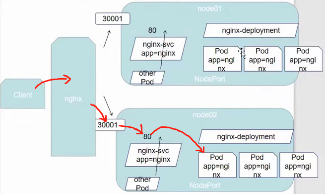

  上图是一种高可用的架构，首先他第一层使用了nginx做负载均衡，保证了node节点的高可用（如果不加这一层直接访问node的话万一node节点挂掉了服务也就全部中断了）；然后第二层又用了service做到了pod的高可用。

  nodeport使得node节点向外暴露了一个端口30001，而30001映射到了node节点内部的svc的80端口，svc再做负载均衡最终访问到pod，也就是上图红色箭头的访问路径。 

- LoadBalancer：在NodePort的基础上，借助cloud provider创建一个外部负载均衡器，并将请求转发到: NodePort

  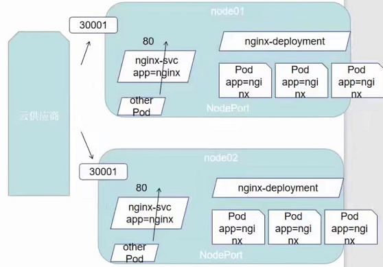

  该模式与上面nodeport配合负载均衡器实现的高可用架构只有一个区别，那就是nginx负载均衡器不需要我们自己实现了，我们要做的就只需要引入云供应商，让他给我们去暴露服务接口即可。也就是说只要采用loadbalancer，他就会自动去云服务器那边去注册，并且把对应暴露端口填写进去，实现一个自动化的流程，但是既然用到了云供应商的调度方案，那显然是要收费的

- ExternalName：把集群外部的服务引入到集群内部来，在集群内部直接使用。没有任何类型代理被创建，这只有kubernetes 1.7或更高版本的kube-dns才支持

  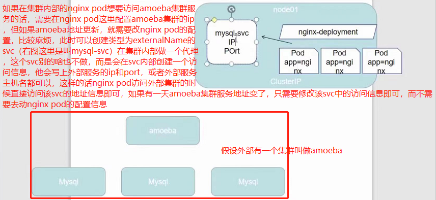

#### VIP和Service代理

在Kubernetes集群中，每个Node运行一个`kube-proxy`进程。`kube-proxy`负责为Service实现了一种VIP（虚拟IP）的形式，而不是ExternalName的形式。在`Kubernetes v1.0`版本，代理完全在userspace。在`Kubernetes v1.1`版本，新增了iptables代理，但并不是默认的运行模式。从`Kubernetes v1.2`起，默认就是iptables代理。在`Kubernetes v1.8.0-beta.0`中，添加了ipvs代理在`Kubernetes 1.14`版本开始默认使用ipvs代理在`Kubernetes v1.0`版本，Service是“4层”（TCP/UDP over IP）概念。在`Kubernetes v1.1`版本，新增了IngressAPI（beta版），用来表示“7层”（HTTP）服务

**为何不使用`round-robin DNS`？**

因为DNS会在很多客户端中进行缓存，当服务去访问，DNS进行域名解析的时候，解析完成之后得到地址访问了之后很多服务不会对DNS的解析进行清除缓存，也就是说一旦有了DNS解析的地址信息之后，不管之后怎么访问，一直都将会是这个地址信息，那这里的负载均衡也就失效了，因此肯定不能通过设置DNS去做负载均衡的，只能将他作为一种辅助手段

#### 代理模式的分类

##### Ⅰ、userspace代理模式

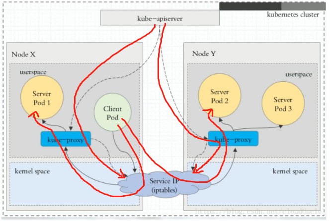

客户端访问pod，不管是访问Node X中的pod还是Node Y中的pod都需要经过iptables和`kube-proxy`，包括`kube-apiserver`也需要监控`kube-proxy`去做服务的更新和端点维护，可见`kube-proxy`压力是很大的

##### Ⅱ、iptables代理模式

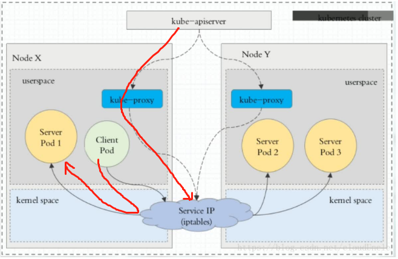

iptables代理模式下`kube-proxy`压力大大减少，client访问pod只需要经过iptables就行，不需要再经过`kube-proxy`了，效率也大大提升

##### Ⅲ、ipvs代理模式（★）

这种模式，`kube-proxy`会监视KubernetesService对象和Endpoints，调用netlink接口以相应地创建ipvs规则并定期与KubernetesService对象和Endpoints对象同步ipvs规则，以确保ipvs状态与期望一致。访问服务时，流量将被重定向到其中一个后端Pod

与iptables类似，ipvs于netfilter的hook功能，但使用哈希表作为底层数据结构并在内核空间中工作。这意味着ipvs可以更快地重定向流量，并且在同步代理规则时具有更好的性能。此外，ipvs为负载均衡算法提供了更多选项，例如：

- rr：轮询调度
- lc：最小连接数
- dh：目标哈希
- sh：源哈希
- sed：最短期望延迟
- nq：不排队调度

注意：ipvs模式假定在运行`kube-proxy`之前在节点上都已经安装了IPVS内核模块。当`kube-proxy`以ipvs代理模式启动时，`kube-proxy`将验证节点上是否安装了IPVS模块，如果未安装，则`kube-proxy`将回退到iptables代理模式。

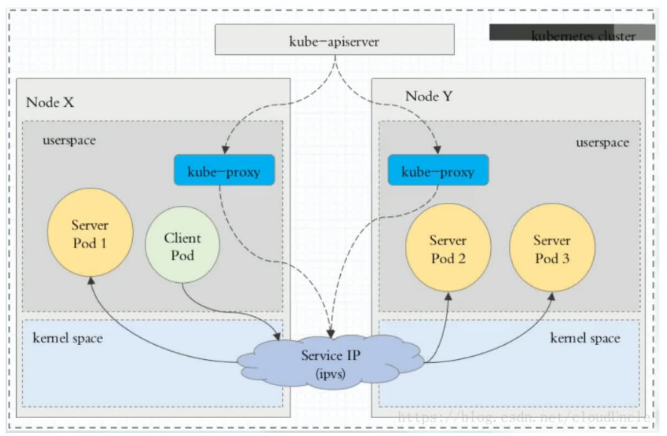

我们发现ipvs的架构跟iptables基本一样，只是将iptables换成了ipvs

使用命令`ipvsadm -Ln`可以查看ipvs的代理：

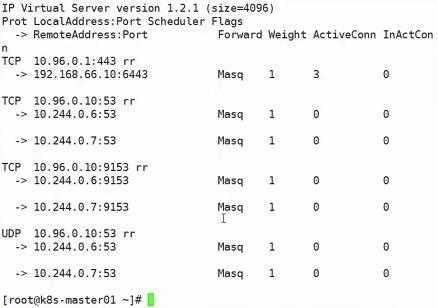

上图的rr就是负载均衡机制（round robin），说明ipvs、iptables、userspace这些模块除了做代理，还做负载均衡

上图的`10.96.0.1:443 -> 192.168.66.10:6443`的意思非常显而易见，也就是发往`10.96.0.1:443`的请求会被转发到`192.168.66.10:6443`

再来看看svc：

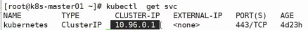

这个svc的`cluster-ip`就是`10.96.0.1`，那么他是怎么被ipvs代理的现在就非常清楚了

#### ClusterIP

clusterIP主要在每个node节点使用iptables（目前主流的代理都是ipvs，如果使用ipvs进行代理了，那这里的每个节点使用的也是ipvs），将发向clusterIP对应端口的数据，转发到`kube-proxy`中。然后`kube-proxy`自己内部实现有负载均衡的方法，并可以查询到这个service下对应pod的地址和端口，进而把数据转发给对应的pod的地址和端口

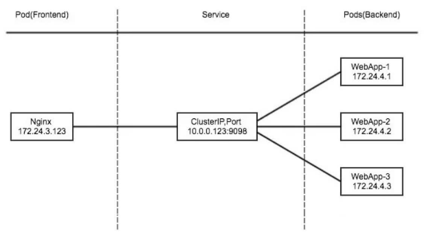

为了实现图上的功能，主要需要以下几个组件的协同工作：

- apiserver

  用户通过kubectl命令向apiserver发送创建service的命令，apiserver接收到请求后将数据存储到etcd中

- `kube-proxy` 

  kubernetes的每个节点中都有一个叫做`kube-porxy`的进程，这个进程负责感知service，pod的变化，并将变化的信息写入本地的iptables规则中

  简单来讲就是apiserver收到请求想要修改etcd中的数据，`kube-proxy`监听etcd中数据的变化，一旦有变化就将数据写入本地ipvs（或iptables或userspace），为什么是本地的呢？因为每一个node节点都有自己的`kube-proxy`的进程存在

- iptables（或ipvs）

  使用NAT等技术将virtualIP的流量转至endpoint（后端服务的真实端点信息）中

案例：

首先创建deployment：

```yaml
apiVersion: apps/v1
kind: Deployment
metadata: 
  name: myapp-deploy
  namespace: default
spec:
  replicas: 3
  selector: 
    matchLabels:
      app: myapp
      release: stabel
    template:
      metadata:
        labels:
          app: myapp
          release: stabel
          env: test
      spec:
        containers:
        - name: myapp
          image: wangyanglinux/myapp:v2
          imagePullPolicy: IfNotPresent
          ports: 
          - name: http
            containerPort: 80
```

创建svc：

```yaml
apiVersion: v1
kind: Service
metadata:
  name: myapp
  namespace: default
spec:
  type: ClusterIP
  selector:
    app: myapp
    release: stabel
  ports:
  - name: http
    port: 80
    targetPort: 80
```

注意，svc也是通过标签匹配pod，如果svc定义了一个与目标pod集群标签不一致的标签，那么这个svc的后端是对应不到目标pod集群的，此时访问该svc显然是访问不到目标pod集群的，我们还可以通过使用`ipvsadm -Ln`查看代理来知晓svc是否真的代理到了目标pod集群：

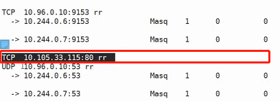

如果没有代理到，则会出现上图现象，那么像上图这样只出现了svc自己的ip和port的情况下，显然svc是没有代理到pod的

#### Headless Service

注意，无头服务也是一种ClusterIP，只不过是一种特殊的ClusterIP而已

有时不需要或不想要负载均衡，以及单独的Service IP。遇到这种情况，可以通过指定ClusterIP(`spec.clusterIP`)的值为“None”来创建Headless Service。这类Service并不会分配Cluster IP，`kube-proxy`不会处理它们，而且平台也不会为它们进行负载均衡和路由。

通过这种svc可以解决hostname和podname变化的问题

案例：

```yaml
apiVersion: v1
kind: Service
metadata:
  name: myapp-headless
  namespace: default
spec:
  selector:
    app: myapp
  clusterIP: "None"
  ports:
  - port: 80
    targetPort: 80
```

使用`kubectl get svc`：

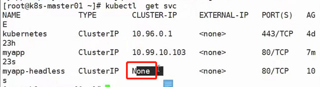

可以看到他的`cluster-ip`是None

对于svc，一旦svc创建成功了，他会写到COREDNS中去，使用`kubectl get pod -n kube-system`：

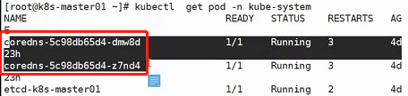

可以看到coredns的pod

svc创建成功之后会有一个主机名被写入到coredns，他的写入格式体就是：`svc名称.当前名称空间名称.集群域名.`。

使用dig命令利用coredns的ip地址进行解析示例：

`dig -t A myapp-headless.default.svc.cluster.local. @10.96.0.10`

最后的`@10.96.0.10`为coredns的ip地址（可通过`kubectl get pod -n kube-system -o wide`查看获得），该coredns的ip地址可以解析集群域名

`A`的意思是查询A记录，有效查询DNS有很多种方法，查询A记录就是其中一种

结果如下：

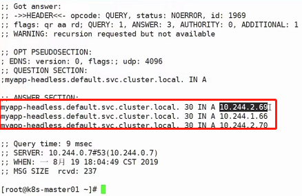

再看pod的ip地址，使用`kubectl get pod -o wide`：

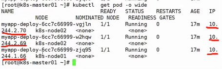

可以看到正是这三个ip地址

也就意味着在无头服务中，虽然他没有自己的svc了，但是可以通过访问域名的方案，依然可以访问到上图的几个目标pod中去

#### NodePort

nodePort的原理在于在node上开了一个端口，将向该端口的流量导入到`kube-proxy`，然后由`kube-proxy`进一步到对应的pod（当然这里说的其实还是iptables，如果是lvs，那就是访问到lvs的服务地址）

案例：

```yaml
apiVersion: v1
kind: Service
metadata:
  name: myapp
  namespace: default
spec:
  type: NodePort
  selector:
    app: myapp
    release: stabel
  ports:
  - name: http
    port: 80
    targetPort: 80
```

创建之后使用`kubectl get svc`：

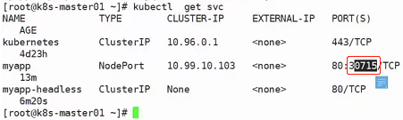

上图30715就是暴露给外部的端口，需要注意的是：每一个节点都开启了这个端口

可以使用命令：`netstat -anpt | grep :30715`查看：

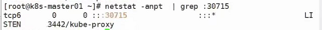

那么每一个节点上都可以使用上述命令进行查看，会发现每一个节点都开启了30715这个端口

**查询流程：**

```
使用iptables时：
iptables -t nat -nvL
    KUBE-NODEPORTS

或者
使用ipvs时：
ipvsadm -Ln
```

查询结果为：

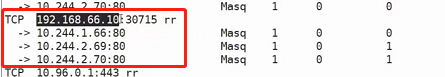

`192.168.66.10:30715`负载均衡到三个节点：`10.244.1.66:80`、`10.244.2.69:80`、`10.244.2.70:80`

这就是原理，通过`kube-proxy`跟netlink（也就是ipvs的接口层）去进行交互，创建出来对应的规则之后进行负载均衡

#### LoadBalancer

loadBalancer和nodePort其实是同一种方式。区别在于loadBalancer比nodePort多了一步，就是可以调用cloud provider去创建LB（负载均衡）来向节点导流

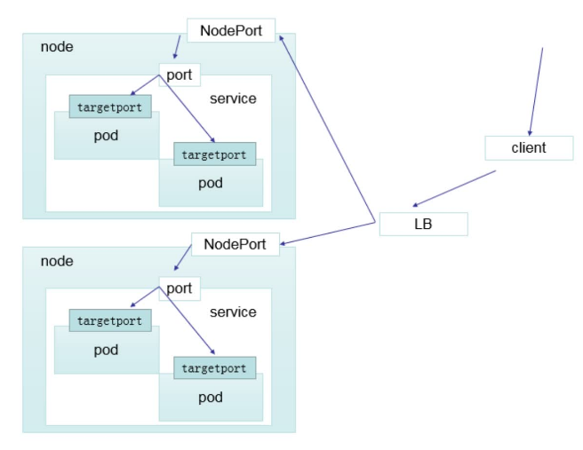

供应商提供的服务：LAAS（loadBalance as a service）

#### ExternalName

这种类型的Service通过返回CNAME和它的值，可以将服务映射到externalName字段的内容(例如：hub.atguigu.com )。ExternalName Service是Service的特例，它没有selector，也没有定义任何的端口和Endpoint。相反的，对于运行在集群外部的服务，它通过返回该外部服务的别名这种方式来提供服务

```yaml
kind: Service
apiVersion: v1
metadata: 
  name: my-service-1
  namespace: default
spec:
  type: ExternalName
  externalName: hub.atguigu.com
```

当查询主机`my-service.default.svc.cluster.local ( SVC_NAME.NAMESPACE.svc.cluster.local )`时，集群的DNS服务将返回一个值`hub.atguigu.com`的CNAME记录。访问这个服务的工作方式和其他的相同，唯一不同的是重定向发生在DNS层，而且不会进行代理或转发

案例：

- 首先根据上面的模板创建`.yaml`文件

- 使用命令`kubectl create -f xxx.yaml`创建该svc

  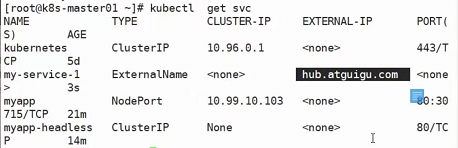

- 使用命令`dig -t A my-service-1.default.svc.cluster.local. @10.244.0.7`

  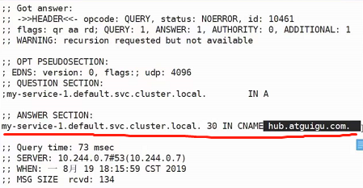

  可以看到这个东西其实就是做了一个dns别名的操作，具体的意义就是想把外部的服务引入集群内部

### 网络通讯方式

Kubernetes 的网络模型假定了所有 Pod 都在一个可以直接连通的扁平的网络空间中，这在GCE（Google Compute Engine）里面是现成的网络模型，Kubernetes 假定这个网络已经存在。而在私有云里搭建 Kubernetes 集群，就不能假定这个网络已经存在了。我们需要自己实现这个网络假设，将不同节点上的 Docker 容器之间的互相访问先打通，然后运行 Kubernetes

同一个 Pod 内的多个容器之间：lo（也就是我们熟知的localhost）

各 Pod 之间的通讯：Overlay Network

Pod 与 Service 之间的通讯：各节点的 Iptables 规则（现在不用iptables了，用LVS，效率更高上限也更高）

Flannel 是 CoreOS 团队针对 Kubernetes 设计的一个网络规划服务，简单来说，它的功能是让集群中的不同节点主机创建的 Docker 容器都具有全集群唯一的虚拟IP地址。而且它还能在这些 IP 地址之间建立一个覆盖网络（Overlay Network），通过这个覆盖网络，将数据包原封不动地传递到目标容器内


上图红色线为跨主机访问，蓝色线为同主机应用之间的访问

使用udp方式，比较快

数据包到Flanneld的时候还会进行封装，封装成这个样子：


由于数据进行了二次封装，因此Docker0是看不到这个的：


Docker0看的是这个：


ETCD 之 Flannel 提供说明：

- 存储管理 Flannel 可分配的 IP 地址段资源

  Flannel在启动之后会往etcd插入可分配网段，并且哪些网段被分配到哪台机器上他会进行记录，防止已分配的网段再次被Flannel利用被分配给其他node节点，这样的话迟早会出现ip冲突

- 监控 ETCD 中每个 Pod 的实际地址，并在内存中建立维护 Pod 节点路由表

  怎么知道“web app2”的pod网段`10.1.15.2/24`是对应`192.168.66.11/24`呢？

  就是通过维护 Pod 节点的路由表知道的

上述两点足以凸显etcd的重要性！

同一个 Pod 内部通讯：同一个 Pod 共享同一个网络命名空间，共享同一个 Linux 协议栈

Pod1 至 Pod2

- Pod1 与 Pod2 不在同一台主机，Pod的地址是与docker0在同一个网段的，但docker0网段与宿主机网卡是两个完全不同的IP网段，并且不同Node之间的通信只能通过宿主机的物理网卡进行。将Pod的IP和所在Node的IP关联起来，通过这个关联让Pod可以互相访问
- Pod1 与 Pod2 在同一台机器，由 Docker0 网桥直接转发请求至 Pod2，不需要经过 Flannel

Pod 至 Service 的网络：目前基于性能考虑，全部为 iptables（现在是LVS） 维护和转发

Pod 到外网：Pod 向外网发送请求，查找路由表, 转发数据包到宿主机的网卡，宿主网卡完成路由选择后，iptables执行Masquerade，把源 IP 更改为宿主网卡的 IP，然后向外网服务器发送请求

外网访问 Pod：Service

组件通讯示意图：


## kubernetes集群安装（这一块很复杂，建议直接看`尚硅谷Kubenetes教程（k8s从入门到精通）第3-1到第3-5集`）

前期准备


使用centos7及以上，使用内核4.4版本及以上

集群安装

这里为什么需要Router（Router使用虚拟机搭配koolshare来搭建），是因为安装kubeadm需要科学上网，所以还有一种替代方法就是直接在本机上开ssr，用于搭建Router的虚拟机网卡使用桥接。


由于过程过于复杂，请直接参考`尚硅谷Kubenetes教程（k8s从入门到精通）第3-2_尚硅谷_集群安装准备 -安装软路由集`

值得注意的是：


本机配置虚拟机网卡的ip地址等价于虚拟机里面配置网卡的子接口，也就是`ifconfig eth0:0`配置子接口，使得一块网卡具有多个ip地址

注意：

```
1、安装 k8s 的节点必须是大于 1 核心的 CPU
2、安装节点的网络信息：
	网段：192.168.66.0/24
	master节点：192.168.66.10/24
	node1节点：192.168.66.20/24
	node2节点：192.168.66.21/24
	harbor节点：192.168.66.100/24 (该节点dns为：hub.auguigu.com，harbor节点域名解析不仅要在虚拟机/etc/hosts中加，还要在本机/etc/hosts中加)
3、koolshare 软路由的默认密码是 koolshare
```

可以在节点中使用命令`vi /etc/sysconf/network-scripts/ifcfg-ens33`来查看ip地址的配置，这是网卡的最新命名规范，他会从BIOS pcie通道获取网卡的文件名，如果都没有的话会再降级到eth0或eth1的命名方式。要想关闭的话，ifnames=0就可以把他关闭（这个地方有点没懂）。打开后是这样的：


注意，这里的GATEWAY（网关）需要指向koolshare的软路由，让koolshare起作用

### Harbor安装

#### 一、安装底层需求

- Python应该是2.7或更高版本
- Docker引擎应为1.10或更高版本
- DockerCompose需要为1.6.0或更高版本

`docker-compose`：

```
curl -L https://github.com/docker/compose/releases/download/1.9.0/docker-compose-`uname-s`-`uname-m` > /usr/local/bin/docker-compose
```

#### 二、Harbor官方地址：https://github.com/vmware/harbor/releases

1、解压软件包

```
tar xvf harbor-offline-installer-<version>.tgz https://github.com/vmware/harbor/releases/download/v1.2.0/harbor-offline-installer-v1.2.0.tgz
```

2、配置harbor.cfg

必选参数：

```
hostname：目标的主机名或者完全限定域名
ui_url_protocol：http或https。默认为http
db_password：用于db_auth的MySQL数据库的根密码。更改此密码进行任何生产用途
max_job_workers：（默认值为3）作业服务中的复制工作人员的最大数量。对于每个映像复制作业，工作人员将存储库的所有标签同步到远程目标。增加此数字允许系统中更多的并发复制作业。但是，由于每个工作人员都会消耗一定数量的网络/CPU/IO资源，请根据主机的硬件资源，仔细选择该属性的值
customize_crt：（on或off。默认为on）当此属性打开时，prepare脚本将为注册表的令牌的生成/验证创建私钥和根证书
ssl_cert：SSL证书的路径，仅当协议设置为https时才应用
ssl_cert_key：SSL密钥的路径，仅当协议设置为https时才应用
secretkey_path：用于在复制策略中加密或解密远程注册表的密码的密钥路径
```

3、创建https证书以及配置相关目录权限

```
openssl genrsa-des3-outserver.key2048
openssl req-new-keyserver.key-outserver.csr
cp server.keyserver.key.org
openssl rsa-inserver.key.org-outserver.key
openssl x509-req-days365-inserver.csr-signkeyserver.key-outserver.crt
mkdir /data/cert
chmod -R 777 /data/cert
```

4、运行脚本进行安装

```
./install.sh
```

5、访问测试

https://reg.yourdomain.com的管理员门户（将reg.yourdomain.com更改为您的主机名harbor.cfg）。请注意，默认管理员用户名/密码为admin/Harbor12345

6、上传镜像进行上传测试

a、指定镜像仓库地址

```
vim /etc/docker/daemon.json
{
	"insecure-registries":["serverip"]
}
```

b、下载测试镜像

```
docker pull hello-world
```

c、给镜像重新打标签

```
docker tag hello-world serverip/hello-world:latest
```

d、登录进行上传

```
docker login serverip
```

7、其它Docker客户端下载测试

a、指定镜像仓库地址

```
vim /etc/docker/daemon.json
{
	"insecure-registries":["serverip"]
}
```

b、下载测试镜像

```
docker pull serverip/hello-world:latest
```

harbor登录密码在`harbor.cfg`中配置：


#### 三、Harbor原理说明

1、软件资源介绍

​	Harbor是VMware公司开源的企业级DockerRegistry项目，项目地址为https://github.com/vmware/harbor。其目标是帮助用户迅速搭建一个企业级的Dockerregistry服务。它以Docker公司开源的registry为基础，提供了管理UI，基于角色的访问控制(RoleBasedAccessControl)，AD/LDAP集成、以及审计日志(Auditlogging)等企业用户需求的功能，同时还原生支持中文。Harbor的每个组件都是以Docker容器的形式构建的，使用DockerCompose来对它进行部署。用于部署Harbor的DockerCompose模板位于/Deployer/docker-compose.yml，由5个容器组成，这几个容器通过Dockerlink的形式连接在一起，在容器之间通过容器名字互相访问。对终端用户而言，只需要暴露proxy（即Nginx）的服务端口

- Proxy：由Nginx服务器构成的反向代理。
- Registry：由Docker官方的开源registry镜像构成的容器实例。
- UI：即架构中的coreservices，构成此容器的代码是Harbor项目的主体。
- MySQL：由官方MySQL镜像构成的数据库容器。
- Log：运行着rsyslogd的容器，通过log-driver的形式收集其他容器的日志

2、Harbor特性

a、基于角色控制：用户和仓库都是基于项目进行组织的，而用户基于项目可以拥有不同的权限

b、基于镜像的复制策略：镜像可以在多个Harbor实例之间进行复制

c、支持LDAP：Harbor的用户授权可以使用已经存在LDAP用户

d、镜像删除&垃圾回收：Image可以被删除并且回收Image占用的空间，绝大部分的用户操作API，方便用户对系统进行扩展

e、用户UI：用户可以轻松的浏览、搜索镜像仓库以及对项目进行管理

f、轻松的部署功能：Harbor提供了online、offline安装，除此之外还提供了virtualappliance安装

g、Harbor和docker registry关系：Harbor实质上是对docker registry做了封装，扩展了自己的业务模块


3、Harbor认证过程

a、dockerdaemon从docker registry拉取镜像。

b、如果docker registry需要进行授权时，registry将会返回401Unauthorized响应，同时在响应中包含了dockerclient如何进行认证的信息。

c、dockerclient根据registry返回的信息，向auth server发送请求获取认证token。

d、auth server则根据自己的业务实现去验证提交的用户信息是否存符合业务要求。

e、用户数据仓库返回用户的相关信息。

f、auth server将会根据查询的用户信息，生成token令牌，以及当前用户所具有的相关权限信息.上述就是完整的授权过程.当用户完成上述过程以后便可以执行相关的pull/push操作。认证信息会每次都带在请求头中


4、Harbor认证流程

a、首先，请求被代理容器监听拦截，并跳转到指定的认证服务器。

b、如果认证服务器配置了权限认证，则会返回401。通知docker client在特定的请求中需要带上一个合法的token。而认证的逻辑地址则指向架构图中的core services。

c、当docker client接受到错误code。client就会发送认证请求(带有用户名和密码)到core services进行basic auth认证。

d、当C的请求发送给ngnix以后，ngnix会根据配置的认证地址将带有用户名和密码的请求发送到core serivces。

e、core services获取用户名和密码以后对用户信息进行认证(自己的数据库或者介入LDAP都可以)。成功以后，返回认证成功的信息


### 系统初始化

设置系统主机名以及Host文件的相互解析

```
hostnamectl set-hostname k8s-master01
```

安装依赖包

```
yum install -y conntrack ntpdate ntp ipvsadm ipset jq iptables curl sysstat libseccomp wget vim net-tools git
```

设置防火墙为Iptables并设置空规则

```
systemctl stop firewalld && systemctl disable firewalld
yum -y install iptables-services && systemctl start iptables && systemctl enable iptables && iptables-F && service iptables save
```

关闭SELINUX

```
swapoff -a && sed -i '/ swap / s/^\(.*\)$/#\1/g' /etc/fstab 
setenforce 0 && sed-i 's/^SELINUX=.*/SELINUX=disabled/' /etc/selinux/config
```

调整内核参数，对于K8S

```
cat > kubernetes.conf<<EOF
net.bridge.bridge-nf-call-iptables=1
net.bridge.bridge-nf-call-ip6tables=1
net.ipv4.ip_forward=1
net.ipv4.tcp_tw_recycle=0
vm.swappiness=0 # 禁止使用swap空间，只有当系统OOM时才允许使用它
vm.overcommit_memory=1 # 不检查物理内存是否够用
vm.panic_on_oom=0 # 开启OOM
fs.inotify.max_user_instances=8192
fs.inotify.max_user_watches=1048576
fs.file-max=52706963
fs.nr_open=52706963
net.ipv6.conf.all.disable_ipv6=1
net.netfilter.nf_conntrack_max=2310720
EOF
cp kubernetes.conf /etc/sysctl.d/kubernetes.conf
sysctl -p /etc/sysctl.d/kubernetes.conf
```

调整系统时区

```
# 设置系统时区为中国/上海
timedatectl set-timezone Asia/Shanghai
# 将当前的UTC时间写入硬件时钟
timedatectl set-local-rtc 0
#重启依赖于系统时间的服务
systemctl restart rsyslog
systemctl restart crond
```

关闭系统不需要服务

```
systemctl stop postfix && systemctl disable postfix
```

设置rsyslogd和systemd journald

```
mkdir /var/log/journal # 持久化保存日志的目录
mkdir /etc/systemd/journald.conf.d
cat > /etc/systemd/journald.conf.d/99-prophet.conf << EOF
[Journal]
# 持久化保存到磁盘
Storage=persistent
#压缩历史日志
Compress=yes
SyncIntervalSec=5m
RateLimitInterval=30s
RateLimitBurst=1000

# 最大占用空间 10G
SystemMaxUse=10G

# 单日志文件最大 200M
SystemMaxFileSize=200M

# 日志保存时间 2周
MaxRetentionSec=2week

#不将日志转发到syslog
ForwardToSyslog=no
EOF
systemctl restart systemd-journald
```

升级系统内核为4.44

CentOS 7.x系统自带的3.10.x内核存在一些Bugs，导致运行的Docker、Kubernetes不稳定，例如：rpm -Uvh http://www.elrepo.org/elrepo-release-7.0-3.el7.elrepo.noarch.rpm

```
rpm -Uvh http://www.elrepo.org/elrepo-release-7.0-3.el7.elrepo.noarch.rpm
# 安装完成后检查 /boot/grub2/grub.cfg 中对应内核 menuentry 中是否包含 initrd16 配置，如果没有，再安装一次！
yum --enablerepo=elrepo-kernel install -y kernel-lt
# 设置开机从新内核启动
grub2-set-default 'CentOSLinux(4.4.189-1.el7.elrepo.x86_64)7(Core)'
```

### kubeadm部署安装

`kube-proxy`开启ipvs的前置条件

```
modprobe br_netfilter
cat > /etc/sysconfig/modules/ipvs.modules << EOF
#!/bin/bash
modprobe -- ip_vs
modprobe -- ip_vs_rr
modprobe -- ip_vs_wrr
modprobe -- ip_vs_sh
modprobe -- nf_conntrack_ipv4
EOF
chmod 755 /etc/sysconfig/modules/ipvs.modules && bash /etc/sysconfig/modules/ipvs.modules && lsmod | grep -e ip_vs -e nf_conntrack_ipv4
```

安装Docker软件

```
yum install -y yum-utils device-mapper-persistent-data lvm2

yum-config-manager \
	--add-repo \
	http://mirrors.aliyun.com/docker-ce/linux/centos/docker-ce.repo
	
yum update -y && yum install -y docker-ce

## 创建 /etc/docker 目录
mkdir /etc/docker

# 配置 daemon.
cat > /etc/docker/daemon.json << EOF
{
	"exec-opts":["native.cgroupdriver=systemd"],
	"log-driver":"json-file",
	"log-opts":{
		"max-size":"100m"
	}
}
EOF
mkdir -p /etc/systemd/system/docker.service.d

# 重启docker服务
systemctl daemon-reload && systemctl restart docker && systemctl enable docker
```

安装Kubeadm（主从配置）

```
cat << EOF > /etc/yum.repos.d/kubernetes.repo
[kubernetes]
name=Kubernetes
baseurl=http://mirrors.aliyun.com/kubernetes/yum/repos/kubernetes-el7-x86_64
enabled=1
gpgcheck=0
repo_gpgcheck=0
gpgkey=http://mirrors.aliyun.com/kubernetes/yum/doc/yum-key.gpg
http://mirrors.aliyun.com/kubernetes/yum/doc/rpm-package-key.gpg
EOF

yum -y install kubeadm-1.15.1 kubectl-1.15.1 kubelet-1.15.1
systemctl enable kubelet.service
```

初始化主节点

```
kubeadm config print init-defaults > kubeadm-config.yaml
	localAPIEndpoint:
		advertiseAddress: 192.168.66.10
		kubernetesVersion: v1.15.1
		networking:
			podSubnet: "10.244.0.0/16"
			serviceSubnet: 10.96.0.0/12
		---	
		apiVersion: kubeproxy.config.k8s.io/v1alpha1
		kind: KubeProxyConfiguration
		featureGates:
			SupportIPVSProxyMode: true
		# 将默认的调度方式改为ipvs
		mode: ipvs

kubeadm init --config=kubeadm-config.yaml --experimental-upload-certs | tee kubeadm-init.log
```

上述`podSubnet: "10.244.0.0/16"`的设置是因为默认情况下会安装flannel网络插件去实现覆盖性网络，他的默认的podnet就是这个网段（`10.244.0.0/16`，如果这个网段不一致的话后期还需要去进入配置文件修改，所以我们提前把podSubnet声明为`10.244.0.0/16`）

加入主节点以及其余工作节点

```
执行安装日志中的加入命令即可
```

部署网络

```
kubectl apply -f https://raw.githubusercontent.com/coreos/flannel/master/Documentation/kube-flannel.yml
```

部署完成之后可以通过`kubectl get pod -n kube-system`来查看pod是否准备完毕，更方便的方法是使用`-w（watch，监视）`：`kubectl get pod -n kube-system -w`，这样的话就不需要手动执行命令去看了，当前对话会一直夯着，一有更新就会推上来：


### 测试

上面的步骤全部完成之后，进行测试：

先使用docker按照harbor的规则往harbor推一个镜像，然后直接`kubectl run ...`创建deployment，当然，镜像的地址要写对，会发现，k8s会从harbor拉取镜像

之后使用`docker ps -a | grep nginx`还可以看到一个“/pause”，应证了之前所说的启动一个pod会先自动启动一个pause容器

然后访问：


为什么能获取hostname呢？是因为采用了pod里面的容器的hostname，hostname设置的就是pod的名称

然后我们尝试删除pod，会发现又会新重启一个pod，那是因为我们设置了副本数为1，那么k8s会努力将容器副本数维持在1

接下来使用scale扩容为3份（为了验证deployment会生成rs，可以使用`kubectl get deployment`以及`kubectl get rs`，会发现有三个dp与三个rs互相对应），使用expose生成svc暴露端口，之前可以使用nginx做负载均衡，现在svc就可以做到，此时如果一直访问这个svc，我们会发现请求以一种轮询的机制分发到了3个dp中

然后我们使用`ipvsadm -Ln`命令可以查看服务映射规则：


因此svc的机制就是调度LVS模块实现的负载均衡或者叫暴露服务

## 资源清单

### k8s中的资源

**什么是资源？**

K8s 中所有的内容都抽象为资源，资源实例化之后，叫做对象

**K8S中存在哪些资源？**

名称空间级别：

工作负载型资源( workload )：Pod、ReplicaSet、Deployment、StatefulSet、DaemonSet、Job、CronJob ( ReplicationController 在 v1.11 版本被废弃 )

服务发现及负载均衡型资源( ServiceDiscovery LoadBalance )：Service、Ingress、...

配置与存储型资源：Volume( 存储卷 )、CSI( 容器存储接口,可以扩展各种各样的第三方存储卷 )

特殊类型的存储卷：ConfigMap( 当配置中心来使用的资源类型 )、Secret(保存敏感数据)、DownwardAPI(把外部环境中的信息输出给容器)

集群级资源：Namespace、Node、Role、ClusterRole、RoleBinding、ClusterRoleBinding

元数据型资源：HPA、PodTemplate、LimitRange

### kubernetes 资源清单

在 k8s 中，一般使用 yaml 格式的文件来创建符合我们预期期望的 pod ，这样的 yaml 文件我们一般称为资源清单

#### 资源清单格式

```yaml
apiVersion: group/apiversion # 如果没有给定 group 名称，那么默认为 core，可以使用 kubectl api-
versions: # 获取当前k8s版本上所有的apiVersion版本信息(每个版本可能不同)
kind: # 资源类别
metadata: # 资源元数据
  name:
  namespace:
  lables:
  annotations: # 主要目的是方便用户阅读查找
spec: # 期望的状态（disired state）
status: # 当前状态，本字段有Kubernetes自身维护，用户不能去定义
```

#### 资源清单的常用命令

获取 apiversion 版本信息

```
[root@k8s-master01~]# kubectl api-versions
admissionregistration.k8s.io/v1beta1
apiextensions.k8s.io/v1beta1
apiregistration.k8s.io/v1
apiregistration.k8s.io/v1beta1
apps/v1
......(以下省略)
```

获取资源的 apiVersion 版本信息

```
[root@k8s-master01~]# kubectl explain pod
KIND:		Pod
VERSION:	v1
.....(以下省略)
[root@k8s-master01~]# kubectl explain Ingress 
KIND:		Ingress
VERSION:	extensions/v1beta1
```

获取字段设置帮助文档

```
[root@k8s-master01~]# kubectl explain pod 
KIND:		Pod
VERSION:	v1

DESCRIPTION:
	Pod is a collection of containers that can run on a host. This resource is created by clients and scheduled onto hosts.
	
FIELDS:
	apiVersion	<string>
	  ........
	  ........
```

字段配置格式

```
apiVersion <string>			#表示字符串类型
metadata <Object>			#表示需要嵌套多层字段
labels <map[string]string>	#表示由k:v组成的映射
finalizers <[]string>		#表示字串列表
ownerReferences <[]Object>	#表示对象列表
hostPID <boolean>			#布尔类型
priority <integer>			#整型
name<string>-required-		#如果类型后面接-required-，表示为必填字段
```

#### 通过定义清单文件创建Pod

```yaml
apiVersion: v1
kind: Pod
metadata: 
  name: pod-demo
  namespace: default
  labels: 
    app: myapp
  spec: 
    containers:
    - name: myapp-1
      image: hub.atguigu.com/library/myapp:v1
    - name: busybox-1
      image: busybox:latest
      command: 
      - "/bin/sh"
      - "-c"
      - "sleep3600"
```

```
kubectl get pod xx.xx.xx -o yaml
<!-- 使用 -o 参数加 yaml ，可以将资源的配置以 yaml 的格式输出出来，也可以使用 json ，输出为 json 格式 -->
```

### 资源清单中常用字段的解释

| 参数名                                      | 字段类型 | 说明                                                         |
| ------------------------------------------- | -------- | ------------------------------------------------------------ |
| version                                     | String   | 这里是指K8S API的版本，目前基本上是v1，可以用kubectl api\-version命令查询 |
| king                                        | String   | 这里指的是yaml文件定义的资源类型和角色，比如：Pod            |
| metadata                                    | Object   | 元数据对象，固定值就写metadata                               |
| metadata.name                               | String   | 元数据对象的名字，这里由我们编写，比如命名Pod的名字          |
| metadata.namespace                          | String   | 元数据对象的命名空间，由我们自身定义                         |
| Spec                                        | Object   | 详细定义对象，固定值就写Spec                                 |
| spec.containers[]                           | list     | 这里是Spec对象的容器列表定义，是个列表                       |
| spec.containers[].name                      | String   | 这里定义容器的名字                                           |
| spec.containers[].image                     | String   | 这里定义要用到的镜像名称                                     |
| spec.containers[].imagePullPolicy           | String   | 定义镜像拉取策略，有Always、Never、IfNotPresent三个值可选（1）Always：意思是每次都尝试重新拉取镜像（2）Never：表示仅使用本地镜像（3）IfNotPresent：如果本地有镜像就是用本地镜像，没有就拉取在线镜像。上面三个值都没设置的话，默认是Always |
| spec.contaienrs[].command[]                 | List     | 指定容器启动命令，因为是数组可以指定多个，不指定则使用镜像打包时使用的启动命令 |
| spec.containers[].args[]                    | List     | 指定容器启动命令参数，因为是数组可以指定多个                 |
| spec.containers[].workingDir                | String   | 指定容器的工作目录                                           |
| spec.containers[].volumeMounts[]            | List     | 指定容器内部的存储卷配置                                     |
| spec.containers[].volumeMounts[].name       | String   | 指定可以被容器挂载的存储卷名称                               |
| spec.containers[].volumeMounts[].mountPath  | String   | 指定可以被容器挂载的存储卷的路径                             |
| spec.containers[].volumeMounts[].readOnly   | String   | 设置存储卷路径的读写模式，true或false，默认为读写模式        |
| spec.containers[].ports[]                   | List     | 指定容器需要用到的端口列表                                   |
| spec.containers[].ports[].name              | String   | 指定端口名称                                                 |
| spec.containers[].ports[].containerPort     | String   | 指定容器需要监听的端口号                                     |
| spec.containers[].ports[].hostPort          | String   | 指定容器所在主机需要监听的端口号，默认跟上面ContainerPort相同，注意设置了hostPort同一台主机无法启动该容器的相同副本（因为主机的端口号不能相同，这样会冲突） |
| spec.containers[].ports[].protocol          | String   | 指定端口协议，支持TCP和UDP，默认是TCP                        |
| spec.containers[].env[]                     | List     | 指定容器运行前需设置的环境变量列表                           |
| spec.containers[].env[].name                | String   | 指定环境变量名称                                             |
| spec.containers[].env[].value               | String   | 指定环境变量值                                               |
| spec.containers[].resources                 | Object   | 指定资源限制和资源请求的值（这里开始就是设置容器的资源上限） |
| spec.containers[].resources.limits          | Object   | 指定设置容器运行时资源的运行上限                             |
| spec.containers[].resources.limits.cpu      | String   | 指定CPU的限制，单位为core数，将用于docker run \-\-cpu\-shares参数（这里前面文章Pod资源限制有讲过） |
| spec.containers[].resources.limits.memory   | String   | 指定MEM内存的限制，单位为MIB、GIB                            |
| spec.containers[].resources.requests        | Object   | 指定容器启动和调度时的限制设置                               |
| spec.containers[].resources.requests.cpu    | String   | CPU请求，单位为core数，容器启动时初始化可用数量              |
| spec.containers[].resources.requests.memory | String   | 内存请求，单位为MIB、GIB，容器启动的初始化可用数量           |
| spec.restartPolicy                          | String   | 定义Pod的重启策略，可选值为Always、OnFailure，默认值为Always。1、Always：Pod一旦终止运行，则无论容器是如何终止的，kubelet服务都将重启他；2、OnFailure：只有Pod以非零退出码终止时，kubelet才会重启该容器。如果容器正常结束（退出码为0），则kubelet将不会重启他；3、Never：Pod终止后，kubelet将退出码报告给master，不会重启该Pod |
| spec.nodeSelector                           | Object   | 定义Node的Label过滤标签，以key:value格式指定                 |
| spec.imagePullSecrets                       | Object   | 定义pull镜像时使用secret名称，以name:secretkey格式指定       |
| spec.hostNetwork                            | Boolean  | 定义是否使用主机网络模式，默认值false。设置true表示使用宿主机网络，不使用docker网桥，同时设置了true将无法在同一台宿主机上启动第二个副本 |

使用`kubectl explain`可以查看具体字段的解释以及模板

例如我想看pod的：

```
kubectl explain pod
```

pod下有spec字段，同样我们也可以进行查看：

```
kubectl explain pod.spec
```

pod下的spec下的containers字段：

```
kubectl explain pod.spec.containers
```

依次类推

### 容器生命周期

当发生问题时，该如何应对呢？

可以使用`kubectl describe pod xxx`来查看pod的状态；

可以使用`kubectl log xxx -c my_container_name`来查看pod中某一个容器中的日志（`-c`用于指定容器名，当然如果pod中只有一个容器，也可以不指定`-c`参数）

可以使用`kubectl exec xxx -c my_container_name -it -- /bin/sh`进入pod中的某一个容器（`-c`用于指定容器名，当然如果pod中只有一个容器，也可以不指定`-c`参数，`-it`表示交互模式和打开一个tty，`-- /bin/sh`是固定格式，指的是运行一个命令，运行bin下的sh）

也可以直接使用`kubectl exec xxx -c my_container_name -it -- 具体命令`，等价于直接进入pod中的某一个容器然后执行具体命令，举例：`kubectl exec xxx -c my_container_name -it -- rm -rf /usr/share/nginx/html/index.html`，相当于进入了pod中某一个容器，然后删掉了`/usr/share/nginx/html/index.html`这个文件


为什么要了解容器生命周期？

有时候pod中的容器中的进程意外死亡了，但是容器还是正常存在，pod还是running状态，这个时候其实服务已经不可用了，但是对于整个pod来讲，服务还是可用的，这个时候就会出现问题了，那么怎么去做纠察，这个时候如果使用者了解容器的生命周期那就比较好办了。


上图为pod生命周期图，注意，pause最先起来（pod被建立的时候他就已经起来了），然后是`Init C`初始化构建，最后才是真正的容器的内部（也就是上图的“Main C”），当然，一个pod里会有多个容器，也就是说上图的“Main C”可能有多个，只是为了防止懵逼，才画了一个，而如果有两个Main C，那么每个Main C都会有属于自己的Init C、readiness、liveness、start、stop

“Main C”容器在开始运行的时候有一个START指令，在退出的时候又有一个STOP指令，执行完STOP指令之后，才允许他退出

以下的讲解将围绕上图进行

#### Init 容器

Pod 能够具有多个容器，应用运行在容器里面，但是它也可能有一个或多个先于应用容器启动的 Init容器

Init 容器与普通的容器非常像，除了如下两点：

- Init 容器总是运行到成功完成为止

  对于Init C，他不像Main C，Main C退出的话pod就退出了，Init C退出不会跟pod的生命周期有关，pod并不会因为Init C结束而结束；

  Init C如果不正常退出的话，是不会到Main C这一步的；

  并且，Init C如果不正常退出的话，pod是要启动对应的流程处理的，比如重启；

- 每个 Init 容器都必须在下一个 Init 容器启动之前成功完成

如果 Pod 的 Init 容器失败，Kubernetes 会不断地重启该 Pod，直到 Init 容器成功为止。然而，如果 Pod 对应的 restartPolicy 为 Never，它不会重新启动


`Init C`初始化容器，比如我有一个pod，pod里面有若干容器，这些容器要启动的前提条件是需要在本机的xxx存储下面有xxx文件存在才可以，这个时候就可以利用`Init C`去生成这些文件，注意，`Init C`只是用于初始化的，并不会一直跟随Pod生命周期存在，也就是说`Init C`做完初始化操作之后就会死亡（`Init C`初始化完成之后如果正常退出了，退出码一定是0，如果不是0那就是异常退出，异常退出可能要重新执行，根据重启策略去判断），`Init C`可以没有，也可以有1个及以上，并且每一个`Init C`只有在结束本次构建之后才可以进入下一个`Init C`的构建（`Init C`的构建是线性执行的，并非异步）


**Init 容器的作用**

因为 Init 容器具有与应用程序容器分离的单独镜像，所以它们的启动相关代码具有如下优势：

- 它们可以包含并运行实用工具，但是出于安全考虑，是不建议在应用程序容器镜像中包含这些实用工具的

  在主容器Main C启动之前，我可能会需要一些文件被创建，需要一些数据被梳理，但是这些创建文件和梳理数据的工具如果加载到Main C又会导致Main C的冗余，这些工具不会一直都被用，随着工具越来越多Main C稳定性也会得不到保障，所以这个时候就可以通过将这些工具写到Init C，让他在初始化过程中将后续Main C会用到的东西提前创建出来，这样的话Main C就不需要包含这些文件或数据，但又能正常使用这些文件或数据

- 它们可以包含使用工具和定制化代码来安装，但是不能出现在应用程序镜像中。例如，创建镜像没必要 FROM 另一个镜像，只需要在安装过程中使用类似 sed、awk、python 或 dig这样的工具。

- 应用程序镜像可以分离出创建和部署的角色，而没有必要联合它们构建一个单独的镜像。

  主容器运行的时候，大体分为两个流程，一个是构建代码（比如从仓库拉取代码等）， 一个是运行代码，那么完全可以把构建代码的部分剥离成Init C去运行

- Init 容器使用 Linux Namespace，所以相对应用程序容器来说具有不同的文件系统视图。因此，它们能够具有访问 Secret 的权限，而应用程序容器则不能。

  举个例子，Main C可能只需要使用某目录下的某些文件，但是该目录为了安全性不能直接赋予Main C权限去访问，不然后续Main C就能访问该目录下其他文件了，这是非常不安全的，那么可以将权限赋予Init C，Init C读取Main C所需的文件并写入Main C，后续Init C执行完毕就会退出，这样就比较安全了

- 它们必须在应用程序容器启动之前运行完成，而应用程序容器是并行运行的，所以 Init 容器能够提供了一种简单的阻塞或延迟应用容器的启动的方法，直到满足了一组先决条件。

  举个例子：

  

  一个pod中有两个Main C，一个是mysql，一个是apache+php，后者依赖前者，如果前者没启动完毕时后者就启动完毕了，后者连不上mysql就会报错，检测机制会发现居然报错了，是不是哪里出问题了，那么整个pod就会一直重启、重启、...，这个时候可以给后者加一个Init C去检测mysql是否正常，如果正常了就退出检测循环，结束该Init C，之后apache+php这个Main C就可以启动了

关注"kubernetes pod 探测"小节，该小节针对Init C做了一些实验

**特殊说明**

- 在 Pod 启动过程中，Init 容器会按顺序在网络和数据卷初始化之后启动。每个容器必须在下一个容器启动之前成功退出

  网络和数据卷初始化是在pause中去完成的，也就意味着pod启动第一个容器不是Init C而是pause，pause这个容器是很小的，只负责网络和数据卷初始化，别的啥也不干，所以我们对pause的操作为无，知道有他存在就行了

  Init C退出码为0表示正常，非0为异常，只要有一个Init C退出码为非0，则后续的Init C就不会再执行了

- 如果由于运行时或失败退出，将导致容器启动失败，它会根据 Pod 的 restartPolicy 指定的策略进行重试。然而，如果 Pod 的 restartPolicy 设置为 Always，Init 容器失败时会使用RestartPolicy 策略

- 在所有的 Init 容器没有成功之前，Pod 将不会变成 Ready 状态。Init 容器的端口将不会在Service 中进行聚集。正在初始化中的 Pod 处于 Pending 状态，但应该会将 Initializing 状态设置为 true

  “Init 容器的端口将不会在Service 中进行聚集”意思是：如果Main C或者Init C没有正常启动完毕，则他的ip地址和port不会在service的nodeport他的调度队列里面出现，防止服务没有正常启动就被外网访问

- 如果 Pod 重启，所有 Init 容器必须重新执行

- \# 对 Init 容器 spec 的修改被限制在容器 image 字段，修改其他字段都不会生效。更改 Init容器的 image 字段，等价于重启该 Pod

  使用`kubectl edit pod xxx`可以看到该pod的yaml文件，里面有些参数不可修改，有些可以修改，可修改的参数除了image以外都不会使该pod重启，但是一旦修改了image字段，Init容器就会重新执行，而Init容器重新执行就等价于重启pod

- Init 容器具有应用容器的所有字段。除了 readinessProbe和livenessProbe，因为 Init 容器无法定义不同于完成（completion）的就绪（readiness）之外的其他状态。这会在验证过程中强制执行

  Init能用的字段与spec里面containers下面的字段基本一致，除了readinessProbe（就绪检测）和livenessProbe（生存检测），因为Init就是去帮别人做就绪之前的一些操作的，按理来讲他就不可能去做就绪检测，而且Init运行完就退出了，所以他也不能做后续的生存检测

  并且如果真的配置了readinessProbe和livenessProbe，是不生效的

- 在 Pod 中的每个 app 和 Init 容器的名称必须唯一；与任何其它容器共享同一个名称，会在验证时抛出错误

  Init C也有name字段，这个字段一定不能重复

  值得注意的是，同一组Init C的port可以重复，因为当一个Init执行完毕退出之后，就会释放该Init所占用的port，那么别的Init就可以正常使用了


#### 容器探针

上面说了可以用Init C去做简单的就绪检测，但是细想一下这部分功能在Init C中完成其实不太好，首先Init C并不是主程序里面的，如果在Init C做对容器x的就绪检测的话，万一Init C检测的时候x正常，那么Init C就会退出了，而后续另一个容器y去连接x的时候，x又不正常了，这个时候就不太好了。我们想在Main C中去做容器探测，这样的话如果探测正常那肯定就是正常了

探针是由 kubelet 对容器执行的定期诊断（kubelet 执行的，也就是说对于探针来说，他并不是由主服务器master去发起的，而是由每一个node所在的kubelet去对他进行一个检测，这样的话能减轻master的压力）。要执行诊断，kubelet 调用由容器实现的 Handler。有三种类型的处理程序：

- ExecAction：在容器内执行指定命令。如果命令退出时返回码为 0 则认为诊断成功。
- TCPSocketAction：对指定端口上的容器的 IP 地址进行 TCP 检查。如果端口打开，则诊断被认为是成功的。
- HTTPGetAction：对指定的端口和路径上的容器的 IP 地址执行 HTTP Get 请求。如果响应的状态码大于等于200 且小于 400，则诊断被认为是成功的

每次探测都将获得以下三种结果之一：

- 成功：容器通过了诊断。
- 失败：容器未通过诊断。
- 未知：诊断失败，因此不会采取任何行动（容器被挂死，因为一直在等待探测成功之后才能被就绪）


#### 探测方式

livenessProbe：指示容器是否正在运行。如果存活探测失败，则 kubelet 会杀死容器，并且容器将受到其 重启策略 的影响。如果容器不提供存活探针，则默认状态为 Success

readinessProbe：指示容器是否准备好服务请求。如果就绪探测失败，端点控制器将从与 Pod 匹配的所有 Service 的端点中删除该 Pod 的 IP 地址。初始延迟之前的就绪状态默认为 Failure。如果容器不提供就绪探针，则默认状态为 Success

下面来看看探针到底如何实现，请查看下方的“检测探针\-就绪检测”小节和"检测探针\-存活检测"小节


再看到最上面的那张图。readiness是就绪检测；liveness是生存检测

readiness和liveness在上图中没有跟Main C画在同一起跑线，是有原因的，因为可以设置在Main C启动之后多少多少秒开始进行readiness，比方说Main C启动5秒之后再启动readiness，同理liveness。在readiness检测之前，pod状态不会显示为running， 只有当readiness检测完毕之后，才会显示running。如果liveness检测出Main C已经不行了，出现损坏了，那就会执行对应的重启命令，或者删除命令等等，根据重启策略来确定

readiness和liveness举例：


首先有四个pod，上层是rs（这里没画），再上层是deployment，再上层是svc，svc对外提供访问。

假设第一个pod启动的是tomcat，在第一次启动的时候他的初始化过程还是比较长的，他需要把项目给展开，如果一旦这个pod创建成功（`kubectl get pod`发现这个pod的状态已经是running了），running的含义是这个时候svc已经把他拿到对外的访问队列里面去了，但是如果这个tomcat部署程序还没有完成，还不能对外提供访问，但是现在pod的状态又是running，running的意思又是可以对外访问（换句话说，pod显示的是running，但是运行的主要的进程还没有加载成功），这个时候如果外部访问了，必然会失败，所以这个时候就需要有一个readiness就绪检测，什么叫就绪检测呢？我们可以根据命令，根据tcp连接，根据ipv协议获取状态，判断服务是否已经可用了，如果可用了，再把状态改为running

还有一个liveness，假设pod里面运行了一个主容器（Main C），那这个主容器里面有可能运行了一个比如nginx，而这个nginx假死了（僵尸进程，名存实亡），但是nginx进程仍然在运行，进程在运行主容器就要运行，主容器运行pod的状态就是running，running就意味着能够继续对外部提供访问，这个时候就需要liveness了，当nginx无法继续对外提供正常访问或者说容器内部已经不能对外提供正常访问的时候，可以执行重启或者重建pod的操作


**总结：**

首先kubectl向kubeapi发送指令，kubeapi会调度到kubelet，这个调度过程由etcd在中间参与完成的，kubelet去操作cri，cri去完成容器的初始化（pause容器的启动、Init C、...）

### kubernetes pod 探测

#### Init容器

init模板

```yaml
apiVersion: v1
kind: Pod
metadata:
  name: myapp-pod
  labels:
    app: myapp
spec:
  # Init C没启动完毕之前Main C是不会启动的
  containers:
  - name: myapp-container
  	# 这里镜像最好指定版本或者标签，不然的话默认下载latest，而10年前的latest跟现在的latest肯定不是一个版本，可能会导致镜像重复拉取最终导致拉取失败，导致报错，导致容器启动失败
    image: busybox
    command: ['sh', '-c', 'echo The app is running! && sleep 3600']
  # initContainers表示以下容器是需要被先初始化的（就是上面说的Init C）
  # 注意，不管是readinessProbe还是livenessProbe还是Init C还是start还是stop都是可以绑在一个容器下配合使用的，这里是为了演示方便，才单独分开写
  initContainers:
  - name: init-myservice
    image: busybox
    # 这里的myservice就是下方Service的metadata中的name，k8s内部的dns服务会将pod、svc、deployment等的metadata: name: 的值自动解析成ip地址
    command: ['sh', '-c', 'until nslookup myservice; do echo waiting for myservice; sleep 2; done;']
  - name: init-mydb
    image: busybox
    command: ['sh', '-c', 'until nslookup mydb; do echo waiting for mydb; sleep 2; done;']
```

```yaml
kind: Service
apiVersion: v1
metadata:
  # k8s内部的dns服务会将pod、svc、deployment等的metadata: name: 的值自动解析成ip地址，因此这里的myservice会被自动解析，所以上方command中就可以直接“nslookup myservice”
  name: myservice
spec:
  ports:
  	- protocol: TCP
  	  port: 80
  	  targetPort: 9376

---

kind: Service

apiVersion: v1
metadata: 
  name: mydb
spec:
  ports:
    - protocol: TCP
      port: 80
      targetPort: 9377
```

k8s中的dns服务（使用`kubectl get pod -n kube-system`查看）：


如果创建了svc，比方说上图的myservice，那么myservice就会被写入k8s内部的dns服务，这时候myapp\-pod去请求dns是否有myservice域名的解析数据，如果有则dns会返回这些数据


#### 检测探针\-就绪检测

readinessProbe\-httpget

就绪检测就是如果不就绪的话不把他的状态改成Ready

存活检测就是如果不存活的话就直接把他干掉了

```yaml
apiVersion: v1
kind: Pod
metadata:
  name: readiness-httpget-pod
  namespace: default
spec:
  containers:
  - name: readiness-httpget-container
    image: wangyanglinux/myapp:v1
    imagePullPolicy: IfNotPresent
    # 注意，不管是readinessProbe还是livenessProbe还是Init C还是start还是stop都是可以绑在一个容器下配合使用的，这里是为了演示方便，才单独分开写
    readinessProbe:
      # 使用get方式去请求80端口下的/index1.html，如果成功了说明探测成功，反之失败
      httpGet:
        port: 80
        path: /index1.html
      # 设定延时，这个容器在启动1秒以后才开启延时
      initialDelaySeconds: 1
      # 重试的周期时间，这里是3秒重试一下
      periodSeconds: 3
```

那这种方式显然比Init C去做探测要好


#### 检测探针\-存活检测

livenessProbe\-exec

就绪检测就是如果不就绪的话不把他的状态改成Ready

存活检测就是如果不存活的话就直接把他干掉了

```yaml
apiVersion: v1
kind: Pod
metadata: 
  name: liveness-exec-pod
  namespace: default
spec:
  containers:
  - name: liveness-exec-container
    # 之前说不加标签默认下载latest，这里有个前提，就是imagePullPolicy必须是always，也就是说每次都会去下载latest版本，如果是IfNotPresent，他是不会每次都去下载latest版本的
    image: hub.atguigu.com/library/busybox
    imagePullPolicy: IfNotPresent
    # 这里的shell命令很显然会在60秒之后导致下方livenessProbe中的命令执行返回false导致容器被干掉，主容器被干掉就会导致pod重启
    command: ["/bin/sh", "-c", "touch /tmp/live ; sleep 60 ; rm -rf /tmp/live ; sleep 3600"]
    # 注意，不管是readinessProbe还是livenessProbe还是Init C还是start还是stop都是可以绑在一个容器下配合使用的，这里是为了演示方便，才单独分开写
    livenessProbe:
      exec:
        command: ["test", "-e", "/tmp/live"]
      initialDelaySeconds: 1
      periodSeconds: 3
```

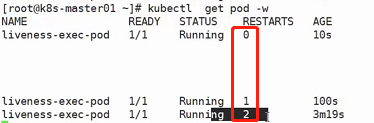

livenessProbe\-httpget

```yaml
apiVersion: v1
kind: Pod
metadata:
  name: liveness-httpget-pod
  namespace: default
spec:
  containers:
  - name: liveness-httpget-container
    image: hub.atguigu.com/library/myapp:v1
    imagePullPolicy: IfNotPresent
    ports:
    # 这里定义的http目的是为了复用
    - name: http
      containerPort: 80
    # 注意，不管是readinessProbe还是livenessProbe还是Init C还是start还是stop都是可以绑在一个容器下配合使用的，这里是为了演示方便，才单独分开写
    livenessProbe:
      httpGet:
        # 这里的http是复用了上面定义的http
        port: http
        path: /index.html
      initialDelaySeconds: 1
      periodSeconds: 3
      timeoutSeconds: 10
```

livenessProbe\-tcp

```yaml
apiVersion: v1
kind: Pod
metadata:
  name: probe-tcp
spec:
  containers:
  - name: nginx
  	image: hub.atguigu.com/library/myapp:v1
  	# 注意，不管是readinessProbe还是livenessProbe还是Init C还是start还是stop都是可以绑在一个容器下配合使用的，这里是为了演示方便，才单独分开写
  	livenessProbe:
  	  initialDelaySeconds: 5
  	  timeoutSeconds: 1
  	  tcpSocket:
  	    port: 80
  	  # 下面这行如果不加，就会使用默认的周期时间
  	  periodSeconds: 3
```

#### 启动、退出动作

```yaml
apiVersion: v1
kind: Pod
metadata:
  name: lifecycle-demo
spec:
  containers:
  - name: lifecycle-demo-container
    image: nginx
    lifecycle:
      postStart:
        exec:
          command: ["/bin/sh", "-c", "echo Hello from the postStart handler > /usr/share/message"]
      preStop:
        exec:
          # 当然这里可以执行任何你想要的代码，比方说数据库备份等等
          command: ["/bin/sh", "-c", "echo Hello from the poststop handler > /usr/share/message"]
```

### kubernetes 状态示例

**Pod中只有一个容器并且正在运行，容器成功退出**

- 记录事件完成
- 如果restartPolicy为：
  - Always：重启容器；Pod phase 仍为 Running
  - OnFailure：Pod phase 变成 Succeeded 
  - Never：Pod phase 变成 Succeeded

**Pod中只有一个容器并且正在运行。容器退出失败**

- 记录失败事件
- 如果restartPolicy为：
  - Always：重启容器；Pod phase 仍为 Running
  - OnFailure：重启容器；Pod phase 仍为 Running
  - Never：Pod phase 变成 Failed

**Pod中有两个容器并且正在运行。容器1退出失败**

- 记录失败事件
- 如果restartPolicy为：
  - Always：重启容器；Pod phase 仍为 Running
  - OnFailure：重启容器；Pod phase 仍为 Running
  - Never：不重启容器；Pod phase 仍为 Running
- 如果有容器1没有处于运行状态，并且容器2退出：
  - 记录失败事件
  - 如果restartPolicy为：
    - Always：重启容器；Pod phase 仍为 Running
    - OnFailure：重启容器；Pod phase 仍为 Running
    - Never：Pod phase 变成 Failed

**Pod中只有一个容器并处于运行状态。容器运行时内存超出限制**

- 容器以失败状态终止
- 记录OOM事件
- 如果restartPolicy为：
  - Always：重启容器；Pod phase 仍为 Running
  - OnFailure：重启容器；Pod phase 仍为 Running
  - Never:记录失败事件；Pod phase 仍为 Failed

**Pod正在运行，磁盘故障**

- 杀掉所有容器。记录适当事件
- Pod phase 变成 Failed
- 如果使用控制器来运行，Pod 将在别处重建

**Pod正在运行，其节点被分段**

- 节点控制器等待直到超时
- 节点控制器将 Pod phase 设置为 Failed
- 如果是用控制器来运行，Pod 将在别处重建

### Pod hook

Pod hook（钩子）是由 Kubernetes 管理的 kubelet 发起的，当容器中的进程启动前或者容器中的进程终止之前运行，这是包含在容器的生命周期之中。可以同时为 Pod 中的所有容器都配置 hook

Hook 的类型包括两种：

- exec：执行一段命令
- HTTP：发送HTTP请求

### Pod phase

Pod 的 status 字段是一个 PodStatus 对象，PodStatus中有一个 phase 字段。

Pod 的相位（phase）是 Pod 在其生命周期中的简单宏观概述。该阶段并不是对容器或 Pod 的综合汇总，也不是为了做为综合状态机

Pod 相位的数量和含义是严格指定的。除了本文档中列举的状态外，不应该再假定 Pod 有其他的phase 值

**Pod phase 可能存在的值**

- 挂起（Pending）：Pod 已被 Kubernetes 系统接受，但有一个或者多个容器镜像尚未创建。等待时间包括调度 Pod 的时间和通过网络下载镜像的时间，这可能需要花点时间

- 运行中（Running）：该 Pod 已经绑定到了一个节点上，Pod 中所有的容器都已被创建。至少有一个容器正在运行，或者正处于启动或重启状态

- 成功（Succeeded）：Pod 中的所有容器都被成功终止，并且不会再重启

- 失败（Failed）：Pod 中的所有容器都已终止了，并且至少有一个容器是因为失败终止。也就是说，容器以非 0 状态退出或者被系统终止

- 未知（Unknown）：因为某些原因无法取得 Pod 的状态，通常是因为与 Pod 所在主机通信失败

### 重启策略

PodSpec 中有一个 restartPolicy 字段，可能的值为 Always、OnFailure 和 Never。默认为Always。restartPolicy 适用于 Pod 中的所有容器。restartPolicy 仅指通过同一节点上的kubelet 重新启动容器。失败的容器由 kubelet 以五分钟为上限的指数退避延迟（10秒，20秒，40秒...）重新启动，并在成功执行十分钟后重置。如 Pod 文档 中所述，一旦绑定到一个节点，Pod 将永远不会重新绑定到另一个节点。

## yaml语法

### 简单说明

是一个可读性高，用来表达数据序列的格式。YAML 的意思其实是：仍是一种标记语言，但为了强调这种语言以数据做为中心，而不是以标记语言为重点

### 基本语法

- 缩进时不允许使用Tab键，只允许使用空格
- 缩进的空格数目不重要，只要相同层级的元素左侧对齐即可
- \# 标识注释，从这个字符一直到行尾，都会被解释器忽略

### YAML支持的数据结构

- 对象：键值对的集合，又称为映射（mapping）/哈希（hashes）/字典（dictionary）
- 数组：一组按次序排列的值，又称为序列（sequence）/列表（list）
- 纯量（scalars）：单个的、不可再分的值

### 对象类型：对象的一组键值对，使用冒号结构表示

```yaml
name: Steve
age: 18
```

Yaml也允许另一种写法，将所有键值对写成一个行内对象

```yaml
hash: { name: Steve, age: 18 }
```

### 数组类型：一组连词线开头的行，构成一个数组

```yaml
animal:
- Cat
- Dog
```

```yaml
animal: [Cat, Dog]
```

### 复合结构：对象和数组可以结合使用，形成复合结构

```yaml
languages: 
- Ruby
- Perl
- Python
websites:
  YAML: yaml.org
  Ruby: ruby-lang.org
  Python: python.org
  Perl: use.perl.org
```

### 纯量：纯量是最基本的、不可再分的值。以下数据类型都属于纯量

```
1 字符串 布尔值 整数 浮点数 Null
2 时间 日期

数值直接以字面量的形式表示
number: 12.30
布尔值用true和false表示
isSet: true

null用 ~ 表示
parent: ~

时间采用 ISO8601 格式
iso8601: 2001-12-14t21:59:43.10-05:00

日期采用复合 iso8601 格式的年、月、日表示
date: 1976-07-31

YAML 允许使用两个感叹号，强制转换数据类型
e: !!str 123
f: !!str true
```

### 字符串

字符串默认不使用引号表示

```yaml
str: 这是一行字符串
```

如果字符串之中包含空格或特殊字符，需要放在引号之中

```yaml
str: '内容：字符串'
```

单引号和双引号都可以使用，双引号不会对特殊字符转义

```yaml
s1: '内容\n字符串'
s2: "内容\n字符串"
```

单引号之中如果还有单引号，必须连续使用两个单引号转义

```yaml
# 原先使用的转义符是 \ ，在yaml中转义符是 ' 
str: 'labor''sday'
```

字符串可以写成多行，从第二行开始，必须有一个单空格缩进。换行符会被转为空格

```yaml
str: 这是一段
 多行
 字符串
```

多行字符串可以使用\|保留换行符，也可以使用\>折叠换行

```yaml
this: |
Foo
Bar
that: >
Foo
Bar
```

\+表示保留文字块末尾的换行，\-表示删除字符串末尾的换行

```yaml
s1: |
 Foo
 
s2: |+
 Foo

s3: |-
 Foo
```

## Ingress

如果要使用nginx四层https加密协议代理，可以采用这种架构：

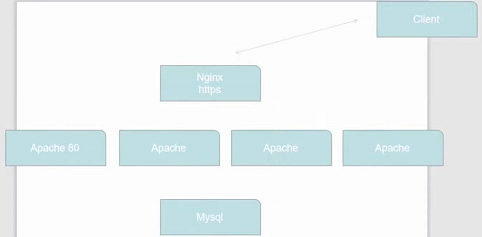

他使用nginx作为反向代理，只需nginx中配置https协议，apache跟nginx由于处于同一个内部服务，他们之间的通讯没有必要采用耗费资源的https协议，只需采用http协议就行，之后客户端通过访问nginx来访问服务，那么他们之间走的必然是https加密协议。

但如果在k8s环境中（不使用nginx而是使用service）呢？那就必须给每一个apache都安装上https加密协议，然后service再做负载均衡，才能达到效果。这显然是不合理的。

为了解决这种需求，Ingress就诞生了。

### 资料信息

`Ingress-Nginx` github地址：https://github.com/kubernetes/ingress-nginx

`Ingress-Nginx`官方网站：https://kubernetes.github.io/ingress-nginx/

注意：

- Ingress可以跟nginx搭配，当然也可以跟haproxy等等的搭配，这里我们就用最常用最熟悉的nginx即可
- Ingress是七层代理

看下图，客户端需要先访问域名，也就是说对于Ingress来讲必须要绑定域名（可以有多个域名，这几个域名最终访问的都是Nginx软件），毕竟他是七层代理。Nginx会反向代理负载均衡到后端的svc。

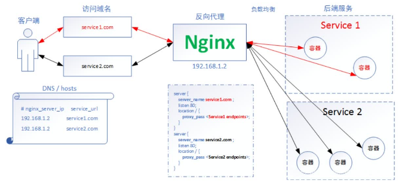

Nginx通过NodePort模式暴露给外部

在这种情况下他会帮我们配置Nginx，可以看到Nginx内部有这样一个配置文件：

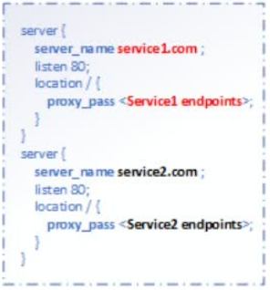

在这种访问方式下，我们不需要进入Nginx内部去写配置文件，配置文件会自动添加

看一下被Ingress修改之后的Nginx进程以及协程之间的沟通机制：

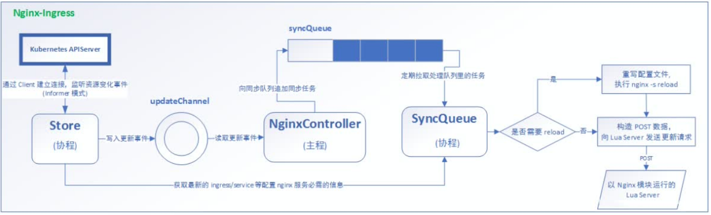

### 部署`Ingress-Nginx`

首先进入Ingress官网，进入Deployment部署页面，找到Installation Guide安装向导

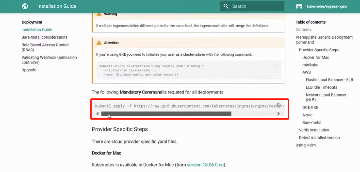

可以看到`kubectl apply -f xxx`后面一串其实是一个yaml文件地址，可以先创建相应的文件夹，并用wget命令把他下载下来

然后可以查看这个yaml文件中用到什么镜像，可以使用docker先把他下载下来，防止后续`kubectl apply`的时候很慢，通过命令`cat xxx.yaml | grep image`可以看到：

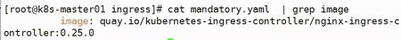

此时我们就知道要下载什么镜像了，使用命令`docker pull xxx`即可

由于是演示，我们现在要做这样的操作：首先将下载的镜像传至本地主机（Windows），再从本地主机将该镜像传至服务器，再在服务器之间传递并使用该镜像文件。可以使用命令`docker save -o xxx（压缩包名） xxx（镜像id）`将该镜像打包保存，使用命令`tar -zcvf xxx.gz xxx.tar`将文件`xxx.tar`打包成`xxx.gz`，再使用sz命令将该`xxx.gz`发送到本地主机（Windows），然后使用rz命令将本地主机中的`xxx.gz`发送到服务器上，使用命令`scp xxx.gz root@k8s-node02:/root/`将`xxx.gz`文件传至其他服务器上，之后在每个服务器上使用命令`tar -zxvf xxx.gz`即可做解压（解压之后其实就是`xxx.tar`的一个镜像文件），然后使用`docker load -i xxx.tar`即可加载镜像。

做完上面的步骤之后，使用`kubectl apply -f xxx.yaml`执行刚刚下载的yaml文件

然后再回到官网找对应的暴露模式，这里我们演示的时候使用的是裸金属架构，可以看到他说"Using NodePort"使用NodePort模式

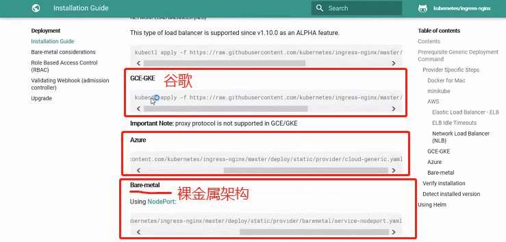

还是使用wget复制链接下载该yaml文件，然后直接`kubectl apply -f xxx.yaml`运行即可

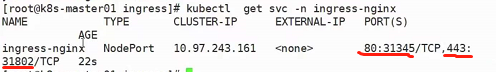

这个时候已经暴露完Nginx了

要注意的是假设此时有6台服务器三主三从，此时Ingress通过NodePort暴露给外部，是指6台服务器每台服务器各自都通过NodePort将Ingress暴露给外部，那么如果要高可用的话最好在这6台服务器之上再来一个LVS或Haproxy或Nginx作为转发，原因显而易见，如果只绑定了某一台服务器，一旦这台服务器挂了，那Ingress就失效了，当然如果服务器可用性高，那么只绑定某一台服务器也是可以的

### Ingress HTTP代理访问

deployment、Service、Ingress Yaml文件：

```yaml
apiVersion: extensions/v1beta1
kind: Deployment
metadata:
  name: nginx-dm
spec:
  replicas: 2
  template:
    metadata:
      labels:
        name: nginx
    spec:
      containers:
        - name: nginx
          image: wangyanglinux/myapp:v1
          imagePullPolicy: IfNotPresent
          ports:
            - containerPort: 80
---
apiVersion: v1
kind: Service
metadata:
  name: nginx-svc
spec:
  ports:
    - port: 80
      targetPort: 80
      protocol: TCP
  selector:
    name: nginx
---
apiVersion: extensions/v1beta1
kind: Ingress
metadata:
  name: nginx-test
spec:
  rules:
    - host: www1.atguigu.com
      http:
        paths:
        # / 表示根，意思是访问域名www1.atguigu.com的根路径
        - path: /
          backend:
          	# svc的名称
            serviceName: nginx-svc
            servicePort: 80
```

使用`kubectl apply -f`执行上述yaml

之后再做一下域名映射：

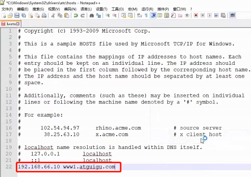

使用命令`kubectl get svc -n ingress-nginx`查看`ingress-nginx`暴露给外部的端口，然后通过域名加端口的方式即可访问

现在我们来搭建一个架构：

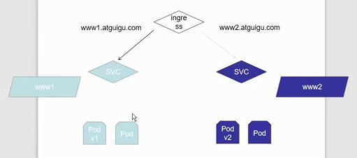

首先创建一个文件夹`ingress-vh`，我们在该文件夹目录下创建整个架构

创建上图左半边的deployment和svc的yaml文件并执行：

```yaml
apiVersion: extensions/v1beta1
kind: Deployment
metadata:
  name: deployment1
spec:
  replicas: 2
  template:
    metadata:
      labels:
        name: nginx1
    spec:
      containers:
        - name: nginx1
          image: wangyanglinux/myapp:v1
          imagePullPolicy: IfNotPresent
          ports:
            - containerPort: 80
---
apiVersion: v1
kind: Service
metadata:
  name: svc1
spec:
  ports:
    - port: 80
      targetPort: 80
      protocol: TCP
  selector:
    name: nginx1
```

创建上图右半边的deployment和svc的yaml文件并执行：

把上述yaml中的标签选择器和容器名称中的1改成2，然后把镜像版本由v1改成v2就是右半边的yaml文件。

创建Ingress规则：

```yaml
apiVersion: extensions/v1beta1
kind: Ingress
metadata:
  name: ingress1
spec:
  rules:
    - host: www1.atguigu.com
      http:
        paths:
        # / 表示根，意思是访问域名www1.atguigu.com的根路径
        - path: /
          backend:
          	# svc的名称
            serviceName: svc1
            servicePort: 80
---
apiVersion: extensions/v1beta1
kind: Ingress
metadata:
  name: ingress2
spec:
  rules:
    - host: www2.atguigu.com
      http:
        paths:
        # / 表示根，意思是访问域名www1.atguigu.com的根路径
        - path: /
          backend:
          	# svc的名称
            serviceName: svc2
            servicePort: 80
```

使用`kubectl apply -f`进行创建

创建完毕之后使用`kubectl get pod -n ingress-nginx`可以看到相关pod

使用`kubectl exec xxx（pod的id） -n ingress-nginx -it -- /bin/bash`

进入之后可以看到`nginx.conf`文件，文件中写着`www1.atguigu.com`和` www2.atguigu.com`的代理规则

由此可见，我们刚才写的ingress规则，他会把这些规则转化成nginx配置文件注入到nginx配置文件之中，达到访问的目的

然后还是去写一下域名映射：

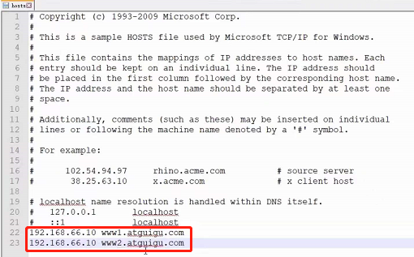

使用命令`kubectl get svc -n ingress-nginx`查看`ingress-nginx`暴露给外部的端口，然后通过域名加端口的方式即可访问

使用命令`kubectl get ingress`即可看到ingress的规则：

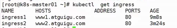

### IngressHTTPS代理访问

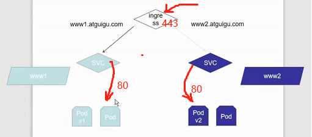

创建一个新的工作目录，创建证书，以及cert存储方式

```
openssl req -x509 -sha256 -nodes -days 365 -newkey rsa:2048 -keyout tls.key -out tls.crt -subj "/CN=nginxsvc/O=nginxsvc"

# 以secret方式进行保存，类型为tls，创建的文件是tls-secret 使用的key（私钥）是tls.key，使用的cert（证书）是tls.crt
kubectl create secret tls tls-secret --key tls.key --cert tls.crt
```

deployment、Service、Ingress Yaml文件：

```yaml
apiVersion: extensions/v1beta1
kind: Deployment
metadata:
  name: deployment3
spec:
  replicas: 2
  template:
    metadata:
      labels:
        name: nginx3
    spec:
      containers:
        - name: nginx3
          image: wangyanglinux/myapp:v3
          imagePullPolicy: IfNotPresent
          ports:
            - containerPort: 80
---
apiVersion: v1
kind: Service
metadata:
  name: svc3
spec:
  ports:
    - port: 80
      targetPort: 80
      protocol: TCP
  selector:
    name: nginx3
---
apiVersion: extensions/v1beta1
kind: Ingress
metadata:
  name: https
spec:
  tls:
    - hosts:
      - www3.atguigu.com
      # 密钥文件名要与上面创建的密钥文件名对应起来
      secretName: tls-secret
    rules:
      - host: www3.atguigu.com
        http:
          paths:
          # / 表示根，意思是访问域名www1.atguigu.com的根路径
          - path: /
            backend:
              # svc的名称
              serviceName: svc3
              servicePort: 80
```

创建之后再去修改一下域名映射：

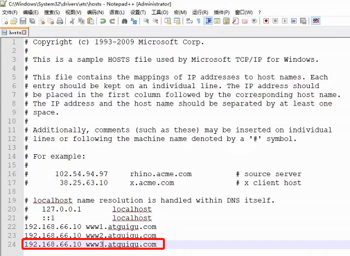

打开浏览器，使用https://www3.atguigu.com访问即可

### Nginx进行BasicAuth（身份认证）

在这里我们用的ingress实现方案采用的是nginx软件，因此nginx支持的特性他都支持

```
yum -y install httpd

# 创建的文件名为auth，用户名为foo
htpasswd -c auth foo

# 以secret方式进行保存，类型是generic，创建的文件名是basic-auth，通过文件“auth”进行创建的
kubectl create secret generic basic-auth --from-file=auth
```

ingress的yaml：

```yaml
apiVersion: extensions/v1beta1
kind: Ingress
metadata:
  name: ingress-with-auth
  # 如果要给ingress加密的话，只需要添加下面这几行annotations即可（具体查看官网https://kubernetes.github.io/ingress-nginx/）
  annotations:
    nginx.ingress.kubernetes.io/auth-type: basic
    nginx.ingress.kubernetes.io/auth-secret: basic-auth
    nginx.ingress.kubernetes.io/auth-realm: 'AuthenticationRequired-foo'
spec:
  rules:
  - host: auth.atguigu.com
    http:
      paths:
      - path: /
        backend:
          serviceName: svc1
          servicePort: 80
```

总的来讲，如果要给ingress加密的话，只需要添加上图那几行annotations即可（具体查看官网https://kubernetes.github.io/ingress-nginx/）

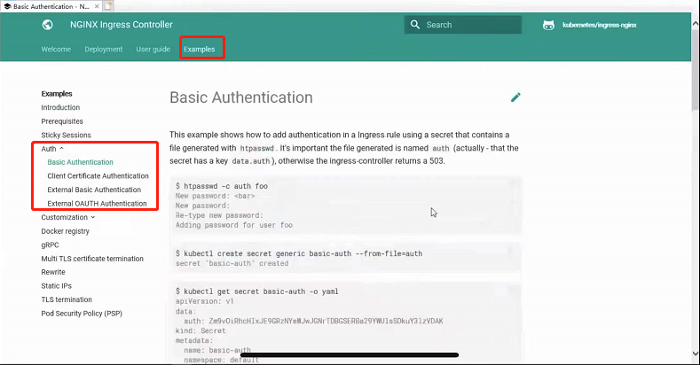

当然，还有一些别的知识，比如gRPC代理等都可以通过官网学习：

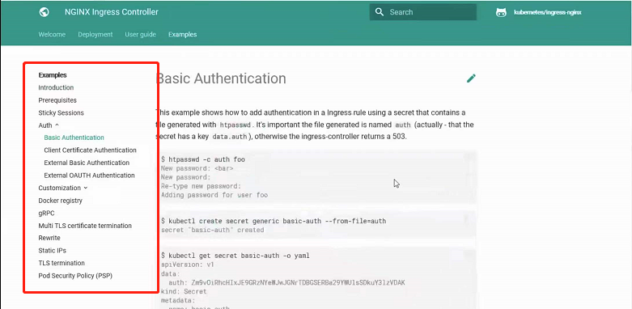

最后添加域名映射：

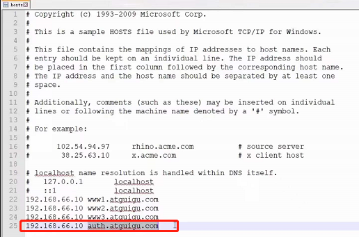

此时访问就需要输入密码了：

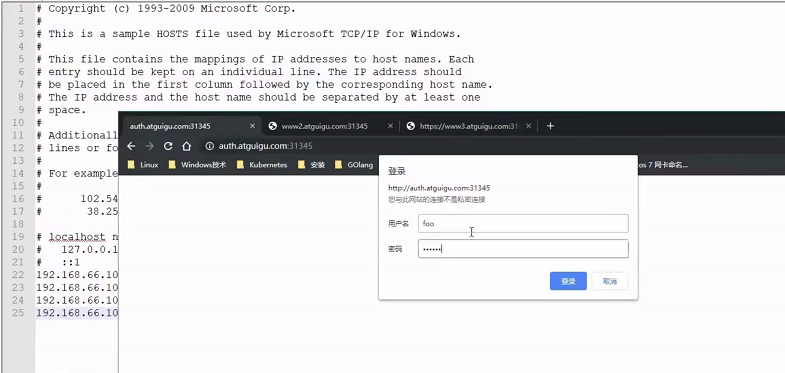

### Nginx进行重写

| 名称                                             | 描述                                                         | 类型   |
| ------------------------------------------------ | ------------------------------------------------------------ | ------ |
| `nginx.ingress.kubernetes.io/rewrite-target`     | 必须重定向流量的目标URI                                      | 字符串 |
| `nginx.ingress.kubernetes.io/ssl-redirect`       | 指示位置部分是否仅可访问SSL（当Ingress包含证书时默认为True） | 布尔值 |
| `nginx.ingress.kubernetes.io/force-ssl-redirect` | 即使Ingress未启用TLS，也强制重定向到HTTPS                    | 布尔值 |
| `nginx.ingress.kubernetes.io/app-root`           | 定义Controller必须重定向的应用程序根，如果它在'/'上下文中    | 字符串 |
| `nginx.ingress.kubernetes.io/use-regex`          | 指示Ingress上定义的路径是否使用正则表达式                    | 布尔值 |

案例：

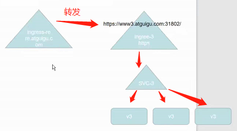

我们想实现客户端访问一个ingress的流量全部转发到另一个ingress

yaml文件：

```yaml
apiVersion: extensions/v1beta1
kind: Ingress
metadata:
  name: nginx-test
  annotations:
    nginx.ingress.kubernetes.io/rewrite-target: https://www3.atguigu.com:31802
spec:
  rules:
  - host: re.atguigu.com
    http:
      paths:
      - path: /
        backend:
          serviceName: svc1
          servicePort: 80
```

添加域名映射：

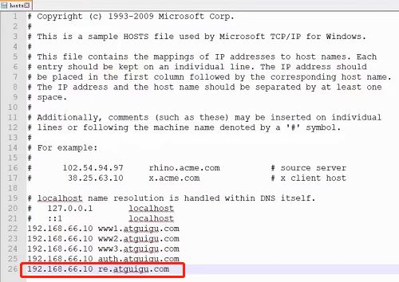

此时访问`re.atguigu.com`就能跳转到`https://www3.atguigu.com:31802`

如果要了解更多，直接去官网：https://kubernetes.github.io/ingress-nginx/

## 存储

### ConfigMap

#### ConfigMap介绍

ConfigMap功能在Kubernetes1.2版本中引入，许多应用程序会从配置文件、命令行参数或环境变量中读取配置信息。ConfigMap API给我们提供了向容器中注入配置信息的机制，ConfigMap可以被用来保存单个属性，也可以用来保存整个配置文件或者JSON二进制大对象。

首先来看看配置文件注册中心，如果有多个集群，每个集群有多个nginx，那么一旦集群需要修改nginx配置文件的时候，会去配置文件注册中心索要自己集群的配置文件，配置中心会根据一些信息匹配对应的集群，比如主机名、ip地址等，匹配到之后会分配对应的配置文件，不同的集群会索要到不同的配置文件。这样配置文件变动只需要在配置中心变动即可了，一旦配置中心变动就能触发对应集群的进程去修改集群内的配置文件，非常方便。


k8s中也是类似配置文件注册中心向下分发的模式：


pod用到相关配置时会去configMap中寻找相关配置文件，一旦configMap发生变动，pod中的配置也会变，当然nginx不支持热更新（traefik就支持，traefik是用go写的类似nginx的工具），需要重新加载pod配置才能生效

#### ConfigMap的创建

**Ⅰ、使用目录创建**

```
$ ls docs/user-guide/configmap/kubectl/
game.properties
ui.properties

$ cat docs/user-guide/configmap/kubectl/game.properties
enemies=aliens
lives=3
enemies.cheat=true
enemies.cheat.level=noGoodRotten
secret.code.passphrase=UUDDLRLRBABAS
secret.code.allowed=true
secret.code.lives=30

$ cat docs/user-guide/configmap/kubectl/ui.properties
color.good=purple
color.bad=yellow
allow.textmode=true
how.nice.to.look=fairlyNice

$ kubectl create configmap game-config --from-file=docs/user-guide/configmap/kubectl
```

`--from-file`指定在目录下的所有文件都会被用在ConfigMap里面创建一个键值对，键的名字就是文件名，值就是文件的内容

使用`kubectl get configmap`或`kubectl get cm`查看ConfigMap

使用`kubectl get cm game-config（具体某个ConfigMap） -o yaml`可以看到该ConfigMap的具体yaml信息（配置信息、键名键值等）

也可以使用`kubectl describe cm game-config（具体某个ConfigMap）`来查看该ConfigMap的具体信息（配置信息、键名键值等）

**Ⅱ、使用文件创建**

只要指定为一个文件就可以从单个文件中创建ConfigMap

```
$ kubectl create configmap game-config-2 --from-file=docs/user-guide/configmap/kubectl/game.properties

$ kubectl get configmaps game-config-2 -o yaml
```

`--from-file`这个参数可以使用多次，你可以使用两次分别指定上个实例中的那两个配置文件，效果就跟指定整个目录是一样的

**Ⅲ、使用字面值创建**

使用文字值创建，利用`--from-literal`参数传递配置信息，该参数可以使用多次，格式如下

```
$ kubectl create configmap special-config --from-literal=special.how=very --from-literal=special.type=charm

$ kubectl get configmaps special-config -o yaml
```

#### Pod中使用ConfigMap

**Ⅰ、使用ConfigMap来替代环境变量**

```yaml
apiVersion: v1
kind: ConfigMap
metadata:
  name: special-config
  namespace: default
data:
  special.how: very
  special.type: charm
```

```yaml
apiVersion: v1
kind: ConfigMap
metadata:
  name: env-config
  namespace: default
data:
  log_level: INFO
```

```yaml
apiVersion: v1
kind: Pod
metadata:
  name: dapi-test-pod
spec:
  containers:
    - name: test-container
      image: hub.atguigu.com/library/myapp:v1
      command: ["/bin/sh","-c","env"]
      # 第一种注入方式（两种方式可以共用）
      env:
        - name: SPECIAL_LEVEL_KEY
          valueFrom:
            configMapKeyRef:
              name: special-config
              key: special.how
        - name: SPECIAL_TYPE_KEY
          valueFrom:
            configMapKeyRef:
              name: special-config
              key: special.type
      # 第二种注入方式（两种方式可以共用）
      envFrom:
        - configMapRef:
          name: env-config
  restartPolicy: Never
```

通过`kubectl create -f`命令创建该pod之后，由于执行了命令`/bin/sh -c env`，因此pod中会输出环境变量，可以使用`kubectl log dapi-test-pod（pod名称）`打印pod日志，就可以看到通过ConfigMap注入pod的环境变量被输出

**Ⅱ、用ConfigMap设置命令行参数**

```yaml
apiVersion: v1
kind: ConfigMap
metadata:
  name: special-config
  namespace: default
data:
  special.how: very
  special.type: charm
```

```yaml
apiVersion: v1
kind: Pod
metadata:
  name: dapi-test-pod
spec:
  containers:
    - name: test-container
      image: hub.atguigu.com/library/myapp:v1
      command: ["/bin/sh","-c","echo $(SPECIAL_LEVEL_KEY)$(SPECIAL_TYPE_KEY)"]
      env:
        - name: SPECIAL_LEVEL_KEY
          valueFrom:
            configMapKeyRef:
              name: special-config
              key: special.how
        - name: SPECIAL_TYPE_KEY
          valueFrom:
          configMapKeyRef:
          name: special-config
          key: special.type
  restartPolicy: Never
```

通过`kubectl create -f`命令创建该pod，使用`kubectl log`命令查看pod日志，可以看到通过ConfigMap注入pod的环境变量被输出

**Ⅲ、通过数据卷插件使用ConfigMap**

```yaml
apiVersion: v1
kind: ConfigMap
metadata:
  name: special-config
  namespace: default
data:
  special.how: very
  special.type: charm
```

在数据卷里面使用这个ConfigMap，有不同的选项。最基本的就是将文件填入数据卷，在这个文件中，键就是文件名，键值就是文件内容

```yaml
apiVersion: v1
kind: Pod
metadata:
  name: dapi-test-pod
spec:
  containers:
    - name: test-container
      image: hub.atguigu.com/library/myapp:v1
      command: ["/bin/sh","-c","cat /etc/config/special.how"]
      volumeMounts:
      - name: config-volume
        mountPath: /etc/config
  volumes:
    - name: config-volume
      configMap:
        name: special-config
  restartPolicy: Never
```

创建了pod之后，可以用`kubectl log`查看输出日志来判断ConfigMap是否被注入，也可以直接使用`kubectl exec xxx -it -- /bin/bash`或`kubectl exec xxx -it -- /bin/sh`进入pod中然后使用cat命令来做判断，当然也可以直接使用`kubectl exec xxx -it -- cat /etc/config/special.how`来做判断

#### ConfigMap的热更新

```yaml
apiVersion: v1
kind: ConfigMap
metadata:
  name: log-config
  namespace: default
data:
  log_level: INFO
---
apiVersion: extensions/v1beta1
kind: Deployment
metadata:
  name: my-nginx
spec:
  replicas: 1
  template:
    metadata:
      labels:
        run: my-nginx
    spec:
      containers:
      - name: my-nginx
        image: hub.atguigu.com/library/myapp:v1
        ports:
        - containerPort: 80
        volumeMounts:
        - name: config-volume
          mountPath: /etc/config
      volumes:
        - name: config-volume
          configMap:
            name: log-config
```

```
$ kubectl exec `kubectl get pods -l run=my-nginx -o=name|cut -d "/" -f2` cat/etc/config/log_level
INFO
```

修改ConfigMap

```
$ kubectl edit configmap log-config
```

修改`log_level`的值为`DEBUG`等待大概10秒钟时间，再次查看环境变量的值

```
$ kubectl exec `kubectl get pods -l run=my-nginx -o=name|cut -d "/" -f2` cat /tmp/log_level
DEBUG
```

当然，如果把这个思想应用到修改nginx配置文件时，由于nginx只在启动时会去看一次配置文件，之后就不会再去看了，所以配置文件改了对于已经启动的nginx来说没有什么影响，除非把pod重启，被修改的配置才会生效

ConfigMap更新后滚动更新Pod

更新ConfigMap目前并不会触发相关Pod的滚动更新，可以通过修改pod annotations的方式强制触发滚动更新

```
$ kubectl patch deployment my-nginx --patch '{"spec": {"template": {"metadata": {"annotations": {"version/config": "20190411"}}}}}'
```

这个例子里我们在`.spec.template.metadata.annotations`中添加`version/config`，每次通过修改`version/config`来触发滚动更新

更新ConfigMap后：

- 使用该ConfigMap挂载的Env不会同步更新
- 使用该ConfigMap挂载的Volume中的数据需要一段时间（实测大概10秒）才能同步更新

### Secret

#### Secret存在意义

Secret解决了密码、token、密钥等敏感数据的配置问题，而不需要把这些敏感数据暴露到镜像或者Pod Spec中。Secret可以以Volume或者环境变量的方式使用

Secret有三种类型：

- Service Account

  用来访问Kubernetes API，由Kubernetes自动创建，并且会自动挂载到Pod的`/run/secrets/kubernetes.io/serviceaccount`目录中

- Opaque

  base64编码格式的Secret，用来存储密码、密钥等

- `kubernetes.io/dockerconfigjson`

  用来存储私有docker registry的认证信息

#### Service Account（不常用）

像flannel、coreDNS这些组件都是需要跟Kubernetes API进行交互的，显然Kubernetes API有可能会造成一些安全问题，因此Kubernetes API不能随便对外提供访问，因为他是k8s一切交互的入口，他的加密就等于集群的加密

为了安全，pod的访问机制就是Service Account，他通过挂载Service Account来保证安全

Service Account用来访问Kubernetes API，由Kubernetes自动创建，并且会自动挂载到Pod的`/run/secrets/kubernetes.io/serviceaccount`目录中

简单来看一下：

使用`kubectl get pod -n kube-system`，然后随便找一个pod进入，cd到`secrets/kubernetes.io`目录下，有一个文件夹serviceaccount，进入之后有三个文件：`ca.crt`（密钥）、`namespace`（名称空间）、`token`（认证信息）。由这三个组成了Service Account，也正是这三个文件让kube proxy能够通过认证访问api。

```
$ kubectl run nginx --image nginx
 deployment "nginx" created

$ kubectl get pods
 NAME                     READY       STATUS        RESTARTS     AGE
 nginx-3137573019-md1u2   1/1         Running       0            13s

$ kubectl exec nginx-3137573019-md1u2 ls /run/secrets/kubernetes.io/serviceaccount
 ca.crt
 namespace
 token
```

#### Opaque Secret

**Ⅰ、创建说明**

Opaque类型的数据是一个map类型，要求value是base64编码格式：

```
$ echo -n "admin" | base64
 YWRtaW4=

$ echo -n "1f2d1e2e67df" | base64
 MWYyZDFlMmU2N2Rm
```

`secrets.yml`：

```yaml
apiVersion: v1
kind: Secret
metadata:
  name: mysecret
type: Opaque
data:
  password: MWYyZDFlMmU2N2Rm
  username: YWRtaW4=
```

使用`kubectl apply -f`创建，使用`kubectl get secret`查看，如果要看系统的secret，则可以使用`kubectl get secret -n kube-system`

**Ⅱ、使用方式**

1、将Secret挂载到Volume中

```yaml
apiVersion: v1
kind: Pod
metadata:
  labels:
    name: seret-test
  name: seret-test
spec:
  volumes:
  - name: secrets
    secret:
      secretName: mysecret
  containers:
  - image: hub.atguigu.com/library/myapp:v1
    name:db
    volumeMounts:
    - name: secrets
      mountPath: "
      readOnly: true
```

2、将Secret导出到环境变量中

```yaml
apiVersion: extensions/v1beta1
kind: Deployment
metadata:
  name: pod-deployment
spec:
  replicas: 2
  template:
    metadata:
      labels:
        app: pod-deployment
    spec:
      containers:
      - name: pod-1
        image: hub.atguigu.com/library/myapp:v1
        ports:
        - containerPort: 80
        env:
        - name: TEST_USER
          valueFrom:
            secretKeyRef:
              name: mysecret
              key: username
        -name: TEST_PASSWORD
          valueFrom:
            secretKeyRef:
              name: mysecret
              key: password
```

#### kubernetes.io/dockerconfigjson

进入docker harbor，创建一个私有仓库，远程客户端上登录harbor之后推送一个镜像上去

使用Kuberctl创建docker registry认证的secret

```
$ kubectl create secret docker-registry myregistrykey --docker-server=DOCKER_REGISTRY_SERVER --docker-username=DOCKER_USER --docker-password=DOCKER_PASSWORD --docker-email=DOCKER_EMAIL
secret "myregistrykey" created.
```

在创建Pod的时候，通过imagePullSecrets来引用刚创建的`myregistrykey`

```yaml
apiVersion: v1
kind: Pod
metadata:
  name: foo
spec:
  containers:
    - name: foo
      image: roc/awangyang:v1
  imagePullSecrets:
    - name: myregistrykey
```

### Volume

容器磁盘上的文件的生命周期是短暂的，这就使得在容器中运行重要应用时会出现一些问题。首先，当容器崩溃时，kubelet会重启它，但是容器中的文件将丢失——容器以干净的状态（镜像最初的状态）重新启动。其次，在Pod中同时运行多个容器时，这些容器之间通常需要共享文件。Kubernetes中的Volume抽象就很好的解决了这些问题

之前讲过，pod在启动时会先启动pause，pause的主要目的是共享网络和存储卷，一旦volume挂载到pod之后，pod中所有的容器都可以在一个固定的位置访问到卷


上图中c1、c2可能会销毁重建，但volume的位置不变，意味着存储卷不会消失

#### 背景

Kubernetes中的卷有明确的寿命——与封装它的Pod相同。所f以，卷的生命比Pod中的所有容器都长，当这个容器重启时数据仍然得以保存。当然，当Pod不再存在时，卷也将不复存在。也许更重要的是，Kubernetes支持多种类型的卷，Pod可以同时使用任意数量的卷

#### 卷的类型

Kubernetes支持以下类型的卷：

- awsElasticBlockStore
- azureDisk
- azureFile
- cephfs（分布式私有云存储，如何搭建使用自行百度）
- csi
- downwardAPI
- emptyDir
- fc
- flocker
- gcePersistentDisk
- gitRepo
- glusterfs
- hostPath
- iscsi
- local
- nfs
- persistentVolumeClaim
- projected
- portworxVolume
- quobyte
- rbd
- scaleIO
- secret
- storageos
- vsphereVolume

#### emptyDir

当Pod被分配给节点时，首先创建emptyDir卷，并且只要该Pod在该节点上运行，该卷就会存在。正如卷的名字所述，它最初是空的。Pod中的容器可以读取和写入emptyDir卷中的相同文件，尽管该卷可以挂载到每个容器中的相同或不同路径上。当出于任何原因从节点中删除Pod时，emptyDir中的数据将被永久删除

注意，容器崩溃不会从节点中移除pod，因此emptyDir卷中的数据在容器崩溃时是安全的


emptyDir的用法有：

- 暂存空间，例如用于基于磁盘的合并排序
- 用作长时间计算崩溃恢复时的检查点，例如容器重载的时候需要某些数据去执行恢复，但这些数据又不需要持久化，那就可以将数据存放在空卷中
- Web服务器容器提供数据时，保存内容管理器容器提取的文件，例如有一个web容器，他运行的时候会需要一些文件存在，那就可以去某个地方下载这些文件并保存到空卷中去使用

```yaml
apiVersion: v1
kind: Pod
metadata:
  name: test-pd
spec:
  containers:
  - image: k8s.gcr.io/test-webserver
    name: test-container1
    volumeMounts:
    - mountPath: /cache
      name: cache-volume
  - image: xxx
    name: test-container2
    volumeMounts:
    - mountPath: /test
      name: cache-volume
  volumes:
  - name: cache-volume
    emptyDir: {}
```

此时进入`test-container1`的`/cache`目录下写一些东西，就能在`test-container2`的`/test`目录下看到了

#### hostPath

hostPath卷将主机节点的文件系统中的文件或目录挂载到集群中

hostPath的用途如下：

- 运行需要访问Docker内部的容器；使用`/var/lib/docker的hostPath`
- 在容器中运行cAdvisor；使用`/dev/cgroups`的hostPath
- 允许pod指定给定的hostPath是否应该在pod运行之前存在，是否应该创建，以及它应该以什么形式存在

除了所需的path属性之外，用户还可以为hostPath卷指定type

| 值                | 行为                                                         |
| ----------------- | ------------------------------------------------------------ |
|                   | 空字符串（默认）用于向后兼容，这意味着在挂载hostPath卷之前不会执行任何检查。 |
| DirectoryOrCreate | 如果在给定的路径上没有任何东西存在，那么将根据需要在那里创建一个空目录，权限设置为0755，与Kubelet具有相同的组和所有权。 |
| Directory         | 给定的路径下必须存在目录                                     |
| FileOrCreate      | 如果在给定的路径上没有任何东西存在，那么会根据需要创建一个空文件，权限设置为0644，与Kubelet具有相同的组和所有权。 |
| File              | 给定的路径下必须存在文件                                     |
| Socket            | 给定的路径下必须存在UNIX套接字                               |
| CharDevice        | 给定的路径下必须存在字符设备                                 |
| BlockDevice       | 给定的路径下必须存在块设备                                   |

使用这种卷类型时请注意，因为：

- 由于每个节点上的文件都不同，具有相同配置（例如从podTemplate创建的）的pod在不同节点上的行为可能会有所不同（比方说一个节点有`/test`目录，但另一个没有，pod挂载的时候使用的都是`/test`目录，那么没有`/test`目录的节点必然会报错）
- 当Kubernetes按照计划添加资源感知调度时，将无法考虑hostPath使用的资源（资源管控不受k8s控制，而是受本机控制）
- 在底层主机上创建的文件或目录只能由root写入。您需要在特权容器中以root身份运行进程，或修改主机上的文件权限以便写入hostPath卷（文件没有操作权限自然就会报错，解决方法很简单就是赋予文件与kubelet相同的权限）

```yaml
apiVersion: v1
kind: Pod
metadata:
  name: test-pd
spec:
  containers:
  - image: k8s.gcr.io/test-webserver
    name: test-container
    volumeMounts:
    - mountPath: /test-pd
      name: test-volume
  volumes:
  - name: test-volume
    hostPath:
      # directory location on host
      path: /data
      # this field is optional
      type: Directory
```

hostPath非常灵活，理论上只要存储能共享到主机，就能使用

案例：

远程文件存储服务集群配合hostPath


### Persistent Volume

#### 概念

**PersistentVolume（PV）**

是由管理员设置的存储，它是群集的一部分。就像节点是集群中的资源一样，PV也是集群中的资源。PV是Volume之类的卷插件，但具有独立于使用PV的Pod的生命周期。此API对象包含存储实现的细节，即NFS、iSCSI或特定于云供应商的存储系统


为什么要有PV？

有了PV之后Pod使用存储卷与存储卷本身的部署就可以解耦了


**PersistentVolumeClaim（PVC）**

是用户存储的请求。它与Pod相似。Pod消耗节点资源，PVC消耗PV资源。Pod可以请求特定级别的资源（CPU和内存）。声明可以请求特定的大小和访问模式（例如，可以以读/写一次或只读多次模式挂载）

**静态pv**

集群管理员创建一些PV。它们带有可供群集用户使用的实际存储的细节。它们存在于Kubernetes API中，可用于消费

**动态**

当管理员创建的静态PV都不匹配用户的PersistentVolumeClaim时，集群可能会尝试动态地为PVC创建卷。此配置基于StorageClasses（SC）：PVC必须请求[存储类]，并且管理员必须创建并配置该类才能进行动态创建。声明该类为""可以有效地禁用其动态配置要启用基于存储级别的动态存储配置，集群管理员需要启用API server上的DefaultStorageClass[准入控制器]。例如，通过确保DefaultStorageClass位于API server组件的`--admission-control`标志，使用逗号分隔的有序值列表中，可以完成此操作

**绑定**

master中的控制环路监视新的PVC，寻找匹配的PV（如果可能），并将它们绑定在一起。如果为新的PVC动态调配PV，则该环路将始终将该PV绑定到PVC。否则，用户总会得到他们所请求的存储，但是容量可能超出要求的数量。一旦PV和PVC绑定后，PersistentVolumeClaim绑定是排他性的，不管它们是如何绑定的。PVC跟PV绑定是一对一的映射。绑定时，PV的空间大小基本是大于PVC的请求空间大小的，很少出现刚好等于的情况


为什么要有PVC？

因为如果只有PV的话，PV的大小、速度以及这个PV到底满不满足我Pod的要求等都需要我自己去做匹配，当有成千上万个PV的时候就很麻烦了，此时给每一个Pod配置一个PVC，让他自己去匹配合适的PV即可


比方说上图，Pod的PVC要求是：强壮、10GB的空间大小，那么就会匹配到合适的PV，注意这里为什么没有匹配到“强壮、20GB空间”的PV呢？因为已经有一个“强壮、11GB空间”的PV满足了我的要求了

#### 持久化卷声明的保护

PVC保护的目的是确保由pod正在使用的PVC不会从系统中移除，因为如果被移除的话可能会导致数据丢失（pod被删除之后pvc依然会存在于系统之中，并且依然会与pv绑定）

注意，当pod状态为“Pending”并且pod已经分配给节点或pod为“Running”状态时，pvc处于活动状态

当启用PVC保护alpha功能时，如果用户删除了一个pod正在使用的PVC，则该PVC不会被立即删除。PVC的删除将被推迟，直到PVC不再被任何pod使用

#### 持久化卷类型

PersistentVolume类型以插件形式实现。Kubernetes目前支持以下插件类型：

- GCEPersistentDisk
- AWSElasticBlockStore
- AzureFile 
- AzureDisk 
- FC (Fibre Channel)
- FlexVolume
- Flocker
- NFS
- iSCSI
- RBD (Ceph Block Device) 
- CephFS
- Cinder (OpenStack block storage) 
- Glusterfs 
- VsphereVolume 
- Quobyte 
- Volumes
- HostPath
- VMware 
- Photon 
- Portworx 
- Volumes 
- ScaleIO
- Volumes 
- StorageOS

持久卷演示代码：

```yaml
apiVersion: v1
kind: PersistentVolume
metadata:
  name: pv0003
spec:
  capacity:
    storage: 5Gi
  volumeMode: Filesystem
  accessModes:
    # ReadWriteOnce表示同一时间只允许一个人过来进行读写，超过一个人是不允许的
    - ReadWriteOnce
  # 回收策略
  persistentVolumeReclaimPolicy: Recycle
  storageClassName: slow
  # mountOptions可以不用指定，让他自行判断
  mountOptions:
    - hard
    - nfsvers=4.1
  nfs:
    path: /tmp
    server: 172.17.0.2
```

解释一下上面的“storageClassName”，比方说有三类存储，分别为慢、中、快，我们可以将他们分为一类、二类、三类：


此时设置“storageClassName”为二类的话，那么就会匹配到二类的存储卷。storageClassName是用于划分存储的非常重要的指标

#### PV访问模式

PersistentVolume可以以资源提供者支持的任何方式挂载到主机上。如下表所示，供应商具有不同的功能，每个PV的访问模式都将被设置为该卷支持的特定模式。例如，NFS可以支持多个读/写客户端，但特定的NFS PV可能以只读方式导出到服务器上。每个PV都有一套自己的用来描述特定功能的访问模式

- ReadWriteOnce

  该卷可以被单个节点以读/写模式挂载

- ReadOnlyMany

  该卷可以被多个节点以只读模式挂载

- ReadWriteMany

  该卷可以被多个节点以读/写模式挂载

在命令行中，访问模式缩写为：

- RWO

  ReadWriteOnce

- ROX

  ReadOnlyMany

- RWX

  ReadWriteMany

注意，一个卷一次只能使用一种访问模式挂载，即使他支持很多访问模式。例如，GCEPersistentDisk可以由单个节点作为ReadWriteOnce模式挂载，或由多个节点以ReadOnlyMany模式挂载，但不能同时挂载

| Volume 插件                              | ReadWriteOnce | ReadOnlyMany | ReadWriteMany        |
| ---------------------------------------- | ------------- | ------------ | -------------------- |
| AWSElasticBlockStoreAWSElasticBlockStore | ✓             | -            | -                    |
| AzureFile                                | ✓             | ✓            | ✓                    |
| AzureDisk                                | ✓             | -            | -                    |
| CephFS                                   | ✓             | ✓            | ✓                    |
| Cinder                                   | ✓             | -            | -                    |
| FC                                       | ✓             | ✓            | -                    |
| FlexVolume                               | ✓             | ✓            | -                    |
| Flocker                                  | ✓             | -            | -                    |
| GCEPersistentDisk                        | ✓             | ✓            | -                    |
| Glusterfs                                | ✓             | ✓            | ✓                    |
| HostPath                                 | ✓             | -            | -                    |
| iSCSI                                    | ✓             | ✓            | -                    |
| PhotonPersistentDisk                     | ✓             | -            | -                    |
| Quobyte                                  | ✓             | ✓            | ✓                    |
| NFS                                      | ✓             | ✓            | ✓                    |
| RBD                                      | ✓             | ✓            | -                    |
| VsphereVolume                            | ✓             | -            | -（当pod并列时有效） |
| PortworxVolume                           | ✓             | -            | ✓                    |
| ScaleIO                                  | ✓             | ✓            | -                    |
| StorageOS                                | ✓             | -            | -                    |

#### 回收策略

- Retain（保留）

  手动回收

- Recycle（回收）

  基本擦除（`rm -rf /thevolume/*`）

- Delete（删除）

  关联的存储资产（例如AWS EBS、GCE PD、Azure Disk和OpenStack Cinder卷）将被删除

当前，只有NFS和HostPath支持回收策略（NFS现在可能已经废弃了回收策略）。AWS EBS、GCE PD、Azure Disk和Cinder卷支持删除策略

#### 状态

卷可以处于以下的某种状态：

- Available（可用）

  一块空闲资源还没有被任何声明绑定

- Bound（已绑定）

  卷已经被声明绑定

  注意，如果访问模式是“ReadWriteMany”，则还是可以被其他的所使用的

- Released（已释放）

  声明被删除，但是资源还未被集群重新声明

- Failed（失败）

  该卷的自动回收失败

命令行会显示绑定到PV的PVC的名称

#### 持久化演示说明 - NFS

**Ⅰ、安装NFS服务器**

```
yum install -y nfs-common nfs-utils rpcbind
mkdir /nfsdata
chmod 666 /nfsdata
chown nfsnobody /nfsdata
cat /etc/exports
	/nfsdata *(rw,no_root_squash,no_all_squash,sync)
systemctl start rpcbind
systemctl start nfs
```

解释一下上面的“`cat /etc/exports
					/nfsdata *(rw,no_root_squash,no_all_squash,sync)`”：

实际演示中，老师是这么操作的：首先`vim /etc/exports`，打开文件之后直接写入`/nfsdata *(rw,no_root_squash,no_all_squash,sync)`，然后wq退出。`/nfsdata *(rw,no_root_squash,no_all_squash,sync)`的具体意义是：对于`/nfsdata`下的所有文件，赋予rw（读写权限）、`no_root_squash,no_all_squash`（管理员权限）、sync（同步方式）

安装完NFS服务器之后去所有的k8s节点安装nfs客户端以及rpcbind：

```
yum install -y nfs-utils rpcbind
```

然后在k8s集群使用命令`showmount -e NFS服务器ip地址`可以看到NFS服务器文件挂载目录：


使用命令`mount -t nfs NFS服务器ip地址:可以看到NFS服务器文件挂载目录 本机文件挂载目录`就可以进行挂载：


然后进入本机`/test`目录，写一个文件进去，然后执行`umount /test`取消挂载，执行`rm -rf /test`删除test文件夹

以上操作就是测试一下nfs能不能被节点使用

**Ⅱ、部署PV**

```yaml
apiVersion: v1
kind: PersistentVolume
metadata:
  name: nfspv1
spec:
  capacity:
    storage: 1Gi
  accessModes:
    - ReadWriteOnce
  persistentVolumeReclaimPolicy: Retain
  # storageClassName的名字可以自定义的，比方说可以叫v1、v2等都是可以的
  storageClassName: nfs
  nfs:
    path: /nfsdata
    server: 192.168.66.100
```

使用`kubectl create -f`命令创建PV，使用`kubectl get pv`查看PV

**Ⅲ、创建服务并使用PVC**

```yaml
apiVersion: v1
kind: Service
metadata:
  # svc名称叫“nginx”，与下面创建StatefulSet的serviceName相对应
  name: nginx
  labels:
    app: nginx
spec:
  ports:
  - port: 80
    name: web
  # 无头服务
  clusterIP: None
  selector:
    app: nginx
---
# 如果要创建以恶搞StatefulSet，必须要先创建一个无头svc
apiVersion: apps/v1
kind: StatefulSet
metadata:
  name: web
spec:
  selector:
    matchLabels:
      app: nginx
  # serviceName为“nginx”，与上面创建svc的name相对应
  serviceName: "nginx"
  replicas: 3
  template:
    metadata:
      labels:
        app: nginx
    spec:
      containers:
      - name: nginx
        image: k8s.gcr.io/nginx-slim:0.8
        ports:
        - containerPort: 80
          name: web
        volumeMounts:
        - name: www
          mountPath: /usr/share/nginx/html
  volumeClaimTemplates:
  - metadata:
      name: www
    spec:
      accessModes: [ "ReadWriteOnce" ]
      storageClassName: "nfs" 
      resources:
        requests:
          storage: 1Gi
```

如果为了服务方便要多创建几个PV，可以再去NFS服务器，执行命令`vim /etc/exports`，追加输入：

```
/nfsdata1 *(rw,no_root_squash,no_all_squash,sync)
/nfsdata2 *(rw,no_root_squash,no_all_squash,sync)
/nfsdata3 *(rw,no_root_squash,no_all_squash,sync)
```

保存退出，执行以下命令：

```
# 创建文件夹
mkdir /nfs{1..3}

# 修改权限
chmod 777 nfsdata1/ nfsdata2/ nfsdata3/

# 修改组
chown nfsnobody nfs1/ nfs2/ nfs3/

systemctl restart rpcbind
systemctl restart nfs
```

回到k8s集群，测试nfs各个文件目录是否可用：

```
mount -t nfs 192.168.66.100:/nfsdata1 /test
date > /test/index.html
umount /test/
rm -rf /test/
```

没有报错，说明测试通过，此时可以创建PV了：

```yaml
apiVersion: v1
kind: PersistentVolume
metadata:
  name: nfspv2
spec:
  capacity:
    storage: 5Gi
  accessModes:
    - ReadOnlyMany
  persistentVolumeReclaimPolicy: Retain
  # storageClassName的名字可以自定义的，比方说可以叫v1、v2等都是可以的
  storageClassName: nfs
  nfs:
    path: /nfsdata1
    server: 192.168.66.100
--- 
apiVersion: v1
kind: PersistentVolume
metadata:
  name: nfspv3
spec:
  capacity:
    storage: 5Gi
  accessModes:
    - ReadWriteMany
  persistentVolumeReclaimPolicy: Retain
  # storageClassName的名字可以自定义的，比方说可以叫v1、v2等都是可以的
  storageClassName: nfs
  nfs:
    path: /nfsdata2
    server: 192.168.66.100
---
apiVersion: v1
kind: PersistentVolume
metadata:
  name: nfspv4
spec:
  capacity:
    storage: 5Gi
  accessModes:
    - ReadOnlyMany
  persistentVolumeReclaimPolicy: Retain
  # storageClassName的名字可以自定义的，比方说可以叫v1、v2等都是可以的
  storageClassName: slow
  nfs:
    path: /nfsdata3
    server: 192.168.66.100
```

使用`kubectl create -f`创建PV，使用`kubectl get pv`查看PV

此时如果再去执行上方“`Ⅲ、创建服务并使用PVC`”的yaml文件的话，注意副本数是3，执行`kubectl get pod`会发现有一个pod启动失败，还有一个pod根本没有被创建（原因在于副本数为3，pod按照顺序创建，如果有一个pod创建失败，后续的pod根本就不会再被创建了），使用命令`kubectl describe pod 启动失败pod的NAME`可以看到如下：


原因在于，首先看到“`Ⅲ、创建服务并使用PVC`”的yaml文件，PVC匹配PV的时候他有两个条件：1、storageClassName为nfs；2、accessModes为“ReadWriteOnce”。我们再使用命令`kubectl get pv`可以看到：


同时满足这两个条件的只有上图绿圈圈起来的这个PV，可以看到这个PV已经被绑定了，因此如果副本数为3，第一个副本确实可以创建成功，但是第二个就会失败了（因为PV和PVC的绑定一一对应），第三个由于第二个失败因此根本不会被创建

此时我们将其中两个不符合条件的PV修改成符合条件的，可以使用`kubectl delete pv`删除其中两个PV（当然这个删除操作也是可以不做的，这里我们不想创建太多的PV因此做了删除），然后按照上面的方式重新创建两个PV（注意storageClassName要为“nfs”，accessModes要为“ReadWriteOnce”），使用`kubectl create -f`进行创建

PV一旦创建完，执行`kubectl get pod`会发现那三个副本都被正常创建了，执行`kubectl get pv`可以看到有三个PV被绑定，执行`kubectl get pvc`也可以看到三个状态为已绑定的PVC


那么假如这个时候我们要测试一下nfspv1，使用`kubectl describe pv nfspv1`可以看到挂载路径：


那么可以去NFS服务器，进入目录`/nfs`，创建`index.html`并写入一些内容，执行`chmod 777 index.html`，然后回到k8s集群，执行`kubectl get pod -o wide`查看pod的ip地址，取任意一个ip地址，使用curl去访问，就可以看到刚才写入NFS服务器的`/nfs`目录下的`index.html`中的内容了 

然后测试一下statefulSet重启会不会导致数据丢失，执行`kubectl delete pod`，由于指定了副本数为3，因此会自动启动pod直到pod数为3为止，此时会发现重新起来的pod的ip地址发生了变化，但是为什么还是能正确访问呢？之前说过，是因为NAME不会变：


也就是说可以通过coredns的解析，解析得到的fqdn(Fully Qualified Domain Name)全限定域名一致（这里的fqdn就是上图的NAME，即`web-0`、`web-1`、`web-2`这些），因此可以正确访问

此时执行`curl 10.244.2.87`会发现数据并没有丢失，这也是StatefulSet的特性

#### 关于StatefulSet

- 匹配Pod name (网络标识)的模式为：`$(statefulset名称)-$(序号)`，比如上面的示例：`web-0`，`web-1，web-2`

- StatefulSet为每个Pod副本创建了一个DNS域名，这个域名的格式为：`$(podname).(headless servername)`，也就意味着服务间是通过Pod域名来通信而非Pod IP，因为当Pod所在Node发生故障时，Pod会被飘移到其它Node上，Pod IP会发生变化，但是Pod域名不会有变化（换句话说，之后访问可以用fqdn全限定域名（上面示例的fqdn其实就是NAME，即`web-0`、`web-1`、`web-2`这些）去访问，而不是用ip去访问）

  测试：

  

  `test-pd`是一个服务，`web-0、web-1、web-2`是另一个服务的三个副本，那我们先要进入`test-pd`服务，然后用域名去ping另一个服务，操作如下：

  

  直接进入`test-pd`，然后按照格式`$(podname).(headless servername)`去ping即可，当然另一个服务的podname是`web-0`，headless servername可以通过执行命令`kubectl get svc`来查看，可以得知是`nginx`，因此执行`ping web-0.nginx`即可ping通`web-0`，此时执行`kubectl delete pod`删除`web-0`副本，k8s会自动再新建一个`web-0`副本以维持副本数，此时再次执行`ping web-0.nginx `发现还能ping通只不过ip变掉了，这就是fqdn的作用。

- StatefulSet使用Headless服务来控制Pod的域名，这个域名的FQDN为：`$(servicename).$(namespace).svc.cluster.local`，其中，“`cluster.local`”指的是集群的域名

  测试：

  首先执行`kubectl get pod -o wide -n kube-system`查看k8s的dns服务地址：

  

  执行`dig -t A myapp-headless.default.svc.cluster.local. @10.244.0.8`

  可以看到对应关系：

  

  这也是能实现绑定地址不同的原因，通过我们的无头服务进行绑定的

- 根据volumeClaimTemplates，为每个Pod创建一个pvc，pvc的命名规则匹配模式：`(volumeClaimTemplates.name)-(pod_name)`，比如上面的`volumeMounts.name=www`，`Podname=web-[0-2]`，因此创建出来的PVC是`www-web-0`、`www-web-1`、`www-web-2`

- 删除Pod不会删除其pvc，手动删除pvc将自动释放pv

Statefulset的启停顺序：

- 有序部署：部署StatefulSet时，如果有多个Pod副本，它们会被顺序地创建（从0到`N-1`）并且，在下一个Pod运行之前所有之前的Pod必须都是Running和Ready状态。

- 有序删除：当Pod被删除时，它们被终止的顺序是从`N-1`到0。

  测试：执行`kubectl get pod -w`监听pod的情况，启动另一个终端窗口执行`kubectl delete statefulset --all`删除statefulSet：

  

  会发现先删除`web-2`再删除`web-1`最后删除`web-0`

- 有序扩展：当对Pod执行扩展操作时，与部署一样，它前面的Pod必须都处于Running和Ready状态。

StatefulSet使用场景：

- 稳定的持久化存储，即Pod重新调度后还是能访问到相同的持久化数据，基于PVC来实现。
- 稳定的网络标识符，即Pod重新调度后其PodName和HostName不变（注意这里是PodName和HostName不变，而不是IP地址不变）。
- 有序部署，有序扩展，基于init containers来实现。
- 有序收缩。

那么如果不想要这个集群以及里面的数据了，可以这么操作：

```
# 如果有yaml文件的话，可以直接通过yaml文件删除
kubectl delete -f xx.yaml

# 删除之后执行kubectl get pod可以看到对应的pod都删除了
kubectl get pod

# 删除之后执行kubectl get statefulset可以看到对应的statefulset都删除了
kubectl get statefulset

# 然后再去删除svc
## 首先执行kubectl get svc查看相应的svc
kubectl get svc

## 删除svc
kubectl delete svc xx（如果想都删了，则执行kubectl delete svc --all）

# 然后删除pvc
## 首先执行kubectl get pvc查看相应的pvc
kubectl get pvc

## 删除pvc
kubectl delete pvc xx（如果想都删了，则执行kubectl delete pvc --all）
```

执行了上述步骤之后，再执行`kubectl get pv`可以看到STATUS已经变为Released了：


Released含义：虽然资源已经被释放了，但是没有被对应的api所调用，且仍旧处于待回收状态

那么我们现在需要手动去释放资源，也就是把各个节点上对应的数据删除（其实就是去NFS服务器上把数据删除就行了，NFS上一删，各个节点上挂载的数据也就删掉了）


上图为进入NFS服务器删除数据的操作

但是删除之后会发现PV还是处于Released状态，原因是PV并不会去看文件下有什么具体内容，他只知道在他的描述信息里（yaml文件）依然有连接存在，可以执行命令`kubectl get pv xxx -o yaml`


可以看到：


有一个claimRef，我们会发现还是有使用者信息存在，因此PV会觉得自己还是有用的，因此他仍旧处于等待被回收的状态

此时需要手动回收，可以执行`kubectl edit nfspv01`，进入之后把上图claimRef全部删掉

此时再执行`kubectl get pv`可以看到：


该PV终于Available（可被绑定使用的状态）了，其余几个PV的手动回收也是这么操作的

总结一下StatefulSet + 无头服务 + PVC + PV + NFS的架构图：


现在看来PVC讲白了其实就是匹配PV的属性选择

## 集群调度

### 调度器 - 调度说明

#### 简介

Scheduler是kubernetes的调度器，主要的任务是把定义的pod分配到集群的节点上。听起来非常简单，但有很多要考虑的问题：

- 公平：如何保证每个节点都能被分配资源
- 资源高效利用：集群所有资源最大化被使用
- 效率：调度的性能要好，能够尽快地对大批量的pod完成调度工作
- 灵活：允许用户根据自己的需求控制调度的逻辑

Sheduler是作为单独的程序运行的，启动之后会一直监听API Server，获取`PodSpec.NodeName`为空的pod，对每个pod都会创建一个binding，表明该pod应该放到哪个节点上（换句话说，`PodSpec.NodeName`如果有值，则按照值将pod分配到对应node节点，Scheduler不会参与，除此之外，Scheduler都会参与进来，为pod分配node，建立绑定关系，证明哪些pod应该运行在哪些node上，对应node节点的kubelet就会在监听里得到消息，然后在对应node上建立对应pod）

#### 调度过程

调度分为几个部分：首先是过滤掉不满足条件的节点，这个过程称为predicate；然后对通过的节点按照优先级排序，这个是priority；最后从中选择优先级最高的节点。如果中间任何一步骤有错误，就直接返回错误（意味着该节点被排除）

Predicate有一系列的算法可以使用：

- PodFitsResources

  节点上剩余的资源是否大于pod请求的资源，如果小于直接排除

- PodFitsHost

  如果pod指定了NodeName，检查节点名称是否和NodeName匹配，如果不匹配直接排除

- PodFitsHostPorts

  节点上已经使用的port是否和pod申请的port冲突，如果冲突直接排除

- PodSelectorMatches

  过滤掉和pod指定的label不匹配的节点，如果不匹配直接排除

- NoDiskConflict

  已经mount的volume和pod指定的volume不冲突，除非它们都是只读，如果冲突直接排除

如果在predicate过程中没有合适的节点，pod会一直在pending状态，不断重试调度，直到有节点满足条件。经过这个步骤，如果有多个节点满足条件，就继续priorities过程：按照优先级大小对节点排序

优先级由一系列键值对组成，键是该优先级项的名称，值是它的权重（该项的重要性）。这些优先级选项包括：

- LeastRequestedPriority

  通过计算CPU和Memory的使用率来决定权重，使用率越低权重越高。换句话说，这个优先级指标倾向于资源使用比例更低的节点

- BalancedResourceAllocation

  节点上CPU和Memory使用率越接近，权重越高。这个应该和上面的一起使用，不应该单独使用。

  举个例子：一个节点cpu使用率20%：memory使用率60%是1：3，另一个节点cpu使用率50%：memory使用率50%是1：1，虽然前者cpu使用率+memory使用率是80%要小于后者的100%，按照LeastRequestedPriority来说前者资源使用率更低，但是按照BalancedResourceAllocation来说后者资源利用更好，那么最终就会选择后者

- ImageLocalityPriority

  倾向于已经有要使用镜像的节点，镜像总大小值越大，权重越高

通过算法对所有的优先级项目和权重进行计算，得出最终的结果

当然，上述的过滤和优选只是部分常用的，更详细的参考k8s官网，并且，官方已经设计的很好了，不需要我们对这些算法进行修改，那么如果这些算法还不能满足要求，我们可以按照k8s的要求使用相关语言编写自定义调度器，然后在pod中进行选择即可

#### 自定义调度器

除了kubernetes自带的调度器，你也可以编写自己的调度器。通过`spec:schedulername`参数指定调度器的名字，可以为pod选择某个调度器进行调度。比如下面的pod选择`my-scheduler`进行调度，而不是默认的`default-scheduler`：

```yaml
apiVersion: v1
kind: Pod
metadata:
  name: annotation-second-scheduler
  labels:
    name: multischeduler-example
spec:
  schedulername: my-scheduler
  containers:
  - name: pod-with-second-annotation-container
    image: gcr.io/google_containers/pause:2.0
```

当然自定义调度器的制作涉及go语言，可自行百度

### 调度器 - 调度亲和性

#### 节点亲和性

`pod.spec.nodeAfinity`

- preferredDuringSchedulingIgnoredDuringExecution：软策略
- requiredDuringSchedulingIgnoredDuringExecution：硬策略

**requiredDuringSchedulingIgnoredDuringExecution**

```yaml
apiVersion: v1
kind: Pod
metadata:
  name: affinity
  labels:
    app: node-affinity-pod
spec:
  containers:
  - name: with-node-affinity
    image: hub.atguigu.com/library/myapp:v1
  affinity:
    # 节点亲和性
    nodeAffinity:
      # 硬策略
      requiredDuringSchedulingIgnoredDuringExecution:
        nodeSelectorTerms:
        - matchExpressions:
          - key: kubernetes.io/hostname
            operator: NotIn
            values:
            - k8s-node02
```

解释：

- key是键名，为"`kubernetes.io/hostname`"（其实就是node节点的标签）

  使用命令`kubectl get node --show-labels`可以查询节点标签

  

  上图中仔细一找我们就能看到`kubernetes.io/hostname`这个标签（每个节点上都有，而且是默认的）

- values是键值，是一个数组，目前只有一个值，为“`k8s-node02`”

- operator为“NotIn”，也就是说只要`kubernetes.io/hostname`标签不是`k8s-node02`就能被运行

测试：对于上面的yaml文件，执行`kubectl delete pod --all && kubectl create -f xxx.yaml && kubectl get pod -o wide`，发现不管执行多少次，pod不会被放置在`k8s-node02`

同理，如果将operator换成“In”，那么就一定会被放置在`k8s-node02`

但是如果将operator换成“In”的同时将values中`k8s-node02`改成`k8s-node03`（`k8s-node03`这个节点标签不存在），由于是硬策略，pod不会被创建，会一直处于“Pending”状态：


**preferredDuringSchedulingIgnoredDuringExecution**

```yaml
apiVersion: v1
kind: Pod
metadata:
  name: affinity
  labels:
    app: node-affinity-pod
spec:
  containers:
  - name: with-node-affinity
    image: hub.atguigu.com/library/myapp:v1
  affinity:
    # 节点亲和性
    nodeAffinity:
      # 软策略
      preferredDuringSchedulingIgnoredDuringExecution:
      # 权重
      - weight: 1
        preference:
          matchExpressions:
          - key: source
            operator: In
			values:
			- qikqiak
```

解释：

- weight表示权重

  作用在于当有多个软策略的时候，可以选出满足条件且权重最大的那个策略去执行

- key、operator、values意义跟上面硬策略一样，就不再解释了

测试：这里我们还是把key改成`kubernetes.io/hostname`跟上面硬策略一样，这样比较好作比较，如果values为“`k8s-node03`”，由于`k8s-node03`这个标签并不存在（原因在于`k8s-node03`这个node节点不存在），那么由于是软策略，pod就会被分配到`k8s-node01`或`k8s-node02`这两个node节点上；而如果values为“`k8s-node02`”，那么pod就会被分配到`k8s-node02`节点上

**合体**

```yaml
apiVersion: v1
kind: Pod
metadata:
  name: affinity
  labels:
    app: node-affinity-pod
spec:
  containers:
  - name: with-node-affinity
    image: hub.atguigu.com/library/myapp:v1
  affinity:
    nodeAffinity:
      requiredDuringSchedulingIgnoredDuringExecution:
        nodeSelectorTerms:
        - matchExpressions:
          - key: kubernetes.io/hostname
            operator: NotIn
            values:
            - k8s-node02
      preferredDuringSchedulingIgnoredDuringExecution:
      - weight: 1
        preference:
          matchExpressions:
          - key: source
            operator: In
            values:
            - qikqiak
```

注意，硬策略软策略一起用的时候，需要先满足硬策略，再去满足软策略

**键值运算关系**

- In：label的值在某个列表中
- NotIn：label的值不在某个列表中
- Gt：label的值大于某个值
- Lt：label的值小于某个值
- Exists：某个label存在
- DoesNotExist：某个label不存在

注意，如果nodeSelectorTerms下面有多个选项的话，满足任意一个条件就可以了；如果matchExpressions有多个选项的话，则必须同时满足这些条件才能正常调度pod

#### Pod亲和性

`pod.spec.afinity.podAfinity/podAntiAfinity`

- preferredDuringSchedulingIgnoredDuringExecution：软策略
- requiredDuringSchedulingIgnoredDuringExecution：硬策略

```yaml
apiVersion: v1
kind: Pod
metadata:
  name: pod-3
  labels:
    app: pod-3
spec:
  containers:
  - name: pod-3
    image: hub.atguigu.com/library/myapp:v1
  affinity:
    # 亲和性，如果想让两个pod运行在同一个node上可以使用这种方案
    podAffinity:
      # 硬策略
      requiredDuringSchedulingIgnoredDuringExecution:
      - labelSelector:
          matchExpressions:
          - key: app
            operator: In
            values:
            - pod-1
        # 以topologyKey的值为主要目标，这里是以kubernetes.io/hostname的值来做判断，因为kubernetes.io/hostname的值是唯一的，如果两者的kubernetes.io/hostname一致则可说明这两个pod处于同一个node节点
        topologyKey: kubernetes.io/hostname
    # 反亲和性，如果不想让两个pod运行在同一个node上可以使用这种方案
    podAntiAffinity:
      preferredDuringSchedulingIgnoredDuringExecution:
      # 因为是软策略，因此会有weight权重
      - weight: 1
        podAffinityTerm:
          labelSelector:
            matchExpressions:
            - key: app
              operator: In
              values:
              - pod-2
          topologyKey: kubernetes.io/hostname
```

解释：

- key是标签的键名，为”app“
- values是标签的键值，是一个数组

那么刚才测试节点亲和性的时候我们使用`kubectl get node --show-labels`来查看节点标签，那么在此要查看pod标签的时候可以使用如下命令：`kubectl get pod --show-labels`


测试就不做了，因为整体逻辑跟节点亲和性一致

就说一种情况：硬策略下想要与标签为”`app=pod-1`“的pod在同一个拓扑域，而此时并不存在标签为”`app=pod-1`“的pod时，pod不会被创建，且状态会一直处于”Pending“。此时执行命令`kubectl label pod pod-2 app=pod-1 --overwrite=true`将`pod-2`的标签改为”`app=pod-1`“，一旦改了，处于”Pending“状态的`pod-3`立马就会被创建

亲和性/反亲和性调度策略比较如下：

| 调度策略       | 匹配标签 | 操作符                                 | 拓扑域支持 | 调度目标                   |
| -------------- | -------- | -------------------------------------- | ---------- | -------------------------- |
| nodeAfinity    | 主机     | In, NotIn, Exists,DoesNotExist, Gt, Lt | 否         | 指定主机                   |
| podAfinity     | POD      | In, NotIn, Exists,DoesNotExist         | 是         | POD与指定POD同一拓扑域     |
| podAnitAfinity | POD      | In, NotIn, Exists,DoesNotExist         | 是         | POD与指定POD不在同一拓扑域 |

上表为什么要说是拓扑域而不说是节点呢？


原因在于可能存在上图三个节点，前两个节点的disk都是1，第三个节点disk是2，那么此时按照disk划分拓扑域的话（体现在编写亲和性策略的时候key为”disk“），前两个节点就是属于同一个拓扑域，第三个节点就属于另一个拓扑域。由此可见这里的拓扑域跟标签挂钩，而不是指节点本身

同理如果编写亲和性策略时key为”`kubernetes.io/hostname`“，由于每一个node的`kubernetes.io/hostname`标签都是唯一的，所以同一个node就是同一个拓扑域

### 调度器 - 污点

#### Taint和Toleration

节点亲和性，是pod的一种属性（偏好或硬性要求），它使pod被吸引到一类特定的节点。Taint则相反，它使节点能够排斥一类特定的pod

Taint和toleration相互配合，可以用来避免pod被分配到不合适的节点上。每个节点上都可以应用一个或多个taint，这表示对于那些不能容忍这些taint的pod，是不会被该节点接受的。如果将toleration应用于pod上，则表示这些pod可以（但不要求）被调度到具有匹配taint的节点上

按照白话来说，当一个pod去找node节点的时候，如果node节点存在相应污点，那就要看pod的容忍度，如果pod容忍不了，那就不可能被放置到那个节点，但如果pod可以容忍，那就有可能（注意是有可能不是一定）会被放置到那个节点，当然pod也可能被放置到其他节点

运维知识点：k8s集群中有一个节点需要被维护时，可以给这个节点打一个驱逐污点（NoExecute），待到节点上所有pod都被驱逐之后，再把这个节点从k8s集群中去除，然后就可以对节点进行更新维护了，这样就不会影响业务

#### 污点(Taint)

Ⅰ、污点( Taint )的组成

使用`kubectl taint`命令可以给某个Node节点设置污点，Node被设置上污点之后就和Pod之间存在了一种相斥的关系，可以让Node拒绝Pod的调度执行，甚至将Node已经存在的Pod驱逐出去

每个污点的组成如下：

```
key=value:effect
或
key:effect
```

每个污点有一个key和value作为污点的标签，其中value可以为空，effect描述污点的作用。当前taint effect支持如下三个选项：

- NoSchedule：表示k8s将不会将Pod调度到具有该污点的Node上
- PreferNoSchedule：表示k8s将尽量避免将Pod调度到具有该污点的Node上
- NoExecute：表示k8s将不会将Pod调度到具有该污点的Node上，同时会将Node上已经存在的Pod驱逐出去

Ⅱ、污点的设置、查看和去除

```
# 设置污点
kubectl taint nodes node1 key1=value1:NoSchedule

# 节点说明中，查找Taints字段
kubectl describe pod pod-name
kubectl describe node node-name

# 去除污点 很简单，就是在创建污点的语句后面加一个“-”即可
kubectl taint nodes node1 key1:NoSchedule-
```

这里我们看看`k8s-master01`的污点：

执行`kubectl describe node k8s-master01`，可以看到：


master天生就被打上了上图污点，effect是NoSchedule，这也是k8s会把pod分配到node节点而不是master节点的原因

测试打污点标签：

执行`kubectl taint nodes k8s-node01 test=qyf:NoExecute`，一旦打了这个标签，所有在`k8s-node01`节点上的pod都会被驱逐（体现在执行`kubectl get pod -o wide`后发现所有pod都没了），当然这些pod是自主式pod，没有控制器控制的pod，所以被驱逐后会发现这些pod就真的全没了，如果是Deployment或StatefulSet控制器的pod他就会在除了`k8s-node01`节点的节点上再次被创建以维持副本数

#### 容忍(Tolerations)

设置了污点的Node将根据taint的efect：NoSchedule、PreferNoSchedule、NoExecute和Pod之间产生互斥的关系，Pod将在一定程度上不会被调度到Node上。但我们可以在Pod上设置容忍( Toleration )，意思是设置了容忍的Pod将可以容忍污点的存在，可以被调度到存在污点的Node上

`pod.spec.tolerations`

```yaml
tolerations:
- key: "key1"
  operator: "Equal"
  value: "value1"
  effect: "NoSchedule"
  tolerationSeconds: 3600
- key: "key1"
  operator: "Equal"
  value: "value1"
  effect: "NoExecute"
- key: "key2"
  operator: "Exists"
  effect: "NoSchedule"
```

- 其中key, vaule, efect要与Node上设置的taint保持一致
- operator的值为Exists将会忽略value值
- tolerationSeconds用于描述当Pod需要被驱逐时可以在Pod上继续保留运行的时间

测试就不做了，都很好理解且很容易设置

Ⅰ、当不指定key值时，表示容忍所有的污点key：

```yaml
tolerations:
- operator: "Exists"
```

Ⅱ、当不指定effect值时，表示容忍所有的污点作用

```yaml
tolerations:
- key: "key"
  operator: "Exists"
```

Ⅲ、有多个Master存在时，防止资源浪费，可以如下设置

```
kubectl taint nodes Node-Name node-role.kubernetes.io/master=:PreferNoSchedule
```

解释：PreferNoSchedule表示尽可能不要在这个节点运行，但万不得已的时候，比方说资源不够用了，那也可以在这个节点上运行

### 调度器 - 固定节点

#### 指定调度节点

Ⅰ、`Pod.spec.nodeName`将Pod直接调度到指定的Node节点上，会跳过Scheduler的调度策略，该匹配规则是强制匹配

```yaml
apiVersion: extensions/v1beta1
kind: Deployment
metadata:
  name: myweb
spec:
  replicas: 7
  template:
    metadata:
      labels:
        app: myweb
    spec:
      nodeName: k8s-node01
      containers:
      - name: myweb
        image: hub.atguigu.com/library/myapp:v1
        ports:
        - containerPort: 80
```

Ⅱ、`Pod.spec.nodeSelector`：通过kubernetes的`label-selector`机制选择节点，由调度器调度策略匹配label，而后调度Pod到目标节点，该匹配规则属于强制约束

```yaml
apiVersion: extensions/v1beta1
kind: Deployment
metadata:
  name: myweb
spec:
  replicas: 2
  template:
    metadata:
      labels:
        app: myweb
    spec:
      nodeSelector:
        # type是键名，backEndNode1是键值，当然我们也可以用别的标签键值对，比如视频中老师用的是disk: ssd，表示这个pod要运行到有“disk=ssd”这个标签的节点上
        type: backEndNode1
      containers:
      - name: myweb
        image: harbor/tomcat:8.5-jre8
        ports:
        - containerPort: 80
```

注意，由于此时并没有存在标签“type=backEndNode1”的节点，因此上述Deployment创建之后会一直处于“Pending”状态，那么执行`kubectl label node k8s-node01 type=backEndNode1`给`k8s-node01`打上对应标签，这个时候上述Deployment就会立马被创建在`k8s-node01`上

当然，除了给`k8s-node01`打“type=backEndNode1”的标签，还可以给`k8s-node02`打上述标签，打完标签之后执行`kubectl edit deployment myweb`将副本数修改为8，然后查看被创建的pod，会发现有一部分pod被创建在`k8s-node01`上有一部分被创建在`k8s-node02`上

## 安全

### 集群安全 - 机制说明

Kubernetes作为一个分布式集群的管理工具，保证集群的安全性是其一个重要的任务。API Server是集群内部各个组件通信的中介，也是外部控制的入口。所以Kubernetes的安全机制基本就是围绕保护API Server来设计的。Kubernetes使用了认证（Authentication）、鉴权（Authorization）、准入控制（AdmissionControl）三步来保证API Server的安全


### 集群安全 - 认证

- HTTP Token认证：通过一个Token来识别合法用户
  - HTTP Token的认证是用一个很长的特殊编码方式的并且难以被模仿的字符串- Token来表达客户的一种方式。Token是一个很长的很复杂的字符串，每一个Token对应一个用户名存储在API Server能访问的文件中。当客户端发起API调用请求时，需要在HTTP Header里放入Token
- HTTP Base认证：通过用户名+密码的方式认证
  - 用户名+：+密码用BASE64算法进行编码后的字符串放在HTTP Request中的HeatherAuthorization域里发送给服务端，服务端收到后进行编码，获取用户名及密码
- 最严格的HTTPS证书认证：基于CA根证书签名的客户端身份认证方式

Ⅰ、HTTPS证书认证：


Ⅱ、需要认证的节点


两种类型

- Kubenetes组件对API Server的访问：kubectl、Controller Manager、Scheduler、kubelet、`kube-proxy`
- Kubernetes管理的Pod对容器的访问：Pod（dashborad也是以Pod形式运行）

安全性说明

- Controller Manager、Scheduler与API Server在同一台机器，所以直接使用API Server的非安全端口访问，`--insecure-bind-address=127.0.0.1`
- kubectl、kubelet、`kube-proxy`访问API Server就都需要证书进行HTTPS双向认证

证书颁发

- 手动签发：通过k8s集群的跟ca进行签发HTTPS证书
- 自动签发：kubelet首次访问API Server时，使用token做认证，通过后，Controller Manager会为kubelet生成一个证书，以后的访问都是用证书做认证了

Ⅲ、kubeconfig

kubeconfig文件包含集群参数（CA证书、API Server地址），客户端参数（上面生成的证书和私钥），集群context信息（集群名称、用户名）。Kubenetes组件通过启动时指定不同的kubeconfig文件可以切换到不同的集群

Ⅳ、ServiceAccount

Pod中的容器访问API Server。因为Pod的创建、销毁是动态的，所以要为它手动生成证书就不可行了。Kubenetes使用了Service Account解决Pod访问API Server的认证问题

Ⅴ、Secret与SA的关系

Kubernetes设计了一种资源对象叫做Secret，分为两类，一种是用于ServiceAccount的`service-account-token`，另一种是用于保存用户自定义保密信息的Opaque。ServiceAccount中用到包含三个部分：Token、`ca.crt`、namespace

- token是使用API Server私钥签名的JWT。用于访问API Server时，Server端认证
- `ca.crt`，根证书。用于Client端验证API Server发送的证书
- namespace,标识这个`service-account-token`的作用域名空间

```
kubectl get secret --all-namespaces
kubectl describe secret default-token-5gm9r --namespace=kube-system
```

默认情况下，每个namespace都会有一个ServiceAccount，如果Pod在创建时没有指定ServiceAccount，就会使用Pod所属的namespace的ServiceAccount

**总结**

