## kubernetes组件介绍

```
MESOS  APACHE  分布式资源管理框架   2019-5  Twitter  》 Kubernetes
 
Docker Swarm  2019-07   阿里云宣布  Docker Swarm  剔除
 
Kubernetes  Google    10年容器化基础架构  borg   GO 语言   Borg 
    特点：
        轻量级：消耗资源小
        开源
        弹性伸缩
        负载均衡：IPVS
 
基础概念： 什么是 Pod   控制器类型  K8S 网络通讯模式 
 
资源清单：资源   掌握资源清单的语法   编写 Pod   掌握 Pod 的生命周期
 
Pod 控制器：掌握各种控制器的特点以及使用定义方式
 
服务发现：掌握 SVC 原理及其构建方式
 
存储：掌握多种存储类型的特点 并且能够在不同环境中选择合适的存储方案（有自己的简介）
 
调度器：掌握调度器原理   能够根据要求把Pod 定义到想要的节点运行
 
安全：集群的认证  鉴权   访问控制 原理及其流程 
 
HELM：Linux yum    掌握 HELM 原理   HELM 模板自定义  HELM 部署一些常用插件
 
运维：修改Kubeadm 达到证书可用期限为 10年     能够构建高可用的 Kubernetes 集群
 
 
服务分类
    有状态服务：DBMS  
    无状态服务：LVS APACHE
     
高可用集群副本数据最好是 >= 3 奇数个
     
APISERVER：所有服务访问统一入口
CrontrollerManager：维持副本期望数目
Scheduler：：负责介绍任务，选择合适的节点进行分配任务
ETCD：键值对数据库  储存K8S集群所有重要信息（持久化）
Kubelet：直接跟容器引擎交互实现容器的生命周期管理
Kube-proxy：负责写入规则至 IPTABLES、IPVS 实现服务映射访问的
COREDNS：可以为集群中的SVC创建一个域名IP的对应关系解析
DASHBOARD：给 K8S 集群提供一个 B/S 结构访问体系
INGRESS CONTROLLER：官方只能实现四层代理，INGRESS 可以实现七层代理
FEDERATION：提供一个可以跨集群中心多K8S统一管理功能
PROMETHEUS：提供K8S集群的监控能力
ELK：提供 K8S 集群日志统一分析介入平台
```

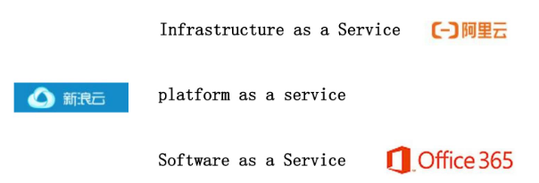

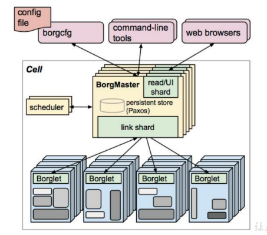

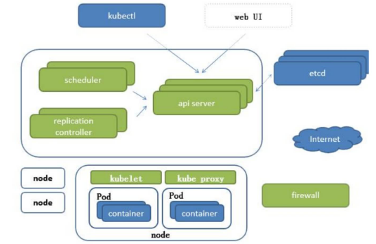

pod与pod之间的访问，包括svc的负载均衡都需要借助kube proxy，kube proxy默认操作防火墙，去进行pod映射

etcd 的官方将它定位成一个可信赖的分布式键值存储服务，它能够为整个分布式集群存储一些关键数据，协助分布式集群的正常运转

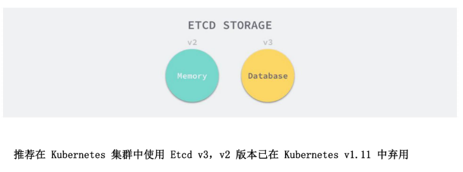

etcd，v2版本将数据存到内存，v3版本将数据存到数据卷

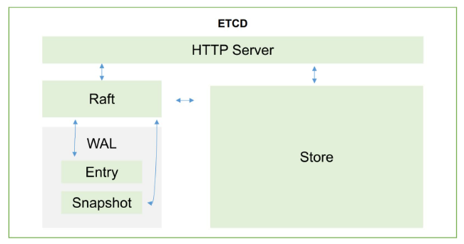

etcd通过http协议进行通讯（k8s也是采取http协议进行`C/S`结构的开发）

读写信息会存到Raft，WAL是一个预写日志，也就是说如果想对里面的数据进行更改的话，先生成一个日志存一下，并且会定时对日志进行一个完整的备份（完整 + 临时），具体怎么备份的呢？先备份一个大版本x，然后会有一些新的修改，比方说过了一段时间有一个新的子版本x1，又过了一段时间又有一个新的子版本x2，x3...，到达时间以后会将x、x1、x2、...合成一个新的大版本X，以此类推。为啥要这样呢？就是为了防止x1、x2这些小版本太多，可能导致最后还原的时候太费事费时。并且Raft还会实时将日志包括数据写入到本地磁盘中进行持久化。

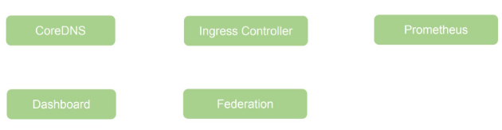

### kube-proxy中的ipvs以及LVS

参考：https://www.cnblogs.com/hongdada/p/9758939.html（IPVS负载均衡）、https://www.jianshu.com/p/4a3496b8006a（ipvsadm命令详解）、http://zh.linuxvirtualserver.org/node/5（LVS中文站点、ipvsadm命令参考）

## kubernetes基本概念


在docker中，容器之间是隔离的，ip地址都不一样， 一个应用想通过localhost访问另一个应用是不可能的，除非两个应用合到一个容器中去，变成两个进程

而k8s的pod解决了这个问题：

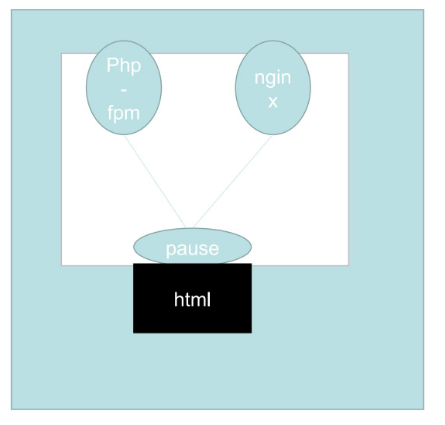

k8s的pod中可以有一个或多个容器，pod中所有容器的ip地址是共享的，因为pod启起来的时候会先启一个叫“pause”的容器，那么其他容器，比如nginx、php使用的网络栈其实都是pause的网络栈，既然是共享了pause的网络栈，那么nginx直接用localhost就可以访问到php，当然同一个pod中容器的端口不能冲突。

并且，同一个pod不仅共享网络栈，还共享数据卷，也就是说上图nginx和php访问的是同一个数据卷。

### Pod

pod分为：

- 自主式 Pod
- 控制器管理的 Pod

pod控制器类型：

- `ReplicationController & ReplicaSet & Deployment > HPA（HorizontalPodAutoScale）`
- StatefullSet
- DaemonSet
- Job，Cronjob

#### ReplicationController、ReplicaSet、Deployment

ReplicationController 用来确保容器应用的副本数始终保持在用户定义的副本数，即如果有容器异常退出，会自动创建新的 Pod 来替代；而如果异常多出来的容器也会自动回收。在新版本的 Kubernetes 中建议使用 ReplicaSet 来取代 ReplicationControlle。

ReplicaSet 跟 ReplicationController 没有本质的不同，只是名字不一样，并且ReplicaSet 支持集合式的 selector。

虽然 ReplicaSet 可以独立使用，但一般还是建议使用 Deployment 来自动管理ReplicaSet ，这样就无需担心跟其他机制的不兼容问题（比如 ReplicaSet 不支持rolling-update 但 Deployment 支持）。

#### Deployment（ReplicaSet）

Deployment 为 Pod 和 ReplicaSet 提供了一个声明式定义 (declarative) 方法，用来替代以前的 ReplicationController 来方便的管理应用。典型的应用场景包括：

- 定义 Deployment 来创建 Pod 和 ReplicaSet
- 滚动升级和回滚应用
- 扩容和缩容
- 暂停和继续 Deployment

Deployment 和 ReplicaSet 的关系：

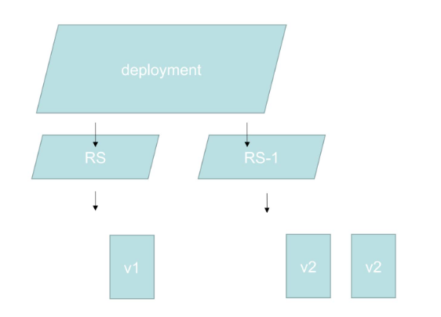

首先RS是由Deployment创建出来的，那么怎么做滚动扩容呢？

首先比方说deployment有一个RS，RS下有一个或多个pod，那么比方说这些个pod中应用的版本是v1，现在我要滚动更新，deployment会新创建一个`RS-1`，`RS-1`下会有一个或多个新创建的pod，这些个pod中应用版本为v2，那么随着v2版本的pod一个一个被创建，那边v1版本的pod也会一个一个的删除，直到删干净，当然此时v2版本的pod数也会为用户指定的副本数。

注意，RS本身是不删的，原因是如果做滚动回滚，RS就又会被用到，所以不删。

滚动回滚同理滚动更新。

#### HPA（HorizontalPodAutoScale）

Horizontal Pod Autoscaling 仅适用于 Deployment 和 ReplicaSet ，在 V1 版本中仅支持根据 Pod的 CPU 利用率扩缩容，举例来讲就是：

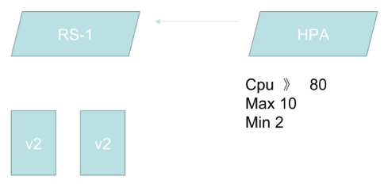

HPA会去监控资源的利用率，如果cpu利用率大于80%，那么v2的pod就会扩容，直到达到数量为MAX 10为止，反之如果cpu利用率小于80%，那么v2的pod就会被回收，直到MIN 2为止。这样就能达到水平自动扩展的功能。

在 v1alpha 版本中，还可以支持根据内存和用户自定义的 metric 进行扩缩容

#### StatefullSet

StatefulSet 是为了解决有状态服务的问题（对应 Deployments 和 ReplicaSets 是为无状态服务而设计），其应用场景包括：

- 稳定的持久化存储，即 Pod 重新调度后还是能访问到相同的持久化数据，基于 PVC 来实现
- 稳定的网络标志，即 Pod 重新调度后其 PodName 和 HostName 不变，基于 Headless Service（即没有 Cluster IP 的 Service ）来实现
- 序部署，有序扩展，即 Pod 是有顺序的，在部署或者扩展的时候要依据定义的顺序依次依次进行（即从 0 到 N-1，在下一个 Pod 运行之前所有之前的 Pod 必须都是 Running 和 Ready 状态），基于 init containers 来实现
- 有序收缩，有序删除（即从 N-1 到 0）

#### DaemonSet

DaemonSet 确保全部（或者一些）Node 上运行一个 Pod 的副本。当有 Node 加入集群时，也会为他们新增一个 Pod 。当有 Node 从集群移除时，这些 Pod 也会被回收。删除 DaemonSet 将会删除它创建的所有 Pod

使用 DaemonSet 的一些典型用法：

- 运行集群存储 daemon，例如在每个 Node 上运行 glusterd、ceph
- 在每个 Node 上运行日志收集 daemon，例如fluentd、logstash
- 在每个 Node 上运行监控 daemon，例如 Prometheus Node Exporter

#### Job，Cronjob

Job 负责批处理任务，即仅执行一次的任务，它保证批处理任务的一个或多个 Pod 成功结束

Cron Job 管理基于时间的 Job，即：

- 给定时间点只运行一次
- 周期性地在给定时间点运行

#### 服务发现

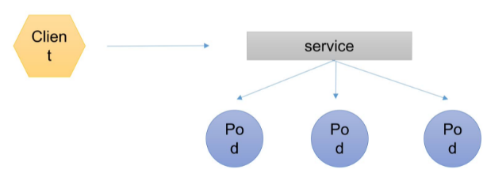

比方说我们的客户端需要去访问一组pod，如果这些pod不先关的话是无法使用service进行统一代理的，pod必须要有相关性，比方说是同一个RS、RC或Deployment创建的，或者拥有同一组标签，被service所收集到（换句话说，service去收集pod是通过标签来收集的），收集到之后service会有自己的ip和port，那么客户端通过service的ip和port即可间接访问到相应的pod，并且service会有自己的负载均衡算法（roundrobin），来将请求均匀地分摊到各个pod。

#### 部署示例

试想一下我们要部署这样的一套东西：

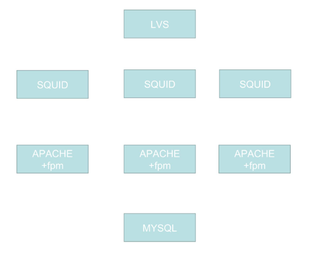

一个LVS做负载均衡（换用haproxy或nginx也可），三个SQUID作为前端，三个APACHE+fpm作为后端，一个MYSQL作为数据存储


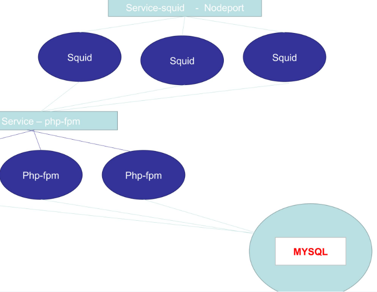

mysql作为有状态应用，可以在statefullset中进行部署，但是部署集群化的mysql对于k8s来说还是有一点困难的，因此这里我们部署一个单节点mysql。而由于mysql部署在statefullset中，ip地址是不变的，且k8s内部是一个扁平化网络，pod之间是可以直接访问到的，因此`php-fpm`的一组pod直接访问mysql是没有问题的。

现在重点来了，squid想要配置反向代理到`php-fpm`怎么办呢？`php-fpm`有三个，需要写三台机器，更麻烦的是，`php-fpm`这些pod会发生退出然后重新创建的情况，在新建pod的过程中，ip地址会发生变化，虽然我们可以将`php-fpm`部署到statefullset中，但是对于一个无状态应用来讲，没什么意义。

那么怎么办呢？可以使用service，如上图，使用一个`php-fpm`的service，然后squid直接访问`php-fpm`的service即可。

同理squid的一组pod也可以有一个自己的service，并且由于squid是需要对外暴露访问的，因此可以将type设置为nodeport，或者使用ingress来做也可以。

### 网络通讯方式

Kubernetes 的网络模型假定了所有 Pod 都在一个可以直接连通的扁平的网络空间中，这在GCE（Google Compute Engine）里面是现成的网络模型，Kubernetes 假定这个网络已经存在。而在私有云里搭建 Kubernetes 集群，就不能假定这个网络已经存在了。我们需要自己实现这个网络假设，将不同节点上的 Docker 容器之间的互相访问先打通，然后运行 Kubernetes

同一个 Pod 内的多个容器之间：lo（也就是我们熟知的localhost）

各 Pod 之间的通讯：Overlay Network

Pod 与 Service 之间的通讯：各节点的 Iptables 规则（现在不用iptables了，用LVS，效率更高上限也更高）

Flannel 是 CoreOS 团队针对 Kubernetes 设计的一个网络规划服务，简单来说，它的功能是让集群中的不同节点主机创建的 Docker 容器都具有全集群唯一的虚拟IP地址。而且它还能在这些 IP 地址之间建立一个覆盖网络（Overlay Network），通过这个覆盖网络，将数据包原封不动地传递到目标容器内

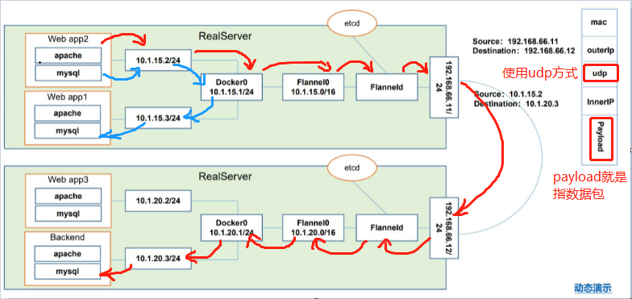

上图红色线为跨主机访问，蓝色线为同主机应用之间的访问

使用udp方式，比较快

数据包到Flanneld的时候还会进行封装，封装成这个样子：

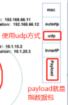

由于数据进行了二次封装，因此Docker0是看不到这个的：


Docker0看的是这个：


ETCD 之 Flannel 提供说明：

- 存储管理 Flannel 可分配的 IP 地址段资源

  Flannel在启动之后会往etcd插入可分配网段，并且哪些网段被分配到哪台机器上他会进行记录，防止已分配的网段再次被Flannel利用被分配给其他node节点，这样的话迟早会出现ip冲突

- 监控 ETCD 中每个 Pod 的实际地址，并在内存中建立维护 Pod 节点路由表

  怎么知道“web app2”的pod网段`10.1.15.2/24`是对应`192.168.66.11/24`呢？

  就是通过维护 Pod 节点的路由表知道的

上述两点足以凸显etcd的重要性！

同一个 Pod 内部通讯：同一个 Pod 共享同一个网络命名空间，共享同一个 Linux 协议栈

Pod1 至 Pod2

- Pod1 与 Pod2 不在同一台主机，Pod的地址是与docker0在同一个网段的，但docker0网段与宿主机网卡是两个完全不同的IP网段，并且不同Node之间的通信只能通过宿主机的物理网卡进行。将Pod的IP和所在Node的IP关联起来，通过这个关联让Pod可以互相访问
- Pod1 与 Pod2 在同一台机器，由 Docker0 网桥直接转发请求至 Pod2，不需要经过 Flannel

Pod 至 Service 的网络：目前基于性能考虑，全部为 iptables（现在是LVS） 维护和转发

Pod 到外网：Pod 向外网发送请求，查找路由表, 转发数据包到宿主机的网卡，宿主网卡完成路由选择后，iptables执行Masquerade，把源 IP 更改为宿主网卡的 IP，然后向外网服务器发送请求

外网访问 Pod：Service

组件通讯示意图：

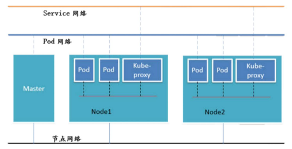

PS：

- 命令式编程：它侧重于如何实现程序，就像我们刚接触编程的时候那样，我们需要把程序的实现过程按照逻辑结果一步步写下来
- 声明式编程：它侧重于定义想要什么，然后告诉计算机／引擎，让他帮你去实现

## kubernetes集群安装（这一块很复杂，建议直接看`尚硅谷Kubenetes教程（k8s从入门到精通）第3-1到第3-5集`）

前期准备

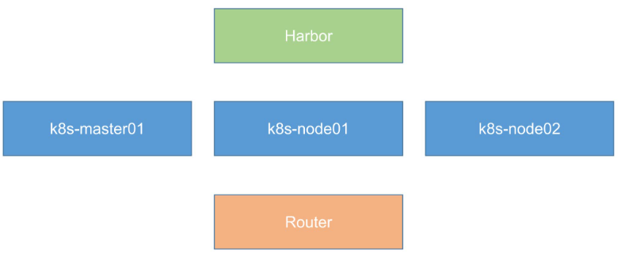

使用centos7及以上，使用内核4.4版本及以上

集群安装

这里为什么需要Router（Router使用虚拟机搭配koolshare来搭建），是因为安装kubeadm需要科学上网，所以还有一种替代方法就是直接在本机上开ssr，用于搭建Router的虚拟机网卡使用桥接。

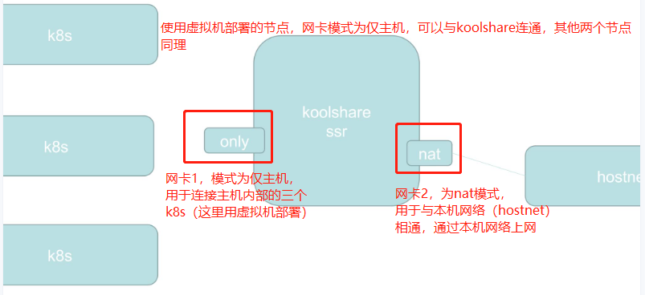

由于过程过于复杂，请直接参考`尚硅谷Kubenetes教程（k8s从入门到精通）第3-2_尚硅谷_集群安装准备 -安装软路由集`

值得注意的是：

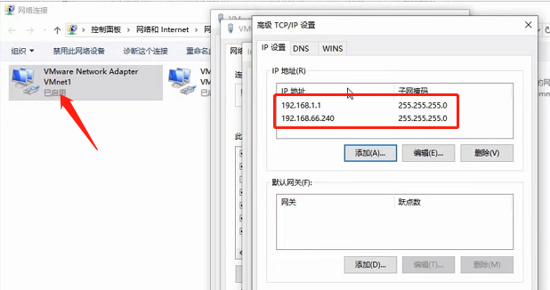

本机配置虚拟机网卡的ip地址等价于虚拟机里面配置网卡的子接口，也就是`ifconfig eth0:0`配置子接口，使得一块网卡具有多个ip地址

注意：

```
1、安装 k8s 的节点必须是大于 1 核心的 CPU
2、安装节点的网络信息：
	网段：192.168.66.0/24
	master节点：192.168.66.10/24
	node1节点：192.168.66.20/24
	node2节点：192.168.66.21/24
	harbor节点：192.168.66.100/24 (该节点dns为：hub.auguigu.com，harbor节点域名解析不仅要在虚拟机/etc/hosts中加，还要在本机/etc/hosts中加)
3、koolshare 软路由的默认密码是 koolshare
```

可以在节点中使用命令`vi /etc/sysconf/network-scripts/ifcfg-ens33`来查看ip地址的配置，这是网卡的最新命名规范，他会从BIOS pcie通道获取网卡的文件名，如果都没有的话会再降级到eth0或eth1的命名方式。要想关闭的话，ifnames=0就可以把他关闭（这个地方有点没懂）。打开后是这样的：

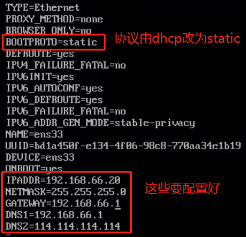

注意，这里的GATEWAY（网关）需要指向koolshare的软路由，让koolshare起作用

### Harbor安装

#### 一、安装底层需求

- Python应该是2.7或更高版本
- Docker引擎应为1.10或更高版本
- DockerCompose需要为1.6.0或更高版本

`docker-compose`：

```
curl -L https://github.com/docker/compose/releases/download/1.9.0/docker-compose-`uname-s`-`uname-m` > /usr/local/bin/docker-compose
```

#### 二、Harbor官方地址：https://github.com/vmware/harbor/releases

1、解压软件包

```
tar xvf harbor-offline-installer-<version>.tgz https://github.com/vmware/harbor/releases/download/v1.2.0/harbor-offline-installer-v1.2.0.tgz
```

2、配置harbor.cfg

必选参数：

```
hostname：目标的主机名或者完全限定域名
ui_url_protocol：http或https。默认为http
db_password：用于db_auth的MySQL数据库的根密码。更改此密码进行任何生产用途
max_job_workers：（默认值为3）作业服务中的复制工作人员的最大数量。对于每个映像复制作业，工作人员将存储库的所有标签同步到远程目标。增加此数字允许系统中更多的并发复制作业。但是，由于每个工作人员都会消耗一定数量的网络/CPU/IO资源，请根据主机的硬件资源，仔细选择该属性的值
customize_crt：（on或off。默认为on）当此属性打开时，prepare脚本将为注册表的令牌的生成/验证创建私钥和根证书
ssl_cert：SSL证书的路径，仅当协议设置为https时才应用
ssl_cert_key：SSL密钥的路径，仅当协议设置为https时才应用
secretkey_path：用于在复制策略中加密或解密远程注册表的密码的密钥路径
```

3、创建https证书以及配置相关目录权限

```
openssl genrsa-des3-outserver.key2048
openssl req-new-keyserver.key-outserver.csr
cp server.keyserver.key.org
openssl rsa-inserver.key.org-outserver.key
openssl x509-req-days365-inserver.csr-signkeyserver.key-outserver.crt
mkdir /data/cert
chmod -R 777 /data/cert
```

4、运行脚本进行安装

```
./install.sh
```

5、访问测试

https://reg.yourdomain.com的管理员门户（将reg.yourdomain.com更改为您的主机名harbor.cfg）。请注意，默认管理员用户名/密码为admin/Harbor12345

6、上传镜像进行上传测试

a、指定镜像仓库地址

```
vim /etc/docker/daemon.json
{
	"insecure-registries":["serverip"]
}
```

b、下载测试镜像

```
docker pull hello-world
```

c、给镜像重新打标签

```
docker tag hello-world serverip/hello-world:latest
```

d、登录进行上传

```
docker login serverip
```

7、其它Docker客户端下载测试

a、指定镜像仓库地址

```
vim /etc/docker/daemon.json
{
	"insecure-registries":["serverip"]
}
```

b、下载测试镜像

```
docker pull serverip/hello-world:latest
```

harbor登录密码在`harbor.cfg`中配置：

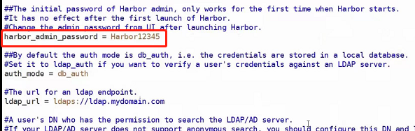

#### 三、Harbor原理说明

1、软件资源介绍

​	Harbor是VMware公司开源的企业级DockerRegistry项目，项目地址为https://github.com/vmware/harbor。其目标是帮助用户迅速搭建一个企业级的Dockerregistry服务。它以Docker公司开源的registry为基础，提供了管理UI，基于角色的访问控制(RoleBasedAccessControl)，AD/LDAP集成、以及审计日志(Auditlogging)等企业用户需求的功能，同时还原生支持中文。Harbor的每个组件都是以Docker容器的形式构建的，使用DockerCompose来对它进行部署。用于部署Harbor的DockerCompose模板位于/Deployer/docker-compose.yml，由5个容器组成，这几个容器通过Dockerlink的形式连接在一起，在容器之间通过容器名字互相访问。对终端用户而言，只需要暴露proxy（即Nginx）的服务端口

- Proxy：由Nginx服务器构成的反向代理。
- Registry：由Docker官方的开源registry镜像构成的容器实例。
- UI：即架构中的coreservices，构成此容器的代码是Harbor项目的主体。
- MySQL：由官方MySQL镜像构成的数据库容器。
- Log：运行着rsyslogd的容器，通过log-driver的形式收集其他容器的日志

2、Harbor特性

a、基于角色控制：用户和仓库都是基于项目进行组织的，而用户基于项目可以拥有不同的权限

b、基于镜像的复制策略：镜像可以在多个Harbor实例之间进行复制

c、支持LDAP：Harbor的用户授权可以使用已经存在LDAP用户

d、镜像删除&垃圾回收：Image可以被删除并且回收Image占用的空间，绝大部分的用户操作API，方便用户对系统进行扩展

e、用户UI：用户可以轻松的浏览、搜索镜像仓库以及对项目进行管理

f、轻松的部署功能：Harbor提供了online、offline安装，除此之外还提供了virtualappliance安装

g、Harbor和docker registry关系：Harbor实质上是对docker registry做了封装，扩展了自己的业务模块

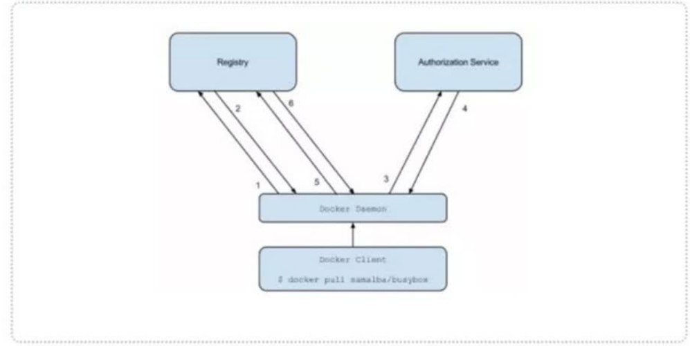

3、Harbor认证过程

a、dockerdaemon从docker registry拉取镜像。

b、如果docker registry需要进行授权时，registry将会返回401Unauthorized响应，同时在响应中包含了dockerclient如何进行认证的信息。

c、dockerclient根据registry返回的信息，向auth server发送请求获取认证token。

d、auth server则根据自己的业务实现去验证提交的用户信息是否存符合业务要求。

e、用户数据仓库返回用户的相关信息。

f、auth server将会根据查询的用户信息，生成token令牌，以及当前用户所具有的相关权限信息.上述就是完整的授权过程.当用户完成上述过程以后便可以执行相关的pull/push操作。认证信息会每次都带在请求头中

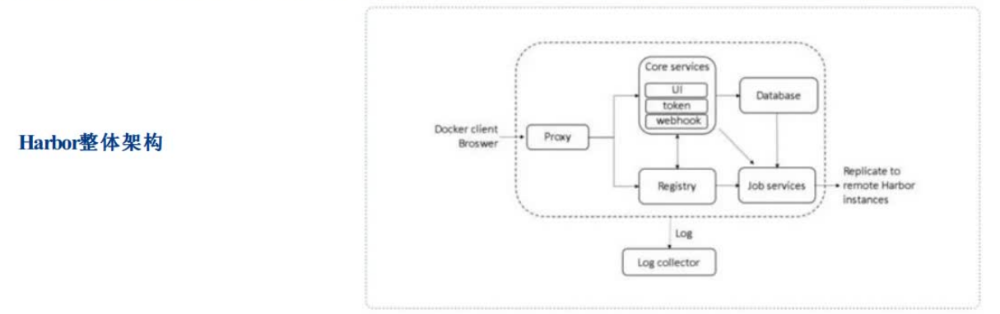

4、Harbor认证流程

a、首先，请求被代理容器监听拦截，并跳转到指定的认证服务器。

b、如果认证服务器配置了权限认证，则会返回401。通知docker client在特定的请求中需要带上一个合法的token。而认证的逻辑地址则指向架构图中的core services。

c、当docker client接受到错误code。client就会发送认证请求(带有用户名和密码)到core services进行basic auth认证。

d、当C的请求发送给ngnix以后，ngnix会根据配置的认证地址将带有用户名和密码的请求发送到core serivces。

e、core services获取用户名和密码以后对用户信息进行认证(自己的数据库或者介入LDAP都可以)。成功以后，返回认证成功的信息

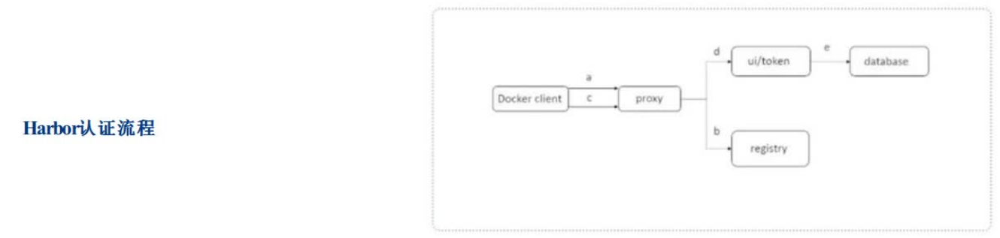

### 系统初始化

设置系统主机名以及Host文件的相互解析

```
hostnamectl set-hostname k8s-master01
```

安装依赖包

```
yum install -y conntrack ntpdate ntp ipvsadm ipset jq iptables curl sysstat libseccomp wget vim net-tools git
```

设置防火墙为Iptables并设置空规则

```
systemctl stop firewalld && systemctl disable firewalld
yum -y install iptables-services && systemctl start iptables && systemctl enable iptables && iptables-F && service iptables save
```

关闭SELINUX

```
swapoff -a && sed -i '/ swap / s/^\(.*\)$/#\1/g' /etc/fstab 
setenforce 0 && sed-i 's/^SELINUX=.*/SELINUX=disabled/' /etc/selinux/config
```

调整内核参数，对于K8S

```
cat > kubernetes.conf<<EOF
net.bridge.bridge-nf-call-iptables=1
net.bridge.bridge-nf-call-ip6tables=1
net.ipv4.ip_forward=1
net.ipv4.tcp_tw_recycle=0
vm.swappiness=0 # 禁止使用swap空间，只有当系统OOM时才允许使用它
vm.overcommit_memory=1 # 不检查物理内存是否够用
vm.panic_on_oom=0 # 开启OOM
fs.inotify.max_user_instances=8192
fs.inotify.max_user_watches=1048576
fs.file-max=52706963
fs.nr_open=52706963
net.ipv6.conf.all.disable_ipv6=1
net.netfilter.nf_conntrack_max=2310720
EOF
cp kubernetes.conf /etc/sysctl.d/kubernetes.conf
sysctl -p /etc/sysctl.d/kubernetes.conf
```

调整系统时区

```
# 设置系统时区为中国/上海
timedatectl set-timezone Asia/Shanghai
# 将当前的UTC时间写入硬件时钟
timedatectl set-local-rtc 0
#重启依赖于系统时间的服务
systemctl restart rsyslog
systemctl restart crond
```

关闭系统不需要服务

```
systemctl stop postfix && systemctl disable postfix
```

设置rsyslogd和systemd journald

```
mkdir /var/log/journal # 持久化保存日志的目录
mkdir /etc/systemd/journald.conf.d
cat > /etc/systemd/journald.conf.d/99-prophet.conf << EOF
[Journal]
# 持久化保存到磁盘
Storage=persistent
#压缩历史日志
Compress=yes
SyncIntervalSec=5m
RateLimitInterval=30s
RateLimitBurst=1000

# 最大占用空间 10G
SystemMaxUse=10G

# 单日志文件最大 200M
SystemMaxFileSize=200M

# 日志保存时间 2周
MaxRetentionSec=2week

#不将日志转发到syslog
ForwardToSyslog=no
EOF
systemctl restart systemd-journald
```

升级系统内核为4.44

CentOS 7.x系统自带的3.10.x内核存在一些Bugs，导致运行的Docker、Kubernetes不稳定，例如：rpm -Uvh http://www.elrepo.org/elrepo-release-7.0-3.el7.elrepo.noarch.rpm

```
rpm -Uvh http://www.elrepo.org/elrepo-release-7.0-3.el7.elrepo.noarch.rpm
# 安装完成后检查 /boot/grub2/grub.cfg 中对应内核 menuentry 中是否包含 initrd16 配置，如果没有，再安装一次！
yum --enablerepo=elrepo-kernel install -y kernel-lt
# 设置开机从新内核启动
grub2-set-default 'CentOSLinux(4.4.189-1.el7.elrepo.x86_64)7(Core)'
```

### kubeadm部署安装

`kube-proxy`开启ipvs的前置条件

```
modprobe br_netfilter
cat > /etc/sysconfig/modules/ipvs.modules << EOF
#!/bin/bash
modprobe -- ip_vs
modprobe -- ip_vs_rr
modprobe -- ip_vs_wrr
modprobe -- ip_vs_sh
modprobe -- nf_conntrack_ipv4
EOF
chmod 755 /etc/sysconfig/modules/ipvs.modules && bash /etc/sysconfig/modules/ipvs.modules && lsmod | grep -e ip_vs -e nf_conntrack_ipv4
```

安装Docker软件

```
yum install -y yum-utils device-mapper-persistent-data lvm2

yum-config-manager \
	--add-repo \
	http://mirrors.aliyun.com/docker-ce/linux/centos/docker-ce.repo
	
yum update -y && yum install -y docker-ce

## 创建 /etc/docker 目录
mkdir /etc/docker

# 配置 daemon.
cat > /etc/docker/daemon.json << EOF
{
	"exec-opts":["native.cgroupdriver=systemd"],
	"log-driver":"json-file",
	"log-opts":{
		"max-size":"100m"
	}
}
EOF
mkdir -p /etc/systemd/system/docker.service.d

# 重启docker服务
systemctl daemon-reload && systemctl restart docker && systemctl enable docker
```

安装Kubeadm（主从配置）

```
cat << EOF > /etc/yum.repos.d/kubernetes.repo
[kubernetes]
name=Kubernetes
baseurl=http://mirrors.aliyun.com/kubernetes/yum/repos/kubernetes-el7-x86_64
enabled=1
gpgcheck=0
repo_gpgcheck=0
gpgkey=http://mirrors.aliyun.com/kubernetes/yum/doc/yum-key.gpg
http://mirrors.aliyun.com/kubernetes/yum/doc/rpm-package-key.gpg
EOF

yum -y install kubeadm-1.15.1 kubectl-1.15.1 kubelet-1.15.1
systemctl enable kubelet.service
```

初始化主节点

```
kubeadm config print init-defaults > kubeadm-config.yaml
	localAPIEndpoint:
		advertiseAddress: 192.168.66.10
		kubernetesVersion: v1.15.1
		networking:
			podSubnet: "10.244.0.0/16"
			serviceSubnet: 10.96.0.0/12
		---	
		apiVersion: kubeproxy.config.k8s.io/v1alpha1
		kind: KubeProxyConfiguration
		featureGates:
			SupportIPVSProxyMode: true
		# 将默认的调度方式改为ipvs
		mode: ipvs

kubeadm init --config=kubeadm-config.yaml --experimental-upload-certs | tee kubeadm-init.log
```

上述`podSubnet: "10.244.0.0/16"`的设置是因为默认情况下会安装flannel网络插件去实现覆盖性网络，他的默认的podnet就是这个网段（`10.244.0.0/16`，如果这个网段不一致的话后期还需要去进入配置文件修改，所以我们提前把podSubnet声明为`10.244.0.0/16`）

加入主节点以及其余工作节点

```
执行安装日志中的加入命令即可
```

部署网络

```
kubectl apply -f https://raw.githubusercontent.com/coreos/flannel/master/Documentation/kube-flannel.yml
```

部署完成之后可以通过`kubectl get pod -n kube-system`来查看pod是否准备完毕，更方便的方法是使用`-w（watch，监视）`：`kubectl get pod -n kube-system -w`，这样的话就不需要手动执行命令去看了，当前对话会一直夯着，一有更新就会推上来：

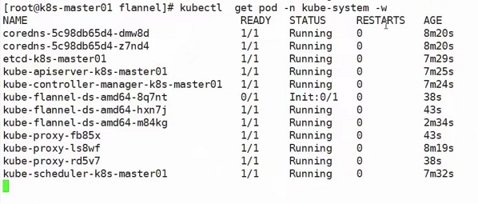

### 测试

上面的步骤全部完成之后，进行测试：

先使用docker按照harbor的规则往harbor推一个镜像，然后直接`kubectl run ...`创建deployment，当然，镜像的地址要写对，会发现，k8s会从harbor拉取镜像

之后使用`docker ps -a | grep nginx`还可以看到一个“/pause”，应证了之前所说的启动一个pod会先自动启动一个pause容器

然后访问：

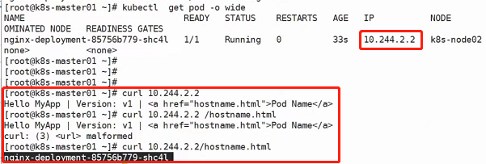

为什么能获取hostname呢？是因为采用了pod里面的容器的hostname，hostname设置的就是pod的名称

然后我们尝试删除pod，会发现又会新重启一个pod，那是因为我们设置了副本数为1，那么k8s会努力将容器副本数维持在1

接下来使用scale扩容为3份（为了验证deployment会生成rs，可以使用`kubectl get deployment`以及`kubectl get rs`，会发现有三个dp与三个rs互相对应），使用expose生成svc暴露端口，之前可以使用nginx做负载均衡，现在svc就可以做到，此时如果一直访问这个svc，我们会发现请求以一种轮询的机制分发到了3个dp中

然后我们使用`ipvsadm -Ln`命令可以查看服务映射规则：

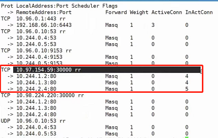

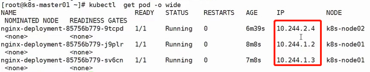

因此svc的机制就是调度LVS模块实现的负载均衡或者叫暴露服务

## 资源清单

### k8s中的资源

**什么是资源？**

K8s 中所有的内容都抽象为资源，资源实例化之后，叫做对象

**K8S中存在哪些资源？**

名称空间级别：

工作负载型资源( workload )：Pod、ReplicaSet、Deployment、StatefulSet、DaemonSet、Job、CronJob ( ReplicationController 在 v1.11 版本被废弃 )

服务发现及负载均衡型资源( ServiceDiscovery LoadBalance )：Service、Ingress、...

配置与存储型资源：Volume( 存储卷 )、CSI( 容器存储接口,可以扩展各种各样的第三方存储卷 )

特殊类型的存储卷：ConfigMap( 当配置中心来使用的资源类型 )、Secret(保存敏感数据)、DownwardAPI(把外部环境中的信息输出给容器)

集群级资源：Namespace、Node、Role、ClusterRole、RoleBinding、ClusterRoleBinding

元数据型资源：HPA、PodTemplate、LimitRange

### kubernetes 资源清单

在 k8s 中，一般使用 yaml 格式的文件来创建符合我们预期期望的 pod ，这样的 yaml 文件我们一般称为资源清单

#### 资源清单格式

```yaml
apiVersion: group/apiversion # 如果没有给定 group 名称，那么默认为 core，可以使用 kubectl api-
versions: # 获取当前k8s版本上所有的apiVersion版本信息(每个版本可能不同)
kind: # 资源类别
metadata: # 资源元数据
  name:
  namespace:
  lables:
  annotations: # 主要目的是方便用户阅读查找
spec: # 期望的状态（disired state）
status: # 当前状态，本字段有Kubernetes自身维护，用户不能去定义
```

#### 资源清单的常用命令

获取 apiversion 版本信息

```
[root@k8s-master01~]# kubectl api-versions
admissionregistration.k8s.io/v1beta1
apiextensions.k8s.io/v1beta1
apiregistration.k8s.io/v1
apiregistration.k8s.io/v1beta1
apps/v1
......(以下省略)
```

获取资源的 apiVersion 版本信息

```
[root@k8s-master01~]# kubectl explain pod
KIND:		Pod
VERSION:	v1
.....(以下省略)
[root@k8s-master01~]# kubectl explain Ingress 
KIND:		Ingress
VERSION:	extensions/v1beta1
```

获取字段设置帮助文档

```
[root@k8s-master01~]# kubectl explain pod 
KIND:		Pod
VERSION:	v1

DESCRIPTION:
	Pod is a collection of containers that can run on a host. This resource is created by clients and scheduled onto hosts.
	
FIELDS:
	apiVersion	<string>
	  ........
	  ........
```

字段配置格式

```
apiVersion <string>			#表示字符串类型
metadata <Object>			#表示需要嵌套多层字段
labels <map[string]string>	#表示由k:v组成的映射
finalizers <[]string>		#表示字串列表
ownerReferences <[]Object>	#表示对象列表
hostPID <boolean>			#布尔类型
priority <integer>			#整型
name<string>-required-		#如果类型后面接-required-，表示为必填字段
```

#### 通过定义清单文件创建Pod

```yaml
apiVersion: v1
kind: Pod
metadata: 
  name: pod-demo
  namespace: default
  labels: 
    app: myapp
  spec: 
    containers:
    - name: myapp-1
      image: hub.atguigu.com/library/myapp:v1
    - name: busybox-1
      image: busybox:latest
      command: 
      - "/bin/sh"
      - "-c"
      - "sleep3600"
```

```
kubectl get pod xx.xx.xx -o yaml
<!-- 使用 -o 参数加 yaml ，可以将资源的配置以 yaml 的格式输出出来，也可以使用 json ，输出为 json 格式 -->
```

### 资源清单中常用字段的解释

| 参数名                                      | 字段类型 | 说明                                                         |
| ------------------------------------------- | -------- | ------------------------------------------------------------ |
| version                                     | String   | 这里是指K8S API的版本，目前基本上是v1，可以用kubectl api\-version命令查询 |
| king                                        | String   | 这里指的是yaml文件定义的资源类型和角色，比如：Pod            |
| metadata                                    | Object   | 元数据对象，固定值就写metadata                               |
| metadata.name                               | String   | 元数据对象的名字，这里由我们编写，比如命名Pod的名字          |
| metadata.namespace                          | String   | 元数据对象的命名空间，由我们自身定义                         |
| Spec                                        | Object   | 详细定义对象，固定值就写Spec                                 |
| spec.containers[]                           | list     | 这里是Spec对象的容器列表定义，是个列表                       |
| spec.containers[].name                      | String   | 这里定义容器的名字                                           |
| spec.containers[].image                     | String   | 这里定义要用到的镜像名称                                     |
| spec.containers[].imagePullPolicy           | String   | 定义镜像拉取策略，有Always、Never、IfNotPresent三个值可选（1）Always：意思是每次都尝试重新拉取镜像（2）Never：表示仅使用本地镜像（3）IfNotPresent：如果本地有镜像就是用本地镜像，没有就拉取在线镜像。上面三个值都没设置的话，默认是Always |
| spec.contaienrs[].command[]                 | List     | 指定容器启动命令，因为是数组可以指定多个，不指定则使用镜像打包时使用的启动命令 |
| spec.containers[].args[]                    | List     | 指定容器启动命令参数，因为是数组可以指定多个                 |
| spec.containers[].workingDir                | String   | 指定容器的工作目录                                           |
| spec.containers[].volumeMounts[]            | List     | 指定容器内部的存储卷配置                                     |
| spec.containers[].volumeMounts[].name       | String   | 指定可以被容器挂载的存储卷名称                               |
| spec.containers[].volumeMounts[].mountPath  | String   | 指定可以被容器挂载的存储卷的路径                             |
| spec.containers[].volumeMounts[].readOnly   | String   | 设置存储卷路径的读写模式，true或false，默认为读写模式        |
| spec.containers[].ports[]                   | List     | 指定容器需要用到的端口列表                                   |
| spec.containers[].ports[].name              | String   | 指定端口名称                                                 |
| spec.containers[].ports[].containerPort     | String   | 指定容器需要监听的端口号                                     |
| spec.containers[].ports[].hostPort          | String   | 指定容器所在主机需要监听的端口号，默认跟上面ContainerPort相同，注意设置了hostPort同一台主机无法启动该容器的相同副本（因为主机的端口号不能相同，这样会冲突） |
| spec.containers[].ports[].protocol          | String   | 指定端口协议，支持TCP和UDP，默认是TCP                        |
| spec.containers[].env[]                     | List     | 指定容器运行前需设置的环境变量列表                           |
| spec.containers[].env[].name                | String   | 指定环境变量名称                                             |
| spec.containers[].env[].value               | String   | 指定环境变量值                                               |
| spec.containers[].resources                 | Object   | 指定资源限制和资源请求的值（这里开始就是设置容器的资源上限） |
| spec.containers[].resources.limits          | Object   | 指定设置容器运行时资源的运行上限                             |
| spec.containers[].resources.limits.cpu      | String   | 指定CPU的限制，单位为core数，将用于docker run \-\-cpu\-shares参数（这里前面文章Pod资源限制有讲过） |
| spec.containers[].resources.limits.memory   | String   | 指定MEM内存的限制，单位为MIB、GIB                            |
| spec.containers[].resources.requests        | Object   | 指定容器启动和调度时的限制设置                               |
| spec.containers[].resources.requests.cpu    | String   | CPU请求，单位为core数，容器启动时初始化可用数量              |
| spec.containers[].resources.requests.memory | String   | 内存请求，单位为MIB、GIB，容器启动的初始化可用数量           |
| spec.restartPolicy                          | String   | 定义Pod的重启策略，可选值为Always、OnFailure，默认值为Always。1、Always：Pod一旦终止运行，则无论容器是如何终止的，kubelet服务都将重启他；2、OnFailure：只有Pod以非零退出码终止时，kubelet才会重启该容器。如果容器正常结束（退出码为0），则kubelet将不会重启他；3、Never：Pod终止后，kubelet将退出码报告给master，不会重启该Pod |
| spec.nodeSelector                           | Object   | 定义Node的Label过滤标签，以key:value格式指定                 |
| spec.imagePullSecrets                       | Object   | 定义pull镜像时使用secret名称，以name:secretkey格式指定       |
| spec.hostNetwork                            | Boolean  | 定义是否使用主机网络模式，默认值false。设置true表示使用宿主机网络，不使用docker网桥，同时设置了true将无法在同一台宿主机上启动第二个副本 |

使用`kubectl explain`可以查看具体字段的解释以及模板

例如我想看pod的：

```
kubectl explain pod
```

pod下有spec字段，同样我们也可以进行查看：

```
kubectl explain pod.spec
```

pod下的spec下的containers字段：

```
kubectl explain pod.spec.containers
```

依次类推

### 容器生命周期

当发生问题时，该如何应对呢？

可以使用`kubectl describe pod xxx`来查看pod的状态；

可以使用`kubectl log xxx -c my_container_name`来查看pod中某一个容器中的日志（`-c`用于指定容器名，当然如果pod中只有一个容器，也可以不指定`-c`参数）

可以使用`kubectl exec xxx -c my_container_name -it -- /bin/sh`进入pod中的某一个容器（`-c`用于指定容器名，当然如果pod中只有一个容器，也可以不指定`-c`参数，`-it`表示交互模式和打开一个tty，`-- /bin/sh`是固定格式，指的是运行一个命令，运行bin下的sh）

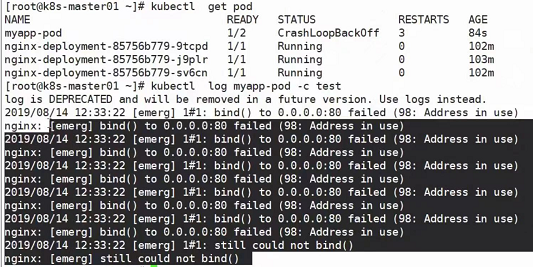


为什么要了解容器生命周期？

有时候pod中的容器中的进程意外死亡了，但是容器还是正常存在，pod还是running状态，这个时候其实服务已经不可用了，但是对于整个pod来讲，服务还是可用的，这个时候就会出现问题了，那么怎么去做纠察，这个时候如果使用者了解容器的生命周期那就比较好办了。

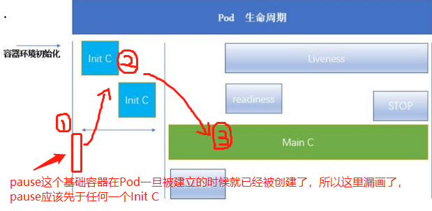

上图为pod生命周期图，注意，pause最先起来（pod被建立的时候他就已经起来了），然后是`Init C`初始化构建，最后才是真正的容器的内部（也就是上图的“Main C”），当然，一个pod里会有多个容器，也就是说上图的“Main C”可能有多个，只是为了防止懵逼，才画了一个，而如果有两个Main C，那么每个Main C都会有属于自己的Init C、readiness、liveness、start、stop

“Main C”容器在开始运行的时候有一个START指令，在退出的时候又有一个STOP指令，执行完STOP指令之后，才允许他退出

以下的讲解将围绕上图进行

#### Init 容器

Pod 能够具有多个容器，应用运行在容器里面，但是它也可能有一个或多个先于应用容器启动的 Init容器

Init 容器与普通的容器非常像，除了如下两点：

- Init 容器总是运行到成功完成为止

  对于Init C，他不像Main C，Main C退出的话pod就退出了，Init C退出不会跟pod的生命周期有关，pod并不会因为Init C结束而结束；

  Init C如果不正常退出的话，是不会到Main C这一步的；

  并且，Init C如果不正常退出的话，pod是要启动对应的流程处理的，比如重启；

- 每个 Init 容器都必须在下一个 Init 容器启动之前成功完成

如果 Pod 的 Init 容器失败，Kubernetes 会不断地重启该 Pod，直到 Init 容器成功为止。然而，如果 Pod 对应的 restartPolicy 为 Never，它不会重新启动


`Init C`初始化容器，比如我有一个pod，pod里面有若干容器，这些容器要启动的前提条件是需要在本机的xxx存储下面有xxx文件存在才可以，这个时候就可以利用`Init C`去生成这些文件，注意，`Init C`只是用于初始化的，并不会一直跟随Pod生命周期存在，也就是说`Init C`做完初始化操作之后就会死亡（`Init C`初始化完成之后如果正常退出了，退出码一定是0，如果不是0那就是异常退出，异常退出可能要重新执行，根据重启策略去判断），`Init C`可以没有，也可以有1个及以上，并且每一个`Init C`只有在结束本次构建之后才可以进入下一个`Init C`的构建（`Init C`的构建是线性执行的，并非异步）


**Init 容器的作用**

因为 Init 容器具有与应用程序容器分离的单独镜像，所以它们的启动相关代码具有如下优势：

- 它们可以包含并运行实用工具，但是出于安全考虑，是不建议在应用程序容器镜像中包含这些实用工具的

  在主容器Main C启动之前，我可能会需要一些文件被创建，需要一些数据被梳理，但是这些创建文件和梳理数据的工具如果加载到Main C又会导致Main C的冗余，这些工具不会一直都被用，随着工具越来越多Main C稳定性也会得不到保障，所以这个时候就可以通过将这些工具写到Init C，让他在初始化过程中将后续Main C会用到的东西提前创建出来，这样的话Main C就不需要包含这些文件或数据，但又能正常使用这些文件或数据

- 它们可以包含使用工具和定制化代码来安装，但是不能出现在应用程序镜像中。例如，创建镜像没必要 FROM 另一个镜像，只需要在安装过程中使用类似 sed、awk、python 或 dig这样的工具。

- 应用程序镜像可以分离出创建和部署的角色，而没有必要联合它们构建一个单独的镜像。

  主容器运行的时候，大体分为两个流程，一个是构建代码（比如从仓库拉取代码等）， 一个是运行代码，那么完全可以把构建代码的部分剥离成Init C去运行

- Init 容器使用 Linux Namespace，所以相对应用程序容器来说具有不同的文件系统视图。因此，它们能够具有访问 Secret 的权限，而应用程序容器则不能。

  举个例子，Main C可能只需要使用某目录下的某些文件，但是该目录为了安全性不能直接赋予Main C权限去访问，不然后续Main C就能访问该目录下其他文件了，这是非常不安全的，那么可以将权限赋予Init C，Init C读取Main C所需的文件并写入Main C，后续Init C执行完毕就会退出，这样就比较安全了

- 它们必须在应用程序容器启动之前运行完成，而应用程序容器是并行运行的，所以 Init 容器能够提供了一种简单的阻塞或延迟应用容器的启动的方法，直到满足了一组先决条件。

  举个例子：

  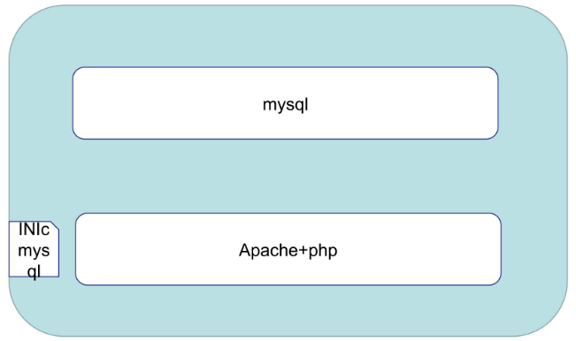

  一个pod中有两个Main C，一个是mysql，一个是apache+php，后者依赖前者，如果前者没启动完毕时后者就启动完毕了，后者连不上mysql就会报错，检测机制会发现居然报错了，是不是哪里出问题了，那么整个pod就会一直重启、重启、...，这个时候可以给后者加一个Init C去检测mysql是否正常，如果正常了就退出检测循环，结束该Init C，之后apache+php这个Main C就可以启动了

关注"kubernetes pod 探测"小节，该小节针对Init C做了一些实验

**特殊说明**

- 在 Pod 启动过程中，Init 容器会按顺序在网络和数据卷初始化之后启动。每个容器必须在下一个容器启动之前成功退出

  网络和数据卷初始化是在pause中去完成的，也就意味着pod启动第一个容器不是Init C而是pause，pause这个容器是很小的，只负责网络和数据卷初始化，别的啥也不干，所以我们对pause的操作为无，知道有他存在就行了

  Init C退出码为0表示正常，非0为异常，只要有一个Init C退出码为非0，则后续的Init C就不会再执行了

- 如果由于运行时或失败退出，将导致容器启动失败，它会根据 Pod 的 restartPolicy 指定的策略进行重试。然而，如果 Pod 的 restartPolicy 设置为 Always，Init 容器失败时会使用RestartPolicy 策略

- 在所有的 Init 容器没有成功之前，Pod 将不会变成 Ready 状态。Init 容器的端口将不会在Service 中进行聚集。正在初始化中的 Pod 处于 Pending 状态，但应该会将 Initializing 状态设置为 true

  “Init 容器的端口将不会在Service 中进行聚集”意思是：如果Main C或者Init C没有正常启动完毕，则他的ip地址和port不会在service的nodeport他的调度队列里面出现，防止服务没有正常启动就被外网访问

- 如果 Pod 重启，所有 Init 容器必须重新执行

- \# 对 Init 容器 spec 的修改被限制在容器 image 字段，修改其他字段都不会生效。更改 Init容器的 image 字段，等价于重启该 Pod

  使用`kubectl edit pod xxx`可以看到该pod的yaml文件，里面有些参数不可修改，有些可以修改，可修改的参数除了image以外都不会使该pod重启，但是一旦修改了image字段，Init容器就会重新执行，而Init容器重新执行就等价于重启pod

- Init 容器具有应用容器的所有字段。除了 readinessProbe和livenessProbe，因为 Init 容器无法定义不同于完成（completion）的就绪（readiness）之外的其他状态。这会在验证过程中强制执行

  Init能用的字段与spec里面containers下面的字段基本一致，除了readinessProbe（就绪检测）和livenessProbe（生存检测），因为Init就是去帮别人做就绪之前的一些操作的，按理来讲他就不可能去做就绪检测，而且Init运行完就退出了，所以他也不能做后续的生存检测

  并且如果真的配置了readinessProbe和livenessProbe，是不生效的

- 在 Pod 中的每个 app 和 Init 容器的名称必须唯一；与任何其它容器共享同一个名称，会在验证时抛出错误

  Init C也有name字段，这个字段一定不能重复

  值得注意的是，同一组Init C的port可以重复，因为当一个Init执行完毕退出之后，就会释放该Init所占用的port，那么别的Init就可以正常使用了


#### 容器探针

上面说了可以用Init C去做简单的就绪检测，但是细想一下这部分功能在Init C中完成其实不太好，首先Init C并不是主程序里面的，如果在Init C做对容器x的就绪检测的话，万一Init C检测的时候x正常，那么Init C就会退出了，而后续另一个容器y去连接x的时候，x又不正常了，这个时候就不太好了。我们想在Main C中去做容器探测，这样的话如果探测正常那肯定就是正常了

探针是由 kubelet 对容器执行的定期诊断（kubelet 执行的，也就是说对于探针来说，他并不是由主服务器master去发起的，而是由每一个node所在的kubelet去对他进行一个检测，这样的话能减轻master的压力）。要执行诊断，kubelet 调用由容器实现的 Handler。有三种类型的处理程序：

- ExecAction：在容器内执行指定命令。如果命令退出时返回码为 0 则认为诊断成功。
- TCPSocketAction：对指定端口上的容器的 IP 地址进行 TCP 检查。如果端口打开，则诊断被认为是成功的。
- HTTPGetAction：对指定的端口和路径上的容器的 IP 地址执行 HTTP Get 请求。如果响应的状态码大于等于200 且小于 400，则诊断被认为是成功的

每次探测都将获得以下三种结果之一：

- 成功：容器通过了诊断。
- 失败：容器未通过诊断。
- 未知：诊断失败，因此不会采取任何行动（容器被挂死，因为一直在等待探测成功之后才能被就绪）


#### 探测方式

livenessProbe：指示容器是否正在运行。如果存活探测失败，则 kubelet 会杀死容器，并且容器将受到其 重启策略 的影响。如果容器不提供存活探针，则默认状态为 Success

readinessProbe：指示容器是否准备好服务请求。如果就绪探测失败，端点控制器将从与 Pod 匹配的所有 Service 的端点中删除该 Pod 的 IP 地址。初始延迟之前的就绪状态默认为 Failure。如果容器不提供就绪探针，则默认状态为 Success

下面来看看探针到底如何实现，请查看下方的“检测探针\-就绪检测”小节和"检测探针\-存活检测"小节


再看到最上面的那张图。readiness是就绪检测；liveness是生存检测

readiness和liveness在上图中没有跟Main C画在同一起跑线，是有原因的，因为可以设置在Main C启动之后多少多少秒开始进行readiness，比方说Main C启动5秒之后再启动readiness，同理liveness。在readiness检测之前，pod状态不会显示为running， 只有当readiness检测完毕之后，才会显示running。如果liveness检测出Main C已经不行了，出现损坏了，那就会执行对应的重启命令，或者删除命令等等，根据重启策略来确定

readiness和liveness举例：

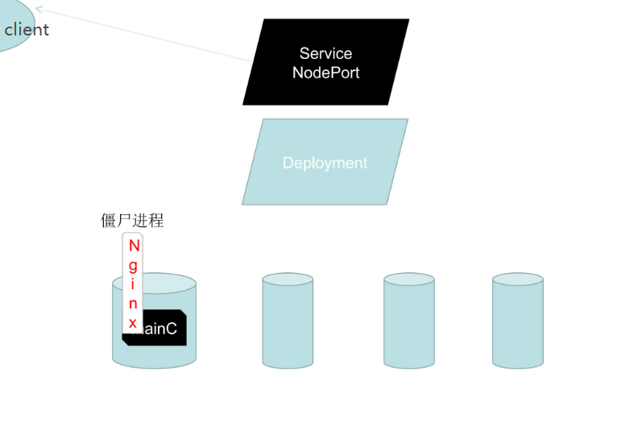

首先有四个pod，上层是rs（这里没画），再上层是deployment，再上层是svc，svc对外提供访问。

假设第一个pod启动的是tomcat，在第一次启动的时候他的初始化过程还是比较长的，他需要把项目给展开，如果一旦这个pod创建成功（`kubectl get pod`发现这个pod的状态已经是running了），running的含义是这个时候svc已经把他拿到对外的访问队列里面去了，但是如果这个tomcat部署程序还没有完成，还不能对外提供访问，但是现在pod的状态又是running，running的意思又是可以对外访问（换句话说，pod显示的是running，但是运行的主要的进程还没有加载成功），这个时候如果外部访问了，必然会失败，所以这个时候就需要有一个readiness就绪检测，什么叫就绪检测呢？我们可以根据命令，根据tcp连接，根据ipv协议获取状态，判断服务是否已经可用了，如果可用了，再把状态改为running

还有一个liveness，假设pod里面运行了一个主容器（Main C），那这个主容器里面有可能运行了一个比如nginx，而这个nginx假死了（僵尸进程，名存实亡），但是nginx进程仍然在运行，进程在运行主容器就要运行，主容器运行pod的状态就是running，running就意味着能够继续对外部提供访问，这个时候就需要liveness了，当nginx无法继续对外提供正常访问或者说容器内部已经不能对外提供正常访问的时候，可以执行重启或者重建pod的操作


**总结：**

首先kubectl向kubeapi发送指令，kubeapi会调度到kubelet，这个调度过程由etcd在中间参与完成的，kubelet去操作cri，cri去完成容器的初始化（pause容器的启动、Init C、...）

### kubernetes pod 探测

#### Init容器

init模板

```yaml
apiVersion: v1
kind: Pod
metadata:
  name: myapp-pod
  labels:
    app: myapp
spec:
  # Init C没启动完毕之前Main C是不会启动的
  containers:
  - name: myapp-container
  	# 这里镜像最好指定版本或者标签，不然的话默认下载latest，而10年前的latest跟现在的latest肯定不是一个版本，可能会导致镜像重复拉取最终导致拉取失败，导致报错，导致容器启动失败
    image: busybox
    command: ['sh', '-c', 'echo The app is running! && sleep 3600']
  # initContainers表示以下容器是需要被先初始化的（就是上面说的Init C）
  initContainers:
  - name: init-myservice
    image: busybox
    # 这里的myservice就是下方Service的metadata中的name，k8s内部的dns服务会将pod、svc、deployment等的metadata: name: 的值自动解析成ip地址
    command: ['sh', '-c', 'until nslookup myservice; do echo waiting for myservice; sleep 2; done;']
  - name: init-mydb
    image: busybox
    command: ['sh', '-c', 'until nslookup mydb; do echo waiting for mydb; sleep 2; done;']
```

```yaml
kind: Service
apiVersion: v1
metadata:
  # k8s内部的dns服务会将pod、svc、deployment等的metadata: name: 的值自动解析成ip地址，因此这里的myservice会被自动解析，所以上方command中就可以直接“nslookup myservice”
  name: myservice
spec:
  ports:
  	- protocol: TCP
  	  port: 80
  	  targetPort: 9376

---

kind: Service

apiVersion: v1
metadata: 
  name: mydb
spec:
  ports:
    - protocol: TCP
      port: 80
      targetPort: 9377
```

k8s中的dns服务（使用`kubectl get pod -n kube-system`查看）：

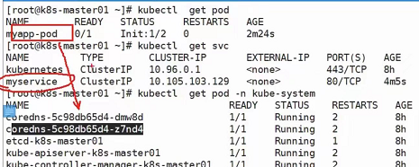

如果创建了svc，比方说上图的myservice，那么myservice就会被写入k8s内部的dns服务，这时候myapp\-pod去请求dns是否有myservice域名的解析数据，如果有则dns会返回这些数据


#### 检测探针\-就绪检测

readinessProbe\-httpget

```yaml
apiVersion: v1
kind: Pod
metadata:
  name: readiness-httpget-pod
  namespace: default
spec:
  containers:
  - name: readiness-httpget-container
    image: wangyanglinux/myapp:v1
    imagePullPolicy: IfNotPresent
    readinessProbe:
      # 使用get方式去请求80端口下的/index1.html，如果成功了说明探测成功，反之失败
      httpGet:
        port: 80
        path: /index1.html
      # 设定延时，这个容器在启动1秒以后才开启延时
      initialDelaySeconds: 1
      # 重试的周期时间，这里是3秒重试一下
      periodSeconds: 3
```

那这种方式显然比Init C去做探测要好

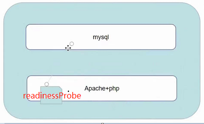


#### 检测探针\-存活检测

livenessProbe\-exec

```yaml
apiVersion: v1
kind: Pod
metadata: 
  name: liveness-exec-pod
  namespace: default
spec:
  containers:
  - name: liveness-exec-container
    image: hub.atguigu.com/library/busybox
    imagePullPolicy: IfNotPresent
    command: ["/bin/sh", "-c", "touch /tmp/live ; sleep60 ; rm -rf /tmp/live; sleep3600"]
    livenessProbe:
      exec:
        command: ["test", "-e", "/tmp/live"]
      initialDelaySeconds: 1
      periodSeconds: 3
```

livenessProbe\-httpget

```yaml
apiVersion: v1
kind: Pod
metadata:
  name: liveness-httpget-pod
  namespace: default
spec:
  containers:
  - name: liveness-httpget-container
    image: hub.atguigu.com/library/myapp:v1
    imagePullPolicy: IfNotPresent
    ports:
    - name: http
      containerPort: 80
    livenessProbe:
      httpGet:
        port: http
        path: /index.html
      initialDelaySeconds: 1
      periodSeconds: 3
      timeoutSeconds: 10
```

livenessProbe\-tcp

```yaml
apiVersion: v1
kind: Pod
metadata:
  name: probe-tcp
spec:
  containers:
  - name: nginx
  	image: hub.atguigu.com/library/myapp:v1
  	livenessProbe:
  	  initialDelaySeconds: 5
  	  timeoutSeconds: 1
  	  tcpSocket:
  	    port: 80
```

#### 启动、退出动作

```yaml
apiVersion: v1
kind: Pod
metadata:
  name: lifecycle-demo
spec:
  containers:
  - name: lifecycle-demo-container
    image: nginx
    lifecycle:
      postStart:
        exec:
          command: ["/bin/sh", "-c", "echo Hello from the postStart handler > /usr/share/message"]
      preStop:
        exec:
          command: ["/bin/sh", "-c", "echo Hello from the poststop handler > /usr/share/message"]
```

### kubernetes 状态示例

**Pod中只有一个容器并且正在运行，容器成功退出**

- 记录事件完成
- 如果restartPolicy为：
  - Always：重启容器；Pod phase 仍为 Running
  - OnFailure：Pod phase 变成 Succeeded 
  - Never：Pod phase 变成 Succeeded

**Pod中只有一个容器并且正在运行。容器退出失败**

- 记录失败事件
- 如果restartPolicy为：
  - Always：重启容器；Pod phase 仍为 Running
  - OnFailure：重启容器；Pod phase 仍为 Running
  - Never：Pod phase 变成 Failed

**Pod中有两个容器并且正在运行。容器1退出失败**

- 记录失败事件
- 如果restartPolicy为：
  - Always：重启容器；Pod phase 仍为 Running
  - OnFailure：重启容器；Pod phase 仍为 Running
  - Never：不重启容器；Pod phase 仍为 Running
- 如果有容器1没有处于运行状态，并且容器2退出：
  - 记录失败事件
  - 如果restartPolicy为：
    - Always：重启容器；Pod phase 仍为 Running
    - OnFailure：重启容器；Pod phase 仍为 Running
    - Never：Pod phase 变成 Failed

**Pod中只有一个容器并处于运行状态。容器运行时内存超出限制**

- 容器以失败状态终止
- 记录OOM事件
- 如果restartPolicy为：
  - Always：重启容器；Pod phase 仍为 Running
  - OnFailure：重启容器；Pod phase 仍为 Running
  - Never:记录失败事件；Pod phase 仍为 Failed

**Pod正在运行，磁盘故障**

- 杀掉所有容器。记录适当事件
- Pod phase 变成 Failed
- 如果使用控制器来运行，Pod 将在别处重建

**Pod正在运行，其节点被分段**

- 节点控制器等待直到超时
- 节点控制器将 Pod phase 设置为 Failed
- 如果是用控制器来运行，Pod 将在别处重建

### Pod hook

Pod hook（钩子）是由 Kubernetes 管理的 kubelet 发起的，当容器中的进程启动前或者容器中的进程终止之前运行，这是包含在容器的生命周期之中。可以同时为 Pod 中的所有容器都配置 hook

Hook 的类型包括两种：

- exec：执行一段命令
- HTTP：发送HTTP请求

### Pod phase

Pod 的 status 字段是一个 PodStatus 对象，PodStatus中有一个 phase 字段。

Pod 的相位（phase）是 Pod 在其生命周期中的简单宏观概述。该阶段并不是对容器或 Pod 的综合汇总，也不是为了做为综合状态机

Pod 相位的数量和含义是严格指定的。除了本文档中列举的状态外，不应该再假定 Pod 有其他的phase 值

**Pod phase 可能存在的值**

- 挂起（Pending）：Pod 已被 Kubernetes 系统接受，但有一个或者多个容器镜像尚未创建。等待时间包括调度 Pod 的时间和通过网络下载镜像的时间，这可能需要花点时间

- 运行中（Running）：该 Pod 已经绑定到了一个节点上，Pod 中所有的容器都已被创建。至少有一个容器正在运行，或者正处于启动或重启状态

- 成功（Succeeded）：Pod 中的所有容器都被成功终止，并且不会再重启

- 失败（Failed）：Pod 中的所有容器都已终止了，并且至少有一个容器是因为失败终止。也就是说，容器以非 0 状态退出或者被系统终止

- 未知（Unknown）：因为某些原因无法取得 Pod 的状态，通常是因为与 Pod 所在主机通信失败

### 重启策略

PodSpec 中有一个 restartPolicy 字段，可能的值为 Always、OnFailure 和 Never。默认为Always。restartPolicy 适用于 Pod 中的所有容器。restartPolicy 仅指通过同一节点上的kubelet 重新启动容器。失败的容器由 kubelet 以五分钟为上限的指数退避延迟（10秒，20秒，40秒...）重新启动，并在成功执行十分钟后重置。如 Pod 文档 中所述，一旦绑定到一个节点，Pod 将永远不会重新绑定到另一个节点。

## yaml语法

### 简单说明

是一个可读性高，用来表达数据序列的格式。YAML 的意思其实是：仍是一种标记语言，但为了强调这种语言以数据做为中心，而不是以标记语言为重点

### 基本语法

- 缩进时不允许使用Tab键，只允许使用空格
- 缩进的空格数目不重要，只要相同层级的元素左侧对齐即可
- \# 标识注释，从这个字符一直到行尾，都会被解释器忽略

### YAML支持的数据结构

- 对象：键值对的集合，又称为映射（mapping）/哈希（hashes）/字典（dictionary）
- 数组：一组按次序排列的值，又称为序列（sequence）/列表（list）
- 纯量（scalars）：单个的、不可再分的值

### 对象类型：对象的一组键值对，使用冒号结构表示

```yaml
name: Steve
age: 18
```

Yaml也允许另一种写法，将所有键值对写成一个行内对象

```yaml
hash: { name: Steve, age: 18 }
```

### 数组类型：一组连词线开头的行，构成一个数组

```yaml
animal:
- Cat
- Dog
```

```yaml
animal: [Cat, Dog]
```

### 复合结构：对象和数组可以结合使用，形成复合结构

```yaml
languages: 
- Ruby
- Perl
- Python
websites:
  YAML: yaml.org
  Ruby: ruby-lang.org
  Python: python.org
  Perl: use.perl.org
```

### 纯量：纯量是最基本的、不可再分的值。以下数据类型都属于纯量

```
1 字符串 布尔值 整数 浮点数 Null
2 时间 日期

数值直接以字面量的形式表示
number: 12.30
布尔值用true和false表示
isSet: true

null用 ~ 表示
parent: ~

时间采用 ISO8601 格式
iso8601: 2001-12-14t21:59:43.10-05:00

日期采用复合 iso8601 格式的年、月、日表示
date: 1976-07-31

YAML 允许使用两个感叹号，强制转换数据类型
e: !!str 123
f: !!str true
```

### 字符串

字符串默认不使用引号表示

```yaml
str: 这是一行字符串
```

如果字符串之中包含空格或特殊字符，需要放在引号之中

```yaml
str: '内容：字符串'
```

单引号和双引号都可以使用，双引号不会对特殊字符转义

```yaml
s1: '内容\n字符串'
s2: "内容\n字符串"
```

单引号之中如果还有单引号，必须连续使用两个单引号转义

```yaml
# 原先使用的转义符是 \ ，在yaml中转义符是 ' 
str: 'labor''sday'
```

字符串可以写成多行，从第二行开始，必须有一个单空格缩进。换行符会被转为空格

```yaml
str: 这是一段
 多行
 字符串
```

多行字符串可以使用\|保留换行符，也可以使用\>折叠换行

```yaml
this: |
Foo
Bar
that: >
Foo
Bar
```

\+表示保留文字块末尾的换行，\-表示删除字符串末尾的换行

```yaml
s1: |
 Foo
 
s2: |+
 Foo

s3: |-
 Foo
```

