## 课程介绍

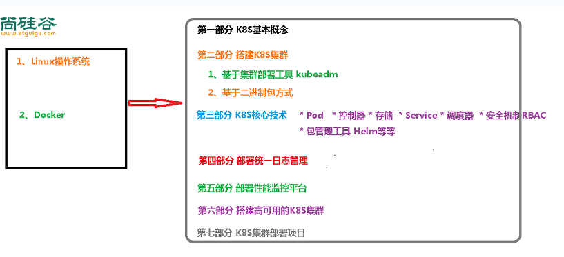

## k8s基本概念

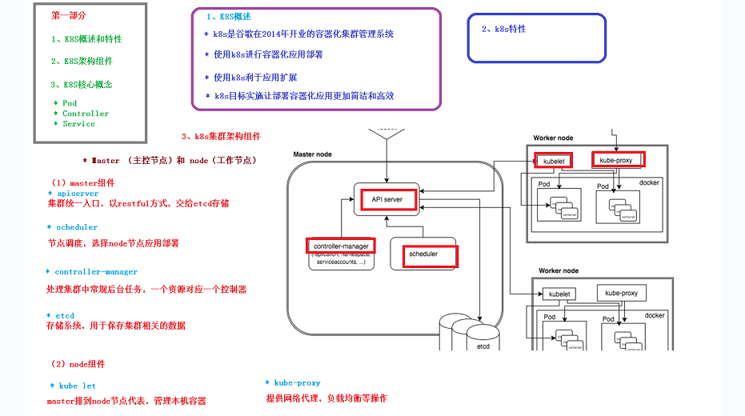


另外，k8s使用的负载均衡是IPVS，他非常强大，为国人开发

pod与pod之间的访问，包括svc的负载均衡都需要借助kube proxy，kube proxy默认操作防火墙，去进行pod映射

## k8s核心概念


**无状态应用部署**

可以随便使用

**有状态应用部署**

需要有特定条件才可以使用

## etcd

参考`尚硅谷Kubenetes教程（k8s从入门到精通）第1-6_尚硅谷_组件说明 -2集`

## 搭建k8s集群

### 使用kubeadm方式搭建

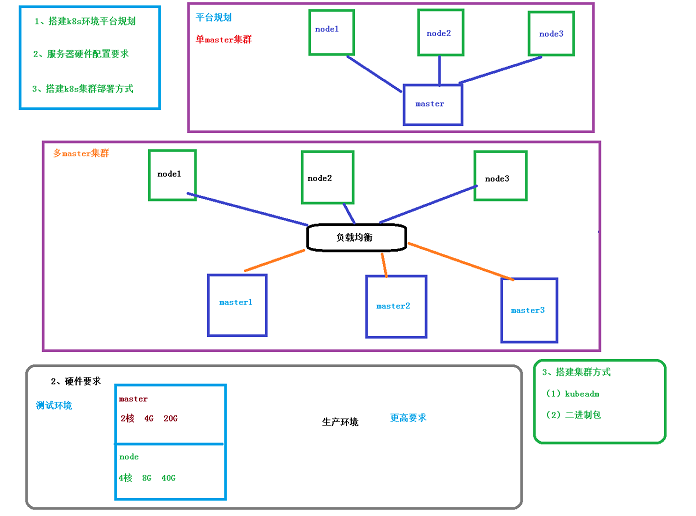

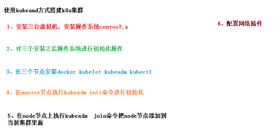

### 使用二进制方式搭建

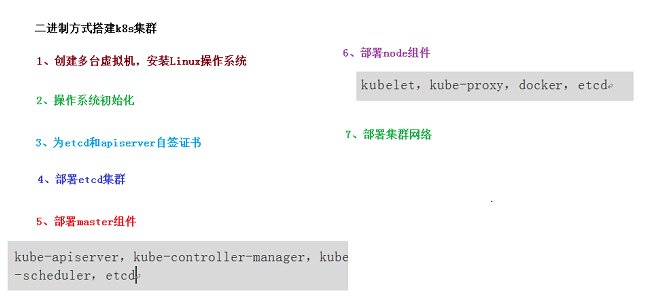

### 总结

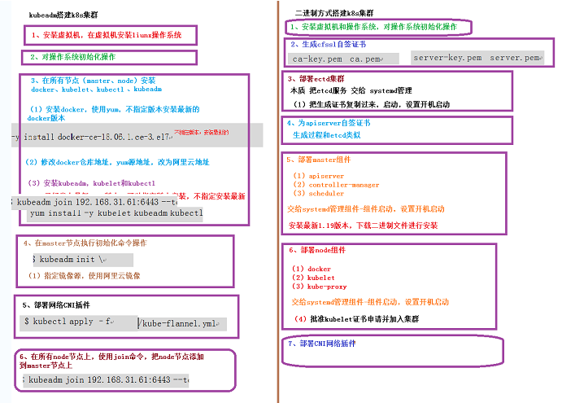

搭建完毕之后可以使用命令`kubectl get node`查看集群节点：

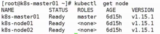

## kubectl

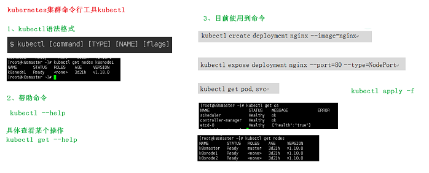

## 资源编排（yaml）

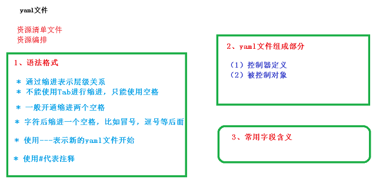

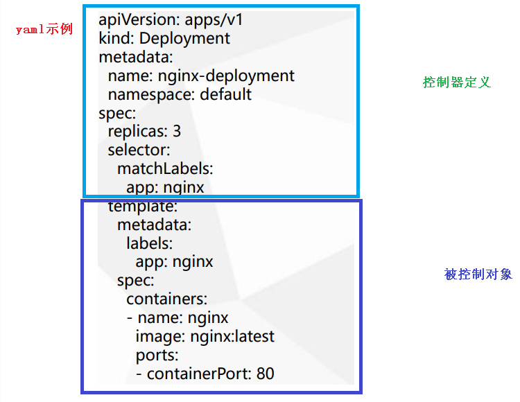

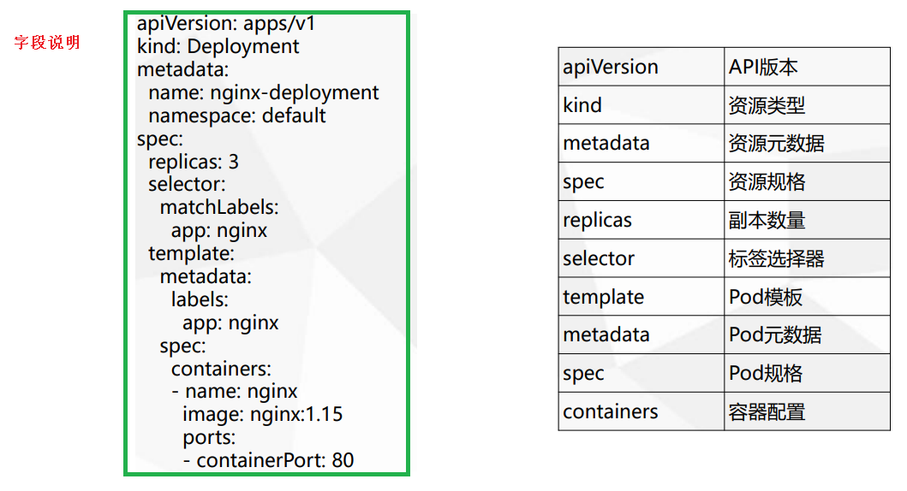

### 使用create或get命令自动生成yaml文件

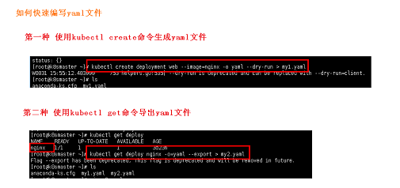

## Pod

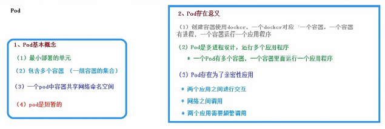

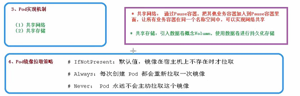

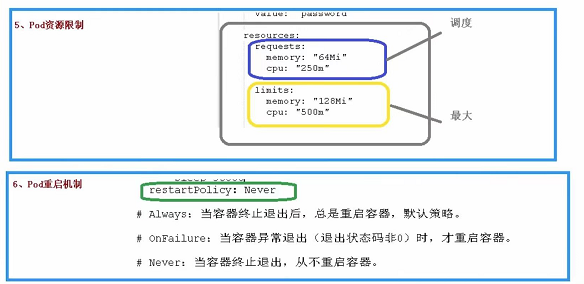

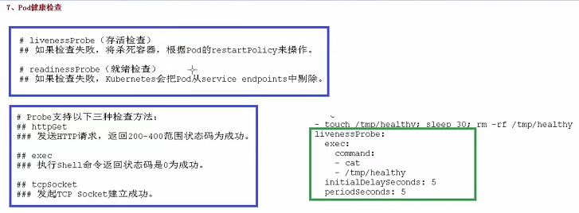

### Pod与docker的区别

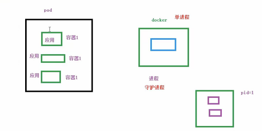

docker里头一个容器里面有一个应用，对应一个进程，是单进程的；Pod里头有多个容器，每个容器对应一个应用，每个应用对应一个进程，是多进程的

### 共享网络

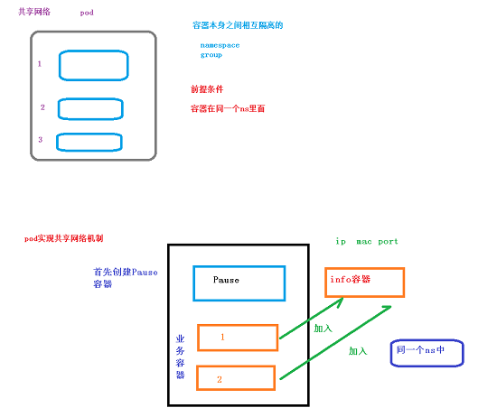

Pause容器（根容器）也可以叫做info容器，在创建业务容器之后，会先加入到info容器中，共享ip、mac地址、port，因此他们在同一个namespace中

### 共享数据（数据卷实现）

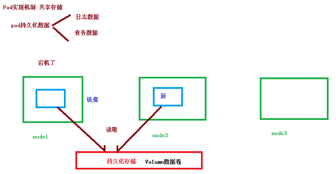

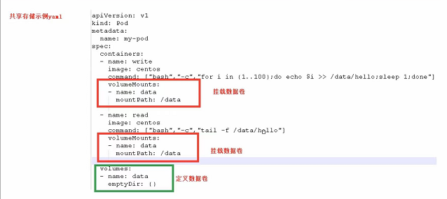

### 镜像拉取策略

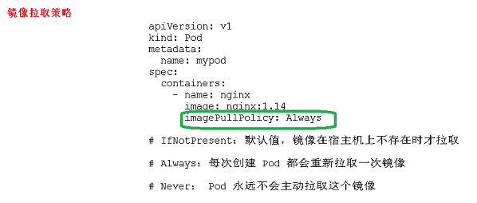

### Pod资源限制

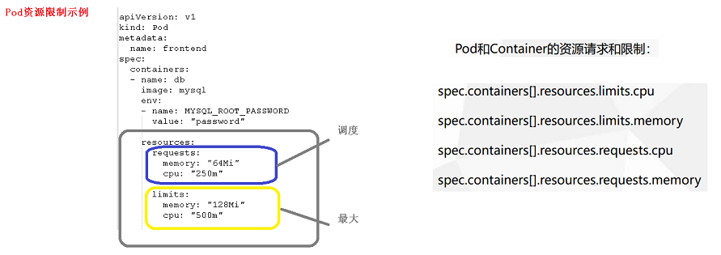

这里的`cpu: "500m"`的意思是：

```
1c（1核） = 1000m（1000兆）
0.5c（0.5核） = 500m
0.25c（0.25核） = 250m
```

注意，这里的限制本身是由docker做到的，不是由pod做到的

### Pod重启策略


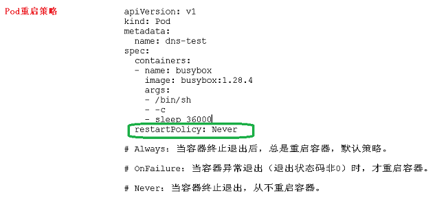

这里OnFailure的“退出状态码非0”的意思是：

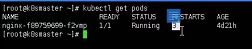

这里的RESTARTS为非0

### Pod健康检查

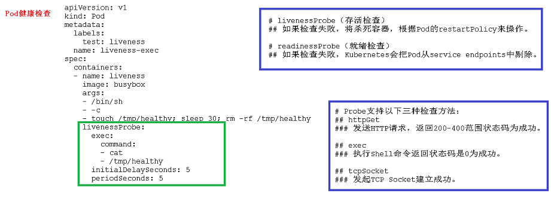

这里的检查方法“exec”的意思是：

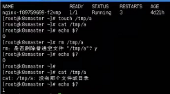

解释：首先执行了创建文件的命令`touch /tmp/a`，然后去访问文件`cat /tmp/a`，此时一定是可以访问到的，再执行`echo &?`（猜测这个命令的意思是用于判断上一个命令是否能执行成功，如果成功，返回0，失败则返回1），此时一定是返回0的，然后再执行删除文件命令`rm /tmp/a`，此时再去访问文件`cat /tmp/a`是一定访问不了的，再执行`echo &?`，此时一定是返回1

### 创建Pod流程

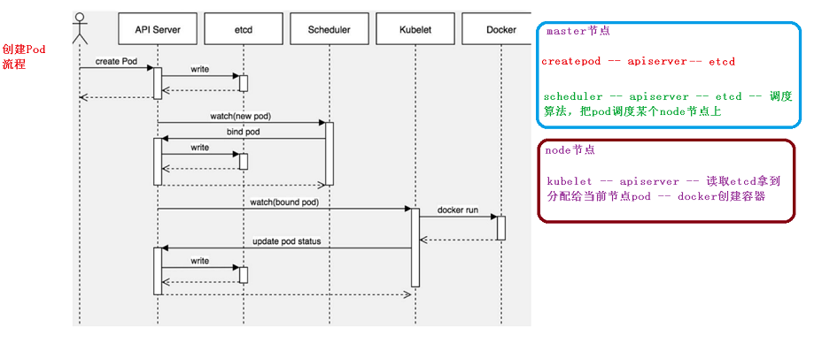

#### Pod调度（影响调用的属性、节点选择器nodeSelector、标签创建、节点亲和性nodeAffinity）

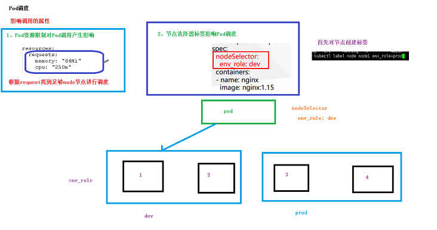

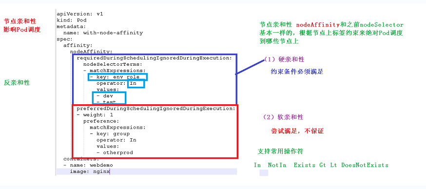

#### 污点与污点容忍

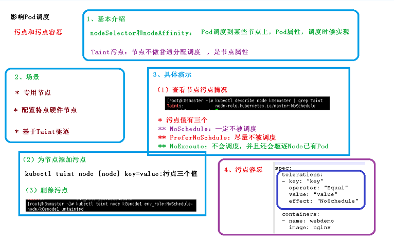

## Controller

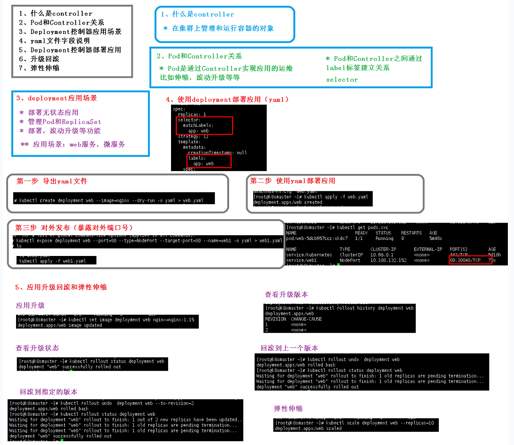

升级过程中服务不中断，例子：假设有一个nginx1.14的服务以及一个他的副本在运行，此时要升级成1.15版本，会先创建一个新的1.15的服务，期间1.14的两个服务不停，当1.15的服务准备完成之后，再替换掉所有1.14的服务

### 无状态与有状态、有状态应用中的无头service（ClusterIP为none）以及StatefulSet、守护进程DaemonSet、一次性任务Job、定时任务CronJob

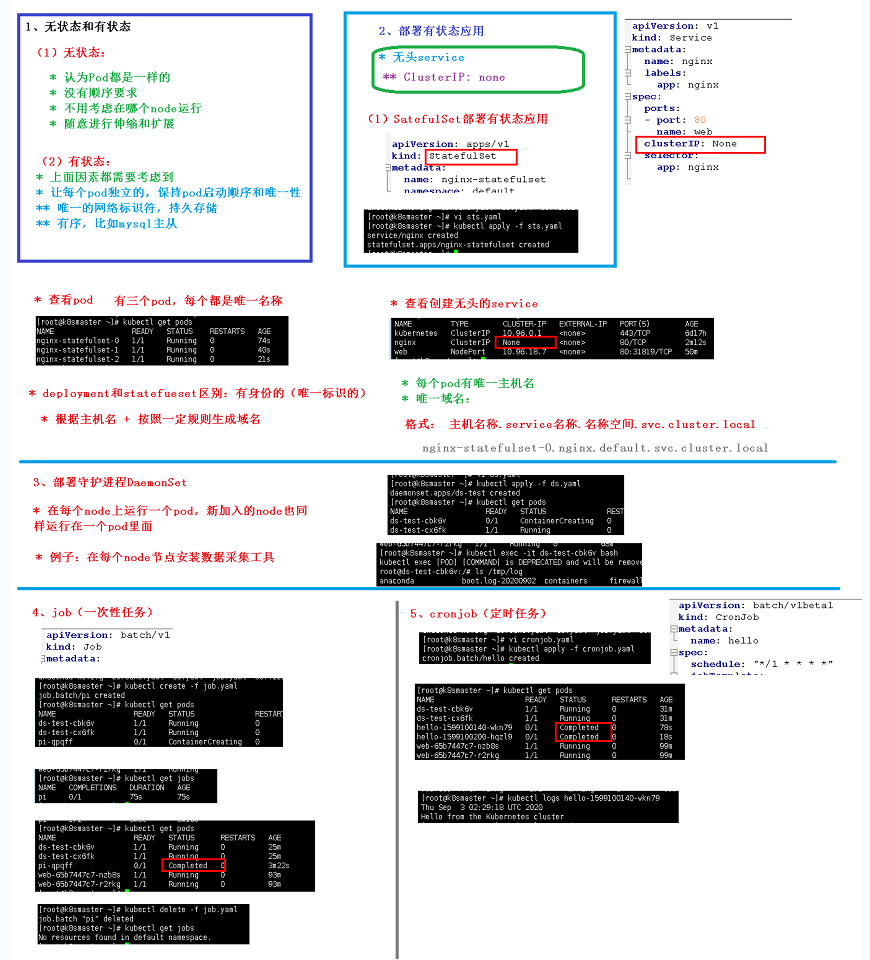

删除所有statefulset：`kubectl delete statefulset --all`

删除指定名称的svc：`kubectl delete svc web01`

使用`yaml`文件进行删除：`kubectl delete -f xxx.yaml`

上面“部署一个守护进程DaemonSet”的yaml例子（该应用的具体作用我们不关心，只是想测试一下DaemonSet，这里他用于日志采集）：

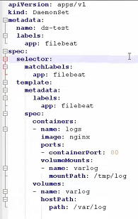

上面“job（一次性任务）”的yaml例子：

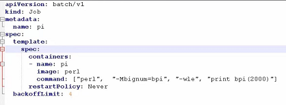

这里的最后一行“backoffLimit”意思是启动失败之后再次尝试重启的次数，这里为4次

## Service

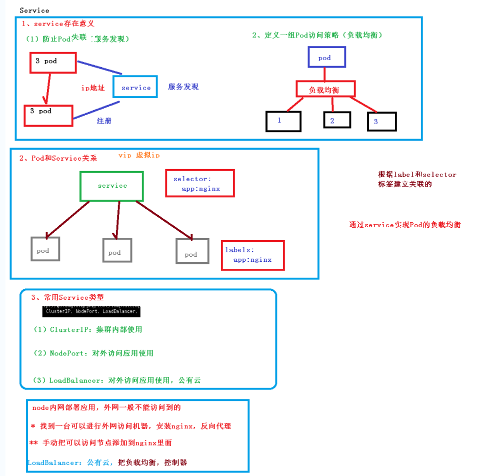

上面那个"vip（虚拟ip）"是指service对外的ip地址

service使用的负载均衡算法是roundrobin

实验常用Service类型（ClusterIP、NodePort、LoadBalancer）：

- create一个镜像为nginx的yaml，然后apply

- expose一个该应用的yaml，修改yaml文件中的type属性：

  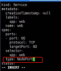

  然后apply

- 执行`kubectl get svc`就可以看到该应用对内暴露的端口以及对外暴露的端口以及服务的type属性

  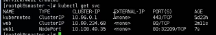

LoadBalancer非常强大，一般是在公有云里使用的，不仅能做到NodePort的功能，还能做到nginx的负载均衡等，而且nginx负载均衡需要手动添加节点做反向代理，LoadBalancer就不需要手动添加，非常方便

## 配置管理

### Secret

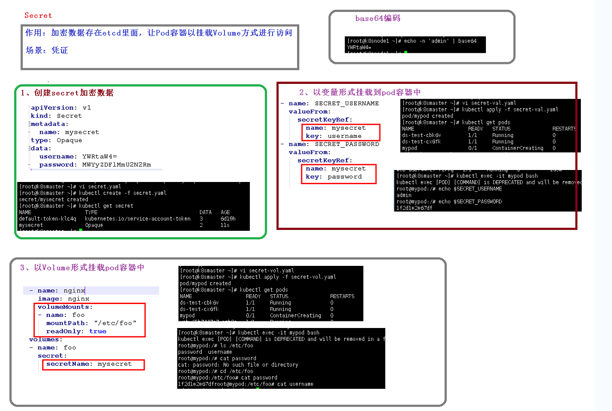

创建secret加密数据并以变量形式挂载到pod的解释：

- 首先创建Secret加密数据应用，里头的username为用base64加密后的用户名，password为用base64加密后的密码
- 创建另一个应用，以`-name`的形式定义变量（比方说上图，定义了两个变量：`SECRET_USERNAME`和`SECRET_PASSWORD`），然后指定从哪个Secret加密数据应用获取需要绑定到变量的数据（比方说上图，从mysecret中获取username绑定到`SECRET_USERNAME`，从mysecret中获取password绑定到`SECRET_PASSWORD`）
- 然后在该应用中打印变量（比方说执行`echo $SECRET_USERNAME`，那么输出即为mysecret中加密数据解密之后的数据）

创建secret加密数据并以Volume形式挂载到pod的解释：

- 首先创建Secret加密数据应用，里头的username为用base64加密后的用户名，password为用base64加密后的密码
- 创建另一个应用，以数据卷的形式（关注上图红方框圈起来的部分）将数据挂载到相应目录下
- 进入该应用，进入相应的目录即可找到解密之后的数据

### ConfigMap

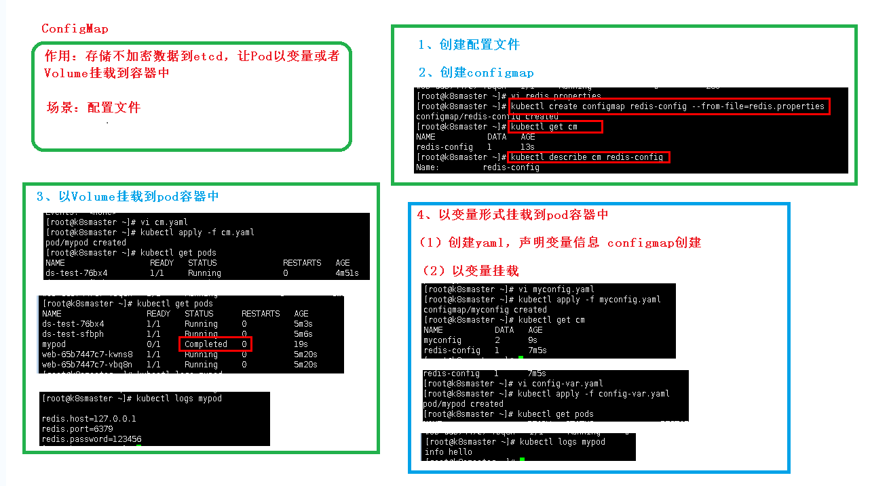

上面“以变量形式挂载到pod容器中”的`myconfig.yaml`文件：


其中`special.level`和`special.type`为自定义变量

`config-var.yaml`文件：

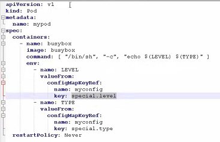

其中变量的绑定与上面"创建secret加密数据并以变量形式挂载到pod"的绑定方法一模一样

## k8s集群安全机制

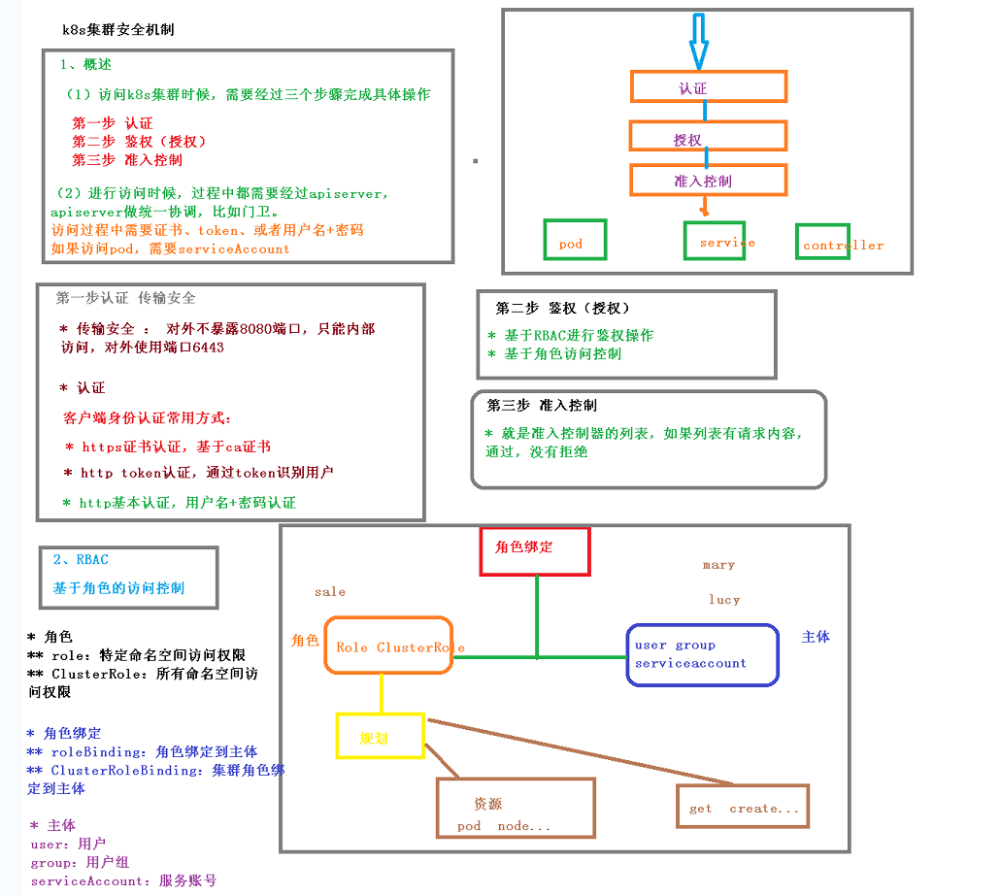

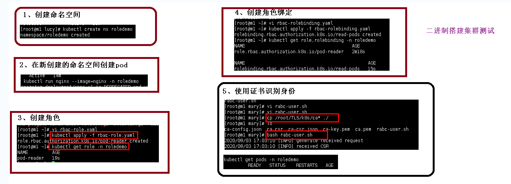

k8s获取命名空间：`kubectl get ns`

k8s创建命名空间：`kubectl create ns ns1`

用于创建角色的yaml文件：

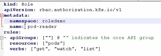

用于创建角色绑定的yaml文件：

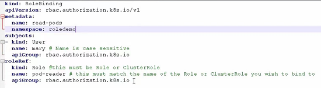

上面第5步使用证书识别身份中的ca开头的文件在资料中的rbac文件夹下（只存在部分文件），需要手动复制到相应目录下，比方说这里我们要给mary用户创建证书用于识别身份，那么就应该创建mary文件夹，然后将ca开头的文件都复制到mary文件夹下（具体讲解内容查看教学视频第42集第7分30秒）

其中namespace需要我们自己指定

## Ingress

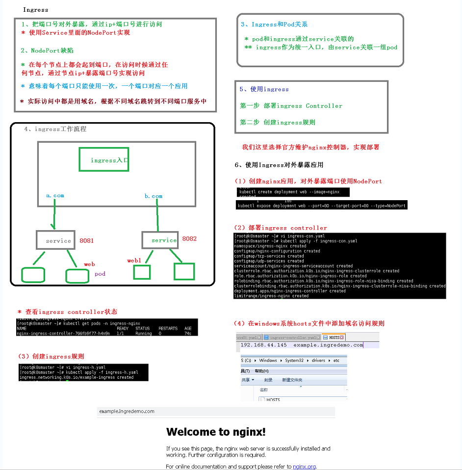

上面第六步`ingress-con.yaml`在资料的ingress文件夹中，需要注意的是`ingress-con.yaml`中有个地方的hostNetWork需要改成true，他表示对外暴露网络，如果不改成true，后面就会访问不到：

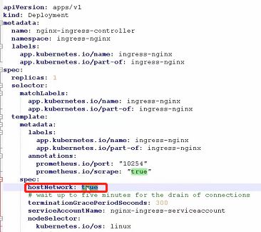

上面创建ingress规则的时候，`ingress-h.yaml`文件：

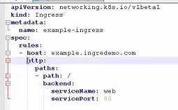

其中paths中可以配置多个path；host就是域名

## helm

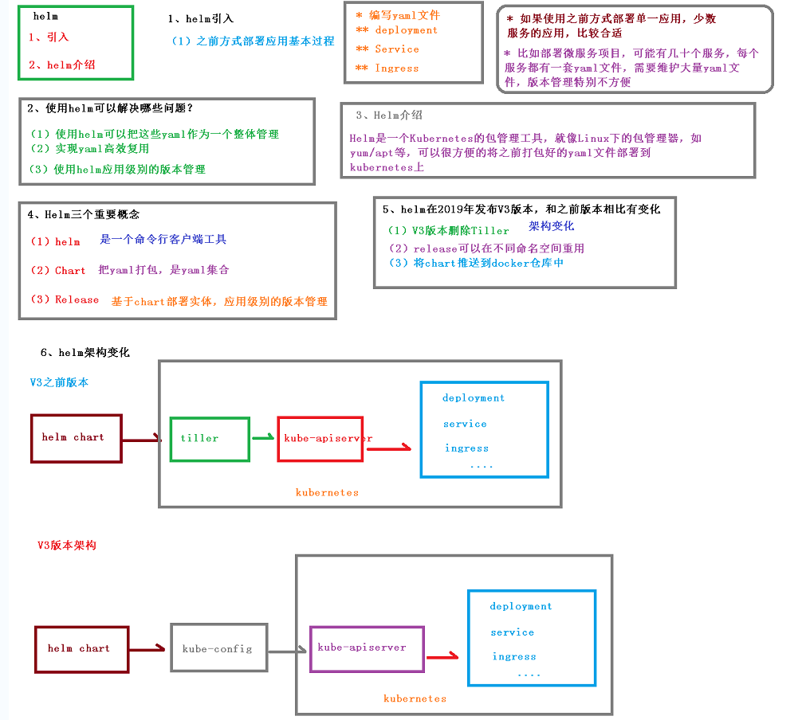

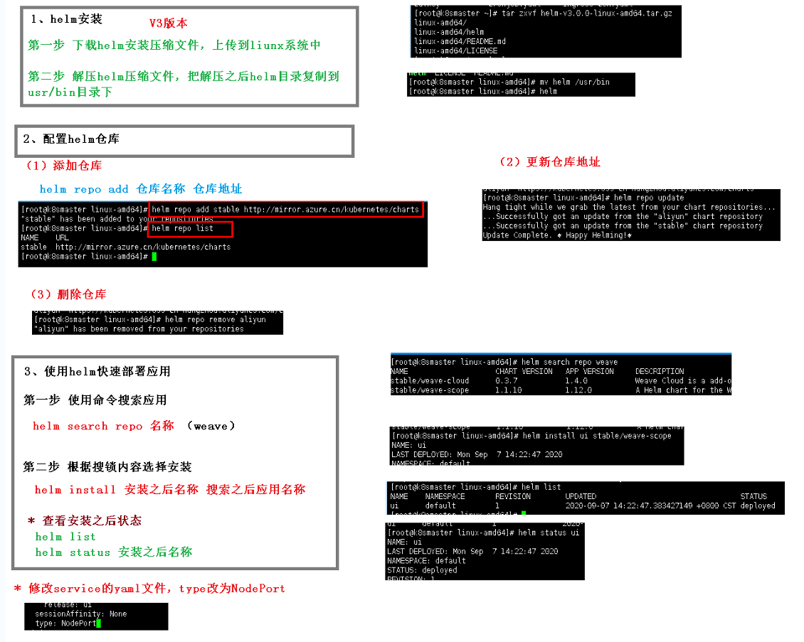

使用helm之后，我们可以通过`helm list`查看部署的应用，还可以通过`kubectl`命令查看相关的pods和svc，那当我们想要修改端口的时候怎么办呢？

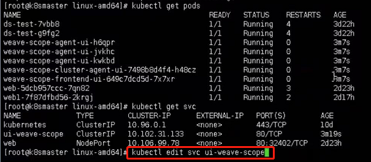

可以使用`kubectl edit svc xxx`进入到yaml文件中，并修改type：

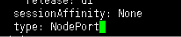

### 创建自己的Chart

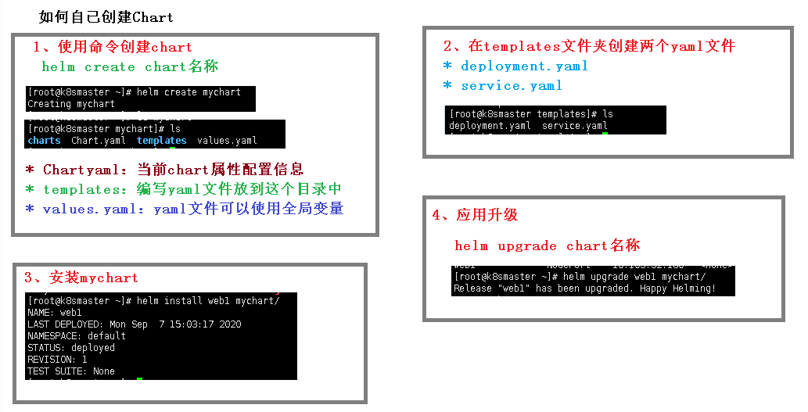

### 实现yaml文件的高效复用

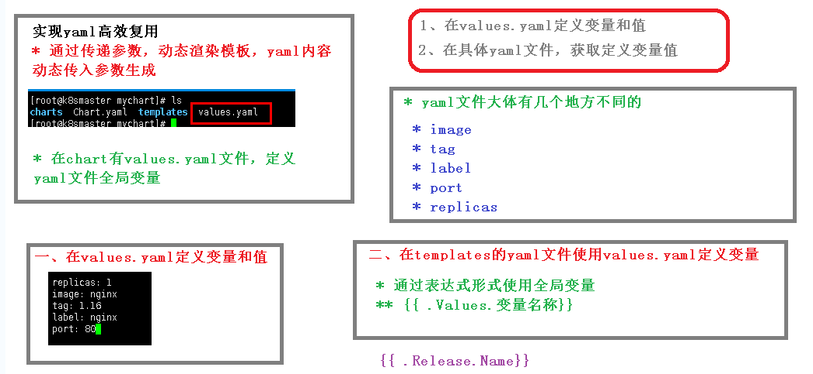

使用`values.yaml`定义变量，例子：

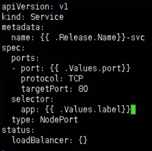

修改完成之后，我们使用`--dry-run`来尝试执行（helm的尝试执行也是加`--dry-run`参数）：

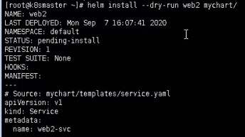

发现被变量占位的地方全部成功改成了变量值，说明成功了，然后我们来真正执行：

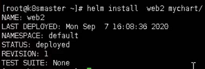

## 持久化存储

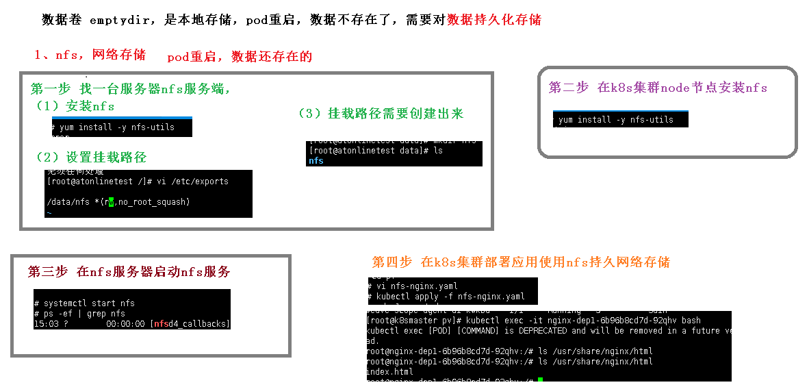

上面“设置挂载路径”中的`/data/nfs`表示挂载的路径，`*`表示所有内容，`rw`表示读写权限

第四步“在k8s集群部署应用使用nfs持久网络存储”中，如何创建nfs的deployment：

首先创建`nfs-nginx.yaml`：

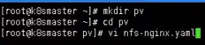

文件里面写的内容：

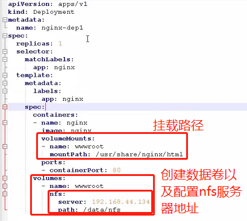

之后执行`kubectl apply`命令创建该deployment，使用`kubectl get pods`查看创建状态，如果一直没有创建完成（一直没有到RUNNING状态），可以使用`kubectl describe pod xxx`命令来查看状态：

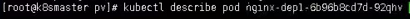

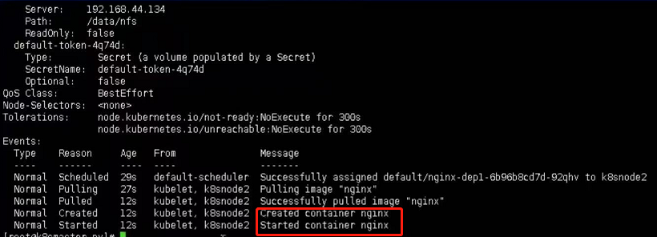

上面第四步“在k8s集群部署应用使用nfs持久网络存储”，在完成所有部署之后，我们在外部nfs服务器的挂载路径中放置一个文件，对应的应用的挂载路径中也会有这个文件。

### 共享存储

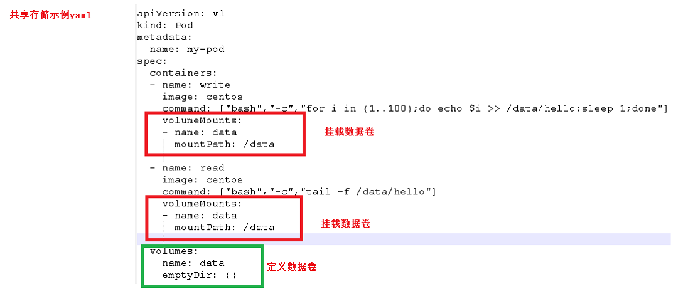

### PV与PVC

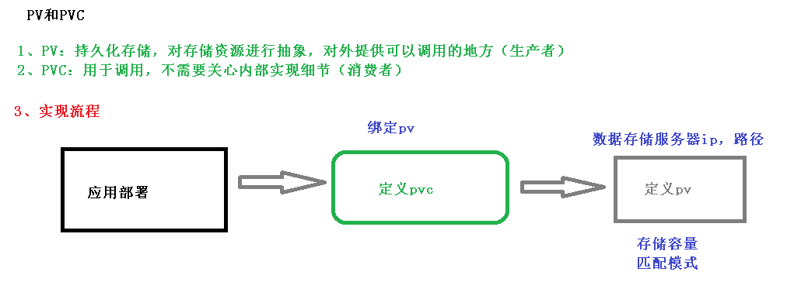

pvc如何绑定pv呢？通过存储容量和匹配模式，比方说pvc要找pv中存储容量为50g的且匹配模式为读写的，这个过程就叫做绑定

操作过程：

首先建立`pvc.yaml`：

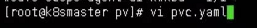

写入内容：

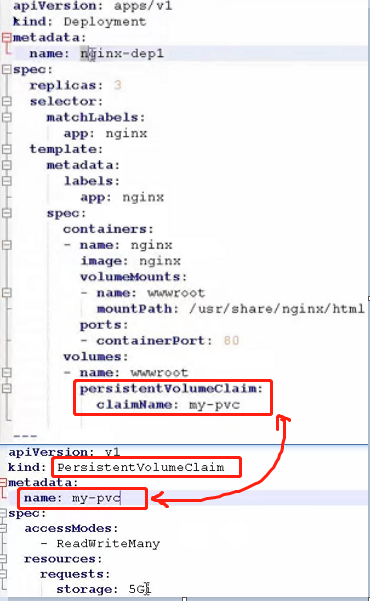

并执行apply命令进行创建

然后创建`pv.yaml`，并写入内容：

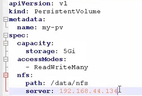

并执行apply

随后我们使用`kubectl get pv,pvc`来查看：

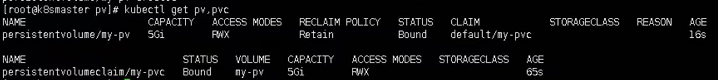

### SC

Storage Class(SC)：对接后端存储服务器(Storage)的驱动(插件)，配置 Storage Class 对象时，需要提供对接存储的相关信息，比如存储地址、认证用户名和密码等。

Storage：真实存储数据的服务器，包含服务器地址和认证等信息。

参考：https://www.cnblogs.com/panwenbin-logs/p/12196286.html（k8s学习笔记之StorageClass+NFS）、https://www.cnblogs.com/mybxy/p/13994931.html（k8s 持久卷使用记录 ( PV + PVC + SC + NFS )）

## 集群资源监控

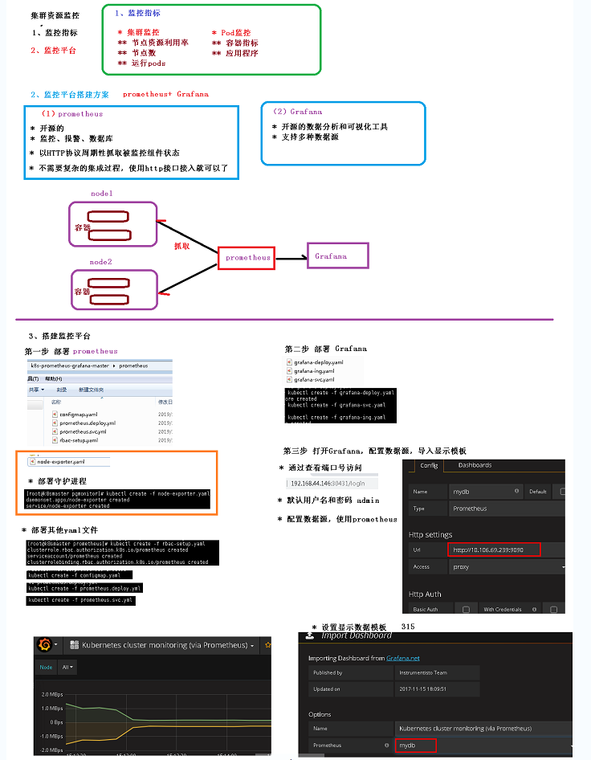

由于在`yaml`文件中我们指定了命名空间为：`kube-system`，所以查看svc的时候需要带上命名空间：

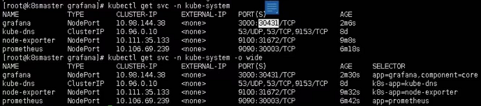

配置数据源具体操作：

首先进入grafana页面

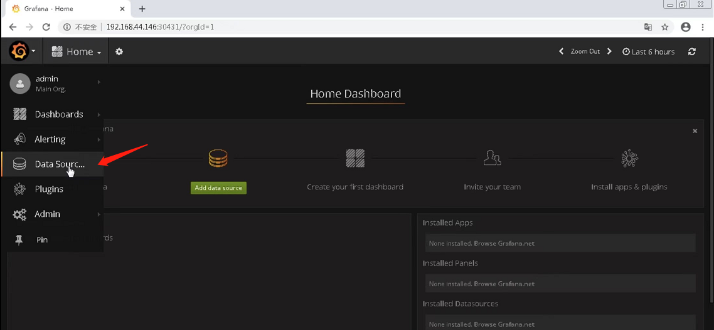

添加数据源进行配置：

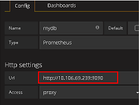

特别注意上图的url，需要指定Prometheus的集群ip：

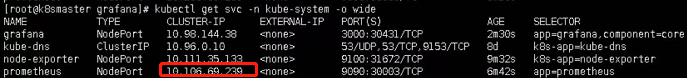

接下来需要设置grafana的数据模板：

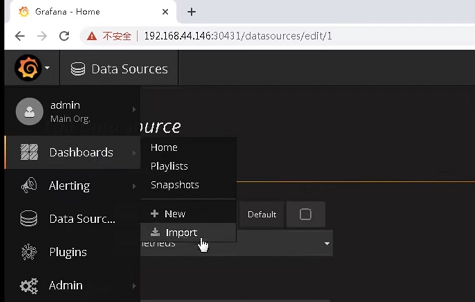

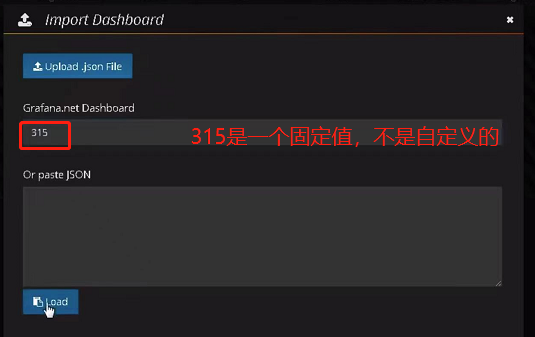

这个315是我们选用的一个模板（类似于模板名或模板id）

当然也可以选择其他模板

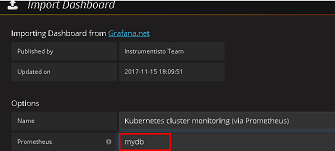

之后就能显示出图形化界面了：

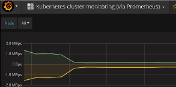

## 部署多master节点

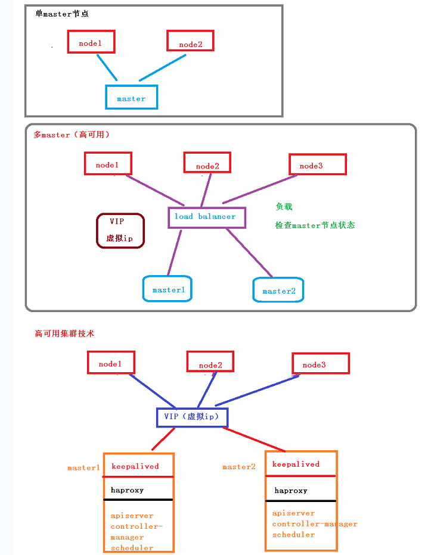

keepalived的两个作用：

- 配置虚拟ip（上图的VIP（虚拟ip））
- 检查当前节点的状态

haproxy类似于nginx，换句话说这里的haproxy可以替换成nginx，那么为什么要加他呢？

首先node是去请求load balancer的，如果不加haproxy，load balancer通过keepalived检测到master1是正常的，那么所有的请求全部都会打到master1这里，这显然不合理，请求应该平均分配，因此要加上负载均衡，加了之后就可以避免这种情况


**开始部署**

可以参考教材：`使用kubeadm搭建高可用的K8s集群.md`

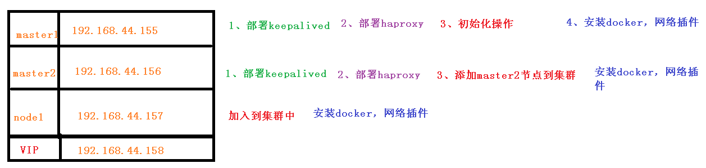

在部署haproxy时需要修改`haproxy.cfg`文件，主要修改这个地方：

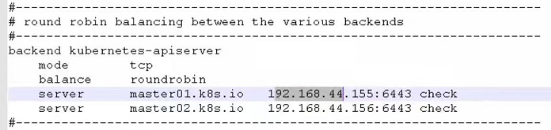

上图的"mode tcp"表示通讯模式是tcp；"balance roundrobin"表示负载均衡算法是roundrobin；"server master01.k8s.io 192.168.44.155:6443"中`master01.k8s.io`为名称，`192.168.44.155:6443`为master节点的ip和port。这些都是可以按需修改的。

haproxy默认监听端口是16443：

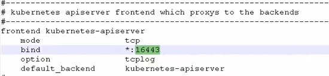

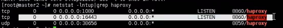

## 在k8s集群中部署项目

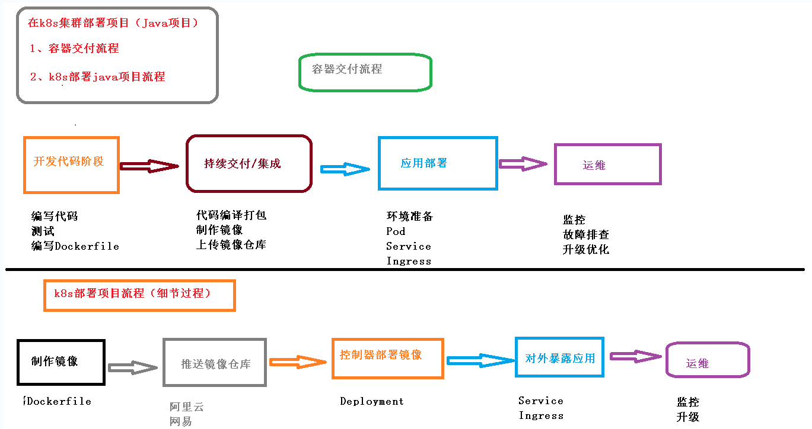

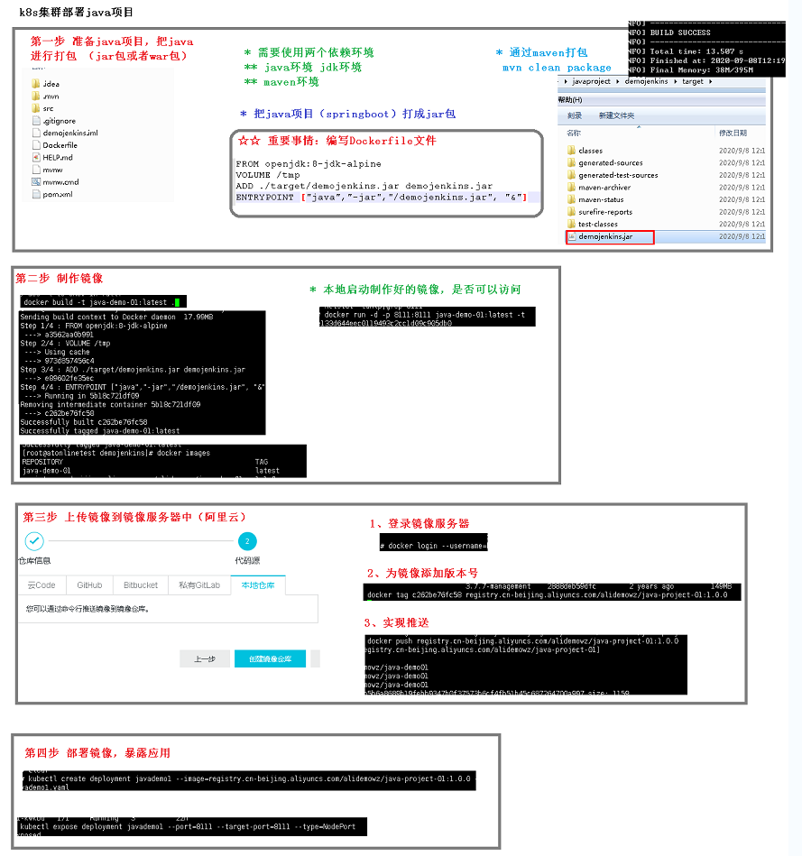

