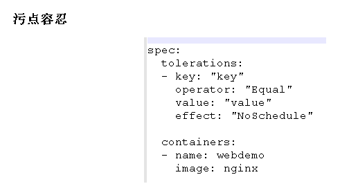

## 课程介绍


## k8s基本概念


## k8s核心概念


**无状态应用部署**

可以随便使用

**有状态应用部署**

需要有特定条件才可以使用

## 搭建k8s集群

### 使用kubeadm方式搭建


### 使用二进制方式搭建


### 总结


## kubectl


## 资源编排（yaml）


### 使用create或get命令自动生成yaml文件


## Pod


### Pod与docker的区别


docker里头一个容器里面有一个应用，对应一个进程，是单进程的；Pod里头有多个容器，每个容器对应一个应用，每个应用对应一个进程，是多进程的

### 共享网络


Pause容器（根容器）也可以叫做info容器，在创建业务容器之后，会先加入到info容器中，共享ip、mac地址、port，因此他们在同一个namespace中

### 共享数据（数据卷实现）


### 镜像拉取策略


### Pod资源限制


这里的`cpu: "500m"`的意思是：

```
1c（1核） = 1000m（1000兆）
0.5c（0.5核） = 500m
0.25c（0.25核） = 250m
```

注意，这里的限制本身是由docker做到的，不是由pod做到的

### Pod重启策略


这里OnFailure的“退出状态码非0”的意思是：


这里的RESTARTS为非0

### Pod健康检查


这里的检查方法“exec”的意思是：


解释：首先执行了创建文件的命令`touch /tmp/a`，然后去访问文件`cat /tmp/a`，此时一定是可以访问到的，再执行`echo &?`（猜测这个命令的意思是用于判断上一个命令是否能执行成功，如果成功，返回0，失败则返回1），此时一定是返回0的，然后再执行删除文件命令`rm /tmp/a`，此时再去访问文件`cat /tmp/a`是一定访问不了的，再执行`echo &?`，此时一定是返回1

### 创建Pod流程


#### Pod调度（影响调用的属性、节点选择器nodeSelector、标签创建、节点亲和性nodeAffinity）


#### 污点与污点容忍


## Controller


升级过程中服务不中断，例子：假设有一个nginx1.14的服务以及一个他的副本在运行，此时要升级成1.15版本，会先创建一个新的1.15的服务，期间1.14的两个服务不停，当1.15的服务准备完成之后，再替换掉所有1.14的服务

### 无状态与有状态、有状态应用中的无头service（ClusterIP为none）以及StatefulSet、守护进程DaemonSet、一次性任务Job、定时任务CronJob


删除所有statefulset：`kubectl delete statefulset --all`

删除指定名称的svc：`kubectl delete svc web01`

上面“部署一个守护进程DaemonSet”的yaml例子（该应用的具体作用我们不关心，只是想测试一下DaemonSet，这里他用于日志采集）：


上面“job（一次性任务）”的yaml例子：


这里的最后一行“backoffLimit”意思是启动失败之后再次尝试重启的次数，这里为4次

## Service


上面那个"vip（虚拟ip）"是指service对外的ip地址

实验常用Service类型（ClusterIP、NodePort、LoadBalancer）：

- create一个镜像为nginx的yaml，然后apply

- expose一个该应用的yaml，修改yaml文件中的type属性：

  

  然后apply

- 执行`kubectl get svc`就可以看到该应用对内暴露的端口以及对外暴露的端口以及服务的type属性

  

LoadBalancer非常强大，一般是在公有云里使用的，不仅能做到NodePort的功能，还能做到nginx的负载均衡等，而且nginx负载均衡需要手动添加节点做反向代理，LoadBalancer就不需要手动添加，非常方便

## 配置管理

### Secret


创建secret加密数据并以变量形式挂载到pod的解释：

- 首先创建Secret加密数据应用，里头的username为用base64加密后的用户名，password为用base64加密后的密码
- 创建另一个应用，以`-name`的形式定义变量（比方说上图，定义了两个变量：`SECRET_USERNAME`和`SECRET_PASSWORD`），然后指定从哪个Secret加密数据应用获取需要绑定到变量的数据（比方说上图，从mysecret中获取username绑定到`SECRET_USERNAME`，从mysecret中获取password绑定到`SECRET_PASSWORD`）
- 然后在该应用中打印变量（比方说执行`echo $SECRET_USERNAME`，那么输出即为mysecret中加密数据解密之后的数据）

创建secret加密数据并以Volume形式挂载到pod的解释：

- 首先创建Secret加密数据应用，里头的username为用base64加密后的用户名，password为用base64加密后的密码
- 创建另一个应用，以数据卷的形式（关注上图红方框圈起来的部分）将数据挂载到相应目录下
- 进入该应用，进入相应的目录即可找到解密之后的数据

### ConfigMap


上面“以变量形式挂载到pod容器中”的`myconfig.yaml`文件：


其中`special.level`和`special.type`为自定义变量

`config-var.yaml`文件：


其中变量的绑定与上面"创建secret加密数据并以变量形式挂载到pod"的绑定方法一模一样

## k8s集群安全机制


k8s获取命名空间：`kubectl get ns`

k8s创建命名空间：`kubectl create ns ns1`

用于创建角色绑定的yaml文件：


其中namespace需要我们自己指定


