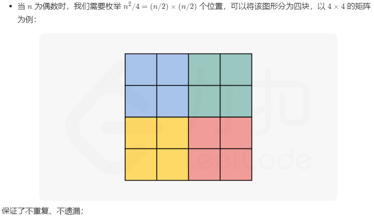
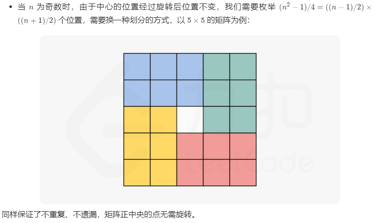
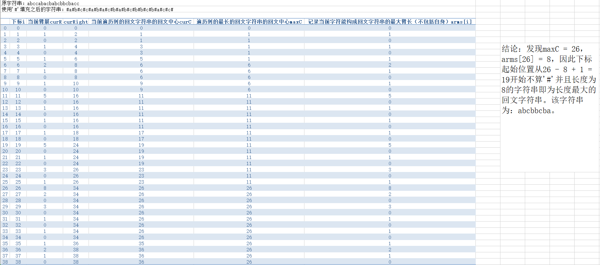
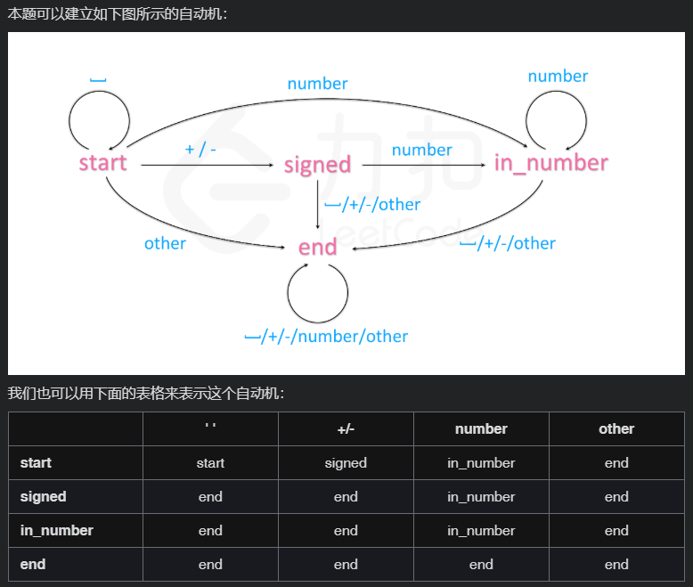
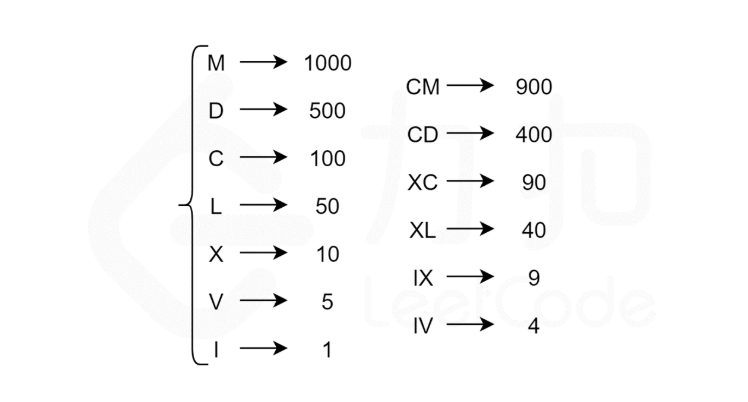
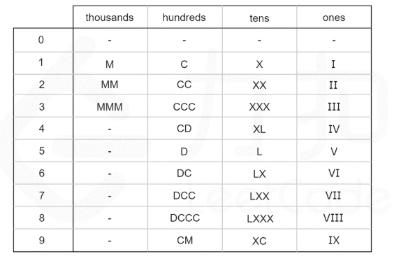
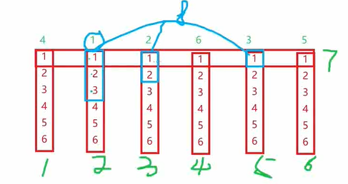
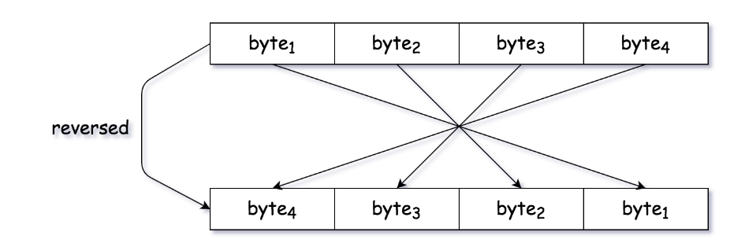

## 数组

### [1. Two Sum](https://leetcode-cn.com/problems/two-sum/)

- 暴力枚举

- 哈希表

  遍历一次

  用哈希表维护已经被遍历过的元素

### [4. Median of Two Sorted Arrays[H]](https://leetcode-cn.com/problems/median-of-two-sorted-arrays/)

- 合并 + 排序

  ```c++
  double findMedianSortedArrays(vector<int>& nums1, vector<int>& nums2) {
      nums1.insert(nums1.end(), nums2.begin(), nums2.end());
      sort(nums1.begin(), nums1.end());
      int sNums1 = nums1.size();
      if (sNums1 % 2 == 1) {
          return nums1[sNums1 / 2];
      } else {
          return (nums1[sNums1 / 2 - 1] + nums1[sNums1 / 2]) / 2.0;
      }
  }
  ```

- 双指针排序

  ```c++
  double findMedianSortedArrays(vector<int>& nums1, vector<int>& nums2) {
      int sNums1 = nums1.size(), sNums2 = nums2.size();
      int pointer1 = 0, pointer2 = 0;
      int dest = (sNums1 + sNums2 + 1) / 2;
      bool flag = ((sNums1 + sNums2) & 1) == 1;
      int ans1;
      while (dest && (pointer1 < sNums1 || pointer2 < sNums2)) {
          if (pointer1 < sNums1 && pointer2 < sNums2) {
              if (nums1[pointer1] <= nums2[pointer2]) {
                  ans1 = nums1[pointer1];
                  ++pointer1;
              } else {
                  ans1 = nums2[pointer2];
                  ++pointer2;
              }
          } else if (pointer1 < sNums1) {
              ans1 = nums1[pointer1];
              ++pointer1;
          } else {
              ans1 = nums2[pointer2];
              ++pointer2;
          }
          --dest;
      }
      if (flag) {
          return ans1;
      } else {
          if (pointer1 < sNums1 && pointer2 < sNums2) {
              int ans2 = nums1[pointer1] <= nums2[pointer2] ? nums1[pointer1] : nums2[pointer2];
              return (ans1 + ans2) / 2.0;
          } else if (pointer1 < sNums1) {
              return (ans1 + nums1[pointer1]) / 2.0;
          } else {
              return (ans1 + nums2[pointer2]) / 2.0;
          }
      }
  }
  ```

- 二分查找

  ```c++
  class Solution {
  public:
      int getKthElement(const vector<int>& nums1, const vector<int>& nums2, int k) {
          /* 主要思路：要找到第 k (k>1) 小的元素，那么就取 pivot1 = nums1[k/2-1] 和 pivot2 = nums2[k/2-1] 进行比较
           * 这里的 "/" 表示整除
           * nums1 中小于等于 pivot1 的元素有 nums1[0 .. k/2-2] 共计 k/2-1 个
           * nums2 中小于等于 pivot2 的元素有 nums2[0 .. k/2-2] 共计 k/2-1 个
           * 取 pivot = min(pivot1, pivot2)，两个数组中小于等于 pivot 的元素共计不会超过 (k/2-1) + (k/2-1) <= k-2 个
           * 这样 pivot 本身最大也只能是第 k-1 小的元素
           * 如果 pivot = pivot1，那么 nums1[0 .. k/2-1] 都不可能是第 k 小的元素。把这些元素全部 "删除"，剩下的作为新的 nums1 数组
           * 如果 pivot = pivot2，那么 nums2[0 .. k/2-1] 都不可能是第 k 小的元素。把这些元素全部 "删除"，剩下的作为新的 nums2 数组
           * 由于我们 "删除" 了一些元素（这些元素都比第 k 小的元素要小），因此需要修改 k 的值，减去删除的数的个数
           */
  
          int m = nums1.size();
          int n = nums2.size();
          int index1 = 0, index2 = 0;
  
          while (true) {
              // 边界情况
              if (index1 == m) {
                  return nums2[index2 + k - 1];
              }
              if (index2 == n) {
                  return nums1[index1 + k - 1];
              }
              if (k == 1) {
                  return min(nums1[index1], nums2[index2]);
              }
  
              // 正常情况
              int newIndex1 = min(index1 + k / 2 - 1, m - 1);
              int newIndex2 = min(index2 + k / 2 - 1, n - 1);
              int pivot1 = nums1[newIndex1];
              int pivot2 = nums2[newIndex2];
              if (pivot1 <= pivot2) {
                  k -= newIndex1 - index1 + 1;
                  index1 = newIndex1 + 1;
              }
              else {
                  k -= newIndex2 - index2 + 1;
                  index2 = newIndex2 + 1;
              }
          }
      }
      double findMedianSortedArrays(vector<int>& nums1, vector<int>& nums2) {
          int totalLength = nums1.size() + nums2.size();
          if (totalLength % 2 == 1) {
              return getKthElement(nums1, nums2, (totalLength + 1) / 2);
          }
          else {
              return (getKthElement(nums1, nums2, totalLength / 2) + getKthElement(nums1, nums2, totalLength / 2 + 1)) / 2.0;
          }
      }
  };
  ```

- 划分数组

  ```c++
  double findMedianSortedArrays(vector<int>& nums1, vector<int>& nums2) {
      if (nums1.size() > nums2.size()) {
          return findMedianSortedArrays(nums2, nums1);
      }
      int sNums1 = nums1.size(), sNums2 = nums2.size();
      int left = 0, right = sNums1;
      // median1：前一部分的最大值
      // median2：后一部分的最小值
      int median1 = 0, median2 = 0;
      while (left <= right) {
          // 前一部分包含 nums1[0 .. i-1] 和 nums2[0 .. j-1]
          // 后一部分包含 nums1[i .. sNums1-1] 和 nums2[j .. sNums2-1]
          int i = (left + right) >> 1;
          int j = ((sNums1 + sNums2 + 1) >> 1) - i;
  
          // nums1Left, nums1Right, nums2Left, nums2Right 分别表示 nums1[i-1], nums1[i], nums2[j-1], nums2[j]
          int nums1Left = (i == 0 ? INT_MIN : nums1[i - 1]);
          int nums1Right = (i == sNums1 ? INT_MAX : nums1[i]);
          int nums2Left = (j == 0 ? INT_MIN : nums2[j - 1]);
          int nums2Right = (j == sNums2 ? INT_MAX : nums2[j]);
  
          // 这里采取的思路是nums1Left <= nums2Right，另一种是nums2Left <= nums1Right
          if (nums1Left <= nums2Right) {
              median1 = max(nums1Left, nums2Left);
              median2 = min(nums1Right, nums2Right);
              left = i + 1;
          } else {
              right = i - 1;
          }
      }
      return (sNums1 + sNums2) % 2 == 0 ? (median1 + median2) / 2.0 : median1;
  }
  ```

### [11. Container With Most Water[M]](https://leetcode-cn.com/problems/container-with-most-water/)

- 双指针暴力法（超时）

  计算每一个可能的面积，取最大

- 双指针

  取首尾双指针，计算当前双指针构成的面积，然后向内移动双指针（移动当前高度较低的那个指针），直到两指针相遇，返回面积最大值即可

### [14. Longest Common Prefix](https://leetcode-cn.com/problems/longest-common-prefix/)

- 横向扫描

  以字符串为单位对比

- 纵向扫描

  以字符为单位对比

- 分治

  以字符串为单位分组

- 二分查找

  以字符为单位分组

### [15. 3Sum[M]](https://leetcode-cn.com/problems/3sum/)

- 排序 + 双指针

  原理其实跟[1. Two Sum](https://leetcode-cn.com/problems/two-sum/)是一样的，Two Sum中假设有`x + y = target`，我们先拿到`x`，再去找`target - x`，如果找到了，就是符合条件的`x和y`。这里也是一样，假设有`x + y + z = target`， 先找到`x和y`，再去找`target - x - y`，如果找到了，就是符合条件的`x、y和z`。

  而且这里还有一点：由于经过了排序，假设有第一层遍历遍历到某数`i`，第二层遍历遍历到某数`j`，第三层遍历我们采取一个后指针往前遍历的方式来遍历，遍历到某数`k`，有两种情况：1、如果找到了符合条件的`k`，那么下一次第二层遍历遍历到的数将会是`m(m > j)`，而此时我们不需要将第三层遍历再从最末尾开始重新向前遍历，而应该从原先`k`的位置继续往前遍历，因为就算在这次遍历中第三层遍历找到了符合条件的数`z`，`z`也一定会小于`k`；2、如果没有找到符合条件的`k`，那么就没有必要再执行下一个第二层以及第三层遍历了，因为下一次第二层遍历遍历到的数`m(m > j)`，那么第三层将更加找不到符合条件的数。

  ```c++
  vector<vector<int>> threeSum(vector<int>& nums) {
      int sNums = nums.size();
      sort(nums.begin(), nums.end());
      vector<vector<int>> ans;
      for (int i = 0; i < sNums; i++) {
          if (i > 0 && nums[i] == nums[i - 1]) continue;
          int last = sNums - 1;
          int target = -nums[i];
          // 下面这种写法看似是一个二重遍历，其实就是双指针向内移动的写法
          for (int j = i + 1; j < sNums; j++) {
              if (j > i + 1 && nums[j] == nums[j - 1]) continue;
              while (j < last && nums[last] + nums[j] > target) {
                  last--;
              }
              if (j == last) {
                  break;
              }
              if (nums[last] + nums[j] == target) {
                  vector<int> temp = {nums[i], nums[j], nums[last]};
                  ans.emplace_back(temp);
              }
          }
      }
      return ans;
  }
  ```

  为了更清晰的体现出双指针，我们换种写法：

  ```c++
  vector<vector<int>> threeSum(vector<int>& nums) {
      vector<vector<int>> ret;
      int sNums = nums.size();
      sort(nums.begin(), nums.end());
      for (int i = 0; i < sNums; i++) {
          if (i > 0 && nums[i] == nums[i - 1]) continue;
          int target = -nums[i];
          int last = sNums - 1;
          int first = i + 1;
          // 双指针
          while (first < last) {
              int sum = nums[first] + nums[last];
              if (target == sum) {
                  vector<int> temp = {nums[i], nums[first], nums[last]};
                  ret.emplace_back(temp);
              }
              if (sum < target) {
                  first++;
                  while (first < last && nums[first] == nums[first - 1]){
                      first++;
                  }
              } else {
                  last--;
                  while (first < last && nums[last] == nums[last + 1]) {
                      last--;
                  }
              }
          }
      }
      return ret;
  }
  ```

### [16. 3Sum Closest[M]](https://leetcode-cn.com/problems/3sum-closest/)

- 排序 + 双指针

  思路跟[15. 3Sum[M]](https://leetcode-cn.com/problems/3sum/)一样

  ```c++
  int threeSumClosest(vector<int>& nums, int target) {
      sort(nums.begin(), nums.end());
      int ans;
      int minSum = INT_MAX;
      auto update = [&](int cur){
          if (abs(target - cur) < minSum) {
              minSum = abs(target - cur);
              ans = cur;
          }
      };
      int sNums = nums.size();
      for (int i = 0; i < sNums; i++) {
          if (i > 0 && nums[i] == nums[i - 1]) continue;
          int left = i + 1, right = sNums - 1;
          while (left < right) {
              int sum = nums[i] + nums[left] + nums[right];
              if (sum == target) {
                  return sum;
              }
              update(sum);
              // 双指针向内移动
              if (sum < target) {
                  left++;
                  while (left < right && left > i + 1 && nums[left] == nums[left - 1]) {
                      left++;
                  }
              } else {
                  right--;
                  while (left < right && right < sNums - 1 && nums[right] == nums[right + 1]) {
                      right--;
                  }
              }
          }
      }
      return ans;
  }
  ```

### [17. Letter Combinations of a Phone Number[M]](https://leetcode-cn.com/problems/letter-combinations-of-a-phone-number/)

首先假设`digits`

- 深度优先

  假设有`[a, b, c]、[d, e, f]、[g, h, i]，求排列组合，那么adg、adh、...、cfi一定是先有ad、ae、...、fi之后才有的，而ad、ae、...、fi一定是先有某一个数组比方说[g, h, i]中的某个字符，然后再第二层遍历其它两个数组中的某一个数组得来的`。按照这样的思路就可以递归求解

  ```c++
  vector<string> mapping = {
      "", "", "abc", "def", "ghi", "jkl", "mno", "pqrs", "tuv", "wxyz"
  };
  vector<string> letterCombinations(string digits) {
      vector<string> ans;
      if (digits == "") return ans;
      vector<string> temp = letterCombinations(digits.substr(1, digits.size()));
      for (char& c: mapping[digits[0] - '0']) {
          if (!temp.empty()) {
              for (string& cT: temp) {
                  ans.emplace_back(c + cT);
              }
          } else {
              string tempStr = "";
              tempStr += c;
              ans.emplace_back(tempStr);
          }
      }
      return ans;
  }
  ```

- 广度优先

  假设有`[a, b, c]、[d, e, f]、[g, h, i]`，第一次遍历某一个数组比方说`[a, b, c]`，得到：`a、b、c`，放入集合x中维护，第二次遍历其他两个数组中的某一个数组比方说`[d, e, f]`，得到：`ad、ae、af、bd、be、bf、cd、ce、cf`，此时将x中上次遍历留下的内容删除（这里删除`a、b、c`）。依此类推即可

  ```c++
  vector<string> mapping = {
      "", "", "abc", "def", "ghi", "jkl", "mno", "pqrs", "tuv", "wxyz"
  };
  vector<string> letterCombinations(string digits) {
      vector<string> ans;
      if (digits == "") return ans;
      int sDigits = digits.size();
      for (int i = 0; i < sDigits; i++) {
          if (ans.empty()) {
              for (char c: mapping[digits[i] - '0']) {
                  string temp = "";
                  temp += c;
                  ans.emplace_back(temp);
              }
          } else {
              int sAns = ans.size();
              for (int j = 0; j < sAns; j++) {
                  for (char c: mapping[digits[i] - '0']) {
                      ans.emplace_back(ans[j] + c);
                  }
              }
              ans.erase(ans.begin(), ans.begin() + sAns);
          }
      }
      return ans;
  }
  ```

- 回溯（求排列组合的神器）

  ```c++
  vector<string> mapping = {
      "", "", "abc", "def", "ghi", "jkl", "mno", "pqrs", "tuv", "wxyz"
  };
  vector<string> ans;
  string helper;
  vector<string> letterCombinations(string digits) {
      if (digits.empty()) return ans;
      backTrack(digits, 0);
      return ans;
  }
  void backTrack(const string& digits, int index) {
      if (index == digits.size()) {
          ans.emplace_back(helper);
      } else {
          for (char c: mapping[digits[index] - '0']) {
              helper += c;
              backTrack(digits, index + 1);
              helper.erase(helper.end() - 1);
          }
      }
  }
  ```

### [18. 4Sum[M]](https://leetcode-cn.com/problems/4sum/)

- 思路跟[15. 3Sum[M]](https://leetcode-cn.com/problems/3sum/)一样，也是排序 + 双指针

### [26. Remove Duplicates from Sorted Array](https://leetcode-cn.com/problems/remove-duplicates-from-sorted-array/)

- 双指针（快慢指针）

### [27. Remove Element](https://leetcode-cn.com/problems/remove-element/)

- 双指针
  - 快慢指针，慢指针可以顺便计数
  - 头尾指针，头指针可以顺便计数

### [31. 下一个排列[M]](https://leetcode-cn.com/problems/next-permutation/)

- 两遍扫描

  假设数组为nums，从后往前扫描，找到`nums[lowerIndex] < nums[lowerIndex + 1]`的第一个`lowerIndex`，即为较小值的下标，然后再次从后往前扫描，由于上一次扫描可以确定数组nums中从下标`(lowerIndex + 1)`到数组末尾元素单调递减，因此可以不使用额外空间保存较大值，直接找到`nums[greaterThanLowerIndex] > nums[lowerIndex]`的第一个`greaterThanLowerIndex`，即为较大值的下标，`swap(nums[lowerIndex], nums[greaterThanLowerIndex])`，然后将下标`lowerIndex`之后的所有元素翻转即可；如果找不到符合条件的下标`lowerIndex`，则翻转所有元素。由于找不到`lowerIndex`的时候`lowerIndex`必为`-1`，因此这两种情况可以总结为一行代码：`reverse(nums.begin() + lowerIndex + 1, nums.end())`

### [33. 搜索旋转排序数组[M]](https://leetcode-cn.com/problems/search-in-rotated-sorted-array/)

- 二分查找（常规思路）

  将数组一分为二，其中一定有一个是有序的，另一个可能是有序，也能是部分有序。此时有序部分用二分法查找。无序部分再一分为二，其中一个一定有序，另一个可能有序，可能无序。

- 二分查找（官解）

  ```c++
  int search(vector<int>& nums, int target) {
      int n = (int)nums.size();
      if (!n) {
          return -1;
      }
      if (n == 1) {
          return nums[0] == target ? 0 : -1;
      }
      int l = 0, r = n - 1;
      while (l <= r) {
          int mid = (l + r) / 2;
          // 为了让下面的代码以mid为分割线，这里单独判断nums[mid]是否等于target
          if (nums[mid] == target) return mid;
          if (nums[0] <= nums[mid]) {
              // 可以断定数组下标0到mid单调递增
              // 因此可以断定如果target不在0到mid之间，则一定在mid到n - 1之间，又因为上面代码排除了nums[mid] == target的可能，因此target只能在mid + 1到n - 1之间
              if (nums[0] <= target && target < nums[mid]) {
                  r = mid - 1;
              } else {
                  l = mid + 1;
              }
          } else {
              // 可以断定数组下标mid到n - 1单调递增
              // 因此可以断定如果target不在mid到n - 1之间，则一定在0到mid之间，又因为上面代码排除了nums[mid] == target的可能，因此target只能在0到mid - 1之间
              if (nums[mid] < target && target <= nums[n - 1]) {
                  l = mid + 1;
              } else {
                  r = mid - 1;
              }
          }
      }
      return -1;
  }
  ```

### [34. 在排序数组中查找元素的第一个和最后一个位置[M]](https://leetcode-cn.com/problems/find-first-and-last-position-of-element-in-sorted-array/)

注意点：1、平时的二分查找找到了就返回，但是这里得接着找；2、如果找到了，由于得接着找，right指针和left指针应该如何移动

- 二分查找（常规思路）

  采用两遍二分查找，找到元素之后，一个往回找，一个往前找

- 二分查找（官解）

  其实跟常规思路是一样的，只是写法不一样而已

  如果出现这两种情况：1、`nums[mid] > target`；2、查找低边界时`nums[mid] >= target`。就往前找（`right - 1`），并且我们打算利用`nums[mid] >= target`中这个等号找到最低边界（`ans = mid`），反之就往后找（`left + 1`）

  由于找到元素之后不能立刻返回，因此这里干脆就不处理`nums[mid] = target`的情况了，那么就会导致查找高边界时找到的下标需要减一才是真正的最高边界下标

  而且这里的`ans`不可靠，在最后需要做判断才能确定找到的是不是正确的最高最低边界下标

  ```c++
  class Solution {
  private:
      int bSearch(vector<int>& nums, const int& target, const bool& isLower) {
          int left = 0, right = nums.size() - 1, ans = nums.size();
          while (left <= right) {
              int mid = left + ((right - left) >> 1);
              if (nums[mid] > target || (isLower && nums[mid] >= target)) {
                  right = mid - 1;
                  ans = mid;
              } else {
                  left = mid + 1;
              }
          }
          return ans;
      }
  public:
      vector<int> searchRange(vector<int>& nums, int target) {
          int lowerBoundary = bSearch(nums, target, true);
          int upperBoundary = bSearch(nums, target, false) - 1;
          if (lowerBoundary <= upperBoundary && upperBoundary < nums.size() && nums[lowerBoundary] == target && nums[upperBoundary] == target) {
              return { lowerBoundary, upperBoundary };
          }
          return { -1, -1 };
      }
  };
  ```

### [35. Search Insert Position](https://leetcode-cn.com/problems/search-insert-position/)

- 二分查找

### [36. 有效的数独[M]](https://leetcode-cn.com/problems/valid-sudoku/)

- 一次遍历

  关键点在于:

  - 坐标的计算
  - 将格子中的值想象成是一个下标

  ```c++
  bool isValidSudoku(vector<vector<char>>& board) {
      int rows[9][9];
      int columns[9][9];
      int subboxes[3][3][9];
      for (int i = 0; i < 9; ++i) {
          for (int j = 0; j < 9; ++j) {
              char c = board[i][j];
              if (c != '.') {
                  int index = c - '0' - 1;
                  ++rows[i][index];
                  ++columns[j][index];
                  ++subboxes[i / 3][j / 3][index];
                  if (rows[i][index] > 1 || columns[j][index] > 1 || subboxes[i / 3][j / 3][index] > 1) {
                      return false;
                  }
              }
          }
      }
      return true;
  }
  ```

### [39. 组合总和[M]](https://leetcode-cn.com/problems/combination-sum/)

- 搜索回溯

  对于这类寻找所有可行解的题，我们都可以尝试用「搜索回溯」的方法来解决。

  ```c++
  class Solution {
      shared_ptr<vector<vector<int>>> ans;
  public:
      Solution(): ans(shared_ptr<vector<vector<int>>>(new vector<vector<int>>)) {}
      void dfs(vector<int>& candidates, vector<int>& combine, const int& target, int index) {
          if (index == candidates.size()) {
              return;
          }
          if (target == 0) {
              ans -> emplace_back(combine);
              return;
          }
          // 深度优先搜索
          dfs(candidates, combine, target, index + 1);
          if (target - candidates[index] >= 0) {
              combine.emplace_back(candidates[index]);
              dfs(candidates, combine, target - candidates[index], index);
              combine.pop_back();
          }
      }
      vector<vector<int>> combinationSum(vector<int>& candidates, int target) {
          vector<int> combine;
          dfs(candidates, combine, target, 0);
          return *ans;
      }
  };
  ```

- 搜索回溯（剪枝）

  ```c++
  class Solution {
      shared_ptr<vector<vector<int>>> ans;
  public:
      Solution(): ans(shared_ptr<vector<vector<int>>>(new vector<vector<int>>)) {}
      std::optional<int> dfs(vector<int>& candidates, vector<int>& combine, const int& target, int index) {
          if (index == candidates.size()) {
              return std::nullopt;
          }
          if (target == 0) {
              ans -> emplace_back(combine);
              return std::nullopt;
          }
          auto nextNum = dfs(candidates, combine, target, index + 1);
          // 剪枝
          if (nextNum != std::nullopt && *nextNum == candidates[index]) {
              return candidates[index];
          }
          if (target - candidates[index] >= 0) {
              combine.emplace_back(candidates[index]);
              dfs(candidates, combine, target - candidates[index], index);
              combine.pop_back();
          }
          return candidates[index];
      }
      vector<vector<int>> combinationSum(vector<int>& candidates, int target) {
          // 因为要剪枝，所以要排序
          sort(candidates.begin(), candidates.end());
          vector<int> combine;
          dfs(candidates, combine, target, 0);
          return *ans;
      }
  };
  ```

### [40. 组合总和 II](https://leetcode-cn.com/problems/combination-sum-ii/)

难点在于重复数字的处理，举个例子：`[2,1,3,7,1,4]中找和为8的`，如果结果集合可以重复，那么简单的回溯即可，但是题目要求不可重复，此时如何避免出现`[[1,7],[7,1],...]`这样的情况呢？

- 回溯（不剪枝）

  可以先用哈希表`hm`存储元素及其出现的次数，然后对`hm`进行递归回溯即可，他的核心在于处理重复数字情况下所有组合的求解，而且可以保证结果集合不重复

  ```c++
  class Solution {
      // 用于收集每个元素及其出现的次数
      unordered_map<int, int> numCount;
      vector<vector<int>> ans;
      vector<int> combine;
      void dfs(const int& target, unordered_map<int, int>::iterator iter) {
          if (target == 0) {
              ans.emplace_back(combine);
              return;
          }
          if (iter == numCount.end()) {
              return;
          }
          unordered_map<int, int>::iterator iterCopy = iter;
          // 等同于 ++iterCopy
          advance(iterCopy, 1);
          // 深度优先
          dfs(target, iterCopy);
          int most = min(target / iter -> first, iter -> second);
          // 核心就在于此
          // 对于每一次回溯，不急着combine.pop_back()，因为我就是要求出组合中重复数字为1个、2个、3个、...的情况下所有的组合情况
          for (int i = 1; i <= most; ++i) {
              combine.emplace_back(iter -> first);
              iterCopy = iter;
              advance(iterCopy, 1);
              dfs(target - iter -> first * i, iterCopy);
          }
          // 等到这个时候，再去全部combine.pop_back()
          for (int i = 1; i <= most; ++i) {
              combine.pop_back();
          }
      }
  public:
      vector<vector<int>> combinationSum2(vector<int>& candidates, int target) {
          for (const int& c: candidates) {
              if (!numCount.count(c)) {
                  numCount[c] = 1;
              } else {
                  ++numCount[c];
              }
          }
          dfs(target, numCount.begin());
          return ans;
      }
  };
  ```

- 回溯（剪枝）

  ```c++
  class Solution {
      // 由于排序了，因此可以使用线性数组代替哈希表，遍历起来更加方便
      vector<pair<int, int>> numCount;
      vector<vector<int>> ans;
      vector<int> combine;
      void dfs(const int& target, int pos) {
          if (target == 0) {
              ans.emplace_back(combine);
              return;
          }
          // 剪枝，如果当前元素已经大于target，由于有序递增，后续的元素肯定大于target，直接跳过即可
          if (pos == numCount.size() || target < numCount[pos].first) {
              return;
          }
          dfs(target, pos + 1);
          int most = min(target / numCount[pos].first, numCount[pos].second);
          for (int i = 1; i <= most; ++i) {
              combine.emplace_back(numCount[pos].first);
              dfs(target - i * numCount[pos].first, pos + 1);
          }
          for (int i = 1; i <= most; ++i) {
              combine.pop_back();
          }
      }
  public:
      vector<vector<int>> combinationSum2(vector<int>& candidates, int target) {
          // 由于需要剪枝，因此排序
          sort(candidates.begin(), candidates.end());
          for (const int& c: candidates) {
              if (numCount.empty() || numCount.back().first != c) {
                  numCount.emplace_back(c, 1);
              } else {
                  ++numCount.back().second;
              }
          }
          dfs(target, 0);
          return ans;
      }
  };
  ```

### [45. 跳跃游戏 II[M]](https://leetcode-cn.com/problems/jump-game-ii/)

这道题是典型的贪心算法，通过局部最优解得到全局最优解。以下两种方法都是使用贪心算法实现，只是贪心的策略不同。

- 反向查找出发位置

  ```c++
  int jump(vector<int>& nums) {
      int position = nums.size() - 1;
      int ans = 0;
      while (position > 0) {
          for (int i = 0; i < position; ++i) {
              if (i + nums[i] >= position) {
                  position = i;
                  ++ans;
                  break;
              }
          }
      }
      return ans;
  }
  ```

- 正向查找可到达的最大位置

  ```c++
  int jump(vector<int>& nums) {
      // end用于记录本次跳跃能到达的最大边界
      int end = 0;
      int maxPos = 0, n = nums.size(), step = 0;
      // 当i == n - 1时，已经跳到了最后一个位置，step不需要再加1了，因此i == n - 1这一步可以不做计算（搞清楚for循环的目的就是++step）
      for (int i = 0; i < n - 1; ++i) {
          if (maxPos >= i) {
              maxPos = max(maxPos, i + nums[i]);
              // i == end时，maxPos已经记录了到end为止最大的跳跃边界
              if (i == end) {
                  end = maxPos;
                  ++step;
              }
          }
      }
      return step;
  }
  ```

### [46. 全排列[M]](https://leetcode-cn.com/problems/permutations/)

- 回溯

  ```c++
  class Solution {
  public:
      shared_ptr<vector<vector<int>>> ans = shared_ptr<vector<vector<int>>>(new vector<vector<int>>);
      void backtrack(vector<int>& nums, int first, const int len) {
          // 所有数都填完了
          if (first == len) {
              ans -> emplace_back(nums);
              return;
          }
          for (int i = first; i < len; ++i) {
              // 动态维护数组
              swap(nums[first], nums[i]);
              // 继续递归填下一个数
              backtrack(nums, first + 1, len);
              // 撤销操作
              swap(nums[first], nums[i]);
          }
      }
      vector<vector<int>> permute(vector<int>& nums) {
          backtrack(nums, 0, nums.size());
          return *ans;
      }
  };
  ```

### [47. 全排列 II[M]](https://leetcode-cn.com/problems/permutations-ii/)

- 搜索回溯

  ```c++
  class Solution {
  public:
      shared_ptr<vector<vector<int>>> ans = shared_ptr<vector<vector<int>>>(new vector<vector<int>>);
      // 用于避免计算重复数字
      shared_ptr<vector<int>> vis = shared_ptr<vector<int>>(new vector<int>);
      void backtrack(const vector<int>& nums, int idx, vector<int>& perm) {
          if (idx == nums.size()) {
              ans -> emplace_back(perm);
              return;
          }
          for (int i = 0; i < nums.size(); ++i) {
              if ((*vis)[i] || (i > 0 && nums[i] == nums[i - 1] && !(*vis)[i - 1])) {
                  continue;
              }
              perm.emplace_back(nums[i]);
              (*vis)[i] = 1;
              backtrack(nums, idx + 1, perm);
              (*vis)[i] = 0;
              perm.pop_back();
          }
      }
      vector<vector<int>> permuteUnique(vector<int>& nums) {
          vis -> resize(nums.size());
          vector<int> perm;
          sort(nums.begin(), nums.end());
          backtrack(nums, 0, perm);
          return *ans;
      }
  };
  ```

### [48. 旋转图像[M]](https://leetcode.cn/problems/rotate-image/)

- 使用辅助数组

  本质在于计算出元素旋转之后的下标位置

  ```c++
  void rotate(vector<vector<int>>& matrix) {
      int n = matrix.size();
      // C++ 这里的 = 拷贝是深拷贝，会得到一个新的数组
      auto matrix_new = matrix;
      for (int i = 0; i < n; ++i) {
          for (int j = 0; j < n; ++j) {
              matrix_new[j][n - i - 1] = matrix[i][j];
          }
      }
      // 这里也是深拷贝
      matrix = matrix_new;
  }
  ```

- 原地旋转

  本质也在于计算出元素旋转之后的下标位置

  是法一的改良版，法一需要使用辅助数组，该方法不需要

  ```c++
  void rotate(vector<vector<int>>& matrix) {
      int n = matrix.size();
      for (int i = 0; i < n / 2; ++i) {
          // j < (n + 1) / 2 考虑到了图像行数或列数是奇数或偶数时的两种情况
          for (int j = 0; j < (n + 1) / 2; ++j) {
              // 以下是c++17的写法，tie类似js的解构
              // 如果是c++11那么会使用变量temp辅助元素交换
              tie(matrix[i][j], matrix[n - j - 1][i], matrix[n - i - 1][n - j - 1], matrix[j][n - i - 1]) \
                  = make_tuple(matrix[n - j - 1][i], matrix[n - i - 1][n - j - 1], matrix[j][n - i - 1], matrix[i][j]);
          }
      }
  }
  ```

  

  

- 用翻转代替旋转

  水平翻转 + 主对角线翻转 = 旋转

  ```c++
  void rotate(vector<vector<int>>& matrix) {
      int n = matrix.size();
      // 水平翻转
      for (int i = 0; i < n / 2; ++i) {
          for (int j = 0; j < n; ++j) {
              swap(matrix[i][j], matrix[n - i - 1][j]);
          }
      }
      // 主对角线翻转
      for (int i = 0; i < n; ++i) {
          for (int j = 0; j < i; ++j) {
              swap(matrix[i][j], matrix[j][i]);
          }
      }
  }
  ```

### [50. Pow(x, n)[M]](https://leetcode.cn/problems/powx-n/)

- 快速幂

  - 迭代
  - 递归

  ```c++
  // 可以使用迭代或递归实现快速幂
  double fastPower(double base, long long power);
  double myPow(double x, int n) {
      // 防止整型溢出
      long long N = n;
      return N >= 0 ? fastPower(x, N) : 1.0 / fastPower(x, -N);
  }
  ```

### [53. Maximum Subarray](https://leetcode-cn.com/problems/maximum-subarray/)

- 动态规划

  维护两个变量，一个记录局部最优，另一个记录诸多局部最优中的最大值

- 分治

  抽象来看，每一个段都可以分成左半段和右半段，而左半段和右半段又各自为一个段。假设每一个段有4个属性：`lSum（左半段部分连续元素加和能得到的最大值）`、`rSum（右半段部分连续元素加和能得到的最大值）`、`iSum（整段元素加和的值）`、`mSum（该段元素部分连续元素加和能得到的最大值）`，那么每一个段的`mSum`就是`左半段的mSum`、`右半段的mSum`、`左半段的rSum + 右半段的lSum`这三者的最大值，对于`iSum`，`iSum = 左半段iSum + 右半段iSum`，对于`lSum`，`lSum = max(左半段lSum, 左半段iSum + 右半段lSum)`，对于`rSum`，`rSum = max(右半段rSum, 右半段iSum + 左半段rSum)`。按照这个逻辑，最终求得的整个段的`mSum`即为解。

### [54. 螺旋矩阵[M]](https://leetcode.cn/problems/spiral-matrix/)

- 模拟

  ```c++
  static constexpr int direcitons[4][2] = { {0, 1}, {1, 0}, {0, -1}, {-1, 0} };
  vector<int> spiralOrder(vector<vector<int>>& matrix) {
      if (matrix.empty()|| matrix[0].empty()) {
          return {};
      }
      int rows = matrix.size(), cols = matrix[0].size();
      int total = rows * cols;
      int row = 0, col = 0;
      int curDirection = 0;
      vector<vector<bool>> visited(rows, vector<bool>(cols));
      vector<int> ans(total);
      for (int i = 0; i < total; ++i) {
          ans[i] = matrix[row][col];
          visited[row][col] = true;
          int nextRow = row + direcitons[curDirection][0], nextCol = col + direcitons[curDirection][1];
          if (nextRow < 0 || nextRow >= rows || nextCol < 0 || nextCol >= cols || visited[nextRow][nextCol]) {
              // 涉及到循环了，就要想到取余
              curDirection = (curDirection + 1) % 4;
          }
          row += direcitons[curDirection][0];
          col += direcitons[curDirection][1];
      }
      return ans;
  }
  ```

- 按层模拟

  ```c++
  vector<int> spiralOrder(vector<vector<int>>& matrix) {
      if (matrix.empty() || matrix[0].empty()) {
          return {};
      }
      int rows = matrix.size(), cols = matrix[0].size();
      int top = 0, bottom = rows - 1, left = 0, right = cols - 1;
      vector<int> ans;
      while (left <= right && top <= bottom) {
          for (int col = left; col <= right; ++col) {
              ans.emplace_back(matrix[top][col]);
          }
          for (int row = top + 1; row <= bottom; ++row) {
              ans.emplace_back(matrix[row][right]);
          }
          // 防止重复访问上面两个for循环已经访问过的元素
          if (left < right && top < bottom) {
              for (int col = right - 1; col >= left; --col) {
                  ans.emplace_back(matrix[bottom][col]);
              }
              for (int row = bottom - 1; row > top; --row) {
                  ans.emplace_back(matrix[row][left]);
              }
          }
          ++top;
          --bottom;
          ++left;
          --right;
      }
      return ans;
  }
  ```

### [55. 跳跃游戏[M]](https://leetcode.cn/problems/jump-game/)

- 贪心

  ```c++
  bool canJump(vector<int>& nums) {
      int maxStep = 0;
      int numsSize = nums.size();
      for (int i = 0; i < numsSize; ++i) {
          // 如果i大于maxStep，说明有地方跳不过去了
          if (i > maxStep) {
              break;
          }
          maxStep = max(maxStep, i + nums[i]);
          if (maxStep >= numsSize - 1) {
              return true; 
          }
      }
      return false;
  }
  ```

### [56. 合并区间[M]](https://leetcode.cn/problems/merge-intervals/)

- 排序

  ```c++
  vector<vector<int>> merge(vector<vector<int>>& intervals) {
      if (intervals.empty()) {
          return {};
      }
      sort(intervals.begin(), intervals.end());
      vector<vector<int>> merged;
      for (int i = 0; i < intervals.size(); ++i) {
          int l = intervals[i][0], r = intervals[i][1];
          if (merged.empty() || merged.back()[1] < l) {
              merged.push_back({ l, r });
          } else {
              merged.back()[1] = max(merged.back()[1], r);
          }
      }
      return merged;
  }
  ```

### [57. 插入区间[M]](https://leetcode.cn/problems/insert-interval/)

- 排序

  参考[56. 合并区间[M]](https://leetcode.cn/problems/merge-intervals/)

- 模拟

  ```c++
  vector<vector<int>> insert(vector<vector<int>>& intervals, vector<int>& newInterval) {
      int l = newInterval[0], r = newInterval[1];
      bool placed = false;
      vector<vector<int>> ans;
      for (const auto& interval : intervals) {
          if (r < interval[0]) {
              // 在插入区间的右侧且无交集
              if (!placed) {
                  ans.push_back({ l, r });
                  placed = true;
              }
              ans.emplace_back(interval);
          } else if (l > interval[1]) {
              // 在插入区间的左侧且无交集
              ans.emplace_back(interval);
          } else {
              // 与插入区间有交集，计算它们的并集
              l = min(l, interval[0]);
              r = max(r, interval[1]);
          }
      }
      if (!placed) {
          ans.push_back({ l, r });
      }
      return ans;
  }
  ```

### [59. 螺旋矩阵 II[M]](https://leetcode.cn/problems/spiral-matrix-ii/)

思路参考[54. 螺旋矩阵[M]](https://leetcode.cn/problems/spiral-matrix/)

- 模拟
- 按层模拟

### [64. 最小路径和[M]](https://leetcode.cn/problems/minimum-path-sum/)

- 动态规划

  ```c++
  int minPathSum(vector<vector<int>>& grid) {
      if (grid.empty() || grid.at(0).empty()) {
          return 0;
      }
      int rows = grid.size(), cols = grid.at(0).size();
      vector<vector<long long>> temp(rows, vector<long long>(cols));
      temp[0][0] = grid[0][0];
      for (int i = 1; i < cols; ++i) {
          temp[0][i] = temp[0][i - 1] + grid[0][i];
      }
      for (int i = 1; i < rows; ++i) {
          temp[i][0] = temp[i - 1][0] + grid[i][0];
      }
      for (int i = 1; i < rows; ++i) {
          for (int j = 1; j < cols; ++j) {
              temp[i][j] = min(temp[i - 1][j], temp[i][j - 1]) + grid[i][j];
          }
      }
      return temp[rows - 1][cols - 1];
  }
  ```

### [66. Plus One](https://leetcode-cn.com/problems/plus-one/)

- 数学

  逢十进一

### [70. Climbing Stairs](https://leetcode-cn.com/problems/climbing-stairs/)

- 动态规划

  每一阶的计算方法类似于斐波那契，是典型的动态规划

- 递归

  直接做递归其实很简单，但是某些数值会被重复计算很多次，因此难点就在于如何不重复计算，这里我们通过维护一个数组用于记录每一阶的结果，等到要调用的时候判断如果数组中已经有值了就直接从数组中取值，如果没有就去计算，这样可以将计算量降低一个数量级

- 另外还可以通过矩阵快速幂优化斐波那契的计算过程（事实上就是矩阵运算的化简），最终得到一个方程式来进行编程求解
- 另外还可以通过斐波那契的计算公式（可以通过特征值求解方程可行解得到）来进行求解

### [73. 矩阵置零[M]](https://leetcode.cn/problems/set-matrix-zeroes/)

- 使用标记数组

  ```c++
  void setZeroes(vector<vector<int>>& matrix) {
      int m = matrix.size();
      int n = matrix[0].size();
      vector<int> row(m), col(n);
      for (int i = 0; i < m; i++) {
          for (int j = 0; j < n; j++) {
              if (!matrix[i][j]) {
                  row[i] = col[j] = true;
              }
          }
      }
      for (int i = 0; i < m; i++) {
          for (int j = 0; j < n; j++) {
              if (row[i] || col[j]) {
                  matrix[i][j] = 0;
              }
          }
      }
  }
  ```

- 使用两个标记变量

  我们可以用矩阵的第一行和第一列代替方法一中的两个标记数组，以达到 O(1) 的额外空间。再额外使用两个标记变量分别记录第一行和第一列是否原本包含 0 。

  ```c++
  void setZeroes(vector<vector<int>>& matrix) {
      int m = matrix.size(), n = matrix[0].size();
      bool flag_col0 = false, flag_row0 = false;
      for (int i = 0; i < m; ++i) {
          if (!matrix[i][0]) {
              flag_col0 = true;
              break;
          }
      }
      for (int i = 0; i < n; ++i) {
          if (!matrix[0][i]) {
              flag_row0 = true;
              break;
          }
      }
      for (int i = 1; i < m; ++i) {
          for (int j = 1; j < n; ++j) {
              if (!matrix[i][j]) {
                  matrix[i][0] = matrix[0][j] = 0;
              }
          }
      }
      for (int i = 1; i < m; ++i) {
          for (int j = 1; j < n; ++j) {
              if (!matrix[i][0] || !matrix[0][j]) {
                  matrix[i][j] = 0;
              }
          } 
      }
      if (flag_col0) {
          for (int i = 0; i < m; ++i) {
              matrix[i][0] = 0;
          }
      }
      if (flag_row0) {
          for (int i = 0; i < n; ++i) {
              matrix[0][i] = 0;
          }
      }
  }
  ```

- 使用一个标记变量

  我们可以对方法二进一步优化，只使用一个标记变量记录第一列是否原本存在 0 。这样，第一列的第一个元素即可以标记第一行是否出现 0 。但为了防止每一列的第一个元素被提前更新，我们需要从最后一行开始，倒序地处理矩阵元素。

  ```c++
  void setZeroes(vector<vector<int>>& matrix) {
      int m = matrix.size();
      int n = matrix[0].size();
      int flag_col0 = false;
      for (int i = 0; i < m; i++) {
          if (!matrix[i][0]) {
              flag_col0 = true;
          }
          for (int j = 1; j < n; j++) {
              if (!matrix[i][j]) {
                  matrix[i][0] = matrix[0][j] = 0;
              }
          }
      }
      for (int i = m - 1; i >= 0; i--) {
          for (int j = 1; j < n; j++) {
              if (!matrix[i][0] || !matrix[0][j]) {
                  matrix[i][j] = 0;
              }
          }
          if (flag_col0) {
              matrix[i][0] = 0;
          }
      }
  }
  ```

### [74. 搜索二维矩阵[M]](https://leetcode.cn/problems/search-a-2d-matrix/)

- 两次二分查找

  ```c++
  bool searchMatrix(vector<vector<int>> matrix, int target) {
      auto row = upper_bound(matrix.begin(), matrix.end(), target, [](const int b, const vector<int> &a) {
          return b < a[0];
      });
      if (row == matrix.begin()) {
          return false;
      }
      --row;
      return binary_search(row->begin(), row->end(), target);
  }
  ```

- 一次二分查找

  ```c++
  bool searchMatrix(vector<vector<int>>& matrix, int target) {
      int m = matrix.size(), n = matrix[0].size();
      int low = 0, high = m * n - 1;
      while (low <= high) {
          int mid = low + ((high - low) >> 1);
          int x = matrix[mid / n][mid % n];
          if (x < target) {
              low = mid + 1;
          } else if (x > target) {
              high = mid - 1;
          } else {
              return true;
          }
      }
      return false;
  }
  ```

### [75. 颜色分类[M]](https://leetcode.cn/problems/sort-colors/)

- 单指针（管理0、1）

  ```c++
  void sortColors(vector<int>& nums) {
      int m = nums.size();
      int ptr = 0;
      for (int i = 0; i < m; ++i) {
          if (nums[i] == 0) {
              swap(nums[i], nums[ptr]);
              ++ptr;
          }
      }
      for (int i = ptr; i < m; ++i) {
          if (nums[i] == 1) {
              swap(nums[i], nums[ptr]);
              ++ptr;
          }
      }
  }
  ```

- 双指针（分别管理0、1）

  ```c++
  void sortColors(vector<int>& nums) {
      int m = nums.size();
      int p0 = 0, p1 = 0;
      for (int i = 0; i < m; ++i) {
          if (nums[i] == 0) {
              swap(nums[i], nums[p0]);
              if (p0 < p1) {
                  swap(nums[i], nums[p1]);
              }
              ++p0;
              ++p1;
          } else if (nums[i] == 1) {
              swap(nums[i], nums[p1]);
              ++p1;
          }
      }
  }
  ```

- 双指针（分别管理0、2）

  ```c++
  void sortColors(vector<int>& nums) {
      int m = nums.size();
      int p0 = 0, p2 = m - 1;
      for (int i = 0; i <= p2; ++i) {
          while (i <= p2 && nums[i] == 2) {
              swap(nums[i], nums[p2]);
              --p2;
          }
          if (nums[i] == 0) {
              swap(nums[i], nums[p0]);
              ++p0;
          }
      }
  }
  ```

### [77. 组合[M]](https://leetcode.cn/problems/combinations/)

- 回溯

  ```c++
  class Solution {
  public:
      shared_ptr<vector<vector<int>>> ans = shared_ptr<vector<vector<int>>>(new vector<vector<int>>);
      vector<vector<int>> combine(int n, int k) {
          vector<int> temp;
          combine(temp, 1, n, k);
          return *ans;
      }
      void combine(vector<int>& temp, int start, int end, int k) {
          if (end - start + 1 < k) {
              return;
          }
          if (k == 0) {
              ans -> emplace_back(temp);
              return;
          }
          for (int i = start; i <= end; ++i) {
              temp.emplace_back(i);
              combine(temp, i + 1, end, k - 1);
              temp.pop_back();
          }
      }
  };
  ```

- 递归实现组合型枚举

  ```c++
  class Solution {
  public:
      vector<int> temp;
      vector<vector<int>> ans;
  
      void dfs(int cur, int n, int k) {
          // 剪枝：temp 长度加上区间 [cur, n] 的长度小于 k，不可能构造出长度为 k 的 temp
          if (temp.size() + (n - cur + 1) < k) {
              return;
          }
          // 记录合法的答案
          if (temp.size() == k) {
              ans.push_back(temp);
              return;
          }
          // 考虑选择当前位置
          temp.push_back(cur);
          dfs(cur + 1, n, k);
          temp.pop_back();
          // 考虑不选择当前位置
          dfs(cur + 1, n, k);
      }
  
      vector<vector<int>> combine(int n, int k) {
          dfs(1, n, k);
          return ans;
      }
  };
  ```

- 非递归（字典序法）实现组合型枚举

  该解法较复杂，建议去leetcode官网看解题思路

  - 使用朴素法枚举二进制数来构造所有组合方案

    先想办法枚举出所有的二进制数，再通过哈希映射找到所有的组合枚举

  - 通过当前组合枚举直接得出下一个组合枚举★

    ```c++
    class Solution {
    public:
        vector<int> temp;
        vector<vector<int>> ans;
    
        vector<vector<int>> combine(int n, int k) {
            // 初始化
            // 将 temp 中 [0, k - 1] 每个位置 i 设置为 i + 1，即 [0, k - 1] 存 [1, k]
            // 末尾加一位 n + 1 作为哨兵
            for (int i = 1; i <= k; ++i) {
                temp.push_back(i);
            }
            temp.push_back(n + 1);
            
            int j = 0;
            while (j < k) {
                ans.emplace_back(temp.begin(), temp.begin() + k);
                j = 0;
                // 寻找第一个 temp[j] + 1 != temp[j + 1] 的位置 t
                // 我们需要把 [0, t - 1] 区间内的每个位置重置成 [1, t]
                while (j < k && temp[j] + 1 == temp[j + 1]) {
                    temp[j] = j + 1;
                    ++j;
                }
                // j 是第一个 temp[j] + 1 != temp[j + 1] 的位置
                ++temp[j];
            }
            return ans;
        }
    };
    ```

### [78. 子集[M]](https://leetcode.cn/problems/subsets/)

- 回溯

  ```c++
  class Solution {
  public:
      vector<vector<int>> ans;
      vector<vector<int>> subsets(vector<int>& nums) {
          vector<int> temp;
          _gen(nums, temp, 0);
          return ans;
      }
      void _gen(vector<int>& nums, vector<int>& temp, int idx) {
          int sNum = nums.size();
          ans.emplace_back(temp);
          for (; idx < sNum; ++idx) {
              temp.emplace_back(nums[idx]);
              _gen(nums, temp, idx + 1);
              temp.pop_back();
          }
      }
  };
  ```

- 迭代法实现子集枚举

  ```c++
  class Solution {
  public:
      vector<int> temp;
      vector<vector<int>> ans;
      vector<vector<int>> subsets(vector<int>& nums) {
          int n = nums.size();
          for (int mask = 0; mask < (1 << n); ++mask) {
              temp.clear();
              for (int i = 0; i < n; ++i) {
                  if (mask & (1 << i)) {
                      temp.emplace_back(nums[i]);
                  }
              }
              ans.emplace_back(temp);
          }
          return ans;
      }
  };
  ```

- 递归法实现子集枚举

  ```c++
  class Solution {
  public:
      vector<int> t;
      vector<vector<int>> ans;
      void dfs(int counter, vector<int>& nums) {
          if (counter == nums.size()) {
              ans.emplace_back(t);
              return;
          }
          t.emplace_back(nums[counter]);
          dfs(counter + 1, nums);
          t.pop_back();
          dfs(counter + 1, nums);
      }
      vector<vector<int>> subsets(vector<int>& nums) {
          dfs(0, nums);
          return ans;
      }
  };
  ```

### [79. 单词搜索[M]](https://leetcode.cn/problems/word-search/)

- 回溯

  ```c++
  class Solution {
  public:
      static const vector<pair<int, int>> directions;
      bool exist(vector<vector<char>>& board, string word) {
          int idx = 0;
          int m = board.size(), n = board[0].size();
          vector<vector<int>> visited(m, vector<int>(n));
          for (int i = 0; i < m; ++i) {
              for (int j = 0; j < n; ++j) {
                  bool ans = visit(board, visited, i, j, word, 0);
                  if (ans) {
                      return true;
                  }
              }
          }
          return false;
      }
      bool visit(vector<vector<char>>& board, vector<vector<int>>& visited, int row, int col, string& word, int idx) {
          if (board[row][col] != word[idx]) {
              return false;
          }
          if (idx == word.size() - 1) {
              return true;
          }
          visited[row][col] = 1;
          bool ans = false;
          for (const auto& [first, second] : directions) {
              int new_row = row + first, new_col = col + second;
              if (new_row >= 0 && 
              new_row < board.size() &&
              new_col >= 0 &&
              new_col < board[0].size()) {
                  if (!visited[new_row][new_col]) {
                      bool flag = visit(board, visited, new_row, new_col, word, idx + 1);
                      if (flag) {
                          ans = true;
                          break;
                      }
                  }
              }
          }
          visited[row][col] = 0;
          return ans;
      }
  };
  const vector<pair<int, int>> Solution::directions = {{0, 1}, {0, -1}, {1, 0}, {-1, 0}};
  ```

### [80. 删除有序数组中的重复项 II[M]](https://leetcode.cn/problems/remove-duplicates-from-sorted-array-ii/)

- 双指针

  ```c++
  int removeDuplicates(vector<int>& nums) {
      int sNum = nums.size();
      if (sNum <= 2) {
          return sNum;
      }
      // 快慢指针
      int slow = 2, fast = 2;
      while (fast < sNum) {
          if (nums[slow - 2] != nums[fast]) {
              nums[slow] = nums[fast];
              ++slow;
          }
          ++fast;
      }
      return slow;
  }
  ```

### [81. 搜索旋转排序数组 II[M]](https://leetcode.cn/problems/search-in-rotated-sorted-array-ii/)

- 双指针 + 二分查找

  使用双指针指向数组头尾，相向移动，直到头尾指针之间的区域非递减之后改用二分法查找元素

  ```c++
  bool search(vector<int>& nums, int target) {
      int sNum = nums.size();
      int head = 0, tail = sNum - 1;
      bool flag = false;
      int mid;
      while (head <= tail) {
          if (nums[head] == target || nums[tail] == target) {
              return true;
          }
          while (!flag && (head + 1 < sNum && tail - 1 >= 0)) {
              if (nums[head] > nums[head + 1] || nums[tail] < nums[tail - 1]) {
                  flag = true;
              }
              ++head;
              --tail;
              if (flag) {
                  break;
              }
              if (nums[head] == target || nums[tail] == target) {
                  return true;
              }
          }
          mid = head + ((tail - head) >> 1);
          if (nums[mid] == target) {
              return true;
          } else if (nums[mid] < target) {
              head = mid + 1;
          } else {
              tail = mid - 1;
          }
      }
      return false;
  }
  ```

- 二分查找

  直接使用二分法查找元素

  ```c++
  bool search(vector<int>& nums, int target) {
      int sNum = nums.size();
      if (sNum == 0) {
          return false;
      }
      if (sNum == 1) {
          return nums[0] == target;
      }
      int l = 0, r = sNum - 1;
      while (l <= r) {
          int mid = l + ((r - l) >> 1);
          if (nums[mid] == target) {
              return true;
          }
          if (nums[l] == nums[mid] && nums[mid] == nums[r]) {
              --r;
              ++l;
          } else if (nums[l] <= nums[mid]) {
              if (nums[l] <= target && target < nums[mid]) {
                  r = mid - 1;
              } else {
                  l = mid + 1;
              }
          } else {
              if (nums[mid] < target && target <= nums[sNum - 1]) {
                  l = mid + 1;
              } else {
                  r = mid - 1;
              }
          }
      }
      return false;
  }
  ```

### [88. Merge Sorted Array](https://leetcode-cn.com/problems/merge-sorted-array/)

利用其中一个数组的多余空间合并两个数组

- 直接将第二个数组加到第一个数组的后面，最后调用sort()进行排序
- 双指针/从前往后
  - 需要开辟一个新数组，由于给定的两个数组已经经过排序，因此从头比较原先两个数组的元素大小，较小的那个插入新数组，等到两个数组中的某一个数组的指针走到了尾部，就将剩余没走完的数组的剩余所有元素加到新数组后面即可

- 双指针/从后往前
  - 由于给定的第一个数组有足够多的空余位置可以存放第二个数组，因此我们完全不需要开辟一个新数组，只需要从后往前比较并将较大的那个插入第一个数组最后面的空余位置即可（这需要我们将用于插入的指针从最开始就指向第一个数组最后，每次插入后就像前移动一格）
  - 这样做有一个好处就是：因为给定的两个数组都已经排好序了，如果第二个数组走完，那第一个数组的剩余元素天然的就存在第一个数组的前面，且不需要再去排序；如果第一个数组先走完，那也没关系，第二个数组的剩余元素还是可以正常的插入到第一个数组前面（那是因为我们可以保证在第二个数组走完之前第一个数组的用于插入的指针永远不会走到底，那是因为给定的第一个数组拥有足够的空间存放两个数组的所有元素）
  - 扩展：其实这么想的话就算第一个数组没给足够的空间，我们也可以resize他，让他拥有存放两个数组所有元素的足够的空间，然后用双指针从后往前的方法去做

### [89. 格雷编码[M]](https://leetcode.cn/problems/gray-code/)

- 对称生成

  ```c++
  vector<int> grayCode(int n) {
      vector<int> ans;
      ans.reserve(1 << n);
      ans.emplace_back(0);
      for (int i = 0; i < n; ++i) {
          int m = ans.size();
          for (int j = m - 1; j >= 0; --j) {
              ans.emplace_back(ans[j] | (1 << i));
          }
      }
      return ans;
  }
  ```

- 公式法（通过转换公式实现二进制数转格雷码）

  ```c++
  vector<int> grayCode(int n) {
      vector<int> ans(1 << n);
      for (int i = 0; i < ans.size(); ++i) {
          ans[i] = (i >> 1) ^ i;
      }
      return ans;
  }
  ```

### [90. 子集 II[M]](https://leetcode.cn/problems/subsets-ii/)

本题基于「[78. 子集[M]](https://leetcode-cn.com/problems/subsets/)」

- 迭代法实现子集枚举

  ```c++
  class Solution {
  public:
      vector<int> t;
      vector<vector<int>> ans;
      vector<vector<int>> subsetsWithDup(vector<int>& nums) {
          sort(nums.begin(), nums.end());
          int n = nums.size();
          for (int mask = 0; mask < (1 << n); ++mask) {
              t.clear();
              bool flag = true;
              for (int i = 0; i < n; ++i) {
                  if (mask & (1 << i)) {
                      if (i > 0 && nums[i] == nums[i - 1] && (mask & (1 << (i - 1))) == 0) {
                          flag = false;
                          break;
                      }
                      t.emplace_back(nums[i]);
                  }
              }
              if (flag) {
                  ans.emplace_back(t);
              }
          }
          return ans;
      }
  };
  ```

- 递归法实现子集枚举

  ```c++
  class Solution {
  public:
      vector<int> t;
      vector<vector<int>> ans;
  
      void dfs(bool choose_pre, vector<int>& nums, int cur) {
          if (cur == nums.size()) {
              ans.emplace_back(t);
              return;
          }
          dfs(false, nums, cur + 1);
          if (!choose_pre && cur > 0 && nums[cur] == nums[cur - 1]) {
              return;
          }
          t.emplace_back(nums[cur]);
          dfs(true, nums, cur + 1);
          t.pop_back();
      }
      vector<vector<int>> subsetsWithDup(vector<int>& nums) {
          sort(nums.begin(), nums.end());
          dfs(true, nums, 0);
          return ans;
      }
  };
  ```

### [91. 解码方法[M]](https://leetcode.cn/problems/decode-ways/)

- 动态规划

  难点在于如何写出状态转移方程

  ```c++
  int numDecodings(string s) {
      int n = s.size();
      vector<int> f(n + 1);
      f[0] = 1;
      for (int i = 1; i <= n; ++i) {
          if (s[i - 1] != '0') {
              f[i] += f[i - 1];
          }
          if (i > 1 && s[i - 2] != '0' && ((s[i - 2] - '0') * 10 + (s[i - 1] - '0') <= 26)) {
              f[i] += f[i - 2];
          }
      }
      return f[n];
  }
  ```

- 动态规划（空间复杂度优化）

  ```c++
  int numDecodings(string s) {
      int n = s.size();
      // a = f[i - 2], b = f[i - 1], c = f[i]
      int a = 0, b = 1, c;
      for (int i = 1; i <= n; ++i) {
          c = 0;
          if (s[i - 1] != '0') {
              c += b;
          }
          if (i > 1 && s[i - 2] != '0' && ((s[i - 2] - '0') * 10 + s[i - 1] - '0') <= 26) {
              c += a;
          }
          tie(a, b) = {b, c};
      }
      return c;
  }
  ```

### [118. Pascal's Triangle](https://leetcode-cn.com/problems/pascals-triangle/)

- 动态规划

  每一列都是通过上一列得来的，这是典型的动态规划

### [119. Pascal's Triangle II](https://leetcode-cn.com/problems/pascals-triangle-ii/)

- 动态规划

  总的来说就是利用杨辉三角后一行与前一行的关系
  更新过程为：从倒数第二个元素开始往前更新它等于原来这个位置的数 + 前一个位置的数
  行[i] = 行[i] + 行[i-1]

  - 方法一

    在当前数组的后面加新的数，最后把前面原来的数擦除

  - 方法二

    每一次遍历先向数组最后添加 1 ，再执行：行[i] = 行[i] + 行[i-1] 这个逻辑

### [121. Best Time to Buy and Sell Stock](https://leetcode-cn.com/problems/best-time-to-buy-and-sell-stock/)

- 暴力法

- 一次遍历

  如果以卖出的那一天为基准，这样的话买入价格一定是越低越好，当然这个买入的日子一定是在卖出之前；如果以买入的那一天为基准，由于不知道后面哪一天价格最低，因此我们就把当天的价格当成最低的，向后计算后面每一天的收益，记录最大收益，当遇到某一天的买入价格比之前的价格低的时候（想一下后面不管价格是多少，我们都应该选择价格更低的那个价格，这样收益一定是最大的），我们应该修改买入价格为这一天的价格。这样的话到最后所记录的最大收益就是最大收益了

### [122. Best Time to Buy and Sell Stock II](https://leetcode-cn.com/problems/best-time-to-buy-and-sell-stock-ii/)

- 暴力法
  - 把每一波都当成是最优的购入，之后去找比购入价格大的那一天卖出，再从卖出的后一天开始买入（这一天还是被当成最优）（用递归实现后续的买入和卖出）
  - 计算每次卖出后卖出价格 - 买入价格 + 后续的每一次买入和卖出的价格差（递归）
  - 保存每一天作为买入时的收益，取最大值即为最大收益
  - 该算法时间复杂度极大

- 峰谷法
  - 理论上每一次谷的时候买入，峰的时候卖出（这里的谷和峰可以类比函数一阶导为0的点），这样的收益一定比整个函数最峰 - 最谷的价格收益大
  - 因此先找到函数的波谷，再在波谷之后找波峰，再在波峰之后找波谷，再找波峰...
  - 将每一次的峰谷价格差累加，即为最优收益

- 一次遍历
  - 思路还是上面的峰谷法，但这次我们不再寻找波峰和波谷
  - 理论上如果函数一直上升的话到某一个波峰的时候他的总收益（波峰 - 波谷）是等于每一段上升的价格累计之和，因此我们只需要累加上升的价格，跳过下降的价格即可得到最优收益

### [128. 最长连续序列[M]](https://leetcode-cn.com/problems/longest-consecutive-sequence/)

- 排序

  排序之后找最长连续上升序列

- 暴力法

  遍历数组中每一个元素x，再次遍历数组，如果找到元素`x + 1`，则计数器加1，且`++x`，直到内层循环找不到`x + 1`，此时break内层循环，当前计数器值即为外层循环元素x的最长连续上升序列长度，如此往复，遍历完外层循环，找到最长长度即可（当然，也可以不使用计数器，换用`尾 - 首 + 1`替代也可）

- 哈希集合

  首先将元素放入哈希集合去重，然后遍历集合，为了避免重复计算，当前元素满足为连续上升序列头部元素这个条件时，才开始计算（代码中表现为：`if (!set.count(x - 1)) {...}`），内层循环判断`x + 1`是否存在集合中，如果存在，计数器加1，且`++x`，直到集合中不存在`x + 1`，当前计数器值即为外层循环元素x的最长连续上升序列长度，如此往复，遍历完外层循环，找到最长长度即可（当然，也可以不使用计数器，换用`尾 - 首 + 1`替代也可）

- 哈希表记录右边界

  ```c++
  int longestConsecutive(vector<int>& nums) {
      // key表示num，value表示num最远到达的连续右边界
      unordered_map<int, int> numMap;
      // 初始化每个num的右边界为自己
      for (const int& num: nums) {
          numMap[num] = num;
      }
      int ans = 0;
      for (const int& num: nums) {
          int right = numMap[num];
          // 遍历得到最远的右边界
          while (numMap.count(right + 1)) {
              right = numMap[right + 1];
          }
          // 更新右边界
          numMap[num] = right;
          ans = max(ans, right - num + 1);
      }
      return ans;
  }
  ```

- 哈希表记录连续区间长度（动态规划）

  ```c++
  int longestConsecutive(vector<int>& nums) {
      // key表示num，value表示num所在连续区间的长度
      unordered_map<int, int> numMap;
      int ans = 0;
      for (const int& num: nums) {
          // 当map中不包含num，也就是num第一次出现
          if (!numMap.count(num)) {
              // left为num-1所在连续区间的长度，更进一步理解为：左连续区间的长度
              int left = numMap.count(num - 1) == 0 ? 0 : numMap[num - 1];
              // right为num+1所在连续区间的长度，更进一步理解为：右连续区间的长度
              int right = numMap.count(num + 1) == 0 ? 0 : numMap[num + 1];
              // 当前连续区间的总长度
              int curLen = left + right + 1;
              ans = max(ans, curLen);
              // 将num加入map中，表示已经遍历过该值。其对应的value可以为任意值。
              numMap[num] = -1;
              // 更新当前连续区间左边界和右边界对应的区间长度
              numMap[num - left] = curLen;
              numMap[num + right] = curLen;
          }
      }
      return ans;
  }
  ```

- 并查集

  ```c++
  class MergeFind {
  private:
      // 记录每个节点的父节点
      shared_ptr<unordered_map<int, int>> parents;
  public:
      MergeFind(vector<int>& nums): parents(shared_ptr<unordered_map<int, int>>(new unordered_map<int, int>)) {
          // 初始化父节点为自身
          for (const int& num: nums) {
              (*parents)[num] = num;
          }
      }
      ~MergeFind() {}
      // 寻找x的父节点，实际上也就是x的最远连续右边界
      std::optional<int> find(int x) {
          // nums不包含x
          if (!parents -> count(x)) {
              return std::nullopt;
          }
          // 遍历找到x的父节点
          while (x != (*parents)[x]) {
              // 路径压缩
              (*parents)[x] = (*parents)[(*parents)[x]];
              x = (*parents)[x];
          }
          return x;
      }
      // 合并两个连通分量，在本题中用来将num+1并入到num的连续区间中
      void merge(int x, int y) {
          auto rootX = find(x);
          auto rootY = find(y);
          if (rootX == std::nullopt || rootY == std::nullopt) {
              return;
          }
          if (*rootX == *rootY) {
              return;
          }
          // 谁是儿子谁是父亲值得思考
          (*parents)[*rootY] = *rootX;
      }
  };
  
  class Solution {
  public:
      int longestConsecutive(vector<int>& nums) {
          auto mf = shared_ptr<MergeFind>(new MergeFind(nums));
          int ans = 0;
          for (const int& num: nums) {
              // 当num+1存在，将num+1合并到num所在集合中
              if (mf -> find(num + 1) != std::nullopt) {
                  mf -> merge(num, num + 1);
              }
          }
          for (const int& num: nums) {
              // 找到num的最远连续右边界
              int right = *mf -> find(num);
              // abs是因为right - num的实际意义有点类似两点之间的距离，应该为正数
              ans = max(ans, abs(right - num) + 1);
          }
          return ans;
      }
  };
  ```

- 并查集优化

  使用counter记录每个连通分量的节点个数，有点类似于并查集代码中用于记录树深度的rank（秩）

  ```c++
  class MergeFind {
  private:
      // 记录每个节点的父节点
      shared_ptr<unordered_map<int, int>> parents;
      // 记录节点所在连通分量的节点个数
      shared_ptr<unordered_map<int, int>> counter;
  public:
      MergeFind(vector<int>& nums): parents(shared_ptr<unordered_map<int, int>>(new unordered_map<int, int>)),
      counter(shared_ptr<unordered_map<int, int>>(new unordered_map<int, int>)) {
          for (const int& num: nums) {
              // 初始化父节点为自身
              (*parents)[num] = num;
              // 所属连通分量即为自身，因此初始化为1
              (*counter)[num] = 1;
          }
      }
      ~MergeFind() {}
      // 寻找x的父节点，实际上也就是x的最远连续右边界
      std::optional<int> find(int x) {
          if (!parents -> count(x)) {
              return std::nullopt;
          }
          // 遍历找到x的父节点
          while (x != (*parents)[x]) {
              // 进行路径压缩
              (*parents)[x] = (*parents)[(*parents)[x]];
              x = (*parents)[x];
          }
          return x;
      }
      // 合并两个连通分量，用来将num并入到num+1的连续区间中
      // 返回值为x所在连通分量的节点个数
      std::optional<int> merge(int x, int y) {
          auto rootX = find(x);
          auto rootY = find(y);
          if (rootX == std::nullopt || rootY == std:: nullopt) {
              return std::nullopt;
          }
          if (*rootX == *rootY) {
              return std::nullopt;
          }
          (*parents)[*rootY] = *rootX;
          // 更新该根结点连通分量的节点个数
          (*counter)[*rootX] += (*counter)[*rootY];
          return (*counter)[*rootX];
      }
  };
  class Solution {
  public:
      int longestConsecutive(vector<int>& nums) {
          // 去除nums为空的特例
          if (nums.empty()) {
              return 0;
          }
          auto mf = shared_ptr<MergeFind>(new MergeFind(nums));
          int ans = 1;
          for (const int& num: nums) {
              if (mf -> find(num + 1) == std::nullopt) {
                  continue;
              }
              // merge会返回num所在连通分量的节点个数
              auto curCounter = mf -> merge(num, num + 1);
              if (curCounter == std::nullopt) {
                  continue;
              }
              ans = max(ans, *curCounter);
          }
          return ans;
      }
  };
  ```

  

### [136. Single Number](https://leetcode-cn.com/problems/single-number/)

首先明确数组中的元素只会出现两次或一次，且出现一次的元素只有一个

- 可以将数组元素放入集合中，再计算集合中元素之和乘以2，再减去数组元素之和即可得到结果

- 维护一个集合，如果集合中没有该元素就加入，如果有了就去除，最后剩下的就是结果

- 用哈希表存储每个元素及其出现的次数，最后遍历得到出现一次的元素

- 位运算

  上述方法都需要开辟额外的空间，其实本质上我们就是想得到这样的效果：如果有两个一样的元素就把他拼掉，那异或运算正好符合这个操作，因此对数组中每一个元素都做一次异或操作即可得到结果

### [167. Two Sum II - Input array is sorted](https://leetcode-cn.com/problems/two-sum-ii-input-array-is-sorted/)

- 暴力枚举法

  对每一个元素，从他后面的位置挨个遍历找另一个元素

- 二分查找法

  思路还是暴力枚举的思路，差别在于由于给定的数组有序，因此在查找另一个元素的时候可以用二分查找法

- 双指针

  由于给定数组有序，因此采用头尾指针，如果指向元素之和小于目标值，就将头指针向后移，反之尾指针向前移，直到找到元素

### [169. Majority Element](https://leetcode-cn.com/problems/majority-element/)

- 哈希表

- 排序

  首先顺序排序

  如果数组长度是奇数则取中间元素；如果长度是偶数则取中间位置右边的元素

- 随机化

  由于是选众数，因此随机选出的数很有可能就是众数

- 分治

  可以通过反证法证得：假设`a`是数组`nums`的众数，如果将`nums`分成左右两半，那么`a`一定也是左半边的众数或者右半边的众数。那么就可以先求得右半边和左半边的众数，再来确定这两个数谁才是数组真正的众数。

  我们使用经典的分治算法递归求解，直到所有的子问题都是长度为 `1 `的数组。长度为 `1` 的子数组中唯一的数显然是众数，直接返回即可。如果回溯后某区间的长度大于` 1`，我们必须将左右子区间的值合并。如果它们的众数相同，那么显然这一段区间的众数是它们相同的值。否则，我们需要比较两个众数在整个区间内出现的次数来决定该区间的众数。

- `Boyer-Moore 投票算法`

  如果我们把众数记为 `+1`，把其他数记为`-1`，将它们全部加起来，显然和大于 `0`

  那么就可以维护一个`candidate`变量，其初始值为数组第一个元素，我们假设它就是众数，随后开始遍历数组，如果遇到的数就是`candidate`，则计数器`+1`，反之`-1`，当计数器为`0`的时候，`candidate`变量在下一次遍历的时候发生改变，变为下一次遍历到的数，并且计数器`+1`，如此，当遍历到数组末尾的时候，如果存在众数，计数器必定大于`0`，并且此时`candidate`变量的值就是众数

### [198. House Robber](https://leetcode-cn.com/problems/house-robber/)

- 典型的动态规划

  最终的最大收益一定要么是上一个状态的最大收益，要么是上上个状态的最大收益加现在的收益

  - 用数组维护每一步的最大收益
  - 实际上只需要维护以现在为基准的前两步的每一步的最大收益即可，因此也可以不用数组，而是使用两个变量维护前两步的最大收益

### [217. Contains Duplicate](https://leetcode-cn.com/problems/contains-duplicate/)

- 朴素线性查找

  双重for循环查找

- 排序之后对比相邻元素

- 哈希表

  首先应该想到该题需要一个支持快速搜索和插入操作的动态数据结构，这里我们用了unordered_set

### [219. Contains Duplicate II](https://leetcode-cn.com/problems/contains-duplicate-ii/)

- 线性搜索

  维护一个长度为k的滑动窗口，在滑动窗口中比较元素（实现方法就是双重for循环）

  此外，我们来思考是否有更好用的数据接口来实现这个滑动窗口呢？考虑到上面的滑动窗口是先进先出的，因此很容易想到的一个数据结构就是队列，但是由链表实现的队列虽然可以支持在常数时间内的删除、插入，但是搜索所耗费的时间确实线性的，所以如果使用队列来实现上述的滑动窗口并不会有更大的优势

- 平衡二叉搜索树（BST）

  我们再思考一下限制队列的在此题中的效率的原因是什么？显然是搜索时的低效导致了最终的低效，那又有什么数据结构能同时兼顾删除、插入、搜索的效率呢？那就是平衡二叉搜索树（BST）了（Java中可以用TreeMap或TreeSet，c++可以用stl::set或stl::map），BST中搜索、插入、删除都可以保持O(log k)的时间复杂度

  那他该如何维护滑动窗口呢？请看如下代码：

  ```c++
  for (int i = 0; i < nums.length; ++i) {
      if (set.contains(nums[i])) return true;
      set.add(nums[i]);
      // 控制滑动窗口大小
      if (set.size() > k) {
          // 删除最老元素的方法
          set.remove(nums[i - k]);
      }
  }
  ```

- 散列表（哈希表）

  实验后我们得知虽然平衡二叉树能够完成任务，但是效率还是不够，我们需要一个删除、插入、搜索的时间复杂度更低的数据结构，那就是散列表了，在本题中，我们会做n次搜索、删除、插入操作，每次操作都耗费常数时间，因此时间复杂度为O(n)

  使用散列表实现滑动窗口思路基本跟使用平衡二叉搜索树的一样

### [228. Summary Ranges](https://leetcode-cn.com/problems/summary-ranges/)

- 双指针

  关键点：1、保留起始点；2、更新起始点

  - 用while控制终止点指针，如下：

    ```c++
    for(int i, j = 0; j < nums.size(); j++){
        ...
        // 直接更新终止点指针到目标位置
        while(j + 1 < nums.size() && nums[j + 1] == nums[j] + 1){
            j++;
        }
        ...
    }
    ```

  - 用if控制终止点指针，如下：

    ```c++
    for(int i = 0, j = 0; i < nums.size(); i++){
        ...
        // 用if配合continue的方式更新终止点指针到目标位置
        if(i + 1 < nums.size() && nums[i] + 1 == nums[i + 1]){
            continue;
        }
    	...
    }
    ```

  注意点：1、Java中可以直接用 1 + “” 的方式将int转换成string，但是c++需要借助to_string()方法；2、不要忘记更新起始点；3、c++中查找字符串是否包含子串需要借助string::size_type、find()函数以及string::npos，而Java中我们可以使用contains()函数，也可以使用indexOf()函数来实现

### 杨氏矩阵

有一个数字矩阵，矩阵的每行从左到右是递增的，矩阵从上到下是递增的，要求在时间复杂度O(N)内在这样的矩阵中找到某个数字的存在

分析：

如果暴力求解，那么最差情况下就需要遍历整个数组，时间复杂度为O(N)，不符合要求

根据矩阵的特征，右上角和左下角的数是特别的（右上角的元素是该行最大，该列最小，同理左下角），对于给定元素，要么就是在右上角元素的下面，要么就是在右上角元素的左边，同理左下角元素。所以从右上角或者左下角元素开始找能够更快地找到元素

```c
// 这里传*row和*col的原因是想要函数返回找到的元素的下标，如果我们直接在方法里面打印下标不符合函数干净简洁的原则，因此采取在外部直接传入坐标地址的方法来返回坐标值。
int findNum(int arr[3][3], int target, int* row, int* col){
    // 以右上角元素为基准，同理左下角
    int x = 0;
    int y = *col - 1;
    while(x < *row && y >= 0){
        if(arr[x][y] > target){
            y--;
        }
        else if(arr[x][y] < target){
            x++;
        }
        else{
            *row = x;
            *col = y;
            return 1;
        }
    }
    // 找不到
    *row = -1;
    *col = -1;
    return 0;
}
int main(){
    int arr[3][3] = {{1,2,3}, {4,5,6}, {7,8,9}};
    int target = 7;
    int x = 3;
    int y = 3;
    // 这种直接把参数地址传进去的叫做返回型参数
    int res = findNum(arr, 7, &x, &y);
    return 0;
}
```

### [278. First Bad Version](https://leetcode-cn.com/problems/first-bad-version/)

- 二分查找

  心得：由于整个数组左边全是false，右边全是true，我们要找的是第一个为true的元素，那么此时如果中间元素是true，则说明它有可能是我们要找的，但如果是false，说明它一定不是我们要找的，所以如果是true的话就还不能把这个元素排除掉，而如果是false，就可以直接排除掉这个元素了

### [283. Move Zeroes](https://leetcode-cn.com/problems/move-zeroes/)

- 双指针

### [303. Range Sum Query - Immutable](https://leetcode-cn.com/problems/range-sum-query-immutable/)

- 动态规划

### [338. Counting Bits](https://leetcode-cn.com/problems/counting-bits/)

- 暴力求解

- 暴力求解优化

  利用`i & (i - 1)`消除二进制最低位的1

- 动态规划

  - 最高有效位

    `10111`比`00111`多一个1

  - 最低有效位

    `10110`比`10100`多一个1

  - 最低设置位

    `111`比`011`多一个1；`110`比`011`多0个1

### [344. Reverse String](https://leetcode-cn.com/problems/reverse-string/)

双指针

### [349. Intersection of Two Arrays](https://leetcode-cn.com/problems/intersection-of-two-arrays/)

- 两个集合取交集

- 一个集合用作过滤器

  注意集合中已经比对过的元素要及时删除

- 排序之后双指针

### [350. Intersection of Two Arrays II](https://leetcode-cn.com/problems/intersection-of-two-arrays-ii/)

- 排序之后双指针
- 哈希表

### [401. Binary Watch](https://leetcode-cn.com/problems/binary-watch/)

- 枚举时分

  把所有可能的时分都枚举出来，再筛选

- 二进制枚举

  取10位二进制，前4位为时，后6位为分，从这10位二进制所能表达的所有数中去做筛选

### [414. Third Maximum Number](https://leetcode-cn.com/problems/third-maximum-number/)

- 直接排序，设置计数器，得到第三大的数
- 使用集合
  - 将数放入集合中，维护三个变量`a、b、c`放前三大的数，遍历一遍之后`c`即为第三大的数
  - 将数放入集合中，使用`reverse_iterator`得到第三大的数

### [448. Find All Numbers Disappeared in an Array](https://leetcode-cn.com/problems/find-all-numbers-disappeared-in-an-array/)

- 维护一个数组用于记录范围内哪些数是出现过的哪些数是没有出现过的

- 上面法一的空间复杂度为`O(n)`，现在我们要将它优化为`O(1)`

  既然要将空间复杂度优化为`O(1)`，那么就不能再像法一那样维护一个额外的数组了，这里我们使用原数组本身

  核心思想：原数组长度为`n`，原数组中出现的数的范围都在`1-n`之间，那么遍历原数组，遍历到的每个数减一之后的数当作下标，该下标对应的数增加`n`，再次遍历原数组，如果遇到数小于或等于`n`，则表示该数对应的下标加一之后的数没有出现在原数组

### [453. Minimum Moves to Equal Array Elements](https://leetcode-cn.com/problems/minimum-moves-to-equal-array-elements/)

- 暴力法

  开启一个最外层while循环，循环内部遍历找到数组最大最小值所对应的下标（`max_index`和`min_index`），判断这两个下标对应的数是否相等，如果相等则退出最外层循环，反之遍历数组，让不是`max_index`的下标所对应的数都加一，同时计数器加一，重复操作直到退出最外层循环，最终计数器的值就是我们要求的值

- 暴力法改进

  暴力法中我们将不是`max_index`的下标所对应的数都加一，事实上我们可以维护一个变量`diff`，它保存最大最小值之差，因为最终目的一定是让最小值加到跟最大值一样大，所以干脆直接一步到位，将不是`max_index`的下标所对应的数都加`diff`，同时计数器也加`diff`，其余操作跟暴力法一致，最终计数器的值就是我们要求的值

- 利用排序

  排序之后可以以时间复杂度`O(1)`得到最大最小值之差。因为最终目的一定是让最小值加到跟最大值一样大，所以第一次加完之后`a[0] == a[n - 1]`，此时`a[n - 2]`变最大值，而最小值仍然是`a[0]`，依次的，每加完一次，最大值就会变成`a[n - 3]、a[n - 4]、a[n - 5]、...`，而每次加的步长也很好求，就是最大最小值之差，而这些步长的累加就是我们要求的值

- 动态规划

  - 记录步长，并作累加。根据前一步累加的步长，更新自身的值

    ```c++
    int minMoves(vector<int>& nums) {
        sort(nums.begin(), nums.end());
        int i = 1;
        int ret = 0;
        int size_nums = nums.size();
        for(; i < size_nums; i++) {
            int diff = ret + nums[i] - nums[i - 1];
            nums[i] += ret;
            ret += diff;
        }
        return ret;
    }
    ```

  - 记录步长，并作累加

    ```c++
    int minMoves(vector<int>& nums) {
        sort(nums.begin(), nums.end());
        int i = 1;
        int size_nums = nums.size();
        int diff = 0;
        int ret = 0;
        for(; i < size_nums; i++){
            // 步长累加
            diff = diff + nums[i] - nums[i - 1];
            ret += diff;
        }
        return ret;
    }
    ```

- 数学

  核心思想：将除了一个元素之外的全部元素`+1`，等价于将该元素`-1`

  所以只需要将所有元素减到跟最小值一样，记录步长即可

  用数学语言表述：`求得数组最小值为min_num，对于数组中的每个数i，累加(i - min_num)`

  - 可以先累加数组中所有的数，再减去最小值乘数组长度（一次for循环累加数的同时找到最小值）

    这样做可能会导致整型溢出

  - 也可以即时求出每个数与最小值之间的差值，然后做累加（一次for循环找到最小值，一次for循环做累加）

    这样做就能解决整型溢出的问题了

### [455. Assign Cookies](https://leetcode-cn.com/problems/assign-cookies/)

- 排序 + 贪心

### [463. Island Perimeter](https://leetcode-cn.com/problems/island-perimeter/)

- 迭代

  叠加岛屿格子符合题意的边

- 深度优先

  找到一个岛屿格子，从该格子开始向四周递归蔓延叠加符合题意的边

  需要注意重复遍历的问题

### [485. Max Consecutive Ones](https://leetcode-cn.com/problems/max-consecutive-ones/)

- 一次遍历，注意要考虑边界情况

### [495. Teemo Attacking](https://leetcode-cn.com/problems/teemo-attacking/)

- 法一

  计算理想情况下所有的秒数，再减去多算的

  ```c++
  int findPoisonedDuration(vector<int>& timeSeries, int duration) {
      int sTimeSeries = timeSeries.size();
      // 为了防止整型溢出，我们做了如下处理：
      unsigned long long ret = (unsigned long long)sTimeSeries * (unsigned long long)duration;
      for (int i = 1; i < sTimeSeries; i++) {
          if (timeSeries[i] - timeSeries[i - 1] < duration) {
              ret -= duration - (timeSeries[i] - timeSeries[i - 1]);
          }
      }
      return ret;
  }
  ```

- 法二

  逐步计算累加

  ```c++
  int findPoisonedDuration(vector<int>& timeSeries, int duration) {
      int ret = 0;
      for (int i = 1; i < timeSeries.size(); i++) {
          ret += min(timeSeries[i] - timeSeries[i - 1], duration);
      }
      ret += duration;
      return ret;
  }
  ```

### [496. Next Greater Element I](https://leetcode-cn.com/problems/next-greater-element-i/)

- 暴力法

- 单调栈 + hashmap

  遍历大的数组，如果栈内没有元素或者栈顶元素大于等于当前遍历到的数，则入栈，反之，栈内所有比当前遍历到的数小的元素都出栈，并将他们映射到当前遍历到的数，映射关系写到hashmap中。然后遍历小的数组，直接从hashmap取值，取不到则为`-1`，将结果放入列表中，该列表即为最终解。这里我们利用了栈内元素的单调性：**栈中的元素从栈顶到栈底是单调不降的**。

### [506. Relative Ranks](https://leetcode-cn.com/problems/relative-ranks/)

- 排序 + 哈希表记录排名
- 排序 + 二分查找法查找排名
- 利用map的自动排序将原数组的元素及其下标记录到map中并按照元素大小倒序。创建一个固定大小数组x（大小为原数组大小），遍历map，根据元素下标将排名信息逐一写回到数组x的对应下标位置中

### [561. Array Partition](https://leetcode.cn/problems/array-partition/)

- 排序

  排序后计算数组中下标为`0、2、4、6、...`位置的数的和即可

### [566. Reshape the Matrix](https://leetcode-cn.com/problems/reshape-the-matrix/)

- 模拟

  遍历原数组，生成一个新维度数组

- 数学

  可以直接算出下标映射，代码如下：

  ```c++
  vector<vector<int>> matrixReshape(vector<vector<int>>& nums, int r, int c) {
      int m = nums.size();
      int n = nums[0].size();
      if (m * n != r * c) {
          return nums;
      }
      vector<vector<int>> ans(r, vector<int>(c));
      for (int x = 0; x < m * n; ++x) {
          // 下标映射
          ans[x / c][x % c] = nums[x / n][x % n];
      }
      return ans;
  }
  ```

### 求数组中元素的排列组合

代码如下：

```c++
/**
 * @param size 数组长度
 */
void permute(int* nums, int cur, int size) {
    if (cur == size - 1) {
        for (int i = 0; i < size; i++) {
            cout << nums[i] << ' ';
        }
        cout << endl;
    }
    for (int i = cur; i < size; i++) {
        swap(nums[i], nums[cur]);
        permute(nums, cur + 1, size);
        swap(nums[i], nums[cur]);
    }
}
```

### [575. Distribute Candies](https://leetcode-cn.com/problems/distribute-candies/)

- 暴力法

  求出数组中元素的排列组合，每一次排列组合都计算数组前半段元素中只出现过一次的数的个数n，并求得n的最大值

- 优化的暴力法

  双重遍历（需要注意遍历结束条件的设置），第二层遍历将数组后续元素中与当前元素相等的所有元素都设置为某个数组中不可能出现的值，比如`INT_MIN`，后续只要第一层遍历遍历到的数不为`INT_MIN`，计数器就加1，最终范围计数器的值

- 排序

  先排序，后记录数组前半段中只出现过一次的数的个数（可以使用计数器，当前一个元素与当前元素不同的时候，计数器就加1），最后返回计数器的值

- 使用哈希集合

  将数组array的数全部放入哈希集合set中，返回：`min(set.size(), array.length / 2)`

### [594. Longest Harmonious Subsequence](https://leetcode-cn.com/problems/longest-harmonious-subsequence/)

- 枚举

  对于每一个元素，都遍历全体数组，寻找符合题意的数并做计数，最后拿到计数值的最大值

- 哈希表 + 双次遍历

  使用哈希表存放每个元素出现的次数，再次遍历哈希表，找到相邻元素个数之和的最大值

- 哈希表 + 单次遍历

  遍历数组的时候我们会使用哈希表存放每个元素出现的次数，同时，我们维护一个变量记录相邻元素个数之和的最大值x，当遍历完成之后，也就自然得到了最大的x

### [598. Range Addition II](https://leetcode-cn.com/problems/range-addition-ii/)

- 暴力法

  新建一个`m * n`的矩阵，初始化为0，对所有操作都逐一将范围内的元素加一，最后数一遍最大元素的数目即可（注意，由于每次操作都会影响到下标为(0, 0)的元素，因此该元素总是最大的，所有操作完成后，只需要数一下值与下标(0, 0)元素相同的元素个数即可）

- 贪心

  我们希望找到每次操作都能覆盖的区域（假设每次操作的区域的长和宽分别为x和y），根据题意，每次对矩阵的操作都是从左上角往右下的方向去做覆盖的，因此每次操作都取x的最小值和y的最小值，这样就能确保每次操作都能覆盖当前`x * y`大小的区域（以矩阵左上角为起点），当遍历完所有操作之后，以矩阵左上角为起点的`x * y`的区域中的元素一定是该矩阵中值最大的那几个元素

  ```c++
  /**
   * @param m 矩阵长
   * @param n 矩阵宽
   * @param ops 操作集合
   */
  int maxCount(int m, int n, vector<vector<int>>& ops) {
      for (vector<int>& op: ops) {
          // op中一定存在且只存在两个元素
          m = min(m, op[0]);
          n = min(n, op[1]);
      }
      return m * n;
  }
  ```

### [599. Minimum Index Sum of Two Lists](https://leetcode-cn.com/problems/minimum-index-sum-of-two-lists/)

- 使用哈希表

  key为两个下标之和，value为对应的那个字符串

- 遍历两个下标之和的所有可能性

  假设列表1长度m，列表2长度n，那么两个下标之和的所有可能性x的范围为：`0 <= x <= m + n - 2`，遍历所有可能的x，并遍历对于当前x下所有可能的两个下标的组合，如果找到了符合题意的字符串s，则将s放入结果列表ret，易知当前的x绝对是最小的，因此直接返回ret即可

- 使用哈希表

  遍历第一个列表，使用哈希表h存储信息，其中key为字符串，value为对应的下标，遍历第二个列表，配合哈希表h以及一个用于维护最小下标之和的全局变量minSum来找到符合题意的字符串即可（注意，遍历第二个列表时的下标`i`应满足一个条件：`i <= minSum`，因为易知如果`i > minSum`了，再遍历都没必要了）

### [605. Can Place Flowers](https://leetcode-cn.com/problems/can-place-flowers/)

- 贪心

  在整段数组中符合规则的前提下尽可能多的种树，可以转化为：将数组根据1分段，相邻的1之间为一小段（这一小段中全部都是0），从贪心的角度考虑，只需要想办法在每一小段中种尽可能多的树，最后在整段数组中种的树就是最多的。试想一下：对于每一小段中0的个数`i`，当`i`是偶数时，最多可以种`(i - 1) / 2`棵树；当`i`是奇数时，最多可以种`i / 2`棵树（且由于是奇数，`i / 2 == (i - 1) / 2`），因此对于每一小段，能种最多`f(i) = (i - 1) / 2`棵树。再来考虑数组前端边界情况，假设前端有`i`个0，易知最多能种树`i / 2`棵树。对于数组后端边界，我们采用补一个0再补一个1来将其去特殊化。

  ```c++
  bool canPlaceFlowers(vector<int>& flowerbed, int n) {
      // 数组最后补一个0，再补一个1。这样做考虑了数组末尾边界情况（末尾是两个连续的0）的同时也保证了遍历过程中一定能碰到一个1（如果遍历过程中一个1都没碰到，计数器就不会进行计数），并且最后这个1也顺带解决了遍历过程中数组末尾边界情况由于没有遇到1而不进行计数的问题
      flowerbed.emplace_back(0);
      flowerbed.emplace_back(1);
      int prev = -1;
      int sFlowerbed = flowerbed.size();
      int counter = 0;
      for (int i = 0; i < sFlowerbed; i++) {
          if (flowerbed[i] == 1) {
              if (prev == -1) {
                  // 之所以不在数组前端补0是因为在这里我们已经处理了数组开头边界的特殊情况
                  counter += i / 2;
              } else {
                  counter += (i - prev - 2) / 2;
              }
              if (counter >= n) {
                  return true;
              }
              prev = i;
          }
      }
      return false;
  }
  ```

### [628. 三个数的最大乘积](https://leetcode-cn.com/problems/maximum-product-of-three-numbers/)

- 排序

  先排序，之后分两种情况：

  - 全正数或全负数

    那么最后三个数的乘积显然是最大的

  - 一半正数一半负数

    那么最大乘积既可能是三个最大正数的乘积，也可能是两个最小负数（即绝对值最大）与最大正数的乘积

- 线性扫描

  根据上面排序法的思想，我们只需要一次遍历找到最大的三个值max1、max2、max3与最小的两个值min1、min2即可得出最大乘积为：`max(max1 * max2 * max3, min1 * min2 * max1)`

### [643. 子数组最大平均数 I](https://leetcode.cn/problems/maximum-average-subarray-i/)

- 滑动窗口

  ```c++
  double findMaxAverage(vector<int>& nums, int k) {
      int kSum = 0;
      int snum = nums.size();
      for (int i = 0; i < k; ++i) {
          kSum += nums[i];
      }
      int maxSum = kSum;
      for (int i = k; i < snum; ++i) {
          kSum = kSum - nums[i - k] + nums[i];
          maxSum = max(maxSum, kSum);
      }
      return static_cast<double>(maxSum) / k;
  }
  ```

### [645. 错误的集合](https://leetcode.cn/problems/set-mismatch/)

- 数学

  1、sum(nums) - sum(set(nums)) = 重复的数字；

  2、(1 + len(nums)) * len(nums) // 2 - sum(set(nums)) = 丢失的数字；

  ```c++
  vector<int> findErrorNums(vector<int>& nums) {
      int sNum = nums.size();
      int total = (1 + sNum) * sNum / 2;
      int cur_dup_total = accumulate(nums.begin(), nums.end(), 0);
      unordered_set<int> numsSet(nums.begin(), nums.end());
      int cur_non_dup_total = accumulate(numsSet.begin(), numsSet.end(), 0);
      return {cur_dup_total - cur_non_dup_total, total - cur_non_dup_total};
  }
  ```

- 位运算★

  ```c++
  vector<int> findErrorNums(vector<int>& nums) {
      int xorSnum = 0;
      int sNum = nums.size();
      for (const int& num : nums) {
          xorSnum ^= num;
      }
      for (int i = 1; i <= sNum; ++i) {
          xorSnum ^= i;
      }
      int lowbit = xorSnum & (-xorSnum);
      int num1 = 0, num2 = 0;
      for (const int& num : nums) {
          if (lowbit & num) {
              num1 ^= num;
          } else {
              num2 ^= num;
          }
      }
      for (int i = 1; i <= sNum; ++i) {
          if (lowbit & i) {
              num1 ^= i;
          } else {
              num2 ^= i;
          }
      }
      for (const int& num : nums) {
          if (num == num1) {
              return {num1, num2};
          }
      }
      return {num2, num1};
  }
  ```

- 哈希表

  ```c++
  vector<int> findErrorNums(vector<int>& nums) {
      int n = nums.size();
      vector<int> ans(2);
      unordered_map<int, int> mp;
      for (const int& num : nums) {
          ++mp[num];
      }
      for (int i = 1; i <= n; ++i) {
          if (mp[i] == 0) {
              ans[1] = i;
          } else if (mp[i] == 2) {
              ans[0] = i;
          }
      }
      return ans;
  }
  ```

- 排序 + 分情况讨论

  解法一：

  ```c++
  vector<int> findErrorNums(vector<int>& nums) {
      int n = nums.size();
      sort(nums.begin(), nums.end());
      vector<int> ans(2);
      int prev = 0;
      for (int i = 0; i < n; ++i) {
          if (prev == nums[i]) {
              ans[0] = prev;
          } else if (nums[i] - prev > 1) {
              ans[1] = prev + 1;
          }
          prev = nums[i];
      }
      if (nums[n - 1] != n) {
          ans[1] = n;
      }
      return ans;
  }
  ```

  解法二：

  ```c++
  vector<int> findErrorNums(vector<int>& nums) {
      int n = nums.size();
      sort(nums.begin(), nums.end());
      int prev = 0;
      vector<int> ans(2);
      int total = (1 + n) * n / 2;
      int cur_total = 0;
      for (int i = 0; i < n; ++i) {
          cur_total += nums[i];
          if (prev == nums[i]) {
              ans[0] = prev;
          }
          prev = nums[i];
      }
      ans[1] = ans[0] - (cur_total - total);
      return ans;
  }
  ```

## 树

### [94. Binary Tree Inorder Traversal](https://leetcode-cn.com/problems/binary-tree-inorder-traversal/)

- 递归

  每次遍历节点都先遍历它的左孩子再遍历自己再遍历它的右孩子

- 迭代

  首先明确肯定是一层一层遍历树的左孩子的，直到遍历不下去之后再遍历自己，然后再遍历自己的右孩子的左孩子，如此往复即可

- Morris 中序遍历

  核心思想就两点：

  - 不想使用额外的栈来保存下一步应该访问什么结点，那么我们就需要手动找到并指定结点的下一个结点，比方说现在是中序遍历，那么结点的上一个结点一定是左孩子的最右的结点，那么就可以让左孩子最右结点指向当前结点。遍历的时候如果左孩子最右结点已经指向它的后一个结点（要清楚本来左孩子最右结点是空指针）说明当前结点的左子树已经遍历完，下一步就是遍历自己，再下一步就是遍历右子树；而如果左孩子最右结点是空指针，则表示已经找到了左孩子的最右结点，需要将它指向自己，并且自己要向左一步，来找到左孩子的左孩子的最右结点，如此往复。（巧妙的点在于当我们遍历完左子树时所处的结点一定是左孩子的最右结点，而此时最右结点又已经被我们指向了自己，这就是遍历的过程中能够在遍历完左子树之后直接遍历自己然后下一步能够遍历自己的右子树的原因）

  - 如何走出循环？明确每次遍历完自己之后一定就是遍历右子树了，而右子树总有一天会是空指针，当右子树为空指针时说明遍历就已经完成了

### [95. 不同的二叉搜索树 II[M]](https://leetcode.cn/problems/unique-binary-search-trees-ii/)

- 回溯

  ```c++
  class Solution {
  public:
      vector<TreeNode*> generateTrees(int start, int end) {
          if (start > end) {
              return { nullptr };
          }
          vector<TreeNode*> allTrees;
          // 枚举可行根节点
          for (int i = start; i <= end; i++) {
              // 获得所有可行的左子树集合
              vector<TreeNode*> leftTrees = generateTrees(start, i - 1);
              // 获得所有可行的右子树集合
              vector<TreeNode*> rightTrees = generateTrees(i + 1, end);
              // 从左子树集合中选出一棵左子树，从右子树集合中选出一棵右子树，拼接到根节点上
              for (auto& left : leftTrees) {
                  for (auto& right : rightTrees) {
                      TreeNode* currTree = new TreeNode(i);
                      currTree->left = left;
                      currTree->right = right;
                      allTrees.emplace_back(currTree);
                  }
              }
          }
          return allTrees;
      }
      vector<TreeNode*> generateTrees(int n) {
          if (n == 0) {
              return {};
          }
          return generateTrees(1, n);
      }
  };
  ```

### [96. 不同的二叉搜索树[M]](https://leetcode.cn/problems/unique-binary-search-trees/)

- 动态规划

  状态转移方程推导过程建议直接看官方题解

  ```c++
  int numTrees(int n) {
      vector<int> G(n + 1, 0);
      G[0] = 1;
      G[1] = 1;
  
      for (int i = 2; i <= n; ++i) {
          for (int j = 1; j <= i; ++j) {
              G[i] += G[j - 1] * G[i - j];
          }
      }
      return G[n];
  }
  ```

- 数学（卡特兰数（Catalan））

  ```c++
  int numTrees(int n) {
      long long C = 1;
      for (int i = 0; i < n; ++i) {
          C = C * 2 * (2 * i + 1) / (i + 2);
      }
      return (int)C;
  }
  ```

### [98. 验证二叉搜索树[M]](https://leetcode.cn/problems/validate-binary-search-tree/)

- 递归

  ```c++
  class Solution {
  public:
      bool helper(TreeNode* root, long long lower, long long upper) {
          if (root == nullptr) {
              return true;
          }
          if (root -> val <= lower || root -> val >= upper) {
              return false;
          }
          return helper(root -> left, lower, root -> val) && helper(root -> right, root -> val, upper);
      }
      bool isValidBST(TreeNode* root) {
          return helper(root, LONG_MIN, LONG_MAX);
      }
  };
  ```

- 中序遍历

  ```c++
  bool isValidBST(TreeNode* root) {
      stack<TreeNode*> stack;
      long long inorder = (long long)INT_MIN - 1;
      while (!stack.empty() || root != nullptr) {
          while (root != nullptr) {
              stack.push(root);
              root = root -> left;
          }
          root = stack.top();
          stack.pop();
          // 如果中序遍历得到的节点的值小于等于前一个 inorder，说明不是二叉搜索树
          if (root -> val <= inorder) {
              return false;
          }
          inorder = root -> val;
          root = root -> right;
      }
      return true;
  }
  ```

- Morris中序遍历

  ```c++
  bool isValidBST(TreeNode* root) {
      TreeNode* predecessor = nullptr;
      long long inorder = (long long)INT_MIN - 1;
      while (root != nullptr) {
          if (root->left != nullptr) {
              predecessor = root->left;
              while (predecessor->right != nullptr && predecessor->right != root) {
                  predecessor = predecessor->right;
              }
              if (predecessor->right == nullptr) {
                  predecessor->right = root;
                  root = root->left;
              } else {
                  if (root->val <= inorder) {
                      return false;
                  }
                  inorder = root->val;
                  predecessor->right = nullptr;
                  root = root->right;
              }
          } else {
              if (root->val <= inorder) {
                  return false;
              }
              inorder = root->val;
              root = root->right;
          }
      }
      return true;
  }
  ```

### [99. 恢复二叉搜索树[M]](https://leetcode.cn/problems/recover-binary-search-tree/)

- 显式中序遍历

  ```c++
  class Solution {
  public:
      void inorder(TreeNode* root, vector<int>& nums) {
          if (root == nullptr) {
              return;
          }
          inorder(root->left, nums);
          nums.push_back(root->val);
          inorder(root->right, nums);
      }
      pair<int,int> findTwoSwapped(vector<int>& nums) {
          int n = nums.size();
          int index1 = -1, index2 = -1;
          for (int i = 0; i < n - 1; ++i) {
              if (nums[i + 1] < nums[i]) {
                  index2 = i + 1;
                  if (index1 == -1) {
                      index1 = i;
                  } else {
                      break;
                  }
              }
          }
          int x = nums[index1], y = nums[index2];
          return {x, y};
      }
      void recover(TreeNode* r, int count, int x, int y) {
          if (r != nullptr) {
              if (r->val == x || r->val == y) {
                  r->val = r->val == x ? y : x;
                  if (--count == 0) {
                      return;
                  }
              }
              recover(r->left, count, x, y);
              recover(r->right, count, x, y);
          }
      }
      void recoverTree(TreeNode* root) {
          vector<int> nums;
          inorder(root, nums);
          pair<int,int> swapped= findTwoSwapped(nums);
          recover(root, 2, swapped.first, swapped.second);
      }
  };
  ```

- 隐式中序遍历

  ```c++
  void recoverTree(TreeNode* root) {
      stack<TreeNode*> stk;
      TreeNode* x = nullptr;
      TreeNode* y = nullptr;
      TreeNode* pred = nullptr;
      while (!stk.empty() || root != nullptr) {
          while (root != nullptr) {
              stk.push(root);
              root = root->left;
          }
          root = stk.top();
          stk.pop();
          if (pred != nullptr && root->val < pred->val) {
              y = root;
              if (x == nullptr) {
                  x = pred;
              }
              else break;
          }
          pred = root;
          root = root->right;
      }
  
      swap(x->val, y->val);
  }
  ```

- 隐式中序遍历（Morris中序遍历）

  ```c++
  void recoverTree(TreeNode* root) {
      TreeNode *x = nullptr, *y = nullptr, *pred = nullptr, *predecessor = nullptr;
      while (root != nullptr) {
          if (root->left != nullptr) {
              // predecessor 节点就是当前 root 节点向左走一步，然后一直向右走至无法走为止
              predecessor = root->left;
              while (predecessor->right != nullptr && predecessor->right != root) {
                  predecessor = predecessor->right;
              }
              // 让 predecessor 的右指针指向 root，继续遍历左子树
              if (predecessor->right == nullptr) {
                  predecessor->right = root;
                  root = root->left;
              }
              // 说明左子树已经访问完了，我们需要断开链接
              else {
                  if (pred != nullptr && root->val < pred->val) {
                      y = root;
                      if (x == nullptr) {
                          x = pred;
                      }
                  }
                  pred = root;
  
                  predecessor->right = nullptr;
                  root = root->right;
              }
          }
          // 如果没有左孩子，则直接访问右孩子
          else {
              if (pred != nullptr && root->val < pred->val) {
                  y = root;
                  if (x == nullptr) {
                      x = pred;
                  }
              }
              pred = root;
              root = root->right;
          }
      }
      swap(x->val, y->val);
  }
  ```

### [100. Same Tree](https://leetcode-cn.com/problems/same-tree/)

- 深度优先遍历
- 广度优先遍历

### [101. Symmetric Tree](https://leetcode-cn.com/problems/symmetric-tree/)

- 镜像
  - 难点在于构造一个函数：isSymmetric(left, right)；在这个函数中对比left和right两棵树是否对称（结构一样，同一位置的结点值一样），具体做法可以是在函数中维护一个queue，每次push到这个队列的两棵树都是同一位置的（位置对称），这样每次从队列弹出的两棵树就是位置对称的，再进行比较即可
  - 在主函数中调用上述函数：isSymmetric(root, root)；这就是镜像的技巧了，将root当作左右两棵树传入即可得知他是否对称

- 递归

  从树的根结点开始自上向下判断（位置对称的结点值是否相等）

  - 难点在于构造一个函数，该函数能比较从总体上来看的整棵树的每一个对称的部位（意思就是两个结点或者说两棵树相距甚远，但他们是在总体上来看的整棵树的对称的两个部位）具体代码：<font color="green">**return left->val == right->val && check(left->left, right->right) && check(left->right, right->left);**</font>
  - 另一个技巧是异或运算符（^）的应用，由于左右必须对称，因此左边和右边只要状态不一样就返回false，具体代码：<font color="green">**if(left == nullptr ^ right == nullptr) return false;**</font>

- 递归+镜像
  
  - 本质上就是将上述的两种方法结合的一种方法，只不过是在上述递归的基础上调用函数时由原先的function(root->left, root->right)变为function(root, root)，当然函数内部的一些细节还需要进行一些修改

### [102. Binary Tree Level Order Traversal[M]](https://leetcode.cn/problems/binary-tree-level-order-traversal/)

- 广度优先搜索

  ```c++
  vector<vector<int>> levelOrder(TreeNode* root) {
      vector <vector <int>> ret;
      if (!root) {
          return ret;
      }
      queue <TreeNode*> q;
      q.push(root);
      while (!q.empty()) {
          int currentLevelSize = q.size();
          ret.push_back(vector <int> ());
          for (int i = 1; i <= currentLevelSize; ++i) {
              auto node = q.front(); q.pop();
              ret.back().push_back(node->val);
              if (node->left) q.push(node->left);
              if (node->right) q.push(node->right);
          }
      }
      return ret;
  }
  ```

### [103. Binary Tree Zigzag Level Order Traversal[M]](https://leetcode.cn/problems/binary-tree-zigzag-level-order-traversal/)

- 广度优先遍历

  ```c++
  vector<vector<int>> zigzagLevelOrder(TreeNode* root) {
      vector<vector<int>> ans;
      if (root == nullptr) {
          return ans;
      }
      queue<TreeNode*> q;
      q.emplace(root);
      bool is_order_left = true;
      while (!q.empty()) {
          deque<int> temp_dq;
          int n = q.size();
          for (int i = 0; i < n; ++i) {
              TreeNode* node = q.front();
              q.pop();
              if (is_order_left) {
                  temp_dq.emplace_back(node->val);
              } else {
                  temp_dq.emplace_front(node->val);
              }
              if (node->left) {
                  q.emplace(node->left);
              }
              if (node->right) {
                  q.emplace(node->right);
              }
          }
          ans.emplace_back(vector<int>(temp_dq.begin(), temp_dq.end()));
          is_order_left = !is_order_left;
      }
      return ans;
  }
  ```

### [104. Maximum Depth of Binary Tree](https://leetcode-cn.com/problems/maximum-depth-of-binary-tree/)

- 深度优先

  每次递归返回左树和右树深度的较大值加1

- 广度优先

  每遍历完树的一层，层数加1

### [105. Construct Binary Tree from Preorder and Inorder Traversal[M]](https://leetcode.cn/problems/construct-binary-tree-from-preorder-and-inorder-traversal/)

- 递归

  比迭代简单多了，看官解

- 迭代

  很巧妙，有难度，看官解

### [107. Binary Tree Level Order Traversal II](https://leetcode-cn.com/problems/binary-tree-level-order-traversal-ii/)

- 迭代，可以选择对树的每一层做一个for循环遍历
- 递归，用pair结构记录每一层的结点及其高度从而判断是否要向数组头部插入新数组，之后再向数组头部的数组添加元素，然后左右子树递归

### [108. Convert Sorted Array to Binary Search Tree](https://leetcode-cn.com/problems/convert-sorted-array-to-binary-search-tree/)

- 中序遍历，选择中间位置右边或左边的数字作为根节点

### [110. Balanced Binary Tree](https://leetcode-cn.com/problems/balanced-binary-tree/)

- 自顶向下递归，关键在于写出一个计算高度的函数，利用这个函数计算左右子树的高度之后计算两树高度差从而做出判断，并递归判断子树的子树

- 自底向上递归，关键点：
  - 后序遍历的实现（也就是先来子树，后来自己）（其实主要就是代码顺序的问题）
  - 写出计算高度的函数
  - 自底向上地判断两棵子树的高度差，如果超过1，则显然不是平衡二叉树，因此返回-1（这里注意-1的判断条件，应该是子树先判断，如果子树都是-1了，那就不需要其他判断了，结果一定是-1），否则返回自身高度（子树最大高度 + 1）

### [111. Minimum Depth of Binary Tree](https://leetcode-cn.com/problems/minimum-depth-of-binary-tree/)

- 深度优先
  - 难点在于维护一个全局的最小高度（其实就是每次递归下去都返回当前高度与全局最小高度的最小值即可）
- 广度优先
  - 难点在于动态保存迭代过程中每一个结点本身及其高度（这里用一个pair结构实现）
  - 维护一个queue，每次都取出队列中的结点，如果他没有子树了，就返回其高度，否则就向队列中添加pair（子树及其自身（是当前结点自身，不是当前结点的子树）的高度 + 1）

### [112. Path Sum](https://leetcode-cn.com/problems/path-sum/)

- 递归
  - 技巧在于每一次递归都将总合sum减去当前结点的值，并将减去之后的值传入函数自顶向下递归，最后如果是符合题意的一棵树，那减到最后的值必定会等于某一个叶子结点的值

- 迭代
  - 技巧在于每次迭代都保存该结点的上层结点的值
  - 维护两个队列，一个用于保存结点，另一个用于保存该结点的值
  - 最后的判定条件为计算分支走到叶子结点的时候用于保存值的队列中的相应位置的值与该叶子结点的值之和，只要有一个分支通过这样的计算之后的值等于总合sum那就是符合题意的一棵树

### [144. Binary Tree Preorder Traversal](https://leetcode-cn.com/problems/binary-tree-preorder-traversal/)

思路同[94. Binary Tree Inorder Traversal](https://leetcode-cn.com/problems/binary-tree-inorder-traversal/)

Morris 中序遍历的时候不再是手动指定结点的下一个结点了，而是充分利用父节点来过渡到下一个结点（也就是父节点的右孩子）

### [145. Binary Tree Postorder Traversal](https://leetcode-cn.com/problems/binary-tree-postorder-traversal/)

思路同[94. Binary Tree Inorder Traversal](https://leetcode-cn.com/problems/binary-tree-inorder-traversal/)

迭代的时候要注意从底部反上来的时候自己的右孩子的下一个访问结点一定是自己，而自己因为存在右孩子所以又重新进入右孩子访问导致死循环（所以说需要记录右孩子，在访问完右孩子之后访问下一个结点也就是访问自己的时候如果自己的右孩子已经被访问过了就不要再访问了）

另外一种迭代的方法是翻转列表（先按照`本节点 -> 右孩子 -> 左孩子`的顺序遍历，最后翻转结果列表即可）

Morris 中序遍历的解法非常有技巧也非常复杂非常极限，建议从“如何完整构造出一个走完整个后序遍历的路径”的角度去思考（心得：找到中间结点就能找到左右孩子，从而找到整棵树）

### [226. Invert Binary Tree](https://leetcode-cn.com/problems/invert-binary-tree/)

- 递归

  左右子树互换

  - 解法一

    ```c++
    TreeNode* invertTree(TreeNode* root) {
        if(!root) return root;
        TreeNode* temp = root -> left ;
        root -> left = root -> right;
        root -> right = temp;
        invertTree(root -> left);
        invertTree(root -> right);
        return root;
    }
    ```

  - 解法二

    ```c++
    TreeNode* invertTree(TreeNode* root) {
        if(!root) return root;
        TreeNode* left = invertTree(root -> left);
        TreeNode* right = invertTree(root -> right);
        root -> left = right;
        root -> right = left;
        return root;
    }
    ```


### [235. Lowest Common Ancestor of a Binary Search Tree](https://leetcode-cn.com/problems/lowest-common-ancestor-of-a-binary-search-tree/)

首先要注意它是一棵二叉搜索树（意味着他有序）

- 两次遍历

  封装一个能获取从根节点到目标节点所经过的所有节点的数组的函数，获取从根节点到q和从根节点到p的两条路径，从前向后遍历两条路径找出最后一个共同节点

- 一次遍历

  假设当前节点root，存在三种情况：1、q < root < p；2、q < root && p < root；3、q > root && p > root；如果是第一种情况的，显然当前节点就是我们想要的节点，第二种的话目标节点应该在当前节点的左侧，第三种的话目标节点应该在当前节点的右侧。按照这个逻辑，我们就可以写代码了，下面是两种实现的方法：

  - 递归

    ```c++
    TreeNode* lowestCommonAncestor(TreeNode* root, TreeNode* p, TreeNode* q) {
        return (root->val - q->val) * (root->val - p->val) <= 0 ? root : lowestCommonAncestor(root->val - q->val > 0 ? root->left: root->right, p, q);
    }
    ```

  - while循环

    ```c++
    TreeNode* lowestCommonAncestor(TreeNode* root, TreeNode* p, TreeNode* q) {
        while(root){
            if(root->val < q->val && root->val < p->val) root = root->right;
            else if(root->val > q->val && root->val > p->val) root = root->left;
            else break;
        }
        return root;
    }
    ```

### [257. Binary Tree Paths](https://leetcode-cn.com/problems/binary-tree-paths/)

- 深度

  递归来传递当前结点形成的路径的信息

- 广度

  需要注意路径字符串是如何与每一条路径一一对应的（维护双队列）

### [404. Sum of Left Leaves](https://leetcode-cn.com/problems/sum-of-left-leaves/)

- 深度优先
  - 递归
  - 迭代
- 广度优先
  - 迭代

### rubiks_rectangle

有矩阵：

```
k1 k2 k3 k4
k8 k7 k6 k5
```

现有三种变换：

- row exchange

  ```
  k1 k2 k3 k4		->		k8 k7 k6 k5
  k8 k7 k6 k5				k1 k2 k3 k4
  ```

- right circular shift

  ```
  k1 k2 k3 k4		->		k4 k1 k2 k3
  k8 k7 k6 k5				k5 k8 k7 k6
  ```

- middle clockwise rotation

  ```
  k1 k2 k3 k4		->		k1 k7 k2 k4
  k8 k7 k6 k5				k8 k6 k3 k5
  ```

假设对于给定矩阵，一定能通过上述三种变换并且在有限步骤之内变成另一个给定矩阵，求出这个过程中的最短步长是多少？

- dfs

  ```python
  # 变换1
  def c1(arr):
      for i in range(4):
          temp = arr[0][i]
          arr[0][i] = arr[1][i]
          arr[1][i] = temp
      return arr
  # 变换2
  def c2(arr):
      for i in range(2):
          temp = arr[i][3]
          for j in range(3, 0, -1):
              arr[i][j] = arr[i][j - 1]
          arr[i][0] = temp
      return arr
  # 变换3
  def c3(arr):
      temp = arr[0][1]
      arr[0][1] = arr[1][1]
      arr[1][1] = arr[1][2]
      arr[1][2] = arr[0][2]
      arr[0][2] = temp
      return arr
  def check(arr1, arr2):
      for i in range(2):
          for j in range(4):
              if(arr1[i][j] != arr2[i][j]):
                  return False
      return True
  
  # dfs
  def dfs(start_state, final_state):
      q = [(start_state, 1)]
      while q:
          state_temp, counter = q[0]
          del q[0]
          state_temp_copy = deepcopy(state_temp)
          if(check(state_temp_copy, final_state)):
              return counter
          new_state = c1(state_temp_copy)
          q.append(tuple((new_state, counter + 1)))
          state_temp_copy = deepcopy(state_temp)
          new_state = c2(state_temp_copy)
          q.append(tuple((new_state, counter + 1)))
          state_temp_copy = deepcopy(state_temp)
          new_state = c3(state_temp_copy)
          q.append(tuple((new_state, counter + 1)))
      return -1
  ```

### [501. Find Mode in Binary Search Tree](https://leetcode-cn.com/problems/find-mode-in-binary-search-tree/)

- 递归或迭代遍历树配合哈希表存放结点出现的频数（由于是有序二叉树，所以中序遍历的顺序是非递减的，因此还可以通过维护变量来代替哈希表，从而降低空间复杂度）
- Morris遍历树配合哈希表存放结点出现的频数（由于是有序二叉树，所以中序遍历的顺序是非递减的，因此还可以通过维护变量来代替哈希表，从而降低空间复杂度）

### [530. Minimum Absolute Difference in BST](https://leetcode-cn.com/problems/minimum-absolute-difference-in-bst/)

- 中序遍历寻找前驱结点与当前结点差值的最小值
  - 递归
  - 迭代
  - Morris

### [543. Diameter of Binary Tree](https://leetcode-cn.com/problems/diameter-of-binary-tree/)

- 深度优先遍历

  这题用递归比较好做。代码如下：

  ```c++
  int maxP = INT_MIN;
  int depth(TreeNode* node) {
      if (node == nullptr) {
          return 0;
      }
      int leftP = depth(node -> left);
      int rightP = depth(node -> right);
      int sumP = leftP + rightP;
      this -> maxP = max(sumP, this -> maxP);
      return max(leftP, rightP) + 1;
  }
  int diameterOfBinaryTree(TreeNode* root) {
      depth(root);
      return this -> maxP;
  }
  ```

### [559. Maximum Depth of N-ary Tree](https://leetcode-cn.com/problems/maximum-depth-of-n-ary-tree/)

- 递归

  使用数组维护所有孩子节点的最大高度，使用`max_element()`拿到最大值，加1之后返回给上层递归。注意边界的处理

- 迭代

  - 广度优先遍历

    每遍历完一层就加1

  - 深度优先遍历

    将节点及其当前深度打包成`pair`，放入栈，遍历到每个节点的时候先出栈，该节点所有孩子节点的深度为自身深度加1，再将所有孩子节点及其深度打包成`pair`放入栈，重复上述操作直到栈为空，拿到最深的深度即可。这里要注意在操作所有孩子节点之前需要先判断自身是否为空，否则会存在空指针异常。

### [563. Binary Tree Tilt](https://leetcode-cn.com/problems/binary-tree-tilt/)

- 递归

  递归计算当前节点树所有节点加和的同时，叠加当前节点左右子树相减的绝对值

### [572. Subtree of Another Tree](https://leetcode-cn.com/problems/subtree-of-another-tree/)

- 深度优先搜索暴力匹配

- 深度优先搜索序列上做串匹配（可配合`kmp`或`Rabin-Karp`）

- 树哈希

  计算目标树每棵子树包括目标树自身的所有哈希值（哈希算法可自定义，构造哈希函数的时候应该本着尽量减少冲突的原则去设计）并存入集合x中，再计算模板树整棵树的哈希值y，如果集合x中存在y，则说明模板树是目标树的子树

### [589. N-ary Tree Preorder Traversal](https://leetcode-cn.com/problems/n-ary-tree-preorder-traversal/)

- 递归
- 迭代

### [590. N-ary Tree Postorder Traversal](https://leetcode-cn.com/problems/n-ary-tree-postorder-traversal/)

- 递归

- 迭代

  - 准备两个栈s1、s2，s1用于辅助s2记录所有节点的顺序

    ```c++
    vector<int> postorder(Node* root) {
        vector<int> ret;
        if (!root) return ret;
        stack<Node*> s1;
        stack<Node*> s2;
        s1.emplace(root);
        while (!s1.empty()) {
            root = s1.top();
            s1.pop();
            s2.emplace(root);
            for (Node* n: root -> children) {
                s1.emplace(n);
            }
        }
        while (!s2.empty()) {
            ret.emplace_back(s2.top() -> val);
            s2.pop();
        }
        return ret;
    }
    ```

  - 从根节点开始遍历，如果有孩子，则将所有孩子倒序入栈，并在入栈之后将孩子列表清空；如果没有孩子，则直接将该节点的值放入结果集，并从栈中弹出该元素

    ```c++
    vector<int> postorder(Node* root) {
        vector<int> ret;
        if (root == nullptr) return ret;
        stack<Node*> s;
        s.emplace(root);
        while (!s.empty()) {
            root = s.top();
            if (!root -> children.empty()) {
                int sChildren = root -> children.size();
                for (int i = sChildren - 1; i >= 0; i--) {
                    s.emplace(root -> children[i]);
                }
                root -> children.clear();
                continue;
            }
            ret.emplace_back(root -> val);
            s.pop();
        }
        return ret;
    }
    ```

  - 假设有树：根节点root，root的左孩子l1，root的右孩子r1，l1的左孩子l2，l1的右孩子r2，r1的左孩子l3。那么后序遍历其实可以看成是这种遍历的翻转：`root -> r1 -> l3 -> l1 -> r2 -> l2`，翻转后即为后序遍历：`l2 -> r2 -> l1 -> l3 -> r1 -> root`。这种遍历方法的好处在于更加简单，因为它将后序遍历自底向上的遍历顺序变成了自顶向下

    - 使用该种遍历，最后进行翻转

      ```c++
      vector<int> postorder(Node* root) {
          vector<int> ret;
          if (root == nullptr) return ret;
          stack<Node*> s;
          s.emplace(root);
          while (!s.empty()) {
              root = s.top();
              s.pop();
              ret.emplace_back(root -> val);
              for (Node* n: root -> children) {
                  s.emplace(n);
              }
          }
          reverse(ret.begin(), ret.end());
          return ret;
      }
      ```

    - 使用该种遍历，最后不进行翻转

      ```c++
      vector<int> postorder(Node* root) {
          vector<int> ret;
          if (root == nullptr) return ret;
          stack<Node*> s;
          s.emplace(root);
          while (!s.empty()) {
              root = s.top();
              s.pop();
              ret.emplace(ret.begin(), root -> val);
              for (Node* n: root -> children) {
                  s.emplace(n);
              }
          }
          return ret;
      }
      ```

### [606. Construct String from Binary Tree](https://leetcode-cn.com/problems/construct-string-from-binary-tree/)

- 递归

  ```c++
  string tree2str(TreeNode* root) {
      if (root == nullptr) return "";
      if (root -> left == nullptr && root -> right == nullptr) return to_string(root -> val);
      if (root -> right == nullptr) return to_string(root -> val) + "(" + tree2str(root -> left) + ")";
      return to_string(root -> val) + "(" + tree2str(root -> left) + ")(" + tree2str(root -> right) + ")";
  }
  ```

- 迭代（迭代的难点在于什么时候去添加`')'`，这里我们使用哈希集合维护访问过的节点，当节点出栈的时候如果发现已经是第二次访问了该节点，就应该给字符串追加`')'`）

  ```c++
  string tree2str(TreeNode* root) {
      if (!root) return "";
      stack<TreeNode*> stack;
      // 用于维护访问过的节点
      unordered_set<TreeNode*> set;
      stack.emplace(root);
      string ret;
      while (!stack.empty()) {
          root = stack.top();
          if (set.count(root) > 0) {
              // 发现该节点之前已经被访问过一次了
              ret += ")";
              set.erase(root);
              stack.pop();
          } else {
              // 该节点第一次被访问
              set.emplace(root);
              ret += "(" + to_string(root -> val);
              if (!root -> left && root -> right) {
                  ret += "()";
              }
              if (root -> right) {
                  stack.emplace(root -> right);
              }
              if (root -> left) {
                  stack.emplace(root -> left);
              }
          }
      }
      // 去掉首尾的 '(' 和 ')'
      return ret.substr(1, ret.size() - 2);
  }
  ```

### [617. Merge Two Binary Trees](https://leetcode-cn.com/problems/merge-two-binary-trees/)

- 递归

  ```c++
  TreeNode* mergeTrees(TreeNode* root1, TreeNode* root2) {
      if (!root1) return root2;
      if (!root2) return root1;
      root1 -> val += root2 -> val;
      root1 -> left = mergeTrees(root1 -> left, root2 -> left);
      root1 -> right = mergeTrees(root1 -> right, root2 -> right);
      return root1;
  }
  ```

- 迭代

  - 补节点

    对于某一位置，如果两棵树只有其中一棵树存在节点，则给另一棵树补一个值为0的节点`new TreeNode(0)`

  - 不补节点

    创建新树，对于某一位置，如果两棵树都存在节点，则相加他们的值，以相加的值创建新节点，作为新树的左孩子或右孩子，并进入下一次迭代；如果两棵树只有其中一棵树存在节点，假设存在节点的树为x，则新树的左孩子或右孩子就设置为x的左孩子或右孩子；而如果两棵树都不存在节点，则不需要再进行操作了

### [637. 二叉树的层平均值](https://leetcode.cn/problems/average-of-levels-in-binary-tree/)

- 深度优先搜索

  ```c++
  class Solution {
  public:
      vector<long> snums;
      vector<int> counter;
  
      void dfs(TreeNode* root, int level) {
          if (root == nullptr) {
              return;
          }
          if (level >= snums.size()) {
              snums.emplace_back(root -> val);
              counter.emplace_back(1);
          } else {
              snums[level] += root -> val;
              counter[level] += 1;
          }
          dfs(root -> left, level + 1);
          dfs(root -> right, level + 1);
      }
  
      vector<double> averageOfLevels(TreeNode* root) {
          dfs(root, 0);
          vector<double> ans;
          for (int i = 0; i < snums.size(); ++i) {
              ans.emplace_back(snums[i] * 1.0 / counter[i]);
          }
          return ans;
      }
  };
  ```

- 广度优先搜索

  ```c++
  vector<double> averageOfLevels(TreeNode* root) {
      queue<TreeNode*> temp;
      vector<double> ans;
      if (root == nullptr) {
          return ans;
      }
      temp.emplace(root);
      long long counter;
      int num;
      while (!temp.empty()) {
          num = temp.size();
          counter = 0;
          for (int i = 0; i < num; ++i) {
              TreeNode* t = temp.front();
              temp.pop();
              counter += t -> val;
              if (t -> left != nullptr) {
                  temp.emplace(t -> left);
              }
              if (t -> right != nullptr) {
                  temp.emplace(t -> right);
              }
          }
          ans.emplace_back(counter * 1.0 / num);
      }
      return ans;
  }
  ```

### [653. 两数之和 IV - 输入二叉搜索树](https://leetcode.cn/problems/two-sum-iv-input-is-a-bst/)

- 深度优先搜索 + 哈希表

  ```c++
  class Solution {
  public:
      unordered_set<int> hash_table;
      bool findTarget(TreeNode* root, int k) {
          if (root == nullptr) {
              return false;
          }
          if (hash_table.count(k - root -> val)) {
              return true;
          }
          hash_table.insert(root -> val);
          return findTarget(root -> left, k) || findTarget(root -> right, k);
      }
  };
  ```

- 广度优先搜索 + 哈希表

  ```c++
  bool findTarget(TreeNode* root, int k) {
      unordered_set<int> hash_table;
      queue<TreeNode*> que;
      que.emplace(root);
      while (!que.empty()) {
          TreeNode* node = que.front();
          que.pop();
          if (hash_table.count(k - node -> val)) {
              return true;
          }
          hash_table.insert(node -> val);
          if (node -> left != nullptr) {
              que.emplace(node -> left);
          }
          if (node -> right != nullptr) {
              que.emplace(node -> right);
          }
      }
      return false;
  }
  ```

- 深度优先搜索 + 中序遍历 + 双指针

  ```c++
  class Solution {
  public:
      vector<int> vec;
      void inorder_traversal(TreeNode* node) {
          if (node == nullptr) {
              return;
          }
          inorder_traversal(node -> left);
          vec.emplace_back(node -> val);
          inorder_traversal(node -> right);
      }
      bool findTarget(TreeNode* root, int k) {
          inorder_traversal(root);
          int left = 0, right = vec.size() - 1;
          while (left < right) {
              if (vec[left] + vec[right] == k) {
                  return true;
              }
              if (vec[left] + vec[right] < k) {
                  ++left;
              } else {
                  --right;
              }
          }
          return false;
      }
  };
  ```

- 迭代 + 中序遍历 + 双指针

  ```c++
  class Solution {
  public:
      stack<TreeNode*> left_stack, right_stack;
  
      TreeNode* get_left() {
          TreeNode* root = left_stack.top();
          left_stack.pop();
          TreeNode* node = root -> right;
          while (node != nullptr) {
              left_stack.emplace(node);
              node = node -> left;
          }
          return root;
      }
  
      TreeNode* get_right() {
          TreeNode* root = right_stack.top();
          right_stack.pop();
          TreeNode* node = root -> left;
          while (node != nullptr) {
              right_stack.emplace(node);
              node = node -> right;
          }
          return root;
      }
  
      bool findTarget(TreeNode* root, int k) {
          TreeNode* lf = root, *rh = root;
          left_stack.emplace(lf);
          right_stack.emplace(rh);
          while (lf -> left != nullptr) {
              left_stack.emplace(lf -> left);
              lf = lf -> left;
          }
          while (rh -> right != nullptr) {
              right_stack.emplace(rh -> right);
              rh = rh -> right;
          }
          while (lf != rh) {
              if (lf -> val + rh -> val == k) {
                  return true;
              }
              if (lf -> val + rh -> val < k) {
                  lf = get_left();
              } else {
                  rh = get_right();
              }
          }
          return false;
      }
  };
  ```

- 迭代 + 中序遍历 + 双指针（模板元编程）

  ```c++
  class Solution {
  public:
      stack<TreeNode*> lf_stack, rh_stack;
      
      template<TreeNode* TreeNode::*it>
      void gen_stack(TreeNode*& root, stack<TreeNode*>& st) {
          if (root == nullptr) {
              return;
          }
          while (root->*it != nullptr) {
              st.emplace(root);
              root = root->*it;
          }
      }
  
      template<TreeNode* TreeNode::*lf = &TreeNode::left, TreeNode* TreeNode::*rh = &TreeNode::right>
      void get_next(TreeNode*& root, stack<TreeNode*>& st) {
          if (root == nullptr) {
              return;
          }
          if (root->*rh != nullptr) {
              root = root->*rh;
              gen_stack<lf>(root, st);
          } else if (!st.empty()) {
              root = st.top();
              st.pop();
          } else {
              root = nullptr;
          }
      }
  
      bool findTarget(TreeNode* root, int k) {
          if (root == nullptr) {
              return false;
          }
          TreeNode* lf = root, *rh = root;
          gen_stack<&TreeNode::left>(lf, lf_stack);
          gen_stack<&TreeNode::right>(rh, rh_stack);
          while (lf != rh) {
              const int sum = lf->val + rh->val;
              if (sum == k) {
                  return true;
              }
              if (sum < k) {
                  get_next<&TreeNode::left, &TreeNode::right>(lf, lf_stack);
              } else {
                  get_next<&TreeNode::right, &TreeNode::left>(rh, rh_stack);
              }
          }
          return false;
      }
  };
  ```

##  字符串

### [3. Longest Substring Without Repeating Characters[M]](https://leetcode-cn.com/problems/longest-substring-without-repeating-characters/)

- 滑动窗口

  - 使用哈希集合与双指针

    - 法一（驱动前指针）

      ```c++
      int lengthOfLongestSubstring(string s) {
          unordered_set<char> set;
          int sS = s.size();
          int ret = 0;
          int left = 0;
          for (int i = 0; i < sS; i++) {
              while (set.count(s[i]) > 0) {
                  set.erase(s[left]);
                  left++;
              }
              ret = max(ret, i - left + 1);
              set.emplace(s[i]);
          }
          return ret;
      }
      ```

    - 法二（驱动后指针）

      ```c++
      int lengthOfLongestSubstring(string s) {
          unordered_set<char> set;
          int right = 0;
          int ret = 0;
          int sS = s.size();
          for (int i = 0; i < sS; i++) {
              if (!set.empty() && i != 0) {
                  set.erase(s[i - 1]);
              }
              while (right < sS && set.count(s[right]) == 0) {
                  set.emplace(s[right]);
                  right++;
              }
              ret = max(ret, right - 1 - i + 1);
              if (right == sS) {
                  break;
              }
          }
          return ret;
      }
      ```

  - 使用哈希表与双指针

    ```c++
    int lengthOfLongestSubstring(string s) {
        unordered_map<char, int> m;
        int left = 0;
        int ret = 0;
        int sS = s.size();
        for (int i = 0; i < sS; i++) {
            if (m.count(s[i]) > 0) {
                // 解释一下这里为什么要用max(left, m[s[i]] + 1)
                // 因为前指针left之前的所有坐标位置都已经失效了，不应该再被使用了，否则很可能会使得字符串中再次出现重复字符
                left = max(left, m[s[i]] + 1);
            }
            ret = max(ret, i - left + 1);
            m[s[i]] = i;
        }
        return ret;
    }
    ```

### [5. Longest Palindromic Substring[M]](https://leetcode-cn.com/problems/longest-palindromic-substring/)

- 暴力法

  暴力枚举，记录符合题意的最长字符串及其起始位置

  ```c++
  string longestPalindrome(string s) {
      int sS = s.size();
      if (sS < 2) {
          return s;
      }
      int maxLength = 1;
      int right = 0;
      for (int i = 0; i < sS - 1; i++) {
          for (int j = i + 1; j < sS; j++) {
              if (j - i + 1 > maxLength && isValid(s, i, j)) {
                  maxLength = j - i + 1;
                  right = i;
              }
          }
      }
      return s.substr(right, maxLength);
  }
  bool isValid(const string& s, int left, int right) {
      while (left < right) {
          if (s[right] != s[left]) {
              return false;
          }
          left++;
          right--;
      }
      return true;
  }
  ```

- 动态规划

  `abccba`是回文字符串的前提是`bccb`是回文字符串，而`bccb`是回文字符串的前提是`cc`是回文字符串

  ```c++
  string longestPalindrome(string s) {
      int sS = s.size();
      if (sS < 2) return s;
      vector<vector<bool>> states(sS, vector<bool>(sS));
      for (int i = 0; i < sS; i++) {
          states[i][i] = true;
      }
      int right = 0;
      int maxLength = 1;
      for (int len = 2; len <= sS; len++) {
          for (int i = 0; i < sS; i++) {
              int j = i + len - 1;
              if (j >= sS) {
                  break;
              }
              if (s[i] == s[j]) {
                  if (len <= 3) {
                      states[i][j] = true;
                  } else {
                      states[i][j] = states[i + 1][j - 1];
                  }
              } else {
                  states[i][j] = false;
              }
              if (states[i][j] && len > maxLength) {
                  maxLength = len;
                  right = i;
              }
          }
      }
      return s.substr(right, maxLength);
  }
  ```

- 中心扩展算法

  从某个字符开始往两边扩展或者从某个字符及其相邻的字符开始往两边扩展，寻找当前字符或者当前字符及其相邻字符为中心时的最长回文字符串

  ```c++
  pair<int, int> expandAroundCenter(const string& s, int left, int right) {
      while (left >= 0 && right <= s.size() && s[left] == s[right]) {
          left--;
          right++;
      }
      return {left + 1, right - 1};
  }
  string longestPalindrome(string s) {
      int start = 0, end = 0;
      int sS = s.size();
      for (int i = 0; i < sS - 1; i++) {
          auto [left1, right1] = expandAroundCenter(s, i, i);
          auto [left2, right2] = expandAroundCenter(s, i, i + 1);
          if (right1 - left1 > end - start) {
              start = left1;
              end = right1;
          }
          if (right2 - left2 > end - start) {
              start = left2;
              end = right2;
          }
      }
      return s.substr(start, end - start + 1);
  }
  ```

- Manacher 算法

  配合中心扩展算法或者动态规划

  利用了回文字符串的镜像对称的性质，减少计算次数

  ```c++
  class Solution {
  public:
      vector<int> arms;
      /**
       * 使用'#'填充原字符串，使得不管是偶数长度字符串还是奇数长度字符串都可以统一做处理
       * abc -> #a#b#c#
       */
      string padding(const string& s) {
          string ret = "#";
          for (char c: s) {
              ret += c;
              ret += '#';
          }
          return ret;
      }
      /**
       * 清洗带有'#'的字符串
       * #a#b#c# -> abc
       */
      string clearing(const string& s, int center) {
          // 通过最大回文中心center来得到最长臂展maxArmLength
          int maxArmLength = this -> arms[center];
          // 由最长臂展和最大回文中心得到字符串起始下标， 由于我们使用'#'填充了原字符串，因此字符串中任意一个回文字符串首尾一定是'#'，因此这里的 '+ 1'操作巧妙的跳过了第一个'#'（'#'无关紧要，理应被去掉）
          int begin = center - maxArmLength + 1;
          string ret;
          while (maxArmLength > 0) {
              ret += s[begin];
              // 每次遍历都'+ 2'来跳过'#'
              begin += 2;
              maxArmLength--;
          }
          return ret;
      }
      string longestPalindrome(string s) {
          if (s.size() < 2) return s;
          s = padding(s);
          int sS = s.size();
          // 用于记录当前回文字符串的回文中心
          int curC = 0;
          // 用于记录全局最长回文字符串的回文中心
          int maxC = 0;
          // 用于记录目前已经探索到的字符串的最大长度
          int curRight = 0;
          this -> arms = vector<int>(sS, 0);
          for (int i = 0; i < sS; i++) {
              // Manacher
              int eachA = i > curRight ? 1 : min(curRight - i, this -> arms[2 * curC - i]);
              // 使用了中心扩展算法
              while (i - eachA >= 0 && i + eachA < sS && s[i - eachA] == s[i + eachA]) {
                  eachA++;
              }
              // 记录当前回文字符串最长臂展
              this -> arms[i] = --eachA;
              if (i + eachA > curRight) {
                  // 记录当前回文字符串的回文中心
                  curC = i;
                  // 记录目前已经探索到的字符串的最大长度
                  curRight = i + eachA;
              }
              if (eachA > this -> arms[maxC]) {
                  // 记录全局最长回文字符串的回文中心
                  maxC = i;
              }
          }
          s = clearing(s, maxC);
          return s;
      }
  };
  ```
  
  

### [6. ZigZag Conversion[M]](https://leetcode-cn.com/problems/zigzag-conversion/)

- 按行排序

  使用`vector<string> rows`存放每一行的字符串

  ```c++
  string convert(string s, int numRows) {
      if (numRows == 1) return s;
      vector<string> rows(min(int(s.size()), numRows));
      int curRow = 0;
      bool flag = false;
      for (char& c: s) {
          rows[curRow] += c;
          if (curRow == 0 || curRow == numRows - 1) flag = !flag;
          curRow += flag ? 1 : -1;
      }
      string ret;
      for (string& s: rows) {
          ret += s;
      }
      return ret;
  }
  ```

- 数学，按行访问

  直接计算出`row == 0`、`row == numRows - 1`以及`0 < row < numRows - 1`这三种情况下字符在字符串中的下标（由于是直接计算的，效率非常高，所以以后遇到这种看起来就有数学规律的，尽量直接得出数学计算公式进行计算）

  ```c++
  string convert(string s, int numRows) {
      if (numRows == 1) return s;
      int circleNum = 2 * numRows - 2;
      string ret;
      for (int row = 0; row < numRows; row++) {
          for (int k = 0; k < s.size(); k++) {
              int index;
              int nextIndex;
              if (row == 0) {
                  index = k * circleNum;
              } else if (row == numRows - 1) {
                  index = k * circleNum + numRows - 1;
              } else {
                  index = k * circleNum + row;
                  nextIndex = (k + 1) * circleNum - row;
              }
              if (index >= s.size()) {
                  break;
              }
              ret += s[index];
              if (nextIndex < s.size()) {
                  ret += s[nextIndex];
              }
          }
      }
      return ret;
  }
  ```

  更简洁的写法：

  ```c++
  string convert(string s, int numRows) {
      if (numRows == 1) return s;
      int circleNum = 2 * numRows - 2;
      string ret;
      for (int row = 0; row < numRows; row++) {
          for (int k = 0; k + row < s.size(); k += circleNum) {
              ret += s[k + row];
              if (row != 0 && row != numRows - 1 && k + circleNum - row < s.size()) {
                  ret += s[k + circleNum - row];
              }
          }
      }
      return ret;
  }
  ```

### [8. String to Integer (atoi)[M]](https://leetcode-cn.com/problems/string-to-integer-atoi/)

- 模拟法

  按照既定规则写出程序，难点在于逻辑判断太多，而且某些判断的先后顺序不能写反。而且最关键的是，这样写出来的程序非常难维护，一旦再加几个限制条件，程序就要大改。因此不推荐这种写法

- 自动机（状态转移机）

  

  接下来编程部分就非常简单了：我们只需要把上面这个状态转换表抄进代码即可

  ```c++
  class Automaton {
      string state = "start";
      unordered_map<string, vector<string>> states = {
          {"start", {"start", "signed", "number", "end"}},
          {"signed", {"end", "end", "number", "end"}},
          {"number", {"end", "end", "number", "end"}},
          {"end", {"end", "end", "end", "end"}}
      };
  
      int getState(char c) {
          if (c == ' ') return 0;
          if (c == '+' || c == '-') return 1;
          if (c >= 48 && c <= 57) return 2;
          return 3;
      }
  
  public: 
      int sign = 1;
      long long ans = 0;
      string cal(char c) {
          state = states[state][getState(c)];
          if (state == "start") {
              return "start";
          } else if (state == "number") {
              ans = ans * 10 + c - '0';
              ans = sign == 1 ? min((long long)INT_MAX, ans) : min(ans, -(long long)INT_MIN);
              return "number";
          } else if (state == "signed") {
              sign = c == '+' ? 1 : -1;
              return "signed";
          } else {
              return "end";
          }
      }
  };
  
  class Solution {
  public:
      int myAtoi(string s) {
          Automaton automaton;
          for (char& c: s) {
              if (automaton.cal(c) == "end") {
                  break;
              }
          }
          return (int)(automaton.sign * automaton.ans);
      }
  };
  ```

- 正则表达式

  去除字符串开头可能存在的空格，再使用正则表达式匹配符合题意的字符串，再进行后续的计算即可

### [13. Roman to Integer](https://leetcode-cn.com/problems/roman-to-integer/)

- 模拟法

### [20. Valid Parentheses](https://leetcode-cn.com/problems/valid-parentheses/)

- 栈和哈希表

  注意括号必须以正确的顺序闭合，并且交叉闭合是不允许的，如`"([)]"`是不允许的

### [22. Generate Parentheses[M]](https://leetcode-cn.com/problems/generate-parentheses/)

- 暴力回溯

  ```c++
  class Solution {
  private:
      shared_ptr<vector<string>> ans = nullptr;
      static bool valid(const string& str) {
          int balance = 0;
          for (char c: str) {
              if (c == '(') {
                  ++balance;
              } else {
                  --balance;
              }
              if (balance < 0) {
                  return false;
              }
          }
          return balance == 0;
      }
      void generateAll(string & current, int n) {
          if (n == current.size()) {
              if (valid(current)) {
                  this -> ans -> emplace_back(current);
              }
              return;
          }
          current += '(';
          generateAll(current, n);
          current.pop_back();
          current += ')';
          generateAll(current, n);
          current.pop_back();
      }
  public:
      Solution(): ans(shared_ptr<vector<string>>(new vector<string>)){}
      vector<string> generateParenthesis(int n) {
          string current;
          generateAll(current, n * 2);
          return *(this -> ans);
      }
  };
  ```

- 优化后的回溯

  ```c++
  class Solution {
  private:
      shared_ptr<vector<string>> ans = nullptr;
      void backTrack(string& str, int open, int close, int n) {
          if (str.size() == 2 * n) {
              this -> ans -> emplace_back(str);
              return;
          }
          if (open < n) {
              str += '(';
              backTrack(str, open + 1, close, n);
              str.pop_back();
          }
          if (close < open) {
              str += ')';
              backTrack(str, open, close + 1, n);
              str.pop_back();
          }
      }
  public:
      Solution(): ans(shared_ptr<vector<string>>(new vector<string>)) {}
      vector<string> generateParenthesis(int n) {
          string str;
          backTrack(str, 0, 0, n);
          return *(this -> ans);
      }
  };
  ```

- 按括号序列的长度递归

  核心思想：每一个括号序列都可以用`(a)b`来表示，其中`a`与`b`分别是一个合法的括号序列（可以为空）

  ```c++
  class Solution {
  private:
      shared_ptr<vector<string>> cache[100] = {nullptr};
      shared_ptr<vector<string>> generate(int n) {
          if (cache[n] != nullptr) return cache[n];
          if (n == 0) {
              cache[n] = shared_ptr<vector<string>>(new vector<string>{""});
          } else {
              auto result = shared_ptr<vector<string>>(new vector<string>);
              for (int i = 0; i < n; i++) {
                  // 这个for循环是为了枚举所有可能的lefts、rights
                  auto lefts = generate(i);
                  auto rights = generate(n - i - 1);
                  for (const string& left: *lefts) {
                      for (const string& right: *rights) {
                          result -> emplace_back("(" + left + ")" + right);
                      }
                  }
              }
              cache[n] = result;
          }
          return cache[n];
      }
  public:
      vector<string> generateParenthesis(int n) {
          return *generate(n);
      }
  };
  ```

### [28. Implement strStr()](https://leetcode-cn.com/problems/implement-strstr/)

- 暴力匹配

  要注意在匹配过程中主串下标可能会越界

- KMP

### [43. 字符串相乘[M]](https://leetcode-cn.com/problems/multiply-strings/)

- 做加法

  配合[415. Add Strings](https://leetcode-cn.com/problems/add-strings/)的字符串加法函数，用加法来模拟乘法

  具体有两种做法：

  - 对于两个数i和j，i从低位向高位遍历，遍历到的数字为m，就加m次j，然后补“0”（注意补“0”的个数）

    ```c++
    class Solution {
    public:
        // 省略，参考 https://leetcode-cn.com/problems/add-strings/（415. Add Strings）
        string addStrings(const string& num1, const string& num2);
        string multiply(string num1, string num2) {
            if (num1.empty() || num2.empty() || num1 == "0" || num2 == "0") {
                return "0";
            }
            int sNum1 = num1.size() - 1;
            string ans;
            int addition = 0;
            while (sNum1 >= 0) {
                int cur = num1[sNum1] - '0';
                string temp = "0";
                while (cur > 0) {
                    temp = addStrings(temp, num2);
                    --cur;
                }
                for (int i = 0; i < addition; ++i) {
                    temp += "0";
                }
                ans = addStrings(ans, temp);
                ++addition;
                --sNum1;
            }
            return ans;
        }
    };
    ```

  - 上面的方法对于j来讲是整个j整个j地加上去的，官解将j也拆成一位一位去加

    ```c++
    class Solution {
    public:
        // 省略，参考 https://leetcode-cn.com/problems/add-strings/（415. Add Strings）
        string addStrings(const string& num1, const string& num2);
        string multiply(string num1, string num2) {
            if (num1.empty() || num2.empty() || num2 == "0" || num1 == "0") {
                return "0";
            }
            string ans = "0";
            int sNum1 = num1.size(), sNum2 = num2.size();
            for (int i = sNum1 - 1; i >= 0; --i) {
                string temp;
                int add = 0;
                for (int j = sNum1 - 1; j > i; --j) {
                    temp += "0";
                }
                int y = num1[i] - '0';
                for (int j = sNum2 - 1; j >= 0; --j) {
                    int x = num2[j] - '0';
                    int ret = x * y + add;
                    temp += ret % 10 + '0';
                    add = ret / 10;
                }
                while (add) {
                    temp += add % 10 + '0';
                    add /= 10;
                }
                reverse(temp.begin(), temp.end());
                ans = addStrings(ans, temp);
            }
            return ans;
        }
    };
    ```

- 做乘法

  对每一位做乘法叠加，然后基于10做一下进位

  ```c++
  string multiply(string num1, string num2) {
      if (num1.empty() || num2.empty() || num1 == "0" || num2 == "0") {
          return "0";
      }
      int sNum1 = num1.size(), sNum2 = num2.size();
      // 为什么要申请sNum1 + sNum2的空间值得思考
      auto tempArr = vector<int>(sNum1 + sNum2);
      for (int i = sNum1 - 1; i >= 0; --i) {
          int x = num1[i] - '0';
          for (int j = sNum2 - 1; j >= 0; --j) {
              int y = num2[j] - '0';
              // 为什么是i + j + 1值得思考
              tempArr[i + j + 1] += x * y;
          }
      }
      for (int i = sNum1 + sNum2 - 1; i > 0; --i) {
          tempArr[i - 1] += tempArr[i] / 10;
          tempArr[i] %= 10;
      }
      int startIndex = tempArr[0] == 0 ? 1 : 0;
      string ans;
      while (startIndex < sNum1 + sNum2) {
          ans += tempArr[startIndex] + '0';
          ++startIndex;
      }
      return ans;
  }
  ```

- 快速傅里叶变换

  快速傅里叶变换的运用主要是用来加速多项式的乘法

  那么对于上面“做乘法”这种方法，可以想象成是多项式相乘（每一位数字可以对应多项式中某一项的系数），然后用快速傅里叶变换去做计算优化即可


- `Cooley-Tukey`算法 （蝶形算法）

  另一种FFT的实现

  ```c++
  class Solution {
  public:
      using CP = complex <double>;
      
      static constexpr int MAX_N = 256 + 5;
  
      double PI;
      int n, aSz, bSz;
      CP a[MAX_N], b[MAX_N], omg[MAX_N], inv[MAX_N];
  
      void init() {
          PI = acos(-1);
          for (int i = 0; i < n; ++i) {
              omg[i] = CP(cos(2 * PI * i / n), sin(2 * PI * i / n));
              inv[i] = conj(omg[i]);
          }
      }
  
      void fft(CP *a, CP *omg) {
          int lim = 0;
          while ((1 << lim) < n) ++lim;
          for (int i = 0; i < n; ++i) {
              int t = 0;
              for (int j = 0; j < lim; ++j) {
                  if((i >> j) & 1) t |= (1 << (lim - j - 1));
              }
              if (i < t) swap(a[i], a[t]);
          }
          for (int l = 2; l <= n; l <<= 1) {
              int m = l / 2;
              for (CP *p = a; p != a + n; p += l) {
                  for (int i = 0; i < m; ++i) {
                      CP t = omg[n / l * i] * p[i + m];
                      p[i + m] = p[i] - t;
                      p[i] += t;
                  }
              }
          }
      }
  
      string run() {
          n = 1;
          while (n < aSz + bSz) n <<= 1;
          init();
          fft(a, omg);
          fft(b, omg);
          for (int i = 0; i < n; ++i) a[i] *= b[i];
          fft(a, inv);
          int len = aSz + bSz - 1;
          vector <int> ans;
          for (int i = 0; i < len; ++i) {
              ans.push_back(int(round(a[i].real() / n)));
          }
          // 处理进位
          int carry = 0;
          for (int i = ans.size() - 1; i >= 0; --i) {
              ans[i] += carry;
              carry = ans[i] / 10;
              ans[i] %= 10;
          }
          string ret;
          if (carry) {
              ret += to_string(carry);
          }
          for (int i = 0; i < ans.size(); ++i) {
              ret.push_back(ans[i] + '0');
          }
          // 处理前导零
          int zeroPtr = 0;
          while (zeroPtr < ret.size() - 1 && ret[zeroPtr] == '0') ++zeroPtr;
          return ret.substr(zeroPtr, INT_MAX);
      }
  
      string multiply(string num1, string num2) {
          aSz = num1.size();
          bSz = num2.size();
          for (int i = 0; i < aSz; ++i) a[i].real(num1[i] - '0');
          for (int i = 0; i < bSz; ++i) b[i].real(num2[i] - '0');
          return run();
      }
  };
  ```

### [49. 字母异位词分组[M]](https://leetcode.cn/problems/group-anagrams/)

- 排序

  ```c++
  vector<vector<string>> groupAnagrams(vector<string>& strs) {
      unordered_map<string, vector<string>> mp;
      for (string& str: strs) {
          string key = str;
          sort(key.begin(), key.end());
          mp[key].emplace_back(str);
      }
      vector<vector<string>> ans;
      for (auto it = mp.begin(); it != mp.end(); ++it) {
          ans.emplace_back(it->second);
      }
      return ans;
  }
  ```

- 计数 + 自定义哈希

  ```c++
  vector<vector<string>> groupAnagrams(vector<string>& strs) {
      // 自定义对 array<int, 26> 类型的哈希函数
      auto arrayHash = [fn = hash<int>{}] (const array<int, 26>& arr) -> size_t {
          return accumulate(arr.begin(), arr.end(), 0u, [&](size_t acc, int num) {
              return (acc << 1) ^ fn(num);
          });
      };
      unordered_map<array<int, 26>, vector<string>, decltype(arrayHash)> mp(0, arrayHash);
      for (string& str: strs) {
          array<int, 26> counts{};
          int length = str.length();
          for (int i = 0; i < length; ++i) {
              counts[str[i] - 'a'] ++;
          }
          mp[counts].emplace_back(str);
      }
      vector<vector<string>> ans;
      for (auto it = mp.begin(); it != mp.end(); ++it) {
          ans.emplace_back(it->second);
      }
      return ans;
  }
  ```

### [58. Length of Last Word](https://leetcode-cn.com/problems/length-of-last-word/)

- 尾指针

### [67. Add Binary](https://leetcode-cn.com/problems/add-binary/)

- 先将两个数转成10进制，相加之后再转成2进制字符串

  需要注意整型溢出

  该方法事实上不健壮，设想如果给定的二进制字符串非常长，那么它肯定是会导致整型溢出的

- 模拟

  逢二进一

  ```java
  public String addBinary(String a, String b) {
      StringBuffer ans = new StringBuffer();
      int n = Math.max(a.length(), b.length()), carry = 0;
      for (int i = 0; i < n; ++i) {
          carry += i < a.length() ? (a.charAt(a.length() - 1 - i) - '0') : 0;
          carry += i < b.length() ? (b.charAt(b.length() - 1 - i) - '0') : 0;
          ans.append((char) (carry % 2 + '0'));
          carry /= 2;
      }
      if (carry > 0) {
          ans.append('1');
      }
      ans.reverse();
      return ans.toString();
  }
  ```

- 位运算

  首先两个二进制数相加，如果不考虑进位的话其实就是一个异或运算，如果在此基础上再考虑上进位的话就是相加的真正结果

  我们可以设计这样的算法来计算：

  ​	1、把 `a` 和 `b` 转换成整型数字 `x` 和 `y`，在接下来的过程中，`x` 保存结果，`y` 保存进位。

  ​	2、当进位不为 `0` 时：
  ​			计算当前 `x` 和`y`的无进位相加结果：`answer = x ^ y`
  ​			计算当前 `x` 和 `y` 的进位：`carry = (x & y) << 1`
  ​			完成本次循环，更新 `x = answer`，`y = carry`

  ​	3、退出循环，返回 `x` 的二进制形式

  ```python
  def addBinary(self, a, b) -> str:
      x, y = int(a, 2), int(b, 2)
      while y:
          answer = x ^ y
          carry = (x & y) << 1
          x, y = answer, carry
      return bin(x)[2:] # '0bxxxx' -> 'xxxx'
  ```

### [71. 简化路径[M]](https://leetcode.cn/problems/simplify-path/)

- 按'/'分割字符串 + 栈

  ```c++
  string simplifyPath(string path) {
      // 按‘/’分割字符串
      auto split = [](const string& s, const char delimit) -> vector<string> {
          vector<string> ans;
          string cur;
          for (char c : s) {
              if (c == delimit) {
                  ans.emplace_back(move(cur));
                  cur.clear();
              } else {
                  cur += c;
              }
          }
          ans.emplace_back(move(cur));
          return ans;
      };
      vector<string> names = split(path, '/');
      vector<string> temp;
      // 字符串清洗
      for (const string& name : names) {
          if (name == "..") {
              if (temp.empty()) {
                  continue;
              }
              temp.pop_back();
          } else if (!name.empty() && name != ".") {
              temp.emplace_back(name);
          }
      }
      string ans;
      // 字符串合并
      if (temp.empty()) {
          ans = "/";
      } else {
          for (const string& s : temp) {
              ans += "/" + s;
          }
      }
      return ans;
  }
  ```

### [72. Edit Distance[M]](https://leetcode.cn/problems/edit-distance/)

- 递归+缓存
- 动态规划+滚动数组

### [93. 复原 IP 地址[M]](https://leetcode.cn/problems/restore-ip-addresses/)

- 回溯

  ```c++
  class Solution {
  private:
      static constexpr int SEG_COUNT = 4;
      vector<string> ans;
      vector<int> segments;
  public:
      void dfs(const string& s, int seg_id, int seg_start) {
          // 如果找到了 4 段 IP 地址并且遍历完了字符串，那么就是一种答案
          if (seg_id == SEG_COUNT) {
              if (seg_start == s.size()) {
                  string ip_addr;
                  for (int i = 0; i < SEG_COUNT; ++i) {
                      ip_addr += to_string(segments[i]);
                      if (i != SEG_COUNT - 1) {
                          ip_addr += '.';
                      }
                  }
                  ans.emplace_back(move(ip_addr));
              }
              return;
          }
          // 如果还没有找到 4 段 IP 地址就已经遍历完了字符串，那么提前回溯
          if (seg_start == s.size()) {
              return;
          }
          // 由于不能有前导零，如果当前数字为 0，那么这一段 IP 地址只能为 0
          if (s[seg_start] == '0') {
              segments[seg_id] = 0;
              dfs(s, seg_id + 1, seg_start + 1);
              return;
          }
          // 一般情况，枚举每一种可能性并递归
          int addr = 0;
          for (int i = seg_start; i < s.size(); ++i) {
              addr = addr * 10 + (s[i] - '0');
              if (addr > 0 && addr <= 0xff) {
                  segments[seg_id] = addr;
                  dfs(s, seg_id + 1, i + 1);
              } else {
                  break;
              }
          }
      }
      vector<string> restoreIpAddresses(string s) {
          segments.resize(SEG_COUNT);
          dfs(s, 0, 0);
          return ans;
      }
  };
  ```

### [97. Interleaving String[M]](https://leetcode.cn/problems/interleaving-string/)

- 动态规划

  ```c++
  bool isInterleave(string s1, string s2, string s3) {
      int n = s1.size(), m = s2.size(), t = s3.size();
      if (m + n != t) {
          return false;
      }
      vector<vector<int>> f(n + 1, vector<int>(m + 1, 0));
      f[0][0] = 1;
      for (int i = 0; i <= n; ++i) {
          for (int j = 0; j <= m; ++j) {
              int p = i + j - 1;
              if (i > 0) {
                  f[i][j] |= (f[i - 1][j] && s1[i - 1] == s3[p]);
              }
              if (j > 0) {
                  f[i][j] |= (f[i][j - 1] && s2[j - 1] == s3[p]);
              }
          }
      }
      return f[n][m];
  }
  ```

- 动态规划滚动数组

  ```c++
  bool isInterleave(string s1, string s2, string s3) {
      int n = s1.size(), m = s2.size(), t = s3.size();
      if (n + m != t) {
          return false;
      }
      vector<int> f(n + 1, 0);
      f[0] = 1;
      for (int j = 0; j <= m; ++j) {
          for (int i = 0; i <= n; ++i) {
              int p = i + j - 1;
              if (j > 0) {
                  // 这一行代码比较难理解
                  // 思路：在不使用滚动数组情况下，对于s2来讲，需要同时满足：1、f[i][j - 1] == true；2、s2[j - 1] == s3[p]；那么f[i][j - 1]的信息在滚动数组情况下去哪里找呢？其实就是上一列遍历时的f[i]。搞清楚这一点，这行代码也就不难理解了。
                  f[i] &= (s2[j - 1] == s3[p]); 
              }
              if (i > 0) {
                  f[i] |= (f[i - 1] && s1[i - 1] == s3[p]);
              }
          }
      }
      return f[n];
  }
  ```

### [125. Valid Palindrome](https://leetcode-cn.com/problems/valid-palindrome/)

- 先去除非数字字母的字符，最后reverse()对比两个字符串是否相等
- 双指针
  - 先去除非数字字母的字符，然后双指针一个从前往后，一个从后往前比较字符是否相等
  - 直接比较前后对称字符是否相等，遇到非数字字母的字符就跳过

### [171. Excel Sheet Column Number](https://leetcode-cn.com/problems/excel-sheet-column-number/)

- 26进制加减乘除法

### [168. Excel Sheet Column Title](https://leetcode-cn.com/problems/excel-sheet-column-title/)

需要注意的是excel中的A-Z是1-26，不是0-25

- 26进制加减乘除法

  - 对26特殊处理

    其他数字照常取余，唯独26取余之后变0，因此26特殊处理让他直接变“Z”，此外26 / 26 = 1，这个1其实是多余的，因此在传入的数字是26的倍数的时候除了上述的特殊处理，还需要将该数减1（这对于后续是没有影响的，因为在后续做进位的时候会把上一位的剩余部分舍弃掉）

  - 直接将1-26映射到0-25

    假设传入的数为n，在运算之前直接做一步n--即可，这样还省去了对26特殊处理这一步操作

### [毕导密码破解](https://www.bilibili.com/video/BV1Wv411y7UA?t=132)

首先文本中的每一个字母都向右平移了若干个字母，已知正常情况下英文语句中 a-z 每个字母出现的频率，要求破解密文

- 暴力枚举

  遍历不同平移长度，每一次都统计字母词频，与已知字母词频做残差平方和运算，找到结果最小的那一次平移的位数，再将原文本向左平移该位数长度即可破解密文

### [205. Isomorphic Strings](https://leetcode-cn.com/problems/isomorphic-strings/)

- 哈希表

  只需第一个字符串中字符对应到第二个字符串中字符，并且由于是双向的，因此类似于镜像，需要第二个字符串中字符也对应第一个字符串的字符，操作方式：

  ```c++
  bool isSymmetric(string s, string t){...}
  bool result(string s, string t){
  	return isSymmetric(s, t) && isSymmetric(t, s);
  }
  ```

- 第三方翻译

  举个例子：法语翻译为英语，日语翻译为英语，再对照英文意思是否相同即可

  - 维护一个数组

    ```c++
    string isSymmetric(string s){
        string res;
        int temp[128]{0};
        int length = s.length();
        for(int i = 0; i < length; i++){
            if(temp[s.at(i)] == 0){
                // 这里通过i表示每个字母的顺序，当然也可以用count计数器来表示
                temp[s.at(i)] = i + 1;
            }
            res += temp[s.at(i)];
        }
        return res;
    }
    bool isIsomorphic(string s, string t) {
        return isSymmetric(s) == isSymmetric(t);
    }
    ```

  - 维护两个数组

    ```c++
    bool isIsomorphic(string s, string t) {
        int s_v[128]{0}, t_v[128]{0};
        int s1 = s.length(), s2 = t.length();
        if(s1 != s2) return false;
        if(s1 == 0) return true;
        for(int i = 0; i < s1; i++){
            // 相较于维护一个数组，这里直接比较两个数组中所保存的顺序的值，如果对不上顺序了，就返回false
            if(s_v[s.at(i)] != t_v[t.at(i)]) return false;
            else{
                if(s_v[s.at(i)] == 0){
                    // 当数组中该字母的顺序为0的时候我们才给它赋值
                    s_v[s.at(i)] = i + 1;
                    t_v[t.at(i)] = i + 1;
                }
            }
        }
        return true;
    }
    ```

### [242. Valid Anagram](https://leetcode-cn.com/problems/valid-anagram/)

c++可以通过c_str()将字符串转const char *c 指针指向型的字符数组；通过sizeof(char p[]) / sizeof(char)计算字符数组的size；通过strlen(char *p)计算指针指向型数组的size；通过strcmp(xxx, xxx)比较两个字符数组的大小（这里指针指向型和数组型的数组之间也可以相互比较。它的效果类似于减操作，返回0表示两个字符数组一样，-1表示第二个大，1表示第一个大）；通过sort函数对字符数组进行排序；由于const型数组无法改变其本身，因此无法使用sort函数，所以我们还需要通过strcpy()，将const型数组copy到一个新的数组中（注意这个新的数组需要指定大小，例如：char *c = new char[str.size()]）

- 维护一个哈希表（int table[26] = {0}）

  将第一个字符串中的字符在哈希表中对应位置都加1，遇到重复的字符就累加上去，第二个字符串中的字符在哈希表中对应位置都减1，遇到重复的字符就再减1，上述操作通过一个for循环完成，之后再通过一个for循环检验哈希表是否全为0即可得出结论

- 维护一个哈希表优化版

  两个for循环，第一次还是像上面一样去加1，只不过这次只是对其中某一个字符串进行遍历，第二个for循环对另一个字符串进行操作，也是像上面一样去减1，由于两个字符串长度必相等（不相等的直接就返回false了），因此如果是符合题意的字符串在第二次循环最后一定能将哈希表全部变为0，如果不符合则一定存在某些位置大于0某些位置小于0，且一旦小于0了就不可能再大于等于0了。利用这个特性在第二次遍历的时候一旦发现小于0的就直接返回false

- 先排序，后比较

  直接将两个字符串变成字符数组，排序之后比较两个字符数组是否相等即可得出结论

### 计算字符串中字符的个数

- 使用计数器

- 递归

- 双指针

  ```c
  // 举例双指针法
  int my_strlen(char* c){
  	char* p = c;
  	while(*p != '\0'){
  		p++;
  	}
  	return p - c;
  }
  ```

### 翻转字符串

- 双指针

  头指针和尾指针同时向中间逼近，在逼近的过程中互换它们所指向的元素，直到头指针大于等于尾指针

- 递归

  ```c
  void reverse_string(char* arr){
  	if(*arr == '\0') return;
  	int size = strlen(arr);
  	char temp = arr[0]; // 暂存首字符
  	arr[0] = arr[size - 1]; // 将尾字符移到首部
  	arr[size - 1] = '\0'; // 尾字符原先的位置变成'\0'
  	reverse_string(arr + 1); // 将中间的字符串送入下一层递归
  	arr[size - 1] = temp; // 递归结束，将原先暂存的首字符放到尾部
  	arr[size] = '\0'; // 在字符串最后放一个'\0'
  }
  ```

### 左旋字符串

- 暴力求解

  ```c
  void left_move(char* arr, int k){
      assert(arr);
      int i = 0; 
      int len = strlen(arr);
      for(i = 0; i < k; i++){
          char temp = *arr;
          int j = 0;
          for(j = 0; j < len - 1; j++){
              *(arr + j) = *(arr + j + 1);
          }
          *(arr + len - 1) = temp;
      }
  }
  ```

- 三步翻转法

  ```c
  // 假设abcde要左旋两个字符变成cdeab
  // 第一步：拆， ab cde
  // 第二步：每一部分都翻转， ba edc
  // 第三步：整体翻转，cdeab
  void reverse(char* left, char*right){
      assert(left);
      assert(right);
      while(left < right){
          char temp = *left;
          *left = *right;
          *right = temp;
          left++;
          right--;
      }
  }
  void left_move(char* arr, int k){
      assert(arr);
      int len = strlen(arr);
      assert(k <= len);
      reverse(arr, arr + k - 1);
      reverse(arr + k, arr + len - 1);
      reverse(arr, arr + len - 1);
  }
  ```

### 左旋字符串进阶（判断一个字符串是否是另一个字符串的左旋字符串）

- 暴力枚举

  首先写出一个能让字符串左旋的函数，然后每旋转一步就比较一次

- 追加字符串之后判断是否是子字符串

  ```c
  #include<stdio.h>
  #include<string.h>
  int is_left_move(char* str1, char* str2){
  	int len = strlen(str1);
      int len2 = strlen(str2);
      if(len != len2) return 0; // 需要注意的一个点是：str1和str2的长度如果不一致，那必然不是左旋字符串，需要直接判定为非左旋字符串，否则的话像"abcde"和"cde"这样的明明不是左旋字符串的也会被判定为左旋字符串
      // 1. 在str1字符串中追加一个str1字符串
      strncat(str1, str1, len); // 需要注意的是，如果是追加字符串，必须要保证该函数第一个参数（也就是源字符串的容量要大于等于两个字符串的长度之和）
      // 2. 判断str2指向的字符串是否是str1指向的字符串的子串
      char* ret = strstr(str1, str2);
      if(ret == NULL){
          printf("%s\n", "没找到");
          return 0;
      }else{
          printf("子字符串是：%s\n", ret);
          return 1;
      }
  }
  ```

### [290. Word Pattern](https://leetcode-cn.com/problems/word-pattern/)

- 维护两个map用于key和value之间互相的映射

  难点在于边界的处理

### [345. Reverse Vowels of a String](https://leetcode-cn.com/problems/reverse-vowels-of-a-string/)

- 双指针

  小心野指针

### [383. Ransom Note](https://leetcode-cn.com/problems/ransom-note/)

- 桶
  - 数组
  - 哈希表

### [387. First Unique Character in a String](https://leetcode-cn.com/problems/first-unique-character-in-a-string/)

- 使用哈希表存储每个字母的频数

  技巧：字符先后顺序的信息可以去源字符串找

- 使用哈希表存储索引

  最后求出哈希表中有效索引的最小值即可

- 使用队列维护只出现一次的字符

  最后返回队列第一个元素即可

### KMP

自己写的算法：

```java
// next数组
public static List<Integer> nextNum(String s){
    List<Integer> next = new ArrayList<>();
    next.add(0);
    int j = 0;
    int i = 1;
    while(i < s.length()){
        if(s.charAt(i) == s.charAt(j)){
            next.add(j + 1);
            j++;
        }else{
            if(j != 0){
                j = next.get(j - 1);
                while(j != 0 && s.charAt(j) != s.charAt(i)){
                    j = next.get(j - 1);
                }
            }
            if(s.charAt(j) == s.charAt(i)){
                next.add(next.get(j) + 1);
                j++;
            }else{
                next.add(0);
            }
        }
        i++;
    }
    return next;
}
// KMP
public static boolean isSubString(String pattern, String s){
    List<Integer> next = nextNum(pattern);
    int i = 0;
    int j = 0;
    while(i < pattern.length() && j < s.length()){
        if(pattern.charAt(i) == s.charAt(j)){
            i++;
        }else{
            if(i != 0){
                i = next.get(i - 1);
                while(i != 0 && pattern.charAt(i) != s.charAt(j)){
                    i = next.get(i - 1);
                }
            }
            if(pattern.charAt(i) == s.charAt(j)) {
                i++;
            }
        }
        j++;
    }
    return i == pattern.length();
}
```

比较简洁的写法：

```c++
bool kmp(string sOrder, string tOrder) {
    int sLen = sOrder.size(), tLen = tOrder.size();
    vector <int> fail(tOrder.size(), -1);
    for (int i = 1, j = -1; i < tLen; ++i) {
        while (j != -1 && tOrder[i] != tOrder[j + 1]) {
            j = fail[j];
        }
        if (tOrder[i] == tOrder[j + 1]) {
            ++j;
        }
        fail[i] = j;
    }
    for (int i = 0, j = -1; i < sLen; ++i) {
        while (j != -1 && sOrder[i] != tOrder[j + 1]) {
            j = fail[j];
        }
        if (sOrder[i] == tOrder[j + 1]) {
            ++j;
        }
        if (j == tLen - 1) {
            return true;
        }
    }
    return false;
}
```


### [389. Find the Difference](https://leetcode-cn.com/problems/find-the-difference/)

- 哈希表

- 计数

  先记录长度小的字符串中字符的频数，在此基础上减去另一个字符串中字符的频数，一旦出现频数为负的字符，该字符就是我们要求的字符

- 求和

  两个字符串求和之后相减即可

- 位运算

  原理跟求和一样

### [392. Is Subsequence](https://leetcode-cn.com/problems/is-subsequence/)

- 双指针

- 动态规划

  目标是记录大字符串每个字符后面所有字符出现的绝对下标位置

  核心思想：大字符串后每个字符出现的位置要么就是当前下标，要么就是以后面的字符为基准当前字符的下标（上面这句话就能构建转移方程），而且如果是这么来做的话就需要从大字符串尾部开始往前遍历做记录

  我们使用一个二维数组来维护这些下标

  此后遍历小字符串，我们能以时间复杂度`O(1)`直接找到每个字符在大字符串中的位置，如果有一个字符找不到下标就直接返回`false`

### [409. Longest Palindrome](https://leetcode-cn.com/problems/longest-palindrome/)

- 贪心

  核心思想：统计所有字符出现的频数，然后计算以每个频数本身为最大界限的最大偶数，相加，如果出现频数为奇数的情况，最终的加和结果需要再加一（回文字符串中只能出现0或1个频数为奇数的字符，如：`abba`、`abcccba`）

  - 使用hash表存储频数
  - 使用数组存储频数

### [412. Fizz Buzz](https://leetcode-cn.com/problems/fizz-buzz/)

- 模拟法

  先判断能不能被3和5整除，再判断能不能被3整除，再判断能不能被5整除

- 字符串拼接

  如果能被3整除，则拼入`Fizz`，如果能被5整除，则拼入`Buzz`

  这种做法比起上面的模拟法更加优雅，更好扩展

- 二叉树

  在字符串拼接法的基础上，将`3`对应`“Fizz”`，`5`对应`“Buzz”`这些条件放入有序map中维护，使得映射关系更加自由

- 哈希表

  核心思想：在`1 <= i <= n`的范围内，所有3的倍数的数都追加`"Fizz"`，所有5的倍数的数都直接追加`"Buzz"`，配合哈希表，我们就可以得到`1 - n`范围内所有3或5的倍数的数对应的字符串是哪个了

### [415. Add Strings](https://leetcode-cn.com/problems/add-strings/)

- 模拟法

  按照算盘加减法来写即可

### [434. Number of Segments in a String](https://leetcode-cn.com/problems/number-of-segments-in-a-string/)

- 内置函数

- 朴素遍历

  根据事物客观现象直接写出代码

### [459. Repeated Substring Pattern](https://leetcode-cn.com/problems/repeated-substring-pattern/)

- 枚举

  需要注意遍历枚举的时候起始下标应该要在`[1, n/2]`的范围之内（n为字符串长度）

  还要注意枚举的字符串m应该满足`n % m == 0`（n为字符串长度）

- 字符串匹配

  可以证明得到`s 若为 s + s 的子串（s在s + s中的起始位置不应该是下标0或n（n为s的长度）），则s满足题目要求`这个命题的充分性和必要性

  之后就可以给出代码：

  ```c++
  bool repeatedSubstringPattern(string s) {
      return (s + s).find(s, 1) != s.size(); // find(s, 1)中的1表示从字符串下标为1的地方开始匹配
  }
  ```

- kmp

  思路跟`字符串匹配`方法的一样，只不过换用了kmp去匹配

  需要注意的是不能使用一般的kmp去处理，因为`模式字符串s在s + s中的起始位置不应该是下标0或n（n为s的长度）`，言下之意还需要修改kmp算法，让模式字符串的起始位置不为0或n

- 优化的kmp

  易通过反证法证得：

  - `满足题意的字符串的next数组fail中最后一个元素fail[n - 1] != -1（言下之意最后一个字符一定存在公共前缀）`

  - `最短公共前后缀（类似于"aabaabaab"中的"aab"）的长度m一定满足：n % m == 0`。

    思考一下这里的最短公共前后缀该怎么求？其实很简单：`若是满足题意的字符串，则最短公共前后缀 = 字符串长度 - (最长公共前缀 + 1（当前字符自身长度）)，由于官解的next数组fail中每个元素的初始值为-1，因此按照-1为初始值来求的话next数组中存放的元素其实就是当前下标字符的最长公共前缀，也就是说fail[n - 1]就是字符串最后一个字符的最长公共前缀，由此可以得到：最短公共前后缀x = s.size() - (fail[n - 1] + 1)`

  经过分析可以给出代码：

  ```c++
  bool kmp(const string& pattern) {
      int n = pattern.size();
      // next数组
      vector<int> fail(n, -1);
      for (int i = 1; i < n; ++i) {
          int j = fail[i - 1];
          while (j != -1 && pattern[j + 1] != pattern[i]) {
              j = fail[j];
          }
          if (pattern[j + 1] == pattern[i]) {
              fail[i] = j + 1;
          }
      }
      // 判定条件
      return fail[n - 1] != -1 && n % (n - fail[n - 1] - 1) == 0;
  }
  
  bool repeatedSubstringPattern(string s) {
      return kmp(s);
  }
  ```

### [482. License Key Formatting](https://leetcode-cn.com/problems/license-key-formatting/)

- 倒过来遍历，遇到`'-'`就跳过，反之就将字符加进字符串尾部，直到加字符的次数等于k次就在字符串尾部加`'-'`，最后用一个while循环去掉字符串尾部所有`'-'`，再将字符串反转即可。整个过程相当于将字符串中`'-'`全部去掉，然后从尾部向前以长度k来分割字符串，分割符号为`'-'`。需要注意在访问字符串的时候不要越界。

### [500. Keyboard Row](https://leetcode-cn.com/problems/keyboard-row/)

- 暴力解法

  键盘字母与行数的对应关系可以存放在集合或者数组中

### [520. Detect Capital](https://leetcode-cn.com/problems/detect-capital/)

- 逐步分析

  逐步分析可以有好几种逻辑，最根本逻辑就一个：有一个大写字母开头之后，后面的字母要么全是大写要么全是小写；有一个小写字母开头之后，后面的字母只能全是小写。

  - 法一

    ```c++
    bool detectCapitalUse(string word) {
        int sWord = word.size();
        int x = 0;
        for (char& c: word) {
            if (isupper(c)) {
                x += 1;
            }
        }
        return x == 0 || x == sWord || (x == 1 && isupper(word[0]));
    }
    ```

  - 法二

    ```c++
    bool detectCapitalUse(string word) {
        int sWord = word.size();
        if (sWord == 1) return true;
        if (islower(word[0])){
            for (int i = 1; i < sWord; i++) {
                if (isupper(word[i])) return false;
            }
        } else {
            bool headA = false, headB = false;
            for (int i = 1; i < sWord; i++) {
                if (islower(word[i])) headA = true;
                if (isupper(word[i])) headB = true;
                if (headB && headA) return false;
            }
        }
        return true;
    }
    ```

### 求字符串的所有子字符串

例如`"abc"`，它的子字符串有：`"abc","ab","ac","bc","a","b","c"`

- 暴力法

  可以利用位，构成`"abc"`的子字符串在原字符串中的位置可以用0和1来表示（0表示没有用到该位置的字符，1表示用到了）：`111、110、101、011、100、010、001`。代码如下：

  ```c++
  vector<string> getAllSubString(string str) {
      vector<string> ret;
      string temp;
      for (int i = 0; i < (1 << str.size()); i++) {
          temp = "";
          for (int j = 0; j < str.size(); j++) {
              if ((i >> j) & 1 != 0) {
                  temp += str[j];
              }
          }
          ret.emplace_back(temp);
      }
      return ret;
  }
  ```

### [521. Longest Uncommon Subsequence I](https://leetcode-cn.com/problems/longest-uncommon-subsequence-i/)

- 暴力枚举

  将两个字符串的所有子字符串都枚举出来并放入哈希表中，key为字符串本身，value为该字符串出现的次数，最后遍历哈希表，找到所有value为1的key的长度的最大值

- 脑筋急转弯

  仔细一想，其实两个字符串就只有三种情况：

  1、两字符串相等，则返回`-1`；

  2、两字符串长度相等，但内容不等，则返回某一个字符串的长度即可；

  3、两字符串长度不等，则较长的一定不是较短的的子字符串，则直接返回较长的字符串的长度即可

  ```c++
  int findLUSlength(string a, string b) {
  	return a == b ? -1 : max(a.size(), b.size());
  }
  ```

### [541. Reverse String II](https://leetcode-cn.com/problems/reverse-string-ii/)

- 模拟法

  直接根据题意模拟，反转每个下标从 2k 的倍数开始的，长度为 k 的子串，若该子串长度不足 k ，则反转整个子串：

  ```c++
  string reverseStr(string s, int k) {
      int n = s.size();
      for (int i = 0; i < n; i += 2 * k) {
          reverse(s.begin() + i, s.begin() + min(i + k, n));
      }
      return s;
  }
  ```

### [551. Student Attendance Record I](https://leetcode-cn.com/problems/student-attendance-record-i/)

- 模拟

  根据题意直接模拟，一次遍历即可

### [557. Reverse Words in a String III](https://leetcode-cn.com/problems/reverse-words-in-a-string-iii/)

- 模拟

  遇到空字符后翻转之前的子字符串

  - 可以使用`reverse()`
  - 可以创建一个新的空字符串，并维护一个变量记录遇到空字符的下标，然后将之前的子字符串逆序地插入新的空字符串中
  - 也可以不创建新的空字符串，直接在原字符串上进行修改，只需维护一个变量记录遇到空字符的下标，然后将之前的子字符串首尾翻转

## 链表

### [2. Add Two Numbers[M]](https://leetcode-cn.com/problems/add-two-numbers/)

- 模拟法，注意不要忘记最后的进位

### [19. Remove Nth Node From End of List[M]](https://leetcode-cn.com/problems/remove-nth-node-from-end-of-list/)

常用技巧：可以通过创建临时头部节点来避免边界情况（比方说需要去除的是头部节点，这个时候如果不用临时头部节点那操作起来就会很麻烦）

- 计算链表总长度，再去除指定位置节点

  ```c++
  int getLength(ListNode* node) {
      int ans = 0;
      while (node) {
          ++ans;
          node = node -> next;
      }
      return ans; 
  }
  ListNode* removeNthFromEnd(ListNode* head, int n) {
      ListNode* cur = new ListNode(0, head), *temp = cur;
      int counter = getLength(head) - n;
      while (counter--) {
          temp = temp -> next;
      }
      temp -> next = temp -> next -> next;
      ListNode* ans = cur -> next;
      delete cur;
      cur = nullptr;
      return ans;
  }
  ```

- 使用双指针（快慢指针）

  ```c++
  ListNode* removeNthFromEnd(ListNode* head, int n) {
      ListNode* cur = new ListNode(0, head), *slower = cur, *faster = cur;
      while (n-- && faster && faster -> next) {
          faster = faster -> next;
      }
      while (faster && faster -> next) {
          faster = faster -> next;
          slower = slower -> next;
      }
      slower -> next = slower -> next -> next;
      ListNode* ans = cur -> next;
      delete cur;
      cur = nullptr;
      return ans;
  }
  ```

- 使用栈

### [21. Merge Two Sorted Lists](https://leetcode-cn.com/problems/merge-two-sorted-lists/)

- 迭代

- 递归

  - 法一

    ```c++
    ListNode* mergeTwoLists(ListNode* l1, ListNode* l2) {
        ListNode* temp = nullptr;
        if(l1 && l2){
            if(l1 -> val > l2 -> val){
                temp = l2;
                l2 = l2 -> next;
            }else{
                temp = l1;
                l1 = l1 -> next;
            }
            temp -> next = mergeTwoLists(l1, l2);
        }else if(l1){
            temp = l1;
        }else if(l2){
            temp = l2;
        }
        return temp;
    }
    ```

  - 法二

    ```c++
    ListNode* mergeTwoLists(ListNode* l1, ListNode* l2) {
        if(l1 == nullptr){
            return l2;
        }else if(l2 == nullptr){
            return l1;
        }else if(l1 -> val > l2 -> val){
            l2 -> next = mergeTwoLists(l1, l2 -> next);
            return l2;
        }else{
            l1 -> next = mergeTwoLists(l1 -> next, l2);
            return l1;
        }
    }
    ```

### [24. Swap Nodes in Pairs[M]](https://leetcode-cn.com/problems/swap-nodes-in-pairs/)

- 递归

  ```c++
  ListNode* swapPairs(ListNode* head) {
      if (head == nullptr || head -> next == nullptr) return head;
      ListNode* next = head -> next;
      head -> next = swapPairs(next -> next);
      next -> next = head;
      return next;
  }
  ```

- 迭代

  ```c++
  ListNode* swapPairs(ListNode* head) {
      if (head == nullptr || head -> next == nullptr) return head;
      ListNode* dummy = new ListNode(0), *temp = dummy;
      dummy -> next = head;
      while (temp -> next && temp -> next -> next) {
          ListNode* node1 = temp -> next;
          ListNode* node2 = temp -> next -> next;
          temp -> next = node2;
          node1 -> next = node2 -> next;
          node2 -> next = node1;
          temp = temp -> next -> next;
      }
      return dummy -> next;
  }
  ```

### [61. 旋转链表[M]](https://leetcode.cn/problems/rotate-list/)

- 模拟

  一次旋转一步，旋转k次

  ```c++
  // 求链长
  int length(ListNode* head) {
      ListNode* temp = head;
      int ans = 0;
      while (temp) {
          ++ans;
          temp = temp -> next;
      }
      return ans;
  }
  // 旋转一步
  ListNode* rotateOnce(ListNode* head) {
      int before = head -> val, temp;
      ListNode* nextNode = head -> next;
      while (nextNode) {
          temp = nextNode -> val;
          nextNode -> val = before;
          before = temp;
          nextNode = nextNode -> next;
      }
      head -> val = temp;
      return head;
  }
  ListNode* rotateRight(ListNode* head, int k) {
      if (head == nullptr || head -> next == nullptr || k == 0) {
          return head;
      }
      int headSize = length(head);
      k %= headSize;
      while (k--) {
          head = rotateOnce(head);
      }
      return head;
  }
  ```

- 闭合为环

  此解法需要结合图形分析

  ```c++
  ListNode* rotateRight(ListNode* head, int k) {
      if (k == 0 || head == nullptr || head->next == nullptr) {
          return head;
      }
      int n = 1;
      ListNode* iter = head;
      while (iter -> next != nullptr) {
          iter = iter -> next;
          ++n;
      }
      int add = n - k % n;
      if (add == n) {
          return head;
      }
      iter -> next = head;
      while (add--) {
          iter = iter -> next;
      }
      ListNode* ans = iter -> next;
      iter -> next = nullptr;
      return ans;
  }
  ```

### [82. 删除排序链表中的重复元素 II[M]](https://leetcode.cn/problems/remove-duplicates-from-sorted-list-ii/)

- 一次遍历

  写法一

  ```c++
  ListNode* deleteDuplicates(ListNode* head) {
      if (head == nullptr) {
          return head;
      }
      ListNode* dummy = new ListNode(0, head);
      ListNode* cur = dummy;
      while (cur->next != nullptr && cur->next->next != nullptr) {
          if (cur->next->val == cur->next->next->val) {
              int x = cur->next->val;
              while (cur->next != nullptr && cur->next->val == x) {
                  cur->next = cur->next->next;
              }
          } else {
              cur = cur->next;
          }
      }
      return dummy->next;
  }
  ```

  写法二

  ```c++
  ListNode* deleteDuplicates(ListNode* head) {
      if (head == nullptr) {
          return head;
      }
      ListNode* dummy = new ListNode(0, head);
      ListNode* cur = dummy;
      while (cur->next != nullptr && cur->next->next != nullptr) {
          if (cur->next->val == cur->next->next->val) {
              int x = cur->next->val;
              while (cur->next != nullptr && cur->next->val == x) {
                  cur->next = cur->next->next;
              }
          } else {
              cur = cur->next;
          }
      }
      return dummy->next;
  }
  ```

### [83. Remove Duplicates from Sorted List](https://leetcode-cn.com/problems/remove-duplicates-from-sorted-list/)

- 单指针单次遍历

### [86. 分隔链表[M]](https://leetcode.cn/problems/partition-list/)

- 模拟

  ```c++
  ListNode* partition(ListNode* head, int x) {
      ListNode* small = new ListNode(0);
      ListNode* small_head = small;
      ListNode* large = new ListNode(0);
      ListNode* large_head = large;
      while (head != nullptr) {
          if (head->val < x) {
              small->next = head;
              small = small->next;
          } else {
              large->next = head;
              large = large->next;
          }
          head = head->next;
      }
      large->next = nullptr;
      small->next = large_head->next;
      return small_head->next;
  }
  ```

### [92. 反转链表 II[M]](https://leetcode.cn/problems/reverse-linked-list-ii/)

- 穿针引线

  解法基于「[206. 反转链表](https://leetcode.cn/problems/reverse-linked-list/)」

  ```c++
  class Solution {
  private:
      // 反转链表
      void reverseLinkedList(ListNode *head) {
          ListNode *pre = nullptr;
          ListNode *cur = head;
          while (cur != nullptr) {
              ListNode *next = cur->next;
              cur->next = pre;
              pre = cur;
              cur = next;
          }
      }
  public:
      ListNode *reverseBetween(ListNode *head, int left, int right) {
          // 因为头节点有可能发生变化，使用虚拟头节点可以避免复杂的分类讨论
          ListNode *dummyNode = new ListNode(-1);
          dummyNode->next = head;
          ListNode *pre = dummyNode;
          // 第 1 步：从虚拟头节点走 left - 1 步，来到 left 节点的前一个节点
          // 建议写在 for 循环里，语义清晰
          for (int i = 0; i < left - 1; i++) {
              pre = pre->next;
          }
          // 第 2 步：从 pre 再走 right - left + 1 步，来到 right 节点
          ListNode *rightNode = pre;
          for (int i = 0; i < right - left + 1; i++) {
              rightNode = rightNode->next;
          }
          // 第 3 步：切断出一个子链表（截取链表）
          ListNode *leftNode = pre->next;
          ListNode *curr = rightNode->next;
          // 注意：切断链接
          pre->next = nullptr;
          rightNode->next = nullptr;
          // 第 4 步：同第 206 题，反转链表的子区间
          reverseLinkedList(leftNode);
          // 第 5 步：接回到原来的链表中
          pre->next = rightNode;
          leftNode->next = curr;
          return dummyNode->next;
      }
  };
  ```

- 一次遍历「穿针引线」反转链表（头插法）

  ```c++
  ListNode *reverseBetween(ListNode *head, int left, int right) {
      // 设置 dummyNode 是这一类问题的一般做法
      ListNode *dummyNode = new ListNode(-1);
      dummyNode->next = head;
      ListNode *pre = dummyNode;
      for (int i = 0; i < left - 1; i++) {
          pre = pre->next;
      }
      ListNode *cur = pre->next;
      ListNode *next;
      for (int i = 0; i < right - left; i++) {
          next = cur->next;
          cur->next = next->next;
          next->next = pre->next;
          pre->next = next;
      }
      return dummyNode->next;
  }
  ```

### [141. Linked List Cycle](https://leetcode-cn.com/problems/linked-list-cycle/)

- 将链表结点放入集合中，如果遍历到相同元素，则说明有环

- 快慢指针（弗洛伊德判圈算法）

  慢指针一次走一步，快指针一次走两步，如果快指针探到底了，说明不是环，如果快慢指针相遇了，则说明有环

### [160. Intersection of Two Linked Lists](https://leetcode-cn.com/problems/intersection-of-two-linked-lists/)

- 对A链表的每一个结点，遍历B链表，检查B链表是否存在与A链表中某个结点相同的结点

- 将A链表结点放入集合，遍历B链表，检查B链表是否存在已经在集合中的结点

- 双指针法

  创建pA和pB，分别指向链表A和B，让他们向后遍历，如果pA遍历完了，就让pA指向B链表，如果pB遍历完了，就让pB指向A链表，再继续向后遍历，此时如果有交点，则pA和pB一定能一起遍历到该交点。原理其实很简单，只要让两个指针在交点之前走过一样的长度即可，该长度就是两个链表交点之前的结点数量之和

### [203. Remove Linked List Elements](https://leetcode-cn.com/problems/remove-linked-list-elements/)

- 设置哨兵指针（头指针）sentinel，方便删除结点

- 使用指针的指针，代码：

  ```c++
  ListNode* removeElements(ListNode* head, int val) {
      for(ListNode **temp = &head; (*temp); ){
          if((*temp)->val != val){
              temp = &((*temp)->next);
          }else{
              ListNode *del = *temp;
              *temp = (*temp)->next;
              delete del;
          }
      }
      return head;
  }
  ```

   (\*p) 是当前节点的指针，也就是前一个节点的 next 指针，这两者是等价的，对 (*p) 赋值，就是对前一个节点的 next 指针赋值，然后，(\*p)->next 是当前节点的 next 指针的值，所以，\*temp = (\*temp)->next;的效果就是，把前一个节点的 next 指针赋值成了当前节点的 next 指针的值，也就是删除了当前节点

### [206. Reverse Linked List](https://leetcode-cn.com/problems/reverse-linked-list/)

- 迭代

  事先保存当前节点的下一个节点，之后修改当前节点的指向，再反过来处理保存的下一个节点，直到末尾，如下：

  ```c++
  ListNode* reverseList(ListNode* head) {
  	// 将反过来的链表暂时保存在这里
      ListNode *pre = nullptr;
      while(head){
          // 保存当前节点的下一个节点
          ListNode *temp = head->next;
          // 修改当前节点的指向
          head->next = pre;
          // 将反过来的链表保存到外部的变量
          pre = head;
          // 继续处理之前保存的下一个节点
          head = temp;
      }
      return pre;
  }
  ```

  迭代由于是从前往后的，因此需要保存当前节点的下一个节点，避免在修改当前节点指向的时候丢失后面的所有节点

- 递归

  从最后一个节点处开始思考，每一次返回给上一层递归的链表都是已经处理好的反过来的链表，这样到最上层的递归的时候就能形成反过来的链表了，如下：

  ```c++
  ListNode* reverseList(ListNode* head) {
      // 终止条件
      if(!head || !head->next) return head;
      // 从下一层递归中返回的已经处理好的反过来的链表（显然他是从尾部开始向前一步一步反过来的）
      ListNode *pre = reverseList(head->next);
      // 由于后面的那一串链表都已经反过来了，我们只需要在已经反过来的后面的链表前面添加经过处理的当前的节点即可
      // 下面两行代码就可以改变节点的指向
      head->next->next = head;
      // 注意，这一步是必须的，不然最终会导致链表循环
      head->next = nullptr;
      return pre;
  }
  ```

  递归由于是从后往前的，因此不再需要考虑当前节点的下一个节点，而且当前节点的下一个节点的指向的改变也不会影响当前节点指向下一个节点的这个“指向”，所以我们总能从当前节点找到后面那一段链表，不存在链表丢失的情况

### [234. Palindrome Linked List](https://leetcode-cn.com/problems/palindrome-linked-list/)

- 头指针和尾指针

  由于只是比较node的val，不需要比较node的指向，因此可以将node的val放入一个数组，维护一个头指针一个尾指针，头指针向后尾指针向前，并比较指向的node的val，停止的条件是头指针index大于等于尾指针index，如果有一次val不等的，就直接返回false，如果循环结束后都没有返回false的话就返回true

- 递归

  我们希望做到这样：有一个全局的头指针，直到递归到最后一个节点之前都不动，然后随着最后一层递归向上返回的时候他开始向后一步一步移动，如此一来就可以进行对称比较了

  想要做到这样我们只需要做到这两步：

  - 声明一个全局的头指针

  - 递归代码写完之后再写全局头指针移动的代码，如下：

    ```c++
    class Solution {
        // 全局头指针
        ListNode *frontPoint;
    public:
        bool recursivelyCheck(ListNode *head){
            if(head){
                // 先进入递归，递归到最后一层，再从最后一层开始往前比较节点的值
                if(!recursivelyCheck(head->next)) return false;
                // 比较节点的值
                if(frontPoint->val != head->val) return false;
                // 从递归的最后一层开始随着递归往前返回，全局的头指针就要跟着往后移动
                frontPoint = frontPoint->next;
            }
            // 如果要返回true，有两种情况：1、递归到最后一个node了，再次进入递归方法时传入的是一个空指针，此时不会进入上述if代码块，但是我们不能让这种情况返回false，否则整体递归就会返回false，这是不对的，因此返回true；2、递归返回到了最上层，但是上述if代码块仍旧没有返回false，说明该链表就是一个对称的回文链表，此时就是应该返回true的
            return true;
        }
        bool isPalindrome(ListNode* head) {
            // 初始化全局头指针
            frontPoint = head;
            return recursivelyCheck(head);
        }
    }
    ```

- 快慢指针

  首先通过快慢指针找到链表的中间节点，将链表分成两段，再将后半段链表反转（链表反转请看：[206. Reverse Linked List](https://leetcode-cn.com/problems/reverse-linked-list/)），之后维护两个指针，一个指向第一段头部，一个指向第二段头部，同时往后移动并比较值即可

  通过快慢指针寻找中间节点代码：
  
  ```c++
  ListNode* endOfFirstHalf(ListNode* head) {
      ListNode* fast = head;
      ListNode* slow = head;
      // 由于快指针比慢指针快一倍，因此快指针走到底的时候慢指针正好是走到了中间
      while (fast->next != nullptr && fast->next->next != nullptr) {
          fast = fast->next->next;
          slow = slow->next;
      }
      return slow;
  }
  ```
  
  注意点：1、如果最后在得出结果的同时我们还不希望原链表被修改，还可以再将第二段链表再反转一下，并将其拼接到第一段链表后面

### [237. Delete Node in a Linked List](https://leetcode-cn.com/problems/delete-node-in-a-linked-list/)

删除当前结点可以这么删：

- 更改前结点指向为当前结点的下一个结点，并释放当前结点所占资源
- 假设操作不了前结点，若当前结点不是链表末尾结点，则可以将下一个结点`a`的内容复制到当前结点，并更改当前结点指向为下下个结点，并按需释放`a`结点所占的资源；若当前结点是链表末尾结点，由于不能操作前结点的`next`指针，因此无法做删除

## 栈

### [155. Min Stack](https://leetcode-cn.com/problems/min-stack/)

- 重点在于获取栈中最小值的算法的实现

  事实上只需要维护两个栈s1、s2，s1用于存放真正的数据，s2用于存放每次push的时候push的值与上一次push时s1中元素最小的值对比之后的较小值，相当于存放了每一层的最小值，这样就算执行pop操作，s2pop的还是这一层的最小值，这样的话在获取s2.top()的时候获取的值始终会是当前s1中元素的最小值

### [225. Implement Stack using Queues](https://leetcode-cn.com/problems/implement-stack-using-queues/)

- 两个队列

- 一个队列

  需要事先记录当前队列的长度，将目标值push到队列之后再根据之前记录的长度将原先队列中的元素再次全部push到队列后面即可

## 队列

### [232. Implement Queue using Stacks](https://leetcode-cn.com/problems/implement-queue-using-stacks/)

- 两个栈，使用一个栈为主栈，将一个栈的数据全放入另一个栈即是一个队列

- 两个栈，两个栈都是主栈，代码如下：

  ```c++
  // push的时候直接push到某个栈，并保存栈底元素
  void push(int x) {
      if(s1.empty()) front = x;
      s1.push(x);
  }
  // pop的时候先看另一个栈是否为空，如果不为空就将元素全部放入该栈，并对该栈执行pop()
  int pop() {
      if(s2.empty()){
          while(!s1.empty()){
              s2.push(s1.top()); s1.pop();
          }
      }
      int temp = s2.top();
      s2.pop();
      return temp;
  }
  // peek的时候先看另一个栈是否为空，如果不为空返回栈顶元素即可，如果为空就返回最开始放入数据的栈的栈底元素
  int peek() {
      if(!s2.empty()) return s2.top();
      return front;
  }
  // 判空的时候需要判断两个栈都为空才算为空
  bool empty() {
      return s1.empty() && s2.empty();
  }
  ```

  该方法巧妙且充分地利用了两个栈的空间，思路非常值得学习

## 数

### [7. Reverse Integer](https://leetcode-cn.com/problems/reverse-integer/)

- 数学

  需要注意的是传进来的实参就是int型，因此极限状况下最高位是不可能大于2的，这是一个关键点，因为题目不让用64位整数，所以在向左进位的时候只能提前判断数是否会整型溢出，但是在加末尾数的时候是不需要提前判断的，原因是我们已经得知在极限状况下最高位数不可能大于2，而极限状况下int型数最大值末尾数是7，而7一定是大于2的所以在加末尾数的时候是一定不会溢出的

### [9. Palindrome Number](https://leetcode-cn.com/problems/palindrome-number/)

- 将数翻转后再比较是否与原数相等

  注意整型溢出

- 将数从左向右翻转一半后与另一半比较大小

  注意奇数的处理（翻转后让较大的数除以10）

- 将数转成字符串后使用双指针

### [12. Integer to Roman[M]](https://leetcode-cn.com/problems/integer-to-roman/)

- 模拟

  ```c++
  const pair<int, string> valueSymbols[] = {
      {1000, "M"},
      {900, "CM"},
      {500, "D"},
      {400, "CD"},
      {100, "C"},
      {90, "XC"},
      {50, "L"},
      {40, "XL"},
      {10, "X"},
      {9, "IX"},
      {5, "V"},
      {4, "IV"},
      {1, "I"},
  };
  class Solution {
  public:
      string intToRoman(int num) {
          string ret;
          for (const auto& [key, value] : valueSymbols) {
              while (num >= key) {
                  ret += value;
                  num -= key;
              }
              if (num == 0) break;
          }
          return ret;
      }
  };
  ```

- 硬编码数字

  

  由于题目给定了数的范围最大到3999，可以发现：

  - 千位数字只能由`M`表示
  - 百位数字只能由`C，CD，D和CM`表示
  - 十位数字只能由`X，XL，L和XC`表示
  - 个位数字只能由`I，IV，V和IX`表示

  整数num的十进制表示中的每一个数字都是可以单独处理的，因此可以计算出每个数字在每个位上的表示形式，整理成一张硬编码表，如下图所示，其中 0 对应的是空字符串：

  

  根据 num 每个位上的数字，在硬编码表中查找对应的罗马字符，并将结果拼接在一起，即为 num 对应的罗马数字：

  ```c++
  string intToRoman(int num) {
      return thousands[num / 1000] + hundreds[num % 1000 / 100] + tens[num % 100 / 10] + ones[num % 10];
  }
  ```

### [29. Divide Two Integers[M]](https://leetcode-cn.com/problems/divide-two-integers/)

由于不能用乘法和除法，我们用加法来代替

- 暴力法

  使用`long long`来避免整型溢出，使用循环加法来求解，注意边界情况的处理

- 优化的暴力法

  使用指数来做优化

  ```c++
  int divide(int dividend, int divisor) {
      int sign = ((dividend ^ divisor) >> 31 & 0x1 == 1) ? -1 : 1;
      long long ans = 0;
      long long dividendLong = abs((long long)dividend);
      long long divisorLong = abs((long long)divisor);
      while (dividendLong >= divisorLong) {
  		// 指数优化
          long long i = 1;
          long long temp = divisorLong;
          while (dividendLong >= temp) {
              dividendLong -= temp;
              ans += i;
              i <<= 1;
              temp <<= 1;
          }
      }
      ans *= sign;
      if (ans > INT_MAX || ans < INT_MIN) {
          return INT_MAX;
      }
      return (int)ans;
  }
  ```

- 快速乘算法 + 二分法

  使用快速乘来判断某数`x`是否满足`dividend / divisor = x`；使用二分法来快速找到该`x`

  ```c++
  int divide(int dividend, int divisor) {
      if (dividend == INT_MIN) {
          if (divisor == -1) {
              return INT_MAX;
          }
          if (divisor == 1) {
              return INT_MIN;
          }
      }
      if (divisor == INT_MIN) {
          if (dividend == INT_MIN) {
              return 1;
          }
          return 0;
      }
  
      bool sign = false;
      if (dividend > 0) {
          dividend = -dividend;
          sign = !sign;
      }
      if (divisor > 0) {
          divisor = -divisor;
          sign = !sign;
      }
  
      auto check = [](int dividend, int divisor, int mid) {
          int result = 0;
          while (mid) {
              if (mid & 1) {
                  if (result < dividend - divisor) {
                      return false;
                  }
                  result += divisor;
              }
              if (mid != 1) {
                  if (divisor < dividend - divisor) {
                      return false;
                  }
                  divisor += divisor;
              }
              mid >>= 1;
          }
          return true;
      };
  
      int left = 1, right = INT_MAX, ans = 0;
      while (left <= right) {
          int mid = left + ((right - left) >> 1);
          if (check(dividend, divisor, mid)) {
              ans = mid;
              if (mid == INT_MAX) {
                  break;
              }
              left = mid + 1;
          } else {
              right = mid - 1;
          }
      }
      return sign ? -ans : ans;
  }
  ```

- 指数法 / 类二分查找

  ```c++
  int divide(int dividend, int divisor) {
      // 考虑被除数为最小值的情况
      if (dividend == INT_MIN) {
          if (divisor == 1) {
              return INT_MIN;
          }
          if (divisor == -1) {
              return INT_MAX;
          }
      }
      // 考虑除数为最小值的情况
      if (divisor == INT_MIN) {
          return dividend == INT_MIN ? 1 : 0;
      }
      // 考虑被除数为 0 的情况
      if (dividend == 0) {
          return 0;
      }
  
      // 一般情况，使用类二分查找
      // 将所有的正数取相反数，这样就只需要考虑一种情况
      bool rev = false;
      if (dividend > 0) {
          dividend = -dividend;
          rev = !rev;
      }
      if (divisor > 0) {
          divisor = -divisor;
          rev = !rev;
      }
  
      vector<int> candidates = {divisor};
      // 注意溢出
      while (candidates.back() >= dividend - candidates.back()) {
          candidates.push_back(candidates.back() + candidates.back());
      }
      int ans = 0;
      for (int i = candidates.size() - 1; i >= 0; --i) {
          if (candidates[i] >= dividend) {
              ans += (1 << i);
              dividend -= candidates[i];
          }
      }
  
      return rev ? -ans : ans;
  }
  ```

### [38. 外观数列[M]](https://leetcode-cn.com/problems/count-and-say/)

- 朴素遍历生成

  注意边界问题

- 双指针朴素遍历（官解）

  利用双指针巧妙地解决了当前元素保存和长度保存的问题

  并且官解的写法巧妙地解决了边界问题

  ```c++
  string countAndSay(int n) {
      string prev = "1";
      for (int i = 2; i <= n; ++i) {
          int pos = 0, start = 0;
          string cur = "";
          while (pos < prev.size()) {
              while (pos < prev.size() && prev[pos] == prev[start]) {
                  ++pos;
              }
              cur += to_string(pos - start) + prev[start];
              start = pos;
          }
          prev = cur;
      }
      return prev;
  }
  ```

### [62. 不同路径[M]](https://leetcode.cn/problems/unique-paths/)

- 动态规划

  ```c++
  int uniquePaths(int m, int n) {
      auto temp = shared_ptr<vector<vector<int>>>(new vector<vector<int>>(m, vector<int>(n)));
      for (int i = 0; i < n; ++i) {
          (*temp)[m - 1][i] = 1;
      }
      for (int i = 0; i < m; ++i) {
          (*temp)[i][n - 1] = 1;
      }
      for (int i = m - 2; i >= 0; --i) {
          for (int j = n - 2; j >= 0; --j) {
              (*temp)[i][j] = (*temp)[i + 1][j] + (*temp)[i][j + 1];
          }
      }
      return (*temp)[0][0];
  }
  ```

- 动态规划滚动数组

  利用滚动数组思维将二维的空间复杂度压缩成一维

  ```c++
  int uniquePaths(int m, int n) {
      vector<long long> temp(n);
      temp[n - 1] = 1;
      for (int i = m - 1; i >= 0; --i) {
          for (int j = n - 1; j >= 0; --j) {
              if (j + 1 < n) {
                  temp[j] += temp[j + 1];
              }
          }
      }
      return temp[0];
  }
  ```

- 组合数学（无序排列组合）

  ```c++
  int uniquePaths(int m, int n) {
      long long ans = 1;
      for (int x = n, y = 1; y < m; ++y, ++x) {
          // 为了避免出现：3 / 2 = 1这种情况，让ans先乘x，再除以y。或者说可以直接这么写：ans = ans * x / y;
          ans *= x;
          ans /= y;
      }
      return ans;
  }
  ```

### [63. 不同路径 II[M]](https://leetcode.cn/problems/unique-paths-ii/)

- 动态规划

  ```c++
  int uniquePathsWithObstacles(vector<vector<int>>& obstacleGrid) {
      int rows = obstacleGrid.size(), cols = obstacleGrid.at(0).size();
      vector<vector<long long>> temp(rows, vector<long long>(cols));
      for (int j = cols - 1; j >= 0; --j) {
          if (obstacleGrid[rows - 1][j] == 1) {
              break;
          }
          temp[rows - 1][j] = 1;
      }
      for (int i = rows - 1; i >= 0; --i) {
          if (obstacleGrid[i][cols - 1] == 1) {
              break;
          }
          temp[i][cols - 1] = 1;
      }
      for (int i = rows - 2; i >= 0; --i) {
          for (int j = cols - 2; j >= 0; --j) {
              if (obstacleGrid[i][j] == 1) {
                  temp[i][j] = 0;
              } else {
                  temp[i][j] = temp[i + 1][j] + temp[i][j + 1];
              }
          }
      }
      return temp[0][0];
  }
  ```

- 动态规划滚动数组

  利用滚动数组思维将二维的空间复杂度压缩成一维

  ```c++
  int uniquePathsWithObstacles(vector<vector<int>>& obstacleGrid) {
      int rows = obstacleGrid.size(), cols = obstacleGrid.at(0).size();
      vector<long long> temp(cols);
      temp[cols - 1] = (obstacleGrid[rows - 1][cols - 1] != 1);
      if (temp[cols - 1] == 0) {
          return 0;
      }
      for (int i = rows - 1; i >= 0; --i) {
          for (int j = cols - 1; j >= 0; --j) {
              if (obstacleGrid[i][j] == 1) {
                  temp[j] = 0;
                  continue;
              }
              if (j + 1 < cols && obstacleGrid[i][j + 1] != 1) {
                  temp[j] += temp[j + 1];
              }
          }
      }
      return temp[0];
  }
  ```


### [69. Sqrt(x)](https://leetcode-cn.com/problems/sqrtx/)

- 袖珍计算器算法

  将`sqrt`算式转化为以`e`为底的算式，再计算

  注意： 由于计算机无法存储浮点数的精确值，而指数函数和对数函数的参数和返回值均为浮点数，因此运算过程中会存在误差。例如当 `x = 2147395600`时的计算结果与正确值 `4634046340` 相差 `10^-11` ，这样在对结果取整数部分时，会得到 `4633946339` 这个错误的结果。

  因此在得到结果的整数部分`x`后，我们应当找出`x`和`x + 1`哪一个才是真正的答案。


- 二分查找

  注意整型溢出

- 牛顿迭代

  思路：可以将问题转化为求曲线`f(x) = x ^ 2 + C`在`x轴`的正交点，假设点`(xi, xi ^ xi + C)`在曲线`f(x)`上，则可以求出经过该点且斜率为在曲线`f(x)`上该点的斜率的直线方程（确定一个点，确定斜率，则一定可以求出直线的直线方程），此时根据牛顿迭代求该直线`y(x) = 0`的解即为相较于`xi`更靠近真实解的一个解`xj`，由于牛顿迭代只能无限接近真实解，因此当`xi`和`xj`之差小于`epsilon（这里我们设定为1e-7）`，即可跳出迭代，此时`xj`的整数部分即为解。根据上述逻辑我们就能写代码编程求解了。

### [172. Factorial Trailing Zeroes](https://leetcode-cn.com/problems/factorial-trailing-zeroes/)

- 暴力法

  直接将n!算出后计算0的个数

  - 时间复杂度计算

    计算阶乘是重复的乘法。通常，当我们知道乘法是固定大小的数字上（例如 32 位或 64 位整数）时，我们可以视为 O(1)运算。但是，这里要乘以的数字会随着 n 大小而增长，所以这里不能这么做。

    因此，这里的第一步是考虑乘法的成本，因为我们不能假设它是 O(1)，这里的时间复杂度计算需要记忆：O((log x) · (log y))

    接下来，我们考虑以下在计算 n!n! 时，我们做了什么乘法运算。前几个乘法如下：

    1⋅2=2
    2⋅3=6
    6⋅4=24
    24⋅5=120
    120⋅6=720
    ......

    这些乘法的成本：

    log1⋅log2
    log2⋅log3
    log6⋅log4
    log24⋅log5
    log120⋅log6
    ......

    我们可以改写为：

    log 1!⋅log 2
    log 2!⋅log 3
    log 3!⋅log 4
    log 4!⋅log 5
    log 5!⋅log 6
    ......

    每行的格式为 (log*k*!)⋅(log*k*+1)，最后一行是log((*n*−1)!)⋅log(*n*)

    我们一个接一个地做这些乘法运算，并把它们相加，得到总的时间复杂度：

    log1!⋅log2+log2!⋅log3+log3!⋅log4+⋯+log((n−2)!)⋅log(n−1)+log((n−1)!)⋅logn

    从这个公式来看，我们会发现时间复杂度比 O(n) 差。

    接下来扔掉不太重要的项：

    注意 log((n−1)!) 比 log n 大的多。因此，我们将删除这部分，留下 log((n−1)!)：

    log1!+log2!+log3!+⋯+log((n−2)!)+log((n−1)!)

    继续化简：

    记住重要公式：***O*(log *n*!)=*O*(*n*log *n*)**

    根据该公式我们可以得到：

    1⋅log1+2⋅log2+3⋅log3+⋯+(n−2)⋅log(n−2)+(n−1)⋅log(n−1)

    去掉较小项：

    1+2+3+...+(*n*−2)+(*n*−1)

    即得时间复杂度为 *O*(*n*2)

    这个复杂度太大了，而且丢弃了项以后会使我们的时间复杂度低于真实的时间复杂度

  - 空间复杂度计算

    为了存储 n!，我们需要 O(logn!) 位，而它等于 O(nlogn)，因此空间复杂度：O(logn!)=O(nlogn)


- 因子分解

  数字最后的0是由10来的，而10可以分解为2和5，而将数分解为2的概率要高于5，那是因为10以内4和8都可以分解为多个2，而只有10可以分解为多个5，因此肯定是2的数量比较多，而我们必须需要一对2和5才能凑出一个10，因此直接找分解后5的个数即可

  注意，这里我们不需要遍历全部的数，只需要遍历是5的倍数的数，因为只有是5的倍数的数才能分解出5这个因子

  - 时间复杂度

    每五个数字处理一次，因此是O(n / 5)，即O(n)

    遇到25、125这种的需要将该数字循环除以5来处理，因此是O(log5 n)，由于绝大部分数都只能分解出一个5，可以证明，因子 5 的总数小于 2 · n / 5，因此事实上他只消耗O(1)

    综合来看时间复杂度就是O(1) * O(n) = O(n)

  - 空间复杂度

    由于只用了一个整数变量，因此空间复杂度为：O(1)

- 高效计算因子5

  上述第二种方法精华在于找到阶乘起来的数能分解出多少个5，事实上，要是以这个为目的的话我们根本不需要遍历，直接从n本身就可以推断出有多少个5

  试想一下，如果n是25，那么理论上 1 - 25 这几个数里面能分解出5的有25 / 5 = 5个数，但是仅仅之这样还不够，因为25本身就能分解出两个5，也就是说会有多重因子的数字存在，那么如何解决这个问题呢？其实只需要找到所有重因子的数（包括2重、3重、...）,并加上那些没有被算上去的其他重因子5的个数即可，那么如何去找到这些重因子呢？以125为例，首先去找125中重数最小的因子，也就是二重，也就是25的倍数，分别是25、50、75、100、125，这些都是能分解出两个5的，再去找三重，也就是125的倍数，那就是125本身，再找四重就没有了，然后开始加和，首先加上一重的，也就是5的倍数，125 / 5 = 25（注意这里会把二重、三重的数加一遍，所以一会儿加二重或者三重的数的时候就不必重复加了），再加上二重的，125 / （5 * 5） = 5（同理，这里会把三重的数加一遍，一会儿加三重的数的时候也不用再重复加了），最后加三重的数，125 / （5 * 5 * 5） = 1（还是解释一下这里为什么明明125能分解为5 * 5 * 5但却记为1而不是3，因为在计算二重和一重的时候，已经把5 * 5 * 5中的前面两个5算进去了，所以就不需要重复计数了，因此记为1就可以），至此，停止结束，加和即为：25 + 5 + 1 = 31

  总结一下上述计算过程，拿25为例其实就是：

  ```python
  fives = n / 5 + n / 25
  tens = fives
  ```

  拿125为例：

  ```python
  fives = n / 5 + n / 25 + n / 125
  tens = fives
  ```

  - 时间复杂度

    在该方法中，我们将n除以5的每个幂，相当于O(log5 n)，由于乘除法在32位整数范围内，我们将这些计算视为O(1)，因此O(1) * O(log5 n) = O(log5 n) ~ O(log n)

  - 空间复杂度

    由于使用了常数空间，因此空间复杂度为：O(1)

### [202. Happy Number](https://leetcode-cn.com/problems/happy-number/)

首先分析结果的三种可能：

1、最终会得到1

2、最终会进入循环

3、值会越来越大，最后接近无穷大

第三个情况比较难以检测和处理。我们怎么知道它会继续变大，而不是最终得到 1 呢？我们可以仔细想一想，每一位数的最大数字的下一位数是多少（事实上就是每一个拆开的数都是9，这样的话乘积之后加和最大），如下：

| Digits | Largest       | Next |
| ------ | ------------- | ---- |
| 1      | 9             | 81   |
| 2      | 99            | 162  |
| 3      | 999           | 243  |
| 4      | 9999          | 324  |
| 13     | 9999999999999 | 1053 |

对于 3 位数的数字，它不可能大于 243。这意味着它要么被困在 243 以下的循环内，要么跌到 1，4位或以上的数字最终也会降到3位。所以我们会知道，最坏情况下，算法可能会在243一下的所有数字上循环，然后回到他已经到过的一个循环或者回到1。但它不可能越来越大，所以排除第三种情况

那剩下的两种情况事实上就跟问题：[141. Linked List Cycle](https://leetcode-cn.com/problems/linked-list-cycle/)（判断链表中是否有环）的思路差不多：

- 维护一个集合，如果循环的过程中出现集合中存在的数字，则说明该循环为无限循环

- 快慢指针，如果是无限循环，则肯定有一个时刻快指针和慢指针会重叠

- 数学方法

  如果多次实验（写程序让电脑去算），我们会发现如果是循环的话那它最终都会都会进入这样一个循环：4->16->37->58->89->145->42->20->4

  那就好办了，只要在循环中出现上述链中的数字，则说明就是无限循环

### [231. Power of Two](https://leetcode-cn.com/problems/power-of-two/)

- 暴力计算

  由于是2的幂的数对2取余一定为0，而不是2的幂的数一直整除2除到整除不了的时候该数对2取余一定为1。抓住这个特性做取余和整除计算即可做出判断了。

- 位运算（保留最右边的1）

  技巧：1、 x & (~x + 1) 操作能保留最右边的1 ；2、用到了2的幂的数的特性

  我们知道补码就是反码 + 1，显然 x & (~x + 1) 就可以保留最右边的1，而2的幂的数的二进制表示中，是只有1个1的，区域都是0，那么只需要判断 x & (~x + 1) 得结果是否等于 x即可做出判断

- 位运算（将最右边的1变为0）

  技巧：1、x & (x - 1) 操作能将最右边的1变为0 ；2、用到了2的幂的数的特性

  上面说了2的幂的数的二进制只有1个1，其余都是0，我们可以通过x & (x - 1) 操作将x的最右边的1去掉，通过判断x & (x - 1) 是否为0得出结论

本题中我们将int型的n转换成long型避免溢出

### 计算两个数的最大公约数

该题来自c语言教程

- 辗转相除法

  假设有两数m、n（m > n），做m%n，得到余数r，若r为0，则n即为最大公约数，若r > 0，则将m赋值为n，将n赋值为r，再次计算m%n，得到新余数r，如此循环直到r为0的时候n即为最大公约数

### 不使用第三个变量的情况下交换两个整型变量的值

假设有两个变量a、b，现在我们想要交换a和b的值

- 法一：

  ```c
  a = a + b;
  b = a - b;
  a = a - b;
  ```

  缺陷：整型变量a可能溢出

- 法二：

  ```c
  a = a^b;
  b = a^b;
  a = a^b;
  ```

  解决了法一的缺陷，因为两个数异或不会产生进位，因而不会导致溢出

  同时我们对于异或这个操作又有了新的理解：假设a和b都只能取0或1，那么有等式：a^b=c，在这个等式下只要确定了其中两个数就一定能唯一确定第三个数

  <span style="color:red;">但是！</span>异或操作可读性差而且执行效率低于使用第三个临时变量来做交换的方法

### 计算一个数的二进制形式中1的个数

- 法一

  该数对2取模，如果为1则计数器加1，否则不加1，然后将该数除以2，如此往复直到该数为0，此时计数器的数即为1的个数

  缺陷：没有考虑负数的情况，比方说-1，它在计算机中应该是以二进制补码形式存储的（1111...1111），那它显然是有很多个1，但是-1%2=-1，-1/2=0，最后计数器为0，显然是错误的

  那么怎么解决上面这个问题呢？我们可以把所有的数都当成无符号数：

  ```c
  // 假设下面这个函数用来计算数的二进制形式中1的个数
  int count_one(unsigned int x){...} // 这里形参类型是unsigned int，说明不管传过来的哪种类型的int，我都把它当成是无符号数，那么此时负数也可以进行计算了
  ```

- 法二

  让该数与1做与操作，如果为1则计数器加1，否则不加1，然后将该数右移1位，如此往复32次，此时计数器的数即为1的个数

- 法三

  假设该数为a，做操作：a = a&(a-1)，每做一次计数器都加1，直到a=0为止，此时计数器的数即为1的个数

### 打印一个32位二进制数的奇数位和偶数位

我们用 移位操作 和 按位与操作 来完成该算法

```c
void print(int m){
    int i = 0;
    printf("奇数位：\n");
    for(i = 30; i >= 0; i -= 2){
        printf("%d\n", (m>>i)&1);
    }
    printf("\n");
    printf("偶数位：\n");
    for(i = 31; i >= 1; i -= 2){
        printf("%d\n", (m>>i)&1);
    }
}
```

### 使用递归的方式求2的k次方

```c
double pow(int num, int k){ // 注意需要考虑k是负数的情况
    if(k < 0) return (1 / pow(num, -k)); // 其实k是负数的情况很简单，比方说2^-3，按照一般的数学思维，我们应该这么算：2^-3 = 1 / 2^3，因此重点就在于这个2^3。那就很巧了，2^3正好是k>0的情况
    else if(k == 0) return 1;
    else return num * pow(num, k - 1);
}
```

### 给定数组，将奇数放前面偶数放后面

从前往后找偶数，从后往前找奇数，符合条件就交换，并记录位置，下次找就从当前位置往后或者往前找，如此往复直至所有奇数在前所有偶数在后

### 寻找只出现一次的数

**给定数组，其中只有一个数只出现了一次，别的数都是成对出现的，找出只出现一次的数**

- 两两异或

**给定数组，其中有两个数只出现了一次，别的数都是成对出现的，找出只出现一次的数**

比方说：1 2 3 4 5 1 2 3 4 6，如果两两异或，最后相当于就是5和6异或，得到二进制0011，思考一下最后两个1是怎么来的，显然是那两个只出现了一次的数的二进制位中的最后两位为01或者10，那么我们就取二进制最低位为1的分为一组，为0的分为一组，由于成对出现的数肯定会被分到同一组，因此最后可以成功将两个只出现了一次的数分到不同的组：1 1 3 3 5；2 2 4 4 6，此时分别对两个组做两两异或操作即可得到这两个只出现了一次的数。

当然，如果是：1 2 3 4 8 1 2 3 4 6，所有数两两异或后得到1110，那么此时就应该取所有数二进制位从右往左数的第二位为1的分为一组，为0的分为一组。

其它数同理

**给定数组，其中有三个数只出现了一次，别的数都是成对出现的，找出只出现一次的数**

思路跟上面有两个数只出现了一次的题是一样的，这里只需要根据将所有数异或之后得到的二进制结果中出现1的二进制位的位置将所有数分成三组即可

### [258. Add Digits](https://leetcode-cn.com/problems/add-digits/)

- 递归
- 迭代
- 数学

### [263. Ugly Number](https://leetcode-cn.com/problems/ugly-number/)

- 数学

### [268. Missing Number](https://leetcode-cn.com/problems/missing-number/)

- 排序之后遍历

  注意末尾元素需要单独判断

- 哈希表

  哈希表查询操作时间复杂度O(1)

  可以先将元素放入集合中，再遍历查找缺的数

- 位运算

  利用相同的数异或运算为0的特性，让下标与数字都参与异或运算最后得到的结果就是缺的数

- 数学

  等差数列求和公式

### [292. Nim Game](https://leetcode-cn.com/problems/nim-game/)

- 数学题，找规律

### 将十进制数转成n进制数（n < 10）

自研算法：

```c++
int hir(int pow_res, int org){
	int ret = 1;
	while(org >= pow_res * (ret + 1)){
		ret++;
	}
	return ret;
}

string i2n(int n, int radix)
{
	string ret = "";
	while(n){
		int pos = 0;
		int pow_res = pow(radix, pos);
		while(n >= pow_res * radix){
			pos++;
			pow_res = pow(radix, pos);
		}
		if(ret == ""){
			if(n < radix){
				return to_string(n);
			}else{
				ret += '0' + hir(pow_res, n);
				while(pos){
					ret += '0';
					pos--;
				}
				n -= pow_res * hir(pow_res, n);
			}
		}else{
			if(n < radix){
				ret[ret.length() - 1] = '0' + n;
				return ret;
			}else{
				ret[ret.length() - pos - 1] = '0' + hir(pow_res, n);
				n -= pow_res * hir(pow_res, n);
			}
		}
	}
	return ret;
}
```

### [326. Power of Three](https://leetcode-cn.com/problems/power-of-three/)

要注意边界的处理

- 循环迭代

- 基准转换

  10进制转3进制，并判断3进制的数中是否只有一个1打头其余都是0

- 运算法

  假设n符合条件，那么以3为底，n的对数一定是整数，借助换底公式做转换并将最后的结果除以1求余数，判断余数是否为0即可

  需要注意的是该算法可能存在误差，因此需要将结果与`epsilon`进行比较：

  ```java
  return (Math.log(n) / Math.log(3) + epsilon) % 1 <= 2 * epsilon;
  ```

- 整数限制

  我们发现传进来的参数是int型，那么只需要找到int型最大范围内某个数n，n能被3整除，则n除以要判断的数m得到的结果一定是整数

  首先找到数n以3为底的整数幂x：

  ```c++
  int x = (int)(log(INT_MAX) / log(3));
  ```

  然后确定以3为底，x为幂的整数即为int型最大范围内的能被3整除的整数：

  ```c++
  int max_int = pow(3, x);
  ```

  最后拿这个数来作判断：

  ```c++
  return max_int % target == 0;
  ```

### [342. Power of Four](https://leetcode-cn.com/problems/power-of-four/)

注意边界的处理

- 循环迭代

- 二进制表示中1的位置

  - `n >= 1`
  - 二进制表示中只有一个1（`(n & (n - 1)) == 0`）
  - 二进制表示中的1只能出现在奇数位上

- 取模性质

  关键在于区分n是4的幂还是2的幂，如果是4的幂，除以3取余一定是1，如果是2的幂，除以3取余一定是2

### [367. Valid Perfect Square](https://leetcode-cn.com/problems/valid-perfect-square/)

- 二分查找

  注意内存溢出，这里有两种解决方法一种是使用long类型，一种是使用除法和余数而非乘法

- 数学

  使用牛顿迭代法求解

### [374. Guess Number Higher or Lower](https://leetcode-cn.com/problems/guess-number-higher-or-lower/)

- 二分查找

### [405. Convert a Number to Hexadecimal](https://leetcode-cn.com/problems/convert-a-number-to-hexadecimal/)

- 二进制的4位能算出十六进制的1位
  - 逻辑右移
    - `c++`中需要使用无符号数，然后使用`>>`
    - `c++`中也可以不使用无符号数，限制数右移的次数也可（假设在32位机器上，每一次右移4位，则限制移8次）
    - `Java`中需要使用`>>>`
    - Java中也可以使用`>>`，限制数右移的次数即可（假设在32位机器上，每一次右移4位，则限制移8次）
  - 维护一个大小为32的int型数组用于保存数的二进制形式，再4位4位地计算出数的十六进制形式

### [441. Arranging Coins](https://leetcode-cn.com/problems/arranging-coins/)

- 数学

  根据题意结合等差数列求和公式可以得到：`(1 + k) * k / 2 <= n`，从而得到`k`的取值范围，之后可以使用：

  - 朴素遍历得到范围中符合题意的最大的`k`
  - 二分查找得到符合题意的最大的`k`

### [461. Hamming Distance](https://leetcode-cn.com/problems/hamming-distance/)

- 异或操作后使用内置位计数功能

  比如Java的`Integer.bitCount()`

- 异或操作后使用移位实现位计数

- 使用Brian Kernighan算法实现位计数

  ```
  x &= (x - 1)
  ```

### [476. Number Complement](https://leetcode-cn.com/problems/number-complement/)

- 暴力法

  求数的二进制形式，再求其补数，最后再转十进制（注意整型溢出）

- 异或运算

  求得数的二进制形式的最高位的位数，将数字1左移这些位数（注意整型溢出）后减一，再与原数做异或运算

### [492. Construct the Rectangle](https://leetcode-cn.com/problems/construct-the-rectangle/)

- 使用内置函数sqrt后再找到差值最小的两个因数

- 自己写sqrt，然后找到差值最小的两个因数

  难点在于如何编写sqrt函数，参考最终代码：

  ```python
  def constructRectangle(self, num: int) -> List[int]:
  	left, right = 1, num
      while left < right:
          mid = left + (right - left) // 2
          temp = mid * mid
          if temp <= num:
              left = mid + 1
          else: 
              right = mid - 1
      # 此时 left 或 (left - 1) 即是int(sqrt(num))
      while left >= 0:
          if num % left == 0:
              return [int(num / left), left] if int(num / left) > left else [left, int(num / left)]
          left -= 1
      return [num, 1]
  ```

  对于c++来讲，还需要注意整型溢出（`temp = mid * mid`这里），参考最终代码：

  ```c++
  vector<int> constructRectangle(int area) {
      int left = 1, right = area;
      while (left < right) {
          int mid = left + (right - left) / 2;
          if (area / mid >= mid) { // 将乘法改成了除法，防止整型溢出
              left = mid + 1;
          } else {
              right = mid - 1;
          }
      }
  	// 此时 left 或 (left - 1) 即是(int)sqrt(num)
      while (left >= 0) {
          if (area % left == 0) {
              if (area / left > left) {
                  return { area / left, left };
              } else {
                  return { left, area / left };
              }
          }
          left--;
      }
      return { area, 1 };
  }
  ```

### [504. Base 7](https://leetcode-cn.com/problems/base-7/)

- 朴素法（配合递归或迭代）（注意边界情况）

  思考如何求出当前数7进制形式最高位以及如何往后补0，补0的时候需要注意边界情况

- 递归

- 迭代

### [507. Perfect Number](https://leetcode-cn.com/problems/perfect-number/)

- 枚举

  在枚举时，我们只需要从 `1` 到 `根号n` 进行枚举。这是因为如果 `n` 有一个大于 `根号n` 的因数 `x`， 那么它一定有一个小于 `根号n` 的因数 `n/x`。因此我们可以从 `1` 到 `根号n` 枚举 `n` 的因数，当出现一个 `n` 的因数 `x` 时，我们还需要算上 `n/x`。此外还需要考虑特殊情况，即 `x=n/x`，这时我们不能重复计算。

- `欧几里得-欧拉定理；梅森素数`

  每个偶数（奇数的完全数还未被发现）如果是完全数都可以写成：`2^(p - 1) * (2^p - 1)`，其中`p和(2^p - 1)`都是素数。题目让我们计算的是`10^8`以内的所有完全数，如果套用上述公式，p是可以有限枚举的：`{2, 3, 5, 7, 13, 17, 19, 31}`，因此可以直接算出`10^8`以内的所有完全数。代码如下：

  ```c++
  // 欧几里得-欧拉定理计算完全数的公式
  long pn(long p) {
      // 注意整型溢出
      return ((long)1 << (p - 1)) * (((long)1 << p) - 1);
  }
  bool checkPerfectNumber(int num) {
      // int primes[] = {2, 3, 5, 7, 13, 17, 19, 31, 61, 89, 107}; // 梅森数
      int primes[8] = { 2, 3, 5, 7, 13, 17, 19, 31 };
      for (int& prime: primes) {
          if (pn(prime) == num) return true;
      }
      return false;
  }
  ```

### 快速幂算法、矩阵快速幂

参考：https://blog.csdn.net/qq_19782019/article/details/85621386（快速幂算法）、

https://blog.csdn.net/zhangxiaoduoduo/article/details/81807338（矩阵快速幂）

上述参考中给出的是迭代法的快速幂，还可以用递归来实现快速幂：

```c++
double fastPower(double base, long long power) {
    if (power == 0) {
        return 1.0;
    }
    double y = fastPower(base, power / 2);
    return power % 2 == 0 ? y * y : y * y * base;
}
```

### 快速乘算法

参考：https://blog.csdn.net/maxichu/article/details/45459715

```c++
// 参考模板
long long qPow(long long a, long long b) {
    long long ans = 0L;
    while (b) {
        if (b & 1) {
            ans += a;
        }
        b >>= 1;
        a += a;
    }
    return ans;
}
```

### [509. Fibonacci Number](https://leetcode-cn.com/problems/fibonacci-number/)

- 动态规划
- 递归
- 迭代
- 矩阵快速幂
- 通项公式

### 求质数(prime)

```c++
// 求n以内的所有质数
vector<int> getPrime(int n) {
    vector<int> vis(n);
    vector<int> p(n);
    int tot = 0;
    vis[0] = vis[1] = 1;
    for (int i = 2; i < n; ++i) {
        if (!vis[i]) p[++tot] = i;
        for (int j = 1; j <= tot && i * p[j] < MAX_N; ++j) {
            vis[i * p[j]] = 1;
            if (i % p[j] == 0) break;
        }
    }
    return p;
}
```

### `mod 1e9+7`的学问

在一些算法题目中，会遇到这样的情况：
由于结果可能较大，将结果`mod 1e9+7`，即`mod 1000000007` 。`（ a * b ) % c = [ ( a % c ) * ( b % c ) ] % c `而这个`c`最常见的还是`1e9+7`。
有时候结果比较大的时候，会对结果进行`mod 1e9+7`操作。为什么呢？
**第一：**
`1e9+7`是一个很大的数，`int32位`的最大值为`2147483647`，所以对于`int32位`来说`1000000007`足够大。`int64位`的最大值为`2^63-1`，对于`1000000007`来说它的平方不会在`int64`中溢出所以在大数相乘的时候，因为`(a∗b)%c=((a%c)∗(b%c))%c`，所以相乘时两边都对`1000000007`取模，再保存在`int64`里面不会溢出 。有点于归一化的意思。当一个问题只对答案的正确性有要求，而不在乎答案的数值，可能会需要将取值很大的数通过求余变小
**第二：**
`1e9+7`是一个质数，在模素数p的情况下`a*n`（a非p的倍数）的循环节长为p，这是减少冲突的一个原因。另一方面模素数p的环是无零因子环,也就是说两个非p倍数的数相乘再模p不会是零（如果是0的话,在多个数连乘的情况下会大大增加冲突概率）。比如说如果所有的结果都是偶数，你模6就只可能出现`0, 2, 4`这三种情况；但模5还是可以出现`2, 4, 1, 3`这四(`4=5-1`)种情况的，hash表如果是用取模的方法也要模一个大质数来减少冲突。

### 获取二进制数中最低位1在哪个位置

举例：

1、00000110 -> 00000010

2、00000011 -> 00000001

思路：利用计算机使用补码进行运算的性质

假设有一个数x，则`x & (-x)`即可得到结果

例如：

1、7的补码为00000000000000000000000000000111，-7的原码为10000000000000000000000000000111、补码为11111111111111111111111111111001，则7 & -7 = 00000000000000000000000000000001；

2、4的补码为00000000000000000000000000000100，-4的原码为10000000000000000000000000000100、补码为11111111111111111111111111111100，则4 & -4 = 00000000000000000000000000000100；

使用场景：获取两个数 x 和 y 的二进制表示中的最低不同位

解：另xor = x ^ y，则 x 和 y 的二进制表示中的最低不同位为xor & (-xor)

## 思维题

### 猜凶手

四个人中有一个嫌犯，以下是4个嫌犯的供词：

A：不是我

B：是C

C：是D

D：C在胡说

已知只有一人说了假话

```c
// 反向思维，先枚举可能的结果，再验证哪个结果符合题设
int main(){
    int killer = 0;
    for(killer = 'a'; killer <= 'd'; killer++){
        if((killer != 'a') + (killer == 'c') + (killer == 'd') + (killer != 'd') == 3){
            printf("killer = %c\n", killer);
            break;
        }
    }
    return 0;
}
```

### 猜凶手变种（猜排名）

A：B第二，我第三

B：我第二，E第四

C：我第一，D第二

D：C最后，我第三

E：我第四，A第一

已知每位选手都说对了一半，请编程确定比赛的名次

```c
// 反向思维，先枚举结果，再验证那个结果符合题设
int main(){
    int a = 0;
    int b = 0;
    int c = 0;
    int d = 0;
    int e = 0;
    for(a = 0; a <= 5; a++){
        for(b = 0; b <= 5; b++){
            for(c = 0; c <= 5; c++){
                for(d = 0; d <= 5; d++){
                    for(e = 0; e <= 5; e++){
                        if(((b==2)+(a==3)==1)&&((b==2)+(e==4)==1)&&((c==1)+(d==2)==1)&&((c==5)+(d==3)==1)&&((e==4)+(a==1)==1)){
                            // 防止排名重复
                            if(a*b*c*d*e==120){
                                printf("a=%d,b=%d,c=%d,d=%d,e=%d\n", a, b, c, d, e);
                            	break;
                            }
                        }
                    }
                }
            }
        }
    }
    return 0;
}
```


### 赛马问题

36匹马，6个跑道，没有计时器，问确定前三名需要至少比几次赛？



1、首先分成六组，每组六匹，比一次。此时每一组的六匹马的顺序就确定了，应该可以排除掉每一组中的最后三名；

2、再让每一组的第一名比一次，可以排除掉后三名的三个组，此时前三名要么就是第一名的那一组的前三，要么就是第二名的那一组的前二，要么就是第三名的那一组的第一；

3、让第一名的那一组的前三和第二名的那一组的前二和第三名的那一组的第一再比一次即可

### 烧香问题

有一种香材质不均，但是燃完刚好一小时，现在给两根这样的香，问如何确定一段15分钟的时间

1、其中一根香点燃两头，另一根香点燃一头；

2、当有一根香烧完的时候说明过去了半小时，此时点燃另一根香的另一头，从此刻开始计时，到燃完就是15分钟

### 1元买一瓶水，两个空瓶换一瓶水，问20元能喝多少瓶水

```c
int main(){
    int total = 0;
    int money = 0;
    int empty = 0;
    scanf("%d", &money);
    // 买回来的汽水喝掉
    total = money;
    empty = money;
    // 换回来的汽水
    while(empty >= 2){
        total += empty / 2;
        empty = empty / 2 + empty % 2;
    }
    printf("total = %d\n", total);
    return 0;
}
```

## SQL

### [175. Combine Two Tables](https://leetcode-cn.com/problems/combine-two-tables/)

- 联表查询

### [176. Second Highest Salary](https://leetcode-cn.com/problems/second-highest-salary/)

- 注意去重
- 注意有可能不存在排名第二的数值
  - 因此可以将第一层用于搜索的select作为临时表，外面再套一层select
  - 也可以在上面的基础上配合IFNULL函数来处理NULL的情况

### [181. Employees Earning More Than Their Managers](https://leetcode-cn.com/problems/employees-earning-more-than-their-managers/)

联表查询，语法可以用sql92的也可以用sql99的

### [182. Duplicate Emails](https://leetcode-cn.com/problems/duplicate-emails/)

- 使用 `GROUP BY` 和临时表
- 使用 `GROUP BY` 和 `HAVING` 条件

### [183. Customers Who Never Order](https://leetcode-cn.com/problems/customers-who-never-order/)

- 可以用NOT IN筛选Customers的id没有在Orders的外键CustomerId中的Customers的name
- 也可以用left outer join 筛选联表后CustomerId为NULL的Customers的name

### [196. Delete Duplicate Emails](https://leetcode-cn.com/problems/delete-duplicate-emails/)

- 借助子查询查找Email重复的id，需要注意的是需要在子查询的临时表外面再套一层select，否则可能会出现同时查询和更新表的错误

  - 附上代码

    ```mysql
    DELETE FROM Person 
    WHERE id in (
    	SELECT id FROM (
        	SELECT id FROM Person p1 LEFT OUTER JOIN Person p2 
            ON p1.Email=p2.Email
            WHERE p1.id > p2.id
        ) temp
    );
    ```

- 可以使用delete 要删除的表 from ... 的语法

  - 注意，这个语法sql92和sql99都有

  - 附上代码

    ```mysql
    DELETE p1 FROM Person p1, Person p2 
    WHERE p1.Email=p2.Email
    AND p1.id > p2.id;
    ```

### [197. Rising Temperature](https://leetcode-cn.com/problems/rising-temperature/)

利用DATEDIFF函数

- 可以使用子查询，通过对比今天和昨天的温度得到答案

- 可以使用join，合并的关联字段是今天的日期和昨天的日期，事实上就是这样写：

  ```mysql
  ON DATEDIFF(today.date, yesterday.date)=1
  ```

  之后再比较今日和昨日的温度得到答案

### [511. 游戏玩法分析 I](https://leetcode-cn.com/problems/game-play-analysis-i/)

- MIN + GROUP BY

  ```mysql
  SELECT
      `player_id`,
      MIN(`event_date`) AS `first_login`
  FROM `Activity`
  GROUP BY `player_id`;
  ```

- DENSE_RANK

  使用DENSE_RANK函数以`player_id`为组，根据`event_date`正序排序，选出排序后的第一条记录即可

  ```mysql
  SELECT
      `player_id`,
      `first_login`
  FROM (
      SELECT
          `player_id`,
          `event_date` AS `first_login`,
          DENSE_RANK() OVER (PARTITION BY `player_id` ORDER BY `event_date`) AS `dense_rank`
      FROM `Activity`
  ) AS `I`
  WHERE `I`.`dense_rank` = 1;
  ```

  需要注意的是，经过实验发现，内表查询使用条件过滤的时候不能使用AS别名字段，只能使用原字段，否则会识别不出来

### [577. Employee Bonus](https://leetcode.cn/problems/employee-bonus/)

- LEFT JOIN联表查询

### [584. 寻找用户推荐人](https://leetcode-cn.com/problems/find-customer-referee/)

- 使用 `<>` (`!=`) 和 `IS NULL`

  ```mysql
  SELECT 
      `name`
  FROM `customer`
  WHERE `referee_id` IS NULL
  OR `referee_id` <> 2;
  ```

### [586. 订单最多的客户](https://leetcode-cn.com/problems/customer-placing-the-largest-number-of-orders/)

- 使用GROUP BY + ORDER BY + LIMIT

  ```mysql
  SELECT
      `customer_number`
  FROM `Orders`
  GROUP BY `customer_number`
  ORDER BY COUNT(*) DESC
  LIMIT 1;
  ```

### [595. Big Countries](https://leetcode-cn.com/problems/big-countries/)

- 直接查询

- 使用UNION

  where语句里面如果带有or条件，myisam表能用到索引，innodb不行。参考：https://www.cnblogs.com/microtiger/p/9075242.html

  所以尽可能使用union来代替or

### [596. Classes More Than 5 Students](https://leetcode-cn.com/problems/classes-more-than-5-students/)

- 使用`GROUP BY`子句和子查询
- 使用`GROUP BY`和`HAVING`条件

### [607. 销售员](https://leetcode-cn.com/problems/sales-person/)

- 使用NOT IN + LEFT JOIN

  ```mysql
  SELECT
      `name`
  FROM `SalesPerson`
  WHERE `sales_id`
  NOT IN (
      SELECT
          `sales_id`
      FROM `Orders` AS `O`
      LEFT JOIN `Company` AS `C`
      ON `O`.`com_id` = `C`.`com_id`
      WHERE `C`.`name` = "RED"
  );
  ```

### [620. Not Boring Movies](https://leetcode-cn.com/problems/not-boring-movies/)

- 单条sql语句即可查出答案

  关于mysql判断奇数偶数，并思考效率的问题，可以参考：https://blog.csdn.net/zhazhagu/article/details/80452473

### [627. Swap Salary](https://leetcode-cn.com/problems/swap-salary/)

- `UPDATE`配合`CASE...WHEN...`

## 位操作

### [190. Reverse Bits](https://leetcode-cn.com/problems/reverse-bits/)

- 与操作配合位操作

  二进制数跟1的与操作可以知道二进制数的最右位，再将该位左移至最左位，再找到最右边第二位，左移至最左边第二位，循环此操作即可

- 带记忆化的按字节（8位）颠倒

  

  在处理长字节流时，每字节（8 位的比特位）反转可能更有效，但是本题输入的是固定的 32 位整数，所以字节颠倒可能更有效

  - 附上按自己为单位反转位的算法：

    ```python
    # 这个算法是用 3 个操作反转一个字节中的位，在 Sean Eron Anderson 的在线电子书 Bit Twiddling Hacks 中可以看到更多的细节。
    def reverseByte(byte):
        return (byte * 0x0202020202 & 0x010884422010) % 1023
    ```

    上述算法完全基于算术和位操作，不涉及循环

  - 可以缓存先前计算的值，以避免重新计算

  - 步骤

    - 按字节遍历整数（总共32位，每次取最右边的8位，每次操作完后都将该整数右移8位）这里我们使用位掩码为 `11111111` 的与操作（即 `n&0xff`）来完成该操作
    - 之后使用上述的reverseByte()方法来反转字节中的位，获取每个字节（8位）反转后的字节，注意，这里我们维护一个map来保存每一次的计算，下次如果有重复的计算就直接使用map中的结果即可可以减少计算量
    - 之后将该反转后的字节左移24（32 - 8 = 24， 当然第二次的话就是 24 - 8 = 16，以此类推）
    - 等到所有位都做了上述操作之后，我们就得到反转之后的结果了。当然，这里我们选择了8位，也可以选择4位，或更小的位数，这将需要更多的计算来交换更少的缓存空间

- 分治策略颠倒位的顺序

  上面的带记忆化的按字节颠倒方法将整数按照字节分成若干份，再循环处理最后得到结果，那能不能在不使用循环的情况下反转整个32位呢？事实上我们可以将32分成16，16分成8，8分成4，...，直到最后分成块数为1位为止，并将每个块反转合并最后得到结果。通俗来讲就是把32劈成两半，反转，再把左边右边的16各自劈成两半，反转，...，最后粒度到1为止，反转，即可

  - 这里控制取到数的前一半位和后一半位的方法其实就是一个与操作

  - 将两部分数合到一起其实就是一个位操作配合一个或操作

  - 附上代码：

    ```c++
    class Solution {
    public:
        uint32_t reverseBits(uint32_t n) {
            n = (n >> 16) | (n << 16);
            n = ((n & 0xff00ff00) >> 8) | ((n & 0x00ff00ff) << 8);
            n = ((n & 0xf0f0f0f0) >> 4) | ((n & 0x0f0f0f0f) << 4);
            n = ((n & 0xcccccccc) >> 2) | ((n & 0x33333333) << 2);
            n = ((n & 0xaaaaaaaa) >> 1) | ((n & 0x55555555) << 1);
            return n;
        }
    };
    ```

### [191. Number of 1 Bits](https://leetcode-cn.com/problems/number-of-1-bits/)

- 让数右移并跟 1 做与运算来判断每一次右移之后最右边的是否是1，并进行计数

- 二进制数消一法

  让数减一之后与数本身做与运算，循环操作后到某一次该数变为0，记录操作的次数即为二进制数中1的个数

  - 事实上上述操作每一次都会使得二进制数消掉最靠右的那个1

### [204. Count Primes](https://leetcode-cn.com/problems/count-primes/)

- 暴力法，双层for循环遍历查找素数

- 优化的暴力法

  主要考虑两点：

  - 两层for循环中的偶数都不需要遍历，第一层for循环是被除数，偶数自然不是素数，因此不需要遍历，第二层for循环是除数，素数除以偶数本就是不可能除尽的，如果除尽了就不会是素数，因此偶数也不需要遍历，实现如下：

    ```c++
    for(...;...; i += 2){
        ...
        for(...;...; j += 2){...}
    }
    ```

  - 第二层for循环（也就是除数）应小于等于被除数自身开根号的数

    解释一下为什么是小于等于：因为对正整数 n ，如果用 2 到 √n 之间(包含边界)的所有整数去除，均无法整除，则 n 为质数。举个例子，5开根号的数是2点几的一个小数，比2点几小的整数只有2（这里需要排除整数1），但是5无法被2整除，因此5就是素数；再举个例子，9开根号的数是3，按照规则来讲需检验的除数应是2和3，9虽然没法被2整数，但是能被3整除，因此9不是素数，实现如下：

    ```c++
    for(...;...; i += 2){
        ...
        for(int j = 3; j * j <= i; j += 2){...}
    }
    ```

- **厄拉多塞筛法**

  最核心的原理就是一个整数（大于1）的倍数一定不是素数

  围绕该原理，我们只需要准备一个足够大的数组，全部初始化为0，从2开始遍历（遍历的条件是该数在该数组中对应的那个值为0而不是1（这么做的意义就是确定遍历的数既没有被遍历过而且不是非素数）），每遍历一个数，就把他的所有倍数的数在数组中的位置的那个0全部置为1，并统计遍历的数的个数即为素数个数

- **利用比特表对厄拉多塞筛法进行内存优化**

  核心原理还是某个整数的倍数一定不是素数这一点

  优化点：原先是用int来存0和1，一个1或者一个0的size是4字节，每字节有8位，这样的话一个数就是32位，这是对资源的浪费，因为事实上上述这种0和1的保存用位就可以完成

  - 这里我们需要将每一个二进制位当成是一个桶，如下：

    登记数字 1 ：0 0 0 0 0 0 0 1
    登记数字 1、3：0 0 0 0 0 1 0 1
    登记数字 1、2、3、4、5 ：0 0 0 1 1 1 1 1

  - 代码如下：

    ```c++
    int countPrimes(int n) {
        // 用于记录素数个数
        int count = 0;
        // 一个 int 变量占4字节（32位），因此用size常量保存一个int变量的位数，也就是4 * 8 = 32
        const int size = sizeof(int) * 8;
        // 一个int型数是32位，因此最多代表到32（1、2、3、。。。、30、31、32）
        // 计算需要为数n开辟的桶的个数，上面说了一个int型的数能代表到32（1、2、...、31、32），那么如果n为46，就需要46 / 32 + 1 = 2个int型的数，并且我们将这些桶都初始化为0
        vector<int> signs(n / size + 1,0);
        // 从2开始找素数
        for (int i = 2; i < n; i++){
            // 由于 i % size 效果等同 i & (size - 1)，因此if ((signs[i / size] & (1 << (i % 32))) == 0)这个操作还可以写成如下：
            if ((signs[i / size] & (1 << (i & (size - 1)))) == 0){
                // 解释一下这个if，首先找到该数所在的段，比方说n为100，那么100 / 32 + 1 = 4个段，每一段有32个桶，那比方说遍历到数46了，那46 / 32 + 1 = 2，显然他是处于第二段中的某个桶，因此找到该段的代码就是signs[i / size]，然后我们再找他是否已经被排除（在该段中该数对应的那个桶的值是否为1，如果已经为1了，说明已经被排除了），为了达到这一点，我们先将遍历到的数i变成二进制，做法就是将1左移若干位，移动的位数事实上就是i % 32（相当于i & (size - 1)）,然后再将移好的二进制数与该段的int型数做一个与运算，如果结果不为0，说明该数对应的桶的值已经是1了，说明被排除了，反之说明该数是素数，应该将计数器加1，并且所有该数的倍数所对应的桶的值置为1（操作就是一个或操作，如下）
                count++;
                for (int j = i + i; j < n; j += i){
                    //登记该数字
                	signs[j / size] |= 1 << (j & (size - 1));
                }
            }
        }
        return count;
    }
    ```

  - 使用bitset增加上述代码的可读性

    思路跟上述代码思路一致，主要就是加了一个bitset增加了可读性，代码如下：

    ````c++
    int countPrimes(int n) {
        int count = 0;
        const int size = sizeof(int) * 8;
        vector<int> res = vector<int>(n / size + 1, 0);
        for(int i = 2; i < n; i++){
            // 其实就是把每个int型数的位单独拿出来了，如下：
            bitset<size> bs = bitset<size>(res[i / size]);
            // 判断桶的值是否为0的方法也随之简化了，大大增加了可读性，如下：
            // 这里的i & (size - 1)就相当于i % size
            if(bs[i & (size - 1)] == 0){
                count++;
                for(int j = i + i; j < n; j += i){
                    res[j / size] |= 1 << (j & (size - 1));
                }
            }
        }
        return count;
    }
    ````

    

## Linux

### [193. Valid Phone Numbers](https://leetcode-cn.com/problems/valid-phone-numbers/)

- 使用grep，注意grep -P中的-P的意思是使用perl的正则表达式语法，perl的正则功能更强大

- 也可以使用awk或gawk，这是Unix上的grep

### [195. Tenth Line](https://leetcode-cn.com/problems/tenth-line/)

输出文件第十行文本方法：

- sed -n
- grep -n配合cut
- ...

统计文本行数方法：

- wc -l
- grep -nc "" file.txt
- grep -c "" file.txt
- grep -vc "^$" file.txt
- ...

## 多线程

### [1114. Print in Order[M]](https://leetcode-cn.com/problems/print-in-order/)

- 使用原子变量
- 可重入锁 + Condition
- synchronized + 标志位 + 唤醒（synchronized 也可以加方法上）
- semaphore信号量
- CountDownLatch
- BlockingQueue阻塞队列
- LockSupport + AtomicReference（或ConcurrentHashMap）

### [1115. Print FooBar Alternately[M]](https://leetcode-cn.com/problems/print-foobar-alternately/)

- BlockingQueue阻塞队列
- CyclicBarrier循环栅栏
- 自旋锁 + 让出CPU
- 可重入锁 + Condition
- synchronized + 标志位 + 唤醒（synchronized 也可以加方法上）
- Semaphore信号量
- LockSupport + AtomicReference（或ConcurrentHashMap）

### [1116. Print Zero Even Odd[M]](https://leetcode-cn.com/problems/print-zero-even-odd/)

- BlockingQueue阻塞队列
- 自旋锁 + 让出CPU
- 可重入锁 + Condition
- synchronized + 标志位 + 唤醒（synchronized 也可以加方法上）
- Semaphore信号量
- CyclicBarrier循环栅栏（超时）
- 使用原子变量（超时）
- LockSupport + AtomicReference（或ConcurrentHashMap）

### [1117. Building H2O[M]](https://leetcode-cn.com/problems/building-h2o/)

- BlockingQueue阻塞队列
- BlockingQueue + CyclicBarrier
- 可重入锁 + Condition
- synchronized + 标志位 + 唤醒（synchronized 也可以加方法上）
- Semaphore信号量
- Semaphore + CyclicBarrier
- LockSupport + AtomicReference（或ConcurrentHashMap）

### [1195. Fizz Buzz Multithreaded[M]](https://leetcode-cn.com/problems/fizz-buzz-multithreaded/)

- synchronized + 标志位 + 唤醒（synchronized 也可以加方法上）
- 可重入锁 + Condition
- LockSupport + AtomicReference（或ConcurrentHashMap）
- BlockingQueue阻塞队列（使用多个BlockingQueue）
- Semaphore信号量（使用多个Semaphore）
- CyclicBarrier（思路很棒！）
- Semaphore信号量（使用一个Semaphore，大致思路跟CyclicBarrier一样）（思路很棒！）
- BlockingQueue阻塞队列（使用一个BlockingQueue，大致思路跟CyclicBarrier一样）（思路很棒！）
- 自旋锁 + 让出CPU

### [1226. The Dining Philosophers[M]](https://leetcode-cn.com/problems/the-dining-philosophers/)

- 串行，不加锁，同一时间只有一个人能吃饭

- 并行

  关键点在于避免死锁，易知死锁原因是：所有人都获得了右/左叉子，都在等左/右叉子，而左/右叉子都在别人身上导致死锁

  - Semaphore或BlockingQueue限制就餐人数并使用Lock锁住资源（叉子），由于叉子是独立的，因此每一个叉子都要配备一把锁（至于如何区分叉子，可以尝试基于人的编号对叉子进行编号）

  - 设置领域（领域抽象起来其实也是一把锁）并使用Lock锁住资源（叉子），在线程抢叉子之前，必须先进入领域才行，抢到叉子之后释放领域，让别的线程也能抢叉子，吃完后释放叉子

  - 易知，可以让部分人先抢右叉子后抢左叉子，部分人先抢左叉子后抢右叉子来避免死锁

  - 上面三种方法使用了Lock，此外还能使用自旋锁 + 让出CPU的方法来代替Lock（volatile + CAS = AtomicInteger，这一点值得思考：原子变量是可以替代Lock的）

## 经典算法

### 排序算法

参考：https://blog.csdn.net/weixin_41190227/article/details/86600821（超详细十大经典排序算法总结（java代码）c或者cpp的也可以明白）

### 树与图

参考：https://blog.csdn.net/weixin_37551036/article/details/100065267（【数据结构】图的应用（普利姆算法、克鲁斯卡尔算法、迪杰斯特拉算法、弗洛伊德算法、拓扑排序））

#### 并查集

参考：https://zhuanlan.zhihu.com/p/93647900/

#### 最小生成树（kruskal算法）

参考：https://blog.csdn.net/qq_41754350/article/details/81460643

#### 最小生成树（Prim算法）

参考：https://blog.csdn.net/gettogetto/article/details/53216951、https://www.cnblogs.com/biyeymyhjob/archive/2012/07/30/2615542.html

#### 最短路径之Dijkstra(迪杰斯特拉)算法（无向图）

参考：https://blog.csdn.net/qq_37334150/article/details/79004785

#### 最短路径算法之Floyd（弗洛伊德）算法（无向图）

参考：https://blog.csdn.net/qq_30091945/article/details/77964810

#### 拓扑排序（有向无环图）

参考：https://blog.csdn.net/lisonglisonglisong/article/details/45543451

#### 二叉树的左旋和右旋

参考：https://blog.csdn.net/tuhuolong/article/details/6844850（二叉树的左旋和右旋）

#### 红黑树

参考：https://blog.csdn.net/u014454538/article/details/120120216（红黑树详解）、https://www.jianshu.com/p/4cd37000f4e3（JAVA学习-红黑树详解）

### 运筹学

#### 线性规划

图解法参考：https://blog.csdn.net/shulianghan/article/details/102671536

单纯形法求解参考：https://zhuanlan.zhihu.com/p/69247131

### 傅里叶变换

参考：https://zhuanlan.zhihu.com/p/19763358（傅里叶分析之掐死教程（完整版））、https://zhuanlan.zhihu.com/p/66117227（傅里叶变换学习心得）

#### 离散傅里叶变换

参考：https://zhuanlan.zhihu.com/p/71582795、https://www.zhihu.com/question/21314374

#### 连续傅里叶变换

暂时没有找到资源

#### 快速傅里叶变换

参考：https://zhuanlan.zhihu.com/p/31584464（快速傅里叶变换）

#### `Cooley-Tukey`

参考：https://zhuanlan.zhihu.com/p/108942208（理解`Cooley-Tukey`快速傅里叶变换算法与其应用）、https://blog.csdn.net/xxinliu/article/details/7438429（`Cooley-Tukey`算法 （蝶形算法））

### 拉普拉斯变换、拉普拉斯方程、拉普拉斯算子

参考：https://zhuanlan.zhihu.com/p/416317648、https://zhuanlan.zhihu.com/p/376436061

### 复数的物理意义

参考：https://www.zhihu.com/question/23234701/answer/26017000

### 背包问题

**常见的背包类型主要有以下几种：**

- 0/1背包问题：每个元素最多选取一次
- 完全背包问题：每个元素可以重复选择
- 组合背包问题：背包中的物品要考虑顺序
- 分组背包问题：不止一个背包，需要遍历每个背包

**dp数组的含义：**

`dp[i][j]`表示前`i`个物品中任意选取，放入容量为`j`的背包，可以得到的最大价值总和为多少

可以利用动态规划和滚动数组思想将`dp[i][j]`压缩成`dp[j]`，表示放入容量为`j`的背包，可以得到的最大价值总和为多少

**解法归纳：**

- 如果装不下当前物品，那么前`n`个物品的最佳组合和前`n - 1`个物品的最佳组合是一样的

- 如果装得下当前物品

  - 假设一

    装当前物品，在给当前物品预留了相应空间的情况下，前`n - 1`个物品的最佳组合加上当前物品的价值就是总价值

  - 假设二

    不装当前物品，那么前`n`个物品的最佳组合和前`n - 1`个物品的最佳组合是一样的

  选取假设一和假设二中较大的价值，为当前最佳组合的价值

**背包问题回溯：**

问：在使得背包内总价值最大的情况下，背包内装了哪些物品？

归纳：从表的右下角开始回溯，如果发现前`n`个物品最佳组合的价值和前`n - 1`个物品最佳组合的价值一样，说明第`n`个物品没有被装入，否则第`n`个物品被装入


参考：b站动态规划背包问题、https://blog.csdn.net/zhybiancheng/article/details/118691117（背包问题（从递归回溯到动态规划）（01背包和完全背包）（滚动数组思想降低空间复杂度））

### 滚动数组

- 滚动数组是一种能够在动态规划中降低空间复杂度的方法，有时某些二维dp方程可以直接降阶到一维，在某些题目中甚至可以降低时间复杂度，是一种极为巧妙的思想
- 简要来说就是通过观察dp方程来判断需要使用哪些数据，可以抛弃哪些数据，一旦找到关系，就可以用新的数据不断覆盖旧的数据量来减少空间的使用 

其实就是把二维数组向下压扁变成一维数组

对于01背包问题（每个物品都只能取一次，不能重复取）来讲，由于变成了一维数组，第二层for循环遍历背包剩余容量的时候就需要倒序遍历，否则正序遍历会因为误用上一次的数据而导致错误

参考：b站01背包问题（滚动数组篇）、https://blog.csdn.net/m0_46427179/article/details/107419492

### 格雷码

参考：https://blog.csdn.net/yellow_hill/article/details/118694574（格雷码基础和生成的几种方法）

### 卡特兰数（Catalan）

参考：https://blog.csdn.net/sherry_yue/article/details/88364746（5. 卡特兰数（Catalan）公式、证明、代码、典例.）

### 数据平滑、数据滤波

参考：https://blog.csdn.net/hajlyx/article/details/100580316（数据平滑方法的原理和应用）

### 旋转矩阵、平移矩阵、缩放矩阵

参考：https://blog.csdn.net/qq_30490125/article/details/53091031（矩阵运算-平移、旋转、缩放）、https://blog.csdn.net/u012763833/article/details/52605747（旋转矩阵公式推导）

### 稀疏数组

参考：https://blog.csdn.net/sunnyzyq/article/details/116763427（什么是稀疏数组？稀疏数组详解）

### 梯度下降

参考：https://blog.csdn.net/qq_45066628/article/details/123761421（一文搞懂梯度下降）

### 最小二乘法

参考：https://blog.csdn.net/ccnt_2012/article/details/81127117（如何理解最小二乘法？）、https://blog.csdn.net/W1995S/article/details/118153146（最小二乘法）

### 向量与矩阵的范数

参考：https://blog.csdn.net/zaishuiyifangxym/article/details/81673491（向量与矩阵的范数（比较1-范数、2-范数、无穷范数、p-范数、L0范数 和 L1范数等））、https://zhuanlan.zhihu.com/p/111762323（矩阵理论-1范数、2范数、无穷范数的通俗理解？）

### 矩阵论-谱半径

参考：https://blog.csdn.net/bless2015/article/details/106016546（【矩阵论笔记】谱半径）、https://www.zhihu.com/question/22263789（矩阵的谱半径怎么求？）、https://blog.csdn.net/lanchunhui/article/details/50619305（矩阵的谱（半径）及其性质）、https://blog.csdn.net/Jinyindao243052/article/details/111559371（矩阵谱半径与矩阵范数的关系）

### 线性方程组的迭代解、迭代方法（雅可比迭代法(Jacobbi)、高斯--赛德尔迭代法(Guass-seidel)）及其收敛性讨论

参考：https://blog.csdn.net/qq_37264323/article/details/104514857（数值计算笔记之线性方程组的迭代解、迭代方法）、https://blog.csdn.net/qq_37264323/article/details/104554106（数值计算笔记之迭代法的收敛性）

#### 雅可比矩阵

参考：http://www.taodudu.cc/news/show-3895733.html（学习笔记之——Jacobian matrix（雅可比矩阵））、https://zhuanlan.zhihu.com/p/499405167（【游戏开发】逆向运动学（IK）详解）

#### 雅可比逆矩阵

参考：https://blog.csdn.net/qq_17386217/article/details/118977778（微分变换构造雅可比逆解）

### 奇异值分解（SVD）

参考：https://blog.csdn.net/zhongkejingwang/article/details/43053513（奇异值分解(SVD)原理详解及推导）

### K-means聚类

参考：https://blog.csdn.net/fox_wayen/article/details/80467233（基于Java实现K-means算法）
