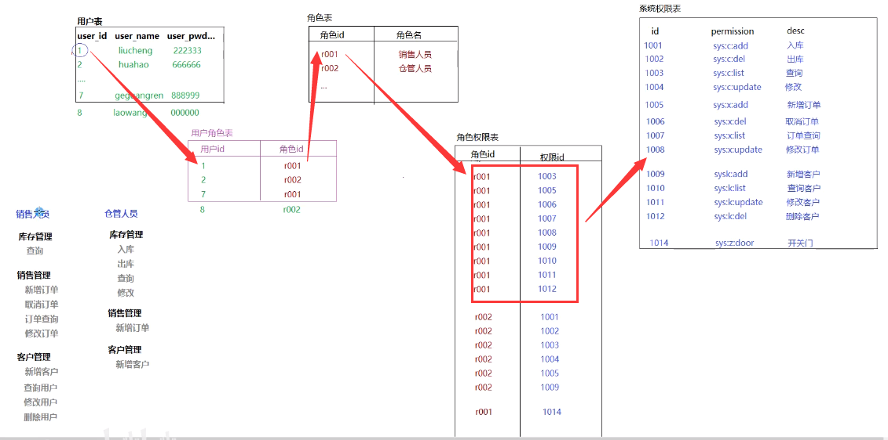
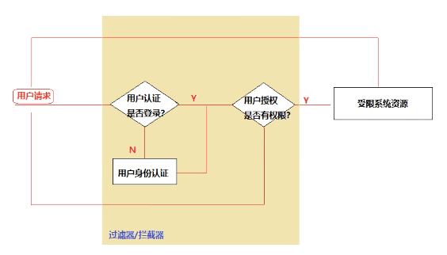

## 权限管理

- 基于主页的权限管理（不同用户使用不同的主页，权限通过主页功能菜单进行限制）

  适用于权限管理比较单一、用户少、每类用户权限固定

- 基于用户和权限的权限管理

  可以实现权限的动态分配，但是不够灵活

  

- 基于角色的权限管理（RBAC，Role-Based Access Control）

  

  该设计虽然确实灵活了一点但是还是不够灵活，比方说我现在1004这个权限不想给所有角色为r001的，而只是想给用户id为1的用户，这个时候就要再加一张表（用户权限表）用来将权限单独赋给某个用户

  **所以从这里可以看出来，随着要求增加，权限系统也要做相应扩展**

  

## Shiro

认证授权流程

- 认证：对用户的身份进行检查（登录验证）

- 授权：对用户的权限进行检查（是否有对应的操作权限）

- 流程示意图：

  

