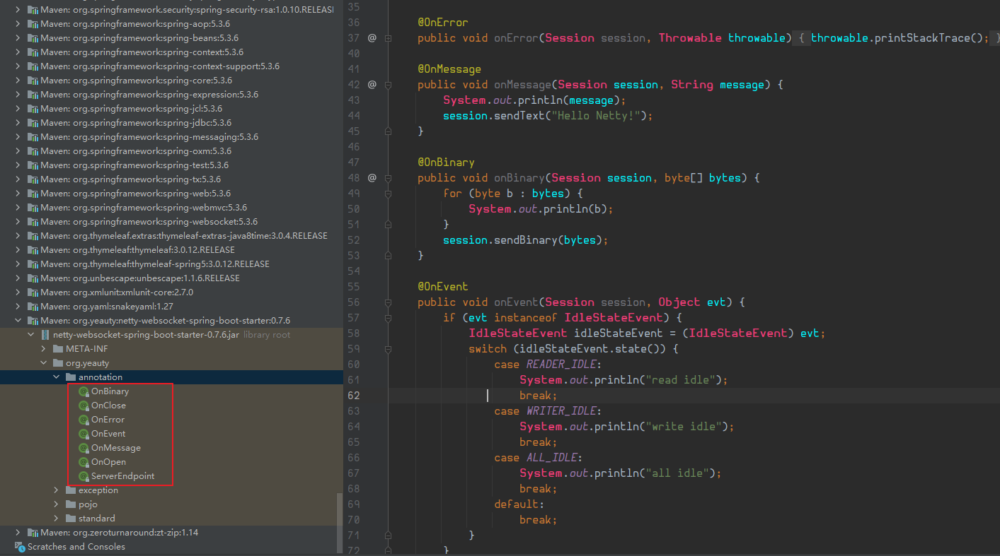

# Spring容器（含父子容器）的启动过程

参考：https://blog.csdn.net/f641385712/article/details/87883205（【小家Spring】Spring容器（含父子容器）的启动过程源码级别分析（含web.xml启动以及全注解驱动，和ContextLoader源码分析））

# Spring三级缓存

参考：https://blog.csdn.net/weixin_44181671/article/details/108630950（Spring中的“三级缓存”）、https://www.zhihu.com/question/445446018/answer/2379147054（spring为什么使用三级缓存而不是两级？）

# SpringMVC 9大组件

SpringMVC中的Servlet一共有三个层次，分别是HttpServletBean、FrameworkServlet和 DispatcherServlet。

- HttpServletBean直接继承自java的HttpServlet，其作用是将Servlet中配置的参数设置到相应的属性；
- FrameworkServlet初始化了WebApplicationContext；
- DispatcherServlet初始化了自身的9个组件；

参考：https://blog.csdn.net/hu_zhiting/article/details/73648939（【SpringMVC】9大组件概览）、https://blog.csdn.net/f641385712/article/details/87934909（【小家Spring】Spring MVC容器启动时，web九大组件初始化详解（Spring MVC的运行机制））

## HandlerMapping★

参考：https://blog.csdn.net/f641385712/article/details/89766065（【小家Spring】Spring MVC容器的web九大组件之---HandlerMapping源码详解(一)---BeanNameUrlHandlerMapping系列）、https://blog.csdn.net/f641385712/article/details/89810020（【小家Spring】Spring MVC容器的web九大组件之---HandlerMapping源码详解(二)---RequestMappingHandlerMapping系列）

### RequestMappingHandlerMapping

使用以下代码可以获取到所有url路径对应的控制器方法的详细信息：

```
RequestMappingHandlerMapping mapping = SpringUtil.getBean(RequestMappingHandlerMapping.class);
Map<RequestMappingInfo, HandlerMethod> handlerMethods = mapping.getHandlerMethods();
```

参考：https://www.cnblogs.com/minikobe/p/11233908.html（RequestMappingHandlerMapping详解）、[张润华`system-base`项目](https://github.com/pippichi/work/tree/master/zk/%E9%80%9A%E7%94%A8%E4%BC%98%E5%8C%96%E5%BC%80%E5%8F%91%E6%A1%86%E6%9E%B6/base/supcon-parent)

## HandlerAdapter

### RequestMappingHandlerAdapter

在[张润华`system-component-excel`项目](https://github.com/pippichi/work/tree/master/zk/%E9%80%9A%E7%94%A8%E4%BC%98%E5%8C%96%E5%BC%80%E5%8F%91%E6%A1%86%E6%9E%B6/base/supcon-parent)中发现它可以用于解释器的注册。

参考：https://blog.csdn.net/weixin_34007020/article/details/92608532（Spring MVC之RequestMappingHandlerAdapter详解）、[张润华`system-component-excel`项目](https://github.com/pippichi/work/tree/master/zk/%E9%80%9A%E7%94%A8%E4%BC%98%E5%8C%96%E5%BC%80%E5%8F%91%E6%A1%86%E6%9E%B6/base/supcon-parent)

## HandlerExceptionResolver

## ViewResolver

## RequestToViewNameTranslator

## LocaleResolver

## ThemeResolver

## MultipartResolver

## FlashMapManager

# Jackson

## @Transient

数据库不存该字段的值

1、直接将@Transient注解直接加在parentName属性上，数据库不会创建parent_name字段，查询也无法获取值；

2、将@Transient注解加在parentName属性的get方法上，数据库会创建parent_name字段，查询可以获取值；

3、将@Transient注解加在parentName属性的set方法上，数据库不会创建parent_name字段，查询可以获取值；

## @JsonProperty

设置字段别名

## @JsonValue

只序列化这个字段

注意一个实体中只能出现一次

## @JsonIgnoreProperties及其属性value

@JsonIgnoreProperties(value = {"xx1", "xx2"})

则序列化的时候字段xx1和xx2会被忽略

## @JsonIgnore

不序列化这个字段

## @Column及其属性columnDefinition

```java
@Column(name = "password", length = 255, columnDefinition = "VARCHAR(255) NOT NULL DEFAULT '' COMMENT '密码'")
```

## @ManyToOne与@JoinColumn

```java
@ManyToOne(cascade = {CascadeType.REMOVE})
@JoinColumn(name = "skill_id", foreignKey = @ForeignKey(name = "FK_Reference_48"), columnDefinition = "INT NOT NULL COMMENT '外键skill_id'")
```

## @Lob与@Basic

```java
@Lob
@Basic(fetch = FetchType.LAZY) // 由于是大文本，需要配合懒加载
```

## @JsonManagedReference与@JsonBackReference

这两个注解直接加在字段属性上面，注解内没有属性

@JsonBackReference和@JsonIgnore很相似，都可用于循环序列化时解决栈溢出的问题（比方说自关联或相互关联的情况）

但是当反序列化的时候@JsonIgnore是无法给关联的对象的字段赋值的，而@JsonBackReference和@JsonManagedReference联用之后就可以使得反序列化的时候给关联的对象的字段也赋值

## @JsonIdentifyInfo

这个注解加在类上面，注解内需指定属性值

@JsonIdentityInfo也可以解决父子之间的依赖关系，但是比上面介绍的两个注解更加的灵活，在@JsonBackReference和@JsonManagedReference两个注解中，我们自己明确类之间的父子关系，但是@JsonIdentityInfo是独立的，解决的是相互之间的依赖关系，没有父子之间的上下关系。

使用方法：

```java
@JsonIdentityInfo(property = "@id",generator = ObjectIdGenerators.IntSequenceGenerator.class) // IntSequenceGenerator用于生成@id的值为1、2、...
// 其中@id是新的唯一标识
效果：
{
  "@id" : 1,
  "name" : "boss",
  "department" : "cto",
  "employees" : [ {
    "@id" : 2,
    "name" : "employee1",
    "boss" : 1
  }, {
    "@id" : 3,
    "name" : "employee2",
    "boss" : 1
  } ]
}
```

```java
@JsonIdentityInfo(property = "name",generator = ObjectIdGenerators.PropertyGenerator.class) // 上面使用@id来唯一标识，现在我们可以利用PropertyGenerator来使用类已经存在的属性名来进行唯一标识
效果：
{
  "name" : "boss",
  "department" : "cto",
  "employees" : [ {
    "name" : "employee1",
    "boss" : "boss"
  }, {
    "name" : "employee2",
    "boss" : "boss"
  } ]
}
```

## @JsonFormat与@DateTimeFormat

@JsonFormat作用域在后端接收从前端传过来的参数以及从后端返回数据给前端的时候

举例：

```java
@JsonFormat(pattern = "yyyy-MM-dd HH:mm:ss", timezone = "GMT+8")
private LocalDateTime time; // 返回前端的time会被格式化，从前端接收的字符串类型的time会被自动转成LocalDateTime
```

```java
@JsonFormat(shape = JsonFormat.Shape.STRING)
private Long id;
```

@DateTimeFormat作用域在后端接收从前端传过来的参数的时候

举例：

```java
@DateTimeFormat(pattern = "yyyy-MM-dd HH:mm:ss")
private LocalDateTime time; // 从前端接收的字符串类型的time会被自动转成LocalDateTime
```

两者之间的差别请参考：https://blog.csdn.net/zhou520yue520/article/details/81348926（@DateTimeFormat注解 和 @JsonFormat注解）

## @JsonSerialize

参考：https://mp.baomidou.com/guide/faq.html#%E5%85%B3%E4%BA%8E-long-%E5%9E%8B%E4%B8%BB%E9%94%AE%E5%A1%AB%E5%85%85%E4%B8%8D%E7%94%9F%E6%95%88%E7%9A%84%E9%97%AE%E9%A2%98（ 关于 Long 型主键填充不生效的问题）

```java
@JsonSerialize(using= ToStringSerializer.class) // 可以将返回前端的字段自动转成string类型，避免js接到long型数据时精度丢失问题
private Long indexId;
```

## @JsonView

@JsonView可以过滤pojo的属性，使Controller在返回json时候，pojo某些属性不返回，比如User的密码，一般是不返回的，就可以使用这个注解

@JsonView使用方法：

- 使用接口来声明多个视图

- 在pojo的get方法上指定视图

- 在Controller方法上指定视图

参考：https://blog.csdn.net/qq_37659167/article/details/82960556（@JsonView的使用）

## @JsonInclude

参考：https://blog.csdn.net/weixin_44130081/article/details/89678450（Jackson中@JsonInclude注解详解）

# 请求参数注解

## @RequestParams

参考：https://blog.csdn.net/sswqzx/article/details/84195043（@RequestParam注解使用）、https://blog.csdn.net/a15028596338/article/details/84976223（@RequestParam和@PathVariable的用法与区别）

## @PathVariable

参考：https://blog.csdn.net/ckc_666/article/details/79239974（@PathVariable是什么？详情及用法解析）

# 常用注解（@Description、@Role等）

参考：https://blog.csdn.net/weixin_43745321/article/details/124959948（Spring Boot常用注解（绝对经典））

# 文件或图片上传大小限制

参考：https://blog.csdn.net/u014163312/article/details/119612117（SpringBoot限制文件或图片上传大小的配置方法）

# 判断上传文件的类型

参考：https://blog.csdn.net/paohui001lqp/article/details/113308831（SpringBoot中 判断上传的文件类型 MultipartFile file）、https://blog.csdn.net/x18707731829/article/details/109261718（SpringBoot上传文件类型检测）、https://blog.csdn.net/myfmyfmyfmyf/article/details/90230481（SpringBoot后端上传文件类型检测）

# MultipartFile转File

参考：https://blog.csdn.net/qq_42383970/article/details/120201524（MultipartFile转File的几种方式）

# MediaTypeFactory

参考：https://docs.spring.io/spring-framework/docs/current/javadoc-api/org/springframework/http/MediaTypeFactory.html（MediaTypeFactory (Spring Framework 6.0.11 API)）

# ProtoBuf

protocol buffers 是一种语言无关、平台无关、可扩展的序列化结构数据的方法，它可用于（数据）通信协议、数据存储等

参考：https://www.jianshu.com/p/a24c88c0526a（深入 ProtoBuf - 简介）、https://www.jianshu.com/p/73c9ed3a4877（深入 ProtoBuf - 编码）、https://www.jianshu.com/p/62f0238beec8（深入 ProtoBuf - 序列化源码解析）、https://www.jianshu.com/p/ddc1aaca3691（深入 ProtoBuf - 反射原理解析）

关于后端SpringBoot，前端nodejs整合ProtoBuf的方法请参考：https://blog.csdn.net/qq_42677329/article/details/114670100（springboot整合protobuf传输数据）

# 跨域解决之CorsFilter与WebMvcConfigurer

参考：https://blog.csdn.net/accept666/article/details/122611242（跨域解决之CorsFilter与WebMvcConfigurer篇）

# 加密

## Jasypt实现配置文件中密码字符串加密配置

我们可以编写加密解密工具：

```java
import org.jasypt.encryption.pbe.PooledPBEStringEncryptor;
import org.jasypt.encryption.pbe.config.SimpleStringPBEConfig;

public class JasyptUtil {
    /**
     * Jasypt生成加密结果
     * 
     * @param password 配置文件中设定的加密密
     * @param value 加密值
     * @return
     */
    public static String encyptPwd(String password, String value) {
        PooledPBEStringEncryptor encryptor = new PooledPBEStringEncryptor();
        encryptor.setConfig(cryptor(password));
        String result = encryptor.encrypt(value);
        return result;
    }

    /**
     * 解密
     * 
     * @param password 配置文件中设定的加密密码
     * @param value 解密密文
     * @return
     */
    public static String decyptPwd(String password, String value) {
        PooledPBEStringEncryptor encryptor = new PooledPBEStringEncryptor();
        encryptor.setConfig(cryptor(password));
        String result = encryptor.decrypt(value);
        return result;
    }

    public static SimpleStringPBEConfig cryptor(String password) {
        SimpleStringPBEConfig config = new SimpleStringPBEConfig();
        config.setPassword(password);
        config.setAlgorithm("PBEWithMD5AndDES");
        config.setKeyObtentionIterations("1000");
        config.setPoolSize("1");
        config.setProviderName("SunJCE");
        config.setSaltGeneratorClassName("org.jasypt.salt.RandomSaltGenerator");
        config.setStringOutputType("base64");
        return config;
    }

    // public static void main(String[] args) {
    // // 加密
    // System.out.println(encyptPwd("neusoft", "root1234"));
    // // 解密
    // System.out.println(decyptPwd("neusoft",
    // "VnCioJPCXOOPIOx5Aq9XuigNH6OuaOoz"));
    // }
}
```

修改配置文件

<font color="red">- spring.datasource.password=123456</font>

<font color="green">+ spring.datasource.password=ENC(VShsidDhfoasi&@#N%#@$#@SDoOidsaDaD144sSFWSEssQD)</font>

这里这个密文就是通过上面这个加密解密工具类生成的


之后配置加密私钥

<font color="green">+ jasypt.encryptor.password=xxx</font>

私钥自己定义就行


需要使用的地方调用工具类解密

```java
String password = ""; // 配置文件中的私钥
String pwd = ""; // 加密后的密文
JasyptUtil.decyptPwd(password, pwd)
```

# 使用EnvironmentPostProcessor自定义环境变量或者编写第三方扩展点

场景举例：mybatis-plus中对数据源敏感信息进行加密

参考：https://zhuanlan.zhihu.com/p/145271881（Spring Boot 配置文件加解密原理就这么简单）、https://blog.csdn.net/dong19891210/article/details/106436364（SpringBoot扩展点之EnvironmentPostProcessor）

# @RequestMapping

url路径还能这么写：

```java
@RequestMapping("/**") // **表示 路径 / 之后的所有内容都匹配
@RequestMapping("/xx/**") // **表示 路径 /xx/ 之后的所有内容都匹配
```

## 属性produces以及consumers

参考：https://blog.csdn.net/bingguang1993/article/details/82253639（RequestMapping中produces属性作用）、https://blog.csdn.net/gyfd123/article/details/121578581（SpingMVC的@RequestMapping注解属性）、https://www.dazhuanlan.com/liufeng126/topics/1534697（RequestMapping 属性解释）

# @Produces

作用类似`@RequestMapping中的属性produces`

参考：https://blog.csdn.net/shadowcw/article/details/88093081

# @ControllerAdvice

有三种应用场景

## 配合@ExceptionHandler实现全局异常处理

```java
// 加了下面这个注解，该类中定义的函数都会变成全局的。如果不加，那这些函数就只会在当前类有效
@ControllerAdvice
public class MyGlobalExceptionHandler {
    // 注意下面这个注解也可以不指定NullpointerException.class这个参数，如果什么参数都不指定，那他将自动进行映射
    @ExceptionHandler(NullpointerException.class)
    // 全局的NullpointerException都会被下面这个函数处理
    public ModelAndView customException(Exception e) {
        ModelAndView mv = new ModelAndView();
        mv.addObject("message", e.getMessage());
        mv.setViewName("myerror");
        return mv;
    }
    
    @ExceptionHandler(Exception.class)
    // 如果添加下面这个注解，则会在controller中接口调用发生Exception错误之后返回下面函数中定义的东西
    @ResponseBody
    public ModelAndView customException(Exception e) {
        ModelAndView mv = new ModelAndView();
        mv.addObject("message", e.getMessage());
        mv.setViewName("myerror");
        return mv;
    }
}
```


## 配合@ModelAttribute实现全局数据绑定

定义全局数据：

```java 
@ControllerAdvice
public class MyGlobalExceptionHandler {
    // 定义key为md，值为下面函数返回的map
    @ModelAttribute(name = "md")
    public Map<String,Object> mydata() {
        HashMap<String, Object> map = new HashMap<>();
        map.put("age", 99);
        map.put("gender", "男");
        return map;
    }
}
```

取出全局数据：

```java
@RestController
public class HelloController {
    @GetMapping("/hello")
    public String hello(Model model) {
        // 使用Model的asMap()取出全局的数据，这里不出意外应该会取出：md(key) --->  {"age": 99, "gender": "男"}(value)
        Map<String, Object> map = model.asMap();
        System.out.println(map);
        return "hello controller advice";
    }
}
```


参考：

https://blog.csdn.net/a20100997/article/details/131702638（ModelAttribute用法详解）

https://www.cnblogs.com/yourbatman/p/11361070.html（从原理层面掌握@ModelAttribute的使用（核心原理篇）【一起学Spring MVC】）


## @RequestAttribute、@SessionAttribute

参考：

https://blog.csdn.net/f641385712/article/details/98508272（从原理层面掌握@RequestAttribute、@SessionAttribute的使用【享学Spring MVC】）


## @SessionAttributes

参考：

https://blog.csdn.net/f641385712/article/details/98378045（从原理层面掌握@SessionAttributes的使用【享学Spring MVC】）


## 配合@InitBinder和全局数据预处理

@InitBinder 参考：

https://blog.csdn.net/wang0907/article/details/108357696（springMVC之@InitBinder的用法）、https://blog.csdn.net/qq_40837310/article/details/106984709（SpringMVC之@InitBinder注解详解）、https://www.cnblogs.com/better-farther-world2099/articles/10971897.html（Spring中@InitBinder注解的使用）


假设有两个实体类：

```java
public class Book {
    private String name;
    private Long price;
    //getter/setter
}
public class Author {
    private String name;
    private Integer age;
    //getter/setter
}
```

有一个controller需要同时传入上面两个实体类：

```java
@PostMapping("/book")
public void addBook(Book book, Author author) {
    ...
}
```

由于两个实体类都有name这个字段，因此需要进行区分

我们可以这么修改上面这个controller接口：

```java
@PostMapping("/book")
public void addBook(@ModelAttribute("b") Book book, @ModelAttribute("a") Author author) {
    ...
}
```

并且在@ControllerAdvice标记的类中添加如下代码：

```java
// @InitBinder("b") 注解表示该方法用来处理和Book和相关的参数,在方法中,给参数添加一个 b 前缀,即请求参数要有b前缀.
@InitBinder("b")
public void b(WebDataBinder binder) {
    binder.setFieldDefaultPrefix("b.");
}
@InitBinder("a")
public void a(WebDataBinder binder) {
    binder.setFieldDefaultPrefix("a.");
}
```

此时就需要这样发送请求了：

http://127.0.0.1:8080/book?b.name=三国演义&b.price=99&a.name=罗贯中&a.age=100

可以看到name字段非常自然的被区分开了

## 配合RequestBodyAdvice进行统一参数处理

参考：https://blog.csdn.net/xingbaozhen1210/article/details/98189562（SpringBoot使用RequestBodyAdvice进行统一参数处理）、https://blog.csdn.net/jsq6681993/article/details/119712621（RequestBodyAdvice用法详解-参数加解密示例）

如果不想重写RequestBodyAdvice中所有的接口方法，也可以继承spring提供的抽象类RequestBodyAdviceAdapter，按需实现让代码更简洁

## 配合ResponseBodyAdvice进行统一返回数据处理

参考：https://blog.csdn.net/u013887008/article/details/100183087（spring mvc之@ResponseBodyAdvice使用）

如果不想重写ResponseBodyAdvice中所有的接口方法，也可以继承spring提供的抽象类ResponseBodyAdviceAdapter，按需实现让代码更简洁

# @RestControllerAdvice

@RestControllerAdvice是一个组合注解，由@ControllerAdvice、@ResponseBody组成，而@ControllerAdvice继承了@Component，因此@RestControllerAdvice本质上是个Component，用于定义@ExceptionHandler，@InitBinder和@ModelAttribute方法，适用于所有使用@RequestMapping方法。

参考：https://blog.csdn.net/user2025/article/details/105458842（SpringBoot常用注解@RestControllerAdvice）、https://blog.csdn.net/jsq6681993/article/details/119712621（RequestBodyAdvice用法详解-参数加解密示例）

# Junit单元测试

## @Nested

测试类中嵌套测试类

## @DisplayName

更改测试的名称

## @BeforeAll

- 在当前类的所有测试方法之前执行。
- 注解在静态方法上。
- 此方法可以包含一些初始化代码。

## @AfterAll

- 在当前类中的所有测试方法之后执行。
- 注解在静态方法上。
- 此方法可以包含一些清理代码。

## @BeforeEach

- 在每个测试方法之前执行。
- 注解在非静态方法上。
- 可以重新初始化测试方法所需要使用的类的某些属性。

## @AfterEach

- 在每个测试方法之后执行。
- 注解在非静态方法上。
- 可以回滚测试方法引起的数据库修改。

## @SpringBootTest、@ExtendWith与@RunWith

@SpringBootTest顾名思义涉及到Spring框架

@ExtendWith可以不涉及Spring框架，且相较于@SpringBootTest会更“轻”一些

@RunWith被@ExtendWith替代了，不推荐使用

参考：https://www.cnblogs.com/pass-ion/p/15064785.html（单元测试 注入方法 @ExtendWith与@RunWith）

## @ContextConfiguration

参考：

https://blog.csdn.net/ll1042668699/article/details/128069286（@ExtendWith、@ContextConfiguration）

https://blog.csdn.net/m0_37941483/article/details/90727830（Spring系列——@ContextConfiguration注解的使用）

# 注入与上下文环境

## @Value

参考：https://blog.csdn.net/woheniccc/article/details/79804600（spring的@Value注解使用）


注入默认值：

参考：https://blog.csdn.net/li02112017/article/details/118912109（SpringBoot中@Value注解设置默认值）


Bean字段注入等更多注入方式：

参考：

https://blog.csdn.net/weixin_43888891/article/details/127505506（@Value的复杂用法）

https://blog.csdn.net/cxyxysam/article/details/135394386（【SpringBoot 基础系列】@Value 中哪些你不知道的知识点）


## @Bean(initMethod = "init",destroyMethod = "destroy")

参考：https://blog.csdn.net/LiZhen314/article/details/123002611（Spring 框架Bean的初始化和销毁 ---方式： @Bean(initMethod = “init“,destroyMethod = “destroy“)）

## @Configuration

参考：https://blog.csdn.net/yunxing323/article/details/108655250（@Configuration(proxyBeanMethods = false) 详解）

## @Repository

参考：https://blog.csdn.net/wqh0830/article/details/96109587（@Repository注解的作用）、https://blog.csdn.net/qq_44421399/article/details/109825479（@Repository 与 @Mapper的区别）

## @Import注入类

原本我们在一个类中注入另一个类都是通过先new再注入的，现在可以使用该注解直接注入而不需要new。详见《Spring实战》P61。

利用这个注入的特性，我们还可以通过在某个更加高级的类上面标注@Import({xxx.class, xxx.class}) 来拼装类。详见《Spring实战》P62。

### ImportSelector动态加载功能类

参考：https://blog.csdn.net/Smallc0de/article/details/108619562（Spring框架的ImportSelector到底可以干嘛）、https://www.cnblogs.com/niechen/p/9262452.html（深入理解Spring的ImportSelector接口）、https://www.cnblogs.com/niechen/p/9027804.html（深入理解SpringBoot之自动装配）

## @ImportResource

参考：https://blog.csdn.net/weixin_44893467/article/details/107106180（@ImportResource()注解的使用）

## @NestedConfigurationProperty

参考：https://blog.csdn.net/u013541707/article/details/113193128（简单分析@NestedConfigurationProperty的作用）、https://blog.csdn.net/hua_ming/article/details/108624157（@NestedConfigurationProperty注解使用场景）

## Spring容器获取Bean的9种方式总结

**Spring中的IOC容器：**

在Spring中，Bean的实例化、定位、配置应用程序中的对象及建立对象间的依赖关系，都是在IoC容器中进行的。因此，要在Spring中获取Bean，本质上就是从IoC容器当中获取Bean。

在Spring中，BeanFactory是IoC容器的实际代表者，该接口提供了IoC容器最基本功能。同时，Spring还提供了另外一种类型的容器：ApplicationContext容器。

ApplicationContext容器包括BeanFactory容器的所有功能（BeanFactory的子接口），提供了更多面向应用的功能，它提供了国际化支持和框架事件体系，更易于创建实际应用。

一般情况，我们称BeanFactory为IoC容器，称ApplicationContext为应用上下文。但有时为了方便，也将ApplicationContext称为Spring容器。

通常不建议使用BeanFactory，但BeanFactory 仍然可以用于轻量级的应用程序，如移动设备或基于applet的应用程序，其中它的数据量和速度是显著。


**BeanFactory与ApplicationContext的区别：**

BeanFactory是Spring框架的基础设施，面向Spring本身。ApplicationContext则面向使用Spring框架的开发者，几乎所有的应用场景都可以直接使用ApplicationContext，而非底层的BeanFactory。

另外，ApplicationContext的初始化和BeanFactory有一个重大的区别：

BeanFactory在初始化容器时，并未实例化Bean，直到第一次访问某个Bean时才实例目标Bean。这样，我们就不能发现一些存在的Spring的配置问题。如果Bean的某一个属性没有注入，BeanFacotry加载后，直至第一次使用调用getBean方法才会抛出异常。

而ApplicationContext则在初始化应用上下文时就实例化所有单实例的Bean，相对应的，ApplicationContext的初始化时间会比BeanFactory长一些。

了解了上述的基本理论知识之后，我们就可以尝试从IoC容器当中获取Bean对象了。


**9种获取Bean方案：**

- 通过BeanFactory获取

- 通过BeanFactoryAware获取

- 启动获取ApplicationContext

  ApplicationContext可以干很多事情，比如遍历扫描容器中所有的Bean

  参考：https://blog.csdn.net/yangye1225/article/details/79525713（ApplicationContext介绍）

- 通过继承ApplicationObjectSupport

- 通过继承WebApplicationObjectSupport

- 通过WebApplicationContextUtils

- 通过ApplicationContextAware

  参考：https://www.cnblogs.com/loong-hon/p/10917755.html（ApplicationContextAware接口的作用）

- 通过ContextLoader

- 通过BeanFactoryPostProcessor

参考：https://juejin.cn/post/7215454015726518330（Spring容器获取Bean的9种方式）


## BeanFactory和FactoryBean和ObjectFactory

参考：

https://blog.csdn.net/qiesheng/article/details/72875315（spring中BeanFactory和FactoryBean的区别）、https://blog.csdn.net/zknxx/article/details/79572387（Spring系列之FactoryBean（一））、https://blog.csdn.net/qq_36688143/article/details/84968036（Spring源码解析：BeanFactory深入理解）

https://blog.csdn.net/hong10086/article/details/84583731（spring中的FactoryBean与ObjectFactory的区别）

## AutowireCapableBeanFactory对容器外的Bean进行依赖注入

参考：https://www.jianshu.com/p/14dd69b5c516、https://blog.csdn.net/qq_36838191/article/details/80702608

## AutowireCapableBeanFactory

以下是一段spring的applicationContext中的代码：

```java
/**
* Expose AutowireCapableBeanFactory functionality for this context.
* <p>This is not typically used by application code, except for the purpose
* of initializing bean instances that live outside the application context,
* applying the Spring bean lifecycle (fully or partly) to them.
* <p>Alternatively, the internal BeanFactory exposed by the
* {@link ConfigurableApplicationContext} interface offers access to the
* AutowireCapableBeanFactory interface too. The present method mainly
* serves as convenient, specific facility on the ApplicationContext
* interface itself.
* @return the AutowireCapableBeanFactory for this context
* @throws IllegalStateException if the context does not support
* the AutowireCapableBeanFactory interface or does not hold an autowire-capable
* bean factory yet (usually if {@code refresh()} has never been called)
* @see ConfigurableApplicationContext#refresh()
* @see ConfigurableApplicationContext#getBeanFactory()
*/
AutowireCapableBeanFactory getAutowireCapableBeanFactory() throws IllegalStateException;
```

这里说的意思就是通过getAutowireCapableBeanFactory这个方法将 AutowireCapableBeanFactory这个接口暴露给外部使用， AutowireCapableBeanFactory这个接口一般在applicationContext的内部是较少使用的，它的功能主要是为了装配applicationContext管理之外的Bean。

另一段是AutowireCapableBeanFactory接口中的源码：

```java
/**
* Autowire the bean properties of the given bean instance by name or type.
* Can also be invoked with {@code AUTOWIRE_NO} in order to just apply
* after-instantiation callbacks (e.g. for annotation-driven injection).
* <p>Does <i>not</i> apply standard {@link BeanPostProcessor BeanPostProcessors}
* callbacks or perform any further initialization of the bean. This interface
* offers distinct, fine-grained operations for those purposes, for example
* {@link #initializeBean}. However, {@link InstantiationAwareBeanPostProcessor}
* callbacks are applied, if applicable to the configuration of the instance.
* @param existingBean the existing bean instance
* @param autowireMode by name or type, using the constants in this interface
* @param dependencyCheck whether to perform a dependency check for object
* references in the bean instance
* @throws BeansException if wiring failed
* @see #AUTOWIRE_BY_NAME
* @see #AUTOWIRE_BY_TYPE
* @see #AUTOWIRE_NO
*/
void autowireBeanProperties(Object existingBean, int autowireMode, boolean dependencyCheck) throws BeansException;
```

这个方法的作用就是将传入的第一个参数按照spring中按name或者按type装备的方法将传入的Bean的各个properties给装配上。

总结来讲：

```
	对于想要拥有自动装配能力，并且想把这种能力暴露给外部应用的BeanFactory类需要实现此接口。 
	正常情况下，不要使用此接口，应该更倾向于使用BeanFactory或者ListableBeanFactory接口。此接口主要是针对框架之外，没有向Spring托管Bean的应用。通过暴露此功能，Spring框架之外的程序，具有自动装配等Spring的功能。 
	需要注意的是，ApplicationContext接口并没有实现此接口，因为应用代码很少用到此功能，如果确实需要的话，可以调用ApplicationContext的getAutowireCapableBeanFactory方法，来获取此接口的实例。 
	如果一个类实现了此接口，那么很大程度上它还需要实现BeanFactoryAware接口。它可以在应用上下文中返回BeanFactory。
```

示例：

```java
@Component
public class JobFactory extends AdaptableJobFactory {

    @Autowired
    private AutowireCapableBeanFactory  capableBeanFactory;

    @Override
    protected Object createJobInstance(final TriggerFiredBundle bundle) throws Exception {
        // 调用父类的方法
        Object jobInstance = super.createJobInstance(bundle);
        // 进行注入
        capableBeanFactory.autowireBean(jobInstance);
        return jobInstance;
    }
}
```

## SpringBoot使用AspectJ（CTW）下不能注入SpringIOC容器中的Bean的解决方案

参考：https://blog.csdn.net/weixin_43697006/article/details/105289423

## AnnotationConfigApplicationContext获取配置类中注入的Bean

示例：

首先创建Person类：

```java
@Data
public class Person {
    private String name;
    private Integer age;
}
```

创建BeanConfig类，用于配置两个Person实例并注入：

```java
@Configuration
public class BeanConfig {
    @Bean(name = "bill")
    public Person person1() {
        return new Person("Bill Gates", 62);
    }
    @Bean(name = "linus")
    public Person person2() {
        return new Person("Linus", 48);
    }
}
```

接着写一个测试类进行验证这两个Bean是否注入成功：

```java
public class ConditionalTest {
    AnnotationConfigApplicationContext applicationContext = new AnnotationConfigApplicationContext(BeanConfig.class);
    @Test
    public void test1() {
        Map<String, Person> map = applicationContext.getBeansOfType(Person.class);
        System.out.println(map);
    }
}
```

输出结果：


## @Conditional条件注入

参考：https://blog.csdn.net/xcy1193068639/article/details/81491071

## @Autowired和lombok的@RequiredArgsConstructor

@RequiredArgsConstructor可以代替@Autowired

参考：https://blog.csdn.net/qq_37256896/article/details/115869717（注解 @RequiredArgsConstructor）

## @Autowired将多个Bean注入到集合中

参考：https://blog.csdn.net/inrgihc/article/details/104742206（SpringBoot中 使用@Autowired 将bean注入到List或Map等集合中）

## 后定义的bean覆盖之前相同名称的bean（`spring.main.allow-bean-definition-overriding`）

参考：https://blog.csdn.net/liubenlong007/article/details/87885567（spring中 allowBeanDefinitionOverriding分析）

## ObjectProvider★

正常情况下会向容器中注入一个Bean；特殊情况下，无法注入Bean（0个Bean）或注入了多个Bean，此时ObjectProvider就发挥作用了。

参考：https://blog.csdn.net/asdfsadfasdfsa/article/details/114219540（ObjectProvider使用）

## ImportBeanDefinitionRegistrar动态注册bean

参考：https://blog.csdn.net/Smallc0de/article/details/108647079（Spring框架中ImportBeanDefinitionRegistrar的应用）、https://www.logicbig.com/tutorials/spring-framework/spring-core/import-bean-registrar.html（Spring - Using ImportBeanDefinitionRegistrar）

## AutowireMode（注入的另一种方式）

AutowireMode注入有以下4种模式：

- AutowireCapableBeanFactory.AUTOWIRE_NO

- AutowireCapableBeanFactory.AUTOWIRE_BY_NAME
- AutowireCapableBeanFactory.AUTOWIRE_BY_TYPE
- AutowireCapableBeanFactory.AUTOWIRE_CONSTRUCTOR

参考：https://blog.csdn.net/z69183787/article/details/104545466（Spring Bean注入的另一种方式-AutowireMode的一些理解）、https://blog.csdn.net/qq_27409289/article/details/100753656（Spring中bean的AutowireMode(自动装配模型)和自动装配技术）

## ConfigurationClassParser★

參考：

SpringBoot、OpenFeign源码

https://blog.csdn.net/qq_33513289/article/details/140241940（ConfigurationClassParser）

https://blog.csdn.net/zhengguofeng0328/article/details/125832447（SpringBoot自动装配原理分析二：执行的时机ConfigurationClassParser）

## ClassPathScanningCandidateComponentProvider★

參考：

SpringBoot、OpenFeign源码

https://blog.csdn.net/weixin_42594143/article/details/134711010（ClassPathScanningCandidateComponentProvider）

## PathMatchingResourcePatternResolver★

參考：

b站Spring教程

https://blog.csdn.net/wang_j_p/article/details/113096263（PathMatchingResourcePatternResolver Spring）

## MetadataReaderFactory、CachingMetadataReaderFactory、CachingMetadataReaderFactoryPostProcessor★

參考：

b站Spring教程

https://blog.csdn.net/m0_37642711/article/details/140853395（元数据读取工厂CachingMetadataReaderFactory）

https://vimsky.com/examples/detail/java-class-org.springframework.core.type.classreading.CachingMetadataReaderFactory.html（Java CachingMetadataReaderFactory类代码示例）

https://blog.csdn.net/u012855229/article/details/136779689（【Spring Boot 源码学习】共享 MetadataReaderFactory 上下文初始化器）

# Lombok

## @Builder

参考：https://blog.csdn.net/qq_39249094/article/details/120881578（lombok 基础注解之 @Builder）、https://www.jianshu.com/p/d08e255312f9（详解Lombok中的@Builder用法）

## @Singular

参考：https://blog.csdn.net/qq_39249094/article/details/121074162（lombok 基础注解之 @Singular）、https://blog.csdn.net/qq_44309181/article/details/118671767（lombok @Singular）、https://blog.csdn.net/itguangit/article/details/112604486（使用 Lombok @Singular 注解需要注意的 BUG）

# SpringData

参考：https://blog.csdn.net/qq_28289405/article/details/82382441（spring data 简介（一））

## MongoDB

自定义字段填充，为公共字段填充提供便利：

```
// 1.实现元数据处理器
@Component
public class MongoTimeMetaObjectHandler implements MongoMetaObjectHandler {
    @Override
    public void insertFill(MetaObject metaObject) {
        metaObject.insertFill("createTime", LocalDateTime.now());
    }
    @Override
    public void updateFill(MetaObject metaObject) {
        metaObject.updateFill("updateTime", LocalDateTime.now());
    }
}
// 2.添加注解
@Data
public class Test {
    private String name;
    @TableField(fill = FieldFill.INSERT)
    private LocalDateTime createTime;
    @TableField(fill = FieldFill.UPDATE)
    private LocalDateTime updateTime;
}
```

注意：如果编写元数据处理器，但未添加`@TableField`的`fill`属性，或填充策略行为不对（需要在插入时进行填充的字段，填充策略写为`FieldFill.UPDATE`），都将导致无法进行属性值注入。


AbstractMongoEventListener与onBeforeConvert、onBeforeSave：

参考：https://www.jianshu.com/p/82c67509ba79（Springboot MongoDB CRUD（一））


mongodb数据源配置与AbstractMongoClientConfiguration：

参考：https://www.jianshu.com/p/82c67509ba79（Springboot MongoDB CRUD（一））


@CustomerId [自定义 ID 生成策略]（需配合监听器实现）：

参考：https://www.jianshu.com/p/82c67509ba79（Springboot MongoDB CRUD（一））


Criteria、Update类、UpdateResult：

参考：[张润华`sup-spring-boot-starter-mongo`项目](https://github.com/pippichi/work/tree/master/zk/%E9%80%9A%E7%94%A8%E4%BC%98%E5%8C%96%E5%BC%80%E5%8F%91%E6%A1%86%E6%9E%B6/base/supcon-parent)

# 静态文件存储位置

在IDEA中双击“shift”将“CLASSPATH_RESOURCE_LOCATIONS”复制进去就可以看到：

```java
private static final String[] CLASSPATH_RESOURCE_LOCATIONS = new String[]{
    "classpath:/META-INF/resources/", 
    "classpath:/resources/", 
    "classpath:/static/", 
    "classpath:/public/"
};
```

# @Lazy

@Lazy可以解决循环依赖，同时也可以实现延迟加载

用法：

- @Lazy(value = false)

  如果是false，这个注解加了跟没加一样，对象不使用延迟加载，会在Spring启动的时候，或者说初始化的时候就直接创建

- @Lazy(value = true)

  使用延迟加载，在Spring启动的时候延迟加载bean，即在调用某个bean的时候再去初始化

  降低了springIOC容器启动的加载时间，也可以解决循环依赖问题

注意，新版springboot只需要setter注入（不要构造器注入）就能自动解决循环依赖

# @Async与SpringBoot线程池配置

具体看张润华的`supcon-parent`

**@Async与线程池搭配使用：**

```java
@Async("taskExecutorName") // 注意：如果不指定要使用的线程池名，比如直接这么用：@Async，那么在执行异步任务的时候spring是直接new一个thread去执行的
```

注意：@Async默认是用无界LinkedBlockingQueue，需要在配置文件里去设置一下大小，不然容易内存溢出：

```yaml
spring:
  # @Async默认是用无界LinkedBlockingQueue，需要在配置文件里去设置一下大小，不然容易内存溢出
  task:
    execution:
      pool:
        queue-capacity: 100
```

## 线程池拒绝策略

参考：https://blog.csdn.net/dyc87112/article/details/120434537（Spring Boot中如何配置线程池拒绝策略，妥善处理好溢出的任务）

**自定义线程池拒绝策略：**

参考：https://blog.csdn.net/jgteng/article/details/54411423（线程池的RejectedExecutionHandler（拒绝策略））

# 单点登录

参考：https://blog.csdn.net/weixin_43214644/article/details/124142708（什么是单点登录）、https://blog.csdn.net/qq_41913971/article/details/122609233（单点登录（SSO））、https://blog.csdn.net/weixin_45908458/article/details/109553893（单点登录、JWT和OAuth2）、https://blog.csdn.net/qq_42296117/article/details/107677950（OAuth2与JWT（单点登录））、https://blog.csdn.net/m0_37122623/article/details/114091913（Oauth2.0 + JWT 实现单点登录）

# SpringCloud+Spring Security+OAuth2 + JWT + Gateway

参考：https://blog.csdn.net/lbjfish/article/details/109187316（SpringCloud+Spring Security+OAuth2 + JWT + Gateway讲解）

# 被弃用的WebSecurityConfigurerAdapter及其替代方案：SecurityFilterChain、WebSecurityCustomizer、JdbcUserDetailsManager、InMemoryUserDetailsManager、EmbeddedLdapServerContextSourceFactoryBean与AuthenticationManager

参考：https://blog.csdn.net/OLinOne/article/details/128100367（Spring Security 5.7.0弃用 WebSecurityConfigurerAdapter）、https://blog.csdn.net/lazy_LYF/article/details/127284459（WebSecurityConfigurerAdapter已弃用）

## 基于方法的动态权限（@EnableGlobalMethodSecurity与@PreAuthorize）；

参考：https://juejin.cn/post/7106300827035238407（别再用过时的方式了！全新版本Spring Security，这样用才够优雅！）

## 基于路径的动态权限（AbstractSecurityInterceptor、Filter接口与AccessDecisionManager接口）

AccessDecisionManager接口可用于创建自定义权限控制管理器

参考：https://juejin.cn/post/7106300827035238407（别再用过时的方式了！全新版本Spring Security，这样用才够优雅！）、https://blog.csdn.net/weixin_44516305/article/details/88868791（Spring Security用户认证和权限控制（自定义实现））

# TokenEndpoint、Token授权TokenGranter接口

参考：https://blog.csdn.net/hou_ge/article/details/122341774（SpringSecurity OAuth2 获取Token端点TokenEndpoint、Token授权TokenGranter接口 详解）、[张润华`system-auth`项目](https://github.com/pippichi/work/tree/master/zk/%E9%80%9A%E7%94%A8%E4%BC%98%E5%8C%96%E5%BC%80%E5%8F%91%E6%A1%86%E6%9E%B6/base/supcon-parent)

# TokenEnhancer、JwtAccessConverter与TokenEnhancerChain向jwt中添加额外信息

参考：https://blog.csdn.net/cauchy6317/article/details/85123018（Spring Security Oauth2 中实现TokenEnhancer向jwt中添加额外信息）、https://blog.csdn.net/qq_42654484/article/details/95216037（Springsceurity使用TokenEnhancer和JwtAccessConverter增强jwt令牌原理）、[张润华`system-auth`项目](https://github.com/pippichi/work/tree/master/zk/%E9%80%9A%E7%94%A8%E4%BC%98%E5%8C%96%E5%BC%80%E5%8F%91%E6%A1%86%E6%9E%B6/base/supcon-parent)

# AuthorizationServer配置、AuthorizationServerConfigurerAdapter

参考：https://blog.csdn.net/silmeweed/article/details/101603227（Oauth2---AuthorizationServer配置）、https://blog.csdn.net/hurley11/article/details/110868018（oauth2.0的配置信息AuthorizationServerConfigurerAdapter）、[张润华`system-auth`项目](https://github.com/pippichi/work/tree/master/zk/%E9%80%9A%E7%94%A8%E4%BC%98%E5%8C%96%E5%BC%80%E5%8F%91%E6%A1%86%E6%9E%B6/base/supcon-parent)

# KeyPair与KeyStoreKeyFactory、KeyPairGenerator与jks证书

KeyStoreKeyFactory可从本地证书文件中获取密钥，参考：[张润华`system-auth`项目](https://github.com/pippichi/work/tree/master/zk/%E9%80%9A%E7%94%A8%E4%BC%98%E5%8C%96%E5%BC%80%E5%8F%91%E6%A1%86%E6%9E%B6/base/supcon-parent)

KeyPairGenerator可生成RSA密钥对，参考：https://blog.csdn.net/kzcming/article/details/115205299（java 根据 KeyPairGenerator对象生成RSA密钥对,并进行测试）

如何生成jks证书文件？参考：https://blog.csdn.net/XXX1238XGH/article/details/122278255（如何生成jks证书文件）

如何使用jks证书文件？参考：[张润华`system-auth`项目](https://github.com/pippichi/work/tree/master/zk/%E9%80%9A%E7%94%A8%E4%BC%98%E5%8C%96%E5%BC%80%E5%8F%91%E6%A1%86%E6%9E%B6/base/supcon-parent)

# RSA加密解密

参考：https://blog.csdn.net/qq_35605213/article/details/80591869（RSA加密解密，String转PublicKey、PrivateKey；附Base64.JAR）

# Spring Security密码解析器PasswordEncoder接口及其实现类BCryptPasswordEncoder详解

参考：https://blog.csdn.net/qq_31960623/article/details/118397707（PasswordEncoder详解）、[张润华`system-manager`项目](https://github.com/pippichi/work/tree/master/zk/%E9%80%9A%E7%94%A8%E4%BC%98%E5%8C%96%E5%BC%80%E5%8F%91%E6%A1%86%E6%9E%B6/base/supcon-parent)

# HttpSession

参考：https://blog.csdn.net/hcz666/article/details/108916119（HttpSession详解(简称session)）

# 过滤器Filter

具体信息请查阅网络资料

- OncePerRequestFilter

  每次请求的最开始都会执行这个过滤，适合做权限认证

Filter有三种配置方式：

- 直接用@WebFilter注解修饰实现类（@WebFilter和@ServletComponentScan这两个注解必须连用）
- 直接用@Component或@Configuration标注Filter实现类，则可做到全url过滤（如果同时还标注了@WebFilter，则还可对自定义url做过滤，参考：https://blog.csdn.net/qq_27610647/article/details/88909586（Springboot的Filter使用(对指定路径过滤和所有路径过滤)））
- 不使用@ServletComponentScan注解时需要通过FilterRegistrationBean将Filter注入

- 通过`web.xml`方式配置

参考：https://blog.csdn.net/u011066470/article/details/115376422（springboot的filter过滤器的使用）


通过filter获取request和response中的数据：

参考：https://blog.csdn.net/hopelgl/article/details/105827898（springboot利用filter获取request和response中的数据）


过滤器、拦截器的区别：

参考：https://blog.csdn.net/JokerLJG/article/details/121538821（spring过滤器、拦截器）

# 拦截器Interceptor

具体信息请查阅网络资料

- HandlerInterceptor和MethodInterceptor

  1、HandlerInterceptor是springMVC项目中的拦截器，它拦截的目标是请求的地址，比MethodInterceptor先执行；

  2、MethodInterceptor是AOP项目中的拦截器，它拦截的目标是方法，即使不是controller中的方法；

  参考：https://blog.csdn.net/WX5991/article/details/122230962（Spring中的拦截器）、https://blog.csdn.net/WX5991/article/details/122179177（Spring boot中通过Aop和拦截器实现自定义注解）、https://blog.csdn.net/u013905744/article/details/91364736（使用spring的MethodInterceptor实现aop功能的三种方式）

# 监听器Listener

具体信息请查阅网络资料

Listener顾名思义就是监听的意思，作用就是监听程序中的一些变化，并根据其做出一些相应的响应。通俗的语言就是在session、request、application三个对象创建消亡或者往其中进行修改增加删除属性时自动执行代码的功能组件。

Listener监听器主要是实现了`javax.servlet.ServletContextListener`接口的服务器端程序，它跟过滤器一样随web应用启动而启动，只需要初始化一次，以后都可以进行监听。一般主要用于ServletContext、HttpSession、HttpServletSession这三个对象中的属性变更信息事件监听

使用Listener方式：

- 通过实现具体接口创建实现类（可实现多个监听器接口）

- 配置实现类成为监听器，有三种配置方式：

  - 直接用@WebListener注解修饰实现类（@WebListener和@ServletComponentScan这两个注解必须连用）
  - 不使用@ServletComponentScan注解时需要通过ServletListenerRegistrationBean将Listener注入

  - 通过`web.xml`方式配置

    ```xml
    <listener>
    	<listener-class>com.zrgk.listener.MyListener</listener-class>
    </listener>
    ```

Spring有各种Listener，如ServletRequestListener、ServletRequestAttributeListener、HttpSessionListener、ServletContextListener、ServletContextAttributeListener、IntrospectorCleanupListener、Log4jConfigListener、WebAppRootListener、ContextLoaderListener、RequestContextListener等

参考：https://blog.csdn.net/vicroad2014/article/details/82463643（Spring的各种Listener）

## ApplicationListener

ApplicationContext事件机制是观察者设计模式的实现，通过ApplicationEvent类和ApplicationListener接口，可以实现ApplicationContext事件处理。

如果容器中有一个ApplicationListener Bean，每当ApplicationContext发布ApplicationEvent时，ApplicationListener Bean将自动被触发。这种事件机制都必须需要程序显示的触发。

其中spring有一些内置的事件，当完成某种操作时会发出某些事件动作。比如监听ContextRefreshedEvent事件，当所有的bean都初始化完成并被成功装载后会触发该事件，实现`ApplicationListener<ContextRefreshedEvent>`接口可以收到监听动作，然后可以写自己的逻辑。

同样事件可以自定义、监听也可以自定义，完全根据自己的业务逻辑来处理。

参考：https://www.cnblogs.com/wwjj4811/p/14540493.html（ApplicationListener用法及原理）、https://blog.csdn.net/liyantianmin/article/details/81017960（理解 Spring ApplicationListener）

## @EventListener

参考：https://blog.csdn.net/zxh1991811/article/details/109737845（Spring listener——Spring boot实现监听器的两种方式）

# 事件Event

事件和直接方法调用的区别：使用方法调用，必须知道在什么情况下在哪个地方调用方法；使用事件，只需要知道发生了某个事件，哪些模块会被通知并不是我们关心的问题，当我们想要将某些业务处理传递给另一个线程时（例如：在某些任务完成时发送电子邮件），最好使用事件。此外，事件对于测试驱动的开发也很有用。

除了可以自定义事件之外，Spring还提供了一些内置事件：

- ContextRefreshedEvent

  ApplicationContext 被初始化或刷新时，该事件被发布。这也可以在 ConfigurableApplicationContext接口中使用 refresh() 方法来发生。此处的初始化是指：所有的Bean被成功装载，后处理Bean被检测并激活，所有Singleton Bean 被预实例化，ApplicationContext容器已就绪可用

- ContextStartedEvent

  当使用 ConfigurableApplicationContext （ApplicationContext子接口）接口中的 start() 方法启动 ApplicationContext 时，该事件被发布。你可以调查你的数据库，或者你可以在接受到这个事件后重启任何停止的应用程序

- ContextStoppedEvent

  当使用 ConfigurableApplicationContext 接口中的 stop() 停止 ApplicationContext 时，发布这个事件。你可以在接受到这个事件后做必要的清理的工作

- ContextClosedEvent

  当使用 ConfigurableApplicationContext 接口中的 close() 方法关闭 ApplicationContext 时，该事件被发布。一个已关闭的上下文到达生命周期末端；它不能被刷新或重启

- RequestHandledEvent

  这是一个 web-specific 事件，告诉所有 bean HTTP 请求已经被服务。只能应用于使用DispatcherServlet的Web应用。在使用Spring作为前端的MVC控制器时，当Spring处理用户请求结束后，系统会自动触发该事件

参考：https://blog.csdn.net/agonie201218/article/details/124556232（事件机制）

## ApplicationEvent 事件与监听器（钩子函数）

一、当一个Application运行时，会发送如下事件：

1. ApplicationStartingEvent
   运行run在注册完监听器与初始化器后，处理其他前触发。（测试的时候发现监听不到这个事件，暂时还不知道原因）
2. ApplicationEnvironmentPreparedEvent
   当Environment已经准备好，在context 创建前。
3. ApplicationContextInitializedEvent
   在ApplicationContext 创建和ApplicationContextInitializer都被调用后，但是bean definition没有被加载前。
4. ApplicationPreparedEvent
   bean definition已经加载，但是没有refresh。
5. ApplicationStartedEvent
   context 已经被refresh， 但是application 和command-line 的runner都没有被调用。
6. AvailabilityChangeEvent
   带上LivenessState.CORRECT标志，标识应用是活的。
7. ApplicationReadyEvent
   application 和command-line 的runner都被调用后。
8. AvailabilityChangeEvent
   带上ReadinessState.ACCEPTING_TRAFFIC标志，标识应用可以提供服务。
9. ApplicationFailedEvent
   启动过程中，抛异常了。

另外还在如下事件在ApplicationPreparedEvent 之后和ApplicationStartedEvent之前发送：

1. WebServerInitializedEvent
   WebServer已经准备好
   1.1 ServletWebServerInitializedEvent
   servlet 准备好
   1.2 ReactiveWebServerInitializedEvent
   reactive 准备好
2. ContextRefreshedEvent
   ApplicationContext已经refresh。

二、项目启动后需要执行操作：

1. 实现`ApplicationListener<E extends ApplicationEvent>`接口

2. ApplicationEvent的子类可以是ApplicationReadyEvent或者ContextRefreshedEvent

3. ApplicationReadyEvent的示例

   ```java
   @Component
   @Slf4j
   public class ApplicationInit implements ApplicationListener<ApplicationReadyEvent> {
       
       // 项目启动后预热JSON
       @Override
       public void onApplicationEvent(ApplicationReadyEvent applicationReadyEvent) {
           UserInfo userInfo = new UserInfo();
           userInfo.setId(123L);
           userInfo.setChannel("hello");
           String userJson = JSON.toJSONString(userInfo);
           JSON.parseObject(userJson, UserInfo.class);
       }
   }
   ```

三、ContextRefreshedEvent多次执行的问题

1. web应用会出现父子容器，这样就会触发两次

2. 解决方法：`ApplicationListener<ContextRefreshedEvent>` 应该和 ApplicationContext 一对一


参考：https://www.cnblogs.com/june0816/p/14173225.html（Spring项目启动后执行操作：ContextRefreshedEvent和ApplicationReadyEvent）、https://blog.csdn.net/zollty/article/details/86137380（Spring ApplicationListener ContextRefreshedEvent 多次执行问题及源码分析）、https://www.jianshu.com/p/4cf382e725b3（Application 事件与监听器）

## 发布监听事件的方式

- ConfigurableApplicationContext

  通过应用上下文applicationcontext的publishEvent方法发布监听事件

- ApplicationEventPublisher

  通过事件发布器发布监听事件

参考：https://blog.csdn.net/zxh1991811/article/details/109737845（Spring listener——Spring boot实现监听器的两种方式）

# HandlerMethodArgumentResolver(参数解析器)

一般用于接口调用之前的权限校验，参考https://blog.csdn.net/qq_36408229/article/details/104436508、[张润华`system-base`项目](https://github.com/pippichi/work/tree/master/zk/%E9%80%9A%E7%94%A8%E4%BC%98%E5%8C%96%E5%BC%80%E5%8F%91%E6%A1%86%E6%9E%B6/base/supcon-parent)

# HandlerMethodReturnValueHandler处理请求返回值

参考：https://blog.csdn.net/qq_42651904/article/details/117451305（Springboot(HandlerMethodReturnValueHandler使用) 自定义注解处理返回值）、[张润华`system-component-excel`项目](https://github.com/pippichi/work/tree/master/zk/%E9%80%9A%E7%94%A8%E4%BC%98%E5%8C%96%E5%BC%80%E5%8F%91%E6%A1%86%E6%9E%B6/base/supcon-parent)

# @WebServlet、HttpServlet和ServletRegistrationBean

客户端发送请求到服务器（Tomcat），服务器把请求发送给Servlet，Servlet动态生成响应内容后传给服务器，最后由服务器将结果响应回客户端，这就是Servlet的大概执行流程。

Servlet有三种配置方式：

- 直接用@WebServlet注解修饰实现类（@WebServlet和@ServletComponentScan这两个注解必须连用）
- 不使用@ServletComponentScan注解时需要通过ServletRegistrationBean将Servlet注入

- 通过`web.xml`方式配置

参考：https://blog.csdn.net/qq_35038153/article/details/77484185（@WebServlet的使用方法）、https://blog.csdn.net/weixin_43931625/article/details/103582897（springboot servlet注册（ServletRegistrationBean实现））、https://vimsky.com/examples/detail/java-method-org.springframework.boot.web.servlet.ServletRegistrationBean.addInitParameter.html（Java ServletRegistrationBean.addInitParameter方法代码示例）

# ServletContext

场景：可以使用ServletRegistrationBean中的addInitParameter()方法向ServletContext注入一写自定义属性，然后使用getServletContext()方法获取到这些属性

参考：https://vimsky.com/examples/detail/java-method-org.springframework.boot.web.servlet.ServletRegistrationBean.addInitParameter.html（Java ServletRegistrationBean.addInitParameter方法代码示例）、https://blog.csdn.net/Arther666/article/details/109899653（getServletContext()方法使用指南）

# WebMvcConfigurerAdapter、WebMvcConfigurer、WebMvcConfigurationSupport与WebMvcAutoConfiguration

参考：https://blog.csdn.net/lvyuanj/article/details/108554170（WebMvcConfigurerAdapter与WebMvcConfigurer与WebMvcConfigurationSupport与WebMvcAutoConfiguration关系）、https://blog.csdn.net/sdname/article/details/109718768（WebMvcConfigurerAdapter已被废弃 官方推荐替代方法）

# @DependsOn

当某个Bean需要依赖其他的Bean，即需要手动让依赖的Bean先加载，之后再加载这个Bean的时候就可以使用`@DependsOn`注解

```java
@Bean("supExecutor")
@DependsOn({"threadPoolProperties", "springUtil"})
@ConditionalOnMissingBean(name = "supExecutor")
public Executor taskExecutor() {
}
```

# @CrossOrigin

跨域注解

```java
@CrossOrigin
@PostMapping(value = "/executeToHere/{socketSessionId}")
public ObpSimpleResponse executeToHere(@RequestBody ExecuteToHereParam executeToHereParam, @PathVariable @ApiParam("socketSessionId") String socketSessionId) {}
```

具体使用查看文章：https://blog.csdn.net/qq_18671415/article/details/109275495

# @SpringBootApplication

## 属性exclude

```java
@SpringBootApplication(exclude = {DataSourceAutoConfiguration.class})
```

该注解的作用是，排除自动注入数据源的配置（取消数据库配置），一般使用在客户端（消费者）服务中

当前项目其实并不需要数据源。查其根源是依赖方提供的API依赖中引用了一些多余的依赖触发了该自动化配置的加载，那么使用exclude属性将它排除即可。

# @ComponentScan

如果一个类标注了该注解，那么该类所在目录的文件夹以及该文件夹下的所有子文件夹及子文件都会被扫描

例子：


`@SpringBootApplication`中包含了`@ComponentScan`，因此`OrderApplication80.java`所在目录的文件夹`springcloud`及其子文件与子文件夹（简单点讲就是文件夹`springcloud`下的所有文件）都会被扫描，而文件夹`myrule`不在文件夹`springcloud`下，因此`myrule`不会被扫描

# @Scope与@SessionScope、@RequestScope

`@Scope参考博客：`https://www.cnblogs.com/nemowang1996/p/11195266.html

`@Scope的属性proxyMode（代理模式）的使用场景（坑点：在代理模式为TARGET_CLASS时，可能会导致Bean的set方法失效，具体案例：在mcs项目的websocket配置中注入了Bean，使用代理模式为：TARGET_CLASS，该Bean的set方法失效）`：https://blog.csdn.net/z1353095373/article/details/108234954

`@SessionScope、@RequestScope参考博客：`https://blog.csdn.net/xyjy11/article/details/114201623

# 参数校验（`spring-boot-validator`）

参考：https://juejin.cn/post/6952532529534468103（`spring-boot-validator`使用汇总）

## MessageInterpolator消息插值器（ResourceBundleMessageInterpolator）、TraversableResolver、ConstraintValidatorFactory、ParameterNameProvider、ClockProvider、ValueExtractor

参考：https://mp.weixin.qq.com/s/g04HMhrjbvbPn1Mb9JYa5g（1. 不吹不擂，第一篇就能提升你对Bean Validation数据校验的认知）、https://mp.weixin.qq.com/s/-KeOCq2rsXCvrqD8HYHSpQ（2. Bean Validation声明式校验方法的参数、返回值）、https://mp.weixin.qq.com/s/MQjXG0cg8domRtwf3ArvHw（3. 站在使用层面，Bean Validation这些标准接口你需要烂熟于胸）、https://mp.weixin.qq.com/s/jzOv67ZTSx2rByj0aeUTgw（4. Validator校验器的五大核心组件，一个都不能少）、https://blog.csdn.net/f641385712/article/details/109234678（5. Bean Validation声明式验证四大级别：字段、属性、容器元素、类）

## @Validated和@Valid

参考：https://blog.csdn.net/qq_32352777/article/details/108424932（@Validated注解详解，分组校验，嵌套校验，@Valid和@Validated 区别，Spring Boot @Validated）

## @Pattern

参考：https://blog.csdn.net/inthat/article/details/108843826（spring boot-@Validated参数校验 @Pattern 利用正则自定义注解）

可使用正则表达式进行校验

例子：

```java
@Data
public class TagGroup extends BasicEntity<Long> {

    private static final long serialVersionUID = 1L;
    
    @Pattern(regexp="^[0-9]*$", message="组类型只能输入0-9的正整数")
    private String groupType;
}
```

## ConstraintValidator完成自定义校验注解

参考：https://blog.csdn.net/qq_38439885/article/details/81227063（通过实现ConstraintValidator完成自定义校验注解）、https://blog.csdn.net/qq_41762594/article/details/109326971（自定义注解校验--ConstraintValidator）、[王力平`data-provider`项目](https://github.com/pippichi/work/tree/master/zk/%E9%80%9A%E7%94%A8%E4%BC%98%E5%8C%96%E5%BC%80%E5%8F%91%E6%A1%86%E6%9E%B6/base/supcon-parent)

## 分组序列@GroupSequenceProvider、@GroupSequence控制数据校验顺序，解决多字段联合逻辑校验问题

参考：https://blog.csdn.net/f641385712/article/details/99725482（分组序列@GroupSequenceProvider、@GroupSequence控制数据校验顺序，解决多字段联合逻辑校验问题【享学Spring MVC】）、https://blog.csdn.net/y666666y/article/details/118482863（springBoot参数联合校验,自定义分组校验）

# AOP

## AbstractPointcutAdvisor

參考：https://www.jianshu.com/p/9bb149b39457（基于自定义注解的方式使用Spring AOP）、[张润华`industry-gpt-api`项目](https://github.com/pippichi/work/tree/master/zk/%E9%80%9A%E7%94%A8%E4%BC%98%E5%8C%96%E5%BC%80%E5%8F%91%E6%A1%86%E6%9E%B6/base/supcon-parent)

## 使用aop读取被注解标注的类、方法或字段

参考：https://blog.csdn.net/dongshaw/article/details/112213322（使用自定义注解及AOP切面定位字段并做业务处理）、https://blog.csdn.net/weixin_49930191/article/details/108360531（Springboot Aop 自定义注解、切面）

## 复合切点切面

参考：https://blog.csdn.net/yangshangwei/article/details/77429625（Spring-AOP 复合切点切面）

# 泛型处理之 ResolvableType

参考：https://blog.csdn.net/zzuhkp/article/details/107749148（Spring 泛型处理之 ResolvableType）

# 配置文件

## `application.yml`、`bootstrap.yml`以及`application-override.yml`

`application.yml`是用户级的资源配置项

`bootstrap.yml`是系统级的，优先级更高

Spring Cloud会创建一个`Bootstrap Context`，作为Spring应用的`Application Context`的父上下文，初始化的时候，`Bootstrap Context`负责从外部源加载配置属性并解析配置。这两个上下文共享一个从外部获取的`Encironment`。

`Bootstrap`属性有高优先级，默认情况下，它们不会被本地配置覆盖，`Bootstrap Context`和`Application Context`有着不同的约定，所以新增了一个`bootstrap.yml`文件，保证`Bootstrap Context`和`Application Context`配置的分离。

要将Client模块下的`application.yml`文件改为`bootstrap.yml`这是很关键的，因为`bootstrap.yml`是比`application.yml`先加载的，`bootstrap.yml`优先级高于`application.yml`

`application-override.yml`用于强制覆盖父工程`.yml`中的配置

## 激活其他配置文件

参考：https://blog.csdn.net/jasnet_u/article/details/82995845（springboot中`spring.profiles.include`的妙用）

## 激活配置文件组

`spring:profiles:group配合spring:profiles:include`

示例：

```yaml
# 假设有配置文件：
	# application.yml
	# application-base-log-prod.yml
	# application-base-mp.yml
	# application-base-json.yml
	# application-base-admin.yml
	# application-base-i18n.yml
	# application-base-knif4j.yml
	# application-base-fegin.yml
	# application-base-log-dev.yml
	# application-base-log.yml

# 那么在配置文件application.yml中我们这样写就可以对配置文件进行分组并且激活base-prod组
---
spring:
  profiles:
    group:
      base-prod: base-log-prod,base-mp,base-json,base-admin,base-i18n,base-knif4j,base-fegin
---
spring:
  profiles:
    group:
      base-dev: base-log-dev,base-mp,base-json,base-admin,base-i18n,base-knif4j,base-fegin
---
spring:
  profiles:
    include: base-prod
```

## 条件激活

有`application.yaml`文件如下：

```yaml
spring:
  profiles:
    group:
      dev: dev, local
      prod: prod, local
---
spring:
  config:
    activate:
      # 当local被激活的时候激活该配置文件
      on-profile: local

#  Spring Boot Admin 监控中心，非必须
#  boot:
#    admin:
#      client:
#        url: http://yhyykfb1:10004
#        username: admin
#        password: Supcon@1304
#        instance:
#          # 本机地址
#          service-url: http://192.168.90.29:8080/
  redis:
    host: 10.30.4.62
    port: 30379
    database: 1
```

## 读取配置文件

参考：https://blog.csdn.net/MyHerux/article/details/83549149（SpringBoot 获取配置文件属性（全5种，附项目Demo））、https://pippichi.github.io/blog/springboot_basic（博客笔记 Spring Boot -basic）、https://blog.csdn.net/Thinkingcao/article/details/111897862（Java中读取properties配置文件的八种方式总结）、https://blog.csdn.net/qq_43803285/article/details/118544585（SpringBoot读取Resource下文件的四种方式）、https://blog.csdn.net/u013410747/article/details/51647535（Java读取/写入Yaml配置文件）

思考：项目打包成jar之后使用绝对路径的方式无法读取静态文件，使用相对路径可解决该问题（首先jar文件中也存在resources目录，那么将resources设置为根目录即可读取目录下的文件）。参考：`张润华system-common项目中的FileUtil`：

```java
public class FileUtil {
    private FileUtil(){}

    public static InputStream getInputStream(String filePath) {
        // 加载网络文件流
        if (HttpUtil.isHttp(filePath) || HttpUtil.isHttps(filePath)) {
            ByteArrayOutputStream outputStream = new ByteArrayOutputStream();
            HttpUtil.download(filePath, outputStream, true);
            return IoUtil.toStream(outputStream);
        }
        // 加载本地文件流
        boolean absolutePath = cn.hutool.core.io.FileUtil.isAbsolutePath(filePath);
        final String classPath = ClassUtil.getClassPath();
        InputStream in;
        if (absolutePath || classPath != null) {// 路径绝对路径和非jar模式运行的时候
            in = cn.hutool.core.io.FileUtil.getInputStream(filePath);
        } else {
            // jar 模式运行时，通过类加载器加载文件流
            in = FileUtil.class.getClassLoader().getResourceAsStream(filePath);
        }
        return in;
    }

    // filePath可直接传文件名
    public static String readAsStr(String filePath) {
        InputStream inputStream = getInputStream(filePath);
        return IoUtil.readUtf8(inputStream);
    }
}
```

# Nacos

## 热更新

参考：https://blog.csdn.net/wang_o_yi/article/details/124387045（Nacos配置热更新的4种方式、读取项目配置文件的多种方式,@value,@RefreshScope,@NacosConfigurationProperties）

## 监听配置变化

参考：

https://blog.csdn.net/wangfenglei123456/article/details/128634050（nacos配置动态刷新及监听到变化触发一些方法）

https://blog.csdn.net/ysj1241267542/article/details/112561650（ApplicationListener实现nacos配置文件的本地更新监听）

# 接口文档生成与增强

使用swagger配合knife4j

## Swagger

### @ApiResponses 和 @ApiResponse

参考：https://blog.csdn.net/dejunyang/article/details/89527330（Swagger注解 @ApiResponses 和 @ApiResponse）

# 控制台打印功能

- 使用Hutool的Console工具包
- 使用SimpleConsoleTable（参考[张润华`system-common`项目](https://github.com/pippichi/work/tree/master/zk/%E9%80%9A%E7%94%A8%E4%BC%98%E5%8C%96%E5%BC%80%E5%8F%91%E6%A1%86%E6%9E%B6/base/supcon-parent)）

# 文件系统

可以使用minio或者fdfs

# 网页报表系统

可以使用Ureport2

# 辅助监控

除了使用`Spring Boot Admin`之外，还可以用`Prometheus`配合`Spring Boot Admin`来使用

参考：https://blog.csdn.net/forezp/article/details/107465307（Spring Boot集成普罗米修斯）、https://blog.csdn.net/forezp/article/details/86105850（Spring Boot Admin）、https://blog.csdn.net/feidie436/article/details/81381841（Spring Boot Admin配置属性详解）

## @Timed、WebMvcMetricsFilter与WebMvcMetricsAutoConfiguration

这些注解与配置类是用于系统埋点数据监控记录的。

@Timed注解用于标注在方法上，使得Prometheus框架可以自动记录执行耗时。

参考：https://blog.csdn.net/weixin_42182797/article/details/102614969（Prometheus+Springboot2.x实用实战——Timer（一）之@Timed初探）、https://blog.csdn.net/weixin_42182797/article/details/102999663（Prometheus+Springboot2.x实用实战——Timer（二）之WebMvcMetricsFilter（最少配置的Timer记录））

## StopWatch、TimeInterval等

可以用于监控代码段执行时长

参考：

https://blog.csdn.net/gxs1688/article/details/87185030（Spring计时器StopWatch使用）

https://blog.csdn.net/qq_26857259/article/details/136645970（计时器工具 TimeInterval）

# SpringBoot整合websocket

简单整合使用非常简单，直接看mcs项目，或者参考：https://blog.csdn.net/moshowgame/article/details/80275084（SpringBoot2.0集成WebSocket）

需要注意的是，除了@OnOpen、@OnClose、@OnMessage之外，还有@OnEvent、@OnError、@OnBinary等：



我们来看看websocket详细配置，比方说websocket拦截器、websocket监听器、websocket用户权限认证等

参考：https://blog.csdn.net/a2231476020/article/details/99465532（WebSocket拦截器和监听器）、https://blog.csdn.net/russle/article/details/86376030（WebSocket拦截器）、https://blog.csdn.net/July_whj/article/details/108947207?ivk_sa=1024320u（WebSocket增加用户权限验证）

## WebSocketHandler接口、WebSocketHandlerDecorator、AbstractWebSocketHandler、HandshakeInterceptor接口（websocket握手的拦截器配置）

websocket深度配置

参考：

https://www.jianshu.com/p/e349fd2bf9f0（WebSocketHandlerDecorator的使用方法）

[张润华`system-component-websocket`项目](https://github.com/pippichi/work/tree/master/zk/%E9%80%9A%E7%94%A8%E4%BC%98%E5%8C%96%E5%BC%80%E5%8F%91%E6%A1%86%E6%9E%B6/base/supcon-parent)

## 通过@WebFilter拦截器获取客户端真实ip地址

參考：

https://blog.csdn.net/qq_37855749/article/details/118334271（SpringBoot整合WebSocket（获取客户端真实ip））

# 循环依赖问题

使用构造器注入就算没用@Async也会有循环依赖问题，在没有使用@Async的情况下最好不要用构造器注入以免发生循环依赖：

```java
@Service
public class WarningHistoryServiceImpl implements IWarningHistoryService {
    
    // 不要用构造器注入，以免发生循环依赖
//    private final IWarningItemService warningItemService;
//    public WarningHistoryServiceImpl(IWarningItemService warningItemService) {
//    	this.warningItemService = warningItemService;
//    }
    
    // 直接这么写虽然会有警告提示，但是不会导致循环依赖
    @Autowired
    private IWarningItemService warningItemService;
}
```

对于@Async导致的循环依赖，可以使用：@Lazy懒加载或@ComponentScan(lazyInit = true)来解决，具体参考：https://www.cnblogs.com/iceggboom/p/14393725.html（Spring:解决因@Async引起的循环依赖报错）

# AutowireCapableBeanFactory（容器外的Bean使用依赖注入）

参考：https://www.jianshu.com/p/14dd69b5c516、https://blog.csdn.net/qq_36838191/article/details/80702608

# Hutool

Hutool是一个小而全的Java工具类库，通过静态方法封装，降低相关API的学习成本，提高工作效率，使Java拥有函数式语言般的优雅。

Hutool封装了诸如SpringUtil、HttpUtil等工具，用起来更加方便高效

官方文档：https://www.hutool.cn/

## Hutool加解密工具SecureUtil详解

参考：Hutool官网、https://apidoc.gitee.com/dromara/hutool/cn/hutool/crypto/SecureUtil.html（Class SecureUtil）、[张润华`system-manager`项目](https://github.com/pippichi/work/tree/master/zk/%E9%80%9A%E7%94%A8%E4%BC%98%E5%8C%96%E5%BC%80%E5%8F%91%E6%A1%86%E6%9E%B6/base/supcon-parent)

## LambdaUtil

参考：https://apidoc.gitee.com/dromara/hutool/cn/hutool/core/lang/func/LambdaUtil.html（Class LambdaUtil）

# Spring常用的Util工具类

参考：https://blog.csdn.net/ystyaoshengting/article/details/112044515（Spring常用的Util工具类）

## 反射工具ReflectionUtils

参考：https://blog.csdn.net/wolfcode_cn/article/details/80660515（Spring中的各种Utils（五）：ReflectionUtils详解）、[张润华`sup-spring-boot-starter-mongo`项目](https://github.com/pippichi/work/tree/master/zk/%E9%80%9A%E7%94%A8%E4%BC%98%E5%8C%96%E5%BC%80%E5%8F%91%E6%A1%86%E6%9E%B6/base/supcon-parent)

# BeanUtil与MapStruct

BeanUtil利用反射，MapStruct利用lombok机制在编译期间直接生成代码

前者由于用的反射效率会比后者低，后者虽然需要在编译期间多生成一些代码，且需要依赖lombok，但是它的效率比前者要高很多

参考：https://blog.csdn.net/qq_44732146/article/details/119968376（Mapstruct 使用教程）


mapstruct与maven、lombok的适配：

```xml
<?xml version="1.0" encoding="UTF-8"?>
<project xmlns="http://maven.apache.org/POM/4.0.0" xmlns:xsi="http://www.w3.org/2001/XMLSchema-instance"
         xsi:schemaLocation="http://maven.apache.org/POM/4.0.0 https://maven.apache.org/xsd/maven-4.0.0.xsd">
    <build>
        <plugins>
            <!--mapstruct工具适配-->
            <plugin>
                <groupId>org.apache.maven.plugins</groupId>
                <artifactId>maven-compiler-plugin</artifactId>
                <version>${maven-compiler-plugin.version}</version>
                <configuration>
                    <annotationProcessorPaths>
                        <!--辅助mapstruct-->
                        <path>
                            <groupId>org.projectlombok</groupId>
                            <artifactId>lombok</artifactId>
                            <version>${lombok.version}</version>
                        </path>
                        <!--对象映射插件-->
                        <path>
                            <groupId>org.mapstruct</groupId>
                            <artifactId>mapstruct-processor</artifactId>
                            <version>${mapstruct.version}</version>
                        </path>
                        <!--一定要加上，否则无法生成元数据提示信息-->
                        <path>
                            <groupId>org.springframework.boot</groupId>
                            <artifactId>spring-boot-configuration-processor</artifactId>
                            <version>${spring-boot.version}</version>
                        </path>
                    </annotationProcessorPaths>
                </configuration>
            </plugin>
        </plugins>
    </build>
</project>
```

参考：https://blog.csdn.net/Dream_Weave/article/details/114011859（MapStruct - Lombok & Maven 版本关系）

# 元数据信息处理包`spring-boot-configuration-processor`

参考：https://blog.csdn.net/fengyuyeguirenenen/article/details/123954663（`spring-boot-configuration-processor`依赖的作用）、https://blog.csdn.net/weixin_43328357/article/details/106993172（`spring-boot-configuration-processor`的真实作用）


mapstruct工具适配：

```xml
<?xml version="1.0" encoding="UTF-8"?>
<project xmlns="http://maven.apache.org/POM/4.0.0" xmlns:xsi="http://www.w3.org/2001/XMLSchema-instance"
         xsi:schemaLocation="http://maven.apache.org/POM/4.0.0 https://maven.apache.org/xsd/maven-4.0.0.xsd">
    <build>
        <plugins>
            <!--mapstruct工具适配-->
            <plugin>
                <groupId>org.apache.maven.plugins</groupId>
                <artifactId>maven-compiler-plugin</artifactId>
                <version>${maven-compiler-plugin.version}</version>
                <configuration>
                    <annotationProcessorPaths>
                        <!--辅助mapstruct-->
                        <path>
                            <groupId>org.projectlombok</groupId>
                            <artifactId>lombok</artifactId>
                            <version>${lombok.version}</version>
                        </path>
                        <!--对象映射插件-->
                        <path>
                            <groupId>org.mapstruct</groupId>
                            <artifactId>mapstruct-processor</artifactId>
                            <version>${mapstruct.version}</version>
                        </path>
                        <!--一定要加上，否则无法生成元数据提示信息-->
                        <path>
                            <groupId>org.springframework.boot</groupId>
                            <artifactId>spring-boot-configuration-processor</artifactId>
                            <version>${spring-boot.version}</version>
                        </path>
                    </annotationProcessorPaths>
                </configuration>
            </plugin>
        </plugins>
    </build>
</project>
```

## `spring-configuration-metadata.json`与`additional-spring-configuration-metadata.json`

参考：https://blog.csdn.net/z69183787/article/details/108987431（Springboot之`additional-spring-configuration-metadata.json`自定义提示）、https://blog.csdn.net/u010316188/article/details/106946051（springboot自定义starter(生成`spring-configuration-metadata.json`)可以提示写配置）

# 国际化

参考：

https://blog.csdn.net/qq_22701869/article/details/110947453（springboot国际化配置详细过程）、https://blog.csdn.net/norang/article/details/120390268（SpringBoot 中 实现国际化）、https://blog.csdn.net/qq_33220089/article/details/104837066（springboot实现国际化居然可以这么简单）、https://blog.csdn.net/yb223731/article/details/85252334（SpringBoot 国际化配置，SpringBoot Locale 国际化使用方法）、[张润华`system-common`项目](https://github.com/pippichi/work/tree/master/zk/%E9%80%9A%E7%94%A8%E4%BC%98%E5%8C%96%E5%BC%80%E5%8F%91%E6%A1%86%E6%9E%B6/base/supcon-parent)

## MessageSource

可以用于国际化信息的制作

参考：https://blog.csdn.net/sid1109217623/article/details/84065725（Spring源码分析之MessageSource）

## ResourceBundle

这个类主要用来解决国际化和本地化问题

参考：https://blog.csdn.net/mupengfei6688/article/details/79060014（JAVA中ResourceBundle使用详解）

## LocaleContextHolder

该类用于维护http请求时的Header等请求信息

参考：https://blog.csdn.net/qq_36804701/article/details/108282775（springboot i18n国际化后台多种语言设置的方式）、https://blog.csdn.net/m0_50163856/article/details/118543131（SpringBoot 国际化LocaleContextHolder的基本配置）

# 监听应用启动与关闭的回调钩子

当应用启动成功后的回调：

- ApplicationRunner

  参考：https://www.jianshu.com/p/1d32058eef48（ApplicationRunner接口实现资源初始化）

- CommandLineRunner

  参考：https://blog.csdn.net/lk142500/article/details/90270592（CommandLineRunner接口实现资源初始化以及它与ApplicationRunner接口的区别）

当应用正要被销毁前的回调：

- DisposableBean

  参考：https://blog.csdn.net/zhangduilei/article/details/78606636（DisposableBean接口实现资源销毁）

# RPC与gRPC

参考：https://blog.csdn.net/qq_38721452/article/details/121566018（RPC和GRPC）

# Feign

## Feign过期时间设置

Feign过期时间分为connectTimeout（连接超时）和readTimeout（读取超时）

参考：https://blog.csdn.net/u011523825/article/details/120819416（Feign超时时间设置）


上面是设置全局默认超时时间，还可以使用`Request.Options`来设置超时时间，示例：

```java
@FeignClient(name = "algorithm-manager",
    url = "${service.supibd.algorithm-manager}",
    configuration = FeignClientConfigure.class,
    fallbackFactory = AlgorithmManagerFeign.DataProviderFeignFallBack.class
)
public interface AlgorithmManagerFeign {
    
    @PostMapping(value = "/flow/executeFlowTaskManagement")
    @ApiOperation("任务管理服务调用-执行流程")
    @SysServiceLog(moduleName = "流程管理模块-执行流程", operateType = OperateTypeEnum.LOG_TYPE_UPDATE)
    // 这里的options参数即可用于设置超时时间，调用示例：SupResult<Boolean> booleanSupResult = algorithmManagerFeign.executeFlowTaskManagement(flowId, new Request.Options(10, TimeUnit.SECONDS, cycleSeconds, TimeUnit.SECONDS, true));
    SupResult<Boolean> executeFlowTaskManagement(@RequestParam @ApiParam("流程id") String id, Request.Options options);

    @Slf4j
    @Component
    class DataProviderFeignFallBack implements FallbackFactory<AlgorithmManagerFeign> {
        @Override
        public AlgorithmManagerFeign create(Throwable cause) {
            log.error("取数服务调用失败：", cause);
            return new AlgorithmManagerFeign() {
                @Override
                public SupResult<Boolean> executeFlowTaskManagement(String id, Request.Options options) {
                    return SupResult.error("/flow/executeFlowTaskManagement 接口调用异常!");
                }
            };
        }
    }
}
```

参考：[`schedule-manager`项目](https://github.com/pippichi/work/tree/master/zk/%E9%80%9A%E7%94%A8%E4%BC%98%E5%8C%96%E5%BC%80%E5%8F%91%E6%A1%86%E6%9E%B6/base/supcon-parent)

## Feign拦截器（RequestInterceptor）

参考：https://blog.csdn.net/wudiyong22/article/details/103801874（`feign拦截器--RequestInterceptor`）、[张润华`system-common`项目](https://github.com/pippichi/work/tree/master/zk/%E9%80%9A%E7%94%A8%E4%BC%98%E5%8C%96%E5%BC%80%E5%8F%91%E6%A1%86%E6%9E%B6/base/supcon-parent)

## Feign设置Header

参考：https://blog.csdn.net/hkk666123/article/details/113964715（【feign】OpenFeign设置header的5种方式）

# Gateway网关

网关的实现依赖于各种过滤器，参考[张润华`system-gateway`项目](https://github.com/pippichi/work/tree/master/zk/%E9%80%9A%E7%94%A8%E4%BC%98%E5%8C%96%E5%BC%80%E5%8F%91%E6%A1%86%E6%9E%B6/base/supcon-parent)

# AsyncConfigurer接口

用于线程池配置

参考：https://blog.csdn.net/qq_30281443/article/details/83340909（SpringBoot 线程池配置 实现AsyncConfigurer接口）、[张润华`system-common`项目](https://github.com/pippichi/work/tree/master/zk/%E9%80%9A%E7%94%A8%E4%BC%98%E5%8C%96%E5%BC%80%E5%8F%91%E6%A1%86%E6%9E%B6/base/supcon-parent)

# TaskDecorator

异步多线程中传递上下文等变量

参考：https://blog.csdn.net/qq_29569183/article/details/111311632（TaskDecorator——异步多线程中传递上下文等变量）

# okhttp3

参考：https://blog.csdn.net/victor_fang/article/details/88175549（基本使用）、https://blog.csdn.net/victor_fang/article/details/88196410（常用类介绍）、https://blog.csdn.net/victor_fang/article/details/88176344（Interceptor）

# InitializingBean接口和DisposableBean接口

InitializingBean接口需实现afterPropertiesSet()方法

DisposableBean接口需实现destroy()方法

在spring的bean的生命周期中，实例化 -> 生成对象 -> 属性填充后会进行afterPropertiesSet方法，这个方法可以用在一些特殊情况中，也就是某个对象的某个属性需要经过外界得到，比如说查询数据库等方式，这时候可以用到spring的该特性，只需要实现InitializingBean即可。同理，bean销毁之前会执行destroy方法：

```java
@Component("a")
public class A implements InitializingBean, DisposableBean {
    private B b;
    
    public A(B b) {
        this.b = b;
    }
    
    @Override
    public void afterPropertiesSet() throw Exception {
    }
    
    @Override
    public void destroy() throw Exception {
    }
}
```

# 解决Spring session监听导致创建大量`redisMessageListenerContailner-X`线程问题

参考：https://www.yisu.com/zixun/206257.html、[钱依峰`app-service`项目](https://github.com/pippichi/work/tree/master/zk/%E9%80%9A%E7%94%A8%E4%BC%98%E5%8C%96%E5%BC%80%E5%8F%91%E6%A1%86%E6%9E%B6/base/supcon-parent)

# AopContext

参考：https://blog.csdn.net/u014788227/article/details/90111662（`AopContext.currentProxy()的使用`）

# 动态数据源

参考：https://blog.csdn.net/qq_38058332/article/details/84325009（springboot配置多个数据源（两种方式））、https://blog.csdn.net/qq_37758497/article/details/115709598（手把手教你springboot优雅的实现多数据源，看这一篇就够了）、https://blog.csdn.net/weixin_44563573/article/details/115630791（Spring Boot实现优雅地连接多个数据库）、https://www.cnblogs.com/Chenjiabing/p/12518755.html（SpringBoot整合多数据源的巨坑！！！）

## ShardingJDBC 兼容 MybatisPlus的动态数据源

參考：

https://www.cnblogs.com/lwjQAQ/p/18330274（ShardingJDBC 兼容 MybatisPlus的动态数据源）

https://www.modb.pro/db/449528（springboot动态数据源用shardingjdbc按时间分表）

https://blog.csdn.net/haoyuyang/article/details/88721945（SpringBoot整合Sharding-JDBC，实现从数据库读取sharding-jdbc数据源，实现多种数据库数据源切换，数据库方言动态切换）

https://blog.csdn.net/Think_and_work/article/details/137174049（ShardingSphere系列01：Shardingjdbc实现分表（含项目实践））、https://blog.csdn.net/Think_and_work/article/details/137370164（ShardingSphere系列02：ShardingJdbc+Mybatis实现多数据源）、https://blog.csdn.net/Think_and_work/article/details/137410528（ShardingSphere系列03：ShardingJdbc+MybatisPlus实现多数据源）★

https://zhuanlan.zhihu.com/p/543277079（源码分析 - MyBatis Plus 多数据源踩坑）

https://zhuanlan.zhihu.com/p/690694925（ShardingJdbc+Mybatis实现多数据源）

## Flyway多数据源脚本迁移

参考：https://blog.csdn.net/Selfishnessness/article/details/126109652（Flyway针对多数据源配置实战方案）、https://blog.csdn.net/beautyofmath/article/details/106194433（Flyway配置(包含多数据源配置)及使用规范）、[魏子杰`data-provider-R`项目](https://github.com/pippichi/work/tree/master/zk/%E9%80%9A%E7%94%A8%E4%BC%98%E5%8C%96%E5%BC%80%E5%8F%91%E6%A1%86%E6%9E%B6/base/supcon-parent)

# ShardingSphere分库分表

参考：

https://blog.csdn.net/Think_and_work/article/details/137174049（ShardingSphere系列01：Shardingjdbc实现分表（含项目实践））

# @AutoConfigureBefore、@AutoConfigureAfter、@AutoConfigureOrder与AutoConfigurationSorter

`@AutoConfigureBefore、@AutoConfigureAfter、@AutoConfigureOrder`三大注解可以用于控制自动配置执行顺序

AutoConfigurationSorter是以上三个注解的底层的顺序控制的实现逻辑

参考：https://www.likecs.com/show-204315499.html（自动装配顺序性）

# Bean生命周期

参考：https://blog.csdn.net/riemann_/article/details/118500805（一文读懂 Spring Bean 的生命周期）

# BeanPostProcessor(后置处理器)

作用是在Bean对象在实例化和依赖注入完毕后，在显示调用初始化方法的前后添加我们自己的逻辑。注意是Bean实例化完毕后及依赖注入完成后触发的。

参考：https://blog.csdn.net/qq_38526573/article/details/88086752（Spring之BeanPostProcessor(后置处理器)介绍）

# @Order注解和Ordered接口和OrderUtils

参考：https://www.jianshu.com/p/8442d21222ef（Spring之@Order注解和Ordered接口）

# ApplicationContextInitializer

参考：https://blog.csdn.net/leileibest_437147623/article/details/81074174（ApplicationContextInitializer的三种使用方法）

# SpringApplication

参考：https://blog.csdn.net/q610376681/article/details/95912179（深入理解SpringApplication）

# SpringApplicationRunListener

参考：https://blog.csdn.net/qq_38366063/article/details/111683339（SpringApplicationRunListener详解）

# Transaction事务

## 事务回滚

参考：https://blog.csdn.net/flyaway86/article/details/81181346（SpringBoot使用@Transactional）、https://blog.csdn.net/yipanbo/article/details/46048413?utm_source=blogxgwz1（TransactionAspectSupport实现手动事务回滚）

## 事务失效问题（单数据源、多数据源）

参考：https://blog.csdn.net/weixin_43868443/article/details/119445348（Springboot多数据源 解决事务回滚失效）、https://blog.csdn.net/mameng1988/article/details/85548812（`Cannot find current proxy: Set 'exposeProxy' property on Advised to 'true' to 以及Spring事务失效的原因和解决方案`）

## TransactionSynchronizationManager事务同步管理器

參考：

https://blog.csdn.net/cj_eryue/article/details/133271991（TransactionSynchronizationManager的使用场景以及原理分析）

https://blog.csdn.net/weixin_42118323/article/details/120449282（TransactionSynchronizationManager(事务监听)）

# Schedule定时任务

参考：https://blog.csdn.net/u011976388/article/details/85268890（SpringBoot：@Schedule定时任务）、https://blog.csdn.net/Dongguabai/article/details/105538527（定时任务接口SchedulingConfigurer实现定制化定时任务）

# Spel表达式

参考：https://blog.csdn.net/likun557/article/details/107853045（Spring系列第39篇：强大的Spel表达式）、https://cloud.tencent.com/developer/article/1497676（【小家Spring】SpEL你感兴趣的实现原理浅析spring-expression~(SpelExpressionParser、EvaluationContext、rootObject)）

## 在@Value中使用Spel

参考：https://www.cnblogs.com/yihuihui/p/14890802.html（SpringBoot基础系列@Value 之字面量及 SpEL使用知识点介绍篇）、https://blog.csdn.net/huang007guo/article/details/106697160（SpEL表达式总结(@Value(#SpEL表达式))）、https://blog.csdn.net/feyehong/article/details/115385163（SpringBoot @Value注解+SpEL表达式使用）

# GraphQL

GraphQL是一个从服务端检数据的查询语言。某种程度上，是REST、[SOAP](https://so.csdn.net/so/search?q=SOAP&spm=1001.2101.3001.7020)、或者gRPC的替代品。

参考：https://blog.csdn.net/LookOutThe/article/details/121673944（Graphql+SpringBoot）

# Spring MVC实用工具

参考：https://blog.csdn.net/f641385712/article/details/87814153（【小家Spring】Spring MVC好用工具介绍：UrlPathHelper、WebUtils、RequestContextUtils、WebApplicationContextUtils...）

# Spring Cloud实用工具

## 微服务日志链路追踪

- sleuth+zipkin
- skywalking

参考：https://blog.csdn.net/fegus/article/details/124643581（SpringCloud Alibaba实战第五课 链路追踪sleuth与skywalking）

## Sentinel限流

参考：

https://blog.csdn.net/m0_52208135/article/details/128834698（SpringCloud Alibaba Sentinel 使用方式及限流规则持久化）

https://blog.csdn.net/csl12919/article/details/128033414（Spring Cloud (boot) 集成Sentinel）

https://www.jianshu.com/p/5a87b582c35a（Alibaba Sentinel的四种限流策略）

### Sentinel与令牌桶算法

参考：

https://blog.csdn.net/u022812849/article/details/131206898（【sentinel】令牌桶算法在Sentinel中的应用）

https://blog.csdn.net/gaoliang1719/article/details/109475738（Sentinel使用令牌桶实现预热【原理源码】）

https://zhuanlan.zhihu.com/p/348222596（令牌桶、漏斗、冷启动限流在sentinel的应用）

### 简单测试sentinel效果（使用jmeter、postman压测）

参考：https://blog.csdn.net/qq_38439171/article/details/125802397（jmeter和postman接口压测）

### 流控、熔断和降级

参考：

https://www.51cto.com/article/746694.html（面试官：熔断和降级有什么区别？）

https://blog.csdn.net/m0_49183244/article/details/124273538（Sentinel服务流控、熔断和降级）

https://blog.csdn.net/weixin_45481821/article/details/125357875（【微服务~Sentinel】Sentinel降级、限流、熔断）

# spring boot health indicator

参考：https://blog.csdn.net/layuan110/article/details/110001630（spring boot health indicator原理及其使用）

## actuator组件（服务健康监测组件）深度使用（包括InfoContributor接口的使用、EndPoint解析等）

参考：https://blog.csdn.net/qq_26000415/article/details/79234812（spring boot 源码解析57-actuator组件:info背后的密码(全网独家)）、https://blog.csdn.net/qq_26000415/article/details/79060258（spring boot 源码解析23-actuate使用及EndPoint解析）、https://blog.csdn.net/zwx900102/article/details/115446997（面试官：聊一聊SpringBoot服务监控机制）、[张润华`system-base`项目](https://github.com/pippichi/work/tree/master/zk/%E9%80%9A%E7%94%A8%E4%BC%98%E5%8C%96%E5%BC%80%E5%8F%91%E6%A1%86%E6%9E%B6/base/supcon-parent)

## 自定义health indicator（注入实现了HealthIndicator接口的Bean）

参考：https://www.jb51.net/article/225691.htm（spring boot的健康检查HealthIndicators实战）

## @ConditionalOnEnabledHealthIndicator

代码案例：

```java
@Configuration(proxyBeanMethods = false)
@ConditionalOnClass({ JdbcTemplate.class, AbstractRoutingDataSource.class })
@ConditionalOnEnabledHealthIndicator("db")
public class DataSourceHealthContributorAutoConfiguration extends
		CompositeHealthContributorConfiguration<AbstractHealthIndicator, DataSource> implements InitializingBean {}
```

参考：https://blog.csdn.net/layuan110/article/details/110001630（spring boot health indicator原理及其使用）

# Shutdown Hook实现方案

参考：https://juejin.cn/post/7099050817914667039（SpringBoot下实现Shutdown Hook的几种方式）

# springboot的优雅停机和健康检查配置（用于k8s服务重启）

参考：https://blog.csdn.net/qq_28340701/article/details/126371263（关于springboot的优雅停机和健康检查配置（用于k8s服务重启））

# RocketMQ

参考：

https://zhuanlan.zhihu.com/p/58892757（庖丁解牛 | 图解 RocketMQ 核心原理）、https://blog.csdn.net/guyue35/article/details/105674044（RocketMQ高可用机制----同步刷盘、异步刷盘和同步复制、异步复制）

https://blog.csdn.net/qq_36737803/article/details/112261352（RocketMQ与Springboot整合（rocketmq-spring-boot-starter）实战教程）、https://blog.csdn.net/zxl646801924/article/details/105659481（Springboot集成RocketMQ）

