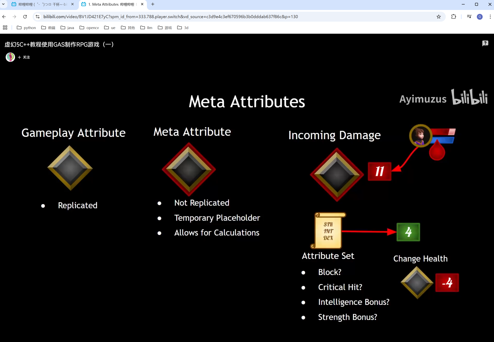

# 安装一个全新虚幻引擎时的优化操作

Rider、IntelliJ优化：

- Rider内存不足

  参考：https://zhuanlan.zhihu.com/p/437617731（Rider For UE4 的内存不足问题）

- IntelliJ系列占用C盘空间

  参考：https://blog.csdn.net/weixin_44449518/article/details/103334235（解决 IntelliJ IDEA占用C盘过大空间问题）


UE优化★：

- UE编译速度慢

  参考：https://zhuanlan.zhihu.com/p/83190575（Unreal Engine大幅提升编译速度的技巧）

- UE缓存文件占用C盘空间

  参考：https://blog.csdn.net/weixin_44753042/article/details/123093832（【虚幻】清理缓存文件（C盘占用过大））


Epic优化：

- Epic保管库占用C盘空间

  参考：https://zhuanlan.zhihu.com/p/528351452（C盘爆满：UE（虚幻引擎）缓存，Epic保管库迁移）


# 反射系统标签

## UPARAM(ref)

b站聆枫LingFeng的使用案例：c++定义了一个蓝图中调用的函数，如果想要在蓝图节点中添加一个输入引脚（输入引脚其实就是以入参的方式传入函数），则函数指定引脚入参前要加上UPARAM(ref)

参考：https://blog.csdn.net/opk8848/article/details/104887704（ue4 关于ufunction 函数 参数 用引用 UPARAM(ref)）

## UMETA()

参考：

https://dev.epicgames.com/documentation/zh-cn/unreal-engine/metadata-specifiers-in-unreal-engine

# 材质（Material）

参考：

非常清晰有用的教程，每个节点都有案例：https://www.bilibili.com/video/BV1LK4y177ME（Ben Cloward虚幻4材质课合集★）、https://zhuanlan.zhihu.com/p/573712342（UE4虚幻引擎材质节点以及蓝图的学习（一）★）、https://zhuanlan.zhihu.com/p/574455678（UE4虚幻引擎材质节点以及蓝图的学习（二）★）、https://zhuanlan.zhihu.com/p/575556518（UE4虚幻引擎材质节点以及蓝图的学习（三）★）

https://blog.csdn.net/choa12345/article/details/120075714（[浅析]UE4材质基础总结）

各种材质表达式参考：https://docs.unrealengine.com/5.2/zh-CN/unreal-engine-material-expressions-reference/（本文列出了[材质编辑器](https://docs.unrealengine.com/5.2/zh-CN/unreal-engine-material-editor-user-guide)中所有可用 **材质表达式** 节点的参考页面）

## Material Domain（材质域）

参考：

https://zhuanlan.zhihu.com/p/101666840（虚化4：材质域（Material Domain））

将材质给UI使用的前提，参考：

https://www.bilibili.com/video/BV1JD421E7yC（虚幻5C++教程使用GAS制作RPG游戏（一）-15.Ghost Globe第7分20秒）

## ObjectPivotPoint

ObjectPivotPoint代表物体模型空间原点在世界空间的位置

## RotateAboutAxis与FixRotateAboutAxisNormals

参考：https://zhuanlan.zhihu.com/p/381326628（RotateAboutAxis和FixRotateAboutAxisNormals）、https://zhuanlan.zhihu.com/p/394785452（在 UE4 中使用顶点着色器旋转网格）

## DitherTemporalAA

扰乱、抗锯齿

参考：

https://blog.csdn.net/xingyali/article/details/82215662（风格化材质制作）


可以用来做淡入淡出，参考：

https://www.bilibili.com/video/BV1TH4y1L7NP（【AI中字】虚幻5C++教程使用GAS制作RPG游戏（二）-4.Fade Actor第5分35秒）

### Responsive AA

情景：niagara中使用了该材质时，出现了锯齿状失真，此时可以勾选上材质节点中的Responsive AA以改善该情况


注意：该材质混合模式一定得设置成是透明的（Translucent）


## 对比度

CheapContrast

参考：

https://dev.epicgames.com/documentation/zh-cn/unreal-engine/image-adjustment-material-functions-in-unreal-engine（图像调整材质函数）

## 去饱和度

Desaturation

参考：

https://dev.epicgames.com/documentation/zh-cn/unreal-engine/color-material-expressions-in-unreal-engine（颜色材质表达式）

## ScreenAlignedPixelToPixelUVs（屏幕空间平铺uv）

参考：

https://www.bilibili.com/video/BV1Pk4y1R7MN（[中文直播]第19期 | 后期材质基础(上) | Epic 贾越-第48分30秒）

## ScaleUVsByCenter

参考：

https://www.bilibili.com/video/BV14a4y147hy（[中文直播] 第20期 | 后处理材质基础(下) | Epic贾越-第1小时42分）

## ViewProperty

用于获取视口中各种属性，例如视口大小、屏幕分辨率等


## AlignMeshToTheCamera（让材质始终面向摄像机）

参考：

https://blog.csdn.net/weixin_38527697/article/details/117989491（ue4 材质始终面向摄像机）

## AttachMeshToTheCamera（让材质贴合到摄像机）

参考：

https://www.bilibili.com/video/BV14a4y147hy（[中文直播] 第20期 | 后处理材质基础(下) | Epic贾越-第1小时55分）

## Gradient Material Functions（渐变材质函数）

参考：

https://dev.epicgames.com/documentation/zh-cn/unreal-engine/gradient-material-functions-in-unreal-engine

## GeneratedBand（生成的色带）

参考：

https://dev.epicgames.com/documentation/zh-cn/unreal-engine/procedurals-material-functions-in-unreal-engine

## 案例

### 材质融合过渡

参考：

https://zhuanlan.zhihu.com/p/348060852（UE4丨材质融合过渡的应用案例）

### 环形进度条

参考：

https://blog.csdn.net/qq_41410054/article/details/114584009（UE4 UI实现环形进度条效果）

# Enhanced Input增强输入

参考：

https://www.bilibili.com/video/BV1Tr4y1b7C6（UE4/UE5实战系列：增强输入系统（Enhanced Input System）★）

https://blog.csdn.net/u011254268/article/details/131434703（用人话讲！虚幻引擎 UE5 增强输入系统（蓝图篇））

https://blog.csdn.net/weixin_55901138/article/details/130639164（UE5学习笔记|增强输入系统EnhancedInput）

https://zhuanlan.zhihu.com/p/470949422（UE5 -- EnhancedInput(增强输入系统)）


# GameMode

gamemode仅存于服务器，不存在于客户端

## 事件OnPostLogin

客户端连接时的回调事件

可用于管理连接玩家

参考：

https://blog.csdn.net/zhangxiao13627093203/article/details/118385657（UE4 中GameInstance、GameMode、GameState、PlayerState和PlayerController的关系）

# 委托

参考：

https://zhuanlan.zhihu.com/p/575671003（UE4中的委托及实现原理）

https://blog.csdn.net/q244645787/article/details/129874760（UE4/5C++：Delegate（委托or代理？）的使用）

https://cloud.tencent.com/developer/article/1889577（UE4技术总结——委托）

# 函数

## Make Rot from ...

参考：https://www.cnblogs.com/weixiaodezhoubian/p/12844425.html（UE4 Make Rot From......函数）

## 获取各种类型数值的最大最小值

以float类型举例：

```c++
float Max = TNumericLimits<float>::Max();
float Min = TNumericLimits<float>::Min();
float Lowest = TNumericLimits<float>::Lowest()
```


# 组件Component

## SceneCapture场景捕获

可以用来做远程监控、后视镜视角、传送门、Cubemap（HDR高动态范围贴图）等

参考：

https://www.gongyesheji.org/?p=1941&wd=&eqid=faa65b910005355e000000066476aafd（【unreal4】 虚幻引擎中获取虚拟摄像机图像并导入UI(UMG)实时显示（SceneCaptureComponent2D、CanvasRenderTarget2D））

https://blog.csdn.net/qq_39934403/article/details/121654665（Unreal Engine UE4虚幻引擎，生成Cubemap（HDR高动态范围贴图））、https://blog.csdn.net/qq_39934403/article/details/121656255（Unreal Engine UE4虚幻引擎，创建Sky天空球，球天材质，自制天空球（HDR高动态范围贴图））

# 后处理

## 后处理材质

参考：

https://www.bilibili.com/video/BV1Pk4y1R7MN（[中文直播]第19期 | 后期材质基础(上) | Epic 贾越）

https://www.bilibili.com/video/BV14a4y147hy（[中文直播] 第20期 | 后处理材质基础(下) | Epic贾越）

https://www.bilibili.com/video/BV1552UYDEhx（后期处理材质基础教程UE5.4-讲原理的材质基础教程）


设置后处理材质起效阶段：


Epic 贾越的教程中说一般选择Before Tonemapping以避免抗锯齿等导致的抖动问题，但上图中没有“Before Tonemapping”，那么可以选择Scene Color Before Bloom或Scene Color Before DOF，参考：

https://forums.unrealengine.com/t/5-4-removed-post-process-material-settings-before-tonemapping/1865552/19（5.4 Removed Post Process Material settings (Before Tonemapping)）

## 材质表达式SceneTexture

- SceneTexture:PostProcessInput0
- SceneTexture:CustomDepth
- SceneTexture:CustomStencil
- SceneTexture:WorldNormal
- ...

参考：

https://docs.unrealengine.com/5.2/zh-CN/post-process-materials-in-unreal-engine/（后期处理材质）、https://zhuanlan.zhihu.com/p/615915744（UE4技术杂谈——后处理 之 遮挡描边）、https://www.bilibili.com/video/BV1Az42197L9（c++中获取GBuffer进行边缘检测配合后处理体积实现描边）、https://www.bilibili.com/video/BV1ki421e7QA（UE5怎样使用后期处理体积给物体描边）

https://blog.csdn.net/ttm2d/article/details/115247252（Unreal Engine 4 使用HLSL自定义着色器（Custom Shaders）教程（上））、https://blog.csdn.net/ttm2d/article/details/115263517（Unreal Engine 4 使用HLSL自定义着色器（Custom Shaders）教程（下））

## 图像模糊

参考：

https://zhuanlan.zhihu.com/p/125744132（高品质后处理：十种图像模糊算法的总结与实现）

### 径向模糊

可以做出零：濡鸦之巫女那样的效果

参考：

https://blog.csdn.net/qq_42486920/article/details/126591803（UE5 描边、径向模糊）

https://www.bilibili.com/video/BV1Pk4y1R7MN（[中文直播]第19期 | 后期材质基础(上) | Epic 贾越-第58分50秒）

### SpiralBlur-SceneTexture

可用于制作毛玻璃效果

参考：

https://blog.csdn.net/goodriver1/article/details/121712281（UE4_如果快速做出毛玻璃效果）

## Custom Depth/Custom Stencil

参考：

https://blog.csdn.net/grayrail/article/details/131173457（在UE中使用Stencil功能）

https://www.bilibili.com/video/BV1hA411n7vZ（[技巧分享]使用自定义模板缓冲创建遮罩 | Creating masks with the Custom Stencil Buffer(官方字幕)）

## DDX、DDY

邻边像素对比

参考：

https://www.bilibili.com/video/BV1Pk4y1R7MN（[中文直播]第19期 | 后期材质基础(上) | Epic 贾越-第1小时13分）

## 半透明后处理材质与Scene Color节点


用于获取场景中不透明的物体所渲染出来的结果，可以利用这个信息做出很好看的效果，比如配合后处理描边：


好处：

1、只需要渲染物体内不需要渲染整个场景，消耗少；

2、利用了透明的属性；


使用场景：

1、拾取物外可以罩一个这种后处理材质，用于单独处理；

2、与AttachMeshToTheCamera材质节点结合，将赋予了该后处理材质的物体附着到相机上，根据物体的形状还可以扣掉某些不需要后处理的像素点；


参考：

https://www.bilibili.com/video/BV14a4y147hy（[中文直播] 第20期 | 后处理材质基础(下) | Epic贾越-第1小时49分20秒，第1小时54分）

## 案例

参考：

https://www.bilibili.com/video/BV1YS4y1k7Pj（(中英字幕)虚幻引擎4.27！6种不同的后处理效果调试！）

### 不被遮挡描边，被遮挡不描边

可以用SceneDepth和CustomDepth来实现

参考：

https://www.bilibili.com/video/BV14a4y147hy（[中文直播] 第20期 | 后处理材质基础(下) | Epic贾越-第42分）

# Data Registry

参考：

https://zhuanlan.zhihu.com/p/471631747（UE5 -- DataRegistry（数据注册表)）

https://www.bilibili.com/video/BV1qq4y1W7Ka（DataRegistry：一种统领全局的新数据配置工具）

# Gameplay Ability System（GAS）

参考：

https://blog.csdn.net/m0_38110586/category_11011758.html（虚幻四Gameplay Ability System入门1-12★）、https://blog.csdn.net/m0_38110586/article/details/137971936（UE GAS进阶-深入理解GE）、https://blog.csdn.net/m0_38110586/article/details/137972247（UE5-GAS插件UE5.3改动）

https://www.bilibili.com/video/BV1X5411V7jh（[中文直播]第31期｜GAS插件介绍（入门篇） | 伍德 大钊）、https://www.bilibili.com/video/BV1zD4y1X77M（[UnrealOpenDay2020]深入GAS架构设计 | EpicGames 大钊）、https://www.bilibili.com/video/BV1sG4y1o7MG（[UOD2022]基于GAS的运行时编辑器框架 | 深圳元象 王杰）

https://www.zhihu.com/people/a-gun-er-58（虚幻插件GAS分析系列★）、https://space.bilibili.com/92060300/video（UE4 GAS入门系列★）

https://zhuanlan.zhihu.com/p/486808688（【Unreal】虚幻GAS系统快速入门）

## 网络同步

参考：

https://zhuanlan.zhihu.com/p/418085845（虚幻插件GAS分析02-0 技能网络同步之激活）、https://zhuanlan.zhihu.com/p/419741087（虚幻插件GAS分析02-1 技能的网络同步之预测与结束）

### 复制模式


参考：

https://www.bilibili.com/video/BV1JD421E7yC（虚幻5C++教程使用GAS制作RPG游戏（一）-7.Replication Mode第1分40秒）

## 虚幻5C++教程使用GAS制作RPG游戏第一部分

参考：

https://www.bilibili.com/video/BV1JD421E7yC（【AI中字】虚幻5C++教程使用GAS制作RPG游戏（一））、https://www.bilibili.com/video/BV1TH4y1L7NP（【AI中字】虚幻5C++教程使用GAS制作RPG游戏（二））、https://www.bilibili.com/video/BV1kK421e7nw（【AI中字】虚幻5C++教程使用GAS制作RPG游戏（三））

### Owner Actor和Avatar actor


参考：

https://www.bilibili.com/video/BV1JD421E7yC（虚幻5C++教程使用GAS制作RPG游戏（一）-8.Init Ability Actor Info第1分40秒）

### Ability初始化钩子（PossessedBy、AcknowledgePossession、OnRep_PlayerState、BeginPlay）


参考：

https://www.bilibili.com/video/BV1JD421E7yC（虚幻5C++教程使用GAS制作RPG游戏（一）-8.Init Ability Actor Info第4分30秒）

### Ability挂件的持有Actor需要设置其Owner为Controller（Pawn/PlayerState除外，这两个自动设置掉了）


参考：

https://www.bilibili.com/video/BV1JD421E7yC（虚幻5C++教程使用GAS制作RPG游戏（一）-8.Init Ability Actor Info第21分）

### Gameplay Effects


参考：

https://www.bilibili.com/video/BV1JD421E7yC（虚幻5C++教程使用GAS制作RPG游戏（一）-1.Gameplay Effects第4分）

#### Periodic Gameplay Effects


参考：

https://www.bilibili.com/video/BV1JD421E7yC（虚幻5C++教程使用GAS制作RPG游戏（一）-5.Peroidic Gameplay Effects第3分）

#### Stacking

- Aggregate by Source

​	

参考：

https://www.bilibili.com/video/BV1JD421E7yC（虚幻5C++教程使用GAS制作RPG游戏（一）-6.Effect Stacking第2分20秒）


- Aggregate by Target

​	

参考：

https://www.bilibili.com/video/BV1JD421E7yC（虚幻5C++教程使用GAS制作RPG游戏（一）-6.Effect Stacking第4分50秒）

#### PreAttributeChange


参考：

https://www.bilibili.com/video/BV1JD421E7yC（虚幻5C++教程使用GAS制作RPG游戏（一）-10.PreAttributeChange第10分30秒）

#### Modifiers

##### Attribute Based


Coefficient、Pre Multiply Additive Val、Post Multiply Additive Val


计算方法为：


参考：

https://www.bilibili.com/video/BV1JD421E7yC（虚幻5C++教程使用GAS制作RPG游戏（一）-5.Modifier Coefficients第1分）

##### ModMagnitudeCalculation（自定义计算）


参考：

https://www.bilibili.com/video/BV1JD421E7yC（虚幻5C++教程使用GAS制作RPG游戏（一）-10.Modifier Magnitude Calculations）

##### Set by Caller


在c++中注册SetByCaller：

```c++
UAbilitySystemBlueprintLibrary::AssignTagSetByCallerMagnitude(SpecHandle, GameplayTags.Damage, ScaledDamage); // SetByCaller本质上是一个键值对，key为GameplayTags.Damage，value为ScaledDamage
```

他的作用之一：不需要在GE中硬编码数值，而是可以将其交由Gameplay Ability处理（GA中我们可以通过Curve Table处理数值）

参考：

https://www.bilibili.com/video/BV1JD421E7yC（虚幻5C++教程使用GAS制作RPG游戏（一）-3.Set By Caller Magnitude）

#### Execution Calculation

比ModMagnitudeCalculation（MMC）更强大，但也有不少限制


参考：

https://www.bilibili.com/video/BV1JD421E7yC（虚幻5C++教程使用GAS制作RPG游戏（一）-11.Execution Calculations）

https://www.bilibili.com/video/BV1JD421E7yC（虚幻5C++教程使用GAS制作RPG游戏（一）-13.ExecCalcs - Capturing Attributes）


他还可以捕获到Set By Caller的数值：


参考：

https://www.bilibili.com/video/BV1JD421E7yC（虚幻5C++教程使用GAS制作RPG游戏（一）-11.Execution Calculations第4分30秒）

https://www.bilibili.com/video/BV1JD421E7yC（虚幻5C++教程使用GAS制作RPG游戏（一）-14.Implementing Block Chance）

#### FGameplayEffectContextHandle

在GE触发时，可以通过FGameplayEffectContextHandle传递很多有用的信息


参考：

https://www.bilibili.com/video/BV1JD421E7yC（虚幻5C++教程使用GAS制作RPG游戏（一）-1.The Gameplay Effect Context第26分）

##### 扩展FGameplayEffectContext

参考：

https://www.bilibili.com/video/BV1JD421E7yC（虚幻5C++教程使用GAS制作RPG游戏（一）-2.Custom Gameplay Effect Context）

https://www.bilibili.com/video/BV1JD421E7yC（虚幻5C++教程使用GAS制作RPG游戏（一）-7.Using a Custom Effect Context）

关于如何将自定义的FGameplayEffectContext注入UE，参考`Gameplay Ability System（GAS）-虚幻5C++教程使用GAS制作RPG游戏-Ability System Globals`章节

#### Instancing Policy

当设置为Instanced Per Actor时，需要注意局部变量初始化问题

参考：

https://www.bilibili.com/video/BV1TH4y1L7NP（【AI中字】虚幻5C++教程使用GAS制作RPG游戏（二）-2.Impact Effects第13分50秒）

#### FGameplayEffectQuery


参考：

https://www.bilibili.com/video/BV1TH4y1L7NP（【AI中字】虚幻5C++教程使用GAS制作RPG游戏（二）-11. Cooldown Async Task第27分30秒）

#### 如何在代码中动态创建GE

```c++
UGameplayEffect* Effect = NewObject<UGameplayEffect>(GetTransientPackage(), FName(DebuffName)); // GetTransientPackage()表示临时资源，这里我们没有GE的Class，所以采用临时资源的方式创建GE
```

参考：

https://www.bilibili.com/video/BV1TH4y1L7NP（【AI中字】虚幻5C++教程使用GAS制作RPG游戏（二）-8. Dynamic Gameplay Effects第2分05秒）

##### 如何在代码中动态添加GE的InheritableOwnedTag

```c++
Effect->InheritableOwnedTagsContainer.AddTag(DebuffTag);
```

参考：

https://www.bilibili.com/video/BV1TH4y1L7NP（【AI中字】虚幻5C++教程使用GAS制作RPG游戏（二）-8. Dynamic Gameplay Effects第7分45秒）

##### 如何在代码中动态添加Modifiers

参考：

https://www.bilibili.com/video/BV1TH4y1L7NP（【AI中字】虚幻5C++教程使用GAS制作RPG游戏（二）-8. Dynamic Gameplay Effects第9分30秒）

##### 如何在代码中动态创建FGameplayEffectSpec

参考：

https://www.bilibili.com/video/BV1TH4y1L7NP（【AI中字】虚幻5C++教程使用GAS制作RPG游戏（二）-8. Dynamic Gameplay Effects第13分42秒）

### Gameplay Tags


参考：

https://www.bilibili.com/video/BV1JD421E7yC（虚幻5C++教程使用GAS制作RPG游戏（一）-1.Gameplay Tags）

#### 在c++中初始化Tag

1、利用了自定义的UAssetManager（如何创建并使用自定义UAssetManager见“UAssetManager”章节）；

2、在UAssetManager的StartInitialLoading()初始化方法中初始化Tags：


3、之后即可创建完成：


参考：

https://www.bilibili.com/video/BV1JD421E7yC（虚幻5C++教程使用GAS制作RPG游戏（一）-12.Aura Asset Manager）

### 第一属性和第二属性的设计


参考：

https://www.bilibili.com/video/BV1JD421E7yC（虚幻5C++教程使用GAS制作RPG游戏（一）-6.Secondary Attributes）

#### 属性面板UI设计


参考：

https://www.bilibili.com/video/BV1JD421E7yC（虚幻5C++教程使用GAS制作RPG游戏（一）-1.Attribute Menu-Game Plan）

#### UI数值更新的MVC架构设计


参考：

https://www.bilibili.com/video/BV1JD421E7yC（虚幻5C++教程使用GAS制作RPG游戏（一）-10.Plan for displaying Attribute Data第3分10秒）

### Gameplay Abilities


#### Tags


参考：

https://www.bilibili.com/video/BV1JD421E7yC（虚幻5C++教程使用GAS制作RPG游戏（一）-3.Settings on Gameplay Abilities第1分25秒）

#### Instancing Policy


参考：

https://www.bilibili.com/video/BV1JD421E7yC（虚幻5C++教程使用GAS制作RPG游戏（一）-3.Settings on Gameplay Abilities第9分15秒）

#### Net Execution Policy


参考：

https://www.bilibili.com/video/BV1JD421E7yC（虚幻5C++教程使用GAS制作RPG游戏（一）-3.Settings on Gameplay Abilities第12分10秒）

#### 不推荐使用的配置项


注意：GA不在Simulated Proxies中运作，可以用GE和GC代替

参考：

https://www.bilibili.com/video/BV1JD421E7yC（虚幻5C++教程使用GAS制作RPG游戏（一）-3.Settings on Gameplay Abilities第14分55秒）

#### 将GA绑定到Enhanced Input上


参考：

https://www.bilibili.com/video/BV1JD421E7yC（虚幻5C++教程使用GAS制作RPG游戏（一）-4.Input Config Data Asset第20秒）

#### GameplayAbilitySpec

##### FScopedAbilityListLock

一种遍历Ability时的方法域锁

```c++
/** Used to stop us from removing abilities from an ability system component while we're iterating through the abilities */
```

参考：

GameplayAbilitySpec.h

https://www.bilibili.com/video/BV1TH4y1L7NP（【AI中字】虚幻5C++教程使用GAS制作RPG游戏（二）-7. For Each Ability Delegate第4分10秒）

##### FScopedTargetListLock

```c++
/** Used to stop us from canceling or ending an ability while we're iterating through its gameplay targets */
```

参考：

GameplayAbilitySpec.h

##### 发生网络复制时的回调函数

```c++
UPROPERTY(ReplicatedUsing = OnRep_ActivateAbilities, BlueprintReadOnly, Transient, Category = "Abilities")
FGameplayAbilitySpecContainer ActivatableAbilities;
```

参考：

https://www.bilibili.com/video/BV1TH4y1L7NP（【AI中字】虚幻5C++教程使用GAS制作RPG游戏（二）-8. Binding Widget Events to the Ability Info Delegate第13分25秒）

##### AbilitySpecInputPressed和AbilitySpecInputReleased


方法里面会去调用Ability的InputPressed方法：


该方法在GameplayAbility中，可通过重写实现自定义逻辑：


使用案例：


它可以用于告知GA是否被按下，不管GA是否已经被Active，只要按下了就告知

参考：

https://www.bilibili.com/video/BV1JD421E7yC（虚幻5C++教程使用GAS制作RPG游戏（一）-7.Activating Abilities第19分）

##### 获取FPredictionKey

```c++
AbilitySpec.ActivationInfo.GetActivationPredictionKey()
```

参考：

https://www.bilibili.com/video/BV1TH4y1L7NP（【AI中字】虚幻5C++教程使用GAS制作RPG游戏（二）-5. Invoke Replicated Event第10分50秒）

#### 网络同步

需要借助FGameplayAbilityTargetData类来实现网络同步，服务端会有AbilityTargetDataMap来维护网络数据


参考：

https://www.bilibili.com/video/BV1JD421E7yC（虚幻5C++教程使用GAS制作RPG游戏（一）-5.Target Data第2分55秒）

https://www.bilibili.com/video/BV1JD421E7yC（虚幻5C++教程使用GAS制作RPG游戏（一）-6.Send Mouse Cursor Data）

https://www.bilibili.com/video/BV1JD421E7yC（虚幻5C++教程使用GAS制作RPG游戏（一）-7.Receiving Target Data）

#### CommitAbility、CommitAbilityCooldown、CommitAbilityCost

CommitAbility会同时执行CommitAbilityCooldown、CommitAbilityCost

CommitAbility失败后整个Ability都会被取消，包括CommitAbility前面的执行节点也会跟没执行过一样！

参考：

https://www.bilibili.com/video/BV1TH4y1L7NP（【AI中字】虚幻5C++教程使用GAS制作RPG游戏（二）-9. Gameplay Ability Cost第4分10秒）

#### 使用MarkAbilitySpecDirty强制对GA进行网络复制

参考：

https://www.bilibili.com/video/BV1TH4y1L7NP（【AI中字】虚幻5C++教程使用GAS制作RPG游戏（二）-15. Update Ability Statuses第11分30秒）


#### 如何获取GA的CostGameplayEffect以及CooldownGameplayEffect

参考：

https://www.bilibili.com/video/BV1TH4y1L7NP（【AI中字】虚幻5C++教程使用GAS制作RPG游戏（二）-26. Cost and Cooldown in Spell Description第5分45秒）

https://www.bilibili.com/video/BV1TH4y1L7NP（【AI中字】虚幻5C++教程使用GAS制作RPG游戏（二）-26. Cost and Cooldown in Spell Description第20分）


### Gameplay Tasks


#### 网络同步

如何正确处理Client和Server的数据同步？参考：

https://www.bilibili.com/video/BV1JD421E7yC（虚幻5C++教程使用GAS制作RPG游戏（一）-6.Send Mouse Cursor Data）

https://www.bilibili.com/video/BV1JD421E7yC（虚幻5C++教程使用GAS制作RPG游戏（一）-7.Receiving Target Data）

### Click/Touch To Move


参考：

https://www.bilibili.com/video/BV1JD421E7yC（虚幻5C++教程使用GAS制作RPG游戏（一）-8.Click To Move）

### NavigationSystem

在使用`UNavigationSystemV1::FindPathToActorSynchronously()`方法时，出现无法解析符号的报错，头文件也加上了，后来发现要添加NavigationSystem模块，参考：

https://blog.csdn.net/qq_42673921/article/details/89339295（`UE4 UNavigationSystemV1::FindPathToActorSynchronously`）

https://www.bilibili.com/video/BV1JD421E7yC（虚幻5C++教程使用GAS制作RPG游戏（一）-10.Setting Up Auto Running第8分15秒）


如何解决Client端导航无反应问题？答：需要开启项目设置中的Allow Client Side Navigation（但是！这并不是最省资源的方式，还有一种方式是去Server端请求导航数据）


参考：

https://www.bilibili.com/video/BV1JD421E7yC（虚幻5C++教程使用GAS制作RPG游戏（一）-11.Implementing Auto Running第6分20秒）

### Prediction预测

利用FScopedPredictionWindow、ScopedPredictionKey完成Server域预测与Client域先执行

利用ShouldBroadcastAbilityTaskDelegates()方法判断AbilityTask当前是否允许触发广播事件


参考：

https://www.bilibili.com/video/BV1JD421E7yC（虚幻5C++教程使用GAS制作RPG游戏（一）-6.Send Mouse Cursor Data）


参考：

https://www.bilibili.com/video/BV1JD421E7yC（虚幻5C++教程使用GAS制作RPG游戏（一）-8.Prediction in GAS）

更多信息需要进一步参考引擎中的GameplayPrediction.h类

### Montage中可以设置特定动作时的人物朝向

此为新版本UE中用于解决根骨骼动画的方案

需要开启Root Motion


需要开启Motion Warping插件


在BP_Character中使用该插件


在Montage中设置Motion Warping


在BP_Character中新建事件用于设置上图的“FacingTarget”


最终在攻击生成火球时已知攻击点的坐标，此时调用上图事件即可完成转身


参考：

https://www.bilibili.com/video/BV1JD421E7yC（虚幻5C++教程使用GAS制作RPG游戏（一）-10.Motion Warping第40秒）

上述操作还可以进一步优化，可以将SetFacingTarget的逻辑写到Interface接口中，参考：

https://www.bilibili.com/video/BV1JD421E7yC（虚幻5C++教程使用GAS制作RPG游戏（一）-10.Motion Warping第9分15秒）

### RPG多种Character Classes的属性设计架构


参考：

https://www.bilibili.com/video/BV1JD421E7yC（虚幻5C++教程使用GAS制作RPG游戏（一）-1.RPG Character Classes）

### 将CurveTable导出/导入至CSV/JSON

导出：


导入：

法一：


法二：


法三：


参考：

https://www.bilibili.com/video/BV1JD421E7yC（虚幻5C++教程使用GAS制作RPG游戏（一）-4.Curve Tables - CSV and JSON第14分）

### Meta Attributes



参考：

https://www.bilibili.com/video/BV1JD421E7yC（虚幻5C++教程使用GAS制作RPG游戏（一）-1.Meta Attributes）

### FScalableFloat

```c++
UPROPERTY(EditDefaultsOnly, BlueprintReadOnly, Category = "Damage")
FScalableFloat Damage;
```

可以设置Curve Table以及倍率（倍率为左侧的数字输入框），效果：


### Net Serialize序列化


参考：

https://www.bilibili.com/video/BV1JD421E7yC（虚幻5C++教程使用GAS制作RPG游戏（一）-3.NetSerialize）

https://www.bilibili.com/video/BV1JD421E7yC（虚幻5C++教程使用GAS制作RPG游戏（一）-4.Implementing Net Serialize）

https://www.bilibili.com/video/BV1JD421E7yC（虚幻5C++教程使用GAS制作RPG游戏（一）-5.Struct Ops Type Traits）

### Ability System Globals

参考：

https://www.bilibili.com/video/BV1JD421E7yC（虚幻5C++教程使用GAS制作RPG游戏（一）-6.Aura Ability System Globals）


设置自定义Ability System Globals的法一在上述视频中

法二：


### AI


参考：

https://www.bilibili.com/video/BV1JD421E7yC（虚幻5C++教程使用GAS制作RPG游戏（一）-1.Enemy AI Setup）

#### Behavior Tree

##### Blackboard Keys

参考：

https://www.bilibili.com/video/BV1JD421E7yC（虚幻5C++教程使用GAS制作RPG游戏（一）-4.Blackboard Keys第2分25秒）

##### Behavior Tree Decorators

参考：

https://www.bilibili.com/video/BV1JD421E7yC（虚幻5C++教程使用GAS制作RPG游戏（一）-7.Behavior Tree Decorators第1分20秒）

##### Behavior Tree Task

在蓝图中重写Receive Execute AI方法时，不要忘记最后要执行一下Finish Execute


参考：

https://www.bilibili.com/video/BV1JD421E7yC（虚幻5C++教程使用GAS制作RPG游戏（一）-8.Attack Behavior Tree Task第6分50秒）

###### 在Behavior Tree Task中触发GA

参考：

https://www.bilibili.com/video/BV1JD421E7yC（虚幻5C++教程使用GAS制作RPG游戏（一）-1.Melee Attack Ability第19分10秒）

#### 使AI动作更加自然

##### AI移动时更加自然的转向

把Pawn的Use Controller Rotation Yaw关闭：


把Character Movement的Use Controller Desired Rotation打开：


或者直接在c++中设置：


参考：

https://www.bilibili.com/video/BV1JD421E7yC（虚幻5C++教程使用GAS制作RPG游戏（一）-6.AI and Effect Actors第50秒）

##### AI Idle和run的切换更加自然


参考：

https://www.bilibili.com/video/BV1JD421E7yC（虚幻5C++教程使用GAS制作RPG游戏（一）-9.Find New Location Around Target第40秒）

##### 因为EndAbility导致Montage只播放了一半的问题

把PlayMontageAndWait中的Stop when Ability Ends关闭即可


参考：

https://www.bilibili.com/video/BV1JD421E7yC（虚幻5C++教程使用GAS制作RPG游戏（一）-12.Ghoul Attack Montages第7分45秒）

##### 弹弓手在攻击时弹弓的动画蓝图设置

举一反三，其他的比如射箭等动画蓝图也可以这样制作

参考：

https://www.bilibili.com/video/BV1JD421E7yC（虚幻5C++教程使用GAS制作RPG游戏（一）-8.Slingshot Animation Blueprint）

https://www.bilibili.com/video/BV1JD421E7yC（虚幻5C++教程使用GAS制作RPG游戏（一）-9.Slingshot Attack Montage）

##### 普通的Anim Notify


参考：

https://www.bilibili.com/video/BV1JD421E7yC（虚幻5C++教程使用GAS制作RPG游戏（一）-9.Slingshot Attack Montage第3分）

#### 如何在Nav导航网格内获取随即半径位置

因为AI只能在Nav导航网格中移动，所以想让AI移动到某个随即半径位置时得使用这个方法Get Random Location in Navigable Radius：


参考：

https://www.bilibili.com/video/BV1JD421E7yC（虚幻5C++教程使用GAS制作RPG游戏（一）-9.Find New Location Around Target第8分55秒）

#### EQS（Environment Query System）

参考：

https://www.bilibili.com/video/BV1JD421E7yC（虚幻5C++教程使用GAS制作RPG游戏（一）-11.Environment Queries）

https://www.bilibili.com/video/BV1JD421E7yC（虚幻5C++教程使用GAS制作RPG游戏（一）-12.EQS Tests）

##### EQS的使用场景

参考：

https://www.bilibili.com/video/BV1JD421E7yC（虚幻5C++教程使用GAS制作RPG游戏（一）-10.Environment Query System）

##### EnvQueryContext

用于筛选EQS点位


在蓝图中可通过继承EnvQueryContext_BlueprintBase实现自定义EnvQueryContext

参考：

https://www.bilibili.com/video/BV1JD421E7yC（虚幻5C++教程使用GAS制作RPG游戏（一）-12.EQS Tests）

https://www.bilibili.com/video/BV1JD421E7yC（虚幻5C++教程使用GAS制作RPG游戏（一）-13.Distance Test）


如果是Trace检测，则还应该开启遮挡物的Collision中的Visibility为Block

参考：

https://www.bilibili.com/video/BV1JD421E7yC（虚幻5C++教程使用GAS制作RPG游戏（一）-14.Using EQS Queries in Behavior Trees第8分钟）

#### AI之间互不阻挡


参考：

https://www.bilibili.com/video/BV1JD421E7yC（虚幻5C++教程使用GAS制作RPG游戏（一）-13.Melee Polish第18分20秒）

https://dev.epicgames.com/documentation/zh-cn/unreal-engine/using-avoidance-with-the-navigation-system-in-unreal-engine

### 用于分类的Tag


然后在c++代码中：

```c++
APawn* Pawn = xxx;
Pawn->ActorHasTag(FName("Player"));
```

参考：

https://www.bilibili.com/video/BV1JD421E7yC（虚幻5C++教程使用GAS制作RPG游戏（一）-4.Blackboard Keys第11分25秒）


#### `UGameplayStatics::GetAllActorsWithTag`

参考：

https://www.bilibili.com/video/BV1JD421E7yC（虚幻5C++教程使用GAS制作RPG游戏（一）-4.Blackboard Keys第14分25秒）

#### `UGameplayStatics::GetAllActorsOfClassWithTag`


### 重叠检测

可以参考GameplayStatics.cpp中的ApplyRadialDamageWithFalloff方法

参考：

https://www.bilibili.com/video/BV1JD421E7yC（虚幻5C++教程使用GAS制作RPG游戏（一）-5.Get Live Players Within Radius第1分50秒）

## 虚幻5C++教程使用GAS制作RPG游戏第二部分

### 动画序列

#### 预览时显示周围环境、地板等信息


参考：

https://www.bilibili.com/video/BV1TH4y1L7NP（【AI中字】虚幻5C++教程使用GAS制作RPG游戏（二）-1.Goblin Spear - Sound Notifies第1分10秒）

### 动画蓝图

#### IsFalling()

用于判断角色是否处于滞空状态

参考：

https://www.bilibili.com/video/BV1TH4y1L7NP（【AI中字】虚幻5C++教程使用GAS制作RPG游戏（二）-13. Knockback第29分35秒）

#### 状态机

##### Add State Alias

参考：

https://www.bilibili.com/video/BV1TH4y1L7NP（【AI中字】虚幻5C++教程使用GAS制作RPG游戏（二）-13. Knockback第30分30秒）

#### Animation Node Functions

参考：

https://dev.epicgames.com/documentation/en-us/unreal-engine/animation-blueprint-node-functions-in-unreal-engine

### MetaSound

#### 调低音量

使用场景：静步


参考：

https://www.bilibili.com/video/BV1TH4y1L7NP（【AI中字】虚幻5C++教程使用GAS制作RPG游戏（二）-1.Goblin Spear - Sound Notifies第2分25秒）

#### 让声音变得更低沉


参考：

https://www.bilibili.com/video/BV1TH4y1L7NP（【AI中字】虚幻5C++教程使用GAS制作RPG游戏（二）-9.Ghoul - Sound Notifies第1分20秒）

### Gameplay Cue

适用于处理AI的动作触发的声音、特效等及其网络复制

参考：

https://www.bilibili.com/video/BV1TH4y1L7NP（【AI中字】虚幻5C++教程使用GAS制作RPG游戏（二）-3.Melee Impact Gameplay Cue）

https://www.bilibili.com/video/BV1TH4y1L7NP（【AI中字】虚幻5C++教程使用GAS制作RPG游戏（二）-4.Montage and Socket Tags第11分30秒）

### Niagara

#### Emit

##### Spawn Per Unit

在空间中每隔一定距离就会生成


参考：

https://www.bilibili.com/video/BV1TH4y1L7NP（【AI中字】虚幻5C++教程使用GAS制作RPG游戏（二）-10.Ghoul - Swipe Trail第30秒）

#### 在动画通知中使用Niagara


参考：

https://www.bilibili.com/video/BV1TH4y1L7NP（【AI中字】虚幻5C++教程使用GAS制作RPG游戏（二）-10.Ghoul - Swipe Trail第1分15秒）

#### Niagara朝向用户摄像机

参考：

https://www.bilibili.com/video/BV1TH4y1L7NP（【AI中字】虚幻5C++教程使用GAS制作RPG游戏（二）-14. Level Up Niagara System第7分50秒）

### Update Redirector References

有时候资源迁移时会发生这样的问题：


或者资源诺不过去的问题

解决方法：


参考：

https://www.bilibili.com/video/BV1TH4y1L7NP（【AI中字】虚幻5C++教程使用GAS制作RPG游戏（二）-14.Demon - Sound Notifies第4分10秒）

### RotateAngleAxis()向量旋转

```c++
const FVector LeftOfSpread = Forward.RotateAngleAxis(45.f, FVector::UpVector);
```

参考：

https://www.bilibili.com/video/BV1TH4y1L7NP（【AI中字】虚幻5C++教程使用GAS制作RPG游戏（二）-16.Shaman Summon Locations第7分50秒）

https://www.bilibili.com/video/BV1TH4y1L7NP（【AI中字】虚幻5C++教程使用GAS制作RPG游戏（二）-13. Knockback第15分15秒）

### 静态资源编组

分组之后多个静态资源可以作为一个整体进行transform

参考：

https://www.bilibili.com/video/BV1TH4y1L7NP（【AI中字】虚幻5C++教程使用GAS制作RPG游戏（二）-17.Async Spawn Times第8分35秒）

### 动态生成的AI原地不动的原因

原因是动态生成的AI没有被分配Controller，所以需要手动分配一个默认的Controller给他们：


参考：

https://www.bilibili.com/video/BV1TH4y1L7NP（【AI中字】虚幻5C++教程使用GAS制作RPG游戏（二）-19.Select Minion Class at Random第4分15秒）

### Find Look at Rotation


参考：

https://www.bilibili.com/video/BV1TH4y1L7NP（【AI中字】虚幻5C++教程使用GAS制作RPG游戏（二）-20.Minion Summon Montage第4分）

### 炮弹刚发射出去就爆炸了的原因排查

参考：

https://www.bilibili.com/video/BV1TH4y1L7NP（【AI中字】虚幻5C++教程使用GAS制作RPG游戏（二）-22.Elementalist Behavior Tree第2分）

### UPROPERTY()

#### meta参数

##### AllowPrivateAccess参数

当变量在private域中，又想在蓝图中读取的话，就需要加AllowPrivateAccess="true"：

```c++
private:
	UPROPERTY(VisibleAnywhere, BlueprintReadOnly, meta = (AllowPrivateAccess="true"))
	TObjectPtr<USphereComponent> Sphere;
```


参考：

https://www.bilibili.com/video/BV1TH4y1L7NP（【AI中字】虚幻5C++教程使用GAS制作RPG游戏（二）-22.Elementalist Behavior Tree第5分30秒）

### UFUNCTION()

#### meta参数

##### BlueprintInternalUseOnly参数

参考：

https://www.bilibili.com/video/BV1TH4y1L7NP（【AI中字】虚幻5C++教程使用GAS制作RPG游戏（二）-11. Cooldown Async Task第8分50秒）

##### DisplayName

节点展示名称

##### HidePin

隐藏引脚

##### DefaultToSelf

直接给节点注入self，场景：某些BlueprintPure函数不想手动传入self就可以使用这个特性

参考：

https://www.bilibili.com/video/BV1TH4y1L7NP（【AI中字】虚幻5C++教程使用GAS制作RPG游戏（二）-10. Constructing the Spell Menu Widget Controller第18分30秒）

#### BlueprintNativeEvent

接口中使用他而非virtual的好处，参考：

https://www.bilibili.com/video/BV1TH4y1L7NP（【AI中字】虚幻5C++教程使用GAS制作RPG游戏（二）-11. Level Up Interface Function第2分20秒）


接口中使用他时不能在接口中实现它，因为虚幻的反射代码中已经定义它了，再写一遍就是重定义，参考：

https://www.bilibili.com/video/BV1TH4y1L7NP（【AI中字】虚幻5C++教程使用GAS制作RPG游戏（二）-11. Level Up Interface Function第14分35秒）

#### CustomThunk

參考：https://www.cnblogs.com/baustein/p/15240785.html（UE4 CustomThunk笔记）

### UCLASS()

#### meta参数

##### ExposedAsyncProxy参数

```c++
UCLASS(BlueprintType, meta = (ExposedAsyncProxy = "AsyncTask"))
class GASGAME250107_API UWaitCooldownChange : public UBlueprintAsyncActionBase
{
	GENERATED_BODY()
    // ...
}
```


参考：

https://www.bilibili.com/video/BV1TH4y1L7NP（【AI中字】虚幻5C++教程使用GAS制作RPG游戏（二）-12. Cooldown Tags in Ability Info第1分）

### SpawnActor的On Destroyed监听事件


使用SpawnActor生成的Actor可以绑定其销毁事件

参考：

https://www.bilibili.com/video/BV1TH4y1L7NP（【AI中字】虚幻5C++教程使用GAS制作RPG游戏（二）-24.Decrementing Minion Count第40秒）

### 内存泄露导致FPS不断降低

参考：

https://www.bilibili.com/video/BV1TH4y1L7NP（【AI中字】虚幻5C++教程使用GAS制作RPG游戏（二）-26.Enemies Final Polish第2分30秒）

#### WaitGameplayEvent接收多次信号触发多次的问题


参考：

https://www.bilibili.com/video/BV1TH4y1L7NP（【AI中字】虚幻5C++教程使用GAS制作RPG游戏（二）-26.Enemies Final Polish第6分50秒）

#### Niagara粒子未被销毁导致其生命周期无限长的问题


参考：

https://www.bilibili.com/video/BV1TH4y1L7NP（【AI中字】虚幻5C++教程使用GAS制作RPG游戏（二）-26.Enemies Final Polish第9分）

### GE未捕获到Attributes导致控制台一直报错的问题


方法中把警告日志关闭即可：


参考：

https://www.bilibili.com/video/BV1TH4y1L7NP（【AI中字】虚幻5C++教程使用GAS制作RPG游戏（二）-26.Enemies Final Polish第12分30秒）

### 灯光处理

参考：

https://www.bilibili.com/video/BV1TH4y1L7NP（【AI中字】虚幻5C++教程使用GAS制作RPG游戏（二）-1.Level Lighting and Post Process第5分55秒）

#### SkyLight

##### Intensity Scale


参考：

https://www.bilibili.com/video/BV1TH4y1L7NP（【AI中字】虚幻5C++教程使用GAS制作RPG游戏（二）-1.Level Lighting and Post Process第10分40秒）

### PostProcessVolume

#### Exposure


参考：

https://www.bilibili.com/video/BV1TH4y1L7NP（【AI中字】虚幻5C++教程使用GAS制作RPG游戏（二）-1.Level Lighting and Post Process第9分55秒）

#### Temperature


参考：

https://www.bilibili.com/video/BV1TH4y1L7NP（【AI中字】虚幻5C++教程使用GAS制作RPG游戏（二）-1.Level Lighting and Post Process第21分35秒）

#### Global色调


参考：

https://www.bilibili.com/video/BV1TH4y1L7NP（【AI中字】虚幻5C++教程使用GAS制作RPG游戏（二）-1.Level Lighting and Post Process第22分45秒）

#### Shadows阴影


参考：

https://www.bilibili.com/video/BV1TH4y1L7NP（【AI中字】虚幻5C++教程使用GAS制作RPG游戏（二）-1.Level Lighting and Post Process第24分30秒）

#### Midtones中间色调


参考：

https://www.bilibili.com/video/BV1TH4y1L7NP（【AI中字】虚幻5C++教程使用GAS制作RPG游戏（二）-1.Level Lighting and Post Process第25分15秒）

#### Film Grain


参考：

https://www.bilibili.com/video/BV1TH4y1L7NP（【AI中字】虚幻5C++教程使用GAS制作RPG游戏（二）-1.Level Lighting and Post Process第26分17秒）

### 处理静态资源碰撞

参考：

https://www.bilibili.com/video/BV1TH4y1L7NP（【AI中字】虚幻5C++教程使用GAS制作RPG游戏（二）-1.Level Lighting and Post Process第17分）

#### Collision Complexity

参考：

https://dev.epicgames.com/documentation/zh-cn/unreal-engine/simple-versus-complex-collision-in-unreal-engine

https://www.bilibili.com/video/BV1TH4y1L7NP（【AI中字】虚幻5C++教程使用GAS制作RPG游戏（二）-1.Level Lighting and Post Process第17分55秒）

### 设置画面质量


参考：

https://www.bilibili.com/video/BV1TH4y1L7NP（【AI中字】虚幻5C++教程使用GAS制作RPG游戏（二）-1.Level Lighting and Post Process第27分35秒）

### TEXTURE STREAMING POOL OVER xxx MiB BUDGET问题


需要压缩纹理来解决该问题


参考：

https://www.bilibili.com/video/BV1TH4y1L7NP（【AI中字】虚幻5C++教程使用GAS制作RPG游戏（二）-2.Texture Streaming Pool Over Budget第9分15秒）


另一种方式是通过修改TEXTURE BUDGET LIMIT：


搜索rendersettings：


有则修改，无则创建：


参考：

https://www.bilibili.com/video/BV1TH4y1L7NP（【AI中字】虚幻5C++教程使用GAS制作RPG游戏（二）-2.Texture Streaming Pool Over Budget第16分55秒）


另外，UE5.5默认存在一个RendererSettings，不知道是不是更新了，不太清楚配置是往最新的这个地方写还是上面那个地方写：


亲测UE5.5该配置会出问题（250215再次验证又没问题了，挺奇怪的）：


### Edit Selection in Property Matrix批处理资产


参考：

https://www.bilibili.com/video/BV1TH4y1L7NP（【AI中字】虚幻5C++教程使用GAS制作RPG游戏（二）-2.Texture Streaming Pool Over Budget第11分45秒）

### 过滤资产


可以跟Edit Selection in Property Matrix批处理资产连用

参考：

https://www.bilibili.com/video/BV1TH4y1L7NP（【AI中字】虚幻5C++教程使用GAS制作RPG游戏（二）-2.Texture Streaming Pool Over Budget第12分）

### 光源的Static、Stationary、Movable


参考：

https://www.bilibili.com/video/BV1TH4y1L7NP（【AI中字】虚幻5C++教程使用GAS制作RPG游戏（二）-3.Flame Pillar Actor第3分55秒）

### Tick优化

#### BP中Tick的开关


#### 用自循环方式替换Tick

参考：

https://www.bilibili.com/video/BV1TH4y1L7NP（【AI中字】虚幻5C++教程使用GAS制作RPG游戏（二）-3.Flame Pillar Actor第10分45秒）

#### 用Timer替换Tick

Timer可以自定义执行频率，所以可以做到比Tick消耗更少的资源

参考：

https://www.bilibili.com/video/BV1TH4y1L7NP（【AI中字】虚幻5C++教程使用GAS制作RPG游戏（二）-13. Showing Cooldown Time in the HUD第4分40秒）

### Timeline中Use Last KeyFrame是什么意思？

参考：

https://dev.epicgames.com/documentation/zh-cn/unreal-engine/editing-timelines-in-unreal-engine

### 场景物体遮挡视野时，物体淡入淡出解决方案

参考：

https://www.bilibili.com/video/BV1TH4y1L7NP（【AI中字】虚幻5C++教程使用GAS制作RPG游戏（二）-4.Fade Actor）

https://www.bilibili.com/video/BV1TH4y1L7NP（【AI中字】虚幻5C++教程使用GAS制作RPG游戏（二）-5.Fading Out Obstructing Geometry）

#### 物体关闭阴影

淡入时，阴影看起来比较假，不如直接关掉


参考：

https://www.bilibili.com/video/BV1TH4y1L7NP（【AI中字】虚幻5C++教程使用GAS制作RPG游戏（二）-5.Fading Out Obstructing Geometry第8分10秒）

### 日志

#### 创建自定义日志分类集

参考：

https://www.bilibili.com/video/BV1TH4y1L7NP（【AI中字】虚幻5C++教程使用GAS制作RPG游戏（二）-5.Ability Info Data Asset第9分44秒）

#### 函数名称占位符%hs以及`__FUNCTION__`

```c++
UE_LOG(LogAura, Error, TEXT("Failed to execute delegate in %hs"), __FUNCTION__);
```

参考：

https://www.bilibili.com/video/BV1TH4y1L7NP（【AI中字】虚幻5C++教程使用GAS制作RPG游戏（二）-7.For Each Ability Delegate第3分50秒）


### #pragma once解决重定义问题


参考：

https://www.bilibili.com/video/BV1TH4y1L7NP（【AI中字】虚幻5C++教程使用GAS制作RPG游戏（二）-5.Ability Info Data Asset第19分10秒）

### ASC的Broadcast和WidgetController的绑定回调函数顺序无法确定的解决方案

参考：

https://www.bilibili.com/video/BV1TH4y1L7NP（【AI中字】虚幻5C++教程使用GAS制作RPG游戏（二）-6.Initialize Overlay Startup Abilities第7分45秒）

### BlueprintAsyncActionBase执行异步任务

参考：

https://www.bilibili.com/video/BV1TH4y1L7NP（【AI中字】虚幻5C++教程使用GAS制作RPG游戏（二）-11. Cooldown Async Task第4分）

### 通过ASC获取技能的冷却剩余时间


参考：

https://www.bilibili.com/video/BV1TH4y1L7NP（【AI中字】虚幻5C++教程使用GAS制作RPG游戏（二）-11. Cooldown Async Task第27分10秒）

### UE内置的Modeling Mode

#### Merge静态资产合并


参考：

https://www.bilibili.com/video/BV1TH4y1L7NP（【AI中字】虚幻5C++教程使用GAS制作RPG游戏（二）-14. Modeling Mode第6分15秒）

### Experience（XP）经验值

可以手动设置每一级所需经验值，也可以通过数学公式：


参考：

https://www.bilibili.com/video/BV1TH4y1L7NP（【AI中字】虚幻5C++教程使用GAS制作RPG游戏（二）-1. Experience and Leveling Up）


参考：

https://www.bilibili.com/video/BV1TH4y1L7NP（【AI中字】虚幻5C++教程使用GAS制作RPG游戏（二）-5. Awarding XP Game Plan）

#### 用于监听XP的GA的优化以及制作

由于该GA只需要在server运行，因此有很多东西不需要开启

参考：

https://www.bilibili.com/video/BV1TH4y1L7NP（【AI中字】虚幻5C++教程使用GAS制作RPG游戏（二）-8. Passively Listening for Events第1分50秒）

### 技能天赋树设计思路


参考：

https://www.bilibili.com/video/BV1TH4y1L7NP（【AI中字】虚幻5C++教程使用GAS制作RPG游戏（二）-1. Spell Menu Design）

### Ability Status设计思路


参考：

https://www.bilibili.com/video/BV1TH4y1L7NP（【AI中字】虚幻5C++教程使用GAS制作RPG游戏（二）-12. Ability Status and Type）

### `FString::Printf()`中“L”的使用方法

```c++
FString::Printf(TEXT("宽字符字符串：%s"), L"很长的一段字符串");
```

这里的L会被编译器识别为宽字符类型（const wchar_t*）

宽字符和 `wchar_t` 是C++标准的一部分

宽字符花费更多的存储空间，比标准字符类型 char存储更多的字符，通常用于支持国际化和多语言字符集（例如，中文、日文等）


参考：

https://www.bilibili.com/video/BV1TH4y1L7NP（【AI中字】虚幻5C++教程使用GAS制作RPG游戏（二）-24. Spell Descriptions第2分）

### 关闭UI界面（销毁UI）时，别忘了解绑所有回调函数

参考：

https://www.bilibili.com/video/BV1TH4y1L7NP（【AI中字】虚幻5C++教程使用GAS制作RPG游戏（二）-33. Unbinding Delegates）

### AddWeakLambda()

参考：

https://www.bilibili.com/video/BV1TH4y1L7NP（【AI中字】虚幻5C++教程使用GAS制作RPG游戏（二）-9. Debuff Niagara Component第10分）

### AddImpulse()

参考：

https://www.bilibili.com/video/BV1TH4y1L7NP（【AI中字】虚幻5C++教程使用GAS制作RPG游戏（二）-12. Handling Death Impulse第3分）

https://www.bilibili.com/video/BV1TH4y1L7NP（【AI中字】虚幻5C++教程使用GAS制作RPG游戏（二）-12. Handling Death Impulse第7分15秒）

### 击退效果

参考：

https://www.bilibili.com/video/BV1TH4y1L7NP（【AI中字】虚幻5C++教程使用GAS制作RPG游戏（二）-13. Knockback）

### FVector的IsNearlyZero()

```c++
FVector1.IsNearlyZero(10.f);
```

参考：

https://www.bilibili.com/video/BV1TH4y1L7NP（【AI中字】虚幻5C++教程使用GAS制作RPG游戏（二）-13. Knockback第13分05秒）

### LaunchCharacter()

```c++
TargetCharacter->LaunchCharacter(KnockbackForce, true, true);
```

参考：

https://www.bilibili.com/video/BV1TH4y1L7NP（【AI中字】虚幻5C++教程使用GAS制作RPG游戏（二）-13. Knockback第13分50秒）

### GetSafeNormal()

```c++
(FVector1 - FVector2).GetSafeNormal()
```

参考：

https://www.bilibili.com/video/BV1TH4y1L7NP（【AI中字】虚幻5C++教程使用GAS制作RPG游戏（二）-13. Knockback第24分40秒）

### 判断模板类关系

#### 父子关系判断

```c++
template<typename GEComponentClass>
GEComponentClass& UGameplayEffect::AddComponent()
{
    // 1.
	static_assert( TIsDerivedFrom<GEComponentClass, UGameplayEffectComponent>::IsDerived, "GEComponentClass must be derived from UGameplayEffectComponent");
    // 2.
    if constexpr (TIsDerivedFrom<GEComponentClass, UGameplayEffectComponent>::IsDerived) { // constexpr是必须的，因为模板类型需要在编译器确定
        // ...
    }
	// ...
}

// TIsDerivedFrom源码如下：
/** Is type DerivedType inherited from BaseType. */
template<typename DerivedType, typename BaseType>
struct TIsDerivedFrom
{
	// Different size types so we can compare their sizes later.
	typedef char No[1];
	typedef char Yes[2];

	// Overloading Test() s.t. only calling it with something that is
	// a BaseType (or inherited from the BaseType) will return a Yes.
	static Yes& Test( BaseType* );
	static Yes& Test( const BaseType* );
	static No& Test( ... );

	// Makes a DerivedType ptr.
	static DerivedType* DerivedTypePtr(){ return nullptr ;}

	public:
	// Test the derived type pointer. If it inherits from BaseType, the Test( BaseType* ) 
	// will be chosen. If it does not, Test( ... ) will be chosen.
	static constexpr bool Value = sizeof(Test( DerivedTypePtr() )) == sizeof(Yes);

	static constexpr bool IsDerived = Value;
};
```

#### 同类型判断

```c++
template<typename RotatorOrVector>
TArray<RotatorOrVector> UAuraAbilitySystemLibrary::TEvenlyDirectors(const FVector& Forward, const FVector& Axis, float Spread, int32 NumDirectors)
{
    // 1.
    static_assert( std::is_same_v<RotatorOrVector, FVector>, "...");
    // 2.
    if constexpr (std::is_same_v<RotatorOrVector, FVector>) { // constexpr是必须的，因为模板类型需要在编译器确定
        // ...
    }
}
```

#### constexpr的重要性！

```c++
template<typename RotatorOrVector>
TArray<RotatorOrVector> UAuraAbilitySystemLibrary::TEvenlyDirectors(const FVector& Forward, const FVector& Axis, float Spread, int32 NumDirectors)
{
    if constexpr (std::is_same_v<RotatorOrVector, FVector>) { // constexpr是必须的，因为模板类型需要在编译器确定
        // ...
    }
}
```

### 巡航导弹Homing Projectile制作

参考：

https://www.bilibili.com/video/BV1TH4y1L7NP（【AI中字】虚幻5C++教程使用GAS制作RPG游戏（二）-3. Homing Projectiles）

### UProjectileMovementComponent

#### 成员变量HomingTargetComponent

看了源码，他还是一个虚指针指向的对象

如果要使用HomingTargetComponent，还需要把bIsHomingProjectile置为true，还可以设置弹道弧度HomingAccelerationMagnitude等参数

参考：

https://www.bilibili.com/video/BV1TH4y1L7NP（【AI中字】虚幻5C++教程使用GAS制作RPG游戏（二）-3. Homing Projectiles第5分15秒）

https://www.bilibili.com/video/BV1TH4y1L7NP（【AI中字】虚幻5C++教程使用GAS制作RPG游戏（二）-3. Homing Projectiles第9分15秒）

#### 自定义虚指针指向对象的垃圾回收处理

虚指针指向的对象，虽然不会影响该对象的垃圾回收，但有可能变为nullptr，并且该对象还需要自行处理其垃圾回收

参考：

https://www.bilibili.com/video/BV1TH4y1L7NP（【AI中字】虚幻5C++教程使用GAS制作RPG游戏（二）-3. Homing Projectiles第7分35秒）

### GAS通用网络复制

#### 技能同步

参考：

https://zhuanlan.zhihu.com/p/159007942（【GameplayAbility深入解析】之技能同步基础）

#### 网络复制函数InvokeReplicatedEvent()

```c++
InvokeReplicatedEvent(EAbilityGenericReplicatedEvent::InputPressed, AbilitySpec.Handle, AbilitySpec.ActivationInfo.GetActivationPredictionKey());
```

参考：

https://www.bilibili.com/video/BV1TH4y1L7NP（【AI中字】虚幻5C++教程使用GAS制作RPG游戏（二）-5. Invoke Replicated Event第9分30秒）

#### 网络复制函数ServerSetReplicatedEvent()、ClientSetReplicatedEvent()

用于服务端客户端之间触发网络事件

参考：

https://zhuanlan.zhihu.com/p/159007942（【GameplayAbility深入解析】之技能同步基础）

#### 网络复制事件EAbilityGenericReplicatedEvent

```c++
/** These are generic, nonpayload carrying events that are replicated between the client and server */
UENUM()
namespace EAbilityGenericReplicatedEvent
{
	enum Type : int
	{	
		/** A generic confirmation to commit the ability */
		GenericConfirm = 0,
		/** A generic cancellation event. Not necessarily a canellation of the ability or targeting. Could be used to cancel out of a channelling portion of ability. */
		GenericCancel,
		/** Additional input presses of the ability (Press X to activate ability, press X again while it is active to do other things within the GameplayAbility's logic) */
		InputPressed,	
		/** Input release event of the ability */
		InputReleased,
		/** A generic event from the client */
		GenericSignalFromClient,
		/** A generic event from the server */
		GenericSignalFromServer,
		/** Custom events for game use */
		GameCustom1,
		GameCustom2,
		GameCustom3,
		GameCustom4,
		GameCustom5,
		GameCustom6,
		MAX
	};
}
```

参考：

https://zhuanlan.zhihu.com/p/159007942（【GameplayAbility深入解析】之技能同步基础）

#### WaitInputPress与WaitInputRelease节点


需要搭配触发通用网络复制函数InvokeReplicatedEvent()、ServerSetReplicatedEvent()、ClientSetReplicatedEvent()等网络复制函数使用：

```c++
InvokeReplicatedEvent(EAbilityGenericReplicatedEvent::InputPressed, AbilitySpec.Handle, AbilitySpec.ActivationInfo.GetActivationPredictionKey());
```

参考：

https://www.bilibili.com/video/BV1TH4y1L7NP（【AI中字】虚幻5C++教程使用GAS制作RPG游戏（二）-5. Invoke Replicated Event第6分35秒）

https://www.bilibili.com/video/BV1TH4y1L7NP（【AI中字】虚幻5C++教程使用GAS制作RPG游戏（二）-5. Invoke Replicated Event第9分30秒）

#### WaitNetSync节点

需要搭配InvokeReplicatedEvent()、ServerSetReplicatedEvent()、ClientSetReplicatedEvent()等网络复制函数使用

参考：

https://zhuanlan.zhihu.com/p/159008831（【GameplayAbility深入解析】之WaitNetSync节点原理）

# UI

## Image组件

Draw as：


当背景图是边框时，可以选择Draw as为Border，该选项时可以很方便调整边框Margin：


而如果Draw as为image，则无法调整边框margin

此外，Draw as为Border时，调整画布size时边框的拉伸不会太严重

参考：

https://www.bilibili.com/video/BV1JD421E7yC（虚幻5C++教程使用GAS制作RPG游戏（一）-1.Attribute Menu-Framed Value第8分钟）


## Named Slot组件（父级UI组件预留插槽）


参考：

https://www.bilibili.com/video/BV1JD421E7yC（虚幻5C++教程使用GAS制作RPG游戏（一）-3.Attribute Menu-Text Value Row第5分40秒）


## Wrap Box组件


相当于一个辅助排版工具

参考：

https://www.bilibili.com/video/BV1JD421E7yC（虚幻5C++教程使用GAS制作RPG游戏（一）-5.Attribute Menu-Construction第2分50秒）

## Text组件


点击居中没反应？

将Fill Empty Space勾上即可：


### Rich Text Block

Rich Text Block还可以跟DataTable连用

参考：

https://www.bilibili.com/video/BV1TH4y1L7NP（【AI中字】虚幻5C++教程使用GAS制作RPG游戏（二）-23. Rich Text Blocks第1分30秒）


开启自动换行：


参考：

https://www.bilibili.com/video/BV1TH4y1L7NP（【AI中字】虚幻5C++教程使用GAS制作RPG游戏（二）-24. Spell Descriptions第17分40秒）

## LISTS类型组件

参考：

https://zhuanlan.zhihu.com/p/127184008（[UE4蓝图]UMG中新手必晕的ListView详解）


## User Interface

### Space


有时候无法正确显示Widget，可以查看一下这里的设置是否准确，参考：

https://www.bilibili.com/video/BV1JD421E7yC（虚幻5C++教程使用GAS制作RPG游戏（一）-10.Showing Damage Text第21分30秒）


## 播放动画时内容失真问题解决方案

参考：

https://www.bilibili.com/video/BV1JD421E7yC（虚幻5C++教程使用GAS制作RPG游戏（一）-10.Showing Damage Text第21分55秒）

## Wrap Box组件

水平对齐与垂直对齐


参考：

https://www.bilibili.com/video/BV1TH4y1L7NP（【AI中字】虚幻5C++教程使用GAS制作RPG游戏（二）-3. Offensive Spell Tree第3分45秒）


垂直对齐妙用（同理水平对齐），参考：

https://www.bilibili.com/video/BV1TH4y1L7NP（【AI中字】虚幻5C++教程使用GAS制作RPG游戏（二）-4. Passive Spell Tree第6分30秒）


## 根据视口大小以及视口比例调整控件位置

使用GetViewportSize、GetViewportScale和SetPositionInViewport实现


参考：

https://www.bilibili.com/video/BV1TH4y1L7NP（【AI中字】虚幻5C++教程使用GAS制作RPG游戏（二）-8. Spell Menu Button第5分）

## Image在Scroll Box前面，导致滚动条无法点击

可以将Image的Behavior-Visibility设置为不可点击：


参考：

https://www.bilibili.com/video/BV1TH4y1L7NP（【AI中字】虚幻5C++教程使用GAS制作RPG游戏（二）-26. Cost and Cooldown in Spell Description第31分50秒）

# AI

## AI行为树源码详解

参考：https://zhuanlan.zhihu.com/p/368889019（【图解UE4源码】AI行为树系统 目录）、https://zhuanlan.zhihu.com/p/371623309（【图解UE4源码】 其三（〇）行为树系统执行任务的流程 概述）、https://zhuanlan.zhihu.com/p/139514376（[UE4] 浅析UE4-BehaviorTree的特性）、https://zhuanlan.zhihu.com/p/143298443（UE4行为树详解（持续更新，才怪））

## SmartObjects

参考：

https://dev.epicgames.com/documentation/en-us/unreal-engine/smart-objects-in-unreal-engine

https://zhuanlan.zhihu.com/p/458142070（UE5 SmartObjects（智能对象）插件）

https://blog.csdn.net/grayrail/article/details/136593620（UE5.2 SmartObject使用实践）


# 配置文件使用手册

参考：

https://dev.epicgames.com/documentation/zh-cn/unreal-engine/configuration-files-in-unreal-engine


# ModularGamePlay、GameFeatures

参考：

https://zhuanlan.zhihu.com/p/599593994（UE5 ModularGamePlay相关理解）

https://www.bilibili.com/video/BV1s44y1y7kY（模块化游戏功能 Modular Game Features）


# Quartz

参考：

https://docs.unrealengine.com/5.3/zh-CN/overview-of-quartz-in-unreal-engine/

https://www.bilibili.com/video/BV1K64y1x7b2（2021.7.23 有字幕 UE5系列之七 MetaSounds and Quartz）

# MetaSounds

参考：

https://docs.unrealengine.com/5.3/zh-CN/metasounds-in-unreal-engine/

https://www.bilibili.com/video/BV1K64y1x7b2（2021.7.23 有字幕 UE5系列之七 MetaSounds and Quartz）


# virtual texture

参考：https://zhuanlan.zhihu.com/p/138484024（浅谈Virtual Texture）


# Blender Rigify

参考：https://zhuanlan.zhihu.com/p/452380549（Blender Rigify使用基础指南 （含Rigify——游戏引擎工作流））


# RPG项目

参考：

- https://www.bilibili.com/video/BV1jt4y1S7A7/?p=282&spm_id_from=333.880.my_history.page.click&vd_source=c3d9e4c3ef670596b3b0dddab637f86c（UE4 最完整的开放世界系列教程【附工程】【收藏夹必备】【422P 持续更新】）
- https://www.bilibili.com/video/BV1tg411v7L7/?spm_id_from=333.880.my_history.page.click&vd_source=c3d9e4c3ef670596b3b0dddab637f86c（【教程】全网最完整 UE5 100% 蓝图开发Steam 多人孤岛生存游戏 双语字幕 现已更新到117（20230308)）
- https://www.bilibili.com/video/BV1uS4y1872y?p=1&vd_source=c3d9e4c3ef670596b3b0dddab637f86c（【UE5】多人射击游戏开发完全教程 人工校对字幕-全网最详细56小时超长完整）


# c++ 构建蓝图多输入多输出引脚节点

参考：

https://www.cnblogs.com/tanfu/p/16634394.html（构建蓝图中包含多输入多输出引脚的节点）


## UPROPERTY中的meta参数中的ExposeOnSpawn

在c++中设置UPROPERTY：

```c++
UPROPERTY(BlueprintReadWrite, meta=(ExposeOnSpawn=true)) // ExposeOnSpawn=true意味着spawn时将该变量作为pin暴露出来
FGameplayEffectSpecHandle DamageEffectSpecHandle;
```

效果：


## c++函数入参中的UPARAM(ref)标记

用于解决c++函数入参中的非const参数在蓝图中为输出引脚的问题：


解决方案：入参前面加上UPARAM(ref)：


参考：

https://www.bilibili.com/video/BV1JD421E7yC（虚幻5C++教程使用GAS制作RPG游戏（一）-7.Using a Custom Effect Context第13分）

# FlowMap

flowMap被广泛用于制作水体或者云的“流动效果”

参考：https://zhuanlan.zhihu.com/p/222500848（[UE4] FlowMap）、https://zhuanlan.zhihu.com/p/237638786（[UE4] FlowMap Painter Tool）


# ue网络复制

参考：

https://www.bilibili.com/video/BV1dT4y1N7de/（彻底掌握UE4网络）

https://zhuanlan.zhihu.com/p/593894970（关于UObject如何解决网络复制问题以及数组在Replicated网络复制的优化）


# TAttribute与Slate数据绑定

参考：https://zhuanlan.zhihu.com/p/465410846（UE4 TAttribute原理 与 Slate数据绑定）


# UE常用数据结构TArray、TMap、TSet、TDoubleLinkedList

参考：https://blog.csdn.net/ryacber/article/details/128758764（UE C++基础 | 常用数据容器 | TArray、TMap、TSet）、https://docs.unrealengine.com/5.1/en-US/API/Runtime/Core/Containers/TDoubleLinkedList/（UE官方TDoubleLinkedList）

# UE多线程以及线程安全

参考：

https://zhuanlan.zhihu.com/p/133921916（UE4 C++基础 - 多线程）、https://zhuanlan.zhihu.com/p/174905748（UE4_MultiThread_多线程初体验）、https://zhuanlan.zhihu.com/p/408012121（UE4/UE5的TaskGraph）

https://zhuanlan.zhihu.com/p/403211214（UE4/UE5的LockFreeList）、https://zhuanlan.zhihu.com/p/367807315（UE4的队列TQueue）、https://zhuanlan.zhihu.com/p/362377941（UE4的TripleBuffer）


# UBT（UnrealBuildTool）、UHT（UnrealHeaderTool）

参考：https://zhuanlan.zhihu.com/p/400473355（UE -- UBT、UHT与反射基本理解）、https://www.cnblogs.com/ghl_carmack/p/5701862.html（深入研究虚幻4反射系统实现原理（一））、https://www.cnblogs.com/ghl_carmack/p/5716512.html（深入研究虚幻4反射系统实现原理（二））、https://www.cnblogs.com/ghl_carmack/p/5746921.html（深入研究虚幻4反射系统实现原理（三））

# UE内存管理

- 不受内存管理的内存

  - malloc & free
  - new & delete

   new与malloc的区别在于，new在分配内存完成之后会调用构造函数。

- 内存管理的内存

  - 对于不是继承自UObject的Native C++类，使用TSharedPtr、TAutoPtr、TWeakPtr、TSharedRef、TScopedPointer管理

  - 对于继承自UObject的子类

    **创建**： UObject::NewObject<> 或是 UObject::ConstructObject<>，其中ConstructObject可以做更复杂的参数配置

    **销毁**：当计数为0时，自动释放；调用UObject::ConditionalBeginDestroy()手动释放。若要强制调用垃圾回收，则调用UWorld::ForceGarbageCollection(true)

  - 对于继承自AActor的子类

     **创建**： UWorld::SpawnActor<>

     **销毁**： AActor::Destroy()

  - TArray<>数组需要用UPROPERTY()修饰，否则会导致内存管理错误

  - 继承自UActorComponent的组件，使用AActor::CreateDefaultSubobject<>，同样组件的指针变量也需要用UPROPERTY()修饰


## UE中的智能指针

在游戏开发中，我们不可能完全使用UE的注解进行内存管理，特殊情况下我们需要自己开辟销毁内存，此时使用UE封装的智能指针就是一种方案。

参考：https://blog.csdn.net/github_38111866/article/details/107712692（【UE4】共享（智能）指针用法）、https://zhuanlan.zhihu.com/p/472486869（【UE4 C++ 基础知识】<15> 智能指针 TSharedPtr、UniquePtr、TWeakPtr、TSharedRef）、https://zhuanlan.zhihu.com/p/369974105（UE4的智能指针 TSharedPtr）


### FSoftClassPath 和 FSoftObjectPath

参考：https://zhuanlan.zhihu.com/p/428555822（UE4学习记录(2)FSoftClassPath 和FSoftObjectPath 区别）

### TSoftClassPtr 和 TSoftObjectPtr

参考：https://blog.csdn.net/qq_45777198/article/details/107838444（【学习笔记】UE4——`TSoftClassPtr<T> ptr`和`TSoftObjectPtr<T> ptr`）

## UE手动垃圾回收

对于UObject：

```c++
UMyObject* MyObject = NewObject<UMyObject>(); // 创建一个对象

// 法一：手动销毁对象
MyObject->ConditionalBeginDestroy();

// 或者用这种方法：
// 法二：标记对象为垃圾
MyObject->MarkAsGarbage();
```

对于AActor：

```c++
AMyActor* MyActor = GetWorld()->SpawnActor<AMyActor>(); // 创建一个 Actor

// 销毁 Actor
MyActor->Destroy();
```

手动触发垃圾回收：

```c++
#include "Engine/Engine.h"

// 强制触发垃圾回收
GEngine->ForceGarbageCollection(true);
```


# 强制类型转换

非UObject或Interface的转换不能使用Cast<>()，得尝试使用static_cast<>()

参考：

https://www.bilibili.com/video/BV1JD421E7yC（虚幻5C++教程使用GAS制作RPG游戏（一）-7.Using a Custom Effect Context第3分钟）

# UE枚举迭代遍历

参考：https://zhuanlan.zhihu.com/p/492702386（UE4枚举的迭代遍历）、https://blog.csdn.net/a359877454/article/details/105262795（UE4遍历枚举）

# 坐标系

## 物体相对坐标与世界坐标互转

参考：https://blog.csdn.net/l346242498/article/details/106919703（UE4 相对坐标转世界坐标）、https://blog.csdn.net/longyanbuhui/article/details/115407458（UE4_local location（本地位置） 与 world location（世界位置） 转换）

## 屏幕坐标与世界坐标互转

参考：https://blog.csdn.net/longyanbuhui/article/details/84201864（UE4_屏幕位置与世界位置的相互转化）、https://zhuanlan.zhihu.com/p/597560776（UE4 相机屏幕坐标与世界坐标的相互转换）

# 游戏技能音效下载网站

https://freesound.org/（free sound）

https://soundscrate.com/electricity.html（Electricity Sound Effects）

https://freesfx.co.uk/Default.aspx（freeSFX）

https://opengameart.org/art-search-advanced（OpenGameArt.ORG）

https://www.aigei.com/sound/class/fight/（爱给）

参考：https://zhuanlan.zhihu.com/p/108442292（推荐几个免费 游戏技能音效下载网站）

# 风场（Wind）

参考：https://blog.csdn.net/shenmifangke/article/details/80281904（ue4内植物碰撞和风力设置）、https://blog.csdn.net/qq_36917144/article/details/104010429（虚幻4创建旗帜和随机风力）

# 模拟

## ue自带布料模拟

比较耗性能，不太适合做游戏，做游戏时还是推荐用风动物理骨骼

参考：

https://www.bilibili.com/video/BV1RM411Y7yB（【UE5】26 - 动画部分：给人物的衣服和头发启用布料效果）

https://www.bilibili.com/video/BV1zJ4m1A7MA（【UE5】从零开始做原神（30）添加布料模拟（Chaos Cloth））

## 风动物理骨骼（用于模拟裙摆飘动）★

参考：

https://www.bilibili.com/video/BV1QD421A7ee（【UE5】从零开始做原神（31）风动物理骨骼（SPCR Joint Dynamics））

## 头发模拟★

- kawaii插件

  参考：

  https://www.bilibili.com/video/BV1qs421N7qk（【UE5】从零开始做原神（29）添加衣服漂动（kawaii插件））

## 皮肤晃动模拟

参考：

https://www.bilibili.com/video/BV1dk4y167rx（UE4通过物理模拟自制胸部和头发摆动01）


上述视频中提到，当角色动画重定向时摆动会失效，此时使用虚幻引擎springcontroller（弹簧控制器）即可：

参考：

https://dev.epicgames.com/documentation/zh-cn/unreal-engine/animation-blueprint-spring-controller-in-unreal-engine（弹簧控制器）

# 动画

## 重定向

参考：

https://www.bilibili.com/video/BV1HH4y1T7uN（【UE5】从零开始做原神（2）导入原神模型替换小白人（动画重定向）★）

https://www.bilibili.com/video/BV1ECmrYrEyV（【UE5】从零开始做原神（65）只狼动画重定向小白人）


mmd到ue重定向时模型飞天问题处理，参考：

https://www.bilibili.com/video/BV1Jb42187Wp（【番外教程】解决mmd骨骼太大+5.4重定向模型上天问题）

https://blog.csdn.net/ONE_SIX_MIX/article/details/119879752（mmd 到 blender 到 ue4/ue5 缩放比例相关的处理流程）


## 动画层接口

情景：在动画蓝图中方便地实现人物持枪/持刀动画切换

参考：

https://www.bilibili.com/video/BV1Qb421i7Eg（【UE5】从零开始做原神（37）动画层接口（动画基础 LinkedAnimLayer））

https://www.bilibili.com/video/BV1bh4y1t7Dz（UE4/5动画蓝图链接LinkedAnimLayer 动画层接口案例 - 基于UE4第三人称模板增加上半身持枪动画）


## 顶点动画

参考：

https://www.bilibili.com/video/BV13h411t7Zm/?vd_source=c3d9e4c3ef670596b3b0dddab637f86c（UE4 UE5 顶点动画）

https://blog.csdn.net/qq_29891697/article/details/133239833（UE5 官方顶点动画插件（AnimToTexture））、https://www.cnblogs.com/FZfangzheng/p/16573167.html（UE5城市样例中AnimToTexture插件的使用）

https://zhuanlan.zhihu.com/p/630381438（UE场景顶点动画效果实现）、https://blog.csdn.net/gzx88666/article/details/107714928（UE4-基于顶点偏移制作拉扯效果）、https://zhuanlan.zhihu.com/p/164352994（UE4-顶点动画）

## 模块化动画系统LinkAnimLayer

参考：https://zhuanlan.zhihu.com/p/599610314（UE5 Lyra项目学习（五） 模块化动画系统）、官方Lyra项目

## Control rig与IK rig

参考：

https://zhuanlan.zhihu.com/p/499405167（★【游戏开发】逆向运动学（IK）详解，包括雅可比矩阵、奇异值分解（SVD）等解算方法讲解）、https://zhuanlan.zhihu.com/p/591982020（UE5 -- Control Rig与IK Rig介绍）、https://blog.csdn.net/ttm2d/article/details/112545858（虚幻引擎图文笔记：用Two Bone IK实现手扶墙）、https://blog.csdn.net/weixin_41363156/article/details/114645792（UE4之Control Rig）、https://zhuanlan.zhihu.com/p/412251528（[玩转UE4/UE5动画系统＞Control Rig篇] 之 Control Rig + Fullbody IK版的足部IK实现（附项目代码））

https://www.bilibili.com/video/BV1Sz4y1d7bN（【动画技术教程】FullBodyIK（全身IK）原理详细解析与UE4应用实例教学）


## 使用IK重定向器修正滑步

参考：

https://dev.epicgames.com/documentation/zh-cn/unreal-engine/fix-foot-sliding-with-ik-retargeter-in-unreal-engine

## 高级运动系统 (ALSV4)

参考：https://zhuanlan.zhihu.com/p/604888297（【UE5】【3C】ALSv4重构分析（一） : 更好的ALS学习体验）、https://zhuanlan.zhihu.com/p/518724305（UE4 UE5 骨骼动画 高级运动系统 (ALSV4)）、https://zhuanlan.zhihu.com/p/547321935（UE4 UE5 骨骼动画 高级运动系统 脚部IK）、https://zhuanlan.zhihu.com/p/568124406（UE4 UE5 骨骼动画 高级运动系统 手部IK 虚拟骨骼）


## BlendSpace Player（父类动画混合插槽）


子类动画继承之后即可使用父类的插槽：


参考：

https://www.bilibili.com/video/BV1JD421E7yC（虚幻5C++教程使用GAS制作RPG游戏（一）-6.Animation Blueprints第6分钟）

## 创建可复用的动画通知类（Anim Notify Class）

参考：https://blog.csdn.net/ttm2d/article/details/111769249（UE4动画系统：什么是动画通知（Anim Notify））

## 瞄准动画时的MeshSpace和LocalSpace

参考：https://zhuanlan.zhihu.com/p/33234659（浅谈MeshSpace和LocalSpace）

## 同一个Owner不同部位动画蓝图之间如何通讯

参考：

https://www.bilibili.com/video/BV1JD421E7yC（虚幻5C++教程使用GAS制作RPG游戏（一）-8.Slingshot Animation Blueprint第3分）

https://www.bilibili.com/video/BV1JD421E7yC（虚幻5C++教程使用GAS制作RPG游戏（一）-9.Slingshot Attack Montage第4分20秒）

## 动画蓝图方法

### Transform(Modify) Bone


参考：

https://www.bilibili.com/video/BV1JD421E7yC（虚幻5C++教程使用GAS制作RPG游戏（一）-8.Slingshot Animation Blueprint第7分15秒）

### Blend Poses by Bool


参考：

https://www.bilibili.com/video/BV1JD421E7yC（虚幻5C++教程使用GAS制作RPG游戏（一）-9.Slingshot Attack Montage第55秒）

## 动画序列编辑器

参考：

https://dev.epicgames.com/documentation/en-us/unreal-engine/animation-sequence-editor-in-unreal-engine

### 动画资产编辑器

参考：

https://dev.epicgames.com/documentation/en-us/unreal-engine/animation-sequence-editor-in-unreal-engine#asseteditor

#### 动画曲线

参考：

https://dev.epicgames.com/documentation/zh-cn/unreal-engine/animation-curves-in-unreal-engine

#### Additive Layer Tracks编辑动画层

参考：

https://dev.epicgames.com/documentation/zh-cn/unreal-engine/editing-animation-layers

https://blog.csdn.net/qq_39934403/article/details/120843542（UE4 虚幻引擎，动画篇（三）Animation动画，骨骼怎么k帧）

#### Attributes动画属性


参考：

https://dev.epicgames.com/documentation/zh-cn/unreal-engine/fbx-attributes-in-unreal-engine

## Animation Composite动画合成

参考：

https://dev.epicgames.com/documentation/zh-cn/unreal-engine/animation-composites-in-unreal-engine

## 线程安全的方式获取动画变量

参考：

https://dev.epicgames.com/documentation/zh-cn/unreal-engine/how-to-get-animation-variables-in-animation-blueprints-in-unreal-engine

## layered blend per bone

参考：

https://dev.epicgames.com/documentation/zh-cn/unreal-engine/blend-masks-and-blend-profiles-in-unreal-engine

https://blog.csdn.net/weixin_45389639/article/details/109476448（UE4 layered blend per bone 节点详解）

https://zhuanlan.zhihu.com/p/428242048（UE4分层混合节点Layered Blend Per Bone设置）

# 体积烟雾

参考：https://zhuanlan.zhihu.com/p/405811376（【UE4】五种烟雾流程）、FluidNinjaLive、b站聆枫LingFeng Niagara流体模拟教程

# Niagara

参考：

https://www.bilibili.com/video/BV1iA41137My（虚幻引擎游戏特效制作教程 Unreal Engine - Niagara 粒子与特效教程）

https://www.bilibili.com/video/BV1kx4y1t7RC（虚幻引擎5 Niagara VFX的一站式课程）

https://zhuanlan.zhihu.com/p/138088668（UE4-Niagara基础解析）

https://www.yuque.com/unrealengine/niagara/sfq70w（Niagara详解笔记）


## Dynamic Material Parameter

在particle update中添加Dynamic Material Parameter指定粒子的属性

材质中使用Dynamic Parameter将Niagara中的动态属性值传入材质

参考：https://blog.csdn.net/hechao3225/article/details/113532401（UE4 Niagara粒子系统基础笔记）

## UAV（Unordered Access View）、Grid2DCollection、Grid3DCollection

这些都相当于高级版RenderTarget

参考：https://zhuanlan.zhihu.com/p/344575245（UE4：Niagara中的UAV）

# 大世界

## 大世界分区（worldpartition）

参考：

https://blog.csdn.net/oFengtingwano/article/details/130871958（虚幻引擎(UE5)-大世界分区WorldPartition教程(一)）、https://cuifeng.blog.csdn.net/article/details/131432827（虚幻引擎(UE5)-大世界分区WorldPartition教程(二)）、https://cuifeng.blog.csdn.net/article/details/131433627（虚幻引擎(UE5)-大世界分区WorldPartition教程(三)）、https://cuifeng.blog.csdn.net/article/details/131433981（虚幻引擎(UE5)-大世界分区WorldPartition教程(四)）

https://www.zhihu.com/people/huang-chao-81-47/posts（World Partition浅析系列）、https://www.zhihu.com/people/kbmwooder/posts（UE5 World Partition 世界分区系列）、https://www.zhihu.com/people/yan-fei-can-yue-tian-7（UE5 WorldPartition系列）

https://blog.csdn.net/u013412391/article/details/120254269（简单尝试UE5的WorldPartition）、https://zhuanlan.zhihu.com/p/466243266（UE5 World Partition实践）

## 创建大世界

可以使用world machine（https://www.world-machine.com/）

参考：https://www.bilibili.com/video/BV14Y411b7Gn（虚幻引擎 5！如何在15分钟内创建一个巨大的开放世界地图！）

# Level Instancing

参考：

https://docs.unrealengine.com/5.3/zh-CN/level-instancing-in-unreal-engine/

https://zhuanlan.zhihu.com/p/502068030（UE5 WorldPartition【3】 LevelInstance）

# UAssetManager

设置自己的AssetManager

1、首先创建UAssetManager子类，编写自定义逻辑；

2、在DefaultEngine.ini设置自定义AssetManager；


参考：

https://www.bilibili.com/video/BV1JD421E7yC（虚幻5C++教程使用GAS制作RPG游戏（一）-12.Aura Asset Manager第1分10秒）

https://zhuanlan.zhihu.com/p/129712105（【UE4】资源管理之UAssetManager用法★）

# MASS框架

参考：

https://zhuanlan.zhihu.com/p/441773595（UE5的ECS：MASS框架(一)）、https://zhuanlan.zhihu.com/p/446937133（UE5的ECS：MASS框架(二)）、https://zhuanlan.zhihu.com/p/477803528（UE5的ECS：MASS框架(三)）

https://www.bilibili.com/video/BV1nB4y1y7cX/（[技术演讲]在UE5中用Mass框架构建海量实体(官方字幕)）、https://www.bilibili.com/video/BV13D4y1v7xx/（[UOD2022]不Mass怎么Meta | Epic 大钊）

# 距离场（DistanceFields）

参考：

https://docs.unrealengine.com/4.26/zh-CN/BuildingWorlds/LightingAndShadows/MeshDistanceFields/（网格体距离场）

https://zhuanlan.zhihu.com/p/469205984（初探UE4 距离场系统（阴影篇））、https://zhuanlan.zhihu.com/p/29214784（【UnrealEngine4】距离场的使用技巧与应用）、https://www.zhihu.com/question/314433176?utm_id=0（有哪位大佬能和我讲讲距离场是什么东西嘛？）

https://zhuanlan.zhihu.com/p/492635939?utm_id=0（Games101 finalProject系列(一) 距离场与RayMarching）

https://zhuanlan.zhihu.com/p/487044802?utm_id=0（UE4 Signed Distance Fields：符号距离场（一））、https://zhuanlan.zhihu.com/p/492707962（UE4 Signed Distance Fields：符号距离场（二））

# DynamicMesh

参考：

https://www.bilibili.com/video/BV1iB4y1S75f/?spm_id_from=333.999.0.0（b站聆枫LingFeng视频）

https://zhuanlan.zhihu.com/p/494672575（Ue5 程序化生成： Dynamic Mesh初探）、https://zhuanlan.zhihu.com/p/497063218（UE5动态生成Mesh(GeneratedDynamicMeshActor)实践）

# PCG（Procedural Content Generation Framework程序化内容生成器）

参考：

https://www.bilibili.com/video/BV17z4y1P7nK（★PCG All In One Tutorial）

https://zhuanlan.zhihu.com/p/636291504（UE5中的PCG —— PCG in UE5）、https://zhuanlan.zhihu.com/p/638790748（UE5中的PCG进阶 —— Advanced PCG in UE5）

https://blog.csdn.net/ttm2d/article/details/131304084（虚幻引擎程序化资源生成框架PCG(Procedural Content Generation Framework) 之 PCG基础）

# Procedural Mesh 程序化模型

参考：https://zhuanlan.zhihu.com/p/346745928（UE4 Procedural Mesh 程序化模型）、https://blog.csdn.net/qq_31788759/article/details/104092692（【UE4 C++】由点面数据，批量绘制ProceduralMesh并转化为StaticMesh资产）

# Loading Screen（前端加载画面或视频，后端加载关卡）

参考：

https://zhuanlan.zhihu.com/p/608502007（虚幻杂记4 PreLoadScreen与LoadingScreen）、https://zhuanlan.zhihu.com/p/395615335（为UE4制作实时加载界面（蓝图向） —— Real-time Loading Screen for UE4（Blueprint））、https://zhuanlan.zhihu.com/p/372577094（UE的LoadingScreen加载界面及动态数据实现）

https://blog.csdn.net/sinat_27456831/article/details/49933285（虚幻4动态加载画面（后台加载关卡）的实现）

# 换装系统

参考：

https://zhuanlan.zhihu.com/p/58675771（UE4换装系统）、https://zhuanlan.zhihu.com/p/59600775（UE4换装系统（合并骨骼模型））

https://blog.csdn.net/ZFSR05255134/article/details/119602023（[UE4]换装功能 SetMasterPoseComponent）

https://blog.csdn.net/qq_52905520/article/details/124558629（ue4换装系统 1.换装系统的基本原理）、https://blog.csdn.net/qq_52905520/article/details/124578023（ue4 换装系统 2.换装系统的场景捕捉）、https://blog.csdn.net/qq_52905520/article/details/125081700（ue4 换装系统3.最终成果）

# UMG

## EditorUtilityWidget

参考：https://blog.csdn.net/iaibeyond/article/details/117696541（简介UE4中的EditorUtilityWidget）、https://blog.csdn.net/u013412391/article/details/121844464（学习在虚幻引擎中使用UMG作为编辑器控件）、https://blog.csdn.net/Yoci98/article/details/120600645（UE使用EditorUtilityWidget完成简单的编辑器内工具）

# 蓝图中动态获取Uasset资源（GetAssetsXXX）


参考：https://blog.csdn.net/weixin_40821143/article/details/112981474（UE4 | BP | 使用蓝图获取Uasset资源）

# 多线程异步任务

参考：https://space.bilibili.com/92060300/video（【合集】UE4 C++进阶系列）、https://zhuanlan.zhihu.com/p/38881269（《Exploring in UE4》多线程机制详解[原理分析]）

# 调试窗口

## GPU Visualizer

快捷键ctrl + shift + ,


# 日志管理

参考：

https://blog.csdn.net/zhang1461376499/article/details/113351948（虚幻引擎(UE4) 日志、打印运行时信息）

# 测试与优化

参考：

https://dev.epicgames.com/documentation/zh-cn/unreal-engine/testing-and-optimizing-your-content

## 性能Profile的各种方式

参考：

https://blog.csdn.net/qq_29523119/article/details/123606732（UE4性能Profile的各种方式）

https://zhuanlan.zhihu.com/p/416863993（UE4 Profiler 性能分析工具原理和实现机制）

https://dev.epicgames.com/documentation/zh-cn/unreal-engine/unreal-engine-stats-system-overview

## 常用控制台命令

参考：

https://blog.csdn.net/qq_21153225/article/details/144097338（UE5 和 UE4 中常用的控制台命令总结）

## TRACE_BOOKMARK() 事件

参考：

https://dev.epicgames.com/documentation/zh-cn/unreal-engine/trace-in-unreal-engine-5

# 渲染

## 渲染编程

参考：https://zhuanlan.zhihu.com/p/36675543（虚幻4渲染编程专题概述及目录★）

## G-buffer

参考：https://blog.csdn.net/weixin_44718797/article/details/125838661（延迟渲染的过程）

## 三渲二★

参考：

https://www.bilibili.com/video/BV1az42117wz（【UE5】从零开始做原神（32）三渲二材质（兰伯特+Ramp图+边缘光+matcap+高光+水渍效果））

## matcap贴图

参考：

https://blog.csdn.net/csuyuanxing/article/details/135039939（Matcap的原理和应用）

https://www.bilibili.com/video/BV1cU411f7D1（【UE5】从零开始做原神（32）三渲二材质（matcap））

# module模块与plugin插件

## 创建自己的插件

参考：

https://blog.csdn.net/jxyb2012/article/details/88839224/（UE4插件研发 So Easy）、https://www.cnblogs.com/HHW-Development/p/16795797.html（UE4 UE5 虚幻引擎插件开发、创建、制作方法）

https://zhuanlan.zhihu.com/p/73068767（虚幻4笔记-插件创建、相关配置文件和加载启动源码分析）

https://zhuanlan.zhihu.com/p/484392550（UE4 基础必学系列：自定义插件）

https://www.jianshu.com/p/ec0ae889f417（Unreal插件开发入门）、https://www.jianshu.com/p/49684c1b6011（Unreal插件开发的一些技巧）

## 创建自己的模块

参考：https://blog.csdn.net/luofeixiongsix/article/details/81078232（[UE4C++程序]GameModule与Plugin）

# 编辑器界面

## c++美化属性展示

参考：https://zhuanlan.zhihu.com/p/606248942（虚幻杂记3 C++美化属性显示）

## 自定义编辑器界面

参考：

https://space.bilibili.com/92060300/video（【合集】UE4插件与Slate系列）

https://blog.csdn.net/weixin_40301728/article/details/119744451（Unreal 自定义编辑器（一））、https://blog.csdn.net/weixin_40301728/article/details/119744898（Unreal 自定义编辑器（二））、https://blog.csdn.net/weixin_40301728/article/details/119769063（Unreal 自定义编辑器（三））、https://blog.csdn.net/weixin_40301728/article/details/119814429（Unreal 自定义编辑器（四））、https://blog.csdn.net/weixin_40301728/article/details/119841875（Unreal 自定义编辑器（五））、https://blog.csdn.net/weixin_40301728/article/details/119851108（Unreal 自定义编辑器（六））


还有各种编辑器扩展，用到的时候再去翻阅网络资料

# 资源网站

- 动画

  mixamo.com

- 模型素材

  quixel.com、sketch fab、blender market、poly haven


- HDRI

  hdrihaven.com、hdriabs.com、kitbash3d.com

- 材质/纹理

  textures.com、3dtextures.me（free）、poliigon.com

# 实用工具

## 地形建模

- Gaea

  Gaea导入ue，参考：

  https://blog.csdn.net/ChaoChao66666/article/details/138505947（【Gaea+UE5】创建基本的大型世界场景）

  https://www.bilibili.com/video/BV19c411Z7GZ（Gaea地形完美导入UE最简单流程没有之一）

- WorldCreator

## 材质生成

- Substance Alchemist（初学者）
- Substance Designer（基于节点生成）
- Substance Painter（高级，是Substance Alchemist的高阶版，手绘）
- Mari

# 打包手游

## Iphone

参考：

https://www.bilibili.com/video/BV1Nm4y1t7p9（虚幻引擎在Windows下免费打包iOS应用）

## Android

参考：

https://www.bilibili.com/video/BV1FM4m1D7Ui（【UE5教程】虚幻引擎安卓打包教程—目前B站上最全面一次成功案例教程）

https://www.bilibili.com/video/BV1uu411K73Z（坑多多的UE5.2.1安卓成功打包全过程 您能撑到哪个步骤？何勇作坊录制 虚幻引擎 Android打包apk Unreal Engine）

# 虚幻商城资源包

horse animset（骑马）

animation movement 、rider、mount、通用飞行系统

power ik（ik系统）

oss在线子系统、steam oss、虚幻ds服务器系统（整合了epic开发经验）

game feature（知乎大钊）

动画蓝图模板（b站）

levelinstance（知乎Nero）

vdb体积云

摩卡数字（b站，他的网盘有非常多的资源）

# 推荐阅读

知乎：

https://www.zhihu.com/people/a-gun-er-58（技术宅阿棍儿，写的东西很深入）、https://www.zhihu.com/people/SuperPandaGX（YivanLee，大佬，写的东西很深入）、https://www.zhihu.com/people/quabqi（quabqi，写得中肯详细易懂）

gitee：

https://gitee.com/timetzhang/LECTURE.UnrealEngine（timetzhang，他整合了很多素材资源）

b站：

https://www.bilibili.com/video/BV12M4m1m7RS（【UE5】从零开始做原神★）

