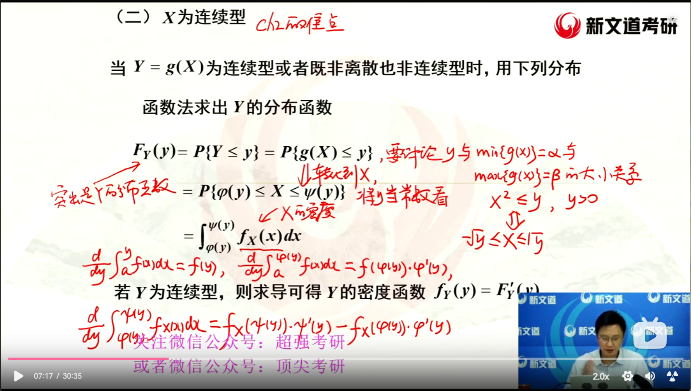
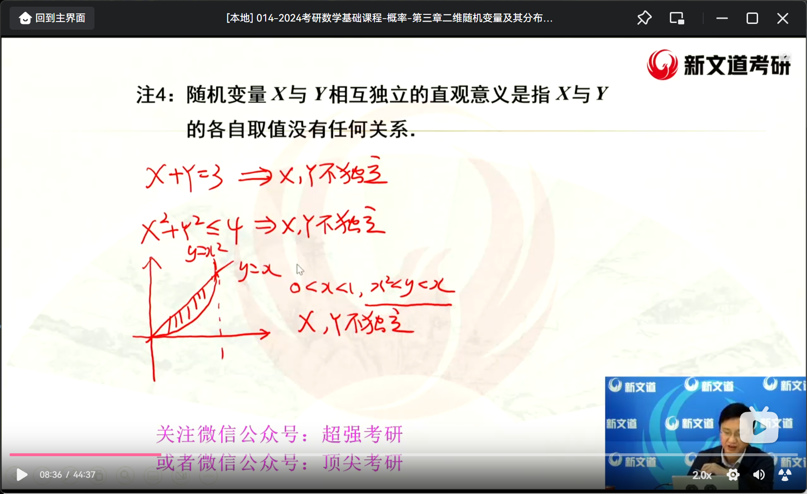
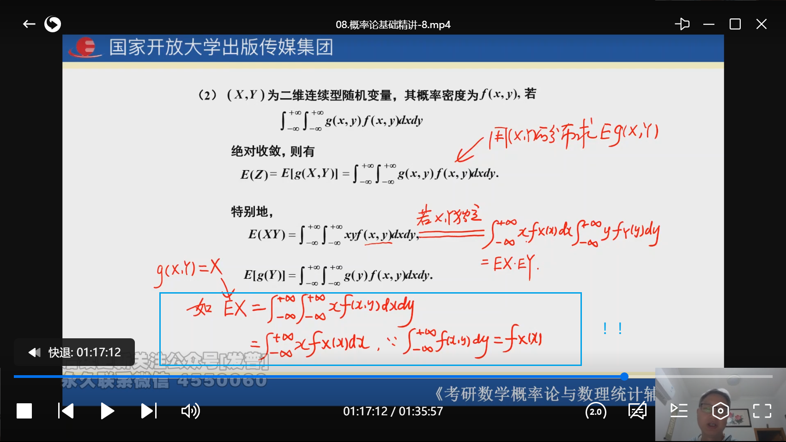

# 随机事件及其概率

- 随机事件
- 随机变量

## 样本空间、随机事件及相关运算

### 事件的关系与运算

1、事件的三种关系与四种运算

P1

注意上图第（6）点的笔记

例题解析：

##  概率和条件概率，古典概型和几何概型，全概率

P3

### 概率的概念

### 古典概型和几何概型

P4

上图第（3）个小题可以使用减法公式计算

补充例题：

几何概型与定积分的几何应用：P6例1.7

### 条件概率与概率的乘法公式

缩减样本空间法（适用于解数字很小、较简单的问题）：P6例1.8

注意“xx次才...”的体型，言下之意前面两次也是要计算概率的：P7例1.9

### 全概率公式与贝叶斯公式

P7

全概率公式：由原因找结果；

贝叶斯公式★：由结果总结原因；

注意上面蓝框内容，前面A1、A2、...是完备事件因此概率加和为1，后面的概率加和大于1，那是因为后面是条件概率，来自不同的样本空间。

## 事件独立性，独立重复试验

P8

### 事件的独立性

独立与互斥的关系：

P(A)=0时，A天然地与其他事件独立，可能与其他事件互斥

例题解读：

### 独立重复实验和伯努利概型

伯努利：只有两种结果，要么发生要么不发生

独立实验：各次实验结果相互独立

P10

上图注释中还有对“有截止的伯努利”实验的解释

例题解析：

# 一维随机变量及其分布

## 随机变量、分布函数

P16

分布函数：

分布函数性质 P17

分布函数计算概率 P17

注意上面的P{X = x0}是怎么算的

##  离散型随机变量及其概率分布

P18

二项分布：

## 泊松定理（仅1992年考过）

P20

泊松分布特定情况下（n较大、p较小、np适中）可以表示为二项分布，且λ=np

## 连续型随机变量及其概率分布

P21

密度函数开区间、闭区间都对（包括左开右闭、左闭右开），如例题：

连续性随机变量概率计算：

注意上面第二点，说明了两个问题：1、连续型随机变量计算概率的时候不需要在意开区间、闭区间；2、可以通过计算面积计算概率；

重点例题：

注意，离散型r.v（r.v.表示随机变量）取出正概率点；连续型r.v.取概率密度大于0的x；

事件可以推出概率的关系，但由概率推不出事件的关系：

指数分布的现实意义：电子元件寿命（指数分布具有”无记忆性“，解释：已经活了5岁，再活到10岁的概率跟前5岁无关）

正态分布，P24

标准正态分布：

注意，最好记住标准正态分布中x为0、1、1.645、1.96的值

用公式做是万能的，例题：

## 随机变量函数的分布

P25

### X为离散型

P25

### X为连续型★

P26

X为正态，Y=aX + b也为正态，X+Y未必正态：

上图还提到了期望和方差，关于期望、方差、标准差、协方差参考：

https://blog.csdn.net/poisonchry/article/details/119027117（概率论基础 —— 8.数学期望、方差、协方差）

这里开始换了26年概率论教学视频

浙大教材中有该定理，考试不考：

# 二维随机变量及其分布

## 多维随机变量及其分布

P33

联合分布律可以推出边缘分布律，反过来不行：

## 二维随机变量的概率分布、边缘分布和条件分布

FX(x)与F(x,y)的关系以及FY(y)与F(x,y)的关系：

注意这种情况不属于条件概率，这种情况只是限定了Y=y0，直接对x积分就行了：

例题讲解：

这里还讨论了以下X+Y和2X-Y的取值范围：

## 随机变量的独立性及不相关性

P40

X^2、Y^2独立推不出X、Y独立：

二维正态分布：

P43

注意上图最后笔记：二维正态分布边缘分布是一维正态分布

X服从正态分布，Y服从正态分布，且X、Y互相独立，则(X,Y)服从二维正态分布（ρ=0）：

## 二维均匀分布和二维正态分布

P42

## 随机变量简单函数的分布

P43

分布函数法，暴力求导公式

公式法，P45

例题解析：

注意上图：实际意义为串联电路寿命；

独立正态随机变量的线性组合仍为正态随机变量

红字部分为暴力求导，黑字部分为课件的求导：

卷积公式没必要记，直接用分布函数法+暴力求导

# 数字特征

## 数学期望（均值）

P55

绝对值是“增加发散性”的，绝对值收敛，去掉绝对值必收敛：

泊松分布数学期望：

几何分布实际意义：

打靶命中概率p为0.1，则期望EX为1/p = 10，意思就是平均下来要打10次命中：

连续型期望：

指数分布期望：

正态分布期望：

注意上图式子最后第二个积分，除了可以硬算得出0以外，还可以根据“反常积分，收敛的情况下，可以通过对称性、奇偶性简化计算”得出为0

会求随机变量函数的数学期望

二维随机变量期望（直接看视频讲解）：

注意g(xi)就相当于在说g(X,Y)=X，最后他用了法1、法2来解，法1更好理解，法2是公式

二维连续型随机变量（直接看视频讲解）：

例题讲解：

X，Y独立可以推出EXY = EX*EY，但反过来不行，下图就是一个经典的反例：

由于f(x,y)不是正矩形因此X，Y不独立

数学期望的性质，P58

## 方差

P58

正态分布方差应用：原本e^-x这种是很难算的，现在可以通过凑正态的方法计算出来！：

X、Y独立可以推出D(X +- Y) = D(X) + D(Y)，但反之不然：

注意上图第5点，要记得EX反映r.v. X取值的中心位置，g(t)反映了X对于t的偏离程度，当t为期望时，g(t)即为方差DX，此时偏离程度最低：

## 常见分布的期望与方差

P60

## 协方差

P60

注意蓝框的公式就有作用了！

协方差性质：

## 相关系数

P61

期望反映均值、方差反映中心偏离度，协方差没说反映什么，为了消除协方差的倍数影响例如：Cov(2X,2Y) = 4Cov(X,Y)，引入了相关系数，即标准化后的协方差（看视频讲解）：

相关系数反映X，Y的线性关系的紧密程度

相关系数性质（看视频讲解）：

独立是无任何关系，不相关是无线性关系（无线性关系但可能有别的关系），两者不同，独立能推出不相关（独立是不相关的充分条件，不相关是独立的必要条件），但不相关推不出独立

但当（X，Y）服从二维正态分布时，X、Y相互独立与X和Y不相关是等价的

例题讲解：

注意看右上角 期望 -> 方差 -> 协方差 -> 相关系数，期望是最原始的，因此最好用的是期望，所以第一小问，最好用的就是期望公式EXY = EXEY

## 矩

P62

## 随机变量的标准化

P62

# 大数定律和中心极限定理

P68

## 切比雪夫不等式

## 依概率收敛

P69

直接听视频讲解：

## 大数定律

P69

切比雪夫、辛钦、伯努利大数定律的结论，P69

随机变量的算术平均（n个相加除以n）依概率收敛于他的数学期望（取值稳定在他的数学期望附近）

## 中心极限定理

P70

大量随机变量的和近似于正态分布

# 数理统计的基本概念

P72

现实案例：

学校总共20000人，想要统计身高，20000个人全部测试显然太麻烦了，因此随机抽取100人进行测量，此时总体X即为20000，样本即为100

看到简单随机样本就要反应过来是“独立同分布”

## 总体、样本、统计量、样本均值、方差、样本矩

P72

统计量，例题讲解：

常见统计量：

记住上图最后一行的三个公式

无偏估计（数一）：

样本均值（X Bar）是总体均值的无偏估计，样本方差是总体方差的无偏估计

顺序统计量：

案例：评分后，去掉一个最高最低分

## 卡方分布、t分布和F分布以及上侧α分位数

P74

分母开根号肯定是T分布

F分布：

上侧α分位点（查表）（0<α<1），P76

Uα表示点α右边的面积

要理解什么叫上侧α分位点什么叫下侧α分位点，考纲上要求的是上侧

## 正态总体的抽样分布

P77

死记硬背

X bar叫样本均值，μ叫总体均值；σ叫总体标准差，S叫样本标准差

证明第4个：

双正态总体，别记，推一下：

# 参数估计

## 参数的点估计、估计量与估计值

P81

点估计就是一个点估计另外一个点

## 矩估计和最大似然估计

P81

方法：

重点关注一阶矩：

为啥答案会不唯一？例题：

注意理解上面X假设为2万人，X bar只取100人用来估计2万人的身高

继续：

例题解析：

似然函数dxi为啥可以丢掉？因为dxi是常数，跟未知数θ没有多大关系（事实上我们需要考虑的是θ的最大值），因此直接丢掉：

最大似然估计不变其实本质就是驻点不变：

例题解析，P83：

注意上面第二小问的答题技巧，先设观测值x1、x2、...

补充例题：

注意上图，θ取最小值为样本的最大值（将θ比作门的高度，将样本比作人的样本，门再矮也不能低于最高的那个人）

例题7.4，P84：

## 估计量的评价标准

常用结论：

有效性和一致性（相合性）：

## 置信区间

正态总体下的置信区间：

