# 行列式

P2

逆序、逆序数与偶排列、奇排列，P3

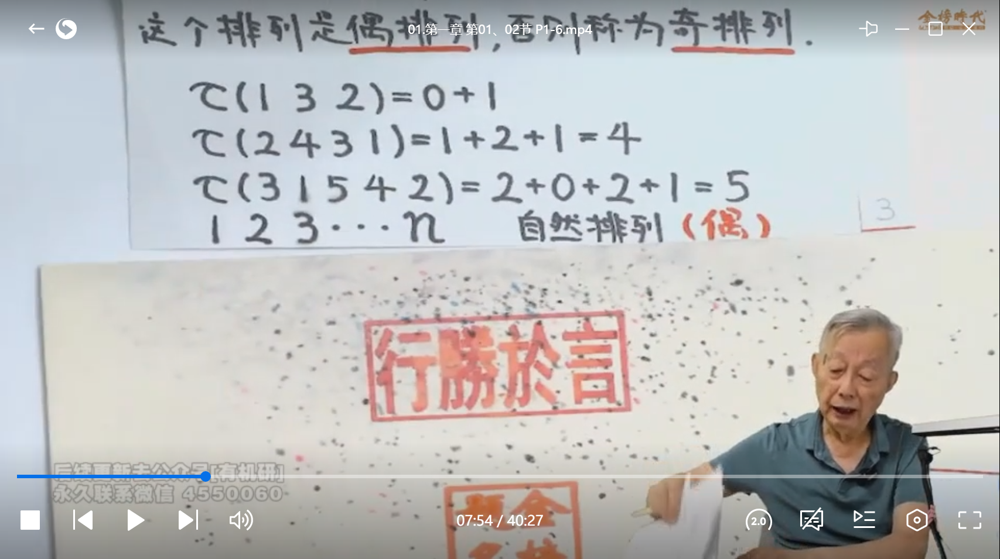

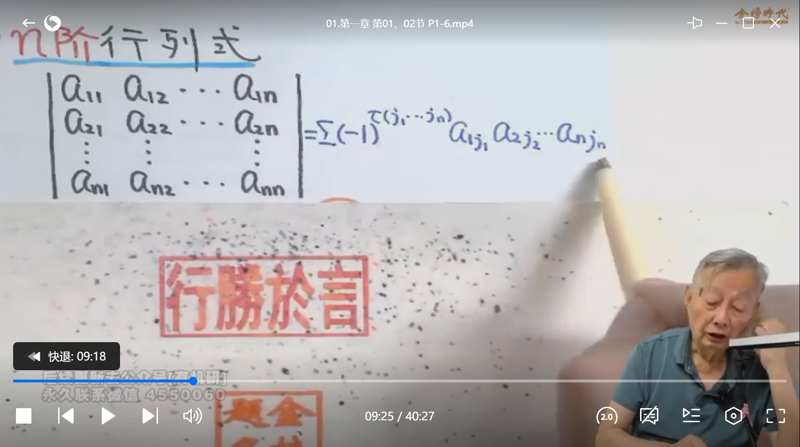

n阶副对角线行列式逆序数公式：

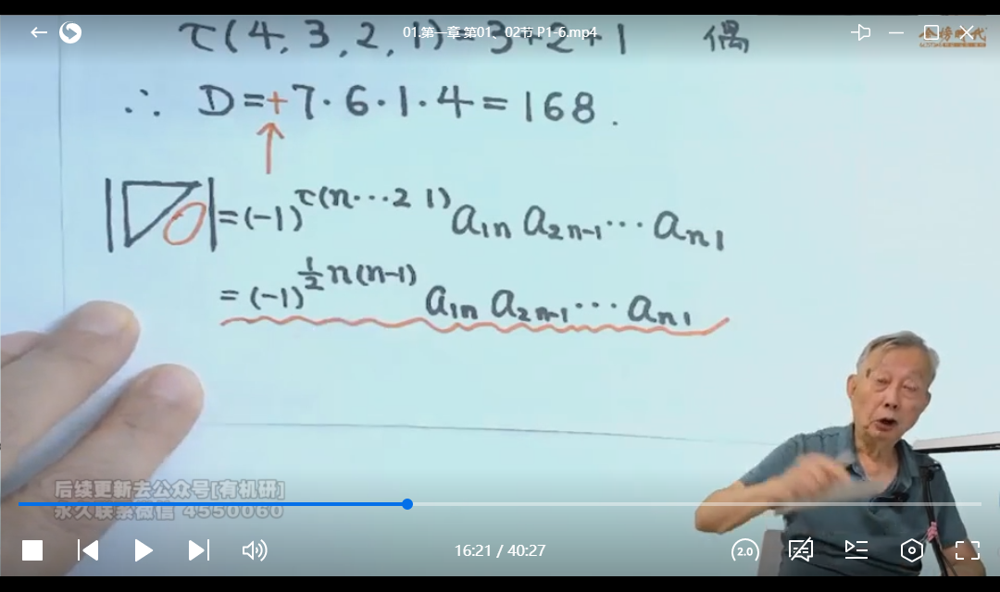

## 行列式的性质

P4

二阶行列式代表两个向量组成的平行四边形有向面积，三阶行列式代表三个向量组成的平行六面体的有向体积

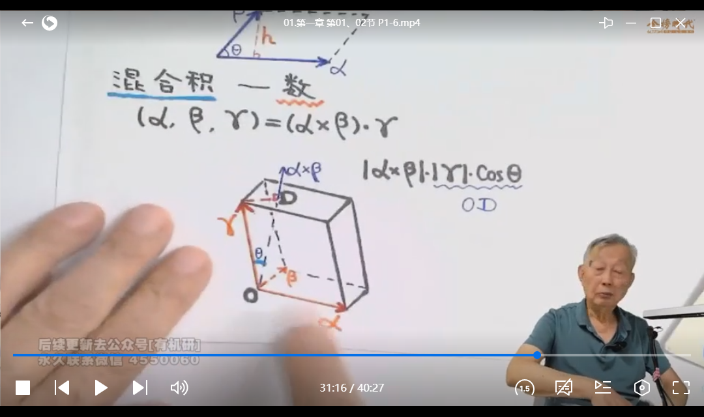

代数余子式，P7

## 行列式按行（按列）展开公式

背展开公式，P7

Aij与aij的数值大小无关，潜在考点：两行列式存在相同Aij，计算出其中一个后代换到另一个行列式中进一步计算：

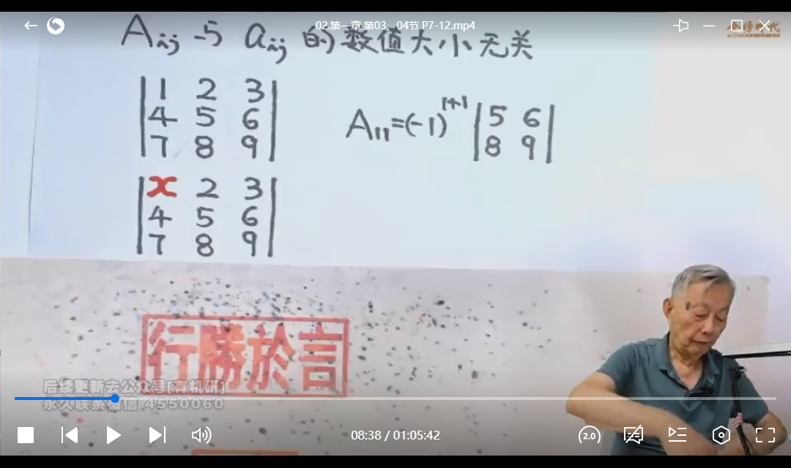

某一行所有元素与另一行相应元素的代数余子式乘积之和等于0：

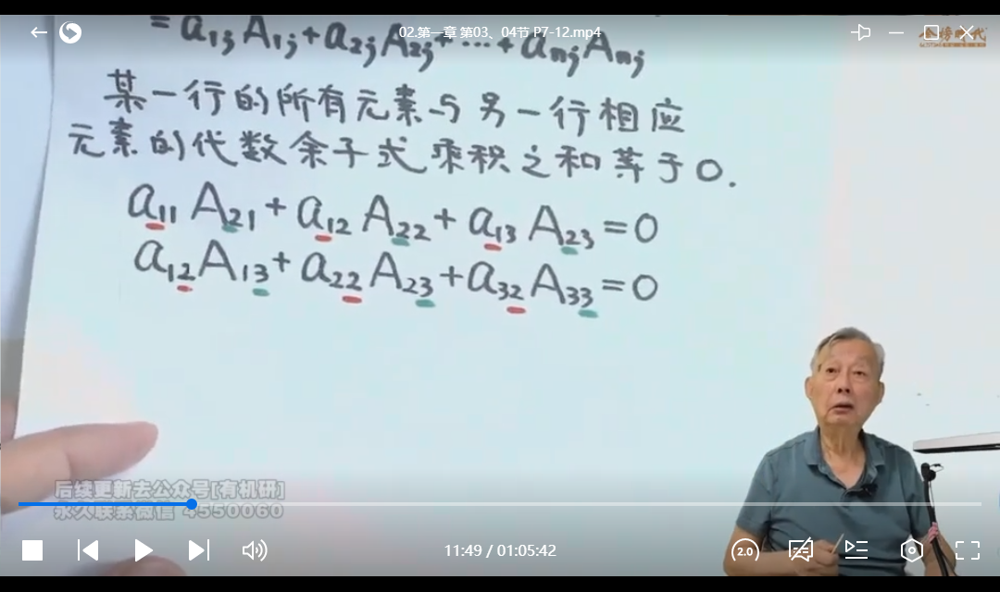

P7 重要公式：

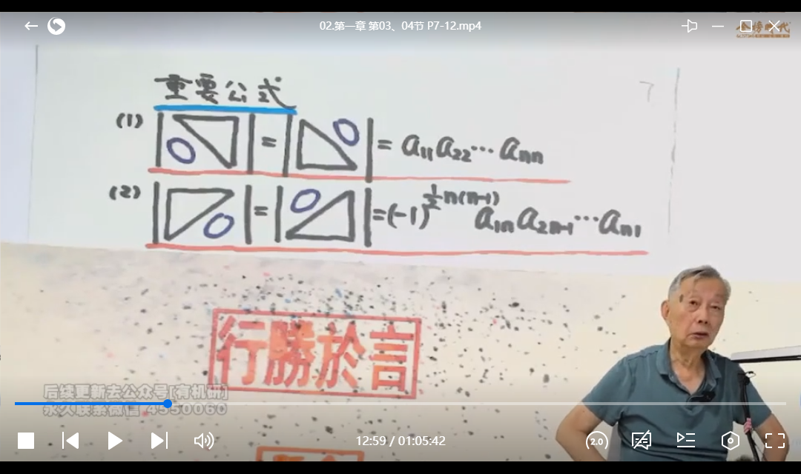

范德蒙补充例题：

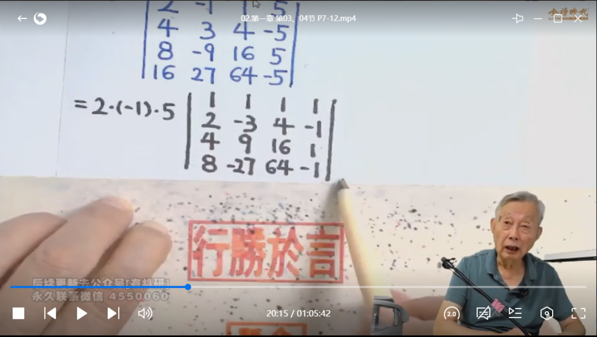

爪型行列式形状：

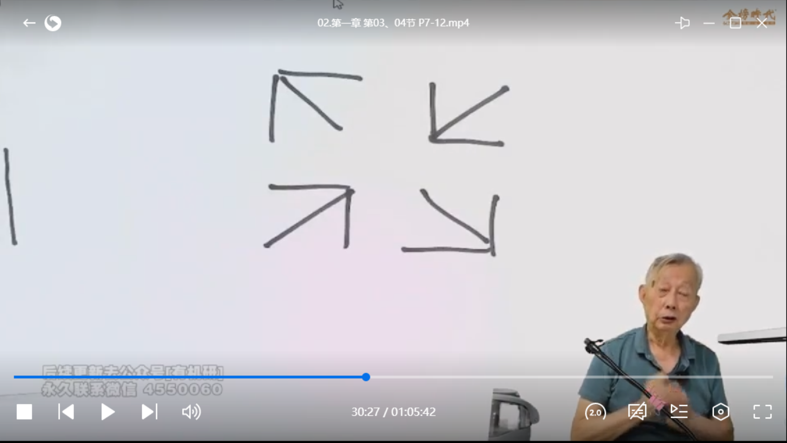

|AB\BA| 对称矩阵处理方法：

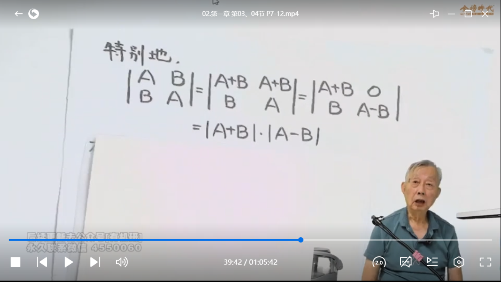

原理：

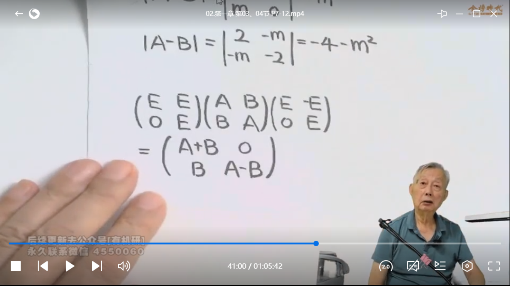

等价与上图

例题：

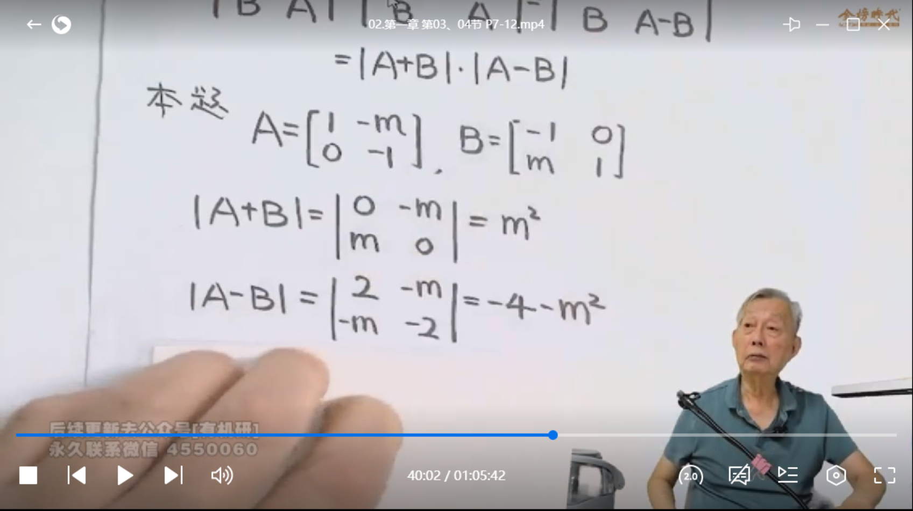

例题补充：

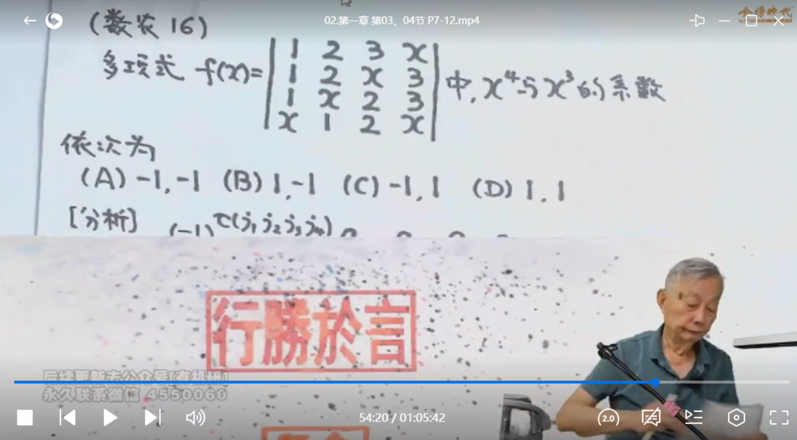

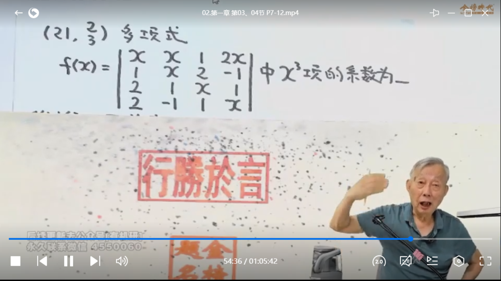

法一看视频，法二：

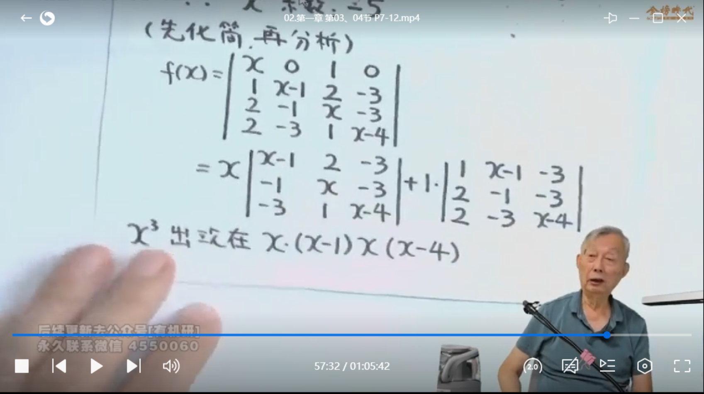

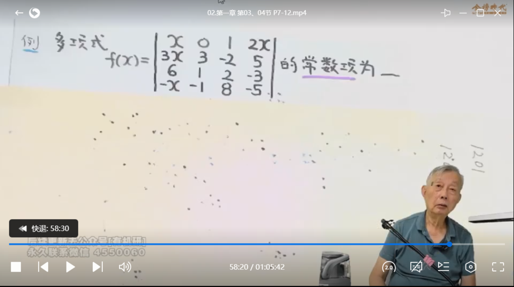

法一看视频，法二：

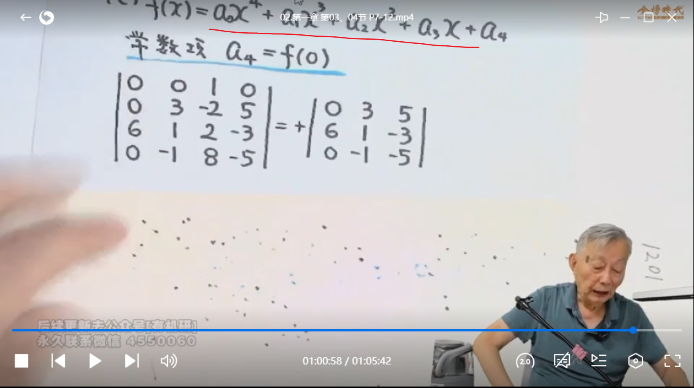

由于求的是常数项，x都取0即可

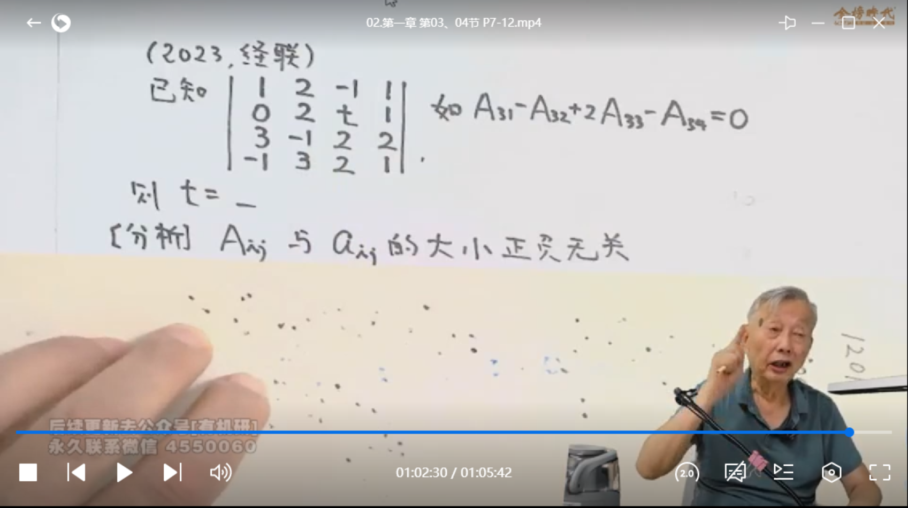