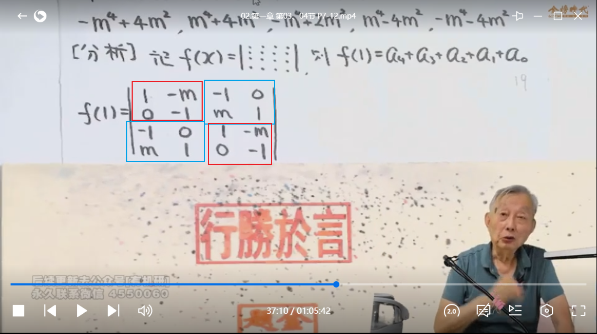
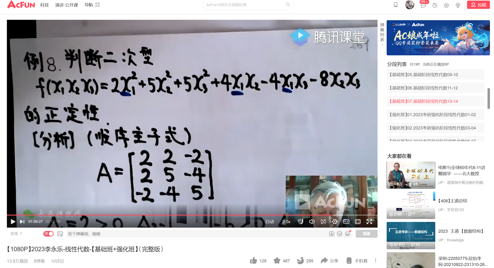
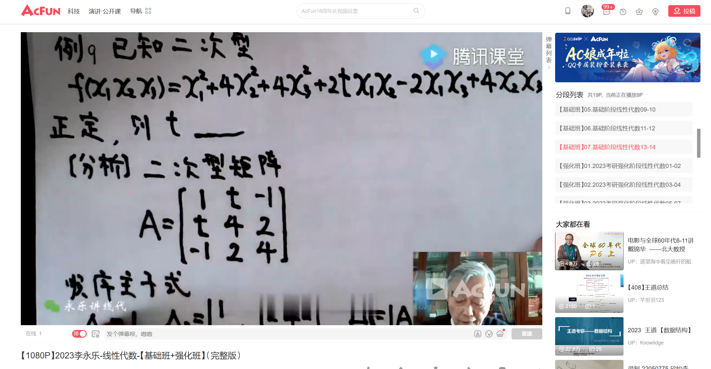

# 行列式

P2

逆序、逆序数与偶排列、奇排列，P3

n阶副对角线行列式逆序数公式：

## 行列式的性质

P4

二阶行列式代表两个向量组成的平行四边形有向面积，三阶行列式代表三个向量组成的平行六面体的有向体积

代数余子式，P7

## 行列式按行（按列）展开公式

背展开公式，P7

Aij与aij的数值大小无关，潜在考点：两行列式存在相同Aij，计算出其中一个后代换到另一个行列式中进一步计算：

某一行所有元素与另一行相应元素的代数余子式乘积之和等于0：

P7 重要公式：

范德蒙补充例题：

爪型行列式形状：

|AB\BA| 对称矩阵处理方法：

等价于以下计算步骤：

例题：

例题补充：

法一看视频，法二：

法一看视频，法二：

由于求的是常数项，x都取0即可

# 矩阵

对角矩阵具有交换律

对角矩阵其他性质：

## 分块矩阵

1、横一刀竖一刀，主对角线两个是方阵或副对角线两个是方阵；

2、按列分，一般是解方程组；

3、如果是求向量、秩，可以按列分也可以按行分；

## 矩阵的秩

# 向量

例题补充：

# 线性方程组

有时候用常规方法求通解时我们会凑首元1，但可能会产生分数，此时其实可以用凑单位矩阵的方法避免分数降低计算量：

除了有方程组的考法，还有一种是无方程组的考法：

例题补充：

# 特征值与特征向量

定理：

# 实对称矩阵

例题：

## 正交矩阵

正交矩阵转置就是逆

# 相似矩阵

例题：

# 二次型

任意一个n元二次型矩阵A，一定存在正交变换x = Qy，将其化为标准型B

且B的平方和系数就是A的特征值：

总结：

1、要求正交变换的标准型，其实就是求特征值（特征值就是平方和系数）；

2、要求正交变换x=Qy中的Q矩阵，其实就是求特征向量；

## 配方法化二次型

当没有平方项时：

注意这里的x3 = y3是为了保证系数项行列式不得0

注意上图z3（为什么会有z3？是为了坐标变换的完整性，看视频解释）

最终变换矩阵c矩阵由x的变换矩阵c1和y的变换矩阵c2乘积得出

## 规范型

求规范型步骤：1、先用一次坐标变换求标准型；2、再用一次“伸缩”坐标变换求规范型；总共用2次坐标变换

但如果是配方法得到的标准型，则可以一步到位直接得出规范型：

## 正负惯性指数

求正负惯性指数有两种方法：

1、求特征值；

2、配方法；

## 正定二次型

正定必要条件：

例题：

平方和有负系数，一定不正定：

补充例题：

判断是否是正定二次型常规3种方法：

1、顺序主子式全大于0；

2、特征值全大于0；

3、配方法后得正惯性系数=n，负惯性系数=0；

补充例题：

## 标准型

定理：

## 合同

合同的性质：

合同的矩阵正负惯性指数相同：

# 公式

秩为1的矩阵：r(A)=1，A^2=LA，L = 主对角线之和

r(A) = 1,A^n = L^(n-1)A,L = 主对角线之和

