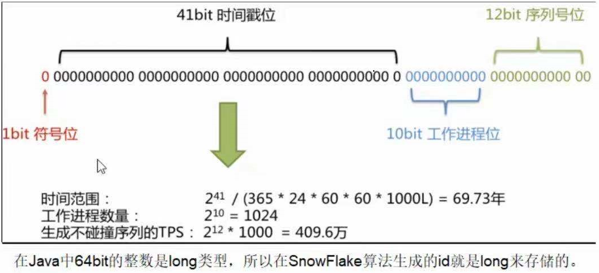

集群唯一ID主要要达到以下目的：

- ID生成规则部分硬性要求
  - 全局唯一
  - 趋势递增
  - 单调递增
  - 信息安全
  - 含时间戳
- ID生成系统的可用性要求
  - 高可用
  - 低延迟
  - 高QPS

# UUID

使用场景：单机部署

缺点：无序、密码长度大（32位），导致使用BTree建立索引的MySQL数据库不太好存这些东西，因为BTree建立索引的话字段内容最好是有序的，有序的话它比较好建立索引，如果无序的话容易造成片段空白

# 利用MYSQL的主键自增和replace into

`replace into`如果没有则新增如果有则先删除后新增

利用这个特性，可以配合`select LAST_INSERT_ID()`来得到依次递增的全局唯一ID

缺点：

- 虽然比起UUID小了（UUID一个ID就32位，现在一个ID可以从1开始计数），但是缺乏隐私性，由于ID是`1、2、3、4、5...`，别人一看就知道你的业务量多少，也能猜到后续的业务量的ID，很不安全，用在金融交易系统里是绝对不行的
- 横向扩展困难，横向扩展的话就需要指定步长，比方说有三台机器负责生成全局唯一ID，那么这三台机器的MySQL就要指定步长为3，也就是说第一台机器只生成`1、4、7、...`这样的ID，第二台生成`2、5、8、...`这样的ID，此时机器要横向扩展了，原先3台机器现在要扩成5台，那么步长势必要由3变成5，这样的话原先步长为3时产生的ID怎么办，规则就不统一了，不好维护。此外，如果某几台机器上的MySQL要分库分表了，怎么搞？我们可是要保证ID有序的，此时去分库分表，难度可想而知
- 代价太大，如果负责生成全局唯一ID的几台机器中有一台宕机了，那生成的ID可能就不连续了，要解决这个问题就需要集群高可用，为了生成一个ID而去维护一个MySQL集群得不偿失
- 速度太慢，每次生成ID都要读一次数据库，QPS一高就顶不住了

# 利用redis的incr和incrby

由于redis是单线程，天生就能保证原子性，而且速度快，所以确实可以用来生成全局唯一ID

缺点：

- 和上面MySQL一样，生成一个ID需要维护一个redis集群，有点得不偿失

# 雪花算法

twitter的分布式雪花算法Snowflake，经测试每秒能产生26万个自增可排序的ID

1、生成ID能按照时间有序生成

2、生成ID的结果是一个64bit大小的整数，为一个Long型（转换成字符串后长度最多19）

3、分布式系统内不会产生ID碰撞（由datacenterId和workerId作区分）并且效率较高

号段解析：

- 1bit

  不用，因为二进制中最高位是符号位，1表示负数，0表示正数

  生成ID一般都是用整数，所以最高位固定为0

- 41bit \- 时间戳，用来记录时间戳，毫秒级

  41位可以表示2^41\-1个数字

  如果只用来表示正整数（计算机中正数包含0），可以表示的数值范围是：0至2^41\-1，减一是因为可表示的数值范围是从0开始算的，而不是1

  也就是说41位可以表示2^41\-1个毫秒的值，转化成单位年则是`(2^41 - 1) / (1000 * 60 * 60 * 24 * 365) = 69年`

- 10bit \- 工作机器id，用来记录工作机器id

  可以部署在2^10 = 1024个节点，包括5位datacenterId（类比机房）和5位workerId（类比机房中的机器）

  5位（bit）可以表示的最大正整数是2^5\-1=31，即可以用`0、1、2、3、...31`这32个数字，来表示不同的datacenterId或workerId

- 12bit \- 序列号，用来记录同毫秒内产生的不同id

  12位（bit）可以表示的最大正整数是2^12\-1=4095，即可以用`0、1、2、3、...4094`这4095个数字来表示同一个机器同一时间戳（毫秒）内产生的4095个ID序号

**SnowFlake可以保证：**

所有生成的id按时间趋势递增

整个分布式系统内不会产生重复id（因为有datacenterId和workerId来做区分）

优点：

- 毫秒数在高位，自增序列在低位，整个ID都是趋势递增的
- 不依赖数据库等第三方系统，以服务的方式部署，稳定性更高，生成ID的性能也是非常高的
- 可以根据自身业务特性分配bit位，非常灵活

缺点：

- 依赖机器时钟，如果机器时钟回拨，会导致重复ID生成
- 在单机上是递增的，但是由于设计到分布式环境，每台机器上的时钟不可能完全同步，有时候会出现不是全局递增的情况（此缺点可以认为无所谓，一般分布式ID只要求趋势递增，并不会严格要求递增，90%的需求都只要求趋势递增）

# 其他

从上面的分析来看雪花算法应该是最好的方案了，但是仍旧存在机器时钟回拨问题，那么有以下两个替代方案：

- 百度开源的分布式唯一ID生成器UidGenerator
- Leaf美团点评分布式ID生成系统