# 一、基础知识

##  领域与去心邻域

## 特殊函数

1、符号函数；

2、Dirichlet狄利克雷函数；

3、取整函数；

取整函数：

## 反函数

函数严格单调，则一定存在反函数

## 基本初等函数★

不能再拆的函数

## 函数的初等性质

### 有界性

### 奇偶性

注意在谈论函数奇偶性之前，其定义域必须关于原点对称！

### 单调性

### 周期性

## 极限

一定要注意定义！

### 数列极限

### 函数极限

### 基本性质

- 唯一性
- 有界性
- 保号性★

### 运算性质

- 四则运算性质
- 复合运算性质

## 无穷小和无穷大

无穷大的两种定义方法：

### 无穷小一般性质

### 无穷小等价性质

## 极限存在准则与重要极限★

### 夹逼定理

- 数列型夹逼定理

- 函数型夹逼定理

什么时候用夹逼定理？

总结：

分子齐次，分母不齐，可以用夹逼

此时用夹逼的时候，齐的分子别动，改非齐的分母

而如果分子、分母都齐次，分母比分子刚好多一次，则用定积分定义

### 单调有界定理

补充例题：

重点记忆：

## 连续与间断

### 闭区间上连续函数的性质

如果出现函数值相加的，基本上都使用介值定理

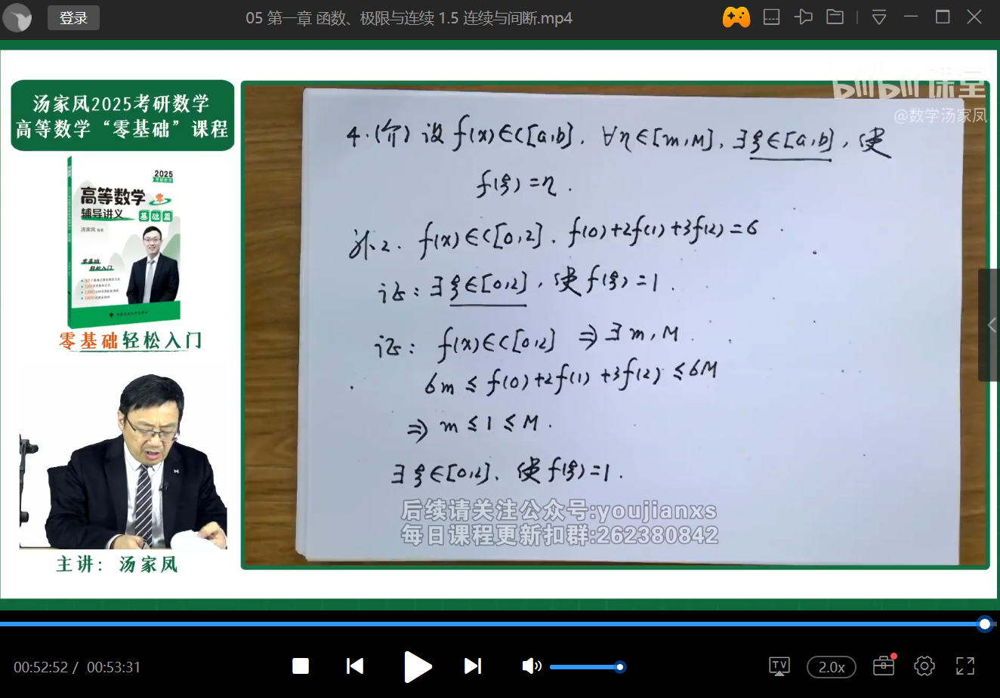

# 二、导数与微分

### 导数

### 微分

### 复合函数求导法则（链式法则）

### 反函数的导数

### 隐函数及其导数

### 参数方程确定的函数及其导数

# 三、中值定理与导数的应用

## 中值定理与洛必达法则

罗尔定理

拉格朗日中值定理

见到函数值相减的，直接拉格朗日

补充例题：

柯西中值定理

柯西中值定理证明以及例题补充：

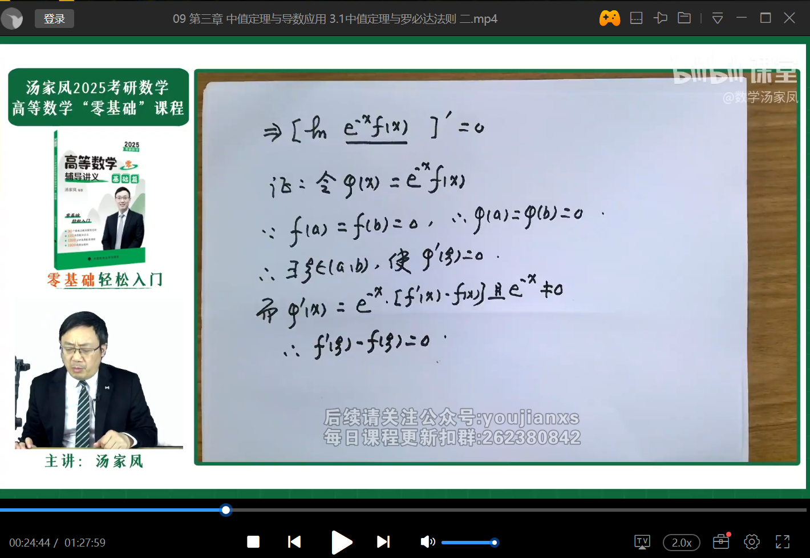

使用情况总结：

1、f(b) - f(a)或f(a) != f(b)：用拉格朗日

2、见下图：

3、见下图：

## 泰勒中值定理

余项可以表达成拉格朗日型余项与皮佩亚诺型余项，如上图

x0取0时，表达式即为麦克劳林公式，由麦克劳林公式可推导出几个函数的展开式：

补充例题：

## 洛必达法则

快慢排序：

对数函数 < 幂函数 < 指数函数

洛必达法则（0/0型）：

洛必达不一定可靠，必须满足上图三个条件！

例子：

洛必达法则（∞/∞型，一般很少用洛必达法则求解）：

反例：

不使用洛必达法则例题：

## 导数的应用

- 单调性（P51）
- 通过一阶导数判定单调性（P51）

- 求单调区间步骤

- 极值判别定理（P51）

​	第一充分条件、第二充分条件

- 凹凸性（P53）
  - 拐点
  - 凹凸性判别法及其证明

## 曲线的渐近线

- 水平渐近线（与斜渐近线互斥）
- 铅直渐近线
- 斜渐近线（与水平渐近线互斥）

补充例题：

## 弧微分与曲率

# 四、不定积分

连续函数一定存在原函数，反过来不对！见P62举例说明。

## 三角函数的公式

这两个是补充的，教材上好像没有：

## 不定积分积分法

### 换元法

1、第一类换元积分法

2、第二类换元积分法P66

一般无理转有理时需要用到第二类换元积分法，但也有个例！如上图Case1

第二类换元积分法最常见的是平方和、平方差的三角代换

补充例题：

### 分部积分法

使用场景：

- 幂函数*指数函数

- 幂函数*对数函数

- 幂函数*三角函数

- 幂函数*反三角函数

- 指数*（sin/cos）

  这个比较特殊，需要循环积分

  

## 有理函数不定积分

当分母无法因式分解时：

1、分子只剩数字了，此时可以直接将分母配方：

2、分子还存在x，此时需要将分子凑出一个可以跟分母约掉的东西，使得约掉后分子只剩数字（就适用第1种情况了）：

有时候灵活凑分子分母也可以解题：

# 五、定积分及应用

## 定积分的基本概念与一般性质

P75

### 定积分产生背景

### 定积分的定义

由于有界是个很弱的条件（换句话说，有界不能保证极限一定存在），表现在定义中：

注意这里的特殊假定条件为：0到1上定积分

此时得出一个重要的结论：

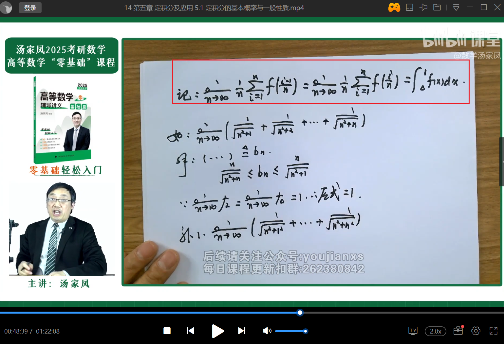

结论：

1、分子齐次、分母不齐，则用夹逼；

2、分子、分母都齐次，分母比分子刚好多一次，则用定积分定义；

### 定积分一般性质

P77

啥时候用积分中值定理？

补充例题：

## 定积分基本定理与定积分的特殊性质

P78

### 变积分限的函数

积分上限函数

注意上面第三点，当积分对象是t的时候，函数里的x就是积分上限x

### 定积分基本定理

1、如果一个函数是连续函数，那么他的变积分限函数就是可导函数；

2、闭区间连续函数，百分之百有原函数；

牛顿-莱布尼茨公式P80：

起源：定积分通过定义（λ趋于0那个）计算困难

### 定积分的积分法

P80

1、换元积分法

补充例题：

2、分部积分法

### 定积分的特殊性质

P81

1、对称区间的定积分性质

​	奇偶性性质

2、三角函数的定积分性质

注意一个特别重要的技巧：

证明：

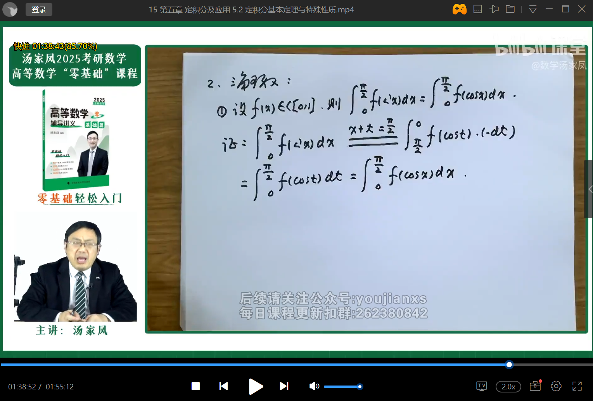

两边取微分可以得到dx = -dt：

补充例题：

## 反常积分

### 区间无限的反常积分

什么是正常积分？什么是反常积分？

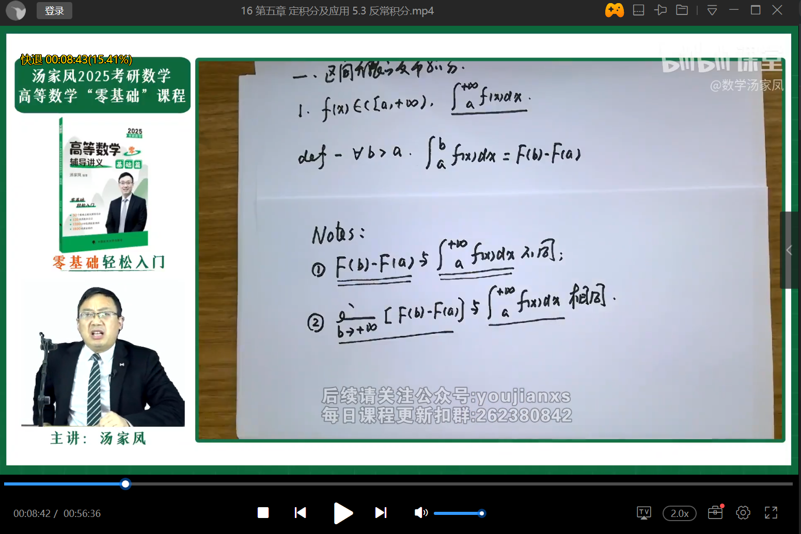

而有的时候积分是积不出来的，那就更别谈用定义去判定其收敛还是发散了。这个时候判别法就有用了：

积分区间左侧无限的反常积分同右侧。

积分区间左右无限的反常积分P84

### 无界函数的反常积分

区间有限，函数有无穷间断点

判别法：

## 定积分的几何应用

### 面积

例题补充解法：

法一用的是直角坐标求解，法二用的极坐标求解

小结：

1、记：注意看上图，参数为a、b的椭圆面积积出来就是`pai*a*b`；

2、积分种分子分母有cos平方、sin平方的，直接同除以cos平方；

### 体积

绕x轴旋转

绕y轴旋转

注意上图倒数第三步还用到了奇偶性来加速运算

### 极坐标转换

dxdy转化成rdrdθ的原理：

- 几何法：极坐标微元情况下想象成扇形面积，而扇形在微元下就是矩形，因此面积dA=长*宽=rdθ * dr
- 雅可比矩阵：dx、dy可理解为一组向量基底，dA=dxdy=平行四边形面积=向量dx 叉乘 向量dy，dx、dy换基底为dr、dθ时，x、y分别对r、θ的偏导数即x、y在r、θ上的分量，这些分量构成了雅可比矩阵J，其行列式为|J|，dxdy=|J|drdθ（drdθ是面积微元）。同理其他变换也可以通过雅可比矩阵计算得出，例如算球面坐标、柱形坐标变换

# 六、微分方程

## 微分方程的基本概念与一阶微分方程

### 基本概念

P91

### 一阶微分方程的种类及解法（或通解公式）

1、可分离变量的微分方程；

补充例题：

2、齐次微分方程；

3、一阶齐次线性微分方程；

P94

4、一阶非齐次线性微分方程；

P94

补充例题：

## 可降阶的高阶微分方程

P95

经典例题：

## 高阶线性微分方程

P96

### 基本概念

### 二阶线性微分方程的解的结构

### 二阶常系数线性微分方程

- 齐次

  记通解公式

- 非齐次

  记特解求法

  推导参考：https://blog.csdn.net/qq_39377889/article/details/128825113（二阶常系数非齐次线性微分方程的解）

非齐次特解类型一：

# 多元函数微分学

## 多元函数微分学基本概念

### 基本概念

P103

1、领域与去心领域

2、二元函数的极限

注意一元函数极限有一个充要条件而二元函数则没有（原因是一元函数只有左右两个方向而二元由于方向太多了所以没法确定），如下图：

3、二元函数的连续性

P104

4、偏导数

P104

5、高阶偏导数

P105

### 有界闭区域上二元连续函数的性质

有界闭区域的定义

一元连续函数性质二元全部都有，其中零点定理在二元维度上不太重要

## 全微分

### 定义

一元：

二元：

P107

微分公式中A和B到底是啥：

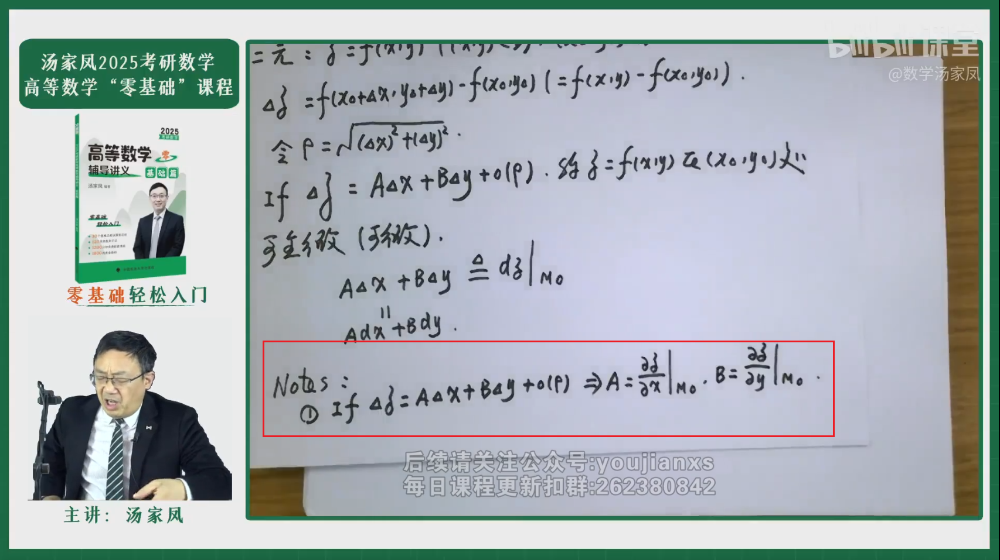

全微分：

### 二元函数连续、可偏导、可微之间的关系

连续和可偏导不能互推的反例：

## 多元函数求导法则

### 复合函数求导法则

P109

上图红圈：

①：对于z是二元函数，对于f是一元函数；

②：对于z是一元函数，对于f是二元函数；

③：对于z是二元函数，对于f是二元函数；

总结：对于z，看右边式子字母个数确定是几元函数；对于f，看括号中逗号个数确定是几元函数；

复合函数求导简写，f1、f2、f11、f22、f12、f21：

例题：

f12 = f21：

### 隐函数（组）确定的函数求导法则

P110

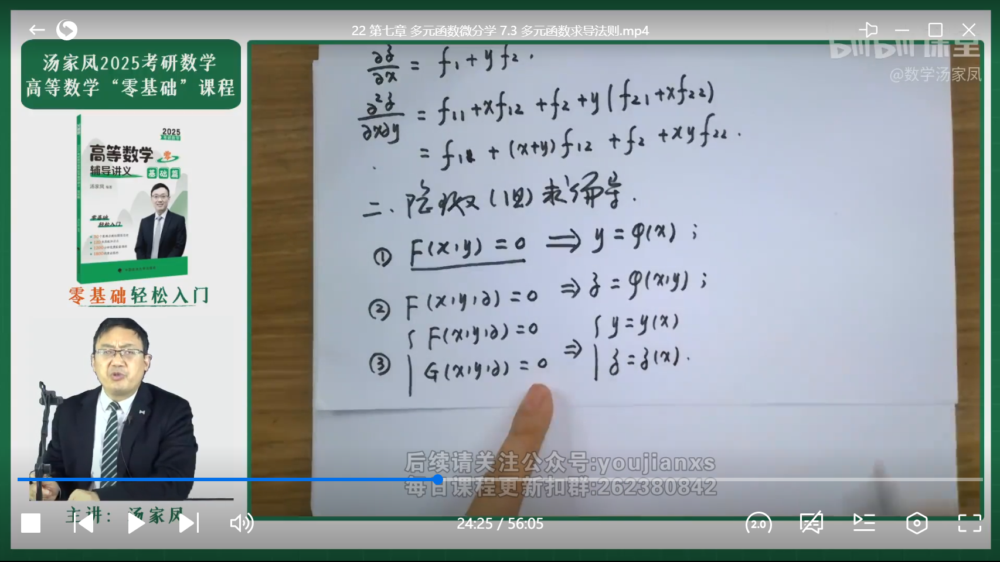

补充例题：

## 多元函数的极值

P111

### 定义

### 无条件极值

- 无条件极值的定义

  只能是二元函数；定义域必须是开区域；

- 无条件极值的判别定理

  P111

### 条件极值

不一定是二元函数

P112

# 二重积分

P118

## 二重积分的概念与性质

补充例题：

## 二重积分的计算方法

P120

### 直角坐标法

看情况取X型/Y型计算方法：

如果发现被积函数积不出来，需要跟换积分次序：

### 极坐标法

P122

补充例题：

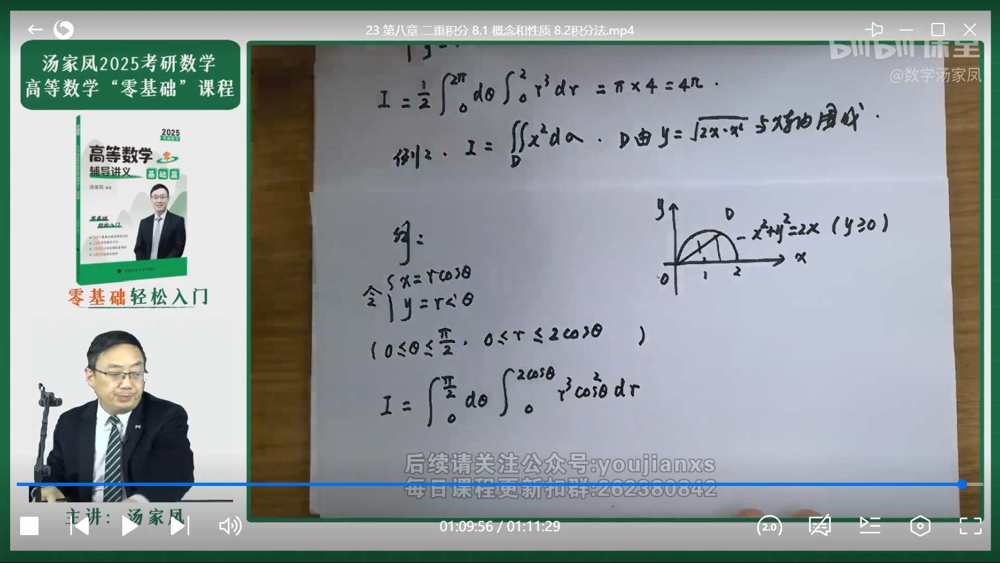

## 曲面积分推导

# 总结

1、开区间->零点定理、罗尔/拉格朗日/柯西/泰勒

2、闭区间->介值定理

## 第一章

不定型极限计算问题：

1、x、sin x、tan x、arcsin x、arctan x中任意两个函数之差为3阶无穷小

## 第二章

## 第三章

## 第四章

## 第五章

看下120-140页的题目

1、

2、

3、

4、

## 第六章

1、

2、

 ## 第七章

1、

2、

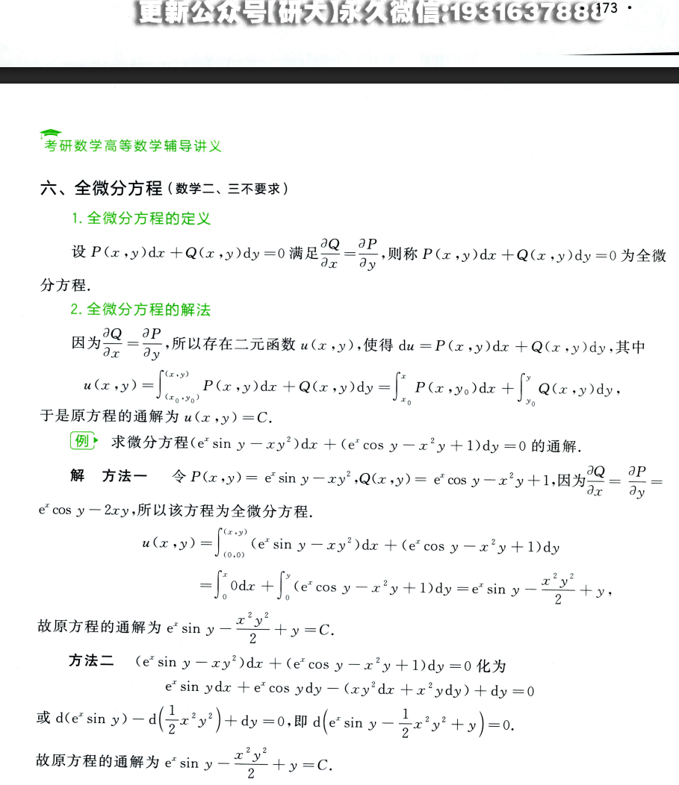

3、

4、注意该题的解题思路

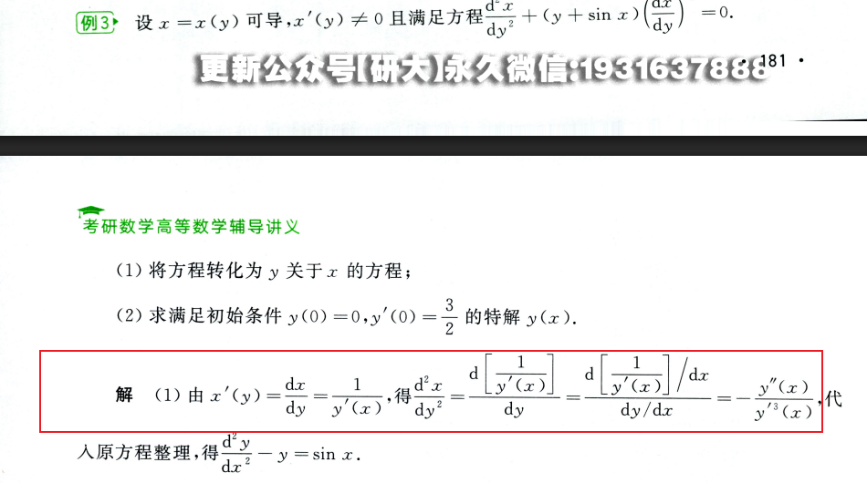

## 第九章

1、

积分审敛法？

2、

3、

4、

5、

## 第十章

1、

2、

3、

## 第十一章

1、P253

2、

3、P256

4、P257

二重积分法（格林公式）

5、

曲线积分与路径无关的条件

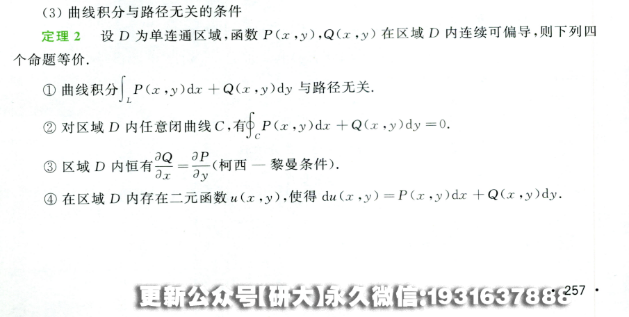

6、P259

两类曲线积分之间的关系

7、P259

三维空间对坐标的曲线积分的计算以及斯塔克斯公式

TODO

8、P261

对面积的曲面积分的计算方法

# 难题

1、

2、

3、

4、

5、注意这里用到的反证法技巧

6、

7、

8、

9、

10、

11、

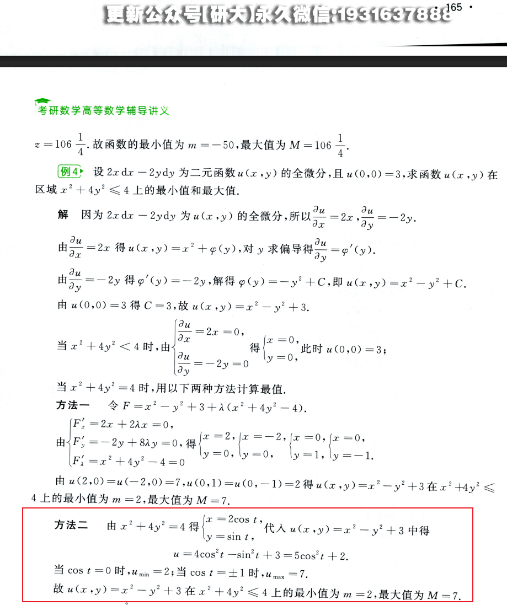

12、

这里的例1、2、3都很难

13、场论

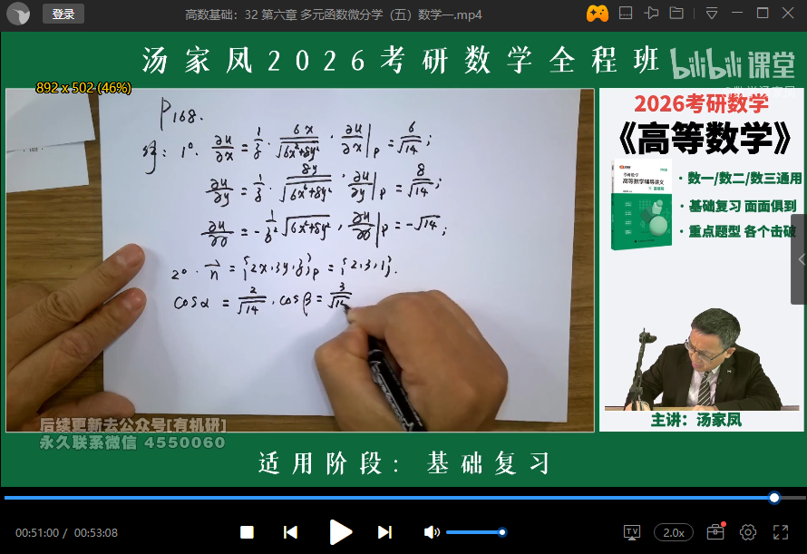

14、

15、P185 物理应用所有例题

重点看一下建模思路

借助共轭无理数特性求解：

16、

17、

18、

19、

20、

21、

22、

23、

数三

24、

25、

26、曲面积分巨难的一道题

思路：1、根据曲面积分公式，知道要找z（z关于x、y的函数就是我们要找的表面积，且z<=a）；2、找到D（即x、y的约束条件，此题大圆就是约束，大圆与小圆交线就是约束的代数表达式）；

27、

28、

思路：目的是通过线的方程（说白了就是x、y、z的关系式）求出曲面的表达式，有了曲面表达式后后面都简单。1、用符号指代曲面方便后面书写；

2、设曲面上点A坐标及其对应在线上的点A坐标，并找出他们两的关系，结果发现由于沿z轴旋转，这两个坐标形成的圆的圆心都正好在z轴上；

3、由此为突破点列出方程式`x^2+y^2=x0^2+y0^2`与线L的方程联立即可得出曲面表达式；

29、

30、

31、

32、

33、

34、

35、

36、

注意，这里第一问级数展开必须写成和函数，否则很难表达n区域无穷，最终很可能会得出结论为n/(1+n)，显然这个结论错误，因为n要趋于无穷！

37、

38、

39、

40、

41、

42、

43、

44、

45、

46、

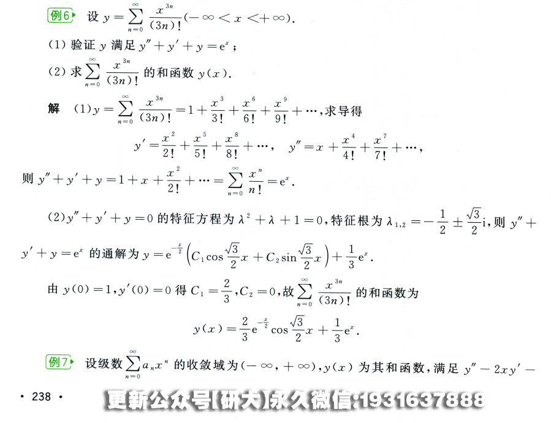

47、

48、

这题的收敛证明没看懂

49、

50、

51、

52、

53、

54、

55、

56、P251

57、

# 辅助函数

1、

